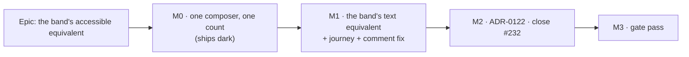

# Implementation Plan: The WBS band's accessible equivalent

- **Feature spec:** [./feature-spec.md](./feature-spec.md) — **awaiting approval**
- **Status:** Draft
- **Owner:** web
- **Register row:** `docs/TECH_DEBT.md` #232

## Breakdown

### Epic

**The WBS band's accessible equivalent** — give the diagram's WBS band a text equivalent that
exists, correct the two places that say it already does, and make the diagram and the Gantt name the
plan's unfiled work from one function. Roadmap theme: accessibility conformance on the primary
surface (WCAG 2.2 AA, `CLAUDE.md` §13).

---

## Milestone M0 — One composer, one count

**Outcome:** the bucket's accessible name is produced by one shared function, and the band's group
rows carry a member count. No behaviour changes anywhere.

**Entry point:** **Ships dark.** Nothing new is reachable. The Gantt's bucket row reads exactly as
it did (the same string, from a function instead of a literal); the band gains a field nothing yet
reads. M1 surfaces it. _(ADR-0081 §1 — this is the "declares itself dark" branch, and the claim is
checkable: the milestone adds no JSX and no new element.)_

**Journey:** none, correctly — there is no user-facing capability to drive. The Gantt's **existing**
suites are this milestone's oracle, and they are not edited.

---

#### Feature: the shared name, and the count on the band's rows

> **Description:** extract `GanttPanel.tsx:1338`'s inline template literal into
> `features/wbs/model/wbs-group-name.ts`; add `count` to `WbsBandGroupInput`.
> **Complexity:** S
> **Dependencies:** none — everything it touches is shipped.
> **Risks:** the extraction changes the Gantt's string by accident → mitigated by leaving every
> existing Gantt assertion untouched, so any difference fails an already-green suite (the ADR-0078
> barrel-preserving argument: a refactor changes no behaviour and no test assertion).
> **Testing requirements:** the Gantt's existing suites pass unedited; a small unit suite on the
> composer for singular/plural and zero; a structural test that both call sites use it.

##### Task M0-T1 — Extract `wbsGroupAccessibleName` (≈ one PR with M0-T2)

- **Description:** new pure module `apps/web/src/features/wbs/model/wbs-group-name.ts` exporting
  `wbsGroupAccessibleName({ label, count }: { label: string; count: number }): string`, returning
  `` `${label}, ${count} ${count === 1 ? 'activity' : 'activities'}` `` — **character-identical** to
  what `GanttPanel.tsx:1338` produces today. Point `GanttBucketRowView` at it.
- **Complexity:** S
- **Dependencies:** none
- **Risks:** the comment at `GanttPanel.tsx:1336-1338` explains *why* the count is part of the name
  rather than a decoration; deleting it with the literal loses the reasoning → **move the comment to
  the new module's docblock**, verbatim, and leave a one-line pointer at the call site. Comments in
  this repository record defects that shipped (ADR-0078).
- **Testing:**
  - `wbs-group-name.test.ts` — `count: 1` singular, `count: 0` and `count: 2` plural. `0` is
    included even though the Gantt never renders a zero bucket (`deriveWbsGroups` returns `null`
    instead, `wbs-groups.ts:127`), because the band's summaries **can** have zero direct members and
    M1 will call this with one.
  - The Gantt's existing suites run **unedited** and must stay green — that is the whole proof.
- **Development steps:**
  1. Write the module + its docblock (the moved comment, plus what the function is for).
  2. Replace the literal at the Gantt call site.
  3. Export from `features/wbs/index.ts`.
  4. Run `pnpm --filter @repo/web test` and confirm no Gantt assertion changed.

##### Task M0-T2 — `count` on `WbsBandGroupInput`

- **Description:** add `count: number` to `WbsBandGroupInput` (`wbs-groups.ts:163-170`) and populate
  it in `wbsBandGroups` — `group.memberIds.length` for a summary, `groups.unassigned.memberIds.length`
  for the bucket.
- **Complexity:** S
- **Dependencies:** none
- **Risks:**
  - **What "count" means for a real summary is a decision, not an implementation detail** (CQ-2). The
    default is **direct members**, which is what `SummaryGroup.memberIds` holds
    (`wbs-groups.ts:42-43` — "Direct children only. A nested summary appears here AND as its own
    `SummaryGroup`."). A nested summary therefore counts as **one**. This is documented in the field's
    docblock so the next reader does not "fix" it into a subtree count and silently change what the
    band announces.
  - `WbsBandGroupInput` and the render tier's `WbsBandGroup` (`render/wbs-band.ts:48-56`) are
    deliberately declared separately and are structurally identical today
    (`wbs-groups.ts:155-161`); adding a field to one makes them diverge → **intended**, and stated in
    both docblocks: the count is not geometry, so it does not belong in the render tier. Assignment
    still typechecks (a value with extra properties is assignable to the narrower type; it is not an
    object literal at the call site) — **confirm with `pnpm typecheck` rather than by reasoning.**
- **Testing:** extend `wbs-groups.test.ts` — the bucket's count equals its members; a summary's count
  is its direct children; a nested summary counts as one under its parent **and** has its own row.
- **Development steps:**
  1. Add the field + docblock.
  2. Populate in both branches of `wbsBandGroups` (`:204-225`).
  3. Extend the unit suite.
  4. `pnpm typecheck` — confirm `TsldCanvas`'s `wbsBandGroups` prop still accepts the value.

---

## Milestone M1 — The band's text equivalent

**Outcome:** a screen-reader user turning on the WBS band hears what it contains, including whether
there is unfiled work and how much.

**Entry point:** `View ▾ ▸ Structure ▸ WBS band` on the plan workspace's command surface — the
existing toggle, unchanged. Turning it on renders the equivalent; turning it off removes it. _(No new
control. The capability is reached by a control that already exists, which is why nothing here is a
new user-facing entry point in the ADR-0105 sense — but it is a new **surface** for the audience it
serves, which is why the spec exists.)_

**Journey:** `apps/web/e2e-wbs/wbs.spec.ts`, config `apps/web/playwright.wbs.config.ts`
(`pnpm --filter @repo/web test:e2e:wbs`, its own existing CI step). **Extended in this milestone, not
deferred** (ADR-0081 §2). No new config and no new CI step.

---

#### Feature: the visually-hidden band description

> **Description:** `TsldPanel` renders a non-focusable `sr-only` list of the band's groupings,
> immediately before the activity listbox, derived from the same array the painter uses.
> **Complexity:** M
> **Dependencies:** M0-T1, M0-T2.
> **Risks:** see per-task.
> **Testing requirements:** unit (presence, wording, semantics), structural (membership rule),
> flag-off parity, and the journey.

##### Task M1-T1 — The membership rule as one predicate

- **Description:** a named export in `features/wbs` — `wbsBandDescribedRows(groups)` — returning the
  groups the band **draws**: within `isWithinBandDepth` **and** having a span, and **not**
  viewport-culled. Spec §4.5.
- **Complexity:** S
- **Dependencies:** M0-T2
- **Risks:** somebody later "simplifies" it to read the placed bars, making the announcement change
  as the planner pans → the structural test below names that exact failure in its docblock, and is
  verified red against a version that reads `wbsBandBars`.
- **Testing:** `wbs-band-rows.structural.test.ts` — for a viewport wide enough to cull nothing, the
  ids `wbsBandDescribedRows` returns equal the ids `wbsBandBars` places, in order; and for a
  narrow viewport they **differ**, with the description keeping the off-screen group. The second half
  is what stops the test passing against a copy of the painter.
- **Development steps:**
  1. Write the predicate, importing `isWithinBandDepth` from the band's geometry so the cap stays one
     expression (`render/wbs-band.ts:22-33` — that export exists precisely because the cap has three
     callers).
  2. Write the structural test; **verify it red** against a version reading the bars.
  3. Export from the barrel.

##### Task M1-T2 — Render the description

- **Description:** in `TsldPanel`, immediately before the `<ul role="listbox">`
  (`TsldPanel.tsx:2879`) and after the data-date `
` (`:2864-2871`), render:
  `<ul className="sr-only" aria-label="…">` with one `<li>` per described row, text from
  `wbsGroupAccessibleName`. Gated on the **same expression** the band canvas mounts on
  (`wbsBandHeightPx > 0`, `TsldCanvas.tsx:2203`), so the picture and its description cannot disagree
  about whether the band is on screen.
- **Complexity:** M
- **Dependencies:** M1-T1
- **Risks:**
  - Reading order: the description must precede the listbox, or an AT user meets the plan's
    activities before being told the band exists → asserted by DOM order in the unit test.
  - Verbosity for a plan with many summaries → the band caps at three stacked depths but not at a
    number of groups; accepted, with CQ-1 as the decision point. A cap would need a "and N more"
    clause, which is a worse trade than a slightly long list a reader can skip past.
  - It must not become a live region → it is a standing fact; the reasoning is already written for
    the data-date sentence at `:2860-2862` and is cited in the new element's comment.
- **Testing:** `TsldPanel.wbs-band.test.tsx` gains T-1 and T-5 from the spec:
  - band on + one unfiled activity ⇒ a node reading `Unassigned, 1 activity` exists, **before** the
    listbox in DOM order;
  - band on + nothing unfiled ⇒ no `Unassigned` node at all;
  - the description exposes no `option`/`selected`/`disabled` semantics and no `tabIndex`;
  - **T-2 unedited:** `expect(optionNames()).toEqual(before)` at `:97` still passes. _If this
    assertion has to be touched, the design is wrong — stop and re-read spec §4.3._
  - Each new case **verified red** against the current code first.
- **Development steps:**
  1. Derive the described rows from `wbsBand.groups` in the existing memo's neighbourhood.
  2. Render the element with its comment (what it is, why it is not in the listbox, why it is not a
     live region, and the ADR-0063 §7 refusal it must not contradict).
  3. Add the unit cases; verify red first.
  4. Run the whole `TsldPanel` suite — the ordered-equality assertion is the tripwire.

##### Task M1-T3 — The flag-off parity contract

- **Description:** one assertion in `TsldPanel.wbs-band-off.test.tsx`: with
  `WBS_IMPROVEMENTS_ENABLED: false` and the view toggle **forced on**, no description renders.
- **Complexity:** S
- **Dependencies:** M1-T2
- **Risks:** none material. The suite's own docblock already explains why the toggle is forced on in
  that state (a persisted preference can arrive after a rollback) — the new assertion inherits that
  reasoning rather than restating it.
- **Testing:** the assertion itself, verified red by temporarily removing the flag conjunct.
- **Development steps:** add the case; verify red; run the suite.

##### Task M1-T4 — Correct the code comment (part of this milestone, not deferred)

- **Description:** `TsldCanvas.tsx:2198-2202` — replace "its a11y equivalent is the band group in the
  parallel DOM listbox" with what is now true: the equivalent is the visually-hidden list `TsldPanel`
  renders beside it, and it is **not** part of the listbox, with one clause saying why (the bucket
  has no activity id, so it cannot be an option in a widget built from activities).
- **Complexity:** S
- **Dependencies:** M1-T2 — the comment must not become true before the thing it describes exists.
- **Risks:** the same file already carries a corrected claim of this exact class at
  `render/wbs-band.ts:105-110` ("An earlier draft of this comment claimed the band carried an
  accessible description saying the cap exists; it never did … If that description is wanted, build
  it — do not describe it here"). **That comment stays as it is**: the depth-cap description is still
  not built and this change does not build it. Checked rather than assumed — do not let a nearby
  correction read as covering this one.
- **Testing:** review of the diff. There is nothing executable to assert about a comment, and
  pretending otherwise is worse than saying so.
- **Development steps:** edit the comment; re-read `render/wbs-band.ts:105-110` and confirm it is
  still accurate after this change (it is: the cap description remains unbuilt).

##### Task M1-T5 — Extend the flag-on journey

- **Description:** in `apps/web/e2e-wbs/wbs.spec.ts`, after the loose activity is seeded and the plan
  recalculated (`:147-152`), switch back to **Diagram**, turn the WBS band on, and assert the
  description names `Unassigned, 1 activity` **and** that the diagram's option count is unchanged.
- **Complexity:** M
- **Dependencies:** M1-T2
- **Risks:**
  - **The journey today never reaches the state this change is about.** It toggles the band at
    `:128` when everything is filed, and proves the bucket at `:139-152` in the **Gantt** only. So
    this is not a decoration on an existing assertion — it is the first time any test in this
    repository puts the band on with unfiled work present. Expect it to find something; the
    milestones above are written on the assumption that it might.
  - Locator brittleness → locate by role and accessible name, never by class or copy fragment
    (`docs/TECH_DEBT.md` #133's rule). Reuse `diagramActivityList()` from `e2e-wbs/support.ts` for
    the option count.
  - The band toggle re-uses `toggleView(page, 'WBS band')` (`support.ts:227`) — already proven.
- **Testing:** the journey itself. **Run it locally before pushing** —
  `scripts/e2e-local.sh web:wbs` (`docs/PROCESS.md` Definition of Done: CI is the second opinion,
  never the first).
- **Development steps:**
  1. Add the block after `:152`.
  2. Run locally; if it fails, establish **which** of the product or the test is wrong by probing
     before changing either.
  3. Record anything it finds in the milestone notes, not only in the fix.

---

## Milestone M2 — File the ADR and close the row

**Outcome:** the repository states what exists. `#232` closes.

**Entry point:** **Ships dark** — documentation only, no product change.

**Journey:** none.

---

##### Task M2-T1 — ADR-0122

- **Description:** file the ADR outlined in spec §4.7, at the next free number (`0122` at the time of
  writing; **re-check before filing** — ADR-0071's lesson is that a number can be taken between the
  plan and the milestone, and the right response is to record the collision, not route around it).
- **Complexity:** M
- **Dependencies:** M1 complete — the ADR records what shipped, not what was intended.
- **Risks:** writing it from the plan rather than from the outcome is the ADR-0028 failure this
  register records (a banner "written from the plan rather than from the outcome"). Mitigation: the
  ADR's Decision sections are written **after** M1's journey has run, and any place M1 departed from
  this plan is recorded as a departure rather than smoothed over.
- **Testing:** `pnpm check:adr-coverage` (which since ADR-0110 D6 validates `docs/adr/README.md` in
  both directions) and `pnpm check:doc-links`. Both are part of `pnpm prepush`, which is **one
  command** — do not run its parts by hand (`CLAUDE.md` §19.8).
- **Development steps:**
  1. Re-check the free number.
  2. Write the ADR from the shipped code; cite ADR-0063 §4/§7 and ADR-0026 D7 by file and line.
  3. Add it to `docs/adr/README.md`.
  4. Add the `CLAUDE.md` §16 paragraph — including that ADR-0063 is amended and **not edited**.

##### Task M2-T2 — Close `#232`; changeset

- **Description:** delete row #232 and add its one-line entry to the Closed-numbers ledger
  (`docs/TECH_DEBT.md` — the number is never reused). Add a `patch` changeset for `@repo/web`.
- **Complexity:** S
- **Dependencies:** M2-T1
- **Risks:** closing a row whose second half is unbuilt → **check before closing**: #232 asks for
  the equivalent *and* the correction of both claims. Both must be done. The depth-cap description
  (`render/wbs-band.ts:105-110`) is **not** part of #232 and is not closed by this.
- **Testing:** `pnpm check:debt-status` (ADR-0120 Gate A) and the register's own vocabulary rules.
- **Development steps:**
  1. Move the row to the ledger with a one-line "where the record is" pointing at
     `docs/specs/wbs-bucket-a11y/` and the ADR.
  2. `pnpm changeset` — **patch**, `@repo/web`. Version impact: patch. Nothing persisted depends on
     it, no contract breaks, no migration.

---

## Milestone M3 — Gate pass

**Outcome:** the specialist reviews have run over the combined diff and every blocking finding is
folded with a regression test verified red first.

**Entry point:** **Ships dark** — review and fixes only.

**Journey:** the `e2e-wbs` suite re-run after any fold.

---

##### Task M3-T1 — Specialist reviews

- **Description:** run **accessibility-reviewer** (mandatory — this is an accessibility change),
  **component-reviewer** (a shared model type and an extracted composer with two consumers), and
  **ux-reviewer** (the announced wording is copy) over the combined diff.
- **Complexity:** M
- **Dependencies:** M1, M2
- **Risks:** treating a review as a formality. Seven consecutive epics in this register found
  defects here that had passed a human read; the commonest shape is *one correct pattern applied to
  a control and not its neighbour*, which is exactly what this defect is. Expect findings.
- **Testing:** every fold carries a regression test **verified red against the old code first**.
- **Development steps:**
  1. Run the three reviewers.
  2. Classify blocking vs. suggested; fold the blocking ones with tests.
  3. File the rest as one `docs/TECH_DEBT.md` row with reasons, rather than rushing them.
  4. Re-run `pnpm prepush` and `scripts/e2e-local.sh web:wbs`.

**Not run, with reasons stated** (so "the agent was not run" cannot read as an oversight):

| Agent | Why not |
| --- | --- |
| `database-architect` | There is no model, column, index, constraint or migration. Confirmed against the planned diff — nothing under `apps/api/prisma/`. |
| `security-reviewer` | No authN/authZ decision, no new endpoint, no input, no secret, no scope boundary. The change renders data already on the client. |
| `api-reviewer` / `backend-performance-reviewer` | No `apps/api` change at all. |
| `devops-reviewer` | No Dockerfile, compose, workflow, CI step or Playwright config change. |
| `performance-reviewer` (frontend) | Optional. The added work is a bounded `filter().map()` outside the rAF loop (spec §3). If the accessibility or component review disputes that, run it rather than arguing. |

---

## Sequencing & slices

1. **M0** — pure refactor + one model field. Independently releasable; the Gantt is unchanged and
   its suites prove it.
2. **M1** — the capability, its tests, its parity contract, its comment correction and its journey,
   together. Independently releasable and independently valuable.
3. **M2** — the record. Releasable; documentation only.
4. **M3** — the gate. Folds may produce a further patch release.

`main` is releasable after every milestone. **No feature flag is added** — ADR-0088 D1: a `VITE_`
constant is inlined at build time and has never been an operator rollback, and this change is an
additive accessibility fix behind an existing flag (`VITE_WBS_IMPROVEMENTS`, default-on since
2026-07-30, `apps/web/src/config/env.ts:950`) whose flag-off parity suite is extended rather than
weakened. The rollback is a commit boundary — M1 is one revertible commit.

## Definition of Done (per task)

Each task's PR satisfies the Feature Completion Criteria in [`docs/PROCESS.md`](../../PROCESS.md).
Three of them are called out because they are the ones most often skipped here:

- **the pre-push gate is run, not written** — `pnpm prepush` (one command; it derives its ten checks
  from `package.json`), **plus** `scripts/e2e-local.sh web:wbs` for M1-T5;
- **accessibility considered** means the accessibility-reviewer ran, not that the author thought
  about it;
- **docs in lock-step** — the ADR, `CLAUDE.md` §16 and the register close land with the code, not
  after it.

## Risks & assumptions (rollup)

| Risk / assumption | Likelihood | Impact | Mitigation |
| --- | --- | --- | --- |
| The new element enters the AT-reachable **activity** count and breaks ADR-0063 §4 | low | high | It is a plain `<li>`, not `role="option"`; both existing assertions (`TsldPanel.wbs-band.test.tsx:97`, `e2e-wbs/wbs.spec.ts:130`) are left **unedited** and act as the tripwire. An edit to either is a review-blocking signal. |
| The description drifts from what the band paints | medium | medium | Both derive from one array in one component; the membership rule is one predicate, pinned by a structural test verified red against a bars-reading version. |
| The Gantt's string changes during the extraction | low | medium | Character-identical extraction; the Gantt's existing suites run unedited as the oracle. |
| "Count" for a real summary is misread as a subtree total | medium | low | Documented on the field and in the composer's docblock; a unit case asserts a nested summary counts as one. **CQ-2 can change this** — it is a decision, not an implementation detail. |
| The journey finds the product wrong rather than the test | **medium** | medium | Expected, and budgeted for: no test has ever put the band on with unfiled work present. Probe before changing either side; record what it finds. |
| Verbosity on a plan with many summaries | medium | low | Accepted; CQ-1 is the decision point. A cap would need an "and N more" clause, which reads worse than a skippable list. |
| The ADR number is taken before filing | low | low | Re-checked at filing; a collision is recorded, not routed around (ADR-0071). |
| Scope creep into painting the count on the canvas | medium | low | Explicitly a non-goal (spec §2); CQ-3 is where it would be decided, with a default of no. |

---

## Critical questions for the product owner

Only these three change what gets built. Everything else has been decided and is stated in the spec.

**CQ-1 — Does the equivalent describe the whole band, or only the Unassigned bucket?**
_Default (assumed if no answer): the **whole band** — one entry per grouping the band draws,
summaries and bucket alike._
The register row's subject is the bucket, and only the bucket has no other route. But the band is one
picture, and describing one bar of it while silently omitting the others is the half-a-pattern shape
this defect already is. The cost of the whole band is verbosity and a second, softer voice for
summaries that already have listbox rows — those rows say what the *activity* is, not that it is a
band grouping with N members, so it is not literally duplicative. Choosing "bucket only" makes the
change smaller and the list often one entry long.

**CQ-2 — For a real summary, does "N activities" mean direct members or the whole subtree?**
_Default: **direct members** — what `SummaryGroup.memberIds` already holds
(`wbs-groups.ts:42-43`), so a nested summary counts as one._
This only matters if CQ-1 is "whole band". Direct members is the number the data already carries and
matches the Gantt's indentation; a subtree total is arguably more useful to a planner asking "how big
is this phase?" but requires a walk, a second definition of "in this group", and a decision about
whether nested summaries count as members of their grandparent. If a subtree total is wanted, say so
now — retrofitting it later changes an announced number with nothing failing.

**CQ-3 — Should the count also be painted on the canvas band, as the Gantt paints it visibly?**
_Default: **no**._ The Gantt renders `Unassigned, 6 activities` as visible text
(`GanttPanel.tsx:1389`); the band paints the label alone. Painting the count would give sighted
planners the same fact — and would add characters to a label already subject to truncation in a 16 px
band row of variable width, on the surface `#71` has just finished making legible. It is a separate,
measurable question (measure the truncation first, per ADR-0113) and folding it in here would make an
accessibility fix carry a visual change it does not need. Say so if it is wanted and it becomes its
own slice.

---

**Awaiting approval before implementation.** No application code has been written.
</content>
</invoke>
