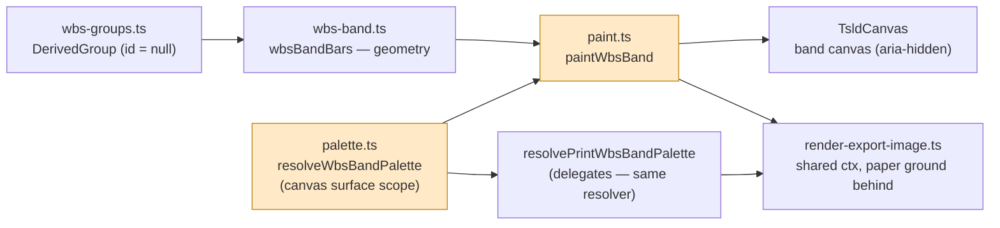
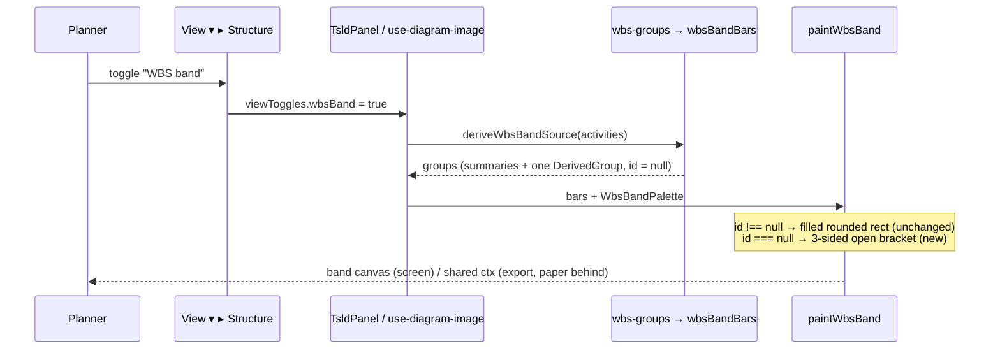
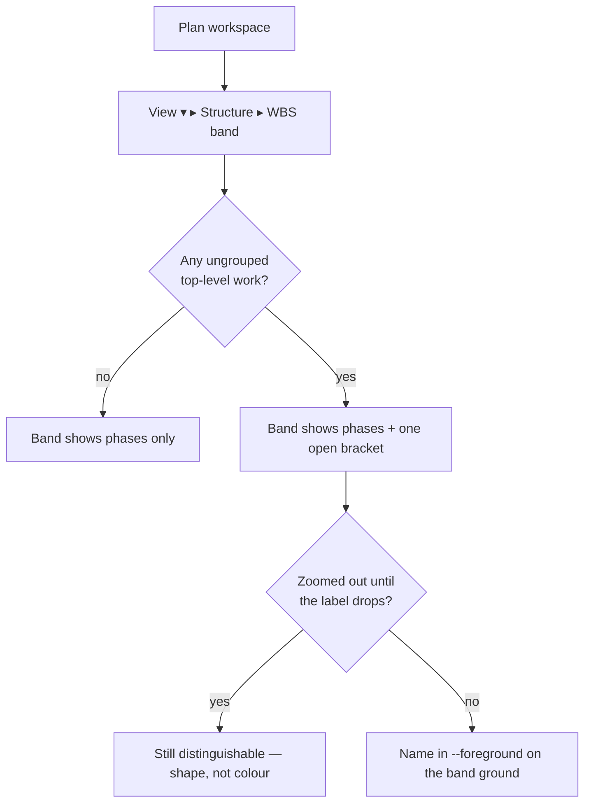

# Feature Spec: the WBS band's derived bucket is an open bracket

- **Status:** Draft — awaiting approval
- **Author(s):** feature-analyst
- **Date:** 2026-09-01
- **Tracking issue / epic:** `docs/TECH_DEBT.md` #71
- **Roadmap link:** none — a defect on the primary surface, not a roadmap theme
- **Related ADR(s):** applies **ADR-0063** (the pinned WBS band) and the rule its Gantt sibling
  already states; touches gates owned by **ADR-0055 §2** / **ADR-0097** (surface scopes and the
  contrast matrix) and **ADR-0103** (paper is a surface). **No new ADR is proposed** — see §4.7.

---

## 0. Why this document exists at all

The change itself is about sixty lines in one painter. It needs a spec because of **ADR-0105's
shared-gate trigger**: it changes what `apps/web/src/styles/token-contrast.test.ts` asserts, and
it adds an assertion to `apps/web/src/features/tsld/render/print-palette.structural.test.ts`.
Both are shared gates. A register row stands in for stages 1–2 only while a change adds no new
surface and touches no shared gate; this one crosses that line, so the row plus this document is
the right weight of record.

The spec is deliberately short. `docs/PROCESS.md` asks for the artefact, not for the artefact to
be inflated into an epic.

### What the brief got wrong, corrected before it was built on

Per `docs/PROCESS.md` "the brief is not evidence", two claims in the request were checked and one
is false:

| Claim in the brief                                          | Finding                                                                                                                                                                                                                                                                                                                                                                                                                                                                                                                                                                                                                      |
| ----------------------------------------------------------- | ---------------------------------------------------------------------------------------------------------------------------------------------------------------------------------------------------------------------------------------------------------------------------------------------------------------------------------------------------------------------------------------------------------------------------------------------------------------------------------------------------------------------------------------------------------------------------------------------------------------------------- |
| "The band has a golden paint log (`paint.test.ts`)"         | **False.** `paintWbsBand` is imported by exactly six files (`rg -l paintWbsBand apps/web/src`): `render/paint.ts`, `render/paint.wbs-band-budget.test.ts`, `export/render-export-image.ts`, `export/render-export-image.wbs-band.test.ts`, `components/TsldCanvas.tsx`, `styles/token-contrast.test.ts`. `paint.test.ts` and `paint.golden.test.ts` do **not** paint the band — the golden log characterises `paintScene` only. **There is no band golden log to re-baseline**, so the ADR-0106 line-by-line audit does not apply here; what is needed instead is a band recording assertion that does not exist yet (§4.5). |
| `labelBeside` sits "around paint.ts:1409, 1453, 1544, 2038" | **Confirmed**, plus two more the brief did not list: `paint.ts:1592` and `:1598`. All six read `palette.labelBeside`, which `palette.ts:195` resolves from `--foreground` and `palette.ts:262` (`PRINT_TOKEN_SOURCES`) also resolves from `--foreground`.                                                                                                                                                                                                                                                                                                                                                                    |

The load-bearing claim in the brief — that `derivedLabel` is `token('--background', …)` and would
therefore be painted in the diagram's own ground once the fill goes — is **confirmed** at
`apps/web/src/features/tsld/render/palette.ts:473`, with the chain
`[data-surface='canvas'] { --background: var(--plot-background) }` (`globals.css:1311`) →
`--plot-background: var(--canvas)` (`:762`) → `--canvas: oklch(0.958 0.004 250)` (`:398`).

---

## 1. Business understanding

### Problem

The pinned WBS band (ADR-0063) draws two different kinds of object with **one shape**. A real
`WBS_SUMMARY` — a grouping a planner built — is a filled rounded rect in the primary hue. The
derived **Unassigned** bucket — the application observing that some work has no grouping at all —
is _the same filled rounded rect_ in the muted hue, with its name on top
(`render/paint.ts:2295-2321`).

At the zoom where the label is dropped (`truncateToWidth` returns `''` once `bar.w - 6` will not
hold an ellipsis — `render/paint.ts:2313-2316`), **colour is the only remaining difference between
a thing in the plan and a thing that is not in the plan**. That is the WCAG 1.4.1 shape of the
defect, and it is why `docs/TECH_DEBT.md` #71 was raised by the ADR-0063 M6 accessibility gate.

The band's Gantt sibling already decided this, and says so in its own comment
(`features/gantt/components/GanttPanel.tsx:1405-1414`):

> A bracket, not a filled bar: the bucket is not a scheduled thing, it is the extent of things
> that are. Drawing it as a bar would put a fourth kind of bar on the chart and read as work
> nobody planned.

So the product holds one rule and applies it on one of the two surfaces that need it. This is not a
new decision; it is an existing decision that never reached the canvas.

**Two halves of #71's original text are struck and the row already records why** (`docs/TECH_DEBT.md:294-313`):
there is one theme, not three (`THEME_SELECTORS = [':root']`, ADR-0097), and the ink/fill pairing
did **not** clear 4.5:1 — it measured 3.01:1 and was fixed by ADR-0102. What survives, and what
this spec closes, is the **shape** cue alone.

### Users

Every role that can open a plan and turn the band on: **Org Admin, Planner, Contributor, Viewer**
and **External Guest** (the guest share view mounts `TsldPanel`). The band is a read affordance —
it needs no permission, no pen, and no write.

The people it matters most to are the two the colour channel fails: a reader with a colour-vision
deficiency, and _any_ reader looking at a printed or exported programme, where the mid-grey fill
and the primary fill are two similar tones on paper.

### Primary use cases

1. A planner turns on `View ▾ ▸ Structure ▸ WBS band` and can tell, at any zoom, which band marks
   are phases they built and which one is the application saying "this work is not filed anywhere".
2. The same distinction survives in the exported PNG/PDF and the printed diagram, which are the
   artefacts handed to somebody who was not in the room.

### User journeys

Unchanged from today. The planner opens a plan, opens `View ▾`, toggles **WBS band**
(`e2e-wbs/wbs.spec.ts:128`), and reads the band. Nothing new is reachable; one thing already on
screen becomes legible.

### Expected outcomes

- The derived bucket is distinguished by **shape** (an unfilled, three-sided, square-cornered
  bracket, open at the foot) as well as by colour, so the distinction survives greyscale, a
  colour-blind reader, and the loss of the label at coarse zoom.
- The TSLD and the Gantt tell the same story about the same object.
- `docs/TECH_DEBT.md` #71 closes.

### Success criteria

| Criterion                                      | How it is judged                                                                                            |
| ---------------------------------------------- | ----------------------------------------------------------------------------------------------------------- |
| The bucket is not a filled bar at any width    | A unit assertion on the recorded paint log, **verified red against the current treatment first** (§4.5)     |
| Its name is legible on the band ground         | The contrast matrix, canvas scope, ≥ 4.5:1 (§4.4)                                                           |
| Its bracket is perceivable on the band ground  | The contrast matrix, canvas scope, ≥ 3:1 (§4.4)                                                             |
| Both hold on paper                             | A new assertion in `print-palette.structural.test.ts` (§4.4) — nothing gates the band's print palette today |
| Real summaries are untouched                   | The real-summary branch of the recorded log is byte-identical (§4.5)                                        |
| The per-frame cost does not grow with the plan | The band budget gate; there is exactly **one** derived bucket per band (§3, Performance)                    |

### Open questions

**None is critical.** The remedy was chosen by the product owner from two mock-ups on a real canvas
(§4.7). The defaults taken, each stated so a reviewer can overturn one cheaply:

- **The bracket's colour stays `palette.derived` (`--muted-foreground`).** Default: keep it. The
  alternative — the diagram ink — would make the observation as loud as the phases.
- **The label's ink becomes `--foreground`** (the `labelBeside` pairing), per
  `docs/DESIGN_SYSTEM.md:781`: "text **beside** a bar uses `--color-foreground` over the canvas
  ground". Default: yes. Matching the Gantt's `text-muted-foreground` instead would also pass
  contrast but would depart from the painter's own documented rule.
- **No sub-width degraded glyph.** Default: none; report the degradation instead (§4.3).
- **No new `VITE_` flag.** Default: none, per ADR-0088 D1 — a `VITE_` constant is inlined at build
  time and has never been an operator rollback. The rollback is a commit boundary, and this is a
  single-commit painter change.

---

## 2. Functional requirements

### User stories & acceptance criteria

> **US-1** — As a **planner reading the band**, I want the Unassigned bucket to look like a
> different _kind_ of object from a phase I built, so that I do not read unfiled work as a phase.
>
> **Acceptance criteria**
>
> - **Given** a plan with at least one `WBS_SUMMARY` and at least one top-level non-summary
>   activity, **when** the band is on, **then** the derived bucket is drawn as an unfilled
>   three-sided bracket (left, top, right; **open at the foot**) and the real summary is drawn as
>   today's filled rounded rect.
> - **Given** the same picture rendered in greyscale, **when** the bucket's label is not drawn
>   (coarse zoom), **then** the two objects still differ — one is a filled block, the other is an
>   outline.
> - **Given** any band bar, **when** it is a real summary, **then** its paint is byte-identical to
>   today's.

> **US-2** — As **anyone reading the deliverable**, I want the same distinction in the exported
> image and the printed diagram, so that the artefact does not quietly say something the screen did
> not.
>
> **Acceptance criteria**
>
> - **Given** an exported PNG or a printed diagram containing the band, **then** the bucket is a
>   bracket there too, its name clears 4.5:1 against the paper ground, and its bracket clears 3:1.
> - **Given** the export path (which shares one `ctx` with `paintScene` —
>   `export/render-export-image.ts:206` then `:213`), **then** the bracket is solid: the painter sets
>   its own dash state and never inherits one.

> **US-3** — As a **reviewer**, I want the change to be provable rather than asserted.
>
> **Acceptance criteria**
>
> - **Given** the pre-change painter, **when** the new unit assertion runs, **then** it **fails**.
>   (The repo's rule: a gate is finished when it has been made to fail by the defect it names.)
> - **Given** `token-contrast.test.ts`, **then** no assertion in it states a premise that is false
>   — specifically, nothing claims the bucket's name is painted "on its fill".

### Workflows

Unchanged. `paintWbsBand` is called once per dirty frame from `TsldCanvas.tsx:1843` and once per
export from `render-export-image.ts:213`. The only difference is which primitives it emits for the
single bar whose `id` is `null`.

### Edge cases

| Case                                                      | Expected behaviour                                                                                                                                                                                                                                                                                                                           |
| --------------------------------------------------------- | -------------------------------------------------------------------------------------------------------------------------------------------------------------------------------------------------------------------------------------------------------------------------------------------------------------------------------------------- |
| No ungrouped work                                         | No derived bar exists (`wbs-groups.ts` emits the `DerivedGroup` only when there are members). Nothing changes.                                                                                                                                                                                                                               |
| Bucket has no dates (no member computed)                  | Already excluded by `wbsBandBars` (`render/wbs-band.ts:133`). Nothing changes.                                                                                                                                                                                                                                                               |
| Bucket clipped at the viewport edge                       | Its `x`/`w` are the culled values as today; a bracket half off-screen loses one vertical, exactly as a clipped fill loses one edge. No special case.                                                                                                                                                                                         |
| Bar at `MIN_BAR_WIDTH_PX` (2 px, `render/wbs-band.ts:45`) | Bracket still drawn; at 2 px the two verticals are adjacent pixels and the mark degrades to a near-solid column. **Reported, not special-cased** — see §4.3.                                                                                                                                                                                 |
| Label does not fit                                        | Already dropped (`paint.ts:2313-2316`). Unchanged: the bracket is precisely the cue that survives this.                                                                                                                                                                                                                                      |
| Selection                                                 | Unreachable — the bucket has no id, and both the selection ring (`paint.ts:2302`) and the click handler (`TsldCanvas.tsx:2220`) already refuse a `null` id. Unchanged.                                                                                                                                                                       |
| Minimal / counting test contexts                          | `paintWbsBand` already guards `measureText`/`fillText`. The bracket uses `beginPath`/`moveTo`/`lineTo`/`stroke`/`setLineDash`, all of which every existing band test double provides (`paint.wbs-band-budget.test.ts:43-65`, `test-support/recording-ctx.ts:26-49`). No new guard is needed; a `stroke` counter is added to the budget stub. |

### Permissions

**None.** This is a read-only paint change on an `aria-hidden` canvas. No RBAC surface, no
organisation scope, no pen (ADR-0028), no write. Guests reach it through the share view on the same
terms as members.

### Validation rules

None — no input.

### Error scenarios

None reachable. The painter takes already-derived geometry and a resolved palette; there is no
request, no parse and no failure mode to report. The one _silent_ hazard is the inherited dash on
the shared export context, which is closed by setting the dash rather than by detecting it (US-2).

---

## 3. Technical analysis

| Area           | Impact                                | Notes                                                                                                                                                                                                                                                                                                                                                                                                                                                      |
| -------------- | ------------------------------------- | ---------------------------------------------------------------------------------------------------------------------------------------------------------------------------------------------------------------------------------------------------------------------------------------------------------------------------------------------------------------------------------------------------------------------------------------------------------- |
| Frontend       | **low**                               | One painter branch (`render/paint.ts:2295-2321`), one palette token (`render/palette.ts:473`), three docblocks. No component, route, state or form change.                                                                                                                                                                                                                                                                                                 |
| Backend        | **none**                              | Not imported.                                                                                                                                                                                                                                                                                                                                                                                                                                              |
| Database       | **none**                              | No model, column, index, constraint or migration — confirmed by the diff being confined to `apps/web/src`. **`database-architect` is therefore not engaged, and that is a finding rather than an omission.**                                                                                                                                                                                                                                               |
| API            | **none**                              |                                                                                                                                                                                                                                                                                                                                                                                                                                                            |
| Security       | **none**                              | No principal, no scope, no input.                                                                                                                                                                                                                                                                                                                                                                                                                          |
| Performance    | **low, and bounded by construction**  | There is exactly **one** derived bucket per band (`wbs-groups.ts:137-143` returns a single `DerivedGroup`), so the delta is a constant: for that one bar, `fillStyle`+`beginPath`+`roundRect`+`fill` (4 ops) becomes `strokeStyle`+`lineWidth`+`setLineDash`+`beginPath`+`moveTo`+3×`lineTo`+`stroke` (9 ops). Nine operations per frame against the scene's thousands — the band's own budget gate calls itself `O(rendered bars + 1)` (`paint.ts:2261`). |
| Infrastructure | **none**                              |                                                                                                                                                                                                                                                                                                                                                                                                                                                            |
| Observability  | **none**                              |                                                                                                                                                                                                                                                                                                                                                                                                                                                            |
| Testing        | **medium — this is most of the work** | One shared gate changes (`token-contrast.test.ts`), one gains an assertion (`print-palette.structural.test.ts`), one budget stub is extended, one new recording assertion is written and **verified red**, one screenshot is added.                                                                                                                                                                                                                        |

### The recalculation parity gate

**The CPM engine is not imported and no migration runs**, so the ADR-0034 parity gate is untouched
by construction — in its honest form: there is nothing here to hold parity for. The derived bucket
is a view-layer object that deliberately never reaches `computeSchedule` (ADR-0063; the reasoning
is in `features/wbs/model/wbs-groups.ts:14-20`).

### Dependencies

Nothing must land first. Nothing else is in flight on `render/paint.ts`'s band section. The change
is self-contained in `apps/web`.

---

## 4. Solution design

### 4.1 Architecture overview



Only the two amber nodes change. Geometry, derivation, hit-testing, selection and the export's
placement are all untouched.

### 4.2 What is drawn

For a bar with `id === null`, at `{x, y, w, h}` in band-local CSS px:

| Property           | Value                                                                                             | Why                                                                                                                                                                                                                                                                                                                                                                                                          |
| ------------------ | ------------------------------------------------------------------------------------------------- | ------------------------------------------------------------------------------------------------------------------------------------------------------------------------------------------------------------------------------------------------------------------------------------------------------------------------------------------------------------------------------------------------------------ |
| Fill               | **none**                                                                                          | The whole point: an unfilled mark is a different kind of object from a filled one.                                                                                                                                                                                                                                                                                                                           |
| Stroke colour      | `palette.derived` (`--muted-foreground`)                                                          | Unchanged token, new role. The observation stays quieter than the phases a planner built.                                                                                                                                                                                                                                                                                                                    |
| Alpha              | **none — solid**                                                                                  | The Gantt's class is `border-muted-foreground/60`. An alpha stroke on canvas composites against whatever is beneath it and is **invisible to the contrast matrix**, which reads tokens; that is exactly how `hover:bg-destructive/90` shipped a live 1.4.3 failure (`token-contrast.test.ts:81-88`). Solid, or it cannot be gated.                                                                           |
| Line width         | `1`                                                                                               | The Gantt's `border` is 1 px. The band's only other stroke, the selection ring, is 1.5 (`paint.ts:2304`) — deliberately heavier, because it is a state and this is an identity.                                                                                                                                                                                                                              |
| Dash               | **explicitly `[]`**                                                                               | The export shares one `ctx` with `paintScene` (`render-export-image.ts:206` → `:213`). Every dash-setting site in `paintScene` is followed by a reset in the same block (e.g. `paint.ts:1837`/`:1839`, `:1884`/`:1886`), so the bracket would _probably_ inherit `[]` today — but that is a property nothing asserts, across a function boundary, on the one path where nobody is watching a screen. Set it. |
| Path               | `moveTo(x+0.5, y+h)` → `lineTo(x+0.5, y+0.5)` → `lineTo(x+w-0.5, y+0.5)` → `lineTo(x+w-0.5, y+h)` | Three sides, **open at the foot**, matching `border … border-b-0`. No `closePath` — a closed path is exactly the thing being avoided.                                                                                                                                                                                                                                                                        |
| Corners            | **square**                                                                                        | Deliberate, and a second channel: the planned object is _rounded_ (`beginRoundedRect(…, 3)`), the derived one is _square_. It also avoids a rounded-corner fallback branch — `beginRoundedRect` returns `false` without `ctx.roundRect` (`layers/shapes.ts:23-28`) and cannot express three sides anyway. `docs/TECH_DEBT.md:310` names "a squared corner" as one of the two acceptable cues.                |
| Half-pixel offsets | `+0.5`                                                                                            | The file's established convention (`paint.ts:2306`, `:1421`): a 1 px stroke on an integer coordinate straddles two device pixels and blurs. Exact at dpr 1 and dpr 2.                                                                                                                                                                                                                                        |
| Label position     | **unchanged** — `fillText(text, x + LABEL_PAD_PX, y + h/2)`                                       | Keeping the geometry identical keeps `truncateToWidth`'s behaviour, and therefore the `measureText` counts the budget gate pins, unchanged. `LABEL_PAD_PX` is 3 (`geometry.ts:47`), so the text clears the 1 px vertical by 2 px.                                                                                                                                                                            |
| Label ink          | `palette.derivedLabel`, **re-pointed to `--foreground`**                                          | See §4.4.                                                                                                                                                                                                                                                                                                                                                                                                    |

Real summaries: **not one line changes.**

### 4.3 Geometry at the narrow widths, and where the cue stops working

This is where the defect lives, so it gets stated rather than assumed.

`MIN_BAR_WIDTH_PX` is 2 (`render/wbs-band.ts:45`) and `WBS_BAND_ROW_HEIGHT` is 16
(`render/wbs-band.ts:36`). The two verticals sit at `x+0.5` and `x+w-0.5`, so their separation is
`w-1` px:

| `w`           | Vertical separation | Reads as                                                                                                      |
| ------------- | ------------------- | ------------------------------------------------------------------------------------------------------------- |
| ≥ 10          | ≥ 9 px              | A bracket. (Below ~10 px the label is gone anyway: `maxPx = w - 6`, and an ellipsis at 11 px measures ~4 px.) |
| 5–9           | 4–8 px              | A bracket — an outline with visible interior.                                                                 |
| 3–4           | 2–3 px              | Marginal: an outline whose interior is one or two ground pixels.                                              |
| 2 (the floor) | 1 px                | A near-solid 2×16 column. **The shape channel has stopped discriminating.**                                   |

**There is no degraded alternative glyph, deliberately.** Below about 4 px a _filled_ bar is also
just a coloured column, so nothing is being lost that the treatment could give back; and inventing
a third mark for narrow buckets would put a third kind of object on a band whose whole rule is that
there are two. The precedent is `CRITICAL_FRINGE_MIN_H` in the minimap (ADR-0100, recorded at
`token-contrast.test.ts:344-358`): where a cue stops carrying below a size, **report the
degradation in the painter's own docblock and leave it unasserted**, so a regression in the cue
above that size is still visible. That is what the painter docblock must say, in those terms.

### 4.4 The load-bearing consequence: the label's ink, and the gates that move

**The problem.** `WbsBandPalette.derivedLabel` is `token('--background', '#ffffff')`
(`palette.ts:473`). Inside the canvas surface scope that resolves
`--background` → `--plot-background` (`globals.css:1311`) → `--canvas` (`:762`) →
`oklch(0.958 0.004 250)` (`:398`) — **the ground the diagram is painted on**. It is that colour on
purpose: today it is ink _inverted against_ the `--muted-foreground` fill, and ADR-0102's
accessibility gate put it there after measuring the previous pairing at 3.01:1
(`paint.ts:2227-2241`). Remove the fill and the same value becomes ground-on-ground: **the
bucket's name would be invisible.**

**The fix.** `derivedLabel` becomes `token('--foreground', …)` — the pairing the painter already
uses for text beside a bar rather than on it (`palette.ts:195`, six call sites at `paint.ts:1409`,
`:1453`, `:1544`, `:1592`, `:1598`, `:2038`), and the rule `docs/DESIGN_SYSTEM.md:781` already
states in words. The field keeps its name: it is still "the derived bucket's label ink"; what
changed is what it pairs with, and that belongs in the docblock and in the gate, not in a rename
that churns four fixtures to say nothing the docblock does not.

**What the gates must become.** Both new pairings are `<the band ground> × <a mark>` — which is
`--background × --foreground` and `--background × --muted-foreground` in the **canvas** scope.

`token-contrast.test.ts` **already sweeps both**, in every scope including `canvas`:

- `TEXT_PAIRS` line 73 — `['--background', '--foreground', 'body text on the surface']` at 4.5:1;
- `NON_TEXT_PAIRS` line 163 — `['--background', '--muted-foreground', 'a dependency arrow against
the chart ground']` at 3:1.

So the change to that file is a **deletion plus two comments**, not two new assertions:

| Line                                                                                               | Action                                                                                                                                                                                                                                                                                                                                                                     |
| -------------------------------------------------------------------------------------------------- | -------------------------------------------------------------------------------------------------------------------------------------------------------------------------------------------------------------------------------------------------------------------------------------------------------------------------------------------------------------------------- |
| `:228` — `['--muted-foreground', '--background', "the Unassigned bucket's name on its fill", 4.5]` | **Delete.** Its premise ("on its fill") becomes false the moment the fill goes, and an assertion whose stated reason is false is worse than no assertion: it tells the next reader the pairing is checked for a reason that no longer exists.                                                                                                                              |
| `:227`, `:229` (real summary's label; selected summary's inset ring)                               | **Unchanged.** Both still describe exactly what the painter draws.                                                                                                                                                                                                                                                                                                         |
| `:73` and `:163`                                                                                   | Add the band's reason to each row's comment. This is the file's own established convention — `:109-122` records two consumers merged onto one pair at M0-T4 **with both reasons kept in the comment** — and it is the drift-resistant answer: a second identical assertion would have to be maintained beside the first and would eventually disagree about why it exists. |
| `:205-222` (the band describe-block docblock)                                                      | **Rewrite** — see below.                                                                                                                                                                                                                                                                                                                                                   |

The docblock at `:205-222` must, after the change, say four things:

1. **Keep the history.** The 3.01:1 measurement and the reason the matrix could not see it — "a
   token this matrix only ever validates as INK, repurposed as a FILL" — is the reason the block
   exists at all. Deleting it loses the lesson.
2. **Record that the hazard is now gone at this call site**, and how: `--muted-foreground` is no
   longer used as a fill anywhere in the band. It is a **stroke**, and its pair is the band ground.
3. **Say where the derived bucket's two pairs now live** — the generic `TEXT_PAIRS` /
   `NON_TEXT_PAIRS` sweeps, canvas scope — **so the missing row reads as a decision and not an
   oversight.** That is this file's stated contract for anything it deliberately does not assert
   locally (`:277-287`, `:465-468`).
4. **Point at the print half**, which is new (below).

**The print half, which nothing gates today.** `resolvePrintWbsBandPalette` delegates to the same
resolver (`palette.ts:487-489`) and is called with the **canvas** surface element
(`toolbar/commands/use-diagram-image.ts:217`), while the exported band is composited over
`palette.ground` = `--print` (`render-export-image.ts:230-232`). So the exported pair is
_canvas-scope ink on paper_ — a cross-regime pair that appears in neither scope's cell.
`print-palette.structural.test.ts` sweeps `PrintPalette` only; **`WbsBandPalette` has no paper gate
at all**, which is the exact shape that file's `:177-198` assertion was written to close ("a pair
whose two halves are governed by different scopes"). Two values are equal today
(`--print-foreground` at `globals.css:525` and `--page-foreground` at `:687` are both
`oklch(0.321 0 0)`), which is precisely why this must be gated rather than reasoned about: if they
diverged, every existing assertion would stay green while the deliverable drifted.

The new assertion belongs in `print-palette.structural.test.ts`, beside the one it mirrors:

- `derivedLabel` on `canvasGround` ≥ **4.5:1** (WCAG 1.4.3);
- `derived` on `canvasGround` ≥ **3:1** (WCAG 1.4.11).

To feed it without hand-listing a second roster of the band's tokens — the failure
`PRINT_TOKEN_SOURCES`'s own docblock warns against (`palette.ts:235-245`), and which that gate's
`PAPER_FIELDS` (`print-palette.structural.test.ts:45-47`) exists to avoid — **extract a
`WBS_BAND_TOKEN_SOURCES` table** and derive `resolveWbsBandPalette` from it, exactly as
`resolvePrintPalette` is derived from `PRINT_TOKEN_SOURCES`. That is ~15 lines and it also deletes
the resolver's hand-written fallbacks-as-duplicates. The cheaper alternative (name the two tokens
literally in the test) was rejected: it is the second roster, and it goes silently stale.

**The numbers, and where each comes from.** No ratio in this section was computed by hand for the
decision; each is either recorded in the repository or established by a gate that is green today:

| Pair                                                                 | Value                           | Evidence                                                                                                                                                                                                                                                                                                                                  |
| -------------------------------------------------------------------- | ------------------------------- | ----------------------------------------------------------------------------------------------------------------------------------------------------------------------------------------------------------------------------------------------------------------------------------------------------------------------------------------- |
| `--foreground` on the canvas ground                                  | **11.19:1**                     | Recorded at `render/paint.ts:2249-2250`.                                                                                                                                                                                                                                                                                                  |
| `--foreground` on the canvas ground ≥ 4.5                            | holds                           | `TEXT_PAIRS:73` passes in the `canvas` scope today.                                                                                                                                                                                                                                                                                       |
| `--muted-foreground` on the canvas ground ≥ 4.5 (so ≥ 3 with margin) | holds                           | `token-contrast.test.ts:228` asserts exactly this pair at **4.5** and is green today.                                                                                                                                                                                                                                                     |
| The paper pairs                                                      | **unknown until the gate runs** | Nothing measures them today. The plan's first task is to write the assertion and read the number out of the run, not out of this document. Both inks are darker than the screen's and paper is lighter than the canvas ground, so the expectation is that they clear comfortably — but that is an expectation, and it is labelled as one. |

### 4.5 How it is proven

**There is no band golden log** (§0). What exists is a counting-stub budget gate
(`paint.wbs-band-budget.test.ts`), an export-placement suite
(`export/render-export-image.wbs-band.test.ts`) and the contrast matrix. So the primary gate has to
be written.

**The new assertion (the one that must be verified red).** A `paint.wbs-band.test.ts` using the
shared `recordingCtx` (`render/test-support/recording-ctx.ts`), which logs method calls **and
property assignments** in order — so it can see `fillStyle=` and `strokeStyle=`, which a call
counter cannot:

```
paintWbsBand(ctx, [derivedBar], null, BAND, PALETTE)
```

asserts, for the bar with `id === null`:

- the log contains **no** `fillStyle=<palette.derived>` and **no** `fill()`
  — _this is the pair of assertions that fails against the current painter_, which emits both
  (`paint.ts:2298-2300`);
- the log contains `strokeStyle=<palette.derived>`, `lineWidth=1`, `setLineDash([[]])`;
- the four path calls appear in order and **name the foot as open**: `moveTo` and the final
  `lineTo` both terminate at `y + h`, and no segment runs _between_ them at that y. Assert the
  literal four-call sequence (it is exact and easy to re-read), and state the property in the
  comment so the next reader knows which part is load-bearing;
- `fillStyle=<palette.derivedLabel>` still precedes the single `fillText`.

And a second case: for a bar with a non-null id, the log is **unchanged** — captured as a literal
expectation rather than a snapshot, since it is nine entries.

**Verification order (non-negotiable).** Write the assertion against the _current_ painter and
watch it fail, naming `fillStyle=#7a8090` and `fill()`. A gate that has only ever been seen green
is the failure this repository has recorded more than once — most recently `#186`'s replacement
sweep, which passed and could not see a split button's caret.

**The budget gate** (`paint.wbs-band-budget.test.ts`) changes:

- `countingCtx` gains a `stroke` counter (its `stroke` is currently uncounted, `:47`);
- a new case with one derived bar asserts `fill === summaries` and `stroke === 1`, i.e. the derived
  bucket costs a stroke and not a fill;
- the existing cases are untouched — the `groups()` helper mints ids (`s0`, `s1`, …), so no
  existing fixture contains a derived bar and no existing count moves.

**The export suite** (`render-export-image.wbs-band.test.ts`) already includes a `null`-id bar in
its fixture (`:70`). Its four assertions are about placement and compositing and none of them
moves. Add one: the band's paint contains no dashed stroke — i.e. the bracket sets its own dash —
which is the US-2 hazard, and which no other test in the repository can see.

**The journey.** `apps/web/e2e-wbs/wbs.spec.ts` already turns the band on (`:128`), asserts it is
visible, and then creates a loose activity so the derived bucket exists (`:139-141`). This change
adds no entry point and no capability, so ADR-0081's "name the entry point or declare it dark" is
satisfied by the existing control; what the journey should gain is one pixel-level probe, because a
canvas is the one thing a unit test cannot look at:

> Read the band canvas's `ImageData` in `page.evaluate` and count the columns that have an opaque
> pixel in the sub-row's **top** row and none in its **bottom** row. A three-sided bracket
> contributes its whole interior width (tens of columns); a filled rounded rect contributes only
> its ~3 px corner rounding per bar. Assert a threshold well above the corner count and **verify it
> red** against the filled treatment.

If that probe proves flaky against antialiasing it is **dropped rather than weakened**, and the
screenshot below carries that half — stated here so the decision is made in advance rather than
under pressure.

**The screenshot.** `apps/web/scripts/shoot.mjs` has 25 shots and none of them shows the band:
`wbsBand` is absent from `DEFAULT_VIEW_TOGGLES` (`render/view-toggles.ts:74-102`), so it is **off by
default** and the existing `plan-workspace` shot cannot contain it. Add one shot that toggles it on
against a seeded plan holding a summary and a loose activity. The register's own lesson (ADR-0101)
is that the shot list stopped at the route and a four-scrollbar panel reached a user; this is a
purely visual change, and a photograph is the instrument that judges it.

### 4.6 Data flow and user flow





### 4.7 Implementation approach & alternatives

**Chosen: the open bracket.** Three sides, open at the foot, square-cornered, unfilled, in
`--muted-foreground`, with the name in `--foreground` on the band ground. It is what the Gantt
already does, for the reason the Gantt already writes down, so the product ends up with one rule
instead of two treatments.

**Rejected: keep the fill, add a 1 px dashed outline in the diagram's ink.** This was the
accessibility review's recommendation, and its reasoning was that a dash "stays visually distinct at
any bar height/width above a couple of px". **The measurement overturned the reasoned claim.** Both
remedies were mocked up on a real canvas with the product's own tokens, geometry and
`truncateToWidth`, with a greyscale toggle applying the actual WCAG 1.4.1 test. At a 12 px bar with
colour withdrawn, a 1 px dash sitting **on** a fill of similar tone reads as a slightly textured
block rather than a different kind of object — the fill is `--muted-foreground` and the ink is
`--plot-foreground`, both mid-greys once colour is removed. The product owner's words were that
they could not see the dashed line and it "looks similar to what we have today". Recorded here as
evidence rather than as opinion, because the losing option was the one a competent review had
argued for from first principles: _the shape channel cannot be added on top of the fill; the fill
is what has to go._

**Rejected: match the Gantt's exact colours (bracket and label both `muted-foreground`, at 60%
alpha).** Two reasons. The alpha is unusable on canvas — it composites against whatever is beneath
and is invisible to the contrast matrix, which is how `hover:bg-destructive/90` shipped a live
1.4.3 failure. And the label ink would depart from the painter's own documented rule
(`docs/DESIGN_SYSTEM.md:781`): text beside a bar uses `--foreground`. Matching a sibling surface's
incidental class beats nothing; matching the vocabulary the painter states beats it.

**Rejected: a rounded bracket (`rounded-sm`, as the Gantt has).** `beginRoundedRect` cannot express
three sides and falls back to square on contexts without `roundRect` (`layers/shapes.ts:23-28`),
so a rounded bracket means a hand-rolled arc path with its own fallback branch — for a 2 px radius
on a 16 px mark. The square corner is also a **second** channel against the rounded planned bar,
which is worth more than the resemblance.

**Rejected: a feature flag.** ADR-0088 D1: a `VITE_` constant is inlined at build time and is not
an operator rollback; the rollback is a commit boundary, and this is one commit.

#### Is an ADR warranted?

**No, and here is the argument rather than the assertion.**

- The governing decision **already exists and is already accepted**. ADR-0063 established the band
  and its "a summary is a thing the planner made, the bucket is the app observing something"
  distinction; the Gantt's `GanttBucketRowView` states the shape rule in its own comment. This
  change applies that rule to the surface that missed it. An ADR would be recording a decision the
  register already contains.
- The three ADR-shaped things here are all _applications_ of existing decisions: the contrast pair
  moves under ADR-0055 §2's rules, the paper pair under ADR-0103's, the token re-point under
  ADR-0097's completeness rule ("the defect is a pair whose two halves are governed by different
  scopes").
- Filing ADR-012x for a sixty-line painter change would dilute a register whose value is that each
  entry is load-bearing.

**What does need writing down**, and where:

| Record                                                                       | Where                                                                                                                                                                                                                                |
| ---------------------------------------------------------------------------- | ------------------------------------------------------------------------------------------------------------------------------------------------------------------------------------------------------------------------------------ |
| The design, the options, the falsified accessibility claim                   | This spec (§4.7) — it is the durable artefact and ADRs cite specs.                                                                                                                                                                   |
| That a reasoned accessibility recommendation was overturned by looking at it | `docs/DECISIONS.md`, dated entry, naming both remedies and the greyscale mock-up as the instrument. This is exactly what that file is for — "a lighter-weight running log of smaller decisions".                                     |
| The rule, so the next canvas surface does not re-decide                      | One bullet in `docs/DESIGN_SYSTEM.md`'s canvas list (beside `:776-801`): **a derived extent is drawn as an unfilled open bracket; an object the planner made is drawn as a filled bar** — citing `GanttBucketRowView` and this spec. |
| The row closing                                                              | `docs/TECH_DEBT.md` #71 → `closed`, carrying the measurement that chose between the two remedies.                                                                                                                                    |

---

## 5. Out of scope — stated so nobody folds it in

**The derived bucket has no accessible name, and no count, anywhere in the TSLD.** That is a
separate defect and a separate register row. It is out of scope here, and this section exists so
the next reader does not treat "we touched the bucket" as licence to fix it.

The facts, verified rather than repeated:

- The band canvas is `aria-hidden="true"` (`components/TsldCanvas.tsx:2206`).
- `wbsBandGroups` reaches only a ref, the painter and the hit-test (`TsldCanvas.tsx:397`, `:801`,
  `:837`, `:1398-1400`, `:1831`). It never reaches the parallel DOM listbox.
- The bucket is not an activity — it is derived in the view layer and deliberately never persisted
  (`features/wbs/model/wbs-groups.ts:14-20`) — so it cannot appear in a listbox built from the
  plan's activities.
- Two places nevertheless claim an accessible equivalent for band objects:
  `TsldCanvas.tsx:2198-2202` ("its a11y equivalent is the band group in the parallel DOM listbox")
  and ADR-0063 §7. **Both are true for a real summary and false for the derived bucket**, which has
  no id to be an option for. `render/wbs-band.ts:105-110` records an earlier version of exactly
  this drift being caught and corrected — "asserting a UX property that has not shipped is the
  drift ADR-0058 exists to stop".

Fixing it means giving the bucket a name and a member count in a channel an assistive technology
can reach, which is new surface and therefore its own spec (ADR-0105). What this spec's plan
**does** owe it is a register row so the finding is not lost — see the plan's final task.

Also out of scope: any change to real `WBS_SUMMARY` bars; the band's depth cap; selection;
`MIN_BAR_WIDTH_PX`; the Gantt.

---

## 6. Links

- Implementation plan: [./implementation-plan.md](./implementation-plan.md)
- Register row: `docs/TECH_DEBT.md` #71
- Docs this change updates: `docs/TECH_DEBT.md`, `docs/DECISIONS.md`, `docs/DESIGN_SYSTEM.md`
- Code it touches: `apps/web/src/features/tsld/render/paint.ts`,
  `apps/web/src/features/tsld/render/palette.ts`,
  `apps/web/src/styles/token-contrast.test.ts`,
  `apps/web/src/features/tsld/render/print-palette.structural.test.ts`,
  `apps/web/src/features/tsld/render/paint.wbs-band-budget.test.ts`,
  `apps/web/src/features/tsld/export/render-export-image.wbs-band.test.ts`,
  `apps/web/e2e-wbs/wbs.spec.ts`, `apps/web/scripts/shoot.mjs`
