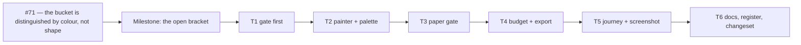

# Implementation Plan: the WBS band's derived bucket is an open bracket

- **Feature spec:** [./feature-spec.md](./feature-spec.md)
- **Status:** Draft — awaiting approval
- **Owner:** unassigned

## Shape of the work, stated honestly

**This is one milestone, delivered as one pull request, in six ordered commits.** It is not an epic
and the plan should not read like one.

Splitting it into six PRs would be worse, not more careful, for one specific reason: **commit 1
deletes a shared-gate assertion whose premise the painter has not yet falsified, and commit 2
falsifies it.** Landing those separately would leave `main` for some hours in a state where the
matrix no longer pins the bucket's legibility and the painter still paints it the old way — a
window in which nothing is broken and nothing is guarded. Inside one PR the ordering is a
reviewable sequence; across PRs it is a gap.

Sizing: painter + palette ≈ 60 lines; the gates and their docblocks are most of the diff.

### Epic

**Canvas legibility — apply the band's own stated rule to the surface that missed it.** Not a
roadmap theme: a defect on the primary surface, carried by `docs/TECH_DEBT.md` #71 since the
ADR-0063 M6 accessibility gate.

---

## Milestone: the derived bucket is an open bracket (shippable, single PR)

**Outcome:** on the TSLD band — on screen, in the exported image and on paper — the Unassigned
bucket is an unfilled three-sided bracket, so it differs from a planner's phase by **shape** and not
only by colour, including at the zoom where its name is dropped.

**Entry point:** `View ▾ ▸ Structure ▸ WBS band` on the plan workspace command deck — the existing
control, driven today by `apps/web/e2e-wbs/wbs.spec.ts:128`. **This milestone adds no new entry
point and no new capability**; it changes how an already-reachable object is drawn. ADR-0081 §1 is
satisfied by naming the existing control rather than by declaring the work dark, which it is not.

**Journey:** the band section of `apps/web/e2e-wbs/wbs.spec.ts` (`pnpm --filter @repo/web
test:e2e:wbs`, i.e. `scripts/e2e-local.sh web:wbs`) already opens the surface and presses the
control. Task T5 extends it with the one assertion a unit test structurally cannot make — a pixel
read of the band canvas — with a written fallback if it proves flaky.

---

#### Feature: the bracket, and the ink that has to move with it

> **Description:** `paintWbsBand`'s `bar.id === null` branch stops filling and starts stroking a
> three-sided path; `WbsBandPalette.derivedLabel` re-points from `--background` to `--foreground`;
> the two gates that describe the old treatment are corrected, and the one that never covered the
> band's paper path is written.
> **Complexity:** **S** (painter/palette) + **M** (gates and their docblocks).
> **Dependencies:** none. Nothing must land first; nothing else is in flight on the band.
> **Risks:**
>
> - _The label goes invisible._ → This is the whole point of T1 landing before T2, and of the
>   contrast matrix keeping a pair for it.
> - _The exported bracket comes out dashed_, because the export shares one `ctx` with `paintScene`.
>   → The painter sets `setLineDash([])` explicitly (T2) and T4 asserts it.
> - _A gate is written that cannot see the defect it names._ → Every new assertion in this plan is
>   **verified red first**, and the red output is quoted in the PR description.
> - _The bracket is illegible at 2–4 px._ → Accepted and reported rather than special-cased; see the
>   spec §4.3 and the `CRITICAL_FRINGE_MIN_H` precedent.
>
> **Testing requirements:** a new recording-log assertion (verified red); the band budget gate
> extended; the export suite extended; the contrast matrix corrected; a paper assertion added; one
> journey probe; one screenshot.

---

##### Task T1 — Move the gate before the value

- **Description:** correct `apps/web/src/styles/token-contrast.test.ts` so that nothing in it
  asserts a premise the next commit makes false, and so the bucket's two new pairings are visibly
  gated.
- **Complexity:** S
- **Dependencies:** none
- **Risks:** deleting a row could silently drop cover → the replacement cover is named in the
  docblock and pointed at the two generic rows that carry it; the PR quotes the two green
  assertions by line.
- **Testing:** `pnpm --filter @repo/web test src/styles/token-contrast.test.ts` — green before and
  after; the run's own output records the ratios.
- **Development steps:**
  1. Delete `:228` — `['--muted-foreground', '--background', "the Unassigned bucket's name on its
fill", 4.5]`. Its stated reason ("on its fill") is about to become false, and an assertion
     carrying a false reason misleads the next reader even while it passes.
  2. Do **not** add two replacement rows. Both new pairings are already swept in the `canvas` scope:
     `TEXT_PAIRS:73` (`--background` / `--foreground`, 4.5:1) and `NON_TEXT_PAIRS:163`
     (`--background` / `--muted-foreground`, 3:1). Add the band's reason to **each of those two
     rows' comments**, following the file's own convention at `:109-122` — two consumers, one pair,
     both reasons kept.
  3. Rewrite the band describe-block docblock (`:205-222`) to say the four things §4.4 of the spec
     lists: keep the 3.01:1 history and why the matrix could not see it; record that
     `--muted-foreground` is no longer a **fill** anywhere in the band; name where the derived
     bucket's pairs now live, **so the absent row reads as a decision and not an oversight**; and
     point at the paper gate T3 adds.
  4. Leave `:227` and `:229` untouched — both still describe what the painter draws.

##### Task T2 — The painter and the palette

- **Description:** the bracket itself.
- **Complexity:** S
- **Dependencies:** T1
- **Risks:** an inherited dash on the shared export context → set it explicitly; a rounded-corner
  fallback branch → square corners, which are also a second channel.
- **Testing:** the new `paint.wbs-band.test.ts` (below), **written first and verified red**.
- **Development steps:**
  1. **Write the failing test first.** New `apps/web/src/features/tsld/render/paint.wbs-band.test.ts`
     using `recordingCtx` from `render/test-support/recording-ctx.ts` (it logs property assignments
     as well as calls, which a counting stub cannot). For a bar with `id === null`, assert:
     - no `fillStyle=<palette.derived>` and no `fill()` anywhere in the log — **these two fail
       against today's painter**, which emits both (`paint.ts:2298-2300`). Run it and paste the red
       output into the PR;
     - `strokeStyle=<palette.derived>`, `lineWidth=1`, `setLineDash([[]])`;
     - the four path calls in order — `moveTo(x+0.5, y+h)`, `lineTo(x+0.5, y+0.5)`,
       `lineTo(x+w-0.5, y+0.5)`, `lineTo(x+w-0.5, y+h)` — with a comment stating the property the
       literal encodes: **the first and last points are at `y+h` and nothing runs between them at
       that y; the foot is open**;
     - `fillStyle=<palette.derivedLabel>` still immediately precedes the single `fillText`.
  2. Add the second case: a bar with a non-null id logs exactly what it logs today. Nine entries —
     write them literally, not as a snapshot, so a careless re-baseline is impossible.
  3. `render/palette.ts:466-476`: extract `WBS_BAND_TOKEN_SOURCES` (field → `[token, fallback]`,
     `satisfies Record<keyof WbsBandPalette, …>`) and derive `resolveWbsBandPalette` from it — the
     `PRINT_TOKEN_SOURCES` shape, for the reason that docblock gives (`:235-245`). Change
     `derivedLabel`'s token from `--background` to `--foreground` in that table.
  4. Rewrite the two docblocks that now describe the old treatment: `palette.ts:450-459`
     (`resolveWbsBandPalette` — `derived` is a **stroke**, not a fill) and `paint.ts:2210-2242`
     (`WbsBandPalette.derived` / `.derivedLabel` — keep the 3.01:1 history, state the new pairing
     and why it changed).
  5. `render/paint.ts:2295-2321`: branch the mark. `id !== null` keeps today's
     `beginRoundedRect`/`fill` path byte-for-byte. `id === null` sets `strokeStyle`, `lineWidth = 1`
     and `setLineDash([])`, then strokes the three-sided path. No `closePath`.
  6. Extend the `paintWbsBand` docblock with the degradation note the spec §4.3 requires: name the
     widths at which the shape channel stops discriminating (≈ 4 px and below, floor 2 px), say that
     the label is already gone there, and say that **no third glyph is introduced** — citing the
     minimap fringe precedent for reporting rather than special-casing.

##### Task T3 — The paper gate that never existed

- **Description:** `WbsBandPalette` has **no** paper assertion anywhere. After T2 the bucket's name
  is painted straight onto the paper ground in the export, so the pair has to be pinned.
- **Complexity:** S
- **Dependencies:** T2 (and the `WBS_BAND_TOKEN_SOURCES` table it introduces)
- **Risks:** hand-listing the band's two tokens in the test would be a second roster that goes stale
  → sweep the exported table instead.
- **Testing:** `pnpm --filter @repo/web test src/features/tsld/render/print-palette.structural.test.ts`
- **Development steps:**
  1. In `print-palette.structural.test.ts`, beside the existing `:177-198` assertion ("every mark
     drawn straight onto paper clears its floor against the paper ground"), add the band's two:
     `derivedLabel` on `canvasGround` ≥ **4.5:1** (1.4.3) and `derived` on `canvasGround` ≥ **3:1**
     (1.4.11), resolved through the same `canvasScope()` replay the file already uses.
  2. Comment it with the reason, which is the file's own subject: the exported band's ink resolves
     from the **canvas** scope (`use-diagram-image.ts:217` passes the canvas surface) while its
     ground is `--print` (`render-export-image.ts:230-232`). The two values are equal today
     (`globals.css:525` and `:687` are both `oklch(0.321 0 0)`) — **which is exactly why it needs a
     gate rather than a paragraph**: if they diverged, every existing assertion would stay green.
  3. **Record the measured numbers in the PR description**, read out of the run. The spec
     deliberately does not state them: nothing measures them today, and inventing a figure is the
     ADR-0076 Class 3 failure this repository keeps recording.

##### Task T4 — The two existing band suites

- **Description:** the budget gate and the export suite learn about a stroked bucket.
- **Complexity:** S
- **Dependencies:** T2
- **Risks:** none material; both suites already carry a `null`-id or an all-ids fixture, so the
  changes are additive.
- **Testing:** both suites green; the new cases verified red where they name the defect.
- **Development steps:**
  1. `paint.wbs-band-budget.test.ts`: add `stroke` to the `calls` object (it is currently an
     uncounted no-op at `:47`). Add one case with a derived bar asserting `fill === summaries` and
     `stroke === 1`. Leave every existing case alone — `groups()` mints ids, so no existing count
     moves, and that should be stated in the new case's comment so a later reader does not "tidy"
     the two into one.
  2. `export/render-export-image.wbs-band.test.ts`: its fixture already holds
     `{ id: null, label: 'Unassigned', … }` (`:70`). Add one assertion — the band's paint contains
     no `setLineDash` with a non-empty pattern, i.e. the bracket sets its own dash state on the
     context it shares with `paintScene`. Verify red by removing the `setLineDash([])` from T2's
     branch and pre-setting a dash on the fake ctx.

##### Task T5 — Look at it

- **Description:** the two instruments that judge a _visual_ change: a pixel probe in the journey,
  and a photograph.
- **Complexity:** S
- **Dependencies:** T2
- **Risks:** an antialiasing-sensitive pixel probe becomes a flaky gate → the fallback is decided
  **now**: if it is flaky it is deleted, not weakened, and the screenshot carries that half.
- **Testing:** `scripts/e2e-local.sh web:wbs`; `node apps/web/scripts/shoot.mjs` (or its documented
  entry point) for the shot.
- **Development steps:**
  1. `apps/web/e2e-wbs/wbs.spec.ts`, in the band section after the loose activity is created
     (`:139-141`): read the band canvas's `ImageData` in `page.evaluate` and count columns that have
     an opaque pixel in the sub-row's top row and **none** in its bottom row. A three-sided bracket
     contributes its whole interior; a filled rounded rect contributes only ~3 px of corner rounding
     per bar. Assert a threshold well clear of the corner count.
  2. **Verify it red** against the pre-T2 painter. If it cannot be made to fail cleanly, or it is
     flaky across two consecutive runs, delete it and say so in the PR — an unreliable gate is worse
     than none, because it gets bypassed rather than fixed.
  3. `apps/web/scripts/shoot.mjs`: add a `plan-workspace-wbs-band` shot. It must **drive the
     toggle** — `wbsBand` is absent from `DEFAULT_VIEW_TOGGLES` (`render/view-toggles.ts:74-102`), so
     it is off by default and no existing shot can contain the band. Seed a plan with a
     `WBS_SUMMARY` and at least one loose top-level activity, or the bucket does not exist to
     photograph.
  4. Look at the resulting PNG, at the two widths the shot list already uses, and say in the PR what
     you saw. That is the acceptance test the register row was raised by a human looking at.

##### Task T6 — The record

- **Description:** close the row, write down the decision that was made by looking, and put the rule
  where the next canvas surface will find it.
- **Complexity:** S
- **Dependencies:** T1–T5
- **Risks:** the out-of-scope finding gets lost → it is filed as its own row in this task, not
  mentioned in a commit message.
- **Testing:** `pnpm check:debt-status`, `pnpm check:doc-links`, `pnpm check:adr-coverage`,
  `pnpm check:counts`.
- **Development steps:**
  1. `docs/TECH_DEBT.md` #71 → **`closed`**, with the date. Carry the sentence that matters: the
     dashed-outline remedy was rejected because it was **looked at** in greyscale at 12 px and did
     not read as a different kind of object — the accessibility review's reasoned claim to the
     contrary was overturned by measurement. Keep the existing `[STRUCK …]` block; it is the row's
     own record of being wrong twice and is worth more than a tidy entry.
  2. `docs/DECISIONS.md`: a dated entry naming both remedies, the greyscale mock-up as the
     instrument, and the product owner's decision. **No ADR** — the argument is in the spec §4.7,
     and the short version is that ADR-0063 and `GanttBucketRowView` already contain the decision;
     this applies it.
  3. `docs/DESIGN_SYSTEM.md`, in the canvas bullet list beside `:776-801`: one bullet stating the
     rule for the next surface — _a derived extent is an unfilled open bracket; an object the
     planner made is a filled bar_ — citing `GanttBucketRowView` and this spec. Also note that the
     bracket is **solid, never an alpha stroke**, because an alpha stroke on canvas is invisible to
     the contrast matrix.
  4. **File a new `docs/TECH_DEBT.md` row for the out-of-scope finding** (spec §5): the derived
     bucket has no accessible name or count anywhere in the TSLD, and two places claim an accessible
     equivalent that exists only for real summaries (`TsldCanvas.tsx:2198-2202` and ADR-0063 §7).
     Status `open`, with the verification already done in the spec. Note that closing it is new
     surface and therefore needs its own spec (ADR-0105).
  5. Add a **patch** changeset for `@repo/web`. User-visible, no contract change, no migration.
  6. Run the full pre-push gate — **`pnpm prepush`**, one command, per CLAUDE.md §19.8 — plus
     `scripts/e2e-local.sh web:wbs`. `apps/api` is untouched, so the API e2e half is not required;
     say so explicitly in the PR rather than leaving it ambiguous.

---

## Sequencing & slices

One slice. The commit order inside the PR is load-bearing and is the review's spine:

| #   | Commit                                                | Why it is here and not later                                                                                                                                                         |
| --- | ----------------------------------------------------- | ------------------------------------------------------------------------------------------------------------------------------------------------------------------------------------ |
| 1   | T1 — contrast matrix corrected                        | The pair lands before the value it protects (the ADR-0083 ordering; the `--canvas-grid-month` precedent, which shipped at 2.08:1 behind a green suite because the value went first). |
| 2   | T2 — the failing test, then the painter               | The test is written against the old code and **seen red**.                                                                                                                           |
| 3   | T3 — the paper gate                                   | Needs `WBS_BAND_TOKEN_SOURCES` from commit 2.                                                                                                                                        |
| 4   | T4 — budget + export suites                           | Mechanical once the painter's shape is settled.                                                                                                                                      |
| 5   | T5 — journey probe + screenshot                       | The instruments that judge a visual change; the last thing to move, and the first thing a reviewer should look at.                                                                   |
| 6   | T6 — register, decision log, design system, changeset | The record.                                                                                                                                                                          |

**No feature flag** (ADR-0088 D1). The rollback is `git revert` of commits 1–4, which restores both
the treatment and the assertions that describe it — which is why the gate change and the painter
change are in the same PR rather than in two.

## Definition of Done (per task)

Each task's contribution must satisfy the Feature Completion Criteria in
[`docs/PROCESS.md`](../../PROCESS.md). Three of them carry specific weight here and are called out
so they are not ticked from memory:

- **Accessibility considered.** Run **accessibility-reviewer** on the diff. This change exists
  because an accessibility gate raised #71, and it overturns that gate's own recommended remedy —
  the reviewer should be shown the measurement, not the conclusion.
- **Component review.** Run **component-reviewer**: the change touches a palette contract consumed
  by four fixtures and two resolvers.
- **Tests were run, not written.** `pnpm prepush` plus `scripts/e2e-local.sh web:wbs`. Every new
  assertion in this plan was **verified red first**, and the PR quotes the red output.

`database-architect` is **not** engaged, and that is recorded rather than skipped: there is no
model, column, index, constraint or migration in this change — the diff is confined to
`apps/web/src`, `apps/web/e2e-wbs` and `apps/web/scripts`. (CLAUDE.md §19.3's rule is unconditional
for schema changes; this is not one.)

## Risks & assumptions (rollup)

| Risk / assumption                                                                       | Likelihood            | Impact                                                           | Mitigation                                                                                                                                                                                         |
| --------------------------------------------------------------------------------------- | --------------------- | ---------------------------------------------------------------- | -------------------------------------------------------------------------------------------------------------------------------------------------------------------------------------------------- |
| The bucket's name goes invisible (ground-on-ground) if `derivedLabel` is not re-pointed | **certain if missed** | high — the name disappears on screen, in the export and on paper | T1 lands the pair first; T2 re-points the token; the matrix pins it. The chain is verified in the spec §4.4 rather than assumed.                                                                   |
| The exported bracket inherits a dash from `paintScene`                                  | low                   | medium — silent, and only in the deliverable                     | `setLineDash([])` in T2; asserted in T4. Not left to the "every dashed pass resets" property, which nothing pins.                                                                                  |
| The paper pairs turn out not to clear their floors                                      | low                   | medium — would force a token decision                            | T3 measures rather than assumes; the spec deliberately states no paper ratio. If either fails, stop and put the number to the product owner: the remedy is a token choice, not a threshold change. |
| The pixel probe is flaky                                                                | medium                | low                                                              | Decided in advance: delete it, do not weaken it; the screenshot carries that half.                                                                                                                 |
| At 2–4 px the bracket is indistinguishable from a fill                                  | **certain**           | low                                                              | Accepted, reported in the painter docblock, not special-cased. At that width a filled bar is also just a coloured column, and a third glyph would put a third object on a two-object band.         |
| A reader treats "we touched the bucket" as licence to give it an accessible name        | medium                | medium — scope creep past an ADR-0105 trigger                    | Spec §5 says so explicitly, and T6 files the finding as its own row.                                                                                                                               |
| The band budget gate's counts drift                                                     | low                   | low                                                              | The existing fixtures mint ids, so no existing count moves; the new case says so in its comment.                                                                                                   |
