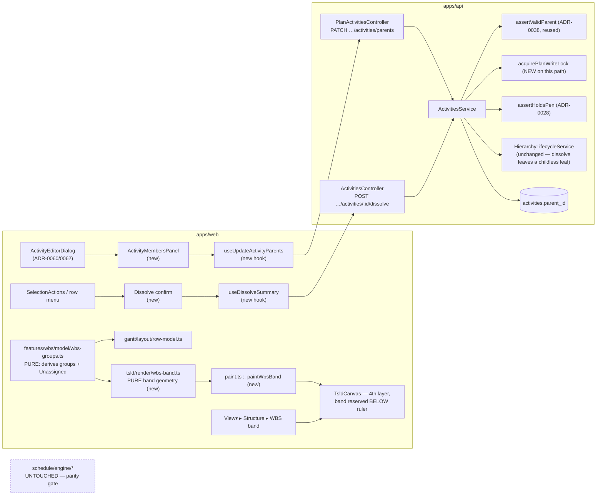
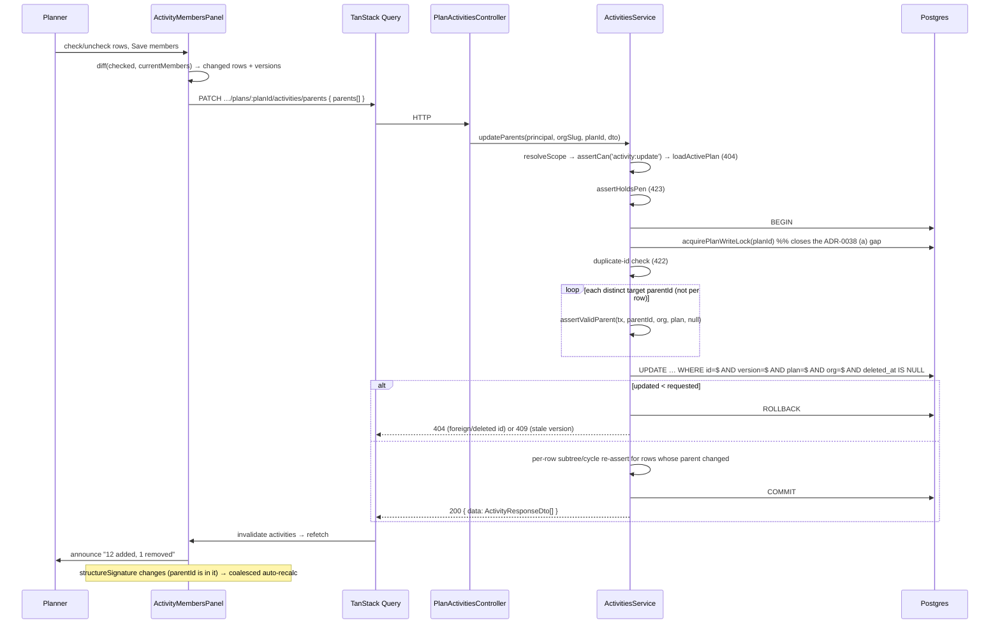
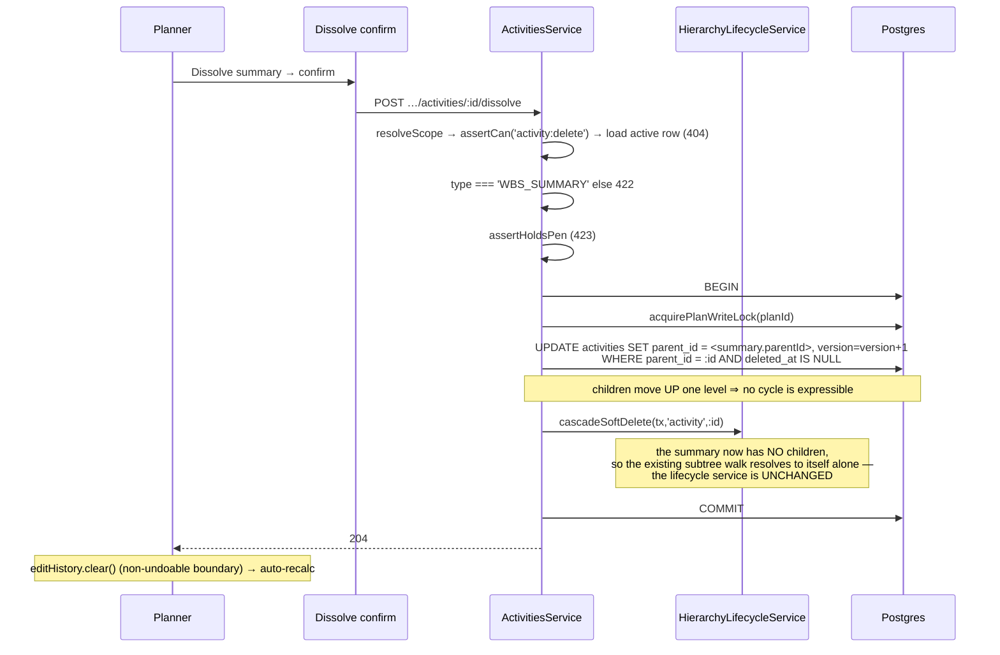
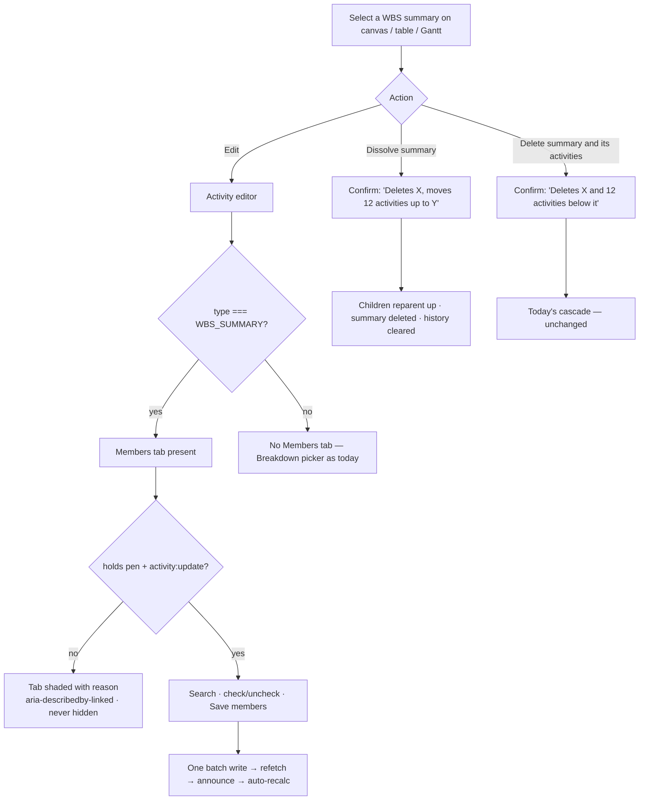

# Feature Spec: WBS improvements — parent-side membership, dissolve, the implicit bucket, and the pinned WBS band

- **Status:** Draft — **awaiting approval**
- **Author(s):** feature-analyst (Claude Code), with James Ewbank
- **Date:** 2026-07-30
- **Tracking issue / epic:** _(to be opened)_
- **Roadmap link:** WBS / programme structure (post-Gantt)
- **Related ADR(s):** builds on **ADR-0038** (WBS parent tree), **ADR-0026** (canvas),
  **ADR-0049** (the axis-aligned band precedent), **ADR-0034** (recalc parity gate),
  **ADR-0028** (the pen), **ADR-0060/0061/0062** (the tabbed activity editor),
  **ADR-0059** (Gantt), **ADR-0053 §3** (resource `GROUP` tree). Proposes a new
  **ADR-0063** for the pinned canvas band (§4.9).

---

## 0. What the code actually says (verified, not assumed)

The brief for this epic was checked against the source before any of it was designed.
Five things differ from, or add to, the summary the work started from:

1. **The engine rolls up _direct children_, not the whole branch.**
   `apps/api/src/modules/schedule/engine/compute.ts:544-606` builds `childrenByParent`
   and takes min/max over **direct** children, processing summaries **deepest-first** by
   `parentId`-chain depth — which is equivalent to a branch rollup, but only because of
   the ordering. An empty summary collapses to the **data date** (the "defined empty
   convention"), and `lateStart/lateFinish` are pinned to the rolled early instants, so a
   summary carries a by-convention **0 float** and is never critical/driving/longest-path.
2. **The reparent path does _not_ take the plan advisory lock.** ADR-0038 invariant (a)
   states the ancestor walk is "serialised by the same plan advisory lock so a concurrent
   mirror-reparent cannot slip a cycle past two walks". `ActivitiesService.assertValidParent`
   (`activities.service.ts:96-126`) runs inside `this.prisma.$transaction` but **never calls
   `acquirePlanWriteLock`** — no `plan-advisory-lock` import exists in the activities module.
   Today the pen (ADR-0028) covers this in practice, but `assertHoldsPen` returns early
   unless `planEditLockEnforced` is on (`plan-lock.service.ts:287`). **This is a real,
   pre-existing gap** and this epic closes it (M0-T3) rather than building a bulk endpoint
   on top of it.
3. **The delete confirmation never mentions the cascade.** `activity-crud-dialogs.tsx:165`
   says `Delete "<name>"? You can restore it later.` for **every** activity — including a
   `WBS_SUMMARY`, whose delete soft-deletes its entire subtree
   (`hierarchy-lifecycle.service.ts:357-371`). A planner deleting a band with forty
   activities under it is told they can restore it later and is not told what "it" is.
   This is arguably the highest-severity item in the epic and it is not one of the four asks.
4. **A batch write precedent already exists.** `PATCH …/plans/:planId/activities/positions`
   (`UpdatePositionsDto`, max 2000 rows, all-or-nothing, per-row optimistic `version`,
   pen-gated) is exactly the shape a bulk membership write needs. There is no need to invent one.
5. **A pinned canvas band already exists.** The resource strip (ADR-0049) is a **separate
   `<canvas>` layer** with its own reserved band height subtracted in `measure()`, its own
   palette, its own dirty flag, painted from the **same `viewRef`** as the scene
   (`TsldCanvas.tsx:107-111, 943-970, 1098-1114`). A WBS band pinned at the top is the same
   construction mirrored vertically — which means ask #4 needs **no change to
   `laneIndex`, to the viewport transform, or to any ADR-0026 lane invariant.**

Also verified: the guest share DTO **strips `parentId`** (`share/dto/guest-dto.spec.ts:95`),
so nothing in this epic reaches the External-Guest surface. `to-render-model.ts` does not
carry `parentId` into the render model at all — a `WBS_SUMMARY` is drawn as an ordinary bar
in its own `laneIndex` with the ADR-0052 M4 summary-tab glyph (`render-model.ts:1081-1100`).

---

## 1. Business understanding

### Problem

SchedulePoint has a real WBS (ADR-0038) and two surfaces that render it (the Gantt's
indented rows and bold summary bars, the activities table's read-only WBS column). What it
does not have is a way to **work with** the WBS. A user who just exercised it hit four walls:

1. **Membership is only settable one child at a time, from the child.** The only write path
   is the `parentId` `<select>` in the activity editor's **Breakdown** section
   (`ActivityEditorDialog.tsx:494-510`). Building a forty-activity "Substructure" band means
   opening forty activities, each a dialog open → tab → select → save → close. Nowhere in the
   product can you stand at a summary and ask "what is in this?".
2. **Deleting a band deletes the work.** The only delete is the ADR-0038 subtree cascade.
   A planner who wants to flatten a band — "these activities are fine, the grouping was
   wrong" — has no move except reparenting every child out first, one at a time, using the
   dialog above. And the confirmation does not warn them (§0.3), so the discovery route is
   destructive.
3. **WBS is all-or-nothing per activity.** An activity either has a parent or is invisible to
   every WBS view. There is no "everything else" — so a partially-structured plan (the normal
   state of a plan being structured) shows a WBS that silently omits most of the work.
4. **The canvas — the primary surface — does not express the WBS at all.** A `WBS_SUMMARY`
   is drawn as an ordinary bar in whatever lane it was dropped in. The one view a planner
   spends their day in cannot show the programme-level shape, and the Gantt (read-only,
   ADR-0059 M5 deferred) is not where they work.

**Why now.** The Gantt shipped two days ago (2026-07-28) and made the WBS visible to the
people a planner reports to. Visibility without manageability is the worst of both: the
structure is now on the printed programme, and it costs forty dialogs to get right.

### Users

| Role                                                              | Need                                                                                                                                |
| ----------------------------------------------------------------- | ----------------------------------------------------------------------------------------------------------------------------------- |
| **Planner** (`activity:update`, `activity:delete`, holds the pen) | Build and re-shape the WBS quickly; flatten a band without losing work; see the programme-level bands on the canvas while planning. |
| **Org Admin**                                                     | Everything a Planner can do (superset), plus the pen override.                                                                      |
| **Contributor** (`activity:update_progress` only)                 | **Read** the WBS band and the grouped Gantt so they can see which band their work sits in. No membership writes, no dissolve.       |
| **Viewer**                                                        | Read-only, as Contributor.                                                                                                          |
| **External Guest** (ADR-0051)                                     | **Out of scope** — the guest DTO strips `parentId`, so the guest view has no WBS today and gains none here.                         |

### Primary use cases

1. Open a WBS summary and add/remove many activities to/from it in one place, one save.
2. Delete a summary **but keep its work**, reparented one level up ("dissolve").
3. See every activity in a WBS view, including the ones not yet assigned to a band.
4. Toggle a programme-level **WBS band** pinned across the top of the TSLD canvas, which
   shows something meaningful even in a plan with no explicit WBS.

### User journeys

**Happy path — build a band.** Planner takes the pen → selects the "Substructure" summary on
the canvas → **Edit** → the editor opens on a **Members** tab (present only for a
`WBS_SUMMARY`) → the tab lists the plan's assignable activities with the current members
checked → they check twelve, uncheck one → **Save members** → one batch request → the
coalesced auto-recalc (ADR-0032) redraws → the WBS band's "Substructure" bar widens to span
the twelve.

**Happy path — dissolve.** Planner opens the row/selection menu on a summary → **Dissolve
summary** → a confirm dialog states exactly what will happen ("Deletes _Substructure_ and
moves its 12 activities up to _top level_. The activities are kept.") → confirm → children
reparent to the summary's own parent, the (now childless) summary soft-deletes → recalc.

**Alternate — delete with the work.** Same menu, **Delete summary and its activities** → a
confirm dialog that now **counts the subtree** ("Deletes _Substructure_ and 12 activities
below it. You can restore them together.") → today's cascade, unchanged, honestly described.

**Alternate — a plan with no WBS.** Planner turns on **View▾ → Structure → WBS band** on a
plan with no summaries → the band shows **one** bar spanning every activity, labelled
`Unassigned` — the "single line across all activities". As they create their first summary and
move work into it, that bar shrinks and a named bar appears beside it.

### Expected outcomes

- Building a 40-activity band goes from ~40 dialog round-trips to one panel and one save.
- "Flatten this grouping" becomes a first-class, non-destructive action.
- Every activity is visible in every WBS view; a half-structured plan reads honestly.
- The canvas gains a programme strip, so the TSLD answers "how is this project shaped?"
  without leaving it.

### Success criteria

| Measure                           | Target                                                                                                            |
| --------------------------------- | ----------------------------------------------------------------------------------------------------------------- |
| Assign 20 activities to a summary | ≤ 3 user actions after opening the summary; **one** HTTP write                                                    |
| Bulk assign p95 (200 rows)        | < 400 ms server-side, one transaction                                                                             |
| Dissolve loses zero activities    | Proven by API e2e: subtree count before == active count after (minus 1)                                           |
| WBS band draw cost                | Inside the ADR-0026 ≤ 4 ms p95 budget @ 2,000 activities; pinned by a counting-stub test (the ADR-0054 precedent) |
| Recalc parity                     | `computeSchedule` **byte-identical**; no engine file changed (structural, §3)                                     |
| Flag-off parity                   | Every touched surface pinned byte-for-byte by a flag-off suite                                                    |

### Open questions

**CRITICAL (answers change design or scope) — see §6 for the full list with defaults.**
C-1 members-panel vs. table multi-select · C-2 the bucket's identity and label ·
C-3 band depth · C-4 whether the band replaces summaries in the scene · C-5 dissolve on the
Gantt/table too, or canvas-only · C-6 resource-`GROUP` dissolve parity (recommended: **no**).

---

## 2. Functional requirements

### User stories & acceptance criteria

> **US-1** — As a **Planner**, I want to manage a WBS summary's membership **from the
> summary**, so that grouping a band of work is one action rather than forty.
>
> **Acceptance criteria**
>
> - **Given** an activity of type `WBS_SUMMARY` and I hold the pen, **when** I open the
>   activity editor, **then** a **Members** tab is present, listing the plan's assignable
>   activities with the current members checked.
> - **Given** the Members tab, **when** I check/uncheck rows and press **Save members**,
>   **then** exactly one `PATCH …/activities/parents` is sent carrying only the **changed**
>   rows, and the panel reflects the server's response.
> - **Given** a non-summary activity, **when** I open the editor, **then** there is **no**
>   Members tab (its membership is set by the existing Breakdown picker).
> - **Given** I do **not** hold the pen (or lack `activity:update`), **when** I open a
>   summary's Members tab, **then** the tab is **present and shaded with a reason**
>   (ADR-0062 M6's finding — never hidden, never a dead end), the checkboxes are inert and
>   `aria-describedby`-linked to that reason, and Save is absent.
> - **Given** the batch is rejected (409/422/423), **when** the error returns, **then** the
>   panel shows an actionable sentence, **no** row is changed (all-or-nothing), and the
>   checkbox state is refetched — never left showing a change the server refused.
> - **Given** the plan's per-child Breakdown picker, **when** I use it, **then** it behaves
>   exactly as today — the two paths compose, neither replaces the other.

> **US-2** — As a **Planner**, I want to **dissolve** a summary, so that I can remove a
> grouping without deleting the work under it.
>
> **Acceptance criteria**
>
> - **Given** a `WBS_SUMMARY` with children, **when** I choose **Dissolve summary** and
>   confirm, **then** every **direct** child is reparented to the summary's own `parentId`
>   (or to top level when the summary was top-level), the summary is soft-deleted, and no
>   descendant is deleted.
> - **Given** the summary is nested under another summary, **when** I dissolve it, **then**
>   its children become children of the **grandparent** summary, and the acyclic /
>   same-plan / only-a-summary-may-parent invariants still hold (moving **up** can never
>   introduce a cycle).
> - **Given** a `WBS_SUMMARY` with **no** children, **when** I dissolve it, **then** it is
>   equivalent to deleting it, and the UI says so rather than offering a meaningless choice.
> - **Given** a **non-summary** activity, **then** Dissolve is not offered (422 if called).
> - **Given** the dissolve succeeds, **when** the plan settles, **then** the coalesced
>   auto-recalc has run (membership changed ⇒ rollups changed) and the undo history is
>   **cleared** (a non-undoable boundary, matching today's cascade rule).
> - **Given** the existing cascade delete, **then** it is **unchanged** and remains
>   available as a separate, clearly-labelled action.

> **US-3** — As **any authenticated user**, I want the delete confirmation to tell me what a
> cascade will destroy, so that I do not discover the cascade by causing it.
>
> **Acceptance criteria**
>
> - **Given** a `WBS_SUMMARY` with `n ≥ 1` descendants, **when** the delete confirmation
>   opens, **then** it names the count and the fact ("Deletes _X_ and **12 activities** below
>   it. You can restore them together.").
> - **Given** a leaf activity, **then** the copy is today's, unchanged.
> - This is delivered **unflagged** (it is a correction, and gating a warning behind a
>   default-off flag would ship the warning off).

> **US-4** — As a **Planner**, I want activities with no explicit WBS parent to appear in the
> WBS views as an implicit group, so that a half-structured plan reads honestly.
>
> **Acceptance criteria**
>
> - **Given** ≥ 1 activity with `parentId === null` **and** `type !== 'WBS_SUMMARY'`,
>   **when** a WBS view renders, **then** a **derived, non-persisted** group row/bar labelled
>   **Unassigned** is present, spanning `min(earlyStart)` … `max(earlyFinish)` over exactly
>   that set.
> - **Given** a plan with **no** `WBS_SUMMARY` at all, **then** every activity is unassigned,
>   so the single Unassigned bar spans the whole plan — the "single line across all
>   activities" of ask #4, with **no second concept**.
> - **Given** every activity has a parent, **then** no Unassigned row appears.
> - **Given** none of the unassigned activities has computed dates, **then** the row appears
>   with **no bar** and an explicit "not calculated" treatment — never a zero-width bar at an
>   arbitrary date.
> - The row **never** carries float, criticality, cost, EV or baseline variance, is **never**
>   selectable as an activity, is **absent** from every API request and response, and is
>   visually and in its accessible name identified as a derived grouping, not a summary.
> - `parentId` is **not written** for any activity by this feature.

> **US-5** — As a **Planner**, I want a **WBS band** pinned across the top of the TSLD, so I
> can see the programme shape while I work.
>
> **Acceptance criteria**
>
> - **Given** the flag is on, **when** I open `View▾ → Structure`, **then** a **WBS band**
>   checkbox is offered (default **on** once the flag flips; the registry is
>   compiler-enforced, ADR-0056/`tsld-view-toggles.registry.test.ts`).
> - **Given** the toggle is on, **then** a band is reserved **below the ruler and above the
>   scene**, drawing each rendered summary (plus the Unassigned row) as a bracketed bar on
>   the **same time axis**, pinned vertically — it does not scroll with the lanes.
> - **Given** I pan or zoom, **then** the band's bars stay column-aligned with the scene by
>   construction (same `viewRef`, same `screenXOfDay`), never re-derived.
> - **Given** the toggle is off (or the flag is off), **then** the canvas is **byte-for-byte**
>   today's: no band reserved, no layer mounted, no per-frame band work.
> - **Given** the band is on, **when** I click a summary bar in it, **then** that summary is
>   selected (the same selection the scene publishes). The band is **select-only** — no
>   resize, reposition, link or lag gesture, because a summary's dates are engine-derived.
> - **Given** a keyboard/AT user, **then** every band bar is reachable and named in the
>   parallel DOM layer (ADR-0026 D7), and the Unassigned row is announced as a derived group.

> **US-6** — As a **Planner**, I want the printed/exported programme to match what I see, so
> the band is not a screen-only artefact.
>
> **Acceptance criteria**
>
> - **Given** the band is on, **when** I export the canvas image/PDF, **then** the band is
>   included, aligned to the same axis.
> - **Given** the band is off, **then** the export is byte-for-byte today's.

### Workflows

**Bulk assign.**

1. Select a `WBS_SUMMARY` → **Edit** → **Members**.
2. The panel lists plan activities, excluding: the summary itself; the summary's own
   ancestors (assigning an ancestor would be a cycle); and — by default — other summaries
   (C-1b: nesting a summary under a summary stays the Breakdown picker's job in M1).
   Members are checked. Search filters the list; the checked set is **preserved across
   filtering** (a filtered-out member stays a member and is counted in the summary line).
3. Save computes the **diff** — newly-checked → `parentId = <summary>`; newly-unchecked →
   `parentId = null` (promoted to top level, i.e. into the Unassigned bucket) — and sends
   only those rows, each with its read `version`.
4. Server: permission → plan 404 gate → pen → **plan advisory lock** → per-row scope +
   invariant validation → one `updateMany`-shaped write → all-or-nothing count check.
5. Client: refetch activities, announce `"12 activities added, 1 removed."`, auto-recalc.

**Dissolve.** Menu → confirm (states counts and destination) → `POST …/:id/dissolve` →
refetch → announce → auto-recalc → `editHistory.clear()`.

**Unassigned bucket.** Pure derivation in a shared pure module
(`features/wbs/model/wbs-groups.ts`) consumed by both the Gantt row model and the canvas
band, so the two cannot disagree about what "unassigned" means.

### Edge cases

| Case                                                         | Expected behaviour                                                                                                                                                |
| ------------------------------------------------------------ | ----------------------------------------------------------------------------------------------------------------------------------------------------------------- |
| Bulk batch contains an id not in this plan / soft-deleted    | Whole batch rejected **404**, nothing written (the `positions` precedent)                                                                                         |
| Bulk batch contains a stale `version`                        | Whole batch **409**, nothing written; panel refetches                                                                                                             |
| Bulk batch would make an activity its own ancestor           | **409 `PARENT_CYCLE`**, nothing written                                                                                                                           |
| Bulk batch contains a duplicate id                           | **422 `DUPLICATE_PARENT_ID`** (mirrors `DUPLICATE_POSITION_ID`)                                                                                                   |
| Bulk batch targets a summary that is not `WBS_SUMMARY`       | **422 `PARENT_NOT_SUMMARY`**                                                                                                                                      |
| Bulk batch is empty                                          | Rejected by `ArrayMinSize(1)`; the client never sends an empty diff                                                                                               |
| Bulk batch > 2000 rows                                       | **422** (`ArrayMaxSize`, matching `positions`)                                                                                                                    |
| Dissolve a summary that is a dependency endpoint             | Impossible — ADR-0038 (c) bars it; a structural test pins the assumption                                                                                          |
| Dissolve a summary whose child is itself a summary           | Child summary moves up; its own subtree moves with it (one `parentId` write per direct child)                                                                     |
| Dissolve races a concurrent child reparent                   | Serialised by the plan advisory lock; the loser sees 409 on its own optimistic version                                                                            |
| Dissolve a summary with 0 children                           | Succeeds, identical to delete; UI offers only **Delete** with plain copy                                                                                          |
| Restore a dissolved summary                                  | Restores the **summary alone** (its own batch). Children stay where they were reparented. Stated in the confirm copy: "Dissolving cannot be undone by restoring." |
| Unassigned bucket when a summary is soft-deleted mid-session | Orphan promotion already exists in `row-model.ts:120-122`; orphans fall into Unassigned — one rule, no new branch                                                 |
| Band on, plan has zero activities                            | Band draws its baseline rule only (the resource strip's empty behaviour)                                                                                          |
| Band on, summaries deeper than the depth cap                 | Deeper summaries stay in the scene with today's glyph; the cap and its reason are in the band's accessible description (C-3)                                      |
| Band on + Late-Start overlay on                              | Band reads the same `BarDateSource` the scene uses — one source, never two                                                                                        |
| Band on + Visual mode                                        | Same: the band reads whatever the scene reads                                                                                                                     |
| Pen lost mid-edit on the Members panel                       | The existing 423 `onWriteRejected` path fires; the panel shades with the standard reason (ADR-0060)                                                               |

### Permissions

Deny-by-default, RBAC + organisation scope (ADR-0012); every write additionally
pen-gated (ADR-0028) because it changes engine input.

| Capability                         | Permission         | Roles                  | Pen?          | Scope       |
| ---------------------------------- | ------------------ | ---------------------- | ------------- | ----------- |
| Read WBS structure / band / bucket | `activity:read`    | Viewer ↑               | no            | org         |
| Bulk membership write              | `activity:update`  | Planner, Org Admin     | **yes** (423) | org + plan  |
| Dissolve                           | `activity:delete`  | Planner, Org Admin     | **yes** (423) | org + plan  |
| Cascade delete (existing)          | `activity:delete`  | Planner, Org Admin     | **yes**       | org + plan  |
| WBS band view toggle               | — (a view control) | everyone, incl. Viewer | no            | client-only |

No new permission is introduced. Bulk assign is deliberately **not** a new permission: it is
`activity:update` applied to N rows, and inventing `activity:bulk_update` would let the two
drift. External Guest is unreachable (the DTO strips `parentId`).

### Validation rules

Shared client↔server where the shape allows (Zod on the client, `class-validator` +
service invariants on the server):

- `parents[].id` — UUID, unique within the batch, active + in this plan.
- `parents[].parentId` — UUID **or null**; when non-null must be an active `WBS_SUMMARY`
  in the **same plan** and must not sit inside the child's own subtree.
- `parents[].version` — integer ≥ 1.
- Batch size 1…2000; whole batch atomic.
- Dissolve target — active, in-org, in a plan the caller can write, `type === 'WBS_SUMMARY'`.
- The four ADR-0038 invariants are **reused verbatim** (`assertValidParent`), not
  re-implemented for the batch path — one implementation, or they drift.

### Error scenarios

| Scenario                                    | Detection                    | User-facing result                                                    | Status |
| ------------------------------------------- | ---------------------------- | --------------------------------------------------------------------- | ------ |
| Not a member of the organisation            | `resolveScope`               | "Not found" (no existence oracle)                                     | 404    |
| Lacks `activity:update` / `activity:delete` | `assertCan`                  | Friendly forbidden message                                            | 403    |
| Does not hold the pen                       | `assertHoldsPen`             | "You are not the editor of this plan" + holder                        | 423    |
| Row not in this plan / deleted              | scope re-assert in the batch | "One of these activities is no longer in the plan. Refresh."          | 404    |
| Stale `version` on any row                  | count shortfall              | "This plan changed since you opened it — nothing was moved. Refresh." | 409    |
| Proposed parent would create a cycle        | ancestor walk                | "That would nest a summary inside itself."                            | 409    |
| Proposed parent is not a summary            | type check                   | "Only a WBS summary can be a parent."                                 | 422    |
| Duplicate id in the batch                   | set-size check               | "Each activity may appear once."                                      | 422    |
| Dissolve target is not a summary            | type check                   | "Only a WBS summary can be dissolved."                                | 422    |
| Dissolve target already deleted             | active-row load              | "Not found"                                                           | 404    |

---

## 3. Technical analysis

| Area               | Impact         | Notes                                                                                                                                                                                                                                                                                                                                                                                            |
| ------------------ | -------------- | ------------------------------------------------------------------------------------------------------------------------------------------------------------------------------------------------------------------------------------------------------------------------------------------------------------------------------------------------------------------------------------------------ |
| **Frontend**       | **high**       | New `features/wbs` (pure group model + Members panel); a new Members tab in `ActivityEditorDialog` (ADR-0060/0062 shape); a new `View▾` toggle key (compiler-enforced registry); a **new canvas band layer** in `TsldCanvas` + `paint.ts` + a pure `wbs-band.ts` geometry module; Gantt row-model gains the derived bucket; the delete confirm gains subtree counts; a dissolve action + confirm |
| **Backend**        | **medium**     | `ActivitiesService` gains `updateParents` (batch) and `dissolveSummary`; `ActivityRepository` gains a set-based parent write + a direct-children read; **no new module**                                                                                                                                                                                                                         |
| **Database**       | **none**       | No schema change, no migration. `activities.parent_id` and `WBS_SUMMARY` already exist; the derived bucket is never persisted; dissolve is a `parent_id` update + the existing soft delete                                                                                                                                                                                                       |
| **API**            | **medium**     | Two new endpoints (§4.7), both on existing controllers, both `{ data, meta }`-enveloped, both OpenAPI-declared incl. the 409/422/423                                                                                                                                                                                                                                                             |
| **Security**       | **low-medium** | No new permission. Two new write surfaces need explicit anti-IDOR: **every** row re-scoped to `(org, plan, active)` inside the transaction; the summary id is never trusted from input. Closes the missing plan advisory lock (§0.2)                                                                                                                                                             |
| **Performance**    | **low**        | Bulk = one set-based `UPDATE` (the `positions` shape), not N round trips. Dissolve = one direct-children `updateMany` + the existing cascade. Band is O(summaries) per frame, gated on `movedThisFrame \|\| bandDirty` — the resource-strip pattern. Existing index `(parent_id)` covers the children read                                                                                       |
| **Infrastructure** | **none**       | No new services, env or containers beyond the `VITE_WBS_IMPROVEMENTS` flag                                                                                                                                                                                                                                                                                                                       |
| **Observability**  | **low**        | Structured log lines for both writes with `{ organizationId, planId, count }`, matching `updatePositions`                                                                                                                                                                                                                                                                                        |
| **Testing**        | **high**       | Unit (pure group model, band geometry, panel diff), API e2e (both endpoints incl. every reject path + a "no activity was lost" invariant), component/a11y, canvas budget stub, flag-off parity suites, one flag-on Playwright journey                                                                                                                                                            |

### The recalc parity gate (ADR-0034) — why it holds, structurally

`computeSchedule` reads `EngineActivity.parentId` and `type` (`engine/types.ts:46-52`). This
epic:

- **changes no engine file.** A structural test asserts the epic's diff touches nothing under
  `apps/api/src/modules/schedule/engine/`.
- **adds no scheduling input.** Bulk assign writes the **same column** the existing per-child
  PATCH writes, through the **same validator**. Dissolve writes that column and soft-deletes a
  row — both already-existing operations. The engine cannot tell a bulk-set `parentId` from a
  single-set one.
- **persists nothing for the bucket or the band.** The Unassigned bucket is derived
  client-side and never leaves the browser; the band is paint. Neither is in any request body.

So the gate is not "held by a test we must remember to run" — it is **unreachable by
construction**, the same argument ADR-0059 and ADR-0062 make. The golden suite is expected to
be untouched; if a golden snapshot moves, that is a defect in this epic, not a rebaseline.

### Dependencies

- **ADR-0038** invariants and `assertValidParent` — reused, not re-implemented.
- **ADR-0028** pen — both writes gate on it; the plan advisory lock gap (§0.2) must be closed
  in **M0** because the bulk path makes concurrent mirror-reparents far more likely.
- **ADR-0060/0061/0062** — the Members tab must use `FormSection`/the rail layout/the
  per-scope save bar, and reuse the **`definition`** gate object (an identity test pins
  `gating.members === gating.general`, the ADR-0062 precedent).
- **ADR-0049** — the band's construction is copied from the resource strip deliberately; if
  the two diverge, one of them is wrong.
- **ADR-0059** — the Gantt is the second consumer of the derived bucket. It is **default-on**
  today, so any Gantt change must be flag-gated and parity-pinned.
- **ADR-0048 undo** — dissolve records a **non-undoable boundary** (clear the stack), matching
  today's cascade rule (`use-plan-workspace-model.ts:544-548`). Bulk assign is a normal
  multi-row edit; **default: also clear** (see C-7 in §6) rather than ship a partial inverse.

---

## 4. Solution design

### 4.1 Architecture overview



### 4.2 Data flow — bulk membership



### 4.3 Data flow — dissolve



This is the design's neatest property: **dissolve needs no change to
`HierarchyLifecycleService` at all.** Reparent-then-delete leaves a childless summary, and
`resolveActivitySubtree` (`hierarchy-lifecycle.service.ts:268-282`) already resolves a
childless activity to itself in one hop.

### 4.4 User flow



### 4.5 Database changes

**None.** No model, no column, no index, no constraint, no migration.

- `activities.parent_id` (ADR-0038) is the only column written, by both new endpoints.
- The children read (`WHERE parent_id = :id AND deleted_at IS NULL`) is covered by the
  existing partial index ADR-0038 introduced.
- The Unassigned bucket is **derived**, never persisted — see §4.10 for why.

The **database-architect** agent should still review M0's two write statements (lock ordering
and the set-based update's predicate) even though there is no DDL.

### 4.6 The Unassigned bucket — chosen design and why

**Chosen: a derived, display-only group. Rejected: a persisted default WBS activity per plan.**

`features/wbs/model/wbs-groups.ts` (pure, no React/canvas/network):

```
deriveWbsGroups(activities, { source }) → {
  summaries: SummaryGroup[],           // real WBS_SUMMARY rows, engine-computed dates
  unassigned: DerivedGroup | null,     // parentId === null && type !== WBS_SUMMARY
}
DerivedGroup = {
  kind: 'derived',
  label: 'Unassigned',
  memberIds: string[],
  start: string | null,   // min over members' drawn start; null when none computed
  finish: string | null,  // max over members' drawn finish
}
```

Consumed by the Gantt row model **and** the canvas band, so "unassigned" has exactly one
definition. It reads whichever dates the caller's `BarDateSource` selected (ADR-0033), so it
follows Early/Visual/Late like every other bar.

**Why a persisted bucket was rejected:**

- **It changes engine input for every existing plan.** A persisted bucket means a new
  `WBS_SUMMARY` node per plan and a non-null `parentId` on every previously-top-level
  activity. `computeSchedule` would receive a different graph for **every plan in the
  system** — which is precisely the byte-identity ADR-0034 exists to protect, and would force
  a golden-suite rebaseline for a **display** feature. The repo's stated preference is
  explicit here, and it is the right one.
- **It requires a backfill migration over all plans** — creating rows with names that may
  already be taken (`activities` carries a per-plan unique name **and** code), on a table with
  audit/soft-delete/versioning, in a system with no hard-delete path if it goes wrong.
- **It leaks into six unrelated subsystems.** Baselines would snapshot a phantom row
  (ADR-0025); the interchange exporter would emit a WBS node the source file never had
  (ADR-0050's mapping-contract table would need a new approximation entry); the EV read-model
  keys its plan total on `parentId === null` (`earned-value.ts:450-453`); the Gantt root walk,
  the navigator, and the conformance fixture adapter all treat `parentId === null` as
  meaningful. Making "top-level" unrepresentable changes the meaning of a column that eight
  places read.
- **It creates undecidable UX questions.** Can you delete the bucket? Rename it? Nest it?
  Assign it a calendar? Give it a constraint? Each answer is either "no, it's special" (a
  second kind of activity, invisibly) or "yes" (and the invariants no longer hold).

**Cost of the derived approach, stated honestly:** the bucket's dates are a plain min/max over
already-computed member dates and are **not** rolled onto a calendar's working boundaries the
way the engine rolls a real summary (`compute.ts:596-600`). In practice the min of member
early-starts is already a working instant on that member's own calendar, so the two agree in
every ordinary case; where they could differ, the derived row is the honest one (it has no
calendar of its own). This divergence is documented in the module docblock and asserted by a
unit test so nobody later "fixes" it into a second rollup implementation.

### 4.7 API changes

**1. Batch WBS membership write** — modelled line-for-line on `PATCH …/activities/positions`.

```
PATCH /api/v1/organizations/:orgSlug/plans/:planId/activities/parents
```

```jsonc
// UpdateParentsDto
{
  "parents": [
    { "id": "uuid", "parentId": "uuid|null", "version": 7 },
    // 1…2000, ids unique
  ],
}
```

- **200** `{ data: ActivityResponseDto[], meta }` — the moved rows with fresh `version`s, so
  the client reconciles optimistic state (exactly what `updatePositions` returns).
- **403** insufficient role · **404** org/plan/row not found · **409** stale version or
  `PARENT_CYCLE` · **422** `DUPLICATE_PARENT_ID` / `PARENT_NOT_SUMMARY` / field validation ·
  **423** `PLAN_EDIT_LOCK_REQUIRED`.
- All-or-nothing in one transaction, under the **plan advisory lock**.

**2. Dissolve a summary.**

```
POST /api/v1/organizations/:orgSlug/activities/:activityId/dissolve   → 204
```

- Deliberately a **distinct path**, not `DELETE …?mode=dissolve`: a query parameter that
  switches between "keep the work" and "delete the work" is a footgun where the destructive
  branch is the default when the parameter is dropped. A separate verb makes each call site
  state which it means.
- **403 / 404 / 422 (`NOT_A_SUMMARY`) / 423** as above.
- Response `204` (the `remove` precedent); the client refetches.

`docs/API.md` and the OpenAPI spec update in the same PR; the **api-reviewer** agent runs over
both routes (ADR-0053 M6 caught missing 422/409 declarations exactly here).

### 4.8 Component changes

| Component                                                    | Where                                   | Change                                                                                                                                                                                                                                                                                                                              |
| ------------------------------------------------------------ | --------------------------------------- | ----------------------------------------------------------------------------------------------------------------------------------------------------------------------------------------------------------------------------------------------------------------------------------------------------------------------------------- |
| `ActivityMembersPanel`                                       | `features/wbs/components/` (**new**)    | The membership checklist: `SearchField` (ADR-0053 M6 primitive), a virtual-free list (≤2,000 rows, but paged by the existing activities query), checked state, a live-announced count, the ADR-0060 per-scope save bar. **Extracted, not embedded** — so a future standalone surface renders the same component (the ADR-0062 rule) |
| `ActivityEditorDialog`                                       | `features/activities/components/`       | A conditional **Members** tab for `WBS_SUMMARY`, reusing the **`definition`** gate object (identity-tested) and the vertical tab rail (ADR-0061)                                                                                                                                                                                    |
| `DissolveSummaryConfirm`                                     | `components/layout/workspace/`          | `ConfirmDialog` with counted, destination-naming copy                                                                                                                                                                                                                                                                               |
| `activity-crud-dialogs.tsx`                                  | workspace                               | Delete copy gains the subtree count (**unflagged**); dissolve wired to the menu                                                                                                                                                                                                                                                     |
| `selection-actions.tsx` / `ActivitiesTable` / Gantt row menu | three call sites                        | The **Dissolve** item, gated on `type === 'WBS_SUMMARY' && canEditSchedule`, shaded (never hidden) with a reason when the gate is shut                                                                                                                                                                                              |
| `wbs-groups.ts`                                              | `features/wbs/model/` (**new, pure**)   | The one definition of "groups + unassigned"                                                                                                                                                                                                                                                                                         |
| `wbs-band.ts`                                                | `features/tsld/render/` (**new, pure**) | Band geometry: bar rects on the shared time axis, depth rows, band height                                                                                                                                                                                                                                                           |
| `paint.ts`                                                   | `features/tsld/render/`                 | `paintWbsBand(ctx, bandSnapshot, view, size, palette)` — a new exported painter, mirroring `paintResourceStrip`                                                                                                                                                                                                                     |
| `TsldCanvas.tsx`                                             | `features/tsld/components/`             | A 4th `<canvas>`; `WBS_BAND_HEIGHT` subtracted **from the top** in `measure()` alongside `RULER_HEIGHT`; own dirty flag + palette; band hit-test → `onSelect`                                                                                                                                                                       |
| `tsld-toolbar-items.tsx`                                     | toolbar                                 | `wbsBand` added to `VIEW_TOGGLE_META` (group `structure`, `enabled: WBS_IMPROVEMENTS_ENABLED`) — the `Record` makes omission a **compile error**                                                                                                                                                                                    |
| `gantt/layout/row-model.ts`                                  | gantt                                   | An `unassigned` pseudo-row when the flag is on and ≥1 real summary exists (C-2)                                                                                                                                                                                                                                                     |
| `render-export-image.ts` / `PrintSurface`                    | tsld/export                             | Band included when on (M5)                                                                                                                                                                                                                                                                                                          |

States covered per surface: loading (activities query pending → skeleton rows, Save
disabled-with-reason), empty (no assignable activities → an explanatory line, not a blank
box), error (list failed → surfaced, never rendered as "no members"), success (announced
count), and **shaded** (no pen / no permission → reason linked via `aria-describedby`).

### 4.9 The WBS band — design, and why it needs an ADR

**Construction.** A **fourth canvas layer**, pinned below the ruler and above the scene:

```
┌──────────────────────────────── ruler (RULER_HEIGHT = 40) ────────────────────────────────┐
├──────────────────────── WBS band (WBS_BAND_HEIGHT, new, top-pinned) ───────────────────────┤
│  ▐▀▀▀ Substructure ▀▀▀▌      ▐▀▀▀ Superstructure ▀▀▀▌      ▐▀ Unassigned ▀▌                 │
├──────────────────────────────── scene canvas (lanes) ─────────────────────────────────────┤
│  ...activity bars, laneIndex-positioned, unchanged...                                      │
├─────────────────── resource strip (RESOURCE_STRIP_HEIGHT, bottom-pinned) ──────────────────┤
```

- Own `<canvas>`, own `wbsBandPaletteRef`, own `bandDirtyRef`; repainted when
  `movedThisFrame || bandDirtyRef.current` — the resource strip's exact loop shape
  (`TsldCanvas.tsx:1098-1114`).
- Painted from the **same `viewRef`** and the **same `screenXOfDay`/`daysBetween`**, so
  column alignment with the scene is _definitional_, not approximated (the ADR-0049 §"axis
  co-alignment" property, restated).
- `measure()` subtracts `WBS_BAND_HEIGHT` from the scene's drawable height **and** offsets the
  scene canvas's container position — mirroring how `RESOURCE_STRIP_HEIGHT` is subtracted
  today. Inactive ⇒ subtracts `0` ⇒ byte-for-byte today's scene.
- **Read/select-only.** No gesture machine, no resize/link/lag zones. A summary's dates are
  engine-derived; there is nothing on it to drag. This removes the largest chunk of risk from
  the largest item in the epic.

**Why this needs no ADR-0026 amendment.** The band is a **separate coordinate space in a
separate canvas**, not a negative lane. `laneIndex`, `screenYOfLane`, `laneAtScreenY`,
`cull`, `hitTest`, `packLanes` and the persisted lane semantics are all untouched. What the
band **does** change is (a) which activities the _scene_ draws (C-4) and (b) that the canvas
now reserves bands at **both** ends. Both are ADR-0049-shaped, but ADR-0049 is specific to the
resource strip.

**Recommendation: write ADR-0063** — "The pinned WBS band and the canvas band model" —
generalising the band construction (top and bottom reservations, the same-`viewRef` rule, the
select-only band contract), amending **ADR-0052 M4** (a summary's bracket glyph now has two
possible homes) and **ADR-0055 §4/ADR-0056** (a new `View▾ ▸ Structure` member). It should
also record the depth cap (C-3) and the scene-exclusion decision (C-4) as decisions, not
implementation details, because both are user-visible and both are reversible only with churn.

**Draw budget.** O(rendered summaries + 1), typically < 50 bars, versus the scene's ≤ 2,000.
Pinned by a counting-stub test (`paint.wbs-band-budget.test.ts`) asserting the **shape** of
per-frame cost — the ADR-0054 rule that a CI runner's absolute milliseconds are noise.

**a11y.** The band's bars join the existing parallel DOM layer (ADR-0026 D7) as a labelled
group preceding the activity listbox: each summary bar is a focusable, selectable option
carrying its rolled dates; the Unassigned row is a **non-selectable** item announced as
"Unassigned, derived group, 12 activities, 4 Mar to 19 Jun". Removing summaries from the scene
listbox (if C-4 = yes) must **move** them here, never drop them — a regression test asserts the
count of AT-reachable activities is invariant across the toggle.

### 4.10 Implementation approach & alternatives

**Chosen:** compose on what exists — the existing `parentId` column and its validator, the
`positions` batch shape, the `HierarchyLifecycleService` untouched, the ADR-0049 band
construction, the ADR-0062 tab extraction rule, and a derived (never persisted) bucket.

**Alternatives considered:**

| Alternative                                                   | Why not                                                                                                                                                                                                                                                                                                                                                          |
| ------------------------------------------------------------- | ---------------------------------------------------------------------------------------------------------------------------------------------------------------------------------------------------------------------------------------------------------------------------------------------------------------------------------------------------------------- |
| **Bulk assign as N client-side `PATCH`es**                    | Not atomic — a failure at row 30 of 40 leaves a half-built band with no way back; 40 version bumps, 40 refetch/recalc-signature churns, 40 chances to lose the pen mid-flight. The `positions` endpoint exists because this was already rejected once                                                                                                            |
| **Inline multi-select in `ActivitiesTable`**                  | Answers "assign these to something", not "what is in this band?" — the actual ask. Introduces a second selection model into a table that has none, in a surface that is not where a summary is opened. **Deferred, not rejected** (C-1): it is a good _secondary_ path once the primary exists                                                                   |
| **A standalone "Manage members" modal**                       | Recreates precisely the dialog-on-dialog dead end ADR-0062 removed 24 hours ago. Every other activity-scoped management surface is now a tab                                                                                                                                                                                                                     |
| **`DELETE …?mode=dissolve`**                                  | A destructive default behind an omittable parameter (§4.7)                                                                                                                                                                                                                                                                                                       |
| **Dissolve implemented in `HierarchyLifecycleService`**       | The lifecycle service owns cascade mechanics. Dissolve is "reparent, then an ordinary leaf delete" — putting it there would add a second delete semantic to a service five entities share                                                                                                                                                                        |
| **A persisted default WBS activity per plan**                 | §4.6 — changes engine input for every existing plan, needs a backfill, leaks into six subsystems, for a display outcome                                                                                                                                                                                                                                          |
| **Rendering the band as negative `laneIndex` values**         | Makes the band pan vertically with the scene (it must not), pollutes a persisted column with a display concept, and breaks `packLanes`/`cull`/`hitTest` assumptions                                                                                                                                                                                              |
| **Canvas-free band (DOM rows above the canvas)**              | Tempting (the ADR-0059 argument), but the band must stay **pixel-aligned with a canvas time axis under continuous pan/zoom**. ADR-0059's premise — a vertical list the DOM lays out natively — does not hold for a horizontally-projected strip, which is exactly why ADR-0049 chose canvas for the resource strip. Consistency with the sibling band decides it |
| **Extending dissolve to resource `GROUP`s now** (ADR-0053 §3) | See C-6 — **recommended no** for this epic                                                                                                                                                                                                                                                                                                                       |

---

## 5. Links

- Implementation plan: [`./implementation-plan.md`](./implementation-plan.md)
- Docs this change updates: `docs/API.md` (2 routes), `docs/adr/0063-*.md` (**new**),
  `CLAUDE.md` §16 (ADR entry) + the flag list, `docs/DECISIONS.md` (the bucket-derivation
  decision), `docs/TECH_DEBT.md` (close the advisory-lock gap; open the resource-`GROUP`
  dissolve follow-up), `docs/adr/0038-*.md` (a "see also" pointer — ADRs are immutable, so the
  dissolve semantics land in ADR-0063, not by editing 0038)

---

## 6. Open questions

### Critical — these change design or scope

**C-1. Members panel vs. table multi-select (ask #1's shape).**
_Recommended:_ **Members tab on the summary's editor** as the primary mechanism; table
multi-select **deferred** to a follow-up. The tab answers "what is in this band?" from where
the band lives, composes with the per-child picker, and lands inside the editor architecture
ADR-0060/0062 just established. Table multi-select is a different question ("bulk-apply an
attribute to a selection") and deserves its own design covering more than `parentId`.
_Sub-question \**C-1b:_ should the Members list offer **other summaries** (i.e. nest a summary
via the panel)? _Recommended default:_ **no** in M1 — summaries are excluded from the list and
nesting stays the Breakdown picker's job, because a checklist that can restructure the tree
needs cycle feedback the checklist form cannot express well.

**C-2. The derived bucket's identity and label (ask #3 / #4a).**
_Recommended:_ **one** derived row, always labelled **"Unassigned"**, containing activities
with `parentId === null && type !== 'WBS_SUMMARY'`. In a plan with **no** summaries this
degenerates to every activity — which _is_ the "single line across all activities" of ask #4a,
with no second concept and no mode switch. _Alternative you may prefer:_ two distinct
concepts (an "Unassigned" sibling **plus** a separate project-total bar spanning everything,
always). That is more information but two rows on a band whose whole point is
scannability. _Sub-question \**C-2b:_ does the derived row also appear in the **Gantt**?
_Recommended default:_ **yes, behind the flag, and only when the plan has ≥ 1 real summary** —
so a WBS-less plan's Gantt (default-on since 2026-07-28) is unchanged.

**C-3. Band depth.**
_Recommended default:_ the band renders **depth 0 only** (top-level summaries + Unassigned) —
the "high-level programme strip" as described, one band row, ~34 px. Nested summaries stay in
the scene with today's glyph. _Alternative:_ render depths 0…2 as stacked band rows (~100 px
of scene height, and the band starts competing with the diagram it summarises).

**C-4. Does the band _remove_ summaries from the scene?**
_Recommended default:_ **yes** for the summaries the band renders — otherwise the same bar
appears twice and one of them sits in a lane it does not conceptually occupy. _Consequence to
accept:_ toggling the band changes the scene's lane occupancy (bars do not move, but a lane may
empty). _Alternative:_ draw in both places (no lane churn, visible duplication).

**C-5. Where is Dissolve offered?**
_Recommended default:_ **all three** menus (canvas selection actions, activities table row
menu, Gantt row menu) — one action reached from wherever a summary is visible, which is the
ADR-0062 lesson. _Alternative:_ canvas-only in M2, widened later.

**C-6. Resource-`GROUP` dissolve parity (ADR-0053 §3).**
_Recommended:_ **stay WBS-only for this epic**, and record resource-group dissolve as a
backlog follow-up. Reasons: (a) no user has asked for it, and the resource tree's delete has a
different shape — it carries an extra `RESOURCE_IN_USE` subtree count, an org-scoped
`resource-tree` advisory lock and a batched `unnest` lock acquisition, so parity is a rewrite
of that guard, not a copy of this one; (b) shipping both doubles the review surface (security +
backend-performance both have live findings in that area) for a second, unrequested user; (c)
the _concept_ transfers cleanly later — reparent-children-up-then-delete is the same move —
so deferring costs nothing architecturally. **If you want them shipped together, say so now**:
it adds roughly one milestone.

**C-7. Undo (ADR-0048) for bulk assign and dissolve.**
_Recommended default:_ **both clear the history** (a non-undoable boundary), matching today's
WBS-cascade rule. A partial or subtly-wrong inverse across N rows is worse than an honest
"this cannot be undone", and dissolve's inverse would re-create the summary with a **new id**
(the M2 rule), so children would reparent to a different row than the one they left.
_Alternative:_ compose a bulk-assign inverse (it is genuinely invertible — the same endpoint
with the previous parents), which is cheap; dissolve's is not.

**C-8. Flag scope and default.**
_Recommended default:_ **one epic flag `VITE_WBS_IMPROVEMENTS`, default off**, flipped in a
final enablement milestone after the deferred specialist reviews — the ADR-0053 M6 /
ADR-0059 M6 / ADR-0060 M6 / ADR-0062 M6 pattern. Two carve-outs: the **API endpoints are not
flag-gated** (a `VITE_` constant is a client build-time value and cannot gate a server check —
ADR-0060 M0's stated lesson), and the **delete-confirmation cascade warning ships unflagged**,
because gating a safety warning behind a default-off flag ships it off.

### Non-critical — proceeding on these defaults

- **Members list ordering:** current members first, then the rest by the plan's WBS/lane order.
- **Members list paging:** reuses the plan's existing warm activities query; a "Load more" row
  that is keyboard-reachable as the last item (ADR-0053 M6's WCAG 2.1.1 finding).
- **Band bar colour:** the ADR-0055 `panel`/canvas surface scope's summary token, resolved via
  the existing theme-version bump; no colour literals (the lint rule forbids them anyway).
- **Band label LOD:** the same truncate-to-width rule the scene uses (`truncateToWidth`).
- **Empty summary in the band:** an engine "empty summary" collapses to the data date; the band
  draws it as a zero-width tick with its label, and its accessible name says "no members".
- **Bucket in exports/print:** included wherever the band or Gantt rows are, labelled the same.
- **Guest share view:** unchanged (the DTO strips `parentId`); noted as a possible follow-up.
- **`meta` counts on the batch response:** `{ updated: n }` alongside the rows.
