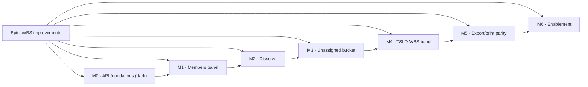

# Implementation Plan: WBS improvements

- **Feature spec:** [`./feature-spec.md`](./feature-spec.md)
- **Status:** Approved. **M0 landed** (API foundations + the honest delete warning);
  **M1 landed** (the Members tab, behind `VITE_WBS_IMPROVEMENTS`, default off).
- **Owner:** _(unassigned)_

> **Deviations from this plan as written, recorded rather than silently absorbed:**
>
> 1. **M0-T1's batch validation is against the RESULTING tree, not per distinct target parent.** The
>    planned per-row check accepts `[A→B, B→A]` — each row files a childless top-level summary under
>    another and passes alone, while together they close a cycle. The batch is now overlaid on the
>    plan's current edges and the whole result walked, which is both correct and cheaper (one
>    projected read + O(n) rather than O(rows × depth) queries).
> 2. **The M0-T3 concurrency regression could not be written as specified.** Two mirror `PATCH`es
>    raced with `Promise.all` do not overlap in this harness — measured, and recorded as
>    `TECH_DEBT #70`. The lock is gated by unit tests that assert the acquisition instead.
> 3. **M1 ships the table row-menu entry point too**, which the plan left implicit: a Members tab
>    reachable only by opening a summary and finding the tab is barely an entry point.
> 4. Per the product owner's decision, **table multi-select is confirmed in scope** but sequenced
>    after the canvas band as **M4b**, rather than dropped as this plan's C-1 originally proposed.

- **Flag:** `VITE_WBS_IMPROVEMENTS`, default **off** until M6 (C-8). API work is **not**
  flag-gated; the delete-warning fix (M0-T4) is **not** flag-gated.

## Breakdown

### Epic

**WBS improvements** — make the shipped WBS (ADR-0038) _workable_: manage membership from the
summary, remove a grouping without removing the work, show every activity in the WBS views,
and express the programme shape on the canvas. Roadmap theme: **WBS / programme structure**,
following the Gantt (ADR-0059).

Governing constraints, restated so no task can drift from them:

- **Recalc parity is structural.** No file under `apps/api/src/modules/schedule/engine/` is
  touched by any task in this plan. A structural test asserts it (M0-T5).
- **No schema change.** No migration in any milestone.
- **The pen gates every write.** Both new endpoints call `assertHoldsPen` (423).
- **Flag-off is byte-for-byte.** Every UI milestone ships its own flag-off parity suite, and
  those suites are **kept** at M6 — they are the rollback contract, not scaffolding.

---

## Milestone 0 — API foundations (dark, unflagged)

**Outcome:** the server can atomically re-parent a batch of activities and dissolve a summary,
under the pen and the plan advisory lock. Nothing in the UI reaches them yet. Ships
independently; `main` stays releasable.

---

#### Feature: Batch WBS membership write

> **Description:** `PATCH …/plans/:planId/activities/parents` — all-or-nothing re-parent of
> 1…2000 activities, modelled line-for-line on the existing `positions` endpoint.
> **Complexity:** M
> **Dependencies:** none (the validator and the batch precedent both exist)
> **Risks:** a per-row `assertValidParent` would be an N+1 ancestor walk → **mitigation:**
> validate per **distinct target parent**, not per row, and re-assert the cycle rule only for
> rows whose parent actually changed; measure at 2,000 rows before merging.
> **Testing requirements:** service unit tests for every reject path; API e2e against real
> Postgres incl. the "nothing was written" assertion on each failure; a 2,000-row timing check.

##### Task M0-T1 — DTO, repository write, service method (≈ one PR)

- **Description:** `UpdateParentsDto` (+ `ActivityParentDto`), `ActivityRepository.updateParents`
  (one set-based statement keyed by `id + version + org + plan + deleted_at IS NULL`), and
  `ActivitiesService.updateParents`.
- **Complexity:** M
- **Dependencies:** —
- **Risks:** silently accepting a partial write → **mitigation:** the count-shortfall
  branch is copied from `updatePositions` (404 vs 409 discrimination) and unit-tested for both.
- **Testing:** unit — happy path; duplicate id (422); unknown/foreign/deleted id (404); stale
  version (409); non-summary parent (422); cycle (409); `parentId: null` clears to top level;
  empty/oversized batch rejected by the DTO. `dto/activity-dto.validation.spec.ts` gains the
  DTO cases.
- **Development steps:**
  1. `dto/update-parents.dto.ts` — mirror `update-positions.dto.ts` exactly (1…2000,
     `@ValidateNested`, UUID, `version ≥ 1`, nullable `parentId`).
  2. `activity.repository.ts` — `updateParents(orgId, planId, rows, userId, tx): Promise<number>`.
  3. `activities.service.ts` — `updateParents(...)`: `resolveScope` → `assertCan('activity:update')`
     → `loadActivePlan` → `assertHoldsPen` → transaction → **`acquirePlanWriteLock`** →
     duplicate check → validate distinct target parents via the existing `assertValidParent`
     → write → count check → per-changed-row cycle re-assert → return fresh rows.
  4. Structured log line matching `updatePositions`.

##### Task M0-T2 — Controller route + OpenAPI

- **Description:** the `PATCH` route on `PlanActivitiesController` with full response
  declarations.
- **Complexity:** S
- **Dependencies:** M0-T1
- **Risks:** under-declared errors (the ADR-0053 M6 api-review finding) → **mitigation:**
  declare 403/404/409/422/423 explicitly and run **api-reviewer** on the PR.
- **Testing:** API e2e (Supertest) for 200 + every status above; an OpenAPI snapshot.
- **Development steps:** route → `@ApiOkResponse`/`@ApiConflictResponse`/
  `@ApiUnprocessableEntityResponse`/`@ApiLockedResponse` → `docs/API.md` → changeset.

##### Task M0-T3 — Close the plan-advisory-lock gap on the reparent path

- **Description:** `assertValidParent`'s callers (single-activity **create** and **update**)
  currently run **without** `acquirePlanWriteLock`, contradicting ADR-0038 invariant (a)
  (spec §0.2). Take the lock on both.
- **Complexity:** S
- **Dependencies:** none — deliberately **before** M0-T1 lands if it can be sequenced first
- **Risks:** taking a plan-wide advisory lock on **every** activity create/update serialises
  ordinary editing → **mitigation:** take it **only** when `parentId` is present in the DTO
  (the branch that already exists), so the common edit path is unchanged; measure.
- **Testing:** a concurrency regression test (two mirror reparents in parallel transactions
  must not both succeed); assert the lock is **not** taken when `parentId` is absent.
- **Development steps:** import `acquirePlanWriteLock`; guard both branches; add the
  regression test; note the fix in `docs/TECH_DEBT.md` and reference it from ADR-0063.

##### Task M0-T4 — Honest delete confirmation (**unflagged**)

- **Description:** the delete confirm for a `WBS_SUMMARY` states the descendant count and
  that they go together (spec §0.3, US-3). Client-side count from the already-loaded plan
  activities (transitive, via the same `wbs-groups` walk M3 introduces — or a local walk if
  M3 has not landed).
- **Complexity:** S
- **Dependencies:** none
- **Risks:** the count is client-side and could be stale → **mitigation:** it is a _warning_,
  not a gate; word it as "and the N activities below it", and the server is still authoritative.
- **Testing:** component tests for leaf copy (unchanged), summary-with-children copy, and
  summary-with-no-children copy; both call sites (`activity-crud-dialogs.tsx`,
  `ActivitiesTable`) asserted so they cannot drift.
- **Development steps:** shared copy helper → both call sites → tests → changeset (patch).

---

#### Feature: Dissolve a summary

> **Description:** `POST …/activities/:activityId/dissolve` — reparent direct children up one
> level, then soft-delete the (now childless) summary. `HierarchyLifecycleService` unchanged.
> **Complexity:** S–M
> **Dependencies:** M0-T3 (the lock)
> **Risks:** a child lost between the reparent and the delete → **mitigation:** both in one
> transaction under the plan lock, plus an e2e invariant test counting active activities before
> and after (must be `n − 1`).
> **Testing requirements:** service unit + API e2e incl. the nested case, the childless case,
> the non-summary reject and the pen reject.

##### Task M0-T5 — Service, route, OpenAPI, engine-untouched structural test

- **Description:** `ActivitiesService.dissolveSummary`, the route on `ActivitiesController`,
  and a structural test asserting the epic changes no engine file.
- **Complexity:** M
- **Dependencies:** M0-T3
- **Risks:** someone later "optimises" dissolve into the lifecycle service → **mitigation:**
  a docblock stating why it is not there, plus the ADR.
- **Testing:** unit — summary with children (children take the grandparent's id / null);
  nested summary child moves with its own subtree intact; childless summary; non-summary
  (422); missing (404); no pen (423). e2e — the count invariant; a restore-after-dissolve test
  proving the summary returns **alone**.
- **Development steps:**
  1. `dissolveSummary(principal, orgSlug, activityId)`: scope → `assertCan('activity:delete')`
     → load active row (404) → type check (422) → `assertHoldsPen` → transaction →
     `acquirePlanWriteLock` → `updateMany({ where: { parentId: id, deletedAt: null } })`
     setting `parentId = existing.parentId`, bumping `version`, stamping `updatedBy` →
     `lifecycle.cascadeSoftDelete(tx, 'activity', id, userId)`.
  2. Route `@Post(':activityId/dissolve')` → `@HttpCode(204)` → full `@Api*` declarations.
  3. `engine-untouched.structural.test.ts`.
  4. `docs/API.md`, changeset.

---

## Milestone 1 — Members panel (bulk assign UI)

**Outcome:** with the flag on, a Planner opens a `WBS_SUMMARY` and manages its whole membership
in one panel with one save.

---

#### Feature: `ActivityMembersPanel` + the Members tab

> **Description:** an extracted panel (the ADR-0062 rule) rendered as a conditional tab in
> `ActivityEditorDialog`, reusing the `definition` write scope.
> **Complexity:** L
> **Dependencies:** M0-T1/T2
> **Risks:** (a) a checklist over 2,000 rows is slow and unusable → **mitigation:** server-side
> search + the existing paging, "Load more" keyboard-reachable as the last row; (b) filtering
> silently dropping members from the diff → **mitigation:** the checked set is state, not
> derived from the visible page, with an explicit unit test.
> **Testing requirements:** unit (diff builder), component (states + gating), a11y (axe +
> announced counts), flag-off parity suite.

##### Task M1-T1 — The flag + the pure diff builder

- **Description:** `WBS_IMPROVEMENTS_ENABLED` in `config/env.ts` (default off, documented like
  its siblings) and a pure `membershipDiff(current, checked, byId)` returning the minimal row
  set with versions.
- **Complexity:** S
- **Dependencies:** —
- **Testing:** unit — no-op diff is empty; add/remove/both; unchanged rows never sent; a row
  whose version changed underneath is carried at its **latest** read version.
- **Steps:** flag → `features/wbs/model/membership-diff.ts` → tests.

##### Task M1-T2 — `useUpdateActivityParents` hook

- **Description:** the TanStack Query mutation + cache invalidation, mirroring
  `useUpdateActivityPositions`.
- **Complexity:** S
- **Dependencies:** M1-T1
- **Risks:** an optimistic update that lies on 409 → **mitigation:** no optimistic write;
  invalidate-and-refetch on settle (the panel is not a per-keystroke surface).
- **Testing:** unit with a mocked fetch for success and each error status → mapped message.

##### Task M1-T3 — `ActivityMembersPanel`

- **Description:** the panel itself — `SearchField`, checkbox rows, member count, save bar,
  gating, all five states.
- **Complexity:** L
- **Dependencies:** M1-T1/T2
- **Risks:** shading vs. hiding the write affordance (the ADR-0062 M6 finding, raised twice by
  two reviewers) → **mitigation:** the panel **always renders** its controls and shades them
  with an `aria-describedby`-linked reason; a test asserts the reason is linked, not adjacent.
- **Testing:** component — loading, empty, error, success, shaded; the announced settled count
  (WCAG 4.1.3); `saved` state actually passed to the save bar (the ADR-0062 M6 steps-panel
  defect — assert it); axe.
- **Steps:** component → `features/wbs/index.ts` barrel → tests.

##### Task M1-T4 — Wire the Members tab into `ActivityEditorDialog`

- **Description:** conditional tab for `WBS_SUMMARY`, positioned by subject (after General /
  Scheduling, before Logic), reusing the `definition` gate object.
- **Complexity:** M
- **Dependencies:** M1-T3
- **Risks:** a fifth independently-dirty scope worsening the ADR-0060 M6 discard problem →
  **mitigation:** Members joins the **existing** definition dirty-tracking and the existing
  unsaved-changes confirmation; a test opens the editor with Members dirty and asserts the
  confirmation fires.
- **Testing:** component — tab present only for `WBS_SUMMARY`; `gating.members === gating.general`
  **identity** test (the ADR-0062 precedent); tab order; keyboard traversal of the vertical rail.

##### Task M1-T5 — Flag-off parity suite for M1

- **Description:** `vi.mock('@/config/env', …{ WBS_IMPROVEMENTS_ENABLED: false })` pinning the
  editor's tab set and every touched screen.
- **Complexity:** S
- **Dependencies:** M1-T4
- **Testing:** the suite itself; **kept**, never weakened.

---

## Milestone 2 — Dissolve (UI)

**Outcome:** a planner can remove a grouping and keep the work, from wherever a summary is
visible.

##### Task M2-T1 — `useDissolveSummary` + the confirm dialog

- **Complexity:** S–M · **Dependencies:** M0-T5
- **Risks:** the confirm reading as a synonym for delete → **mitigation:** copy names the
  destination and the count ("moves its 12 activities up to _Superstructure_"), and states
  that dissolving cannot be reversed by restoring. Route the copy past **ux-reviewer**.
- **Testing:** component — copy for top-level vs. nested vs. childless; pending/error states.

##### Task M2-T2 — Wire Dissolve into the three menus (C-5)

- **Complexity:** M · **Dependencies:** M2-T1
- **Risks:** a lit-but-inert item (the ADR-0059 M6 zoom defect) → **mitigation:** the item is
  **shaded with a reason**, never hidden, when the gate is shut; asserted per call site.
- **Testing:** component per call site; `selection-actions.entry-routes.test.tsx` extended so
  the three entry routes cannot drift.

##### Task M2-T3 — Undo boundary + auto-recalc

- **Complexity:** S · **Dependencies:** M2-T2
- **Risks:** a stale rollup after dissolve → **mitigation:** `parentId` is already in
  `structureSignature` (`use-plan-workspace-model.ts:422`), so the coalesced recalc fires;
  assert it with a test rather than assuming.
- **Testing:** `use-plan-workspace-model` test — dissolve clears the history and triggers one
  coalesced recalc.

##### Task M2-T4 — Flag-off parity suite for M2

- **Complexity:** S

---

## Milestone 3 — The Unassigned bucket

**Outcome:** every activity appears in the WBS views; a half-structured plan reads honestly.

##### Task M3-T1 — `features/wbs/model/wbs-groups.ts` (pure)

- **Description:** the single definition of groups + Unassigned (spec §4.6), source-aware
  (`BarDateSource`), with the documented min/max-vs-calendar-roll divergence.
- **Complexity:** M · **Dependencies:** —
- **Risks:** a second rollup implementation drifting from the engine's → **mitigation:** the
  module computes **only** the derived bucket; real summaries' dates are read from the engine's
  persisted columns, never recomputed. A test asserts a real summary's dates pass through
  untouched.
- **Testing:** unit — no summaries (bucket = all); some summaries; no unassigned (bucket null);
  none computed (null dates, no bar); orphan promotion consistent with `row-model.ts`.

##### Task M3-T2 — Gantt row-model integration (C-2b)

- **Complexity:** M · **Dependencies:** M3-T1
- **Risks:** changing a **default-on** surface (ADR-0059) → **mitigation:** flag-gated **and**
  conditional on ≥1 real summary; a flag-off parity suite pins today's rows exactly.
- **Testing:** `row-model.test.ts` extended; `GanttPanel.test.tsx` for the derived row's
  non-interactive treatment; flag-off parity.

##### Task M3-T3 — Flag-off parity suite for M3

- **Complexity:** S

---

## Milestone 4 — The TSLD WBS band (the largest slice)

**Outcome:** a pinned programme strip across the top of the canvas, toggleable, aligned to the
time axis, select-only, budget-pinned, AT-reachable.

> **Feature complexity:** XL
> **Dependencies:** M3-T1 (the group model)
> **Risks:** (a) scene-height regression breaking flag-off parity → **mitigation:** `measure()`
> subtracts `0` when inactive, and the existing canvas parity paint test is extended to assert
> the inactive path byte-for-byte; (b) draw-budget regression → counting-stub gate; (c) a11y
> regression from removing summaries from the scene listbox → an invariant test on the count of
> AT-reachable activities across the toggle.

##### Task M4-T0 — **ADR-0063** (write and land it before code)

- **Description:** "The pinned WBS band and the canvas band model" — the band construction,
  the same-`viewRef` rule, the select-only contract, the depth cap (C-3), the scene-exclusion
  decision (C-4); amends ADR-0052 M4 and ADR-0055 §4/ADR-0056; records the dissolve semantics
  and the derived-bucket decision so ADR-0038 (immutable) is referenced, not edited.
- **Complexity:** M · **Dependencies:** approval of C-2/C-3/C-4
- **Testing:** `pnpm check:doc-links` (ADR-0058); CLAUDE.md §16 entry in the same PR.

##### Task M4-T1 — `wbs-band.ts` (pure geometry)

- **Description:** band bar rects on the shared axis, band height from rendered depth, label
  LOD via `truncateToWidth`, culling.
- **Complexity:** M · **Dependencies:** M4-T0
- **Risks:** re-deriving the axis → **mitigation:** import `screenXOfDay`/`daysBetween`
  verbatim; a test asserts a band bar's left edge equals the scene's for the same viewport
  (the ADR-0049 co-alignment test, copied).
- **Testing:** unit, exhaustive (the render-model standard).

##### Task M4-T2 — `paintWbsBand` in `paint.ts` + palette

- **Complexity:** M · **Dependencies:** M4-T1
- **Testing:** painter unit tests; `paint.wbs-band-budget.test.ts` counting-stub gate;
  token-contrast matrix extended (ADR-0055) for the band's colours across 3 themes.

##### Task M4-T3 — The 4th canvas layer in `TsldCanvas`

- **Description:** band `<canvas>`, top reservation in `measure()`, own dirty flag + palette
  ref, rAF integration, band hit-test → `onSelect`.
- **Complexity:** L · **Dependencies:** M4-T2
- **Risks:** the create-popover / cursor-readout / ghost anchoring all convert canvas-relative
  y to container y by adding `RULER_HEIGHT` (`TsldCanvas.tsx:102-105`) — the band silently
  breaks every one of those → **mitigation:** replace the constant with a single derived
  `sceneTopOffset` and route **all** call sites through it; a test asserts the popover anchors
  correctly with the band on and off.
- **Testing:** component tests with the band on/off; the **existing** canvas parity paint test
  extended to prove flag-off is byte-for-byte.

##### Task M4-T4 — Scene exclusion + a11y placement (C-4)

- **Complexity:** M · **Dependencies:** M4-T3
- **Risks:** summaries disappearing from AT → **mitigation:** the invariant test above.
- **Testing:** `TsldPanel.a11y.test.tsx` + `.axe.test.tsx` extended; the derived bucket
  announced as a non-selectable group.

##### Task M4-T5 — The `View▾ ▸ Structure ▸ WBS band` toggle

- **Complexity:** S · **Dependencies:** M4-T3
- **Testing:** `tsld-view-toggles.registry.test.ts` extended (the `Record` already makes an
  omission a compile error); toolbar test for flag-on and flag-off.

##### Task M4-T6 — Flag-off parity suite for M4

- **Complexity:** S

---

## Milestone 5 — Export & print parity

**Outcome:** the exported/printed diagram matches the screen.

##### Task M5-T1 — Band in `render-export-image.ts`

- **Complexity:** M · **Dependencies:** M4-T3
- **Risks:** the off-screen export surface has no band canvas → **mitigation:** paint the band
  into the same off-screen context at the reserved offset; a snapshot test with the band on/off.
- **Testing:** `render-export-image.test.ts` extended; `export-image` flag-off parity.

##### Task M5-T2 — Print surface + the Gantt printed programme

- **Description:** the derived bucket row appears in the printed Gantt where it appears on
  screen (ADR-0059 §6 prints **every** row).
- **Complexity:** S–M · **Dependencies:** M3-T2
- **Testing:** `PrintSurface` / `GanttPrintSurface` tests.

---

## Milestone 6 — Enablement

**Outcome:** the epic is on by default, reviewed end to end, and proven against a real API.

##### Task M6-T1 — Deferred specialist review pass over the combined diff

- **Description:** run **security-reviewer**, **api-reviewer**, **backend-performance-reviewer**
  over M0; **ux-reviewer**, **accessibility-reviewer**, **component-reviewer**,
  **performance-reviewer** over M1–M5. Fold every blocking finding **with a regression test**;
  record the non-blocking ones in `docs/TECH_DEBT.md`.
- **Complexity:** L · **Dependencies:** M5
- **Risks:** treating the pass as a formality — the last four epics each found real defects in
  code that had passed a human read → **mitigation:** the milestone is not done until each
  agent has reported and each blocking finding has a test.

##### Task M6-T2 — Flag-on Playwright journey (`apps/web/e2e-wbs/`)

- **Description:** its own CI step, against a real API **with the pen enforced** — the only
  place the optimistic-`version` trap and the 423 path are genuinely testable (a mocked fetch
  accepts any version, the ADR-0060 M6 lesson). Journey: take the pen → create a summary →
  bulk-assign 5 activities → verify the band and the Gantt → dissolve → assert **no activity
  was lost** → cascade-delete a second summary → assert the warning stated the count.
- **Complexity:** L · **Dependencies:** M6-T1
- **Testing:** the journey is the test; add the CI step and the `pnpm --filter @repo/web
test:e2e:wbs` script.

##### Task M6-T3 — Flip `VITE_WBS_IMPROVEMENTS` default-on

- **Complexity:** S · **Dependencies:** M6-T2
- **Steps:** `flagDefaultOff` → `flagDefaultOn` with the dated rationale docblock; keep every
  flag-off parity suite **pinned** (the rollback contract); update `CLAUDE.md` §16 + the flag
  list, `docs/ROADMAP.md`, `docs/BACKLOG.md` (open the resource-`GROUP` dissolve follow-up,
  C-6, and the table-multi-select follow-up, C-1); minor changeset.

---

## Sequencing & slices

M0 → M1 → M2 → M3 → M4 → M5 → M6. Every milestone is independently releasable:

- **M0** ships dark and unflagged; the only user-visible part (M0-T4, the honest delete
  warning) is a strict improvement that stands alone and is worth shipping on its own day.
- **M1/M2** are usable the moment an operator sets `VITE_WBS_IMPROVEMENTS=true`, without M3–M5.
- **M3** is a prerequisite for M4 only because both consume `wbs-groups.ts`; it is independently
  valuable (the Gantt gains the bucket).
- **M4** is the epic's centre of gravity. If it slips, M0–M3 still deliver asks #1–#3 in full.
- **M6** is a milestone, not a step: the last four epics each found multiple real defects here.

**Rollback:** set `VITE_WBS_IMPROVEMENTS=false`. The API endpoints stay reachable but
unreferenced (harmless — they are permission-, pen- and scope-gated); the canvas, Gantt,
editor and menus return byte-for-byte to today's, pinned by the parity suites.

## Definition of Done (per task)

Each task's PR satisfies the Feature Completion Criteria in
[`docs/PROCESS.md`](../../PROCESS.md): code, tests (≥80% on changed code; the API 74% / web 87%
ratchets of ADR-0058 must not regress), docs, security review, performance, accessibility,
Docker build, CI green, changeset, version impact.

## Risks & assumptions (rollup)

| Risk / assumption                                                                                                  | Likelihood | Impact   | Mitigation                                                                                                    |
| ------------------------------------------------------------------------------------------------------------------ | ---------- | -------- | ------------------------------------------------------------------------------------------------------------- |
| M4's band breaks the `RULER_HEIGHT` → container-y conversion used by the create popover, cursor readout and ghosts | **high**   | high     | One derived `sceneTopOffset`; route every call site through it; anchor tests with the band on and off (M4-T3) |
| Scene-height change breaks flag-off canvas parity                                                                  | med        | high     | `measure()` subtracts 0 when inactive; extend the existing parity paint test before writing the band          |
| Batch validation becomes an N+1 ancestor walk at 2,000 rows                                                        | med        | med      | Validate per **distinct** target parent; measure before merge (M0-T1)                                         |
| Taking the plan advisory lock on the reparent path serialises ordinary editing                                     | low        | med      | Take it only on the `parentId`-present branch; measure (M0-T3)                                                |
| The derived bucket's min/max is mistaken for an engine rollup and "fixed" into a second implementation             | med        | med      | Documented divergence + a unit test asserting the derivation, plus ADR-0063 §on the bucket                    |
| Members panel unusable at 2,000 activities                                                                         | med        | med      | Server-side search + existing paging + keyboard-reachable "Load more"                                         |
| Dissolve loses an activity under concurrency                                                                       | low        | **high** | One transaction under the plan advisory lock; e2e count invariant; the pen                                    |
| Restoring a dissolved summary confuses users (children do not return to it)                                        | med        | low      | Confirm copy states it explicitly; ux-reviewer on the copy                                                    |
| Resource-`GROUP` dissolve asymmetry is read as an oversight                                                        | med        | low      | Stated decision in the spec (C-6) and ADR-0063; backlog item opened at M6-T3                                  |
| Adding a fifth dirty scope worsens the ADR-0060 discard-confirmation problem                                       | med        | med      | Members joins the existing **definition** scope, not a new one; test the confirmation                         |
| M6's review pass is treated as a formality                                                                         | med        | high     | It is a milestone with named agents and a "blocking finding ⇒ regression test" rule                           |
| **Assumption:** a plan holds ≤ ~2,000 activities (ADR-0021/0038 ceiling)                                           | —          | —        | Batch cap is 2,000; the band and bucket are O(n) over the same set                                            |
| **Assumption:** the WBS rollup auto-recalc gap is already fixed (`parentId` is in `structureSignature`)            | —          | —        | Verified at `use-plan-workspace-model.ts:422`; M2-T3 asserts it rather than assuming                          |
