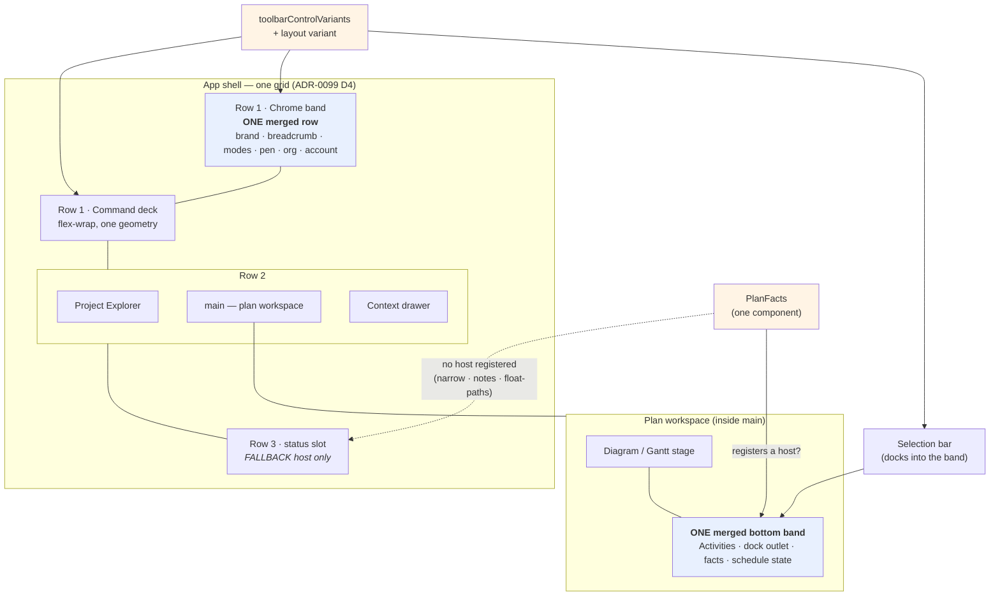
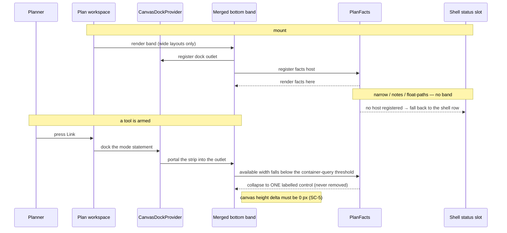
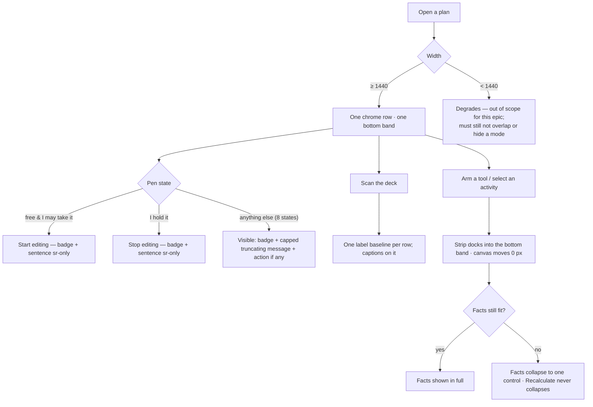

# Feature Spec: Workspace chrome fit — one header row, one bottom band, one label treatment

- **Status:** Draft — awaiting approval
- **Author(s):** feature-analyst (Product Owner / Solution Architect / Technical Lead hats)
- **Date:** 2026-08-25
- **Tracking issue / epic:** _(to be assigned)_
- **Roadmap link:** plan workspace — vertical budget (continues `docs/specs/workspace-chrome/`)
- **Related ADR(s):** to be filed as **ADR-0110** (next free number at filing time — ADR-0071's
  lesson: pick the number when the file lands, and if it has been taken, record the collision rather
  than routing around it). Builds on ADR-0028, ADR-0031, ADR-0055, ADR-0082, ADR-0090, ADR-0091,
  ADR-0092, ADR-0097 (Landing D1), ADR-0099, ADR-0104, ADR-0109.

---

## 0. What I checked, and what I found wrong

CLAUDE.md §19.11 says a brief is not evidence and §19's re-verify rule says a problem statement is a
claim. Everything below was checked against `main` before anything was designed. **Five things in
the brief are wrong, and two of them change the design.** They are listed here rather than buried,
because two of them are load-bearing.

| #   | Claim in the brief                                                                                                                                                              | Verdict                                                                                                                                                                                                                                                                                                                                                                                                                                                                                                                                                                                                             | Evidence                                                                                                                                                                                                                                                                                                                                |
| --- | ------------------------------------------------------------------------------------------------------------------------------------------------------------------------------- | ------------------------------------------------------------------------------------------------------------------------------------------------------------------------------------------------------------------------------------------------------------------------------------------------------------------------------------------------------------------------------------------------------------------------------------------------------------------------------------------------------------------------------------------------------------------------------------------------------------------- | --------------------------------------------------------------------------------------------------------------------------------------------------------------------------------------------------------------------------------------------------------------------------------------------------------------------------------------- |
| F1  | "The width ladder, band floors, hysteresis, `CHROME_RESIDUAL_PX` and the `⋯` are all STILL PRESENT — ADR-0109's Consequences claimed they would be deleted and were corrected." | **WRONG, and it inverts a fact.** ADR-**0099** M5's Consequences claimed the deletion and were corrected. ADR-**0109** D1 actually performed it. All five are gone.                                                                                                                                                                                                                                                                                                                                                                                                                                                 | `Toolbar.tsx:92-111` (_"It no longer measures anything… deleted in one commit"_); `Deck.tsx:14-50`; zero code hits for `CHROME_RESIDUAL_PX` / `computeLadder` / `ToolbarOverflow` (11 hits, all stale prose); `e2e-toolbar-fit/` and `test:e2e:toolbar-fit` absent from `apps/web/package.json`; `ci.yml:269-270` records the deletion. |
| F2  | "+198 px of item width may push items into the `⋯` at narrow widths. Measure it."                                                                                               | **WRONG, and the real risk is worse.** There is no `⋯`. `Deck` is `flex-wrap` (`Deck.tsx:265`) with no measurement of any kind, so +198 px does not hide anything — it **wraps**, i.e. it is paid in the one currency this epic is trying to save. `docs/TECH_DEBT.md` #185 measured the deck at **182 px tall** with `aboveCanvas` at **357 px** and the canvas down to **284 px at 1440×960**.                                                                                                                                                                                                                    | `Deck.tsx:31` (_"no `ResizeObserver`… no priority ranking"_); TECH_DEBT #185.                                                                                                                                                                                                                                                           |
| F3  | The inline probe shows "deck height 36 → 36 (NO height saving)", so "the plan must not claim either".                                                                           | **The probe measured the wrong element and the number is meaningless.** `m0-header-and-treatment.spec.ts:212-213` derives `deck` from `document.querySelector('[data-toolbar-item]')` — the **first** such node in the document, which is `mode-early` in the _mode_ toolbar, not the deck. That row contains no stacked items, so the probe converted 12 items in one row and then measured the height of a different row. `36` is the mode row's control height, unchanged because nothing in it changed. It also contradicts TECH_DEBT #185, which names un-stacking as "the single biggest term in the height". | `m0-header-and-treatment.spec.ts:210-233`; the JSON's own `maxItemH: 40` beside `deckHeightBefore: 36`; TECH_DEBT #185.                                                                                                                                                                                                                 |
| F4  | "31 items — 12 stacked, 19 inline — producing **10 distinct label top edges**."                                                                                                 | Item counts **correct**. The **baseline count is contaminated** and is not 10. The probe takes the _last_ leaf `` with text inside each item (`:153-157`), and `ToolbarButton` renders `sr-only` spans for `disabledReason` and `srDescription` **after** the label (`ToolbarButton.tsx:134-144`). A pen-gated or described item therefore reports its hidden span's top, not its label's. It is also 10 at 1280/1440/1646 and **9 at 1920** — the brief states it unqualified.                                                                                                                               | `m0-header-and-treatment.spec.ts:153-157`; `ToolbarButton.tsx:134-144`; the JSON's `1920.treatment.distinctLabelTops: 9`.                                                                                                                                                                                                               |
| F5  | "four of them inside one visual row spanning 19 px" (three named causes).                                                                                                       | **Understated, and there is a fourth cause.** There are two such rows, each with four reported tops spanning exactly 19 px (130→149 and 192→211). And the deck's group cards are `items-stretch` (`Deck.tsx:285,333`) over items of **three** heights (40 stacked / 36 inline / 32 search), so two cards of different heights place the same kind of label at different offsets. One control height is therefore not one of three fixes — it is the fix the other two depend on.                                                                                                                                    | `Deck.tsx:285,333,383-391`; the JSON's per-item `h` values.                                                                                                                                                                                                                                                                             |

Two further checks came back **confirmed**: the `data-activities-bar` comment about the word
"Activities" biting for the third time is real and verbatim (`activity-bottom-panel.tsx:166-174`),
and `app-header.tsx:31-35`'s 540 px is a real measured figure with a citable source
(`docs/specs/design-system-rewrite/m0-landing-d1-measurement.md`).

**I could not re-run the harness.** This session has no shell. The brief's summary was instead
checked line by line against the **raw JSON already on disk**
(`apps/web/measure-output/m0-header-and-treatment.json`, `measuredAt: 2026-08-25T09:11:27Z`) and
against the harness source. Every arithmetic figure in the brief reconciles with that file; the
defects above are in the **instrument**, which is why reading the JSON could not have found them and
reading the spec could. M0-T1 re-runs it with the probe repaired, and no milestone after M0 may cite
a number this spec has not had re-derived.

### One number in the brief is not evidence at all

**"A real plan name measures ~227 px"** is not in this measurement. `identity.breadcrumb` is
`identityParts[0].w` — the **track** of a `flex-1` block, which is why it reads 404 / 564 / 770 /
1044 at the four widths. The brief says so itself, and then uses 227 in the conclusion. 227 comes
from a different harness in a different epic (`m0-landing-d1-measurement.md:49-51`) measuring a
**different string** (`Riverside — Phase 2 Substructure`) — and the block in question today is not a
plan name but _project crumb + separator + plan name + status badge + Edit-plan pencil_
(`plan-workspace-toolbar.tsx:1227-1258`). The brief's closing step, "hence the 1440 target is met by
spending the redundancy alone", therefore rests on a figure that measures neither the right string
nor the right element. It may still be true. **M0-T2 establishes it or disproves it before M3
builds on it.**

---

## 1. Business understanding

### Problem

Three complaints raised by the product owner against the released **`web-v0.103.0`**
(`apps/web/package.json:3`), all about the chrome wrapped around the diagram:

1. **The header sits on two rows.** The chrome band renders `AppHeaderRow` (56 px: brand,
   organisation switcher, account chip) and, immediately beneath it, the plan identity/mode row
   (45 px: breadcrumb, status badge, Edit-plan pencil, `MODE` caption, four mode buttons, pen
   status). Two rows of chrome answer one question — _what am I looking at and who may change it_.
2. **The Activities handle row and the plan status bar are two bands.** 41 px and 40 px, stacked
   directly on top of one another at the foot of the workspace, and the word **"Activities" is
   rendered twice** across them (measured: `activitiesWordOccurrences: 2` at all four widths).
3. **The command surface's label baselines alternate and draw the eye.** Within a single visual row
   of the deck, labels sit at several different heights, and the group captions sit at another.

They are one problem in two dimensions. The plan workspace's **vertical budget** is the thing the
product exists to spend on a diagram, and the last measurement of it (TECH_DEBT #185, 2026-08-24)
puts **357 px above the canvas** and a canvas of **284 px at 1440×960** — i.e. chrome is winning.
Complaints 1 and 2 are ~85 px of that. Complaint 3 is horizontal on its face and vertical in
consequence, because a surface that wraps pays for width in rows.

**Why now.** ADR-0109 deleted the width ladder and the overflow menu eight days ago; the constraint
that shaped four consecutive epics is gone, and the arithmetic every one of them was tuned against
no longer holds. This is the first epic that gets to design against the surface as it now is.

### Users

Every role that opens a plan, on the same surface — the chrome is not role-scoped:

| Role               | What changes for them                                                                                                                                                                                          |
| ------------------ | -------------------------------------------------------------------------------------------------------------------------------------------------------------------------------------------------------------- |
| **Planner**        | The primary beneficiary. Holds the pen, uses the deck constantly, works on a 1646 px Surface Pro. Gains diagram height and a command surface whose labels do not shimmer.                                      |
| **Contributor**    | Reports progress; does not hold the pen. **Most exposed to the pen-status change** — the states in which the pen cluster's sentence is the only thing naming who holds the lock are disproportionately theirs. |
| **Viewer**         | Read-only. In `FREE`-without-`canAcquire` the pen cluster renders a badge and a sentence and **no button at all** (`lock-view.ts:64-68`), so a naive deletion leaves them an empty slot.                       |
| **Org Admin**      | Sees the `canOverride` variant, whose message is `heldByOther(holder) + adminNote` — the longest of the ten. It is the worst case the merged row must survive.                                                 |
| **External Guest** | **Out of scope, and checked:** the `/share` guest view is a separate route that does not mount the app shell, the chrome band or the plan status bar. Nothing here reaches it.                                 |

### Primary use cases

1. Open a plan on a 1440–1920 px display and see more diagram than chrome.
2. Read, at a glance and without hunting, _which plan, which mode, which view, who may edit_.
3. Find a command in the deck by scanning it, without the eye being pulled by a ragged label line.
4. Keep reading the plan's facts (activity count, data date, finish, critical count, schedule
   staleness and its remedy) while a canvas strip is docked.

### User journeys

Happy path, unchanged in every step but the geometry: sign in → Project Explorer → plan → the
workspace opens with **one** chrome row above the deck and **one** band below the diagram; the
planner takes the pen, arms a tool, and the docked statement appears in the bottom band **without
moving the diagram** and **without any fact vanishing**.

Alternates that this epic must not break, each of which has bitten before:

- A **peer holds the pen**: the reader must still learn _who_, and reach _Request control_.
- A planner switches **Diagram ↔ Gantt**: both switches stay directly reachable at every width.
  This is the failure that withdrew the merge last time (`m0-landing-d1-measurement.md:268-279`).
- The window narrows to **1440**: the row still fits, nothing overlaps, nothing is unclickable.
- Below `md` (single-pane), on the Gantt, and with the Notes or Float-paths dock holding the pane:
  the plan's facts still have a host. See §3 "The host that does not exist".

### Expected outcomes

- **~85 px returned to the diagram** at every width (45 from the header merge — the exact figure
  D1b measured and then gave back; 40 from the bottom band), plus whatever M1 returns or costs,
  which M0 will state rather than assume.
- One label baseline per row on the command surface, and captions on it.
- The plan's facts and the canvas's transient strips coexist in one band, with a declared rule for
  what gives way — rather than one silently displacing the other.

### Success criteria

Every one is measured by a harness or asserted by a gate; none is a judgement.

| #    | Criterion                                                                                                                                                                                         | Instrument                                                  |
| ---- | ------------------------------------------------------------------------------------------------------------------------------------------------------------------------------------------------- | ----------------------------------------------------------- |
| SC-1 | `aboveCanvas` falls by ≥ 40 px and the bottom bands by ≥ 38 px, at 1440 / 1646 / 1920, measured before and after on the same machine and fixture.                                                 | `measure-workspace-fit` (M0 baseline, re-run per milestone) |
| SC-2 | The merged header row **fits at 1440, 1646 and 1920**: no horizontal overflow of its container, and every control in it hit-testable via `elementFromPoint`.                                      | `e2e-workspace-fit` fit sweep                               |
| SC-3 | `Early`, `Visual`, `Diagram`, `Gantt` are **directly reachable** — visible, hit-testable, and not inside any disclosure — at every swept width, in both plan views.                               | `e2e-workspace-fit`                                         |
| SC-4 | Across the whole command surface, **one label baseline per visual row**, and each group caption's label baseline equals its row's. Measured from the **visible** label span, `.sr-only` excluded. | `e2e-workspace-fit`                                         |
| SC-5 | Arming a tool and selecting an activity each cost the canvas **0 px** of height, asserted as an equality — ADR-0092's guarantee, re-proved against the merged band.                               | `e2e-workspace-fit`                                         |
| SC-6 | In all **ten** `LockView` states the `role="status"` region's text content is **unchanged** from `web-v0.103.0`, and every state renders at least one visible element.                            | unit, total over `resolveLockView`                          |
| SC-7 | Every `[data-toolbar-focusable]` control clears **24 × 24 px** and is hit-testable at every swept width — closing TECH_DEBT #186.                                                                 | `e2e-workspace-fit`                                         |
| SC-8 | No fact is lost: the plan's five facts are reachable in every plan view, at every width, expanded and collapsed.                                                                                  | structural + `e2e-workspace-fit`                            |

### Open questions

**CQ-1 — CRITICAL, needed before M1 starts. Which direction is "one label treatment"?**
The brief settles that the full fix ships and leaves the direction open, and the two answers are not
symmetric:

- **Stack everything** (icon above label, the deck's current geometry extended to its ~11 `render`
  items). Preserves **approved mockup decision 1** (`docs/specs/workspace-redesign/README.md:44-46`,
  "Stacked buttons — icon above a 9.5 px label"). Costs no width. Costs work in
  `ToolbarPopover`, `ToolbarSplitButton` and four bespoke items.
- **Inline everything.** Reverses that approved decision, and costs a **measured +198 px** of item
  width — which, on a `flex-wrap` deck, is paid in rows. TECH_DEBT #185 says un-stacking is "the
  single biggest term in the height" and explicitly files it as _"the product owner's call… not a
  unilateral revert"_.

> **My default if you say nothing: STACK.** It honours the decision already taken, it cannot widen
> the deck, and it is reversible. But #185 also says un-stacking may be the largest available
> vertical saving, and this epic is about vertical space — so if you want that saving, say so and
> M0-T3 will price it properly (the existing probe could not).

**CQ-2 — CRITICAL only if M0 says 1440 does not clear.** The brief's budget spends the pen
redundancy and nothing else. If M0-T2 reports the merged row short of a **≥ 120 px slack at 1440**
(the falsification bar Landing C set and Landing D1 adopted), what is spent next?

> **My default order, cheapest first:** the `MODE` caption (~50 px, the group already carries an
> `aria-label`) → shortening `Early mode`/`Visual mode` to `Early`/`Visual` (~80 px, WCAG 2.5.3
> safe if the visible and accessible names change together) → the organisation switcher (192 px,
> but that is a _capability_ question, not a width one, so it stops and asks). **The brand wordmark
> (103 px) is not spent, per the brief.** And if none of that clears 1440, **the merge is withdrawn
> for a third time** rather than a mode being put behind a disclosure. That is not defeatism; it is
> the only rule that has ever been right here.

Everything else has a stated default in §2/§4 and does not block.

---

## 2. Functional requirements

### User stories & acceptance criteria

> **US-1** — As a **planner**, I want the plan's identity, mode and pen status on the **same row**
> as the application header, so that the workspace spends one row of chrome on chrome instead of two.
>
> **Acceptance criteria**
>
> - **Given** a plan open at 1440, 1646 or 1920 px, **when** the workspace renders, **then** there is
>   exactly **one** chrome row above the command deck, and it contains the brand, the organisation
>   switcher, the account chip, the breadcrumb, the plan status badge, the Edit-plan control, the
>   four mode controls and the pen action.
> - **Given** any of those widths, **when** the fit sweep runs, **then** the row's content does not
>   exceed its container and every control in it answers `elementFromPoint` at its own centre.
> - **Given** a plan name long enough to overflow, **when** the row renders, **then** the **plan
>   name** is the first thing to truncate and it carries a `title` with the full string; the mode
>   controls and the pen action do not shrink, do not move and do not enter a disclosure.
> - **Given** the merged row, **when** `measure-workspace-fit` runs, **then** `aboveCanvas` is at
>   least 40 px lower than the M0 baseline at every swept width.

> **US-2** — As a **planner**, I want the pen's redundant chip and sentence gone, so that the row I
> read most often is not repeating a button I can already see.
>
> **Acceptance criteria**
>
> - **Given** the pen is free and I may take it, **when** the row renders, **then** the only visible
>   pen element is the **Start editing** button; the badge and sentence are not painted.
> - **Given** I hold the pen with no pending request, **when** the row renders, **then** the only
>   visible pen element is **Stop editing**.
> - **Given** any other pen state, **when** the row renders, **then** the state is still **visible** —
>   a peer's name, a read-only badge, an incoming request, a lost-control notice — capped in width,
>   truncating, with a `title` carrying the full sentence.
> - **Given** any of the ten states, **when** the `role="status"` region's text content is read,
>   **then** it is character-for-character what `web-v0.103.0` announced. _(The chip and sentence are
>   moved to `sr-only`, never deleted: they are the live region's announcement, not decoration —
>   `CompactPenStatus.tsx:54-79`.)_

> **US-3** — As a **planner**, I want the Activities handle row and the plan status bar to be one
> band, so that the foot of the workspace costs one row and says "Activities" once.
>
> **Acceptance criteria**
>
> - **Given** a plan on a wide layout with the activities panel collapsed, **when** the workspace
>   renders, **then** there is one band at the foot carrying the Activities label, the expand
>   control, the plan's facts and the schedule-state region — and the shell's status row is
>   zero-height.
> - **Given** the same, **when** the DOM is searched for the exact string `Activities` in a leaf
>   element, **then** it occurs **once**.
> - **Given** the activities panel is expanded, **when** the workspace renders, **then** the same
>   facts appear in the panel's header row — from the same component, not a copy.
> - **Given** a plan on a narrow layout, on the Gantt, or with the Notes/Float-paths dock holding
>   the pane, **when** the workspace renders, **then** the facts are still present. _(See §3.)_

> **US-4** — As a **planner**, I want a strip docking into that band not to take the plan's facts
> away, so that a fact never disappears without a reason I can see.
>
> **Acceptance criteria**
>
> - **Given** the merged band, **when** I arm a tool or select an activity, **then** the canvas's
>   height changes by **exactly 0 px** and the docked strip is visible.
> - **Given** a docked strip wide enough that the facts no longer fit, **when** the band renders,
>   **then** the facts **collapse into a single labelled control** that opens them — they are never
>   removed, and the control is focusable and named.
> - **Given** the schedule is `stale`, **when** the facts collapse, **then** the **Recalculate**
>   control does **not** collapse: a remedy stays where its subject is (ADR-0082).

> **US-5** — As a **planner**, I want one label baseline per row on the command surface, so that
> scanning it does not feel like reading a ransom note.
>
> **Acceptance criteria**
>
> - **Given** the deck at any swept width, **when** the visible label span of every
>   `[data-toolbar-item]` in one visual row is measured, **then** all of them share one top edge
>   (± 1 px for sub-pixel rounding).
> - **Given** the same, **then** each group caption's visible label shares that top edge.
> - **Given** the same, **then** every control in the row has the same height.
> - **Given** `@media (pointer: coarse)`, **when** the sweep runs, **then** no control's minor axis
>   is smaller than it was at `web-v0.103.0` (TECH_DEBT #127/#133 are not made worse).

> **US-6** — As a **keyboard or AT user**, I want everything the geometry changes to remain
> reachable and named, so that a layout epic does not cost me a control.
>
> **Acceptance criteria**
>
> - Roving `tabindex` order across the merged row and the deck is unchanged in **sequence**.
> - Every `[data-toolbar-focusable]` clears 24 × 24 px and is hit-testable (SC-7, TECH_DEBT #186).
> - No control acquires the native `disabled` attribute. `aria-disabled` + a linked `sr-only`
>   reason, as everywhere else.
> - The merged header row is one `banner` landmark; the `sr-only <h1>` naming the plan stays inside
>   `<main>` (`plan-workspace-toolbar.tsx:1131-1138`), and no second `banner` is created.

### Workflows

**Merged header row, give-way order (declared, not emergent).** Left to right:
`[drawer trigger (<lg)] [brand] [breadcrumb + badge + edit] [MODE + four modes] [pen] [org switcher] [account]`.
Exactly one block carries `flex-1 min-w-0` — the breadcrumb block. Everything else is `shrink-0`.
Order of loss as width falls: **plan-name characters → project-crumb characters → (M0's answer to
CQ-2) → withdraw**. No mode, no pen action and no account control is ever in the give-way path.

**Merged bottom band.** Left to right:
`[Activities label] [dock outlet, flex-1 min-w-0] [facts] [schedule state] [expand/collapse]`.
The facts block observes its own available width and collapses to one control below a threshold; the
schedule-state region never collapses.

### Edge cases

| Case                                                                 | Expected behaviour                                                                                                                                                                                                                                                              |
| -------------------------------------------------------------------- | ------------------------------------------------------------------------------------------------------------------------------------------------------------------------------------------------------------------------------------------------------------------------------- |
| Plan name longer than the row                                        | Truncates with an ellipsis; `title` carries the full string; the row does not grow or wrap.                                                                                                                                                                                     |
| Plan name of 1–5 characters                                          | The row simply has slack. **The fixture must not use one** — a 37 px name is what produced a false PROCEED in Landing C (`m0-landing-d1-measurement.md:46-57`).                                                                                                                 |
| Organisation name long                                               | Already truncated at `max-w-[12rem]` (`app-header.tsx:73`); unchanged.                                                                                                                                                                                                          |
| Pen held by a peer with a long display name                          | Message truncates with a `title`; the badge and the action never truncate.                                                                                                                                                                                                      |
| Pen state with `actions: []` (Viewer; `FREE` without `canAcquire`)   | The badge renders **visibly**. This is the state a naive "delete the redundancy" leaves empty.                                                                                                                                                                                  |
| Lost control (a just-received 423)                                   | Renders visibly with its **Dismiss** action; it is a warning, never collapsed.                                                                                                                                                                                                  |
| Plan with 0 activities                                               | Facts read `0` / `Not set` / `Not calculated`, exactly as today. Nothing is omitted; the ADR-0098 "omit, never zero" rule is about a _reader's permissions_, not about an empty plan.                                                                                           |
| Schedule summary not yet arrived                                     | Facts read `…`; `scheduleState` is `pending` and the region renders nothing — unchanged (`plan-status-bar.tsx:38`).                                                                                                                                                             |
| A very wide docked strip (the plural selection bar with a long name) | Facts collapse to one control. The band may grow past `min-h-9` — it already may (`activity-bottom-panel.tsx:152`, "a strip taller than the row grows it instead of being clipped").                                                                                            |
| Activities panel expanded, dock active                               | Facts render in the panel header, same component, same collapse rule.                                                                                                                                                                                                           |
| Narrow (`<md`) single-pane                                           | No collapsed bar exists; the facts fall back to the shell status row. **This is a fallback, not a duplicate** — see §3.                                                                                                                                                         |
| Gantt view                                                           | The activities panel is mounted in the wide branch regardless of view (`plan-workspace-toolbar.tsx:1456-1497`), so the band exists. Asserted, not assumed.                                                                                                                      |
| Notes / Float-paths dock holding the narrow pane                     | No activities panel is mounted at all; facts fall back to the shell status row.                                                                                                                                                                                                 |
| `localStorage` unavailable                                           | Deck folds already degrade silently (`Deck.tsx:112-131`). Nothing new is persisted by this epic.                                                                                                                                                                                |
| A deck group folded                                                  | Its items are absent from the DOM. The baseline gate measures what is rendered; TECH_DEBT #182 records that no journey drives the folded case — **this epic's journey closes that**, since folding is the cheapest way to prove the caption baseline rule survives a re-layout. |

### Permissions

**No permission changes. No new capability. No API call.** Mapping to ADR-0012 for completeness:

| Surface          | Gate today                                                                                                                    | Gate after                                    |
| ---------------- | ----------------------------------------------------------------------------------------------------------------------------- | --------------------------------------------- |
| Edit-plan pencil | `model.canWrite`                                                                                                              | unchanged (`plan-workspace-toolbar.tsx:1247`) |
| Mode controls    | `authoringEnabled = canEditSchedule && !lateOverlayActive`                                                                    | unchanged                                     |
| Pen actions      | server capability flags only — `canAcquire`/`canRequest`/`canTakeOver`/`canOverride`, never re-derived (`lock-view.ts:30-36`) | unchanged                                     |
| Recalculate      | `ScheduleState.refusal`, shaded with its reason                                                                               | unchanged                                     |
| Deck items       | registry predicates                                                                                                           | unchanged                                     |

The registry, its predicates and `resolveItems` are untouched. If a milestone finds itself editing
`toolbar-registry.ts`'s resolution rules, it has left this epic's scope.

### Validation rules

None — no user input is added. Two internal invariants take the place of validation and are gated:

- **V-1** — `toolbarControlVariants` has exactly one geometry variant, and every call site names it.
  No call site re-declares layout with `!important`. _(Structural test; today `Deck.tsx:383-391` is
  the only offender and it is the cause of the whole complaint.)_
- **V-2** — the pen's visible-content rule is **total** over `LockView`: adding a state to
  `resolveLockView` without deciding what it shows is a compile error, not a blank slot.

### Error scenarios

No new server interaction, so no new status codes. The failure modes are rendering ones:

| Scenario                                               | Detection                                                                  | User-facing result                                                                 |
| ------------------------------------------------------ | -------------------------------------------------------------------------- | ---------------------------------------------------------------------------------- |
| Merged row content exceeds its container at some width | `e2e-workspace-fit` fit sweep, per width                                   | CI red. Never shipped — this is exactly the defect ADR-0090 M1 found live at 1920. |
| A control shrinks to zero visible width                | `elementFromPoint` at the control's centre, **not** an overhang comparison | CI red. An overhang check passes a zero-width control (ADR-0090 M5).               |
| A fact silently disappears when a strip docks          | SC-8 structural + journey                                                  | CI red.                                                                            |
| The pen live region's announcement changes             | SC-6 unit, total over the ten states                                       | CI red.                                                                            |
| The dock's 0 px guarantee breaks                       | SC-5 equality assertion, dock-empty vs dock-full                           | CI red.                                                                            |
| A label baseline diverges                              | SC-4, measuring the **visible** span                                       | CI red.                                                                            |

---

## 3. Technical analysis

| Area           | Impact                          | Notes                                                                                                                                                                                                                                                                                                                                                  |
| -------------- | ------------------------------- | ------------------------------------------------------------------------------------------------------------------------------------------------------------------------------------------------------------------------------------------------------------------------------------------------------------------------------------------------------ |
| Frontend       | **high**                        | ~12 files. Chrome band, header, plan workspace toolbar, pen status, status bar, activities panel, and the shared toolbar CVA + its 8 call sites.                                                                                                                                                                                                       |
| Backend        | **none**                        | No module, service or endpoint is touched.                                                                                                                                                                                                                                                                                                             |
| Database       | **none**                        | No migration. `database-architect` is therefore **not** engaged — because there is no schema change to design, not because one was judged too small (CLAUDE.md §19.3).                                                                                                                                                                                 |
| API            | **none**                        | No DTO, no route, no OpenAPI change.                                                                                                                                                                                                                                                                                                                   |
| Security       | **none**                        | No new data reaches the client; no gate is re-derived. `security-reviewer` runs in the M4 gate pass regardless.                                                                                                                                                                                                                                        |
| Performance    | **low, and it must be checked** | The facts block needs to know its available width. A `ResizeObserver` here would re-import the defect class ADR-0109 deleted — a row measuring its own leftover width. **Default: no observer.** Use a container query (`@container`), which is a style-time answer with no measurement loop and is already this repo's idiom (`FieldGrid`, ADR-0061). |
| Infrastructure | **low**                         | One new Playwright config + one CI step (`e2e-workspace-fit`) and one measurement config.                                                                                                                                                                                                                                                              |
| Observability  | **none**                        | No logs, metrics or traces.                                                                                                                                                                                                                                                                                                                            |
| Testing        | **high**                        | New journey + fit gate; new structural tests; new total-over-states unit test; re-baselined component suites.                                                                                                                                                                                                                                          |

### The engine, and the parity gate

**The CPM engine is not imported and no migration runs**, so the ADR-0034 recalculation parity gate
is untouched **by construction** — in its honest form: there is nothing here to hold parity for.
`apps/web` only, which is what makes the whole epic revertible by commit.

### Dependencies and prerequisites

- **M0 must land before any other milestone.** Six consecutive epics in this register had a width
  expectation contradicted by their own measurement, always in the same direction. This one has
  already had five brief claims contradicted before a line was written.
- **CQ-1 must be answered before M1**, because it decides which of two component surgeries happens.
- **M1 before M3.** M1 changes the mode cluster's control geometry, which is a term in M3's budget.
- No dependency on anything outside `apps/web`.

### The host that does not exist — the sharpest technical finding

`PlanStatusBar` is portalled to the shell's `status` slot (`plan-workspace-toolbar.tsx:1604-1614`)
and is therefore rendered **once per plan workspace, in every view and at every width**.
`ActivityPanelCollapsedBar` is **not**: it renders only in the wide branch when the panel is
collapsed (`:1475-1476`). There are three live layouts where **no activities handle row is mounted
at all**:

1. narrow (`!isWide`) single-pane — the view toggle switches panes instead;
2. narrow with the **Notes** dock holding the pane (`:1555-1558`);
3. narrow with the **Float paths** dock holding the pane (`:1548-1554`).

So "merge the status bar into the Activities handle row" would, taken literally, **delete the plan's
facts on three real layouts**. That is ADR-0081's defect exactly — a capability with no entry point
— and TECH_DEBT #156 records the same shape from four days ago.

**The design answer is not to invent a mechanism but to reuse the one already solving this problem
in the same row.** `CanvasDockOutlet` registers a host and falls back to rendering in place when
none is registered (`activity-bottom-panel.tsx:29-42` records why, including the WCAG 4.1.3 failure
that taught it). The facts take the same shape: a `PlanFactsOutlet` in the activities handle row,
and the shell's status slot as the fallback when nothing registers. **One component, two possible
hosts, exactly one mounted** — which is also what makes the "Activities once" assertion and the
0 px-cost assertion both meaningful.

### What the shared CVA change actually reaches — the enumeration the brief asked for

`toolbarControlVariants` (`toolbar-styles.ts:83-100`) has **8 call sites across 6 files**; a
geometry variant moves all of them:

| #    | Call site                                       | Surface                                                                         |
| ---- | ----------------------------------------------- | ------------------------------------------------------------------------------- |
| 1    | `ToolbarButton.tsx:125`                         | every plain toolbar button — deck, mode row **and** the floating selection bar  |
| 2    | `ToolbarPopover.tsx:114`                        | popover triggers (`View ▾`, `Filter`, `Analysis`, `Share & export`)             |
| 3    | `ToolbarSplitButton.tsx:125`                    | `Add activity`, `Link tool`                                                     |
| 4–6  | `selection-actions.tsx:263, 290, 412`           | the **canvas selection bar** — i.e. the dock's own contents                     |
| 7–10 | `tsld-toolbar-items.tsx:1222, 1381, 1577, 1807` | four bespoke render items, incl. the `tone: 'info'` read-out at `max-w-[14rem]` |

Plus `toolbarSplitCaretVariants` / `TOOLBAR_CARET_TARGET` at `toolbar-styles.ts:59-63` and
`selection-actions.tsx:284-292`.

Two consequences worth stating before anyone edits the file:

- **Call sites 4–6 are inside the dock.** A geometry change there changes the height of the strips
  that land in the merged bottom band — so M1 and M2 interact, and SC-5 must be re-measured after
  M1, not only after M2.
- **`min-h-9` is load-bearing** for `pointer: coarse` (ADR-0090 M3-T4, `toolbar-styles.ts:65-82`),
  and TECH_DEBT #127 (targets are 40 × 36 against a 44 × 44 house rule) and #133 (no toolbar
  measurement in this repository was ever taken with a coarse pointer until ADR-0091) are both open.
  **Nothing here reduces a touch target.** The coarse-pointer case is swept explicitly, because the
  brief is right that it is the one nobody looks at.

### Documentation that is already wrong, and will mislead whoever implements this

Found while verifying. All are stale prose, none is a product defect, and each sits in a file this
epic edits — so leaving them is choosing to let the next reader be misled by the file they are in.
Folded into M4's reconciliation:

- `app-header.tsx:83` — "below `lg` only". False since ADR-0109 M3-T2; the sibling docblock 50 lines
  above says the opposite, correctly.
- `app-header.tsx:99-107` — cites `Toolbar.tsx:81-84` and `Toolbar.tsx:352`. `Toolbar.tsx` is 274
  lines and contains neither `isWidthConstrained` nor a demotion pass. ADR-0076 Class 2, in our own
  source.
- `chrome-band.tsx:76-80` — "that content moves INTO this row's centre cell", describing the merge
  that **shipped and was withdrawn** (`m0-landing-d1-measurement.md:268-284`). It reads as a
  description of today's code and is a description of a reverted state — in the exact file the third
  attempt will edit.
- `toolbar-styles.ts:5` cites `ToolbarOverflow`; `toolbar-registry.ts:548,561` cite `computeLadder`
  and `toolbar-ladder.ts`; `toolbar-band.tsx:12` tabulates `computeLadder` as a live consumer. All
  deleted by ADR-0109.
- `toolbar-band.tsx` as a whole: `useToolbarBandWidth` now has **zero consumers** — `Toolbar` no
  longer reads it — while two files still mount `ToolbarBandProvider` (`app-header.tsx:108`,
  `plan-workspace-toolbar.tsx:1168`) and one of them carries an 8-line comment explaining why it is
  load-bearing. It is a provider publishing to nobody. M4 decides: delete it, or keep it with the
  comment corrected. **Default: delete**, since a mechanism kept "in case" is how the flag estate
  got to 58 (ADR-0088).

---

## 4. Solution design

### Architecture overview

### Data flow

### User flow

### Database changes

**None.**

### API changes

**None.**

### Component changes

**New**

| Component                                       | Home                                      | Why                                                                                                                          |
| ----------------------------------------------- | ----------------------------------------- | ---------------------------------------------------------------------------------------------------------------------------- |
| `PlanFacts`                                     | `components/layout/status/plan-facts.tsx` | The five facts + the schedule-state region, extracted from `PlanStatusBar` so one component serves both hosts.               |
| `PlanFactsOutlet` / `PlanFactsProvider`         | beside it                                 | Host registration with an in-place fallback — the **same** shape as `CanvasDockOutlet`, deliberately not a second mechanism. |
| `PenIndicator` (internal to `CompactPenStatus`) | `features/plan-lock/components/`          | The total `LockView → visible content` rule, so V-2 is the compiler's job.                                                   |

**Changed**

| Component                                                 | Change                                                                                                                                                                                                                                        |
| --------------------------------------------------------- | --------------------------------------------------------------------------------------------------------------------------------------------------------------------------------------------------------------------------------------------- |
| `app-header.tsx`                                          | `HeaderContents` grid becomes the merged row: `1fr auto 1fr` → an explicit track list with exactly one `minmax(0,1fr)` (the breadcrumb block). Takes an `identitySlot` again — the slot ADR-0097 D1b added and Graphite M3 removed.           |
| `chrome-band.tsx`                                         | Renders one row above the deck instead of two. Its stale merge comment is corrected.                                                                                                                                                          |
| `plan-workspace-toolbar.tsx`                              | The identity/mode row's contents portal into the header's identity slot; the row itself goes. `PlanStatusBar` becomes `PlanFacts` with a fallback host.                                                                                       |
| `CompactPenStatus.tsx`                                    | Badge and message become state-conditional in **visibility only**; the `role="status"` region's content is unchanged.                                                                                                                         |
| `plan-status-bar.tsx`                                     | `PlanStatusBar` becomes a thin host around `PlanFacts`. `deriveScheduleState` and `ScheduleState` are **untouched** — they are pure, separately tested, and were made so precisely because a bug hid in them.                                 |
| `activity-bottom-panel.tsx`                               | Both the collapsed bar and the expanded header mount `PlanFactsOutlet`. The literal `Activities` stays in exactly one of the two rendered surfaces.                                                                                           |
| `toolbar-styles.ts`                                       | `toolbarControlVariants` gains a `layout: 'inline' \| 'stacked'` variant (default `'inline'`, preserving every current call site by construction). **This is the component-public-contract change that makes this spec-work under ADR-0105.** |
| `Deck.tsx`                                                | Drops the `!h-auto !flex-col !gap-0.5` override in favour of `layout="stacked"`; captions align to the label baseline; one control height per card.                                                                                           |
| `ToolbarPopover` / `ToolbarSplitButton` / 4 bespoke items | Accept and honour the geometry the surface asks for (CQ-1 decides which).                                                                                                                                                                     |

**States.** Nothing here has loading, empty or error states of its own; each host keeps the ones it
has. The one new state is the facts' **collapsed** presentation, which is a disclosure, not a
loading state, and is focusable and named.

### Implementation approach & alternatives

**Chosen: three independent geometric changes behind one measurement, sequenced cheapest-risk
first, with the twice-withdrawn one last and carrying a written falsification condition.**

Four decisions carry the design.

**D1 — The merged row has a declared give-way order, and the modes are not in it.**
The last two attempts failed the same way: the row was given shrink factors and the _layout engine_
decided what to sacrifice, which twice turned out to be the view switch
(`m0-landing-d1-measurement.md:227-245`, `:268-279`). Exactly one block flexes; everything else is
`shrink-0`; the flexing block truncates text that carries a `title`. That is not a preference — a
truncated plan name is recoverable by the reader and a hidden mode is not.

_Rejected:_ shrink factors tuned per width (tried, four variants, all measured, all bad); a
responsive band ladder (that is the machinery ADR-0109 deleted eight days ago).

**D2 — The pen's redundancy is deleted where it is redundant, and the announcement never is.**
`resolveLockView` returns **ten** shapes (`lock-view.ts:42-152`). Exactly **two** are redundant with
the adjacent button — `FREE` with `canAcquire` beside `Start editing`, and plain `HELD_BY_ME` beside
`Stop editing`. In four of the other eight the message names a **person** and in three of those the
`actions` array is **empty**, so a blanket deletion leaves a Viewer or a Contributor an empty slot
and no way to learn who holds the lock. And because `CompactPenStatus` is a
`role="status" aria-live="polite" aria-atomic="true"` region containing both
(`CompactPenStatus.tsx:54-79`), deleting the nodes deletes the announcement.

So: `sr-only` in the two redundant states (zero layout footprint, identical announcement), visible
and width-capped in the other eight. The width budget is therefore stated in the **worst** state, not
the common one — which is the discipline five prior width failures were all missing.

_Rejected:_ delete unconditionally (breaks 8 of 10 states); move the pen sentence to the bottom band
(separates a refusal from the control it refuses — ADR-0082's whole point).

**D3 — The bottom band is one row, and the facts are the thing that gives way — by collapsing, never
by vanishing.**
ADR-0092 bought its 0 px dock guarantee with an empty middle. This spends that middle, so the
guarantee has to be re-earned rather than assumed: the facts observe their own **container**, not the
row's leftover width, and collapse into one labelled disclosure. The product owner's steer — "facts
collapse to a single chip, never vanish" — is adopted with one amendment: **`Recalculate` is exempt**,
because it is a remedy attached to a condition and ADR-0082's rule is that a remedy is shaded with a
reason, never hidden.

_Rejected:_ a `ResizeObserver` on the facts block (re-imports the "a row measures its own leftover
width" defect class, recorded five times); dropping facts by priority when width runs out (an absence
a reader cannot distinguish from a fact — the defect this register keeps recording); keeping both
bands and shrinking them (the complaint is that there are two, not that they are tall).

**D4 — One geometry per surface, expressed as a CVA variant rather than an override at the call
site.**
The alternation exists because `Deck.tsx:383-391` reaches into the shared control with four
`!important` layout properties, and its own comment says so — _"the deck is the only surface that
stacks, and a variant would invite the selection bar to use it."_ That reasoning produced a surface
with two geometries in one row and a caption on a third. A variant with a **compulsory** choice at
each call site is the fix; "a variant would invite misuse" is answered by the structural test in V-1,
not by an override.

The caption rule is stated as an invariant rather than a stylesheet: **a group caption's visible
label shares its row's label baseline.** And the fourth cause (§0 F5) resolves itself — once every
control in a card is one height, cards in a line are one height, and `items-stretch` stops
distributing differently.

_Rejected:_ fixing only the deck (the brief rules it out, and F5 shows it would leave two baselines);
a `density` variant per width (a ladder by another name).

**D5 — No `VITE_` flag. The rollback is a commit boundary.**
ADR-0088 D1: a `VITE_` constant is inlined at build time, `apps/web/Dockerfile` declares one `VITE_`
build arg, `docker-publish.yml` passes none, and `.dockerignore` strips `**/.env` — so a published
image carries every flag at its default and a flag here would be a rollback contract that does not
exist. Each milestone therefore lands as **one revertible commit** whose message names what reverting
it restores, and M3 (the twice-withdrawn one) lands as a single commit for exactly that reason.

### The falsification conditions, written before the numbers

Landing C's credibility came from having one; D1's absence of one is named in its own write-up as the
reason it shipped a regression. Both are written here, before M0 runs.

- **M3 (header merge) is WITHDRAWN** if, with the pen redundancy spent and CQ-2's cheap options
  applied, the merged row's measured content leaves **< 120 px of slack at 1440** in the **worst pen
  state**, or if the fit sweep reports any overflow or any unreachable control at 1440–1920. A third
  withdrawal is a legitimate outcome and is not a failure of this epic; shipping a hidden mode is.
- **M1's direction is REVERSED** if the chosen geometry raises the deck's measured height at 1646.
  The metric is deck height and `aboveCanvas`, taken by the repaired probe — not the item-width total,
  which is an input rather than an outcome.
- **M2 is WITHDRAWN** if the dock-cost equality (SC-5) cannot be held at 0 px with the facts present,
  in both the collapsed and expanded hosts.

---

## 5. Links

- Implementation plan: [`./implementation-plan.md`](./implementation-plan.md)
- Measurement (produced by M0): `./m0-measurement.md`
- Prior art that must be read before M3: `docs/specs/design-system-rewrite/m0-landing-d1-measurement.md`
  (the whole file — the merge shipped and was withdrawn in it), ADR-0092 M5, ADR-0097 D1, ADR-0109.
- Debt this epic touches: `docs/TECH_DEBT.md` **#185** (deck height, cause unestablished),
  **#186** (WCAG 2.5.8 has no gate — **closed by this epic**), **#182** (folded groups undriven),
  **#127**/**#133** (touch targets, coarse pointer), **#124** (selection bar has no fit coverage),
  **#31** (the floating selection bar obscures activities — the ADR-0092 fast-follow), **#156**
  (a mechanism with no registrant).
- Docs to update in M4: `docs/DESIGN_SYSTEM.md` (the geometry variant and the caption-baseline rule),
  `docs/UX_STANDARDS.md` (give-way order for a fixed-height chrome row), `CLAUDE.md` §16 (the ADR
  entry), `docs/TECH_DEBT.md`, `docs/DECISIONS.md`.
