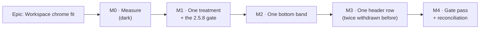

# Implementation Plan: Workspace chrome fit

- **Feature spec:** [`./feature-spec.md`](./feature-spec.md) — **not yet approved**
- **Status:** Draft — awaiting approval
- **Owner:** web

## Breakdown

### Epic

**Workspace chrome fit** — return the plan workspace's vertical budget to the diagram and settle
the command surface's geometry, by merging two chrome rows into one, two bottom bands into one, and
three control geometries into one. Roadmap theme: plan workspace usability, continuing
`docs/specs/workspace-chrome/` and closing the geometry half of `docs/TECH_DEBT.md` #185.

**Scope guard.** `apps/web` only. The CPM engine is not imported, no migration runs, no API contract
moves. If a task finds itself in `apps/api`, `packages/` or `toolbar-registry.ts`'s resolution rules,
it has left the epic and stops (ADR-0105's mid-flight rule).

**No `VITE_` flag** (ADR-0088 D1 — a `VITE_` constant is inlined at build time and has never been an
operator rollback). **The rollback is a commit boundary**, so the commits are structured for it: one
milestone, one revertible commit, whose message names what reverting restores. M3 in particular lands
as a single commit, because it is the one most likely to be reverted.

---

### Milestone M0 — Measure, and repair the instrument (**ships dark**)

**Outcome:** every load-bearing number this epic will spend is derived from a repaired probe against
a real Chromium and a real plan, and written down with its falsification conditions.
**Ships dark:** nothing user-facing changes. No product file is edited. The surfaces arrive in M1–M3.
**Journey:** none owed — a milestone that ships dark says so (ADR-0081 §1). The harness is a harness
and its docblock says where it bypasses the product (ADR-0081 §3).

**Why it is first, in one sentence:** six consecutive epics in this register had a width expectation
contradicted by their own measurement, and this one has already had **five** brief claims and one
harness contradicted before a line was written (feature-spec §0).

**Acceptance condition:** `docs/specs/workspace-chrome-fit/m0-measurement.md` exists, states its
falsification conditions **before** its numbers, and answers every question M1–M3 will ask. Any
number it fails to produce is a number no later milestone may cite.

**Gates:** `pnpm prepush`. No CI step (a measurement config is not a gate).

---

#### Feature: M0 — the repaired measurement

> **Description:** a `measure-workspace-fit` harness that answers the four questions the existing
> `m0-header-and-treatment` probe cannot, plus the baseline every later SC is measured against.
> **Complexity:** M
> **Dependencies:** none
> **Risks:** the harness measures the wrong element (it already did, twice) → every probe locates by
> a **stable hook or a role**, never by copy or by a DOM walk, and each reports a control value that
> proves it found something.
> **Testing requirements:** none — it is a harness, not a gate. It must **throw** rather than report
> `null` when it cannot find a band (the ADR-0091 M7 rule: a `.filter()` silently dropped a missing
> band for the whole of ADR-0090 M5).

##### Task M0-T1 — Repair the label-baseline probe and re-derive the count

- **Description:** the existing probe reads the **last** leaf `` with text inside each item
  (`m0-header-and-treatment.spec.ts:153-157`), and `ToolbarButton` renders `sr-only` spans for
  `disabledReason` and `srDescription` **after** the label (`ToolbarButton.tsx:134-144`). Pen-gated
  and described items therefore report a hidden span's top. The reported "10 distinct label tops" is
  not a baseline count.
- **Complexity:** S
- **Dependencies:** none
- **Risks:** the repaired count comes back as 3 rather than 10 and the complaint looks smaller than
  it is → report **per visual row** as well as globally, since the complaint is about one row, and
  photograph the deck at 1646 so the reader can see the thing the number describes.
- **Testing:** n/a (harness)
- **Development steps:**
  1. Select the visible label as the last leaf span **excluding** any with a `sr-only` class or a
     `getClientRects()` width ≤ 1 px; assert at least one item reports a label or throw.
  2. Group items into visual rows by their own `getBoundingClientRect().top`, and report distinct
     label tops **within each row** plus the caption's.
  3. Report the pen-gated/described item ids separately, so the contamination is visible in the
     output rather than only in this spec.
  4. Re-run at 1920 / 1646 / 1440 / 1280 and record why the count differs by width.

##### Task M0-T2 — The merged row's budget, from ink and in the worst pen state

- **Description:** the existing run reports `identityParts[*].w`, which for the breadcrumb block is a
  `flex-1` **track** (404 / 564 / 770 / 1044 px at the four widths) and not content. And it was taken
  in a single pen state — `ensurePen` is called at seeding but `recalculate` reloads and drops the
  pen, so the JSON shows `Available` / `No one is editing this plan.`, one of the **two redundant**
  states. The eight states the merge has to survive have never been measured.
- **Complexity:** M
- **Dependencies:** M0-T1 (shared probe helpers)
- **Risks:** the fixture's plan name is short and the answer is a false PROCEED — this exact failure
  reversed Landing C's verdict (`m0-landing-d1-measurement.md:46-57`) → keep the deliberately long
  name, and additionally report the measurement with the name replaced by a 5-character one so the
  **sensitivity** to that one term is on the page.
- **Testing:** n/a (harness)
- **Development steps:**
  1. Measure the **ink** of each merged-row constituent with `scrollWidth`/range measurement, not the
     track: brand, org switcher, account chip, breadcrumb (each crumb separately), status badge,
     Edit-plan pencil, `MODE` caption, each of the four mode controls, the pen cluster.
  2. Drive **all ten** `LockView` states and record the pen cluster's ink in each. Two peers are
     needed for `HELD_BY_OTHER`; `EXPIRED` and `lostControl` may be reached by manipulating the
     status the client holds — say in the docblock which states were reached by driving the product
     and which by a shortcut, and treat the shortcut ones as weaker evidence.
  3. Compute the merged-row budget at 1920 / 1646 / 1440 as
     `container − (constant blocks) − (worst-state pen)`, and report the slack.
  4. Price CQ-2's three options: dropping the `MODE` caption; `Early mode`/`Visual mode` →
     `Early`/`Visual`; removing the organisation switcher.
  5. State the verdict against the **≥ 120 px at 1440** bar, in the worst pen state.

##### Task M0-T3 — Deck height, `aboveCanvas`, and what the geometry actually costs

- **Description:** the existing inline probe derives the deck from
  `document.querySelector('[data-toolbar-item]')` — the **first** in the document, which is
  `mode-early` in the mode toolbar — so `deckHeightBefore: 36 → deckHeightAfter: 36` measured a row
  containing no stacked items. It cannot answer the height question, and it contradicts TECH_DEBT
  #185's finding that un-stacking is "the single biggest term in the height".
- **Complexity:** M
- **Dependencies:** none
- **Risks:** the probe and `vertical-stack` disagree about when the deck exists (TECH_DEBT #185
  records exactly that, and the disagreeing probe was deleted rather than committed) → locate by
  `[role="toolbar"][aria-label="Plan commands"]`, wait for it, and **throw** if it is absent.
- **Testing:** n/a (harness)
- **Development steps:**
  1. Establish the **baseline**: `aboveCanvas` from the canvas's own `getBoundingClientRect().top`
     (never by summing bands), deck height, chrome-band height, canvas height, and the two bottom
     bands, at four widths, on a populated plan, with the pen **held** and again **free**.
  2. Probe both geometries — stacked→inline and inline→stacked — by style override, and report deck
     height, wrap-line count and total item width for each. State in the docblock that a style
     override cannot answer where a split button's caret goes, so it prices the geometry and not the
     implementation.
  3. Run once with `hasTouch` + `pointer: coarse` (TECH_DEBT #133: no toolbar measurement in this
     repository was taken with a coarse pointer until ADR-0091, and the estate has drifted since).
  4. Recommend a direction for **CQ-1** with the numbers attached — the recommendation TECH_DEBT
     #185 asks for and says must not be taken unilaterally.

##### Task M0-T4 — The bottom bands and the dock's 0 px guarantee, by hook

- **Description:** the existing status-bar probe locates by the text `Data date` and a height
  heuristic (`m0-header-and-treatment.spec.ts:139-146`) — locating chrome by its copy, which
  `activity-bottom-panel.tsx:166-174` records as having bitten three times, in the same file.
- **Complexity:** S
- **Dependencies:** none
- **Risks:** the 1343 px it reported is close to `<main>`'s width rather than the full-bleed status
  slot's, so it is unclear what was measured → locate by `[data-activities-bar]` and
  `[data-chrome-slot="status"]` and report both boxes.
- **Testing:** n/a (harness)
- **Development steps:**
  1. Measure both bands by hook, collapsed and expanded, at four widths.
  2. Measure the **dock cost baseline**: canvas height with the dock empty, with a tool armed, with
     one activity selected, and with a plural selection whose subject has a long name.
  3. Enumerate the layouts where **no** activities handle row is mounted — narrow single-pane,
     narrow with the Notes dock, narrow with the Float-paths dock — and confirm by driving each that
     the plan's facts are today rendered by the shell status row. This is the fallback M2 depends on
     and it must be observed, not inferred.

##### Task M0-T5 — Write it up, falsification conditions first

- **Description:** `m0-measurement.md`, in this repository's established shape.
- **Complexity:** S
- **Dependencies:** M0-T1…T4
- **Risks:** a verdict produced from an `undefined` (`undefined >= 120` is `false`, which is the
  right answer from a missing number — ADR-0097 Landing C shipped exactly that) → the write-up
  **throws** on any absent input rather than reporting a verdict.
- **Development steps:**
  1. State the three falsification conditions (feature-spec §4) at the top, before any number.
  2. Record every figure with the command that produced it.
  3. Record which of this spec's own claims the run **contradicted** — there will be some, on this
     epic's record — and correct them in place.
  4. Put CQ-1 and (if it fires) CQ-2 to the product owner with the numbers.

---

### Milestone M1 — One control height, one label treatment, aligned captions

**Outcome:** every control on the plan's command surface has one height, one label geometry per row,
and each group caption's label sits on its row's baseline.
**Entry point:** the **command deck** itself — the toolbar labelled `Plan commands` above the
diagram. Nothing is added or removed; the same controls are pressed and they stop shimmering.
**Journey:** `apps/web/e2e-workspace-fit/command-surface.spec.ts` — opens a plan, folds and unfolds a
deck group (which also closes TECH_DEBT #182), and asserts SC-4 and SC-7 at four widths. **This is
the epic's first user-facing milestone, so the journey lands here and not at the end** (ADR-0081 §2).

**Acceptance condition:** SC-4 and SC-7 green at 1280 / 1440 / 1646 / 1920 in both plan views;
`aboveCanvas` and deck height **no worse than the M0 baseline** at 1646; no touch target smaller than
at `web-v0.103.0`; the existing ~35 toolbar/deck suites pass with no assertion weakened.

**Gates:** `pnpm prepush`; the new `e2e-workspace-fit` CI step; `token-architecture.test.ts`'s two
ratchets (`SCREEN_WEIGHT_CEILING = 165`, `ARBITRARY_SIZING_CEILING = 18` — both will be touched by a
geometry change and **neither may be raised**); `axe` in the journey.

---

#### Feature: One geometry, chosen once and named at every call site

> **Description:** `toolbarControlVariants` gains a compulsory geometry, and the deck's four
> `!important` overrides go with it.
> **Complexity:** L
> **Dependencies:** M0-T1, M0-T3, **CQ-1 answered**
> **Risks:** (a) the shared CVA reaches the **selection bar**, i.e. the dock's own contents, so this
> changes the height of strips M2 then merges into a band → SC-5 is re-measured after M1, not only
> after M2. (b) `min-h-9` is load-bearing for `pointer: coarse` and TECH_DEBT #127/#133 are open →
> nothing here reduces a target, and the journey sweeps coarse explicitly.
> **Testing requirements:** structural (V-1); the baseline gate in the journey; the existing suites
> as the before/after oracle — **a geometry refactor changes no assertion**, and any suite that has
> to be edited is a finding to write down, not a file to fix quietly (ADR-0078's rule).

##### Task M1-T1 — Add the geometry variant; every call site names it

- **Description:** `layout: 'inline' | 'stacked'` on `toolbarControlVariants`, defaulting to
  `'inline'` so all 8 call sites are byte-identical at the moment it lands.
- **Complexity:** S
- **Dependencies:** M0
- **Risks:** a default that silently applies to a future call site → the structural test requires an
  explicit `layout` at every call site, so the default protects this commit and not the next author.
- **Testing:** `toolbar-styles` unit; a structural test asserting no call site declares
  `flex-direction`, `height` or `gap` with `!important` (verified **red** against `Deck.tsx:383-391`
  first).
- **Development steps:**
  1. Add the variant; keep `min-h-9` and `pointer-coarse:px-3` in **both** geometries.
  2. Add the structural test, verified red.
  3. Correct the docblock's stale `ToolbarOverflow` reference while in the file
     (`toolbar-styles.ts:5`).

##### Task M1-T2 — Move the deck to the variant; one height per card

- **Description:** `Deck` asks for the chosen geometry instead of overriding it; every control in a
  card is one height, so `items-stretch` stops distributing labels differently between cards of
  different heights (feature-spec §0 F5).
- **Complexity:** M
- **Dependencies:** M1-T1
- **Risks:** the `search` render item is a 240 × 32 text field and cannot take a button geometry →
  it is the **declared exception**, named in the docblock, with its own alignment rule; the gate
  excludes it by id rather than by "anything that does not fit", so a second exception has to be
  added deliberately.
- **Testing:** `Deck.test.tsx`; the journey's SC-4.
- **Development steps:**
  1. Replace the four `!important` overrides with `layout=`.
  2. Normalise control heights within a card; state the exception for `search`.
  3. Re-run `measure-workspace-fit` and record the deck-height delta. **If it is worse at 1646, stop
     and reverse the direction** (feature-spec §4 falsification).

##### Task M1-T3 — Bring the render items onto the same geometry

- **Description:** `ToolbarPopover`, `ToolbarSplitButton` and the four bespoke items in
  `tsld-toolbar-items.tsx` (`:1222, :1381, :1577, :1807`) honour the surface's geometry. This is the
  half the brief calls "not the partial (Deck-only) fix".
- **Complexity:** L
- **Dependencies:** M1-T2
- **Risks:** a split button's caret has no obvious home in a stacked geometry — the M0 probe's
  docblock says in as many words that it cannot answer this → decide it here, with
  `TOOLBAR_CARET_TARGET`'s 24 px floor intact and the pair still **one** roving stop (asserted by
  `Toolbar.test.tsx` and `tsld-toolbar-authoring.test.tsx` today; both must still pass unedited).
- **Testing:** `ToolbarPopover.test.tsx`, `ToolbarSplitButton.test.tsx`, the four items' suites; the
  journey's SC-4/SC-7.
- **Development steps:**
  1. Thread the geometry through each; no call site keeps a layout `!important`.
  2. Re-assert the split button's single roving stop and the caret's 24 px floor.
  3. Confirm the `tone: 'info'` read-out at `max-w-[14rem]` (`:1577`) still truncates rather than
     growing the row.

##### Task M1-T4 — Align the group captions to the label baseline

- **Description:** a caption's visible label shares its row's label baseline. Measured today at 140
  and 202 against neighbours at 137/149 and 199/211.
- **Complexity:** S
- **Dependencies:** M1-T2
- **Risks:** the caption is a real control (a fold toggle) and TECH_DEBT #186 notes it stretches to
  the card height — 54 px at 1646 — so a vertical realignment could shrink its target below 24 px →
  SC-7 sweeps it like any other control, and it is named in the sweep's output so a regression is
  attributable.
- **Testing:** `Deck.test.tsx`; the journey's SC-4, asserted with the group folded **and** unfolded.
- **Development steps:**
  1. Align the caption's label rather than the caption's box.
  2. Keep the `border-r` separator and the chevron's fold semantics unchanged.

##### Task M1-T5 — The journey and the WCAG 2.5.8 sweep (closes TECH_DEBT #186)

- **Description:** `apps/web/e2e-workspace-fit/` + `playwright.workspace-fit.config.ts` +
  `test:e2e:workspace-fit` + a CI step. It is a **fit gate**, so it sweeps widths — which is why it
  cannot live in `e2e-workspace-chrome`, whose config is pinned at 1646.
- **Complexity:** M
- **Dependencies:** M1-T2…T4
- **Risks:** the traps TECH_DEBT #186 hands to whoever writes it, verbatim: (a) sweep the item's
  **focusable control**, not `[data-toolbar-item]` on a wrapper — that is how the split-button caret
  went unmeasured at 23 × 36; (b) assert **pointer reachability** with `elementFromPoint`, not
  overhang — a control shrunk to zero width has zero overhang and is still in the DOM. Both are
  written into the spec's docblock.
- **Testing:** this **is** the test. Every assertion is verified **red** first — against the
  pre-M1 tree for SC-4, and against a deliberately shrunken control for SC-7.
- **Development steps:**
  1. Config at 1280 / 1440 / 1646 / 1920, Chromium, serial, `PLAN_EDIT_LOCK_ENFORCED=true`, no
     `VITE_` pins (ADR-0088 D1 — the shipped surface is the default surface).
  2. SC-4: one label baseline per visual row, captions included, `.sr-only` excluded, **plus a pinned
     positive case** asserting at least one labelled item was found — or the gate passes by finding
     nothing (the ADR-0093/ADR-0108 lesson).
  3. SC-7: every `[data-toolbar-focusable]` clears 24 × 24 and is hit-testable, at every width, in
     both plan views, once with a coarse pointer.
  4. Fold a group, tab through, unfold — closing TECH_DEBT #182.
  5. `axe` scan with `.include()` located by **role and name**, never by a selector string — three
     suites in this repo shipped scans pointed at deleted rows (ADR-0099 M5).
  6. CI step after the prior suites tear down their servers; report path added to the artefact list.
  7. Run `scripts/e2e-local.sh web:workspace-fit` **before** pushing (CLAUDE.md §19.8).

---

### Milestone M2 — One bottom band

**Outcome:** the Activities handle row and the plan status bar are one row; the word "Activities"
appears once; the plan's facts survive a docked strip by collapsing rather than vanishing.
**Entry point:** the band at the foot of the diagram — the reader presses **Expand activities panel**
or the new facts disclosure, and reads the plan's facts in the row they already look at.
**Journey:** extends `e2e-workspace-fit/bottom-band.spec.ts` — arms a tool, selects an activity, and
asserts SC-5 and SC-8.

**Acceptance condition:** SC-5 (0 px, asserted as an equality), SC-8 (no fact lost in any view, any
width, expanded or collapsed), the shell's status row is zero-height on a wide plan layout, and
`activitiesWordOccurrences === 1`.

**Gates:** `pnpm prepush`; `e2e-workspace-fit`; `plan-status-bar.test.tsx` unchanged in its
assertions about `deriveScheduleState` (a pure function this epic must not touch); `axe`.

---

#### Feature: `PlanFacts`, one component with a registered host and a fallback

> **Description:** extract the five facts and the schedule-state region from `PlanStatusBar`; render
> them into the activities handle row where one is mounted, and into the shell's status row where
> none is.
> **Complexity:** L
> **Dependencies:** M0-T4, M1 (the dock's strips changed height in M1)
> **Risks:** **the host that does not exist.** Three live layouts mount no activities handle row —
> narrow single-pane, narrow with the Notes dock, narrow with the Float-paths dock
> (`plan-workspace-toolbar.tsx:1548-1586`). A literal merge deletes the plan's facts on all three:
> ADR-0081's defect, and TECH_DEBT #156's shape from four days ago. → the fallback is not optional
> and is asserted, not assumed.
> **Testing requirements:** a structural test that the facts have exactly one mounted host in every
> layout; unit tests for the collapse rule; the journey for the 0 px equality.

##### Task M2-T1 — Extract `PlanFacts` (no behaviour change)

- **Description:** `PlanStatusBar` becomes a thin host around `PlanFacts`. `deriveScheduleState`,
  `ScheduleState` and `scheduleStateAttr` are **untouched** — they are pure, separately tested, and
  were made so because a defect hid in them (`plan-status-bar.tsx:69-92`).
- **Complexity:** S
- **Dependencies:** M0
- **Risks:** a "tidy" that changes what `data-schedule-state` publishes → that attribute is a journey
  contract and its values are asserted unchanged.
- **Testing:** `plan-status-bar.test.tsx` passes **unedited**. If it does not, that is the finding.
- **Development steps:**
  1. Move the facts and the state region into `PlanFacts`; keep every comment verbatim — those
     comments record defects that shipped.
  2. Confirm the suite is green with no assertion touched.

##### Task M2-T2 — The host registry, reusing the dock's shape

- **Description:** `PlanFactsProvider` / `PlanFactsOutlet`, modelled on `CanvasDockProvider` /
  `CanvasDockOutlet` — including the "no outlet, render in place" fallback and the node-identity
  clearing rule ADR-0092 records learning the hard way (a bare `null` empties on half the
  transitions; an `isConnected` guard inverts that, because React runs a ref cleanup **before**
  detaching).
- **Complexity:** M
- **Dependencies:** M2-T1
- **Risks:** two outlets in one row competing for width → the dock outlet keeps `flex-1 min-w-0`; the
  facts are `shrink-0` until the container query fires, then one control.
- **Testing:** unit — four cases mirroring `canvas-dock.test.tsx`, including the two wrong rules
  written and rejected there; structural — exactly one mounted host per layout, **with a pinned
  positive case** so "all classified" cannot be satisfied by "found nothing" (ADR-0108's own gate
  caught itself that way on its first run).
- **Development steps:**
  1. Provider at the workspace, outlets in `ActivityPanelCollapsedBar` and `ActivityBottomPanel`'s
     header, fallback in the shell's `status` slot.
  2. Structural test over the layout branches, verified red by removing one outlet.

##### Task M2-T3 — The collapse rule

- **Description:** below a container-query threshold the facts collapse into **one labelled
  disclosure**; `Recalculate` never collapses.
- **Complexity:** M
- **Dependencies:** M2-T2
- **Risks:** a `ResizeObserver` here re-imports the "a row measures its own leftover width" defect
  class this repository has recorded five times → **container query only**, and a structural test
  asserting no `ResizeObserver` in this subtree.
- **Testing:** unit for the disclosure's name/focus; the journey for the collapse under a wide
  docked strip; `axe`.
- **Development steps:**
  1. `@container` on the facts block (the ADR-0061 `FieldGrid` idiom).
  2. Collapsed presentation: one focusable, named control showing the most urgent fact, opening the
     rest. **Never an absence.**
  3. Exempt the schedule-state region; state the ADR-0082 reason in the docblock.

##### Task M2-T4 — Merge the rows and remove the duplicate word

- **Description:** the collapsed bar and the panel header carry the facts; the shell's status row goes
  zero-height on wide plan layouts; the literal `Activities` renders once.
- **Complexity:** M
- **Dependencies:** M2-T3
- **Risks:** the dock journey locates the rail by the word "Activities" and matched the status bar's
  fact instead — "the third time it has bitten" (`activity-bottom-panel.tsx:166-174`) → every new and
  touched locator uses `[data-activities-bar]` or a role+name. A lint-style structural check that no
  suite in `e2e-workspace-fit` locates chrome by that word.
- **Testing:** the journey's SC-5 and SC-8; the "once" assertion; re-run `measure-workspace-fit` for
  the band delta.
- **Development steps:**
  1. Compose the merged row; keep `min-h-9` so a taller strip grows the row rather than being clipped.
  2. Re-measure the dock cost. **If SC-5 cannot be held at 0 px, withdraw M2** rather than accept "a
     few px" — the guarantee is the reason ADR-0092's dock exists.
  3. Re-run **every** journey that touches the workspace foot, not only the one CI names. ADR-0109's
     retrospective records three journeys broken across one epic, each found by CI because the sweep
     was not run locally.

---

### Milestone M3 — One header row

**Outcome:** the plan's identity, the mode cluster and the pen action sit on the application header
row; the workspace spends one row of chrome above the deck instead of two.
**Entry point:** the merged header row itself — the reader sees the plan name, `Early | Visual`,
`Diagram | Gantt` and the pen action on the same line as the brand and the account chip.
**Journey:** extends `e2e-workspace-fit/header.spec.ts` — SC-2, SC-3 and the give-way order, at
1440 / 1646 / 1920, in both plan views.

**Read before starting, in full:** `docs/specs/design-system-rewrite/m0-landing-d1-measurement.md`.
**This merge has been withdrawn twice** (ADR-0092 M5 on arithmetic; ADR-0097 D1 after it **shipped**
and `e2e-gantt` failed twice on the view switch being reachable only through an overflow menu). The
approving estimate that time said 795 px of identity content against +250 px of slack; the measured
content was **1172 px**.

**Acceptance condition:** SC-1, SC-2, SC-3, SC-6 green. `aboveCanvas` falls by ≥ 40 px at every swept
width, measured before and after on the same machine and fixture — **a merge is not a saving; only
removing a row is** (ADR-0092 M4, quoted by the milestone that then repeated its mistake).

**Withdrawal is a legitimate outcome.** If M0-T2 or the fit sweep says 1440 does not clear with
≥ 120 px of slack in the worst pen state, M3 **withdraws** and the epic ships M1 + M2. Putting a mode
behind a disclosure to make the row fit is the one thing that is not available.

**Gates:** `pnpm prepush`; `e2e-workspace-fit`; `e2e-gantt` and `e2e-toolbar` re-run locally (both
broke on the last attempt); `axe`; the two `token-architecture` ratchets.

---

#### Feature: The merged row, and the pen's state-conditional visibility

> **Description:** one chrome row with a declared give-way order, and a pen indicator that deletes
> its redundancy in the two states where it is redundant and in no others.
> **Complexity:** XL
> **Dependencies:** M0-T2, M1 (the mode cluster's geometry is a term in the budget), CQ-2 if it fires
> **Risks:** the two recorded failure modes, plus one this spec found. (a) A shrink-factor arrangement
> that fits by hiding a mode — the twice-shipped defect. (b) An arrangement that overlaps: at 1280 on
> the last attempt, `Stop editing` spanned 1218→1328 in a 1248 px header and covered the account chip.
> (c) **Deleting the pen's chip and sentence deletes the `role="status"` region's announcement** —
> they are inside it (`CompactPenStatus.tsx:54-79`), and in 8 of the 10 `LockView` shapes they are the
> only thing naming who holds the lock, three of those with an **empty** `actions` array.
> **Testing requirements:** the fit sweep; a unit test **total** over `resolveLockView`'s ten shapes;
> a before/after comparison of the live region's text content against `web-v0.103.0`.

##### Task M3-T1 — The pen indicator: `sr-only` where redundant, visible and capped elsewhere

- **Description:** ships **before** the merge, on its own, so its behaviour is provable against
  today's layout and the merge does not have to carry two changes at once.
- **Complexity:** M
- **Dependencies:** M0-T2
- **Risks:** an invented sentence that is false in the common case — ADR-0060's record warns about
  exactly this, and TECH_DEBT #115 closed a live instance of it → **no new copy**. `lockCopy` is
  reused verbatim; only visibility changes.
- **Testing:** unit, total over the ten shapes, asserting (i) the region's `textContent` is unchanged
  and (ii) at least one **visible** element renders. Verified red by deleting the nodes outright.
- **Development steps:**
  1. Derive visibility from the `LockView` shape via an exhaustive mapping (V-2 — a new state is a
     compile error, not a blank slot).
  2. `sr-only` for `FREE`+`canAcquire` and plain `HELD_BY_ME`; visible, capped, truncating with a
     `title` for the other eight; the badge always visible when `actions.length === 0`.
  3. Record the measured saving in the two redundant states, and the measured **cost** in the worst.

##### Task M3-T2 — The merged row

- **Description:** `HeaderContents` becomes the merged row and takes an `identitySlot` again; the
  identity/mode row is removed; its contents portal into the slot so the shell stays plan-unaware
  (ADR-0029).
- **Complexity:** L
- **Dependencies:** M3-T1, M1
- **Risks:** two `banner` landmarks; a second `<h1>`; a focus-restore `querySelector` scoped to the
  workspace root that silently finds nothing because the portal moved the node — this file has
  shipped that twice (`plan-workspace-toolbar.tsx:1320-1327`) → one `banner`, the `sr-only <h1>`
  stays inside `<main>`, and no new DOM-querying focus restore.
- **Testing:** `app-header.test.tsx`, `chrome-band.test.tsx`, `plan-workspace-toolbar.test.tsx`; the
  fit sweep; landmark assertions.
- **Development steps:**
  1. Explicit track list with exactly **one** `minmax(0,1fr)`; everything else `shrink-0`.
  2. Give-way order asserted at 1440 by the journey: the plan name truncates, the modes do not move.
  3. Re-measure `aboveCanvas` before and after **on the same fixture**, and publish both.
  4. Run `e2e-gantt`, `e2e-toolbar`, `e2e-workspace-chrome`, `e2e-programme`, `e2e-multi-select` and
     `e2e-authoring-flow` locally. The last attempt's regressions surfaced in `e2e-gantt` and three
     suites that click a project link from inside an open plan.

##### Task M3-T3 — Retire what the merge leaves behind

- **Description:** `ToolbarBandProvider`/`useToolbarBandWidth` publish to **nobody** — `Toolbar` no
  longer reads the band width — while two files still mount the provider and one carries an 8-line
  comment explaining why it is load-bearing.
- **Complexity:** S
- **Dependencies:** M3-T2
- **Risks:** deleting a mechanism someone intends to use → check for a consumer, find none, delete,
  and say so in the commit. **Default: delete.** A mechanism kept "in case" is how the flag estate
  reached 58 (ADR-0088).
- **Testing:** typecheck; the suites that mount either file.

---

### Milestone M4 — Gate pass and reconciliation

**Outcome:** five specialist reviews over the combined diff, every blocking finding folded with a
regression test **verified red first**, the non-blocking ones filed rather than rushed; the ADR filed;
the documentation this epic invalidated corrected.
**Ships dark:** no new capability — it is the review of what M1–M3 shipped.
**Journey:** none new; the M1–M3 journeys run in full, plus the whole `apps/web` e2e sweep.

**Why it is a milestone and not a checklist:** this register records a gate pass finding defects that
had passed a human read in **seven consecutive epics**, and the largest recent one was a milestone's
headline capability having no entry point at all.

**Acceptance condition:** all five reviews returned; every blocking finding folded with a test
verified red; `docs/TECH_DEBT.md` updated; ADR filed and `docs/adr/README.md` updated in the **same**
commit (ADR-0078 S1 found seven ADRs missing from that index).

##### Task M4-T1 — Specialist reviews

- **Description:** `ux-reviewer`, `accessibility-reviewer`, `component-reviewer`,
  `performance-reviewer`, `security-reviewer` over the combined M1–M3 diff.
  `database-architect` is **not** engaged: there is no schema change to design, not a small one.
- **Complexity:** M
- **Testing:** each blocking finding gets a regression test verified red against the pre-fix code.

##### Task M4-T2 — Re-derive the epic's own numbers from the shipped code

- **Description:** re-run `measure-workspace-fit` against the final tree and compare to M0. Every
  headline figure is re-derived rather than carried.
- **Complexity:** S
- **Risks:** a sweep measures the tree it runs against, and ADR-0099 records a sweep left running
  across a milestone boundary producing a page of findings that were all one half-applied edit → run
  on a clean tree, and say so.

##### Task M4-T3 — Correct the documentation this epic invalidated

- **Description:** the stale prose found while verifying (feature-spec §3), each in a file this epic
  edits.
- **Complexity:** S
- **Development steps:**
  1. `app-header.tsx:83` ("below `lg` only") and `:99-107` (two citations into a `Toolbar.tsx` that
     no longer has those lines or that function).
  2. `chrome-band.tsx:76-80` — describing the merge that shipped and was withdrawn, in the file the
     third attempt edits.
  3. `toolbar-styles.ts:5`, `toolbar-registry.ts:548,561`, `toolbar-band.tsx:12` — citations to
     `ToolbarOverflow`, `computeLadder` and `toolbar-ladder.ts`, all deleted by ADR-0109.
  4. `docs/TECH_DEBT.md`: close **#186**; update **#185** with M0-T3's answer and whether the cause
     is now established; close **#182** if M1-T5's fold step lands; note **#31**'s status.
  5. `docs/DESIGN_SYSTEM.md` (geometry variant; caption-baseline rule), `docs/UX_STANDARDS.md`
     (give-way order in a fixed-height chrome row), `CLAUDE.md` §16 (ADR entry).

##### Task M4-T4 — ADR, changeset, release impact

- **Description:** file the ADR (next free number at filing; record a collision rather than routing
  around it — ADR-0071). Add a changeset: **`@repo/web` minor** (pre-1.0, user-visible change).
- **Complexity:** S
- **Development steps:**
  1. ADR with problem, options, choice, trade-offs, consequences — **including the withdrawn
     options and the numbers that withdrew them**, which is the part of this register that has
     repeatedly proved worth more than the decisions.
  2. `docs/adr/README.md` in the same commit.
  3. Changeset; confirm no API/schema/engine impact.

---

## Sequencing & slices

| Slice  | Ships                                | Releasable alone?                       | Reverting it restores                |
| ------ | ------------------------------------ | --------------------------------------- | ------------------------------------ |
| **M0** | nothing user-facing                  | yes (docs only)                         | n/a                                  |
| **M1** | one label treatment + the 2.5.8 gate | **yes**                                 | the alternating baselines            |
| **M2** | one bottom band                      | **yes**                                 | the two bands and the duplicate word |
| **M3** | one header row                       | **yes**, and most likely to be reverted | the two chrome rows                  |
| **M4** | review, docs, ADR                    | yes                                     | n/a                                  |

`main` is releasable after every slice. M1 and M2 are independent of M3's verdict, which is the
point of the ordering: **if M3 withdraws for a third time, the epic still delivers two of the three
complaints.**

**No feature flag** (ADR-0088 D1). One milestone, one commit; M3 in particular is a single commit
whose message names what reverting it restores.

## Definition of Done (per task)

Each task's PR satisfies the Feature Completion Criteria in [`docs/PROCESS.md`](../../PROCESS.md).
Two clauses matter more than usual here:

- **The pre-push gate was run, not written.** `pnpm prepush` (one command — it derives ten checks;
  running the parts by hand is how one gets missed), **plus `scripts/e2e-local.sh web:workspace-fit`**
  for any task touching the new suite, **plus the workspace journeys named in M2-T4/M3-T2**. No
  `apps/api` change, so `scripts/e2e-local.sh api` is not owed.
- **A decision-bearing claim names its evidence** (ADR-0076). Every number in a commit message,
  docblock or ADR here names the command that produced it. This spec already had five inherited
  claims fail that test.

## Risks & assumptions (rollup)

| Risk / assumption                                                                       | Likelihood                                              | Impact                                                                 | Mitigation                                                                                                                                               |
| --------------------------------------------------------------------------------------- | ------------------------------------------------------- | ---------------------------------------------------------------------- | -------------------------------------------------------------------------------------------------------------------------------------------------------- |
| The merged row does not fit at 1440 in the worst pen state                              | **med**                                                 | high                                                                   | M0-T2 measures it before M3 starts; a written falsification condition; withdrawal is a legitimate outcome and M1+M2 still ship.                          |
| A mode ends up unreachable at some width                                                | low                                                     | **critical** — this is the exact defect that withdrew the last attempt | SC-3 swept at four widths in both views; the modes are `shrink-0` and outside the give-way path; `e2e-gantt` re-run locally.                             |
| Deleting the pen chip/sentence removes the live-region announcement or strands a Viewer | **high if done naively**                                | high                                                                   | D2: `sr-only`, never deleted; visibility total over the ten `LockView` shapes; SC-6 verified red.                                                        |
| Merging the bottom band deletes the plan's facts on three narrow layouts                | **high if done literally**                              | high                                                                   | The registered-host + fallback design; a structural test with a pinned positive case; M0-T4 observes all three layouts first.                            |
| The dock's 0 px guarantee breaks once the band's middle is occupied                     | med                                                     | high                                                                   | SC-5 as an equality, re-measured after M1 **and** M2; withdrawal if it cannot be held.                                                                   |
| The geometry change makes the deck **taller**                                           | med                                                     | **high — it inverts the epic**                                         | M0-T3 prices both directions before M1-T2 commits; falsification condition on deck height at 1646.                                                       |
| A touch target shrinks (TECH_DEBT #127/#133 are open)                                   | med                                                     | high                                                                   | `min-h-9` preserved in both geometries; SC-7 swept once with a coarse pointer — the first such sweep here since ADR-0091.                                |
| A journey breaks in a suite CI names last                                               | **high** — three did in ADR-0109                        | med                                                                    | Run the full `apps/web` e2e sweep at M2-T4 and M3-T2, not only the suite CI names.                                                                       |
| A harness measures the wrong element                                                    | **high — it already has, twice, in this epic's own M0** | high                                                                   | Locate by hook or role; report a control value; **throw** rather than report `null`; verify each new assertion red.                                      |
| A ratchet is raised to make a change fit                                                | med                                                     | med                                                                    | `SCREEN_WEIGHT_CEILING = 165` and `ARBITRARY_SIZING_CEILING = 18` are held. A ratchet raised whenever something new arrives is a counter, not a ratchet. |
| The M0 harness's own numbers are re-cited without re-derivation                         | med                                                     | med                                                                    | No milestone may cite a number M0 did not re-derive; M4-T2 re-derives against the shipped code.                                                          |
| The epic drifts into the registry or the API                                            | low                                                     | med                                                                    | Scope guard at the top; ADR-0105's mid-flight rule — crossing a trigger stops the work.                                                                  |
