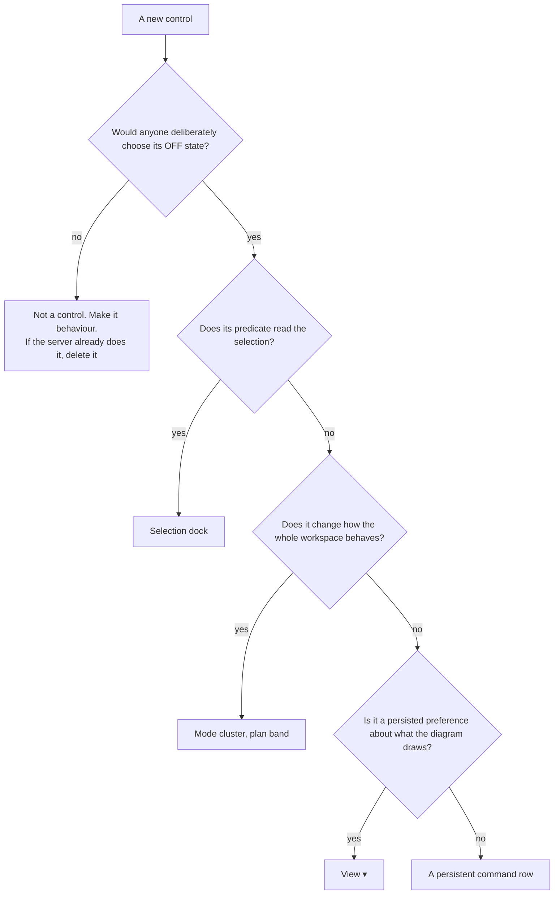
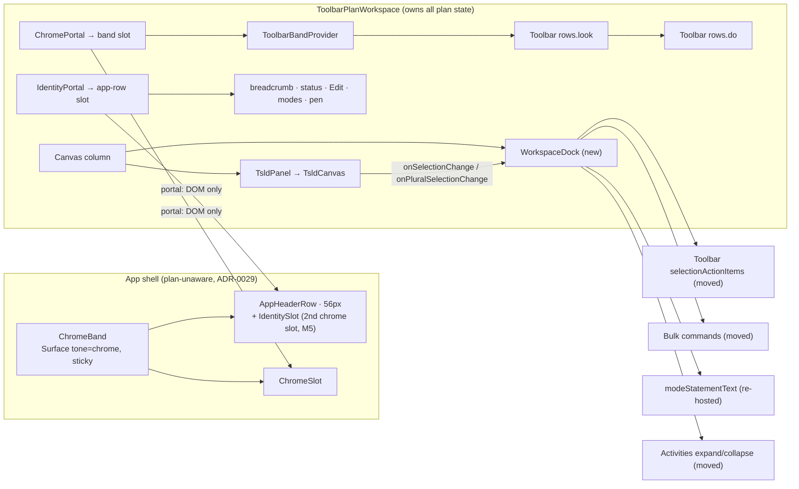
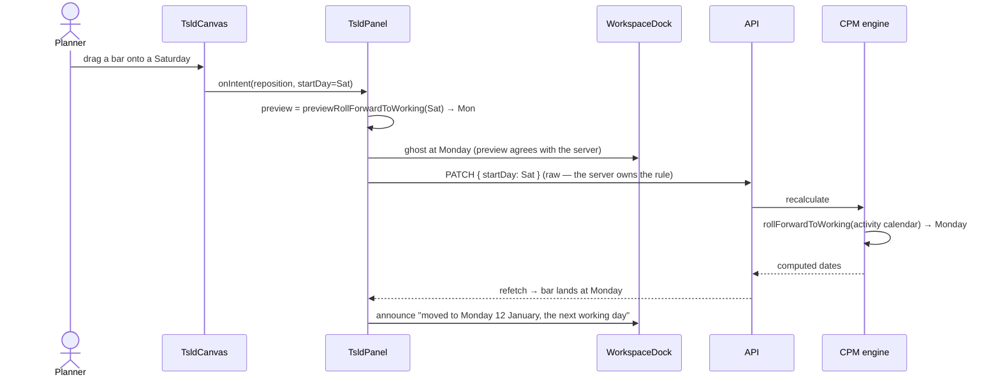
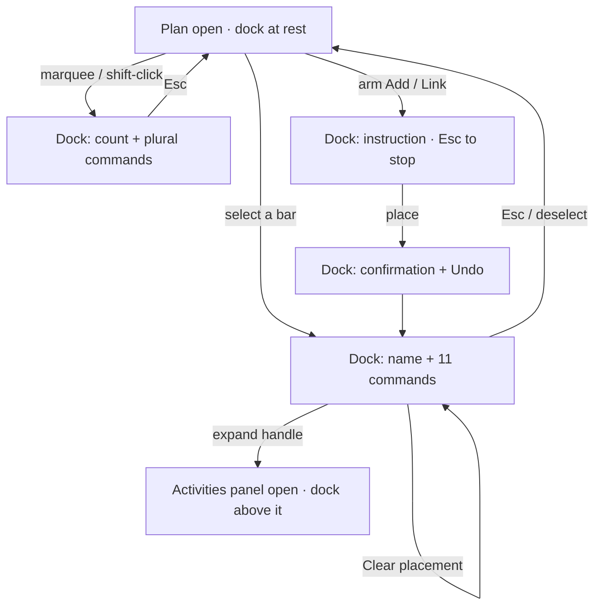

# Feature Spec: The plan workspace's chrome — bands, docks, and what a command is

- **Status:** Draft — **awaiting approval**
- **Author(s):** feature-analyst
- **Date:** 2026-08-13
- **Tracking issue / epic:** _(to be raised)_
- **Roadmap link:** UI/UX quality — the plan workspace
- **Related ADR(s):** amends **ADR-0064** (§4.3), **ADR-0090**/**ADR-0091** (the command surface),
  **ADR-0031** (registry), **ADR-0033** (Visual placement), **ADR-0063** (`sceneTopOffset`);
  builds on ADR-0029/0055 (shell + surface scopes), ADR-0082 (shade vs omit), ADR-0088 (flags).
  **A new ADR is required** — outline in §4.10.

---

## 0. How to read this document

Every decision-bearing claim below names **what was run or read** to establish it (CLAUDE.md §19.10,
ADR-0076). Where a number could not be established in this session it is written as
**`[TO MEASURE]`** with the harness and task that will take it — never as an estimate dressed as a
fact. That distinction is load-bearing here: ADR-0090 and ADR-0091 both shipped wrong because
figures were reasoned rather than measured, and ADR-0091's own entry records the product owner
calling the result "awful" at a width nobody had ever measured.

**Two claims in the brief that started this work were wrong, and both are corrected in place**
(§1.2 F-6, §1.3). The brief is not evidence — including the corrected brief, whose replacement
finding was re-verified here against `apps/api` before being carried.

**No measurement could be taken during this session**: the environment has no shell, so
`pnpm --filter @repo/web measure:toolbar` could not be run. Everything below is established by
**reading code and existing measurement records**, and every width claim is either quoted from a
dated measurement document with its source named, or marked `[TO MEASURE]`. M0 exists for exactly
this reason and it is the first milestone.

**Revision 2 (2026-08-13) — the three critical questions are answered** (§1.9). Q1 and Q2 were
accepted as defaulted. **Q3 was not**: the product owner has made the identity-line merge a **hard
requirement** of the epic rather than a measurement-gated option, with the risk put to them in
writing and reaffirmed.

**Revision 3 (2026-08-13) — M0 is measured**
([`./m0-band-measurement.md`](./m0-band-measurement.md)), and it changes M5's shape. Both
instrument repairs landed; 1646 is now permanent in `vertical-stack.spec.ts`. The headline: **the
merge is 554 px over, and the only single item large enough to pay for it is the 637 px
organisation nav.** So the nav collapse is a **prerequisite** of the hard requirement, not a
fallback — and it is a decision about every screen in the application. §4.11 is rewritten from a
ranked ladder into that finding. Two of its figures are **estimates decomposed from measured
composites and are labelled as such** (M0-T4 takes them properly); three are direct measurements.
The 849 px identity figure this document previously carried from ADR-0091 M0 is **stale and
superseded by 1151 px**.

---

## 1. Business understanding

### 1.1 Problem

The plan workspace — the surface this product exists to be — spends a large and growing share of a
planner's screen on chrome, and its one contextual command surface **covers the diagram it acts
on**. The product owner's words:

> "the 4 bar approach and a floating bar is a lot of dead space that a proper UI/UX review could
> solve"

Underneath the layout complaint sit three structural problems that two previous epics (ADR-0090,
ADR-0091) did not reach, because both were scoped to **width** and this one is about **what belongs
where**:

1. **There is no rule for where a control lives.** ADR-0090 moved `legend` into `View ▾`; ADR-0091
   moved zoom presets into `View ▾` and `shortcuts` into the account menu; ADR-0090 M2 moved the
   finish read-out off the toolbar and ADR-0091 M7 moved it back. Each move was individually
   argued and none of them was derived from a stated rule, so the same misplacement keeps
   recurring. `clear-visual-placement` is the current instance: a command that is enabled only when
   an activity is selected, sitting on a row that is always present, therefore shaded most of the
   time.
2. **There is no rule for what may sit on the scene.** ADR-0064 ruled that the mode-statement band
   goes in chrome above the scene "never over it", and gave the reason — a fourth overlay
   eventually lands on the bar you meant to click. That reason was never generalised, so the
   floating selection bar (ADR-0031) still covers the lane above the selection, and its own
   docblock records the cost as accepted debt (`TECH_DEBT` #31).
3. **A control can exist for months delivering nothing.** `Snap to grid` is a toolbar toggle whose
   entire remaining effect is to round a hand-placed bar to the **earlier** working day where the
   server would round it **later** — because the CPM engine already snaps unconditionally,
   server-side, and always has (§1.3). No gate could see this, because every test of the control
   asserts the client mechanism and none asserts the persisted outcome.

**Why now.** The product owner uses the product on a Surface Pro at **1646 CSS px** (2880 × 1920 at
175 %), reviews every release (CLAUDE.md §17 — the Watchtower profile is enabled), and has now
reported the same surface three times. ADR-0091's entry records the most useful finding of that
epic: _nobody had ever measured the screen it is judged on_. This epic starts there.

### 1.2 Findings, each verified against the code

Every finding the brief supplied was re-established by reading. Two did not survive.

**F-1 — `clear-visual-placement` is selection-scoped, and always visible.** _Verified:_
`tsld-toolbar-items.tsx:2336` (`isVisible: () => SCHEDULING_MODES_ENABLED`), `:2339-2343`
(`isEnabled` requires `schedulingMode === 'VISUAL' && canEditSchedule && !lateOverlayActive &&
selectedActivity != null`), `:2348-2357` (the four-rung reason ladder). `SCHEDULING_MODES_ENABLED`
is `flagDefaultOn(VITE_SCHEDULING_MODES) && CANVAS_AUTHORING_ENABLED` (`config/env.ts:185-186`),
both default-on, so the item is on the row in every shipped build. It is `tier: 3`
(`:1727-1735`), i.e. last admitted to the row.

**F-2 — a selection-scoped command on a persistent row is shaded whenever nothing is selected**,
which is most of the time. That is not a defect in this item; it is the absence of a home for its
kind. The same is true of `snap-to-grid`'s Visual-mode gate (`:2311-2321`).

**F-3 — the floating selection bar covers the diagram, by design, and this is recorded debt.**
_Verified:_ `selection-actions.tsx:697-708` renders `position: fixed`; `:642-693` an rAF loop reads
the canvas's per-frame anchor and places the bar **44 px above the selected bar**
(`BAR_OFFSET = 44`, `:596`), flipping below only when the viewport top would clip it (`:668-670`).
Its own docblock, `:620-623`: _"floating just above the selection overlays the region directly
above it — on a dense diagram that can cover the activity in the lane above for as long as the
selection is active. Accepted for now … (TECH_DEBT #31; a future lane-aware / side placement is the
fast-follow)."_ It carries **11 commands** (`selection-actions.tsx:366, 378, 399, 413, 428, 454,
469, 493, 510, 547, 567`).

**F-4 — the plural selection bar is already docked in chrome, and the singular one is not.**
_Verified:_ `TsldPanel.tsx:2453-2460` renders `BulkSelectionBar` _"beside the mode band in the SAME
reserved chrome, never floating over the scene"_. So the workspace already has both answers to the
same question and ships the worse one for the commoner case. This is the strongest single argument
for D-C, and it was not in the brief.

**F-5 — the mode-statement band costs a row of canvas only while a tool is armed.** _Verified:_
`CanvasModeBand.tsx:87` returns `null` for no statement, and its docblock (`:78-79`) says why:
_"an always-present band costs canvas height in the state the canvas is in most of the time"_. So
the product owner's complaint is precisely scoped: the cost lands **during** placement, which is
exactly when the canvas matters most.

**F-6 — `Snap to grid`: the brief's finding was wrong, and the true one is worse.** Covered in
full in §1.3.

**F-7 — the canvas sits in a rounded box inside a padded pane.** _Verified:_ `TsldPanel.tsx:2570`
wraps the canvas in `border-border relative min-h-[240px] flex-1 overflow-hidden rounded-lg
border`; `plan-workspace-toolbar.tsx:985` wraps _that_ in `relative flex min-h-0 flex-1 flex-col
gap-2 px-4 pt-2 pb-2`. The measured cost is **16 px of vertical padding + a 1 px border**
(`m4-vertical-stack.md` §2, rows "workspace padding" and "the pane's border") and 32 px
horizontally.

**F-8 — `legend` and `resource-view` are not registry items at all.** _Verified:_ they are
`LensToggle` rows inside the `View ▾` popover (`tsld-toolbar-items.tsx:221-230` and `:249-260`),
in the `panels` and `insight` groups. D-B therefore means **creating two registry items and
removing two popover rows**, not moving an item. It also retires the workaround `TECH_DEBT` #125
installed: `resource-view` carries a standing note _"Opens the resource panel and moves focus to
it"_ (`:229`) because inside a popover that focus move ejects the reader — and #125's own text says
_"from a Row-1 button [it] was unremarkable"_.

**F-9 — the vertical stack had never been measured at 1646. It has now.** _Was:_
`vertical-stack.spec.ts:26-29` swept `1920×1080` and `1440×960` only — the width this epic is judged
at was absent, and so was its height (1920 / 1.75 = **1097 px**), which is what actually determines
how much canvas the bands cost. **Now:** 1646 is permanent in that sweep, and the measurement is
[`m0-band-measurement.md`](./m0-band-measurement.md) §2 — **249 px above the canvas, 558 px of
canvas, so chrome is 31 % of the plan's vertical space** before the armed-tool banner and the
activities handle. Bands: app header **56**, command band **135** (identity 45 + Row 1 45 + Row 2
44). Every figure in §4.3 now comes from there.

**F-10 — the app-header-room instrument could not answer the question `TECH_DEBT` #129 asks of it.
Confirmed and repaired.** _Was:_ `vertical-stack.spec.ts:191-208` computed `used` and `widestGap`
from `appHeaderRow.children`; `app-header.tsx:150-156` shows `AppHeaderRow` is
`<header class="h-14 px-4">` containing **exactly one child**, the grid in `HeaderContents` (`:52`),
so the adjacent-pair loop never executed and `widestGap` was **0** at every viewport, by
construction. #129 quotes that zero — _"one child using 1888 of 1920 px — there is no gap to slot
into today"_ — as evidence that the merge is not feasible. **It is an artefact, not a measurement**,
and M0 confirmed the diagnosis by repairing it: the probe now descends through single-child wrappers
to the real grid line and reports the organisation nav separately. The repaired reading at 1646 is
**content 1049 px, free 597 px, widest contiguous gap 337 px** — so there was room, and #129's
conclusion was drawn from a number that could never have been anything else.

**F-11 — `m7-ladder-measurement.md` §5 contains a claim that contradicts the code.** It says
_"`clear-visual-placement` … is `isVisible`-false on this plan, which is why Row 2 shows no `⋯`"_.
Against F-1 that cannot be true, and the instrument cannot see what it is being cited for:
`item-widths.spec.ts:53-55` iterates `[data-toolbar-item]` inside the row container and `continue`s
on `__overflow__`, so it reports **inline items only** and can neither list an overflowed item nor
report whether the `⋯` rendered. The product owner's report — that they _see_ `Clear visual
placement` in the `⋯` — is consistent with the code and not with the document. Consequence:
**Row 2's entire measured baseline at 1646 may have been taken on a row that was one item and one
`⋯` different from the one a planner has.** Settled by M0-T3, not assumed here.

**F-12 — the identity line is 1151 px, not 849, and the ~165 px redundancy figure is an estimate.**
_Superseded:_ this document previously carried **849 px** from ADR-0091 M0, taken at 1920. The
current measured value at **1646 with the pen held** is **1151 px**
([`m0-band-measurement.md`](./m0-band-measurement.md) §3), split as breadcrumb + `Draft` badge
**361 px** and modes + view switch + pen cluster **790 px**. Both of those are direct measurements.

**The ~165 px of pen redundancy is not.** It is decomposed by eye from the measured 790 px
composite — the probe does not yet break the pen cluster out — as is the ~220 px a name-only
breadcrumb would save from the 361 px composite. **Both are labelled estimates throughout this
document and M0-T4 takes them properly before anything is built on them**, because a
decomposed-by-eye figure is exactly where this epic's predecessors got their wrong numbers
(`m7-ladder-measurement.md` §3 records a table of plausible-looking residuals that measured nothing
they were labelled with).

**F-13 — a canvas height change preserves the viewport.** _Verified:_ `TsldCanvas.tsx:1215-1260`
— `measure()` writes `sizeRef` and the canvases' backing stores and **never touches `viewRef`**, so
a band appearing or disappearing below the scene changes how many lanes are visible and moves
nothing. This is what makes an appear-on-selection dock safe.

**F-14 — Row 1's measured slack at 1646 is 277 px.** _Established by_
`m7-ladder-measurement.md` §3, which reports every gap on both rows at 1646: Row 1's `ml-auto` gap
before `summary` is **277 px** and its trailing `⋯` wrapper is 41 px; Row 2's trailing slack is
682 px. **This is the budget D-B has to fit into**, and it is a `web-v0.86.1` baseline taken
_before_ the M7 ladder landed — so it must be re-taken (M0-T2) before anything is sized against it.

### 1.3 The `Snap to grid` correction — established here, from the engine

The brief said the control was real but nearly unobservable, and asked for it to become automatic
with a modifier to bypass. **That is wrong, and building it would have made the product worse.**

_Verified by reading:_

- `apps/api/src/modules/schedule/engine/compute.ts:335-338` — inside the ADR-0033 effective-Visual
  pass, `const placed = activity.visualStart != null ? rollForwardToWorking(cal,
instantToAbsMinutes(activity.visualStart)) : null`.
- `apps/api/src/modules/schedule/engine/instants.ts:18-22` — `rollForwardToWorking` returns the
  _first working-minute start at or after_ the instant, and is the identity when it already is one.
- `cal` is `calendarOf(activity)` (`compute.ts:307`), i.e. the **activity's own** calendar
  (ADR-0037), at **minute** granularity (ADR-0036).

So **the server always snaps a hand-placed bar forward to a working instant, whatever the client
sent.** The same is true for a dropped SNET pin: `compute.ts:318-334` wraps `clampForwardStart`
in the same `rollForwardToWorking`.

And on the client, `snapToWorkingDay` (`apps/web/src/features/tsld/render/snap.ts:21-33`) returns
the input when it is already a working day, and otherwise scans outward testing
`dayOffset - delta` **before** `dayOffset + delta` — so it picks the **nearest** working day with
ties, and the equidistant case, going **earlier**.

The toggle's entire effect, therefore, is a **direction**, on a five-day week:

| drop lands on | toggle **on** (client picks nearest) | toggle **off** (server rolls forward) |
| ------------- | ------------------------------------ | ------------------------------------- |
| a working day | unchanged                            | unchanged                             |
| Saturday      | **Friday** (`-1` tested first)       | **Monday**                            |
| Sunday        | Monday (`-1` is Saturday, `+1` hits) | Monday                                |

_(Derived by reading both functions, not by running them; the arithmetic is one loop.)_ The
divergence widens with the length of the non-working run: with a Friday holiday, a Saturday drop
goes to **Thursday** with the toggle on and **Monday** with it off.

**Consequences that change the design:**

1. A control labelled _Snap to grid_ does not control whether snapping happens. Its label describes
   a capability the product delivers unconditionally.
2. Making the client rule automatic — the brief's proposal — would not add snapping. It would make
   every non-working drop land **earlier** than the planner released it, silently, which is
   contrary to what dropping a bar means and worse than today's default (the toggle ships **off**:
   `use-tsld-canvas-ui-state.ts:159`, session-only, not persisted).
3. The modifier-key bypass is **withdrawn with its reason**: there is nothing on the client left to
   bypass, and bypassing the server's roll would mean asking the engine to schedule work on a
   non-working instant, which it will not do. This also removes a real hazard — `alt` is not free
   (`interaction/gesture-machine.ts:95-99` maps Alt → `FF` for the handle-drag link path).
4. **One residual is real.** The client snap also feeds the _optimistic ghost_
   (`TsldPanel.tsx:2117-2135`: `snappedStartDay` drives both `setPendingReposition` and the PATCH),
   so today the preview agrees with the server when the toggle is on and is knowingly wrong when it
   is off. Deleting the client rule without more would make every non-working drop flash at the
   dropped column and then jump forward. §4.6 fixes that by giving the preview **the server's
   rule**, and §4.7 turns it into a standing principle.
5. **The create and resize paths already do the right thing, and that is the proof of the
   principle.** `drawnSpanPlacement` (`snap.ts:61-76`, called at `TsldPanel.tsx:2345` for create
   and `:2208` for resize) rolls the start **forward only**, and its docblock states exactly the
   engine's reason: _"the SNET pin (or a Visual placement) can only be pushed later by a
   non-working start, so rounding the other way would produce a bar the engine immediately moves
   right of where it was released."_ The one client transform that agrees with the server's
   direction is harmless and useful as a preview; the one that disagrees is the defect.

### 1.4 Users

| Role                        | What they need from this epic                                                       |
| --------------------------- | ----------------------------------------------------------------------------------- |
| **Planner** (holds the pen) | The diagram back. Commands where the subject is. A control that means what it says. |
| **Contributor**             | Progress and notes reachable without a wall of shaded authoring controls.           |
| **Viewer**                  | A read surface that is mostly diagram, with no lit-but-inert authoring chrome.      |
| **Org Admin**               | Inherits Planner — **and is the widest app header row in the product** (see below). |
| **External Guest**          | **Out of scope** — the share view (ADR-0051) is a separate, read-only surface.      |

All of it is organisation-scoped and role-gated exactly as today. **No permission changes.**

**One role fact is load-bearing for the §4.11 merge and is easy to miss.** The app header row's
organisation nav is **role- and flag-conditional**: `Overview` and `Clients` and `Calendars` are
unconditional, `Resources` is `RESOURCES_ENABLED`, `Audit log` is
`AUDIT_LOG_ENABLED && canReadAuditLog(role)`, and `Recently deleted` is `canManageHierarchy(role)`
(`app-header.tsx:77-119`). So the row a **Viewer** sees is materially narrower than the row an
**Org Admin** sees, and a merge that fits one may not fit the other. Every measurement in M0 and
M5 must therefore be taken as an **Org Admin** — the worst case — and not as whichever account the
harness happens to create.

### 1.5 Primary use cases

1. Read a programme on a 1646 px screen with as much of the screen as possible being programme.
2. Select an activity and act on it, without the commands covering the work either side of it.
3. Arm a tool, place something, and see the instruction without losing a row of diagram.
4. Reach Legend and Resource view in one press.
5. Drop a bar on a Saturday and have the product do one predictable thing, previewed correctly.

### 1.6 User journeys

Happy path (see the diagram in §4.3): open a plan → the diagram fills its section under three bands
→ select a bar → a dock appears at the bottom of the canvas region with that bar's commands, and
the diagram is untouched → press `Link` → the instruction appears **in the dock**, costing no canvas
→ place → the confirmation and its Undo appear in the same dock → deselect → the dock returns to its
resting state (the activities-panel handle).

Alternates: nothing selected (dock at rest); plural selection (the same dock, plural commands);
Viewer (the dock's write commands shaded with a reason, ADR-0082); no diagram computed (dock
withholds selection commands — there is nothing to select).

### 1.7 Expected outcomes

- The diagram gains height and width, by measured amounts, at 1646.
- No command is ever painted over the diagram again, and the reason is a stated rule rather than a
  placement.
- One control is deleted rather than fixed, and the rule that finds the next one is written down.
- Legend and Resource view return to Row 1, labelling at `comfortable` and above, icon-only below.
- **The plan's identity no longer occupies a band of its own** — a hard requirement (§1.9 Q3).

### 1.8 Success criteria

| #   | Criterion                                                                                                                                                      | Instrument                                                                     |
| --- | -------------------------------------------------------------------------------------------------------------------------------------------------------------- | ------------------------------------------------------------------------------ |
| S1  | At 1646 × 1097, `aboveCanvas` falls by ≥ 16 px and the canvas's own height rises by the same, with no command lost                                             | `vertical-stack.spec.ts` (extended, M0-T1)                                     |
| S2  | No operable control's box intersects the `<canvas>` box, in any selection state, at every width in the fit gate's list                                         | new assertion, `e2e-toolbar-fit` (M6)                                          |
| S3  | Arming a tool costs **0 px** of canvas height                                                                                                                  | `vertical-stack.spec.ts`, armed vs idle                                        |
| S4  | Every command on a persistent row has an `isEnabled` that does not read the selection                                                                          | new structural test (M6)                                                       |
| S5  | A Saturday drop previews at Monday and persists at Monday                                                                                                      | new journey `e2e-workspace-dock` (M2)                                          |
| S6  | `Legend` and `Resource view` are one press from Row 1 at 1646, **labelled at `comfortable`+ and icon-only below — observed, not assumed**                      | `item-widths.spec.ts` at 1646 **and** at a sub-1536 width, fine **and** coarse |
| S7  | Every existing flag-on journey still passes                                                                                                                    | all 31 suites (M6; see the ADR-0091 lesson)                                    |
| S8  | **The band count above the canvas falls from four to three** and `aboveCanvas` falls from the measured **249 px** toward **~204 px**, as an Org Admin, at 1646 | `vertical-stack.spec.ts` band list (M5)                                        |
| S9  | Every organisation destination is still reachable — inline or behind one trigger — and no app-header control is clipped or below 24 px in the merged row       | `e2e-toolbar-fit` S1/S3/S5/S7 extended to the app band                         |

### 1.9 The three critical questions — **answered 2026-08-13**

> **Q1 — What gives if Legend + Resource view do not fit Row 1 at 1646?**
> **ANSWERED — accepted as defaulted.** They get their own Row 1 buttons, **labelled at
> `comfortable` and above, icon-only below it** (the ADR-0091 D3a `showLabel: { atLeast }`
> pattern). **Nothing else on Row 1 pays.**
>
> Two conditions survive into M4 and are not softened by the answer being the default: the cost is
> **measured at 1646**, and the icon-only fallback is **verified to be what actually happens there,
> not assumed**. That second condition is the one with a history — `TECH_DEBT` #126 records the
> band-aware `showLabel` being built once and reverted, because the four items it was built for
> carried no `icon` and rendered as blank 16 px buttons, which `e2e-toolbar-fit` S5 caught as a
> WCAG 2.2 §2.5.8 failure within the hour. So S6 now asserts the labelled state **and** the
> icon-only state, at a width on each side of 1536.

> **Q2 — Does the armed-tool instruction move below the scene?**
> **ANSWERED — accepted as defaulted. It moves into the dock.**
>
> Recorded precisely, because a later reader will meet this as an amendment to an accepted decision:
> **this reverses only the incidental half of ADR-0064 and preserves its substance.** ADR-0064's
> load-bearing rule is that the statement is **chrome, never an overlay on the scene** — its stated
> reason being that the canvas already carries three overlays and a fourth eventually comes to rest
> on the bar you meant to click. A dock **below** the scene satisfies that reason exactly as a band
> above it does; _above_ was where chrome already existed, not a finding. What changes is the side.
> What does not change is that a control is never painted over the diagram.
>
> **And it is the same rule the overlay classification (§4.1) applies to everything else** — the
> mode band, the bulk bar, the resource strip and the floating selection bar are all judged by one
> test (_is it operable?_), and this answer is that test applied to the mode band rather than a
> special case negotiated for it. That the answer relocates a decision made two epics ago is the
> rule working, not an exception to it.

> **Q3 — Does the plan's identity line merge into the app header row?**
> **ANSWERED — NOT as defaulted. This is now a HARD REQUIREMENT of the epic.**
>
> The default offered was "design it in M5, ship it only if it measures". The product owner
> overrode that: **the epic is not complete until the plan identity line no longer occupies a band
> of its own.** The risk — that the arithmetic is unmeasured and that a hard requirement forces
> cuts elsewhere — was put to them in writing by the coordinator and reaffirmed. It is recorded
> here in those terms rather than absorbed, because if a cut does land in §4.11 this paragraph is
> the reason it was available to take.
>
> **Three things follow, and the first is the one most likely to be got wrong.**
>
> **(a) This is a different merge from ADR-0091 D4, and the two must not be conflated.** D4 merged
> the identity line into the **command band** — a row whose occupants are toolbar items — and was
> withdrawn on fit: identity content 849 px, a merged Row 1 needing 2290 against a 1904 container,
> **386 px over** at 1920. **Those figures say nothing about Q3.** Q3 merges identity into the
> **app header row**, whose occupants are entirely different (brand mark, drawer trigger,
> organisation switcher, up to seven nav links, account chip) and whose layout is a
> `1fr auto 1fr` grid rather than a flex line of registry items. The 849-vs-277 arithmetic that
> settles D4 is not evidence about this target, and **§4.3 has been corrected so it can no longer
> be read as though it were**.
>
> **(b) Q3's feasibility was genuinely unknown. It has now been measured, and the answer is
> "not without a cut".** The only evidence anyone had ever cited against it was `TECH_DEBT` #129's
> _"one child using 1888 of 1920 px — there is no gap to slot into today"_, which is an artefact of
> an instrument that could not produce any other answer (F-10). M0 repaired the probe and measured:
> app header content **1049 px**, identity line **1151 px**, **combined 2200 px on a 1646 px row —
> 554 px over** ([`m0-band-measurement.md`](./m0-band-measurement.md) §3).
>
> **554 px is more than the identity line can pay by tidying itself.** Trimming the breadcrumb to
> plan-name-only (~220 px, an estimate) plus removing the pen redundancy (~165 px, an estimate)
> comes to ~385 px — **169 px short**. The only single item large enough is the **organisation nav
> at 637 px**. So collapsing that nav behind one trigger is a **prerequisite of the hard
> requirement, not a fallback from it**, and it is a decision about **every screen in the
> application** rather than about this workspace. §4.11 is that finding; the trade has been put to
> the product owner.
>
> **(c) If it does not fit, something else in the app header row pays — and the product owner picks
> what, not the implementer.** The candidate cuts, their costs and their ranking are §4.11. That
> section is deliberately a set of costed options with a recommendation, not a decision.
>
> **(d) ADR-0029 is not relaxed.** Whatever merges, the shell stays **plan-unaware**: the mechanism
> is a **second chrome slot** published by the shell, exactly as the first one lets the toolbar's
> DOM node move into the band while its React tree stays inside the workspace
> (`chrome-slot.tsx:7-25`). The shell gains a `<div>`; it never learns what a plan is.

**Non-critical — defaults stated, proceeding.**

**Non-critical — defaults stated, proceeding.**

| #   | Question                                             | Default taken                                                                                                                                 |
| --- | ---------------------------------------------------- | --------------------------------------------------------------------------------------------------------------------------------------------- |
| D1  | What is `Clear visual placement` renamed to?         | **`Clear placement`**, with `description: "Drop the hand-placed date; the bar returns to its computed position."` (the tooltip, not the name) |
| D2  | Shade or omit it in Early mode?                      | **Shade with a reason** — scheduling mode is a state the reader can change and the mode switch is on screen (ADR-0082)                        |
| D3  | Does the bulk bar move into the dock?                | **Yes.** One selection surface, singular and plural; two answers to one question is F-4                                                       |
| D4  | Does the activities-panel handle move into the dock? | **Yes** — that is what makes the dock cost zero height (§4.4)                                                                                 |
| D5  | Where do export/print errors go?                     | **The dock.** They are "what just happened", and today they push the canvas down (`plan-workspace-toolbar.tsx:917-935`)                       |
| D6  | Does the pen control move to Row 2?                  | **No.** ADR-0091 D1 grouped it with the modes deliberately; a control governs the surface it sits on (§4.2)                                   |
| D7  | A feature flag?                                      | **No.** ADR-0088 D1: a published image carries every flag at its default, so a flag buys no rollback. Revertibility is a commit boundary      |
| D8  | Does the Legend _panel_ stop floating?               | **No.** It is user-placed and user-dismissible — an explicit exception in the §4.1 rule                                                       |
| D9  | Coarse pointer (`TECH_DEBT` #133)?                   | **Measured every milestone, fixed by none.** The dock is where a touch user gains most; #133's label budget stays open                        |

---

## 2. Functional requirements

### 2.1 User stories & acceptance criteria

> **US-1** — As a **Planner**, I want the commands for the activity I have selected to appear
> somewhere fixed and out of the diagram, so that acting on one bar never hides the bars around it.
>
> - **Given** a plan with activities in adjacent lanes **when** I select a bar **then** a dock
>   appears at the **bottom of the canvas region**, full width, and **no part of it overlaps the
>   `<canvas>`**.
> - **Given** a selection **when** I pan or zoom **then** the dock does not move.
> - **Given** a selection **when** the dock appears **then** the diagram's viewport is unchanged —
>   the same date is under the same x (F-13).
> - **Given** a plural selection **when** the dock is showing **then** it carries the plural
>   commands in the same place (F-4), not a second bar elsewhere.
> - **Given** I deselect **then** the dock returns to its resting state and the canvas regains that
>   height.
> - **Given** I am a **Viewer** **then** the dock's write commands are **shaded with a reason**, not
>   omitted (ADR-0082), and its read commands work.

> **US-2** — As a **Planner**, I want the armed-tool instruction not to cost me a row of diagram.
>
> - **Given** no tool is armed **then** no band above the scene is reserved for one.
> - **Given** I arm `Add` / `Link` / `Marquee` / `LOE` **then** the instruction appears **in the
>   dock**, the canvas's height does **not** change, and the same sentence is announced once
>   (`modeStatementText` stays the single source — `CanvasModeBand.tsx:42-63`).
> - **Given** a link is created **then** the confirmation naming the direction, and its `Undo`,
>   appear in the dock (ADR-0064 T5/T7 preserved verbatim).
> - **Given** I press `Escape` **then** the existing precedence ladder is unchanged (ADR-0064,
>   ADR-0079's target guard, ADR-0080's rungs).

> **US-3** — As a **Planner**, I want the diagram to fill its section.
>
> - **Given** any plan **then** the canvas has no rounded box and no pane padding; it is separated
>   from the band above and the dock below by a single hairline.
> - **Given** the Legend panel or the resource strip is open **then** each is still positioned
>   correctly against the pane (`TsldLegendPanel.tsx:69-87` clamps to `offsetParent`).

> **US-4** — As a **Planner**, I want to drop a bar on a non-working day and see one predictable
> thing.
>
> - **Given** a five-day calendar **when** I drop a bar on a Saturday **then** the preview shows it
>   at **Monday** and the recalculated bar is at **Monday** — the preview and the server agree.
> - **Given** the same **when** the activity is on a 24/7 calendar **then** nothing moves.
> - **Given** any plan **then** there is **no `Snap to grid` control**, and the shortcuts sheet and
>   docs no longer mention one.

> **US-5** — As a **Planner**, I want Legend and Resource view in one press.
>
> - **Given** a band at `comfortable` or wider (≥ 1536 px) **then** `Legend` and `Resource view` are
>   **labelled** buttons on Row 1 — and **no other Row 1 control has lost its label** to pay for
>   them (Q1: "nothing else on Row 1 pays").
> - **Given** a narrower band **then** both are **icon-only** and still inline — never withdrawn
>   into the `⋯`.
> - **Given** the icon-only state **then** each renders a real glyph and meets the 24 px target
>   floor. This is asserted rather than assumed: `TECH_DEBT` #126 records four label-less items
>   rendering as blank 16 px buttons and failing `e2e-toolbar-fit` S5 the same hour.
> - **Given** I press `Resource view` **then** focus moves into the strip and I am **not** ejected
>   from a popover — retiring `TECH_DEBT` #125's workaround note.
> - **Given** either is on **then** its button reads as pressed (`aria-pressed`), which a popover
>   row could not do from the row.

> **US-6** — As **anyone maintaining this**, I want a rule that says where a control goes.
>
> - **Given** the registry **then** a structural test asserts that **no** item on a persistent row
>   changes its enabled state between a context with a selection and one without.
> - **Given** the workspace **then** a test asserts that no operable element's box intersects the
>   `<canvas>` box, in every selection and tool state the journey visits.

> **US-7** — As a **Planner**, I want the plan's identity to stop costing a band of its own, so that
> the screen above the diagram is three bands rather than four.
>
> - **Given** any plan, **as an Org Admin** (the widest header row — §1.4) **then** the breadcrumb,
>   status, `Edit plan`, the mode switches and the pen render **without a band of their own**, and
>   the count of bands above the canvas is **three**.
> - **Given** the merged row **then** every app-header control — brand, drawer trigger, organisation
>   switcher, each nav link, account chip — is still reachable, unclipped, and ≥ 24 px.
> - **Given** no plan is open **then** the shell renders exactly as it does today: the second slot is
>   empty and takes no space.
> - **Given** the shell's source **then** it contains **no reference to a plan, a breadcrumb or a
>   pen** — it publishes a slot (ADR-0029; `chrome-slot.tsx:7-25`'s existing pattern).
> - **Given** a screen-reader user **then** there is exactly **one `banner` landmark** and the
>   plan's `<h1>` is still inside `main` (`plan-workspace-toolbar.tsx:774-781`).
> - **Given** the merge does not fit at 1646 **then** the cut that pays for it is one the **product
>   owner chose** from §4.11's costed ladder — not one the implementer picked while building.

### 2.2 Workflows

**Selecting.** Canvas click / listbox `Enter` / Gantt row / table row → `onSelectionChange` (already
one workspace-level seam, `plan-workspace-toolbar.tsx:523-524`) → the dock renders the selection
context. **Unchanged:** the canvas's `selectionAnchorRef` per-frame write (`TsldCanvas.tsx:1438-1487`)
loses its only consumer and is **deleted with it** — an anchor nothing reads is a per-frame
`getBoundingClientRect` for nothing.

**Arming.** Toolbar item or keyboard → `canvasUi.setMode` → `TsldPanel` derives `modeStatement`
(unchanged) → the dock renders it instead of `CanvasModeBand`. `CanvasModeBand.tsx` is **retained as
a component and re-hosted**, not reimplemented (the ADR-0062 rule: extracted, not rewritten).

**Dropping on a non-working day.** Canvas intent → `TsldPanel` reposition handler → the **raw**
dropped day goes in the PATCH; the **preview** applies the shared forward roll → server rolls
forward on the activity's own calendar → coalesced recalc → the bar lands where the preview showed.

### 2.3 Edge cases

| Case                                            | Expected                                                                                                                                                                  |
| ----------------------------------------------- | ------------------------------------------------------------------------------------------------------------------------------------------------------------------------- |
| Nothing selected                                | Dock at rest: the activities handle (+ any transient statement). No selection commands, not even shaded                                                                   |
| Selection deleted by someone else / by undo     | Dock returns to rest; focus is handed back explicitly (today `restoreFocus`, `selection-actions.tsx:632-634`)                                                             |
| Selection is a WBS summary while the band is on | The summary is **not in the scene** (ADR-0063). The dock reads the plan's activities, so it is unaffected — this is the ADR-0063 M6 defect made structurally impossible   |
| Plural selection of 1                           | Singular commands (existing `selection.ids.length > 1` rule, `TsldPanel.tsx:2588-2590`)                                                                                   |
| Below `md` (single-pane toggle)                 | The dock rides the Diagram pane only; the Activities pane keeps its own chrome                                                                                            |
| Activities panel expanded                       | The dock sits between canvas and resizer; the panel's own collapse control moves into the dock (D4)                                                                       |
| Notes / Float-paths dock open (right column)    | The bottom dock spans the canvas column only, not the right dock                                                                                                          |
| Late-start overlay on                           | Write commands shaded with the existing overlay reason; the explanatory note (`plan-workspace-toolbar.tsx:965-975`) moves into the dock, recovering another pushed row    |
| No computed diagram                             | No selection is possible; dock at rest                                                                                                                                    |
| Gantt view active                               | Selection is workspace state (`:601-605`). **The dock is canvas chrome and does not render in Gantt** — the Gantt is read-only (ADR-0059) and has its own row affordances |
| Very long activity name in the dock             | Truncate with the full name as the accessible name (existing `targetName` pattern)                                                                                        |
| Print / PNG / PDF export                        | The dock is DOM chrome and is not in the exported picture — unchanged, since it never was                                                                                 |

### 2.4 Permissions

**No change whatsoever.** Every command keeps the predicate it has today, evaluated by the same
`resolveItems` path (`Toolbar.tsx:279-282`). Specifically: pen-gated authoring stays
`authoringEnabled = model.canEditSchedule && !lateOverlayActive`; progress and notes stay
un-pen-gated (ADR-0046/0060); `clear-visual-placement` keeps its four-rung ladder verbatim
(`tsld-toolbar-items.tsx:2348-2357`). The API is untouched, so the trust boundary is untouched.

A gate rather than a promise: the M6 structural test resolves the **whole registry** against a
matrix of contexts (Viewer/Contributor/Planner × pen held/not × overlay on/off) **before and after**
each milestone and asserts the enabled/visible/reason triple is identical for every id that has not
moved. That is the ADR-0062 identity-assertion pattern applied to a relocation.

### 2.5 Validation rules

None — this epic writes no new field. The one behavioural rule it states is the **preview rule**
(§4.7): a client-side transform applied before a write may only move a value in the **same
direction** the server would, and may never be the only thing that produces a correct result.

### 2.6 Error scenarios

| Scenario                          | Detection                      | User-facing result                                             | Status |
| --------------------------------- | ------------------------------ | -------------------------------------------------------------- | ------ |
| Pen lost mid-selection            | 423 `LockedError` on the write | Existing conflict sentence, now shown **in the dock**          | 423    |
| Stale `version` on a dock command | 409                            | Existing conflict sentence in the dock; refetch                | 409    |
| Export/print failure              | Existing `ctx.exportError`     | Moves from a pushed banner into the dock (D5)                  | n/a    |
| Recalculation fails after a drop  | Existing `recalcConflict`      | Unchanged sentence; the bar keeps its optimistic position      | n/a    |
| Dock's own render throws          | Error boundary                 | The canvas must survive — the dock is a sibling, not a wrapper | n/a    |

---

## 3. Technical analysis

| Area           | Impact   | Notes                                                                                                                                                                                                                                                                                                                          |
| -------------- | -------- | ------------------------------------------------------------------------------------------------------------------------------------------------------------------------------------------------------------------------------------------------------------------------------------------------------------------------------ |
| Frontend       | **high** | `plan-workspace-toolbar.tsx`, `TsldPanel.tsx`, `selection-actions.tsx`, `BulkSelectionBar.tsx`, `CanvasModeBand.tsx`, `tsld-toolbar-items.tsx`, `activity-bottom-panel.tsx`, `use-tsld-canvas-ui-state.ts`, `render/snap.ts`                                                                                                   |
| Backend        | **none** | No module, service or endpoint changes. The engine is **not imported** by the web app at all                                                                                                                                                                                                                                   |
| Database       | **none** | No model, column, index or migration. **`database-architect` is therefore not engaged — because there is no schema change to design, not because one was judged too small** (CLAUDE.md §19.3)                                                                                                                                  |
| API            | **none** | No endpoint, DTO, status code or OpenAPI change                                                                                                                                                                                                                                                                                |
| Security       | **none** | No permission, scope or trust-boundary change; §2.4's matrix test is the proof rather than the assertion                                                                                                                                                                                                                       |
| Performance    | **low**  | **Net reduction:** the selection bar's per-frame rAF loop (`selection-actions.tsx:642-693`) and the canvas's per-frame anchor write with its `getBoundingClientRect` (`TsldCanvas.tsx:1443-1487`) are both **deleted**. Two `ResizeObserver`-driven `Toolbar` measure cycles are added and removed by the dock's mount/unmount |
| Infrastructure | **low**  | One new Playwright config + suite + CI step (`e2e-workspace-dock`); harness extensions                                                                                                                                                                                                                                         |
| Observability  | **none** | No new logs/metrics/traces                                                                                                                                                                                                                                                                                                     |
| Testing        | **high** | Unit (registry/partition/dock), extended harness, extended fit gate, one new flag-on journey, plus a **full 31-suite run** at M6 (ADR-0091's lesson: three journeys broke because only the suite CI named was re-run)                                                                                                          |

### Dependencies

- **M0 blocks M4 and M5.** Nothing is sized before it is measured. **M0 is being run by the
  coordinator**, including the repair of the `appHeaderRoom` probe (F-10), because Q3 being binding
  makes its feasibility the most load-bearing unknown in the epic and this session could run
  nothing. M5 is written to **consume** those numbers, not to produce them.
- **Two icons are owed** for `legend` and `resource-view` as Row 1 buttons. They must come from the
  same glyph pass as `TECH_DEBT` #126 (four segment icons) and #130 (the zoom trigger's icon), or
  the toolbar acquires two vocabularies. **M4 is blocked on the icons**, not on a design system
  change.
- **`TECH_DEBT` #124** (the selection bar has no fit coverage) is **closed by M3**: a docked,
  width-constrained bar is exactly what the fit gate can assert, and its stated reason for
  exclusion — "shrink-wraps to its content and is clamped to the viewport" — stops being true.
- **`TECH_DEBT` #31** (the floating bar covers the diagram) is closed by M3.
- **`TECH_DEBT` #125** (the `View ▾` row that ejects you) is closed by M4.
- **`TECH_DEBT` #129** ("the 56 px app header row is the last recoverable band above the canvas")
  is **the thing M5 now has to do**, not a row to correct in passing. Its evidence is repaired by
  M0-T1 either way; its conclusion is superseded by M5.
- **`TECH_DEBT` #133** (coarse pointer) is measured at every milestone and closed by none.
- No dependency on `docs/BACKLOG.md` items; nothing must land first.

---

## 4. Solution design

### 4.1 The overlay rule — what may sit on the scene

**ADR-0064 said the mode band goes in chrome above the scene, never over it, because the canvas
already carries three overlays and a fourth eventually lands on the bar you meant to click. That
reason generalises and the rule never was written. Here it is:**

> **An overlay may be drawn on the scene only if it is part of the picture: derived from the
> diagram's own geometry, transient with the pointer or the gesture, and not operable. Anything
> operable — a control, a command, a menu, a button — lives in reserved chrome.**
>
> **Two exceptions, both narrow and both already true in the code:**
>
> **(a) A gesture-anchored editor, while the surface beneath it is inert.** The create popover is
> anchored to the drop that created it and the canvas is totally inert while it is open
> (`TsldCanvas.tsx` `pending` prop docs: _"the canvas is TOTALLY inert (no pan, no gesture): an
> in-progress name must never be lost to a stray drag"_). There is nothing beneath it to cover.
>
> **(b) A panel the planner placed and can dismiss.** The Legend panel is dragged where the planner
> wants it and closes on demand (`TsldLegendPanel.tsx`). Covering the diagram is then the planner's
> decision, not the product's.

Every current overlay, classified against the rule:

| Overlay                                                                      | Operable?                                                      | Verdict                                                             |
| ---------------------------------------------------------------------------- | -------------------------------------------------------------- | ------------------------------------------------------------------- |
| Drag ghosts, cursor date chip, guideline, ruler tick, date labels (ADR-0054) | no                                                             | **scene** — part of the picture                                     |
| Float / drift tails, relationship slack (ADR-0054)                           | no                                                             | **scene**                                                           |
| Today line + Today pill (ADR-0056)                                           | no                                                             | **scene**                                                           |
| Month bands, non-working hatch (ADR-0055/0056)                               | no                                                             | **scene**                                                           |
| WBS band (ADR-0063)                                                          | selectable painted content, inside the canvas's own a11y layer | **scene** (it _is_ the picture)                                     |
| Resource strip (ADR-0049)                                                    | yes                                                            | **already chrome** — it reserves a band, `TsldCanvas.tsx:1221-1227` |
| Create popover                                                               | yes                                                            | **exception (a)**                                                   |
| Legend panel                                                                 | yes                                                            | **exception (b)**                                                   |
| Mode statement band (ADR-0064)                                               | yes (Undo)                                                     | **already chrome** — moving to the dock (Q2)                        |
| Bulk selection bar (ADR-0080)                                                | yes                                                            | **already chrome** — moving to the dock                             |
| **Floating selection bar (ADR-0031)**                                        | **yes**                                                        | **violates the rule → docks (D-C)**                                 |

The rule earns its place immediately: it identifies exactly one violation, it explains why two
existing decisions were right, and it gives the next feature an answer before it is built. It is
enforced, not merely stated: **S2** asserts no operable box intersects the `<canvas>` box.

### 4.2 The scope rule — global vs selection vs mode vs setting

The rule the register keeps needing, stated as a decision procedure:



Applied to today's surface, the procedure reproduces every placement that is right and flags every
one that is wrong: `clear-visual-placement` → **dock** (F-1); `snap-to-grid` → **not a control**
(§1.3); `legend` / `resource-view` → they are not preferences about what the diagram _draws_, they
open **panels beside** it, so they are **commands on a row** — which is D-B, arrived at from the
rule rather than from taste, and which is where they were before ADR-0090 M2-T2 moved them.

**The rule's own first casualty is stated openly:** ADR-0090 M2-T2's argument for putting `legend`
in `View ▾` was _"a panel is a surface you read beside the diagram, not a mark drawn on it"_ — a
true sentence that argues for a **group name**, not for a popover. It is superseded here.

**Corollary (D6):** _a control governs the surface it sits on._ The pen governs Row 2 and the
canvas; the modes govern everything; both are "how the workspace behaves", so both stay **together
on the identity line**, which is ADR-0091 D1 unchanged — and they travel with it when M5 moves that
line into the app band. The corollary is about **what a control sits beside**, not about which band
that group occupies; M5 changes the second and not the first.

**Enforcement (S4).** The registry cannot be statically introspected — the predicates are closures.
So the test is a **differential resolve**: build two contexts identical but for `selectedActivity`
/ `selection`, run `resolveItems(rows.look ∪ rows.do ∪ rows.mode, ctx)` on each, and assert the
enabled set, visible set and reason strings are identical. Verified red against today's tree
(`clear-visual-placement` fails it), which is the point.

### 4.3 The band model

**Today: four bands and a floating bar. Required: three bands and a dock.** The fourth band goes
because Q3 says it must, not because a measurement offered it.

| #                                                                                                | Band | What it is FOR | Owner | Height today |
| ------------------------------------------------------------------------------------------------ | ---- | -------------- | ----- | ------------ |
| **Every height below is measured at 1646 × 1097, pen held**                                      |
| ([`m0-band-measurement.md`](./m0-band-measurement.md) §2). Above the canvas: **249 px**. Canvas: |
| **558 px**. **Chrome is 31 % of the plan's vertical space** — before the armed-tool banner takes |
| another row, and before the activities handle at the foot.                                       |

| #   | Band              | What it is FOR                                                  | Owner                                       | Height today (measured)                            |
| --- | ----------------- | --------------------------------------------------------------- | ------------------------------------------- | -------------------------------------------------- |
| 1   | **App band**      | where you are in the product — **and, after M5, which plan**    | shell (plan-unaware; a slot, not knowledge) | **56 px** (`app-header.tsx:152`, `h-14`)           |
| 2   | ~~**Plan band**~~ | which plan, its state, and the modes that govern the workspace  | workspace                                   | **45 px** → **removed by M5**                      |
| 3   | **Command band**  | what you can do to the plan (Row 1 · look, Row 2 · do)          | workspace                                   | **45 + 44 px** (135 px including the identity row) |
| —   | **The canvas**    | the programme                                                   | —                                           | **558 px**                                         |
| 4   | **The dock**      | what is selected, what you can do to it, and what just happened | workspace                                   | **new — replaces the 37 px activities handle**     |

Recoveries, each with its source:

| Change                                                  | Vertical gain                                       | Evidence                                                           |
| ------------------------------------------------------- | --------------------------------------------------- | ------------------------------------------------------------------ |
| Canvas fills its section (M1)                           | **16 px + 1 px**                                    | `m4-vertical-stack.md` §2 rows 3–4                                 |
| Armed-tool instruction into the dock (M3)               | **a full row, while armed**                         | `CanvasModeBand` is a `NoticeStrip` row                            |
| Export error / notice / late-overlay note into the dock | **a row each, when shown**                          | `plan-workspace-toolbar.tsx:917-975` — each `px-4 pt-2`            |
| Dock replaces the activities handle (M3)                | **0 px net**                                        | `activity-bottom-panel.tsx:130` — `h-9` + `border-t`               |
| Identity-line redundancy removed (M5)                   | 0 px vertical, **~165 px horizontal — an estimate** | decomposed by eye from the measured 790 px cluster; M0-T4 takes it |
| **Plan band merged into the app band (M5 — required)**  | **45 px**                                           | measured: **554 px over** without a cut — §4.11                    |

#### Two different merges, and why the arithmetic of one says nothing about the other

This distinction is called out on its own because the two are one word apart and the figures are
memorable, so conflating them is the likeliest way for this epic to reach a wrong conclusion
quickly and confidently.

|                              | **ADR-0091 D4 — withdrawn**                                                                | **Q3 — required**                                                                    |
| ---------------------------- | ------------------------------------------------------------------------------------------ | ------------------------------------------------------------------------------------ |
| Target                       | the **command band** (Row 1)                                                               | the **app header row**                                                               |
| Occupants it must fit beside | toolbar registry items                                                                     | brand mark, drawer trigger, org switcher, up to **7** nav links, account chip        |
| Layout                       | a flex line of items with a `ml-auto` trailing group                                       | a `1fr auto 1fr` **grid** with `gap-4` (`app-header.tsx:52`)                         |
| Owner                        | the workspace                                                                              | the **shell** — so it needs a second chrome slot (ADR-0029)                          |
| Why withdrawn / status       | **fit**: identity 849 px, merged Row 1 needing 2290 against 1904 = **386 px over** at 1920 | **measured: 2200 px on a 1646 row = 554 px over** — feasible only with a cut (§4.11) |
| Density objection            | also withdrawn — `ToolbarBandProvider` fixed it                                            | does not arise; the app row has no density ladder                                    |

**So the 849-vs-277 arithmetic settles D4 and says nothing about Q3**, and the earlier revision of
this document, which reasoned from it to "the band count cannot be reduced at 1646", was
overreaching on exactly the axis it warns others about. That sentence is withdrawn. Both merges are
now measured against their own targets, and **they fail for different reasons and by different
amounts**: the command band is 386 px short of absorbing a 849 px line at 1920; the app band is
554 px short of absorbing an 1151 px line at 1646. Neither figure substitutes for the other, and
this table exists so nobody quotes one at the other later.

```mermaid
flowchart TB
  subgraph today["Today — four bands, a floating bar"]
    A1["App band · 56"] --> B1["Plan band · 45"] --> C1["Row 1 · 45"] --> D1["Row 2 · 44"]
    D1 --> E1["pane padding 8 + border 1"]
    E1 --> F1["mode band · a row, while armed"]
    F1 --> G1["CANVAS in a rounded box<br/>with a floating bar ON it"]
    G1 --> H1["pane padding 8"] --> I1["Activities handle · 37"]
  end
  subgraph proposed["Required — three bands, a dock"]
    A2["App band · 56<br/>brand · org · nav · account · PLAN IDENTITY (2nd slot)"]
    A2 --> C2["Row 1 · 45"] --> D2["Row 2 · 44"]
    D2 --> G2["CANVAS, full bleed, hairline only<br/>nothing operable drawn on it"]
    G2 --> J2["THE DOCK · 37<br/>selection · statement · activities handle"]
  end
```



### 4.4 The dock

**The load-bearing decision: the dock is the activities handle, promoted — so it costs nothing.**

The workspace already renders a persistent 37 px strip at the bottom of the canvas region when the
activities panel is collapsed, which is its default state on this surface
(`plan-workspace-toolbar.tsx:284` `useState(true)`, `activity-bottom-panel.tsx:130`
`h-9 … border-t`). The dock **is** that strip, with three occupants instead of one:

```
┌──────────────────────────────────────────────────────────────────────────┐
│ ‹selection context or transient statement›            ‹commands›  ▲ Acts │
└──────────────────────────────────────────────────────────────────────────┘
     leading: what this is about                trailing: the panel handle
```

- **At rest** — the activities handle alone. Byte-identical in height to today.
- **With a selection** — the selected activity's name, then its commands (the existing 11
  `selectionActionItems`, unchanged), then the handle.
- **With a plural selection** — the count and the plural commands (`BulkSelectionBar`'s existing
  content, re-hosted).
- **With a tool armed** — the instruction; commands withheld while a placement is in progress
  (there is nothing to act on until it lands).
- **After a link** — the confirmation naming the direction, and its `Undo` (ADR-0064 T5/T7).
- **On an export failure** — the dismissable error (D5).

Precedence when several could speak, highest first: **transient statement → plural selection →
singular selection → rest**. Stated because "whichever is set" is not a rule; it is an accident that
shows up when two are on at once (the ADR-0059/M4 `emphasisIds` lesson, applied before it bites).

**Mechanics.**

- It is a **`<Toolbar>`**, not hand-rolled markup (ADR-0031): roving tabindex, group labelling,
  ADR-0082 reason wiring, `demotionGroup` pairing and the fit gate's reach all come free, and this
  register has recorded each of those shipping wrong once when hand-rolled.
- It is **width-constrained** (`flex-1` inside the canvas column), unlike the floating bar. That
  makes `isWidthConstrained` (`Toolbar.tsx:81-84`) true, so the chrome charge and demotion apply —
  which is what brings it inside the fit gate and closes `TECH_DEBT` #124.
- The canvas's **`selectionAnchorRef` write and the bar's rAF placement loop are deleted**, not
  left dormant. An anchor nothing reads is a per-frame layout read for nothing.
- **Focus.** The bar's existing `restoreFocus` contract is kept: when the dock's contents change
  under a focused control, focus is handed back to the listbox explicitly. Today's version lives at
  `selection-actions.tsx:632-634, 651-654`; a docked bar hits this **more** often, not less, because
  it no longer unmounts wholesale.
- **Announcements** stay exactly one per event: the dock renders no live region, because
  `TsldPanel` already announces through the app's single polite region (`CanvasModeBand.tsx:90-92`).

### 4.5 The canvas fills its section

Remove `rounded-lg border` (`TsldPanel.tsx:2570-2571`, `fill` branch only) and the pane's
`px-4 pt-2 pb-2` (`plan-workspace-toolbar.tsx:985`, and the narrow-pane twin at `:1080`), replacing
the boundary with a hairline `border-t` on the dock and the band's existing `border-b`. Checks the
implementation must make rather than assume: `TsldLegendPanel`'s clamp reads `offsetParent`
(`:69-87`); the resource strip and create popover position against the same container;
`sceneTopOffset` (ADR-0063) is unaffected because it measures **inside** the canvas.

### 4.6 Snap: delete the control, delete the client rule, fix the preview

Per §1.3:

1. **Delete** the `snap-to-grid` registry item and its `placeholderItem` branch
   (`tsld-toolbar-items.tsx:1793-1801, 2304-2324`), `NavState.snapToGrid` and `toggleSnapToGrid`
   (`use-tsld-canvas-ui-state.ts:121, 159, 228-231`), the toolbar context field, and
   `snapToWorkingDay` + `SNAP_HORIZON_DAYS` with their tests.
2. **The PATCH sends the raw dropped day.** The client must not duplicate a rule it cannot
   reproduce: `makeWorkingDayPredicate` is built from the **plan** calendar at **day** granularity,
   while the engine rolls on the **activity's own** calendar at **minute** granularity (ADR-0036 /
   ADR-0037). Today's snapped-day PATCH is a source of client/server disagreement, and removing it
   removes one.
3. **The preview applies the server's rule.** One exported helper —
   `previewRollForwardToWorking(dayOffset, isWorkingDay)` — forward-only, never backward, used by
   the reposition ghost and by `drawnSpanPlacement`'s existing start-roll, whose forward-only
   argument (`snap.ts:50-53`) is the same argument and is **retained and re-documented with the
   engine citation**. Its docblock states plainly that it is an **approximation** of
   `rollForwardToWorking` (`engine/instants.ts:18-22`) using the coarsest information the client
   has, that it can therefore be short of the server's answer, and that it can **never** be on the
   wrong side of it.
4. **Announce the correction.** The drop announcement gains a clause when the roll moved the day —
   "moved to Monday 12 January, the next working day" — so the behaviour is observable, which is
   the thing a toggle never made it.
5. **Docs updated in lock-step:** `docs/specs/canvas-nav/` (its own spec describes the toggle),
   `docs/TOOLBAR_ROADMAP.md`, `CANVAS_NAV_ENABLED`'s docblock (`config/env.ts:584-590` names Snap),
   and the shortcuts sheet if it lists it.

**Behaviour change, stated plainly:** for a planner who had the toggle **on**, a Saturday drop
previously persisted at **Friday** and will now persist at **Monday**. The toggle is off by default
and session-only, so the blast radius is small, and the change moves the client _toward_ the
server's rule rather than away from it.

### 4.7 The standing principle, and the rule that catches the next one

This is the part with the longest life, and it is written because **the defect was defended for
months by a document, a set of tests, and a control that all described the client mechanism and
never the product's behaviour** — the ADR-0066 finding ("proven at the engine, never at the
application") one layer further out: _proven at the client, never at the product_.

> **P1 — An optimistic preview applies the rule the server will apply.** Where the client cannot
> reproduce the server's rule exactly, it approximates **in the server's direction** and never in
> the opposite one. A preview that is short of the truth is corrected by the recalculation; a
> preview on the wrong side of it teaches the planner a rule the product does not have.

> **P2 — A toggle that claims a capability owes a differential at the persisted outcome.** A
> milestone shipping a client-side control that changes what is written ships one test that
> performs the same gesture with the control on and off and asserts **the persisted result of
> each**, in words. Two outcomes are failures: they are **identical** (the control is dead — delete
> it), or they differ in a way the control's **label does not describe** (the label is wrong).
>
> This is the only half that is cheaply enforceable, and it would have caught `snap-to-grid` on the
> day it shipped: the two persisted answers are Friday and Monday, and neither of them is "snapped
> to a grid". The existing tests (`TsldPanel.canvas-nav-snap.test.tsx`,
> `tsld-toolbar-canvas-nav.test.tsx`) assert that the client calls `snapToWorkingDay` and PATCHes
> the result — the mechanism, perfectly, forever, regardless of whether it does anything.

> **P3 — A client-side scheduling rule names the server rule it mirrors.** Its docblock cites the
> engine function by path and line, and says whether it is an approximation and in which direction.
> A structural test lists the client-side transforms in `features/tsld/render/` and asserts each
> carries such a citation. **Stated with its limit:** this is a documentation gate, not a semantic
> one — it cannot tell that the two rules still agree, only that somebody claimed which one is
> being mirrored. The semantic check is P2's differential.

P1 and P3 go into `docs/FRONTEND_ARCHITECTURE.md`; P2 goes into `docs/TESTING.md` beside the
existing regression-test rule, and into the PR template's testing line.

### 4.8 Architecture, data flow, user flow







### 4.9 Database, API and component changes

**Database:** none. **API:** none.

**Components**

| Component                                               | Change                                                                                                                             |
| ------------------------------------------------------- | ---------------------------------------------------------------------------------------------------------------------------------- |
| `components/layout/workspace/workspace-dock.tsx`        | **new** — the dock: precedence, the three `<Toolbar>` occupants, the handle                                                        |
| `features/tsld/toolbar/selection-actions.tsx`           | `selectionActionItems` **kept verbatim**; `SelectionActionsBar` (the floating host) deleted                                        |
| `features/tsld/components/BulkSelectionBar.tsx`         | Content extracted to a dock occupant; the host deleted                                                                             |
| `features/tsld/components/CanvasModeBand.tsx`           | `modeStatementText` and the statement type **kept verbatim**; the `NoticeStrip` host re-hosted                                     |
| `features/tsld/components/TsldPanel.tsx`                | Selection anchor + floating bar + mode band removed; statement and selection lifted to the host                                    |
| `features/tsld/components/TsldCanvas.tsx`               | `selectionAnchorRef` and its per-frame write removed                                                                               |
| `components/layout/workspace/activity-bottom-panel.tsx` | `ActivityPanelCollapsedBar` becomes a dock occupant                                                                                |
| `features/tsld/toolbar/tsld-toolbar-items.tsx`          | `snap-to-grid` deleted; `clear-visual-placement` moved to the dock registry and renamed; `legend` + `resource-view` added as items |
| `features/tsld/render/snap.ts`                          | `snapToWorkingDay` deleted; `previewRollForwardToWorking` added with the engine citation                                           |
| `plan-workspace-toolbar.tsx`                            | Pane padding/border removed; banner rows routed to the dock; identity redundancy removed                                           |

**No one-off styling.** The dock uses the existing `Toolbar`, `NoticeStrip`, `Button` and token
vocabulary; the pane hairline is `border-border`, which the surface scope already rebinds
(ADR-0055).

### 4.10 Implementation approach, alternatives, and the ADR

**Chosen:** state the two missing rules first (§4.1, §4.2), then let the placements fall out of
them, then measure everything at 1646 before and after each milestone. Every milestone is one
commit boundary and independently revertible; **no feature flag** (D7).

**Alternatives considered**

1. **Revert the selection commands to the main toolbars** (the product owner's own alternative
   phrasing). Rejected, and D-C records the reason: 11 selection-scoped commands on a persistent
   row would be shaded whenever nothing is selected — which is the exact defect
   `clear-visual-placement` demonstrates today, multiplied by eleven. §4.2's procedure says the
   same thing from the rule.
2. **Lane-aware / side placement for the floating bar** (`TECH_DEBT` #31's own suggestion).
   Rejected: it reduces how often the bar covers something without changing that it can, and it
   adds geometry that must be right on every pan, zoom and band toggle. The rule in §4.1 refuses
   the category, not the arithmetic.
3. **Keep the mode band above the scene and shrink it.** Rejected: a shorter row is still a row,
   and it is a row the canvas loses at exactly the moment the planner is looking at the canvas.
4. **Merge the identity line into Row 1** (ADR-0091 D4's target). Refused by measurement, not by
   preference: identity content is 849 px (ADR-0091 M0) and Row 1's slack at 1646 is 277 px
   (`m7-ladder-measurement.md` §3). Even with the ~165 px of redundancy removed it is ~684 px
   against 277. D4's **density** objection no longer holds — `ToolbarBandProvider` fixed it — but
   its **fit** objection does, so the brief's instruction to re-open it is honoured and it closes
   again. **This is not the merge Q3 requires** — see §4.3's comparison table; the two targets are
   different and this arithmetic does not transfer.
5. **Make the client snap automatic** (the brief's D-A). Rejected on evidence: §1.3.
6. **Leave the identity line as its own band** (my original default for Q3). **Overridden by the
   product owner**, with the risk recorded (§1.9 Q3).

**ADR required — outline** (next free number; **0092** at the time of writing, to be re-checked at
filing, because ADR-0071 and ADR-0079 both record numbers being taken between plan and merge):

- **Title:** The workspace dock, the overlay rule, and a control the server already implements.
- **Context:** three shipped surfaces disagreeing about where a command lives; a bar that covers
  its own subject; a toggle whose capability the engine has always delivered.
- **D1** The overlay rule and its two exceptions (§4.1), with the classification table.
- **D2** The command-scope procedure (§4.2), with the differential-resolve gate.
- **D3** The dock is the activities handle promoted — the selection surface costs no height.
- **D4** The armed-tool statement moves below the scene; **amends ADR-0064** on the incidental half
  (above) and keeps the load-bearing half (never over) — stated as the overlay rule applied to that
  band, not as an exception negotiated for it.
- **D5** `Snap to grid` and `snapToWorkingDay` are deleted; the preview adopts the engine's rule.
- **D6** P1/P2/P3 (§4.7) as standing principles.
- **D7** Legend and Resource view return to Row 1 — **superseding ADR-0090 M2-T2** — labelling at
  `comfortable`+ and icon-only below, with nothing else on Row 1 paying.
- **D8** The plan identity line moves into the app header row through a **second chrome slot**;
  the shell stays plan-unaware. **Supersedes `TECH_DEBT` #129's conclusion**, and records that the
  conclusion rested on an instrument artefact rather than a measurement.
- **D9** **The organisation nav collapses behind one trigger** — recorded as a decision in its own
  right, because it is a **prerequisite** of D8 (554 px needed, 637 px nav, ~385 px available from
  the identity line) and because it changes every screen in the application, not this one. Its cost
  is one extra press to reach seven destinations, everywhere.
- **D10** No feature flag (ADR-0088 D1); commit-boundary revertibility.
- **Consequences:** closes `TECH_DEBT` #31, #124, #125, #129; leaves #126, #130, #133 open with
  named owners; D9 leaves its own debt row for the coarse-pointer and sub-1440 cases M0 did not
  measure.

### 4.11 What the merge costs — measured, and it is not a ladder

**This section was drafted as a ranked list of fallbacks for a merge whose feasibility was unknown.
M0 measured it, and the finding collapses the list: the merge is 554 px over, and only one item in
the row is big enough to pay for that.** So the organisation-nav collapse is a **prerequisite**, not
a fallback — and it is a decision about **every screen in the application**, which is why it has its
own risk entry in the plan and why the trade has gone to the product owner rather than being taken
here.

**The measurement** ([`m0-band-measurement.md`](./m0-band-measurement.md) §3, 1646, pen held, Org
Admin):

| row                          |     content |        free |
| ---------------------------- | ----------: | ----------: |
| app header                   |     1049 px |      597 px |
| identity line                |     1151 px |      495 px |
| **combined on one 1646 row** | **2200 px** | **−554 px** |

| element                                         |      width | measured? |
| ----------------------------------------------- | ---------: | --------- |
| brand mark                                      |     160 px | **yes**   |
| **organisation nav** (org picker + seven links) | **637 px** | **yes**   |
| account chip                                    |      52 px | **yes**   |
| breadcrumb + `Draft` badge                      |     361 px | **yes**   |
| modes + view switch + pen cluster               |     790 px | **yes**   |
| widest contiguous gap in the header row         |     337 px | **yes**   |

**The arithmetic that decides M5's shape:**

| candidate reduction                                          |       saves | measured?                        |
| ------------------------------------------------------------ | ----------: | -------------------------------- |
| breadcrumb → plan name + badge only (it duplicates the rail) |     ~220 px | **no — estimate**                |
| pen redundancy (live-region sentence + `Editing` badge)      |     ~165 px | **no — estimate**                |
| **both together**                                            | **~385 px** | **no**                           |
| **required**                                                 |  **554 px** | **yes**                          |
| **shortfall**                                                | **~169 px** | —                                |
| collapsing the seven-link nav behind one trigger             |     ~517 px | derived from the measured 637 px |

**The two ~figures are estimates decomposed by eye from measured composites**, because the probe
reports the identity line as two children (361 px and 790 px) and does not break out the pen cluster
or a name-only breadcrumb. They are marked here, in §4.3 and in the plan, and **M0-T4 takes them
properly before anything is built on them** — a decomposed-by-eye figure is precisely where this
epic's predecessors got their wrong numbers.

**The structural facts that bound any answer** (`app-header.tsx:36-128`):

- The row is `<header class="h-14 px-4">` (`:152`) containing **one** grid:
  `grid-cols-[minmax(0,1fr)_minmax(0,auto)_minmax(0,1fr)] items-center gap-4` (`:52`).
- **Leading cell** (`1fr`): the drawer trigger (`lg:hidden`) + `BrandMark`.
- **Centre cell** (`auto`): `OrgSwitcher` (`max-w-[12rem] truncate`) + the `nav`
  (`flex min-w-0 items-center gap-1 overflow-x-auto text-sm`, `:73-76`).
- **Trailing cell** (`1fr`): `AccountChip`.
- Three of the seven links are conditional (`Resources`, `Audit log`, `Recently deleted` — §1.4), so
  the row is **widest for an Org Admin**, which is the case M0 measured and the case M5 must use.
- The grid's `1fr auto 1fr` shape is a **stated design decision** (`:27-34`: the centre sits at the
  true midpoint rather than absorbing leftover space). A fourth region either takes a position
  inside an existing cell or abandons that property — **a fork M5 must name and choose
  deliberately, not discover.** The measured 337 px widest gap is where a slot would physically
  land, and it is not enough on its own.
- The nav **already `overflow-x-auto`s at 1440** (`m4-vertical-stack.md` §3) — it is past its budget
  before this epic adds anything.

**The prerequisite, and what it costs whom.** Collapsing the nav behind one `Organisation ▾` trigger
recovers ~517 px of the 637 px, which with the pen redundancy clears 554 px with room. It uses the
existing `Menu` primitive, so roving focus and ADR-0082 reasons come free. **What it costs is one
extra press to reach Overview, Clients, Calendars, Resources, Members, Audit log and Recently
deleted — on every screen in the application, not just this workspace.** That is the trade, stated
in those words; it is the product owner's to accept.

**The alternatives, kept because a prerequisite should be shown to be the best of its class:**

| Alternative                                                            | Why not                                                                                                                                                                                                                |
| ---------------------------------------------------------------------- | ---------------------------------------------------------------------------------------------------------------------------------------------------------------------------------------------------------------------- |
| **Show the nav only inside a plan / only outside one**                 | The links vanish rather than move — a control that disappears with no trigger is the "gone with no explanation" shape ADR-0063 M6 records. Cheapest, worst.                                                            |
| **Move the nav into the Project Explorer rail** (ADR-0029's navigator) | Defensible and possibly right, but the rail is a Client → Project → Plan **hierarchy** and org-level destinations are a different kind of thing. A shell redesign with its own spec, not a cut taken inside this epic. |
| **Truncate the breadcrumb further than name-only**                     | It degrades the content the merge exists to preserve.                                                                                                                                                                  |
| **Shrink `h-14`**                                                      | ~8–12 px, against every control in the row on every screen, and the 24 px target floor. Out of proportion.                                                                                                             |

**What M0 did not measure, and M5 must not assume** (`m0-band-measurement.md` §5): a **coarse**
pointer (`TECH_DEBT` #133 — every control widens 32 → 40 px, which makes the deficit worse); any
width **below 1440 or above 1920**, so the merge's feasibility at 768 is unknown and a collapsed nav
may change that answer in either direction; **Chromium only**; and only the **pen-held** state — the
cluster's width differs when the pen is merely available (`Start editing` plus a different status
sentence), and that is the state a Viewer and a second planner are always in.

_(The earlier draft of this section ranked five cuts and said "rank 1 may be sufficient on its own,
and M0 will say". **M0 said no.** The ranking is superseded — the alternatives table above is what
remains useful of it, and the pen redundancy stays as M5-T1 because it is worth taking on its own
terms whether or not the merge needs it.)_

---

## 5. Links

- Implementation plan: [`./implementation-plan.md`](./implementation-plan.md)
- **Measurement of record:** [`./m0-band-measurement.md`](./m0-band-measurement.md) — every band
  height, the app-header composition and the merge's 554 px deficit come from there, and it names
  what it does not measure
- Docs this change updates: `docs/adr/` (new ADR), `CLAUDE.md` §16,
  `docs/FRONTEND_ARCHITECTURE.md` (P1/P3), `docs/TESTING.md` (P2), `docs/UX_STANDARDS.md` (the
  overlay rule), `docs/TOOLBAR_ROADMAP.md`, `docs/TECH_DEBT.md` (closes #31, #124, #125, #129),
  `docs/specs/canvas-nav/` (snap withdrawn), and `docs/specs/workspace-modes/m7-ladder-measurement.md`
  (§5's claim corrected in place — F-11)
- Prior art it builds on and corrects: `docs/specs/workspace-layout/`,
  `docs/specs/workspace-modes/`, ADR-0031, ADR-0064, ADR-0090, ADR-0091
