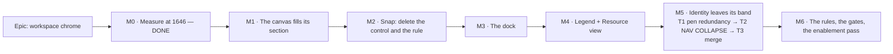

# Implementation Plan: The plan workspace's chrome

- **Feature spec:** [`./feature-spec.md`](./feature-spec.md) — **not yet approved**
- **Status:** Draft — awaiting approval
- **Owner:** _(unassigned)_

## Breakdown

### Epic

**Workspace chrome** — give the plan workspace a stated rule for where a control lives and what may
be drawn on the diagram, dock the selection commands, delete one control the server already
implements, take the plan's identity out of a band of its own, and recover measured canvas at
**1646 CSS px**. Roadmap theme: UI/UX quality — the plan workspace. Frontend only; the CPM engine is
not imported and no migration runs.

**Definition of epic-complete** (three critical questions answered 2026-08-13):

1. Nothing operable is painted on the diagram, and the rule that says so is enforced by a test.
2. `Snap to grid` no longer exists and one snapping rule — the server's — is previewed honestly.
3. `Legend` and `Resource view` are Row 1 buttons, labelled at `comfortable`+ and icon-only below,
   **with nothing else on Row 1 paying** (Q1).
4. The armed-tool instruction is in the dock (Q2).
5. **The plan identity line no longer occupies a band of its own** (Q3 — a **hard requirement**,
   not measurement-gated; see the M5 header for what that changes).

**M0 has been run by the coordinator** ([`./m0-band-measurement.md`](./m0-band-measurement.md)),
because Q3 became binding and its feasibility was the epic's most load-bearing unknown. Both
instrument repairs landed and 1646 is now permanent in `vertical-stack.spec.ts`. Its headline
changed M5's shape: **the merge is 554 px over and only the 637 px organisation nav is large enough
to pay for it**, so the nav collapse is a prerequisite rather than a fallback. M0-T4 remains open —
two figures M5 turns on are still estimates.

**Sequencing rule for the whole epic.** Every milestone is **one commit boundary** and independently
revertible; there is **no feature flag** (ADR-0088 D1 — a published image carries every flag at its
default, so a flag would buy no rollback and a second surface would be a Class A flag against the
cap in `flag-retirement.json`). Every milestone re-runs the 1646 measurement **before and after**
and records both numbers; a milestone that cannot show its number does not land.

---

## Milestone 0 — Measure at 1646 (and fix two instruments) — **T1–T3 done, T4 open**

**Outcome:** the numbers M3–M5 are sized against exist, at the width and height the product owner
uses, taken from the tree that is about to be changed — **and, decisively, an answer to whether the
Q3 merge fits at all. It does not, without a cut** ([`./m0-band-measurement.md`](./m0-band-measurement.md)).
**Entry point:** `Ships dark` — a harness only. Nothing a planner can press changes. (ADR-0081 §1.)
**Journey:** none — a harness asserts nothing (ADR-0081 §3). The first journey lands with M2, the
first user-facing milestone (ADR-0081 §2).

> **Ownership note.** The coordinator ran M0, including the `vertical-stack.spec.ts:191-208` repair,
> because Q3 is binding and no measurement could be taken in the session that wrote this plan. The
> tasks stay here as the specification of what was measured and why. **The one thing that must not
> happen is a milestone proceeding on a substitute for a number M0 was supposed to produce** — which
> is why **M0-T4 is still open and blocks M5**: two of the three figures M5's arithmetic turns on are
> still decomposed by eye.
>
> **Every M0 measurement is taken as an Org Admin.** The app header row is role- and
> flag-conditional (`app-header.tsx:96-119` — `Resources`, `Audit log` and `Recently deleted` are
> each gated), so an Org Admin's row is the widest in the product and is the only worst case worth
> sizing against. A harness that signs up a fresh user and creates an organisation makes that
> account an Org Admin, so this is satisfied by the existing fixtures — **confirm it, do not assume
> it**.

> **Feature: the 1646 baseline**
> **Description:** extend `measure-toolbar/` to the target device, repair `appHeaderRoom`, and settle
> the `clear-visual-placement` discrepancy.
> **Complexity:** M
> **Dependencies:** none
> **Risks:** the harness needs a real API and browser → run it locally per the pre-push gate, not in
> CI; the numbers change under any concurrent toolbar work → M0 lands first and nothing else is in
> flight.
> **Testing:** none (harness). Its output is a dated document,
> [`m0-band-measurement.md`](./m0-band-measurement.md).

##### Task M0-T1 — the vertical stack at 1646 × 1097, and a working `appHeaderRoom`

- **Description:** add `{1646, 1097}` (2880 × 1920 at 175 %) and a coarse-pointer variant to
  `vertical-stack.spec.ts`'s `VIEWPORTS` (`:26-29`, today 1920 × 1080 and 1440 × 960 only), and fix
  the app-header measurement, which cannot answer the question `TECH_DEBT` #129 asks of it:
  `AppHeaderRow` is `<header class="h-14 px-4">` with **exactly one child** (`app-header.tsx:150-156`
  → `HeaderContents`'s grid at `:52`), so `childCount` is always 1, `used` ≈ the row width and
  `widestGap` always **0**, at every viewport, by construction.
- **Complexity:** S
- **Dependencies:** none
- **Risks:** measuring the _grid_ rather than its cells repeats the same error one level down →
  report **per grid cell** (leading / centre / trailing), each cell's content width, and the
  organisation nav's `scrollWidth` vs `clientWidth`, since `app-header.tsx:73-76` already scrolls it.
- **Testing:** none. **Verify the instrument first:** the new reading must disagree with the old one
  on the same page, or it is measuring the same thing again.
- **Steps:**
  1. Add the viewport; add a `hasTouch` variant (`TECH_DEBT` #133, and the ADR-0091 lesson that
     every figure in two epics assumed a mouse).
  2. Replace `appHeaderRoom` with a per-cell reading; keep the old field beside it for one run so
     the difference is on the record.
  3. Report the armed-tool state as well as idle: mount the plan, arm `Link`, re-read — S3's number.
  4. Report the dock candidate: the collapsed activities bar's box (`activity-bottom-panel.tsx:130`).
  5. Write [`m0-band-measurement.md`](./m0-band-measurement.md), stating what it does **not** measure.

##### Task M0-T2 — Row 1's real slack, and what D-B costs

- **Description:** re-run `item-widths.spec.ts` at 1646 (fine **and** coarse) on the current tree and
  report Row 1's slack and the `nameWidth` a `Legend` and a `Resource view` button would cost.
  `m7-ladder-measurement.md` §3 measured 277 px of Row 1 slack at 1646 — but on `web-v0.86.1`,
  **before** the M7 ladder landed, so it is stale by construction.
- **Complexity:** S
- **Dependencies:** M0-T1 (same run)
- **Risks:** sizing from `nameWidth` alone under-counts — a labelled plain button is icon + gap +
  label + padding, and the ladder derives it (`toolbar-ladder.ts` `iconOnlyWidth` +
  `ICON_LABEL_GAP_PX`) → compute the candidate width **through the ladder's own helpers**, not by
  adding boxes, which is the mistake `CHROME_RESIDUAL_PX` was calibrated against.
- **Testing:** none.
- **Steps:**
  1. Re-measure both rows at 1646 fine and coarse; record labelled counts.
  2. Compute the two candidates' widths with `iconOnlyWidth` + `measureText` at the row's real font.
  3. Answer, in the document: do both fit labelled at 1646 with nothing else demoting? Icon-only?
     Neither? — this is **Q1's** input.
  4. Record what a third item would cost, so the next request has a number waiting.

##### Task M0-T3 — settle the `clear-visual-placement` discrepancy

- **Description:** `m7-ladder-measurement.md` §5 says the item is `isVisible`-false on the harness's
  plan; `tsld-toolbar-items.tsx:2336` says `isVisible: () => SCHEDULING_MODES_ENABLED`, which is
  default-on (`config/env.ts:185-186`), and the product owner reports seeing it in the `⋯`. The
  instrument cannot adjudicate: `item-widths.spec.ts:53-55` iterates the row container and
  `continue`s on `__overflow__`, so it lists **inline items only** and can report neither an
  overflowed item nor whether the `⋯` rendered.
- **Complexity:** S
- **Dependencies:** M0-T1
- **Risks:** if the item _is_ on Row 2, every Row 2 figure in `m7-ladder-measurement.md` was taken on
  a row one item and one `⋯` different from a planner's → re-take the Row 2 baseline before M4/M5
  cite it.
- **Testing:** none.
- **Steps:**
  1. Extend `item-widths.spec.ts` to report the `⋯`'s presence and, when present, its menu contents
     (the pattern already exists in `measure.spec.ts:88-100`).
  2. Re-run at 1646; state which document was wrong and correct it **in place** rather than in a new
     one.

##### Task M0-T4 — decompose the identity line properly, before M5 builds on an estimate

- **Description:** M0's run reports the identity line as **two composites** — breadcrumb + `Draft`
  badge **361 px**, modes + view switch + pen cluster **790 px**
  ([`m0-band-measurement.md`](./m0-band-measurement.md) §3) — and the two savings M5 depends on are
  **decomposed from those by eye**: ~220 px for a name-only breadcrumb and ~165 px for the pen
  redundancy. Extend the probe to report, separately: the breadcrumb's full width and its
  **plan-name + badge only** width; the mode cluster; the view switch; the pen control; the pen's
  live-region sentence; and the `Editing` badge.
- **Complexity:** S
- **Dependencies:** M0-T1's repaired probe
- **Risks:** this is the epic's own warning applied to itself — `m7-ladder-measurement.md` §3
  records a table of plausible-looking residuals, written into a draft before anything computed
  them, that measured nothing they were labelled with (ADR-0076 Class 3). **A ~figure that decides a
  milestone's shape must become a measured figure before that milestone starts.**
- **Testing:** none (harness). Its output amends `m0-band-measurement.md` §4 in place.
- **Steps:**
  1. Report the six sub-widths above, in **both** pen states (held and available) — the cluster
     differs between them and only held was measured.
  2. Replace the two ~figures in §4 with measured ones, or state that they held.
  3. If the measured total is **worse** than ~385 px, say so immediately: the nav collapse then has
     to recover more than ~517 px and M5's arithmetic changes before it is built, not during.

---

## Milestone 1 — The canvas fills its section

**Outcome:** the diagram is no longer a rounded box inside a padded pane; it gains a measured 17 px
of height and 32 px of width and reads as one surface with the band above it.
**Entry point:** the diagram itself — a planner sees the change on opening any plan. Not a control.
**Journey:** `e2e-workspace-dock` does not exist yet (M2 creates it). M1 is proved by the **fit
gate's existing plan open** plus the M0 harness re-run; it changes no control and adds no capability,
so ADR-0081 §2's "first user-facing milestone" rule is met by M2, which lands immediately after.

> **Feature: full-bleed canvas**
> **Complexity:** S
> **Dependencies:** M0 (the before number)
> **Risks:** three overlays position against the pane container → each is checked, not assumed.
> **Testing:** existing `TsldPanel`/`TsldCanvas` suites (they assert behaviour, not padding), plus a
> re-run of `vertical-stack` showing the 17 px.

##### Task M1-T1 — remove the pane box

- **Description:** drop `rounded-lg border` from `TsldPanel.tsx:2570` (the `fill` branch only — the
  non-`fill` branch at `:2571` is the embedded 480 px preview and keeps its box) and the
  `px-4 pt-2 pb-2` from `plan-workspace-toolbar.tsx:985` and its narrow-pane twin at `:1080`;
  replace the boundary with the dock's `border-t` and the band's existing `border-b`.
- **Complexity:** S
- **Dependencies:** none
- **Risks:** (a) `TsldLegendPanel` clamps to `offsetParent` (`:69-87`) — verify it still clamps to
  the pane; (b) the create popover positions against the outer container
  (`TsldPanel.tsx:2639-2652`) — verify the drop point still lands under the pointer; (c) the resource
  strip overlays the same `relative` container; (d) the canvas ground meets the page background with
  no border — the hairline is what stops it looking unfinished.
- **Testing:** unit — the legend clamp and the popover anchor; visual — one screenshot at 1646 in the
  measurement document, since neither is a gate.
- **Steps:**
  1. Remove the classes; add the hairline.
  2. Run the three positioning checks above **individually**, in a browser.
  3. Re-run `vertical-stack` at 1646; record before/after.
  4. Changeset (patch, user-visible).

---

## Milestone 2 — Snap: delete the control and the client rule

**Outcome:** a bar dropped on a non-working day previews and persists at the **next** working day —
one rule, the server's, previewed honestly — and the control that claimed to govern this is gone.
**Entry point:** the **absence** of a control is the change, and its observable is the drop: drag a
bar onto a Saturday and it previews at Monday. The `Snap to grid` button no longer exists on Row 2.
**Journey:** **new suite `e2e-workspace-dock`** (created here, extended by M3): sign up → plan on a
five-day calendar → take the pen → drag a bar onto a Saturday column → assert the preview, then poll
the **API** for the persisted `earlyStart` and assert Monday. Asserting the API, not the DOM, is the
point (the ADR-0070 lesson).

> **Feature: one snapping rule, owned by the server**
> **Description:** delete `snap-to-grid`, `snapToWorkingDay` and `NavState.snapToGrid`; give the
> optimistic preview the engine's forward roll.
> **Complexity:** M
> **Dependencies:** M0 (Row 2's baseline, so the width freed is on the record)
> **Risks:** a real behaviour change for anyone with the toggle on (Saturday → Friday becomes
> Saturday → Monday) → stated in the changeset and the ADR; the preview could regress to showing the
> raw drop → the journey asserts the preview _and_ the persisted value.
> **Testing:** unit for the new helper; the journey above; deletion of the two mechanism-only suites
> with their replacement named in the commit.

##### Task M2-T1 — establish the two rules side by side, in a test, before deleting anything

- **Description:** write a characterisation test that runs the client's `snapToWorkingDay` and a
  faithful reimplementation of the engine's `rollForwardToWorking` day-rule over the same drops and
  records where they disagree. This is the P2 differential the control never had, written **first**,
  so the deletion is justified by a red/green artefact rather than by this document.
- **Complexity:** S
- **Dependencies:** none
- **Risks:** reimplementing the engine rule in a test is a second implementation → it asserts only
  the **day-level direction** (forward vs nearest) and says so; the authoritative check is the
  journey's API assertion in M2-T4.
- **Testing:** this _is_ the test. Expected output: identical on working days and on Sunday;
  **Friday vs Monday** on Saturday; **Thursday vs Monday** with a Friday holiday.
- **Steps:**
  1. Write it; run it; paste the table into the ADR.
  2. Cite `engine/compute.ts:335-338` and `engine/instants.ts:18-22` in its docblock.

##### Task M2-T2 — delete the control

- **Description:** remove the `snap-to-grid` item and its `placeholderItem` branch
  (`tsld-toolbar-items.tsx:1793-1801`, `:2304-2324`), `NavState.snapToGrid` / `toggleSnapToGrid`
  (`use-tsld-canvas-ui-state.ts:121, 159, 228-231`), the toolbar-context field, and every test that
  asserts the toggle.
- **Complexity:** S
- **Dependencies:** M2-T1
- **Risks:** a stale reference in a doc keeps the control alive on paper → `CANVAS_NAV_ENABLED`'s
  docblock (`config/env.ts:584-590`), `docs/TOOLBAR_ROADMAP.md`, `docs/specs/canvas-nav/` and the
  shortcuts sheet are all updated in the same commit.
- **Testing:** existing toolbar suites updated; the fit gate re-run (Row 2 loses ~32 px + a gap).
- **Steps:** 1. delete; 2. update docs; 3. re-run the fit gate; 4. record Row 2's new slack.

##### Task M2-T3 — the preview adopts the server's rule

- **Description:** replace `snapToWorkingDay` with `previewRollForwardToWorking(dayOffset,
isWorkingDay)` — forward-only, bounded, pure — used by the reposition ghost and by
  `drawnSpanPlacement`'s existing start-roll (`snap.ts:61-76`), whose forward-only argument
  (`:50-53`) is the same argument and is retained. **The PATCH sends the raw dropped day**: the
  client's predicate is the _plan_ calendar at day granularity while the engine rolls on the
  _activity's own_ calendar at minute granularity (ADR-0036/0037), so a client-computed value is an
  approximation that must not be persisted.
- **Complexity:** M
- **Dependencies:** M2-T2
- **Risks:** the preview can be short of the server's answer (a per-activity calendar the client does
  not hold) → documented in the helper's docblock as an approximation that is never on the wrong
  side; the announcement could speak on every drop → it speaks only when the roll moved the day.
- **Testing:** unit — identity on a working day, forward on Saturday and Sunday, forward across a
  holiday run, bounded on a pathological all-non-working calendar; unit — the PATCH payload carries
  the **raw** day.
- **Steps:**
  1. Add the helper with the engine citation (P3).
  2. Rewire the ghost; leave the payload raw.
  3. Add the announcement clause.
  4. Re-point `drawnSpanPlacement` at the shared helper.

##### Task M2-T4 — the journey

- **Description:** create `apps/web/e2e-workspace-dock/` + `playwright.workspace-dock.config.ts` +
  the CI step, pinning **no** `VITE_` flags (the `e2e-toolbar-fit` precedent: the shipped surface is
  the default surface), with the API's pen enforced.
- **Complexity:** M
- **Dependencies:** M2-T3
- **Risks:** the drop lands on the wrong column if the fixture's calendar or zoom differs → derive
  the target column from the ruler, and assert **which day was dropped on** before asserting the
  outcome (the ADR-0064 harness pattern: measure, then claim); a recalculation outruns Playwright's
  5 s poll (ADR-0080) → poll the schedule summary with a 30 s budget, as `fit.spec.ts:383-399` does.
- **Testing:** this is the test.
- **Steps:** 1. scaffold; 2. drop on Saturday; 3. assert the ghost; 4. poll the API for the persisted
  date; 5. add the CI step; 6. run it locally before pushing (CLAUDE.md §19.8).

---

## Milestone 3 — The dock

**Outcome:** no command is ever painted over the diagram; the selection commands, the plural
commands, the armed-tool instruction, the link confirmation and the export banners all live in one
persistent strip at the bottom of the canvas region, which **costs no height** because it is the
activities handle promoted.
**Entry point:** select any bar on the diagram — the dock is the strip below it, with that activity's
name and commands.
**Journey:** `e2e-workspace-dock` (from M2) gains: select → assert the dock's box does **not**
intersect the `<canvas>` box → run a command → arm a tool → assert the canvas height is unchanged →
deselect.

> **Feature: the workspace dock**
> **Complexity:** XL
> **Dependencies:** M1 (the pane is already unpadded), M2 (Row 2 settled)
> **Risks:** the largest slice in the epic and the one most likely to strand focus → the existing
> `restoreFocus` contract is kept and tested; a partially-wired host ships a dead surface (the
> ADR-0081 defect) → the journey lands **with** this milestone, not at enablement.
> **Testing:** unit per occupant + precedence; the journey; the fit gate widened to the dock (closing
> `TECH_DEBT` #124); the §2.4 permission-matrix identity test.

##### Task M3-T1 — the dock shell and its precedence

- **Description:** new `components/layout/workspace/workspace-dock.tsx`: a full-width, width-
  constrained strip below the canvas holding one leading region (subject or statement), one trailing
  region (the activities handle), and a command region. Precedence, highest first: **transient
  statement → plural selection → singular selection → rest**.
- **Complexity:** M
- **Dependencies:** M0-T1 (the handle's measured box)
- **Risks:** "whichever is set" instead of a rule is how two states collide later (the ADR-0059
  `emphasisIds` shape) → precedence is a pure function with its own table-driven test.
- **Testing:** unit — the precedence table, every pair; unit — at rest the dock's height equals the
  collapsed bar's height today.
- **Steps:** 1. shell + precedence function; 2. the handle moves in (`activity-bottom-panel.tsx:117-143`); 3. panel-expanded layout (dock above the resizer, the panel's collapse control in the dock); 4. below-`md` single-pane behaviour.

##### Task M3-T2 — the singular selection moves in

- **Description:** host `selectionActionItems` (all 11, **verbatim** — extracted, not reimplemented,
  the ADR-0062 rule) in the dock; delete `SelectionActionsBar`'s floating host, the rAF placement
  loop (`selection-actions.tsx:642-693`) and the canvas's `selectionAnchorRef` write
  (`TsldCanvas.tsx:1438-1487`).
- **Complexity:** L
- **Dependencies:** M3-T1
- **Risks:** the WBS-band case (`:1464-1487`) exists only to keep a band-selected summary reachable —
  deleting the anchor **removes that whole class of defect**, because the dock reads the plan's
  activities rather than the scene, but the tests that pin it must be re-pointed rather than
  deleted; focus restoration on content change is now _more_ frequent → explicit test.
- **Testing:** every existing `selection-actions.*.test.tsx` must pass **unchanged** — that is the
  acceptance condition for "extracted, not reimplemented"; new: no overlap with the canvas; new:
  focus returns to the listbox when the selection is deleted under a focused dock control.
- **Steps:** 1. host the items; 2. delete the floating host; 3. delete the anchor and its per-frame
  read; 4. re-point the band tests; 5. re-run the whole `features/tsld` suite.

##### Task M3-T3 — the plural selection and the armed-tool statement move in

- **Description:** `BulkSelectionBar`'s content and `CanvasModeBand`'s statement become dock
  occupants. `modeStatementText` (`CanvasModeBand.tsx:42-63`) is **kept verbatim** — one source for
  the screen and the live region.
- **Complexity:** M
- **Dependencies:** M3-T2, **Q2 answered**
- **Risks:** double-announcement — the dock must render **no** live region, because `TsldPanel`
  already announces (`CanvasModeBand.tsx:90-92`); the link confirmation's `Undo` was absent for
  months once already (`plan-workspace-toolbar.tsx:486-501`) → the journey presses it.
- **Testing:** unit — each statement kind renders its exact sentence; unit — exactly one
  announcement per transition; journey — arm, place, undo.
- **Steps:** 1. move the bulk content; 2. move the statement; 3. assert canvas height is unchanged
  when arming (S3); 4. journey step.

##### Task M3-T4 — the pushed banners move in

- **Description:** route `ctx.exportError`, `ctx.exportNotice` and the Late-overlay explanation
  (`plan-workspace-toolbar.tsx:917-975`) into the dock instead of rows that push the canvas down.
- **Complexity:** S
- **Dependencies:** M3-T1
- **Risks:** an error that is dismissable must stay dismissable and must not be outranked into
  invisibility by a selection → an error takes the dock's leading region and holds it until
  dismissed, above the statement in precedence.
- **Testing:** unit per banner; unit — an error is not displaced by selecting something.
- **Steps:** 1. re-route; 2. extend the precedence table and its test; 3. keep `role="alert"`.

##### Task M3-T5 — `Clear placement` moves in and is renamed

- **Description:** move `clear-visual-placement` from Row 2 to the dock registry; rename the label to
  **`Clear placement`** and put the long form in `description` (the tooltip), preserving WCAG 2.5.3
  as ADR-0091 M7 did for three other labels. Keep the four-rung reason ladder
  (`tsld-toolbar-items.tsx:2348-2357`) **verbatim**; shade in Early mode (D2, ADR-0082).
- **Complexity:** S
- **Dependencies:** M3-T2
- **Risks:** a journey or unit test locates it by its old copy → per ADR-0091's own lesson, locate
  toolbar controls by `[data-toolbar-item]`, not by label, and **run all 31 journeys** (M6).
- **Testing:** unit — the ladder's four reasons unchanged; unit — the accessible name is
  `Clear placement`; journey — a Visual-mode plan clears a placement from the dock.
- **Steps:** 1. move + rename; 2. re-point tests; 3. `docs/TOOLBAR_ROADMAP.md`.

##### Task M3-T6 — widen the fit gate to the dock

- **Description:** add the dock to `e2e-toolbar-fit`'s `ROWS`, closing `TECH_DEBT` #124 — whose
  stated reason for exclusion ("shrink-wraps to its content and is clamped to the viewport") stops
  being true the moment the bar is width-constrained.
- **Complexity:** S
- **Dependencies:** M3-T2
- **Risks:** the dock only exists with a selection, so a naïvely added row measures nothing and
  passes — **exactly** #124's recorded failure (a test that skipped silently and "reported success
  for never having run") → the gate asserts the dock is **present** before reading it, as
  `fit.spec.ts:356-360` does for the mode row.
- **Testing:** this is the gate. Verify red first by shrinking a dock control.
- **Steps:** 1. select an activity in `openPlan`; 2. add the row; 3. add the presence assertion; 4. run at all nine widths, fine and coarse.

##### Task M3-T7 — the no-overlap assertion (S2)

- **Description:** assert that **no operable element's box intersects the `<canvas>` box**, in every
  selection and tool state the journey visits.
- **Complexity:** S
- **Dependencies:** M3-T3
- **Risks:** a geometric test cannot tell a column from a row (the `m4-vertical-stack.md` §5 probe-2
  lesson) → scope it to `button, a[href], [role="button"], [role="menuitem"], input` and **exclude
  the two named exceptions** (the create popover and the Legend panel) by an explicit allow-list, so
  the exemption is narrow and reviewable rather than a blanket skip.
- **Testing:** this is the gate. Verify red against the pre-M3 tree (the floating bar fails it).
- **Steps:** 1. write it against `main` and watch it fail; 2. land it with M3; 3. document the
  allow-list beside the rule.

---

## Milestone 4 — Legend and Resource view onto Row 1

**Outcome:** both are one press from Row 1, pressed-state visible, and `TECH_DEBT` #125's workaround
note is retired.
**Entry point:** the `Legend` and `Resource view` buttons on Row 1 · View and navigate.
**Journey:** `e2e-workspace-dock` gains: press `Resource view` → the strip opens and focus lands in
it → press `Legend` → the panel opens → both read as pressed.

**Q1 is answered — accepted as defaulted** (spec §1.9): both get Row 1 buttons, **labelled at
`comfortable` and above, icon-only below**, and **nothing else on Row 1 pays**. Two conditions
survive the answer and are not softened by it:

1. **The cost is measured at 1646** (M0-T2), not argued. If the measurement shows another control
   losing its label, that is a failure of this milestone's premise and the number goes back to the
   product owner (brief, D-B) — the answer authorised a design, not an outcome.
2. **The icon-only fallback is verified to be what actually happens at a sub-1536 width, not
   assumed.** `TECH_DEBT` #126 records the band-aware `showLabel` being built once and reverted,
   because the items it was built for carried no `icon` and rendered as blank 16 px buttons that
   `e2e-toolbar-fit` S5 caught as a WCAG 2.2 §2.5.8 failure the same hour.

> **Feature: two panel commands on the row**
> **Complexity:** M
> **Dependencies:** M0-T2, Q1, **two icons** (see the risk)
> **Risks:** the icons are a real blocker — `TECH_DEBT` #126 records four blank 16 px buttons
> shipping and failing the fit gate within the hour because the items carried no `icon`. Two new
> label-optional controls need glyphs, chosen with the #126/#130 pass or the toolbar acquires two
> vocabularies.
> **Testing:** unit — the items resolve with the same reasons the popover rows had; the fit gate at
> all nine widths; the journey.

##### Task M4-T1 — the two registry items

- **Description:** add `legend` and `resource-view` as `ToolbarItem`s (group `lens`, row `look`,
  tier 2, `showLabel: { atLeast: 'comfortable' }` — the ADR-0091 D3a pattern, which is what makes
  them affordable below 1536) and **remove the two `LensToggle` rows** from `View ▾`
  (`tsld-toolbar-items.tsx:221-230, 249-260`). Carry each row's `reason` across verbatim — a reason
  is exactly what a relocation loses (that file's own warning at `:168-171`).
- **Complexity:** M
- **Dependencies:** icons
- **Risks:** offering them in both places is worse than either → a unit test asserts each id appears
  exactly once across the registry and the popover.
- **Testing:** unit — one home each; unit — `aria-pressed` reflects state; unit — the
  `over-allocation` sibling stays in `View ▾` and keeps its stuck-on guard (`:238-247`).
- **Steps:** 1. add items; 2. remove rows; 3. drop `resource-view`'s `note` (`:229`) and close
  `TECH_DEBT` #125 with the reason; 4. re-run the fit gate at 1646.

##### Task M4-T2 — record what it cost

- **Description:** re-run `item-widths` at 1646 fine and coarse; state which controls, if any, lost a
  label, and append to [`m0-band-measurement.md`](./m0-band-measurement.md).
- **Complexity:** S
- **Dependencies:** M4-T1
- **Risks:** a silent regression on the coarse branch (`TECH_DEBT` #133 — Row 2 already withholds
  every label there) → both pointer types measured, and the coarse result reported even though it is
  not blocking.
- **Testing:** none (harness).

---

## Milestone 5 — The plan identity leaves its band (**required**), and what pays for it

**Outcome:** the plan's identity, status, modes and pen render inside the app header row; the band
count above the canvas falls from four to three and `aboveCanvas` falls from the measured **249 px**
toward ~204 px.
**Entry point:** the app header row itself — a planner opening a plan sees the breadcrumb, `Draft`
badge, `Edit plan`, the mode switches and the pen in the top row, and no band beneath it.
**Journey:** `e2e-workspace-dock` gains an app-band pass: open a plan, assert the identity controls
are in the header row, assert every organisation destination is still reachable, assert one `banner`.

**This milestone is no longer conditional** (spec §1.9 Q3 — a hard requirement, risk put in writing
and reaffirmed). **And M0 has measured what it costs, which changes its shape entirely:**

| fact                                        |       value | measured?         |
| ------------------------------------------- | ----------: | ----------------- |
| app header content @ 1646, Org Admin        |     1049 px | **yes**           |
| identity line content @ 1646, pen held      |     1151 px | **yes**           |
| **deficit on one row**                      | **−554 px** | **yes**           |
| organisation nav (org picker + seven links) |      637 px | **yes**           |
| breadcrumb → plan-name-only saving          |     ~220 px | **no — estimate** |
| pen-redundancy saving                       |     ~165 px | **no — estimate** |
| both together                               |     ~385 px | **no**            |
| **shortfall after both**                    | **~169 px** | —                 |

**So tidying the identity line cannot meet the requirement.** The only item in the row large enough
is the 637 px organisation nav. **Collapsing it behind one trigger is therefore a prerequisite of
this milestone, not a fallback from it** — and it is a decision about **every screen in the
application**, which is why it is M5-T2, has its own risk row, and went to the product owner rather
than being taken here.

> **Feature: the plan identity in the app band**
> **Complexity:** XL
> **Dependencies:** **M0-T4** (the two estimates must become measurements first), the product
> owner's acceptance of the nav trade
> **Risks:** see the four rows added to the rollup — the nav collapse's product cost, the coarse
> pointer, the sub-1440 widths, and the pen-available state.
> **Testing:** unit — the shell renders identically with no plan open; a11y — exactly one `banner`
> and the `sr-only <h1>` still inside `main` (`plan-workspace-toolbar.tsx:774-781`); the fit gate
> extended to the app band; every journey that reads the breadcrumb or a nav link.

##### Task M5-T1 — remove the pen redundancy

- **Description:** remove the live-region sentence _"You're editing this plan."_ and the `Editing`
  badge that sits beside a button already reading `Stop editing`. The pen's **state** must still be
  announced — removing the badge must not remove the announcement.
- **Complexity:** S
- **Dependencies:** M0-T4 (for the real figure; the work does not depend on it, the arithmetic does)
- **Risks:** deleting the only thing that says who holds the pen when it is **someone else** → the
  peer-held case is a different sentence and is **kept**; only the self-held duplication goes.
- **Testing:** unit — self-held renders one statement; peer-held renders the full sentence; a11y —
  the state change is still announced once.
- **Steps:** 1. remove; 2. re-measure the identity line at 1646 in **both** pen states; 3. record
  against M0-T4's figure and say whether the estimate held.

##### Task M5-T2 — collapse the organisation nav behind one trigger (**the prerequisite**)

- **Description:** replace the seven inline links with one `Organisation ▾` trigger using the
  existing APG `Menu` primitive (`components/ui/menu.tsx`), so roving focus, ADR-0082 reason wiring
  and the portal behaviour come free rather than being rebuilt. Recovers ~517 px of the measured
  637 px.
- **Complexity:** L
- **Dependencies:** M5-T1; **product-owner acceptance of the trade**
- **Risks:**
  - **It changes every screen in the application, not this workspace.** Overview, Clients,
    Calendars, Resources, Members, Audit log and Recently deleted each become one press further away
    everywhere → this is the risk row, it is the product owner's call, and the milestone does not
    start without it.
  - The nav is **role- and flag-conditional** (`app-header.tsx:96-119`) → a menu whose every item is
    withheld must render **no trigger** (ADR-0082's clause), not an empty menu.
  - `aria-current` marks the active destination today (`:88-89`) → the trigger must carry the
    current section's name or a reader loses "where am I" from the top row entirely.
  - `Clients` stays current across the whole hierarchy tree (`:42` `onHierarchy`) → carry that rule
    across verbatim; it is exactly the kind of rule a relocation loses.
- **Testing:** unit — every destination reachable, `aria-current` preserved, no trigger when empty;
  a11y — the menu is keyboard-operable and names the current section; **every journey that clicks a
  nav link** (locate by role and name, and expect to fix several).
- **Steps:** 1. build the trigger; 2. carry `aria-current` and the hierarchy rule; 3. re-measure the
  app header row; 4. sweep the journeys **before** pushing.

##### Task M5-T3 — the second chrome slot, and the merge

- **Description:** publish a **second slot** from the chrome band inside the app header row, and
  portal the identity line into it — the exact `chrome-slot.tsx:7-25` pattern that already lets the
  toolbar's DOM node move while its React tree stays in the workspace. **The shell gains a `
`
  and never learns what a plan is** (ADR-0029).
- **Complexity:** L
- **Dependencies:** M5-T1, M5-T2
- **Risks:**
  - **The grid fork must be chosen, not discovered.** `HeaderContents` is a deliberate
    `1fr auto 1fr` so the centre sits at the true midpoint (`app-header.tsx:27-34`). A fourth region
    either lives inside an existing cell or abandons that property → name the choice in the ADR.
  - A merged line must not create a **second `banner`** landmark — the ADR-0090 M4-T2 lesson, where
    a `<header>` became a `
` for exactly this reason.
  - A merge that fits at 1646 and overflows at 1440 is worse than no merge → assert against **every**
    width in the fit gate's list, not the target alone.
- **Testing:** the fit gate extended to the app band (S9); the shell's own suites with no plan open;
  the landmark assertions.
- **Steps:** 1. slot + portal; 2. delete the plan band; 3. re-run `vertical-stack` at 1646 and record
  the band count and `aboveCanvas`; 4. run every journey.

##### Task M5-T4 — record what was not measured

- **Description:** append to `m0-band-measurement.md` §5 the states this milestone shipped without
  measuring, each as a `TECH_DEBT` row rather than a silence: the **coarse** pointer (#133 — every
  control widens 32 → 40 px, which makes the deficit worse), widths **below 1440 and above 1920**
  (the merge's feasibility at 768 is unknown and a collapsed nav may change it either way), Chromium
  only, and the **pen-available** state (only pen-held was measured, and the cluster differs).
- **Complexity:** S
- **Dependencies:** M5-T3
- **Risks:** an unmeasured state that is not written down becomes an assumed-good state → each gets a
  row with an owner.
- **Testing:** none.

---

## Milestone 6 — The rules, the gates and the enablement pass

**Outcome:** the two rules are enforced by tests rather than stated in prose, the specialist gates
have run over the combined diff, and the ADR is filed.
**Entry point:** `Ships dark` for the gates; the ADR and doc updates carry the epic's meaning.
**Journey:** **all 31 flag-on suites run**, not only the ones CI names — ADR-0091 records three
journeys breaking across one epic because only the named suite was re-run.

> **Feature: enforcement**
> **Complexity:** L
> **Dependencies:** M1–M5
> **Risks:** a gate that fails on day one gets deleted rather than fixed (ADR-0058) → each new
> assertion is set at the **measured** state and verified red against the pre-epic tree first.
> **Testing:** the gates are the deliverable.

##### Task M6-T1 — the scope gate (S4)

- **Description:** the differential resolve of §4.2: two contexts identical but for the selection;
  assert the enabled set, visible set and reason strings of every persistent-row item are identical.
- **Complexity:** M · **Dependencies:** M3-T5 · **Risks:** a future item legitimately reads the
  selection → the failure message names the rule and the dock, so the fix is obvious.
- **Testing:** verify red against `main` (`clear-visual-placement` fails it).

##### Task M6-T2 — the permission-matrix identity test (§2.4)

- **Description:** resolve the whole registry against Viewer/Contributor/Planner × pen × overlay and
  assert every unmoved id's `{enabled, visible, reason}` triple is unchanged from before the epic.
- **Complexity:** M · **Dependencies:** M3 · **Risks:** a snapshot that is regenerated on failure
  proves nothing → the expected triples are committed **before** M3 lands, from `main`.

##### Task M6-T3 — P1/P2/P3 written down

- **Description:** `docs/FRONTEND_ARCHITECTURE.md` (preview rule + the mirror-citation rule),
  `docs/TESTING.md` + the PR template (the differential-at-the-persisted-outcome rule),
  `docs/UX_STANDARDS.md` (the overlay rule and its two exceptions).
- **Complexity:** S · **Dependencies:** M2, M3 · **Risks:** a rule with no instrument decays →
  P3 ships with its structural test **and its stated limit** (it checks that a citation exists, never
  that the two rules still agree).

##### Task M6-T4 — the specialist gates

- **Description:** run **ux-reviewer, accessibility-reviewer, component-reviewer,
  performance-reviewer** over the combined diff, and fold every blocking finding with a regression
  test verified to fail first. Not `security-reviewer`/`api-reviewer`/`backend-performance-reviewer`
  — there is no API, permission or query change, and §2.4's matrix test is the evidence rather than
  the assertion. `database-architect` is not engaged because there is **no schema change to design**.
- **Complexity:** L · **Dependencies:** M1–M5
- **Risks:** the register records this pass finding defects a human read missed in **every** epic
  since ADR-0060 → budget for it as work, not as a formality.

##### Task M6-T5 — the ADR, the counts, and the release

- **Description:** file the ADR (§4.10's outline) at the **next free number, re-checked at filing**
  (ADR-0071 and ADR-0079 both record a number being taken between plan and merge); update
  `CLAUDE.md` §16 and `docs/adr/README.md` in the same commit (ADR-0078 found seven ADRs missing from
  that index); run `pnpm check:counts`, `check:doc-links`, `check:flags`, `check:claims`; add the
  changeset.
- **Complexity:** M · **Dependencies:** M6-T1..T4
- **Risks:** an ADR that describes the plan rather than the outcome is the register's newest recorded
  drift (ADR-0090 M5) → the ADR is written **from the measurements**, and every claim carries its
  evidence.

---

## Sequencing & slices

| Slice | Ships                                                        | Independently revertible        | Measurable at 1646                                |
| ----- | ------------------------------------------------------------ | ------------------------------- | ------------------------------------------------- |
| M0    | Harness + measurements (**done** — `m0-band-measurement.md`) | yes (no product change)         | it **is** the measurement                         |
| M1    | 17 px of canvas, no box                                      | yes (one commit)                | `vertical-stack` before/after: 249 → 232          |
| M2    | One snapping rule; one fewer control                         | yes                             | Row 2 slack; the persisted-date journey           |
| M3    | The dock                                                     | yes                             | canvas overlap = 0; armed-tool height = 0         |
| M4    | Legend + Resource view on Row 1                              | yes                             | `item-widths` labelled counts either side of 1536 |
| M5    | Pen redundancy → **nav collapse** → the merge                | **per task, not per milestone** | identity width; app-header width; band count      |
| M6    | Gates, docs, ADR                                             | yes                             | all suites green                                  |

`main` stays releasable at every boundary. **No feature flag** (ADR-0088 D1). Each milestone
re-measures at 1646 **before and after**; a milestone with no number does not land.

**M5 is the exception to "one milestone, one commit boundary", deliberately.** Its three tasks have
different blast radii — T1 touches one line of the workspace, **T2 changes navigation on every
screen in the product**, T3 changes the shell's structure — so each is its own boundary and its own
revert. In particular **T2 must be revertible without reverting T1 or T3**: it is the task carrying
a product decision rather than a layout one, and it is the one most likely to come back.

## Definition of Done (per task)

Each task's PR meets the Feature Completion Criteria in [`docs/PROCESS.md`](../../PROCESS.md).
For this epic specifically: `pnpm lint && pnpm typecheck && pnpm test`, **plus**
`scripts/e2e-local.sh web:workspace-dock` for any task touching the dock or the drop path, **plus**
the M0 harness re-run for any task claiming a width or a height. `apps/api` is untouched, so the API
e2e half does not apply — but that is a claim to re-check per PR, not an assumption for the epic.

## Risks & assumptions (rollup)

| Risk / assumption                                                                                                                  | Likelihood  | Impact   | Mitigation                                                                                                                                                                                                                                                          |
| ---------------------------------------------------------------------------------------------------------------------------------- | ----------- | -------- | ------------------------------------------------------------------------------------------------------------------------------------------------------------------------------------------------------------------------------------------------------------------- |
| **The nav collapse makes seven organisation destinations one press further away — on every screen in the product**                 | **certain** | **med**  | It is the **prerequisite** of a hard requirement (554 px needed, ~385 px available from the identity line), not a preference. Put to the product owner with the measured numbers; M5-T2 does not start without acceptance, and is its own revertible commit         |
| **M5's two decisive savings (~220 px, ~165 px) are estimates decomposed by eye**, and the deficit they must close is a measurement | **certain** | **high** | **M0-T4 measures them before M5 starts.** If they come in under ~385 px the nav must recover more than ~517 px and the arithmetic changes **before** anything is built. This is the ADR-0076 Class 3 failure the epic exists to stop, applied to itself             |
| The merge fits at 1646 and overflows below 1440 or on a coarse pointer — **neither was measured**                                  | med         | high     | M5-T3 asserts against every width in the fit gate's list; M5-T4 records the coarse and sub-1440 cases as debt rows with owners rather than silences                                                                                                                 |
| The pen cluster is wider in the **pen-available** state than the pen-held state M0 measured                                        | med         | med      | M0-T4 reports both; the worst case sizes the merge                                                                                                                                                                                                                  |
| Legend + Resource view cost another Row 1 control its label at 1646                                                                | med         | med      | M0-T2 measures first; Q1 authorised a design, not an outcome — if a control pays, the number goes back to the product owner (brief D-B)                                                                                                                             |
| The dock costs height in some state nobody modelled (panel expanded, narrow pane, right dock open)                                 | med         | med      | M3-T1 enumerates all four layouts; `vertical-stack` reports each                                                                                                                                                                                                    |
| Deleting the selection anchor breaks the WBS-band selection path                                                                   | low         | high     | The dock reads the plan's activities, not the scene — the ADR-0063 M6 defect becomes impossible; its tests are re-pointed, not deleted                                                                                                                              |
| The snap deletion changes a persisted outcome for a planner who had the toggle on                                                  | **certain** | low      | Stated in the changeset and the ADR; it moves the client toward the server's rule                                                                                                                                                                                   |
| The preview approximates and is short of the server's answer on a per-activity calendar                                            | med         | low      | Documented as an approximation that is never on the wrong side (P1); the recalc corrects it                                                                                                                                                                         |
| A journey breaks on copy or layout and is found by CI rather than locally                                                          | **high**    | med      | ADR-0091's rule: after any label/layout change run **every** journey and locate controls by `[data-toolbar-item]`. **M5-T2 raises this to near-certain** — every journey that clicks an organisation nav link will break, and that is expected work, not a surprise |
| `m7-ladder-measurement.md`'s Row 2 baseline was taken on a row a planner does not have                                             | med         | med      | M0-T3 settles it and corrects the document in place                                                                                                                                                                                                                 |
| Coarse pointer (`TECH_DEBT` #133) makes the dock's labels vanish in tablet mode                                                    | high        | low      | Measured every milestone; not fixed here; the dock is where a touch user gains most                                                                                                                                                                                 |
| The ADR number is taken between approval and filing                                                                                | med         | low      | M6-T5 re-checks at filing (the ADR-0071/0079 lesson)                                                                                                                                                                                                                |
| **This plan's own citations go stale** while it waits for approval                                                                 | med         | med      | Every decision-bearing citation is file+line; re-verify before each milestone rather than trusting it (ADR-0076, and ADR-0080 found two of its own plan's citations stale)                                                                                          |
