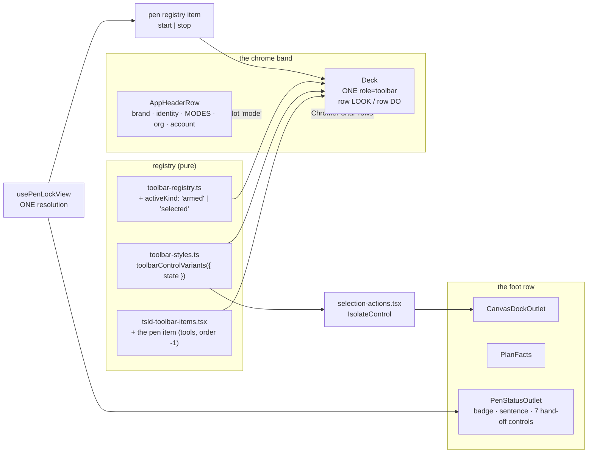
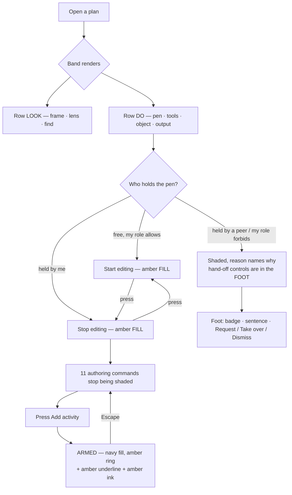
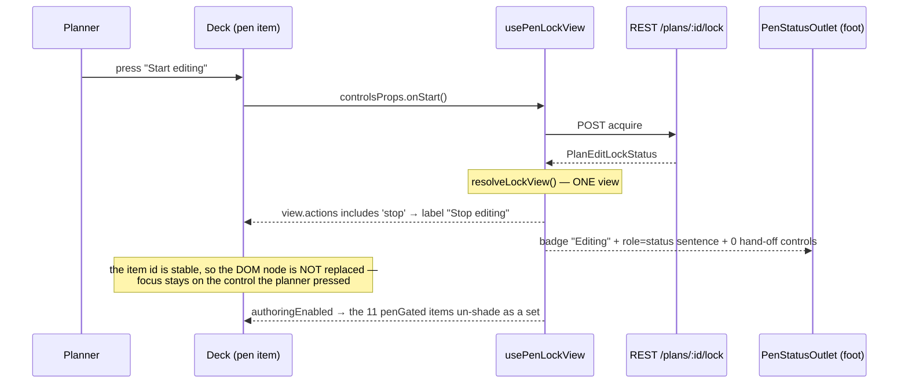

# Feature Spec: The plan-workspace console — declared rows, one state ladder, and the pen beside what it gates

- **Status:** Approved — by the product owner, 2026-09-10 (build M0–M8; CQ-1 drop the caption; CQ-4 foot row; CQ-2/CQ-3 take the defaults)
- **Author(s):** feature-analyst, from the `ui-architect` design study
  (`scratchpad/toolbar-design/directions.md`, 2026-09-10) and the product owner's choice of
  **Direction C — "The console"** in full, plus shared repairs S1–S7
- **Date:** 2026-09-10
- **Tracking issue / epic:** the plan-workspace toolbar redesign (Direction C)
- **Roadmap link:** none — this is the primary surface's chrome, not a roadmap theme
- **Related ADR(s):** amends **ADR-0031** (the toolbar registry and its taxonomy), **ADR-0064**
  (the arm/disarm contract's visual half), **ADR-0091 D1** (a mode is not a command),
  **ADR-0093** (an action's surface is decided by its subject), **ADR-0109 D1** (a command
  surface wraps), **ADR-0112 D1** (the pen's sentence is a fact), **ADR-0114/0115** (the foot
  row), **ADR-0119** (a group of buttons says which are alternatives), and **ADR-0055/0097**
  (surface scopes; the chrome family's completeness rule). Builds on ADR-0028 (the pen),
  ADR-0082 (shade with a reason, or omit), ADR-0110 (one geometry; a gate is verified against
  the defect it names), ADR-0118 (control height and its input axis).
  **A new ADR is required — `ADR-0133`** (next free number: the register's highest is
  `docs/adr/0132-an-alert-says-whether-it-is-an-event-or-a-standing-condition.md`, established
  by listing `docs/adr/01[0-9][0-9]-*.md` on 2026-09-10). Outline in §4.8.

---

## 0. Two things that govern how this spec should be read

### 0.1 The design register is suspended for this epic, and the process is not

The product owner set the ADR register and the existing visual standards aside for this
redesign — the same instruction, with the same bounds, that
[`docs/specs/workspace-redesign/README.md`](../workspace-redesign/README.md) records for
ADR-0109. It is recorded here for the same reason: so nobody reads this directory as a
precedent.

What is suspended is the **register as a constraint on the design** — the picture is not bent
to fit rules written for the thing it replaces, and the standards are rewritten afterwards from
what ships (M8).

What is **not** suspended:

- **`apps/web` only.** The CPM engine, the REST API and the database are untouched. No schema
  change, so **`database-architect` is not engaged — because there is nothing to design, not
  because a change was judged too small** (the §19.3 rule, stated the way ADR-0125 and
  ADR-0129 state it).
- **ADR-0081** — the journey lands with the first user-facing milestone and drives the real
  product, flag or no flag.
- **§19.13 / ADR-0111** — a change to a shared primitive's keyboard or focus contract gets
  `accessibility-reviewer` **and** `component-reviewer` **before** release. Two milestones here
  qualify (M3, M5) and say so.
- **Every bug fix ships a regression test verified red first** (ADR-0110 D5).
- **No `VITE_` flag** (ADR-0088 D1): a `VITE_` constant is inlined at build time, `apps/web/Dockerfile`
  passes none, and a flag here would be a rollback contract that does not exist. The rollback is
  a commit boundary, and the milestones below are sliced so each is one revertible commit.

### 0.2 Five claims I had to correct before writing this, and what each changed

The rule is ADR-0076's: a claim that decides something names what was run or read.

1. **The toolbar file is not where the brief says it is.** It is
   `apps/web/src/components/layout/workspace/plan-workspace-toolbar.tsx` (2,217 lines);
   `apps/web/src/features/plans/plan-workspace-toolbar.tsx` does not exist. **The line citation
   is right at the real path**: `:1593` is
   `<ToolbarBandProvider className="border-border flex flex-col border-b">` — the `border-b`
   that draws S2's redundant hairline. Established by `Glob` on both paths and reading `:1560–1900`.

2. **The header sheds the PEN, not the mode cluster.** The brief says "the header sheds the mode
   cluster"; the study's §C.4 says the opposite twice — _"Header: identity + modes + org +
   account … No pen"_ and _"**Mode switches** — stay in the header"_ — and §C.7's drop list reads
   _"the header's pen cluster"_. The two are conflatable because they share one chrome slot
   (`ChromePortal name="mode"` holds the four mode items **and** `CompactPenStatus`), which is
   almost certainly what the brief meant. Following the brief literally would move the four mode
   controls, and both ADR-0097 D1a and ADR-0112 D4 record that move being **measured and
   withdrawn** — `e2e-gantt` failed twice on the view switch being reachable only through an
   overflow. **This spec moves the pen and leaves the modes.**

3. **S4's rebind cannot fix the organisation switcher, and the switcher's defect is not the one
   named.** The brief says to treat `OrgSwitcher.tsx:48` as a live defect fixed by S4. S4 rebinds
   `--chrome-field` / `--chrome-field-foreground`; that line reads `bg-background`, which inside
   `[data-surface='chrome']` already resolves to `--chrome` (navy) — so the rebind does not touch
   it. Read: `OrgSwitcher.tsx:42-51`, `globals.css:1075-1088`. There is no base `select` rule and
   **no `color-scheme` declaration anywhere in `globals.css`** (grepped). So either the shipped
   screenshot disagrees with the code or a user-agent rule is winning, and **which it is has not
   been established** — that is **M0-T5**. **Answered (`m0-measurement.md` §7): in Chromium the
   control paints navy — `.bg-background` wins the cascade over four user-agent `select` rules and
   the preflight — so the "live defect" is not reproduced on this platform, and what the product
   owner's Windows screenshot shows is unexplained here.** The repair, whichever it is, is to give the control the
   chrome's **field** vocabulary (`bg-field text-field-foreground border-input`) rather than the
   surface's, which is what makes S4 reach it at all.

4. **The typeface is IBM Plex Sans, self-hosted** (`globals.css:30`, `:37`, `--font-sans` at
   `:1011`), with four real `@font-face` declarations. Space Grotesk was replaced on 2026-08-24;
   `--weight-light: 300` was **removed** with it (`globals.css:934`), because Plex's variable axis
   starts at 400. Consequence for this spec: **hierarchy below `--weight-normal` cannot be bought
   with weight** — only with size, colour or tracking. The register's ADR-0106 entry still names
   Space Grotesk; that is drift for M8's sweep, not a fact to repeat.

5. **C's 51 px foot row was never tested, so it is not falsified.** The brief reports the foot
   measuring **55 px** under the C render and reads that as C's prediction failing. Reading the
   override says otherwise: `§C.5`'s `C0` block scopes its `padding` change to
   `[data-chrome-slot='rows'] > div > div` — the deck wrapper — and **never touches
   `[data-activities-bar]`**. So the foot kept today's `py-1.5` throughout the study and 55 px is
   simply today's number. The prediction stands untested, and the 4 px is claimable: the foot row's
   own docblock (`activity-bottom-panel.tsx:257-265`) says its `px-2 py-1.5` **copies the deck's
   content inset** _"rather than judging one … keeps the two in step if the deck's inset ever
   moves"_. Moving the deck to `py-1` therefore moves the foot **by a rule already written in the
   file**. Re-measured at **M0-T1**.

**Two facts from the brief are taken as measured and are used as such**, with their provenance
stated wherever they appear: the band is **180 px** today at both 1646 and 1920, and the C
override renders **141 px** at both. The study's own row-width figures (LOOK ≈ 1452 → ≈ 1339;
DO ≈ 1202 → ≈ 1279 with the pen) are **screenshot-derived at ±20 px** and are used only to
establish that the design is plausible; every "does it fit" claim in this spec is routed to
**M0-T2 / M0-T6** and none of them gates a milestone on the study's reading.

---

## 1. Business understanding

### Problem

The product owner's verdict on the plan workspace's three chrome bands, after five restyles
(ADR-0097 Landing, ADR-0099 Graphite, ADR-0101, ADR-0102, ADR-0109), is that they still look
unfinished and do not read as part of the application. The study diagnosed it with arithmetic
rather than adjectives, and three of its findings are the problem statement:

1. **The chrome family has one usable surface step and the deck spends it three times.**
   Against the band (`--chrome`, L 0.252), the deck's group card (`bg-foreground/5`), its hover
   (`hover:bg-accent/60`) and its pressed/armed state (`bg-accent`) all sit between **1.2:1 and
   1.34:1** — `--chrome-muted` (0.320) and `--chrome-accent` (0.338) are **0.018 apart**
   (`globals.css:259`, `:262`). So the card does not read as a card, hover does not read as
   hover, and **an armed Add tool looks like a hovered one**. That last is not only an aesthetic
   failure: WCAG 2.2 §1.4.11 covers _"visual information required to identify … states"_, and
   the armed state is carried by that wash and nothing else visual. It is ADR-0099's
   critical/non-critical finding (1.23:1, _"differing in hue and almost nothing else"_) sitting
   live in the chrome, one surface along.

2. **The two lines of the deck are an accident.** They are produced by flex line-breaking
   (`Deck.tsx:212`, `flex flex-wrap`). Their contents — look-at commands on top, do-to commands
   below — are **coincidentally** meaningful. Add one command to `View`, or lengthen one label,
   and `Find` drops to line 2, taking every command in the band to a new position. **Nothing
   would catch it**: `e2e-toolbar-fit` was deleted with the width ladder (ADR-0109 D1) and
   nothing in CI has counted deck lines since.

3. **The pen sits three sections away from the eleven controls whose state it decides.**
   `Start editing` / `Stop editing` is in the header's mode slot; the authoring cluster it gates
   is in the deck. `docs/UX_STANDARDS.md:169` says a control that answers a condition belongs
   beside the condition it answers.

Two smaller defects come with them and are cheap to fix here: a **double seam** (a 1 px hairline
at `plan-workspace-toolbar.tsx:1593` sitting immediately above the band's 3 px amber rule, with
nothing between them — 1 px of diagram spent drawing an accident), and **two white rectangles**
in a navy band, because `--chrome-field` is `oklch(1 0 0)` (`globals.css:266`) — the chrome scope
declines to rebind the one family a surface scope most exists to rebind (ADR-0055: _"a family is
complete or it is a trap"_).

**Who feels it.** Every planner, on every screen of the product they spend their day in — and
the product owner in particular, whose Surface Pro at 2880×1920 @ 175 % is **1646 CSS px**, the
width six consecutive epics have measured against and the one this spec is judged on.

### Users

Everyone who opens a plan. Roles matter to the picture in exactly one place — the pen — so they
are named there:

| Role               | What changes for them                                                                                                                                                                               |
| ------------------ | --------------------------------------------------------------------------------------------------------------------------------------------------------------------------------------------------- |
| **Org Admin**      | As Planner, plus: the pen's override path (`Take over`) stays in the foot with the other hand-off controls; the deck's pen item is shaded with a reason naming the holder.                          |
| **Planner**        | The whole picture. The pen leads the row it gates; the authoring cluster shades as a set beside it.                                                                                                 |
| **Contributor**    | Progress writes are not pen-gated (ADR-0060 Q-C); the deck's pen item is shaded with a role reason, and the object dock's `Report progress` is unaffected.                                          |
| **Viewer**         | The pen item is shaded with a role reason. `Select` (marquee) is **not** pen-gated (ADR-0080), so a Viewer can still arm it — which is why the armed treatment has to work in a read-only band too. |
| **External Guest** | **Out of scope and untouched.** The `/share` guest view (ADR-0051 F-M4) mounts `TsldPanel` without this chrome; it renders no deck, no header pen and no foot row.                                  |

### Primary use cases

1. A planner opens a plan and can tell, at a glance and on a 175 %-scaled screen, which commands
   look at the schedule and which act on it.
2. A planner arms the Add tool and can tell it is armed — distinctly from a hovered button, from
   an open menu, and from a selected mode.
3. A planner takes the pen from the control that leads the group the pen unlocks, and watches
   that group become live beside it.
4. A planner works at 1646 px and gets ~43 px more diagram than they have today, without losing a
   single command to an overflow menu.

### User journeys

Happy path (§4.3's user-flow diagram): open a plan → the band is 141 px of two declared rows →
press `Start editing`, first control on the DO row → the eleven authoring commands beside it stop
being shaded → press `Add activity` → it takes the amber outline, underline and ink → draw →
press `Stop editing` in the same place, which has not moved.

Alternates that matter: a peer holds the pen (the deck's item is shaded and names them; `Request
control` is in the foot); the pen is taken mid-edit (the badge flips, the `role="status"` sentence
announces, and `Dismiss` is in the foot); a Viewer opens the plan (the pen item is shaded with a
role reason and the authoring cluster is shaded as a set).

### Expected outcomes

- **+43 px of diagram** at 1646 and 1920 — 39 from the band (180 → 141) and 4 from the foot
  (55 → 51) — and more at 1440, where the header should stop wrapping once the pen leaves it.
  Every figure re-derived at M0 and again at M7.
- Commands that **cannot silently move**: a label change or a new command can wrap a row, never
  re-teach a planner where the band's other row is.
- A state vocabulary in which **hovered, open, selected and armed are four different pictures**,
  each clearing 3:1 against the band or carrying a shape.
- The band reads as one designed surface rather than three grouping idioms in the same navy.

### Success criteria

Stated as falsification conditions, with numbers, because that is what the last eight epics on
this surface have needed. **Any of these failing withdraws the milestone that broke it**, not the
epic.

| #      | Condition                                                                                                                                                  | Measured by                                             |
| ------ | ---------------------------------------------------------------------------------------------------------------------------------------------------------- | ------------------------------------------------------- |
| **F1** | Band ≤ **145 px** at 1646 **and** 1920, in the pen-held state with a computed schedule.                                                                    | `m0-bands` harness (M0-T1), re-run at M7                |
| **F2** | Both declared rows fit at 1646 **without wrapping**, in the **pen-held** state (the widest DO row: `Stop editing` present, the authoring cluster enabled). | M0-T6, then the Playwright line-count assertion (M4-T3) |
| **F3** | Every state pair in the ladder is **≥ 3:1 against the ground it sits on, or carries a shape**, and every text pair ≥ 4.5:1.                                | `token-contrast.test.ts`, extended (M3-T1)              |
| **F4** | `command-surface.spec.ts`'s **coarse-pointer** projection is green at 1646 / 1024 / 834 / 390, on all three swept surfaces.                                | existing gate, kept green                               |
| **F5** | `command-surface.spec.ts`'s **24 px** sweep is green at 1920 / 1646 / 1440 / 1280, on the deck, the object bar and the Gantt grid.                         | existing gate, kept green                               |
| **F6** | The deck renders **exactly two** line boxes at 1920 / 1646 / 1440, and **at most three** at 1280.                                                          | new assertion (M1-T4, tightened at M4-T3)               |

**F6 is the assertion that does not exist today.** Nothing in CI has counted deck lines since
ADR-0109 D1 deleted `e2e-toolbar-fit`; `e2e-workspace-fit` covers target size, not line count.
It has to ship with M1, because M1 changes every group's width.

### Open questions

**Critical — these change the design or the tab-stop count.**

- **CQ-1 — the `SELECTION` caption in the foot.** §C.4 drops it _"for consistency with the deck's
  captions"_. That reverses a direct product-owner instruction from the 2026-08-28 polish pass
  (_"a label so it ties in with the other toolbars"_,
  `toolbar-styles.ts:99-104`). **Default: delete it**, per C in full — one vocabulary across the
  three bands is the whole of S7, and keeping one caption in the product would make it the only
  one. If it stays, `TOOLBAR_CAPTION` keeps a single consumer and M6 shrinks by one file. Cheap
  either way; the plan does not depend on it.
  **Answered 2026-09-10 (product owner): drop it — C in full.**

- **CQ-2 — the focus ring on an **armed** control.** Now that armed is a **2 px inset amber ring**
  (§4.2), it collides with the focus ring, and the collision is exact rather than approximate:
  `--chrome-ring` and `--chrome-primary` are the **identical string** `oklch(0.786 0.167 70)`
  (`globals.css:264`, `:273`), and `toolbarControlVariants` draws focus as
  `focus-visible:ring-2 focus-visible:ring-inset` (`toolbar-styles.ts:191`). An armed control that
  is also keyboard-focused — the ordinary case, since you arm it with Enter and focus stays there
  — would show one amber inset ring for two different facts. **Default: move the focus ring
  outside the box** (`ring-2` + `ring-offset-2`), so the two are concentric and distinguishable,
  **subject to M0-T9** measuring whether a 2 px offset ring clears its neighbour at the deck's
  `gap-1` (4 px) and does not clip against the wrapper's `px-2`. **Fallback if it does not:** drop
  armed's ring and keep the underline and the amber ink, which preserves two of the three channels
  the product owner chose and leaves the shared focus treatment untouched. The plan does not
  depend on which.

- **CQ-3 — what the deck's pen item renders in the eight lock branches offering neither
  `start` nor `stop`.** **Default: a shaded `Start editing` carrying the branch's reason**
  (ADR-0082's discriminator — shut by a state the reader can change, or by their role, is a
  shading and not an omission). The alternative is to render nothing, which costs a roving stop
  and leaves a gap in the DO row where a planner's hand expects a control. §2 tables all thirteen
  branches under the default.

- **CQ-4 — where the pen's badge and its seven hand-off controls land in the foot.** **Default:
  `PenStatusOutlet` **moves** out of `PlanFacts` and becomes a third sibling of the dock and the
  facts in `PlanActivitiesFootRow`, and carries the whole cluster (badge + sentence + hand-off).**
  One subject, one place, one existing slot name — no new `PlanSlotName`. The alternative is to
  leave the outlet inside `[data-schedule-state]`, which is a `shrink-0` block whose width ADR-0115
  spent a milestone bounding; adding a badge and up to two buttons there is ~200 px on the one item
  in that row that cannot give way. **M0-T4 measures both** before M5 commits. The in-place fallback
  (no outlet registered → renders where `CompactPenStatus` sits today) is unchanged either way and
  is what keeps every existing unit suite passing.
  **Answered 2026-09-10 (product owner): the default — the foot row, beside the pen sentence;
  M0-T4 still measures both homes so the number is on record.**

**Non-critical — defaults stated, work proceeds.**

- The four deck groups keep their `aria-label`s when the visible captions go, so an AT user keeps
  View / Find / Author / Plan and `command-surface.spec.ts:364` keeps passing. The two **row**
  wrappers are plain `<div>`s with no role and no name — a `role="group"` per row would nest
  groups inside groups to announce a fact that has no words.
- Hover stays `--muted` at 1.25:1 and is **reported, not asserted**, in the contrast matrix — the
  file's own established treatment for a pair where a ratio is the wrong instrument (the day
  gridline tier, the non-working hatch). Hover is transient and accompanied by the pointer.
- `TOOLBAR_LAYOUT_HYSTERESIS_PX`, `resolveLayoutMode`, `priorityOf` and `partitionByTier` stay
  where they are. `docs/TECH_DEBT.md` #193 records them as having no production caller, and
  deleting them is a public-contract change that is not this epic's.

---

## 2. Functional requirements

### User stories & acceptance criteria

> **US-1** — As a **planner**, I want the band's two rows to mean something fixed, so that a
> command I use every day is never somewhere else tomorrow.
>
> **Acceptance criteria**
>
> - **Given** a plan workspace at any width ≥ 1280 **when** the deck renders **then** the
>   frame/lens/find commands are on the first line and the tools/object/output commands on the
>   second, **and** no command from one row appears on the other.
> - **Given** a command is added to the `find` group **when** the deck renders **then** the DO
>   row's contents and order are unchanged.
> - **Given** a container narrow enough that a row overflows **then** that row wraps **within
>   itself**, and the other row is unmoved.
> - **Given** a screen reader **then** the deck is still exactly **one** `role="toolbar"` with
>   one roving tab stop, and the four named groups (View, Find, Author, Plan) are still announced.

> **US-2** — As a **planner**, I want to be able to see that a tool is armed, so that I know what
> my next click on the canvas will do.
>
> **Acceptance criteria**
>
> - **Given** the Add tool is armed **then** it renders a 2 px `--primary` inset ring, a 2 px
>   `--primary` underline and `--primary` ink on the band's navy fill, and `aria-pressed="true"`.
> - **Given** the `View ▾` popover is open **then** it renders the `--secondary` fill and
>   `--secondary-foreground` ink — **not** the armed treatment — and its caret is rotated.
> - **Given** `Comments` is toggled on **then** it renders the selected treatment (`--secondary`
>   plus a 2 px `--primary` underline), which is distinct from both hover and armed.
> - **Given** any of the above **then** the state is carried by at least two channels, one of
>   which is not colour.

> **US-3** — As a **planner**, I want the pen at the head of the group it unlocks, so that taking
> control and using it are one movement.
>
> **Acceptance criteria**
>
> - **Given** the pen is free and my role allows it **then** the DO row's first control reads
>   `Start editing`, filled `--primary` with `--primary-foreground` ink.
> - **Given** I press it **then** the eleven pen-gated commands beside it stop being shaded, the
>   control's label becomes `Stop editing`, **and focus stays on that control** — because it is
>   one registry item with a stable id and its DOM node is not replaced.
> - **Given** a peer holds the pen **then** the control is shaded and its `aria-describedby`
>   reason names them; `Request control` is in the foot beside the badge and the sentence.
> - **Given** the pen is taken from me mid-edit **then** the foot's `role="status"` announces it,
>   the badge flips to `Read-only`, and `Dismiss` is in the foot beside them.
>
>   **This criterion ended "and focus is pulled to the foot cluster — not to `<body>`", and the
>   product has never done that** — corrected at M7, where the accessibility review went looking.
>   The focus return fires only after the reader's OWN action (`justActedRef`), and a pen taken by
>   somebody else is by definition not one. Nor is focus dropped: nothing unmounts, because a
>   shaded control keeps `aria-disabled` and stays in the DOM. So focus simply does not move, which
>   is the correct behaviour for an event the reader did not cause — moving it would be the defect.
>   The sentence was written from the shape of the criterion above it rather than from the code.
>   ADR-0076 Class 3, in an acceptance criterion, which is the worst place for one: a criterion is
>   what a milestone is judged against, so an untrue one is either never checked or checked and
>   quietly ignored.

> **US-4** — As a **planner on a 1646 px screen**, I want more of the screen to be the diagram.
>
> **Acceptance criteria**
>
> - **Given** a plan with a computed schedule at 1646 and at 1920 **then** the band measures
>   ≤ 145 px and the foot row ≤ 51 px.
> - **Given** the same **then** every command is still visible: no overflow menu is introduced,
>   and the number of controls reachable by pointer is unchanged or greater.

> **US-5** — As **any reader of the band**, I want a field in the chrome to look like a field of
> the chrome.
>
> **Acceptance criteria**
>
> - **Given** the search field or the organisation switcher **then** neither is the brightest
>   object in the band; both take the chrome's field family, and their placeholder/value pairs
>   clear 4.5:1 and their outline clears 3:1 **on their own fill**.

### Workflows

**Arming a tool.** Unchanged behaviourally (ADR-0064's arm/disarm contract is untouched): the
primary region arms, Escape returns to `select`, the transition is announced, the mode statement
is docked (ADR-0092/0114). The only change is what the armed control _looks like_.

**Taking the pen.** Unchanged behaviourally. `usePenLockView` still resolves one view, still owns
the once-a-second tick, the dismissal, the lost-control scroll and the WCAG 2.4.3 focus return
(`use-pen-lock-view.ts:36-69`). What changes is **which surface renders which of its actions**:
`start` and `stop` render in the deck; the other seven render in the foot, together with the badge
and the sentence.

### Edge cases

| Case                                         | Expected behaviour                                                                                                                                                                                                                                                                                                                               |
| -------------------------------------------- | ------------------------------------------------------------------------------------------------------------------------------------------------------------------------------------------------------------------------------------------------------------------------------------------------------------------------------------------------ |
| Lock status still loading (`view === null`)  | The deck's pen item renders a shaded control with the `loading` copy. It must not vanish and reappear: an item that disappears takes a roving stop with it and shifts every command on the DO row.                                                                                                                                               |
| Pen layer disabled (`penManaged === false`)  | The pen item is **absent** from the registry (`isVisible`), because the capability does not exist — ADR-0082's _omit_ clause, not its _shade_ clause.                                                                                                                                                                                            |
| A Viewer arms `Select` while the pen is free | Two amber marks in the band: `Start editing` (amber fill) and the marquee tool (amber ring/ink). Accepted and stated — they differ in treatment, not only in position, which is exactly what §4.2's decision buys.                                                                                                                               |
| The Gantt view                               | The deck is shared. Every item's `isVisible`/`isEnabled` predicate is unchanged, so the DO row's membership is the same and its enabled set is smaller. `isolate-logic` and `zoom-to-selection` are **absent** in Gantt (`ganttSelectionCtx`, ADR-0095), which is an object-bar difference, not a deck one. F2/F6 are asserted in the Gantt too. |
| A plan with no computed schedule             | `next-conflict-status` is absent, `next-conflict` shaded; the LOOK row is narrower, never wider. M0-T8 measures whether any state makes a row wrap that does not wrap at rest.                                                                                                                                                                   |
| 1280 px                                      | The LOOK row wraps to two lines and the deck becomes three. Local and harmless **by construction** — which is the point of declaring the rows.                                                                                                                                                                                                   |
| Below `md`                                   | `hostsPlanSlots` is `false`, so no outlet registers and the pen cluster falls back to rendering in place (`PlanSlotHost`, `plan-slot-host.tsx:91-101`). The band and the deck are unchanged.                                                                                                                                                     |
| The guest `/share` view                      | Renders none of this chrome. Untouched.                                                                                                                                                                                                                                                                                                          |

### Permissions

**No permission changes. None.** Every control keeps the gate it has today (ADR-0012 RBAC +
organisation scope, ADR-0028's pen). Two things are worth writing down because they are the two
places a relocation could silently remove a capability, which is ADR-0081's recorded failure
shape:

- The deck's pen item is **not** `penGated`. A pen-gated pen would shade itself in the one state
  where it is needed. Pinned by a unit test.
- The seven hand-off actions keep their existing server-capability gates
  (`canAcquire` / `canRequest` / `canTakeOver` / `canOverride`) — the client never re-derives lock
  policy (ADR-0028). Moving where they render changes nothing about who may press them.

  **This sentence ended "and the journey proves that against a real API with
  `PLAN_EDIT_LOCK_ENFORCED=true`", and no such journey exists** — corrected at M7, where the
  security review went looking for it. There is no Playwright suite anywhere in the repository
  that drives a peer take-over or an admin override end to end with two sessions; the phrase was
  written from the shape of every other epic's enablement journey rather than from this one's.
  It is a **pre-existing** coverage gap, not something this epic weakened, and it creates no
  exposure, because enforcement is server-side whatever the client renders. What actually holds
  the claim up is narrower and worth naming precisely: `resolveLockView` is untouched by this
  epic, `EditLockControls`' new `only` prop is a `filter` of the server-derived list and can
  therefore only narrow it, and `action-partition.structural.test.ts` pins the pen's two verbs and
  the seven hand-off actions as disjoint — so the deck's control has no path to `onOverride` or
  `onTakeOver` at all. Filed as `docs/TECH_DEBT.md` #286.

  ADR-0076 Class 3: a decision-bearing claim asserted and never checked, in the section of the
  spec whose whole subject is that a relocation must not silently remove a capability.

### Validation rules

None — no form fields, no user input, no DTO. The one new _declaration_ is a registry field
(§4.6), validated at module load by `defineToolbar` in dev and by the compiler everywhere.

### Error scenarios

| Scenario                                                   | Detection                                                                | User-facing result                                                                             | Status       |
| ---------------------------------------------------------- | ------------------------------------------------------------------------ | ---------------------------------------------------------------------------------------------- | ------------ |
| A `POST …/lock` fails while the deck's pen item is pressed | `usePenLockView`'s existing mutation state                               | Unchanged: the control reports `aria-busy`, and the foot's `role="status"` carries the outcome | n/a (client) |
| A peer takes the pen while the planner is mid-edit         | Existing 423 `LockedError` path                                          | Unchanged: `lostControl` → the foot's badge, sentence and `Dismiss`                            | 423          |
| A registry declares a segment spanning two declared rows   | `defineToolbar`'s existing row invariant (`toolbar-registry.ts:487-499`) | Dev-time throw at module load                                                                  | n/a          |
| A fifth modal tool is added without declaring itself armed | New structural test (M3-T3)                                              | CI failure naming the item                                                                     | n/a          |

---

## 3. Technical analysis

| Area           | Impact   | Notes                                                                                                                                                                                                                                                                           |
| -------------- | -------- | ------------------------------------------------------------------------------------------------------------------------------------------------------------------------------------------------------------------------------------------------------------------------------- |
| Frontend       | **high** | `Deck`, `toolbar-styles`, `toolbar-registry`, `ToolbarButton`, `ToolbarPopover`, `ToolbarSplitButton`, `IsolateControl`, `plan-workspace-toolbar`, `app-header`, `CompactPenStatus`, `EditLockControls`, `plan-slot-host`, `plan-facts`, `activity-bottom-panel`, `globals.css` |
| Backend        | **none** | No module, service or endpoint is read or changed                                                                                                                                                                                                                               |
| Database       | **none** | No model, column, index, constraint or migration — `database-architect` is not engaged because there is nothing to design                                                                                                                                                       |
| API            | **none** | No route, DTO or OpenAPI change                                                                                                                                                                                                                                                 |
| Security       | **none** | No gate moves. The pen's server capability flags are the only authority and are untouched                                                                                                                                                                                       |
| Performance    | **low**  | Deleting a card's border/padding and a caption per group is strictly less DOM and less paint. The CPM engine is not imported; the ADR-0034 recalculation parity gate is untouched **by construction**                                                                           |
| Infrastructure | **none** | No env var, no CI service. One CI step is **extended**, none added                                                                                                                                                                                                              |
| Observability  | **none** |                                                                                                                                                                                                                                                                                 |
| Testing        | **high** | Unit: the registry field, the CVA states, the pen's thirteen branches, the partition. Browser: band height, deck line count, the 24 px and 44 px sweeps, the pen journey. Contrast: five new pairs. a11y: two §19.13 reviews before release                                     |

### The four seams this work has to get right, established by reading

1. **The state ladder cannot be driven by ARIA attributes, and the study's CSS shows why.**
   The study's `C6` block keys `[aria-expanded='true']` to the open treatment and
   `[aria-pressed='true']` to the armed one. But `ToolbarPopover.tsx:94` sets
   `aria-pressed={open || active}` whenever the item declares `isActive`, and
   `ToolbarSplitButton.tsx:148` collapses `pressed || open` into one CVA `active`. So an **open
   `View ▾` menu would paint as an armed tool**, and so would a selected `Early mode`. The
   discriminator must be **declared in the registry** and passed down, never inferred from the DOM.

2. **`toolbarControlVariants` has one `active` boolean and it is doing three jobs**
   (`toolbar-styles.ts:198`). Every consumer passes a boolean: `ToolbarButton.tsx:168`
   (`pressed === true`), `ToolbarPopover.tsx:114` (`open || active === true`),
   `ToolbarSplitButton.tsx:148` (`pressed || open`), `IsolateControl`
   (`selection-actions.tsx:277`, `active: ctx.isolateActive`). Replacing the boolean with a
   `state` variant makes the compiler find all of them, which is the instrument this repository
   prefers to a grep.

3. **The four modal tools are in two places.** `add-activity`, `link-tool` and `marquee-select`
   are deck registry items (`tsld-toolbar-items.tsx:2664`, `:2706`, `:2741`); **`isolate-logic`
   is on the object-action bar** (`selection-actions.tsx:861`) and renders through a hand-rolled
   `IsolateControl`. The study names all four together, correctly; the plan has to reach both
   surfaces or the ladder will be right on one and not its neighbour — the shape this register has
   recorded in seven consecutive epics.

4. **A registry item's `label` is a plain `string`, so the pen must be a `render` item.**
   `ToolbarItem.label: string` (`toolbar-registry.ts:307`), and ADR-0094 records refusing to make
   it context-bearing (it would reduce the accessible name to a status and re-derive width on every
   change). The pen's label alternates `Start editing` / `Stop editing`, so it takes the `render`
   escape hatch — the shape `AddActivityControl`, `GoToTodayControl` and `ExportMenuControl`
   already use — spreading `api.itemProps` onto exactly one focusable control.

### Dependencies

Nothing must land first outside this epic. Internally the ordering is: **M0 before everything**
(this surface's last eight epics were each wrong about a width they had not measured); **M4 before
M6** (the rows have to be the grouping before the captions that name the groups can go); **M3
before M5** (the pen is the band's one filled control, and its treatment is a member of the ladder).

---

## 4. Solution design

### 4.1 Architecture overview

Nothing moves between layers. What moves is which component renders which piece of an existing
model, and which module owns the state vocabulary.



The two things this diagram is drawn to make visible: **`usePenLockView` is still called once**
and feeds two surfaces (that is what stops them disagreeing), and **`toolbarControlVariants` is
the one place the ladder lives**, reached by the deck _and_ by the object bar.

### 4.2 The state ladder — SETTLED, including the armed state

Four states that are today three washes inside 1.2–1.34:1 become five distinguishable ones. Every
value is a declared chrome token; none is carried by colour alone.

| state                                            | fill          | ink                      | ring / rule                      | second channel                         | ratio vs band                                              |
| ------------------------------------------------ | ------------- | ------------------------ | -------------------------------- | -------------------------------------- | ---------------------------------------------------------- |
| rest                                             | — (the band)  | `--foreground`           | —                                | —                                      | 16:1 (declared)                                            |
| hover                                            | `--muted`     | `--foreground`           | —                                | transient, pointer-accompanied         | 1.25:1 — **reported, not asserted**                        |
| **open** (a `▾` panel or menu)                   | `--secondary` | `--secondary-foreground` | —                                | the caret rotates 180°                 | 3.15:1 fill / 4.85:1 ink (declared, `globals.css:279-280`) |
| **selected** (a `segment` member; a lens toggle) | `--secondary` | `--secondary-foreground` | —                                | 2 px `--primary` underline             | 3.15:1 + 7.91:1 underline                                  |
| **armed / modal** (Add, Link, Select, Isolate)   | — (the band)  | `--primary`              | 2 px `--primary` **inset ring**  | 2 px `--primary` underline             | 7.91:1 ring, 7.91:1 ink                                    |
| **primary** (the pen, and only the pen)          | `--primary`   | `--primary-foreground`   | —                                | it leads its row; its label is a verb  | 7.91:1 fill                                                |
| focus                                            | unchanged     | —                        | 2 px `--ring`, **offset** (CQ-2) | —                                      | 7.91:1                                                     |
| shaded                                           | unchanged     | `opacity-50`             | —                                | the existing `aria-describedby` reason | 1.4.3-exempt (inactive control)                            |

**The armed state is an amber OUTLINE, not the amber fill §2.1 of the study proposed, and that is
a decision taken from a render rather than from a drawing.** Both treatments were rendered over
Direction C at 1646 (`scratchpad/toolbar-design/renders-armed/`, with `aria-pressed='true'`
confirmed on `[data-toolbar-item="add-activity"]`). The amber fill put **two identical amber slabs
side by side** on the DO row — the pen's `Stop editing` and the armed tool — so _"the pen is held"_
and _"a tool is armed"_ became one picture. That is the exact confusion the ladder exists to
remove, reintroduced by the ladder. **This amends the study's §2.1 armed row**: the fill stays
navy, the ink and the ring go amber.

Two consequences the amendment creates, both handled rather than absorbed:

- **The token matrix gains a pair it does not have.** Amber-on-navy is currently asserted only as
  a _non-text_ pair (`--background` / `--primary` ≥ 3:1, `token-contrast.test.ts:132`). Armed ink is
  **text**, so `['--background', '--primary', 'the label of an armed modal tool']` joins
  `TEXT_PAIRS` at 4.5:1. It passes at 7.91:1 — but an unasserted pair is a pair that shipped
  unchecked, which this file records having cost `--canvas-grid-month` and the minimap frame.
- **The focus ring now collides with the armed ring** — CQ-2, with its default and its fallback.

**Shading is `opacity-50` on an `aria-disabled` control, and ADR-0083's trap does not apply.**
That decision made a _gated form field_ read-only rather than disabled precisely because a
readable value loses its 1.4.3 exemption. A toolbar button is genuinely inactive (`aria-disabled`
plus a click guard, `ToolbarButton.tsx:152`, `:160`), so the exemption holds. Stated because the
two rules look alike and only one applies.

### 4.3 User flow



### 4.4 Data flow — one lock resolution, two surfaces



**The focus consequence is the design's, not an accident, and it is why the pen is a registry item
rather than a button moved into the deck.** `usePenLockView`'s WCAG 2.4.3 focus return exists
because _"the user's own action unmounts the button they pressed"_
(`use-pen-lock-view.ts:11-13`). A registry item keyed by a stable id (`Deck.tsx:271-302`, keyed on
`r.item.id`) is **not** unmounted when its label changes, so focus is never lost in the first
place. `containerRef` stays on the foot cluster, where the seven actions that genuinely do unmount
still live. **This is asserted by a journey and verified red**, because "focus did not go to
`<body>`" is exactly the assertion ADR-0112 D1 records passing against the wrong element.

### 4.5 Database changes

**None.** No model, no column, no index, no constraint, no migration. `database-architect` is not
engaged because there is nothing to design.

### 4.6 API changes

**None.** No endpoint, no DTO, no OpenAPI change, no new permission.

### 4.7 Component changes

**`components/ui/toolbar/toolbar-registry.ts`**

- `ToolbarItem` gains `activeKind?: 'armed' | 'selected'`, default `'selected'`. Declared on the
  item, never special-cased by id in the primitive — the ADR-0031 rule that keeps TSLD knowledge
  out of a generic component, and the same shape `segment` took at ADR-0119.
  Four declarations: `add-activity`, `link-tool`, `marquee-select`, `isolate-logic`.
- `ResolvedToolbarItem` carries the resolved kind through, so a `render` consumer reads one thing.

**`components/ui/toolbar/toolbar-styles.ts`**

- `toolbarControlVariants`' `active: boolean` becomes
  `state: 'rest' | 'open' | 'selected' | 'armed' | 'primary'`. The compiler finds every consumer;
  there are five.
- `TOOLBAR_CAPTION` loses its deck consumers (M6) and, under CQ-1's default, its last one — then
  it is **deleted**, not left as an unused export.
- `toolbarCardVariants` loses its `boxed` variant (the deck stops calling it). The `bare` value
  declares nothing, so what remains is the base — which the **object-action bar still uses**
  (`selection-actions.tsx`). **The object bar's card is deliberately left alone**: ADR-0115
  measured that geometry three times and changing it is that epic's subject, not this one's.
- `focus-visible:ring-inset` → offset, per CQ-2's default.

**`components/ui/toolbar/Deck.tsx`**

- `DECK_GROUPS` gains `row: 'look' | 'do'` — `view`/`find` → `look`, `author`/`plan` → `do`.
  This is exactly §C.2's partition, and it maps onto the existing 7 → 4 mapping with no
  regrouping.
- The render becomes: one `role="toolbar"` → two plain `<div>` line wrappers → the groups. **Not a
  grid.** The study's `C1` used `grid-template-columns` because CSS cannot insert a line break
  between two flex siblings, and its own caveat says the side effect — groups aligning into
  columns — _"the real implementation would not do that"_.
- The caption `<span>` and `toolbarCardVariants()` go (M1/M6). The group `<div>` keeps
  `role="group"` and `aria-label`.
- The roving model is **untouched**: `focusables()` queries `[data-toolbar-focusable]` in document
  order, so LOOK precedes DO; `onKeyDown` is unchanged; `aria-orientation="horizontal"` is
  unchanged (the deck already wraps to two lines today).

**`components/ui/toolbar/ToolbarButton.tsx` / `ToolbarPopover.tsx` / `ToolbarSplitButton.tsx`**

- Each stops passing a boolean and passes the resolved state. `ToolbarPopover` stops collapsing
  `open || active` (`:114`) and stops setting `aria-pressed={open || active}` (`:94`) — an open
  disclosure is `aria-expanded`, and reporting it as pressed is what made the study's CSS paint an
  open menu as an armed tool. **This is a shared-primitive ARIA change and is exactly what §19.13
  covers.**

**`features/plan-actions/selection-actions.tsx`** — `IsolateControl` (`:277`) takes the armed
state. It is the fourth modal tool and the only one outside the deck.

**`features/tsld/toolbar/tsld-toolbar-items.tsx`** — the pen item:

```
id: 'pen', group: 'tools', row: 'strip', order: -1, tier: 1,
label: 'Editing control',        // the static registry name; the control names itself
penGated: false,                  // a pen-gated pen shades itself when it is needed
isVisible: (ctx) => ctx.penManaged,
render: (ctx, api) => <PlanPenControl ctx={ctx} api={api} />
```

**`features/plan-lock/`** — `CompactPenStatus` splits: the `start`/`stop` half becomes
`PlanPenControl` (rendered by the registry item, spreading `api.itemProps` on one focusable
control); the badge, the `role="status"` sentence and `EditLockControls`' other seven actions stay
together and portal through `PenStatusHost`. **`usePenLockView` is called once** and its return is
shared — the two halves are two renderings of one view, which is what makes them incapable of
disagreeing (the ADR-0062 rule).

**The pen's thirteen branches, under CQ-3's default.** `resolveLockView` (`lock-view.ts:113-230`)
returns thirteen shapes, which `lock-copy.ts` serves with nine distinct sentences plus `loading` —
the "ten lock states" the register names. What a planner sees in each:

| #   | Branch                                 | Deck (`PlanPenControl`)                   | Foot (badge · sentence · controls)                                     |
| --- | -------------------------------------- | ----------------------------------------- | ---------------------------------------------------------------------- |
| 0   | status loading                         | shaded, `loading` copy                    | loading chip                                                           |
| 1   | `lostControl`                          | shaded — "Editing control was taken over" | `Read-only` · sentence **visible** · `Dismiss`                         |
| 2   | `FREE` + `canAcquire`                  | **`Start editing`, amber fill**           | `Available` · sentence · —                                             |
| 3   | `FREE` + `!canAcquire`                 | shaded — your role                        | `Read-only` · sentence · —                                             |
| 4   | `EXPIRED` + `canAcquire`               | **`Start editing`, amber fill**           | `Available` · sentence · —                                             |
| 5   | `EXPIRED` + `!canAcquire`              | shaded — your role                        | `Read-only` · sentence · —                                             |
| 6   | `HELD_BY_ME` + a pending request       | **`Stop editing`, amber fill**            | `Editing` · sentence **visible** · `Hand over`, `Keep editing`         |
| 7   | `HELD_BY_ME`                           | **`Stop editing`, amber fill**            | `Editing` · sentence · —                                               |
| 8   | `HELD_BY_OTHER`, no holder (defensive) | shaded                                    | `Locked` · sentence · —                                                |
| 9   | `HELD_BY_OTHER` + `canOverride`        | shaded — names the holder                 | `Locked · Name` · sentence · `Take over`                               |
| 10  | `HELD_BY_OTHER` + `canTakeOver`        | shaded — names the holder                 | `Locked · Name` · sentence · `Take over now`                           |
| 11  | `HELD_BY_OTHER` + my request pending   | shaded — names the holder                 | `Locked · Name` · sentence · `Take over now` (disabled, counting down) |
| 12  | `HELD_BY_OTHER` + `canRequest`         | shaded — names the holder                 | `Locked · Name` · sentence · `Request control`                         |
| 13  | `HELD_BY_OTHER`, Viewer/Contributor    | shaded — your role                        | `Locked · Name` · sentence · —                                         |

**The cost is stated rather than glossed, because ADR-0112 D1 already recorded a smaller version
of it and `docs/UX_STANDARDS.md:172-182` calls that _"one case with a named trigger to revisit"_.**
That case is now deepened: for the six branches pairing a sentence with an action (1, 6, 9, 10, 11,
12), the condition, the explanation **and** the action are all in the foot while the control the
planner is looking for is at the top. What C buys in exchange is that in the **seven** branches a
planner is in almost all of the time (0, 2–5, 7, 13), the pen is beside the eleven commands it
decides. M8 reconciles the standard to whichever of those the product owner wants it to say; it is
not left to drift.

**`components/layout/`** — `app-header.tsx` goes `min-h-14` → `min-h-12` (S3; the floor is a 40 px
icon button plus 8 px of `py-1`), and `plan-workspace-toolbar.tsx:1593` loses its `border-b` (S2)
and `:1866` goes `py-1.5` → `py-1`. `activity-bottom-panel.tsx:267` follows the deck's inset **by
the rule already written in its own docblock**.

**`styles/globals.css`** — S4: `--chrome-field` / `--chrome-field-foreground` /
`--chrome-field-muted-foreground` are rebound to a recessed navy pair. Four pairs in
`token-contrast.test.ts` already police the result (`--field`/`--field-foreground`,
`--field`/`--field-muted-foreground`, `--field`/`--input`, and `--background`/`--input`), which is
why the change is safe and why the matrix must be run rather than reasoned about.

### 4.8 Implementation approach & alternatives — and the ADR outline

**Chosen:** Direction C in full, in eight shippable slices, ordered so that the two habit changes
(the pen moving, the captions going) land **after** the structural repairs that pay for them and
after the state ladder that makes the pen's own treatment legible.

**Alternatives, and why not.** A and B are not re-litigated — the choice is made. Two _design_
alternatives inside C were considered and rejected on measurement or on a read:

- **Two `role="toolbar"` elements for the two rows.** Two Tab stops on one surface, which is the
  regression the roving model exists to prevent. Refused by the study (§7) and refused here.
- **A CSS grid for the declared rows.** The study used one because CSS cannot break a flex line,
  and it aligned the groups into columns as a side effect. Two flex rows give the declared
  partition **and** keep wrap-within-a-row local, which is the whole point.
- **Driving the ladder from ARIA attributes** (the study's `C6`). Refused on a read: it paints an
  open `View ▾` as an armed tool (§3, seam 1).
- **One command line.** Needs 758 px removed at 1920 and 1032 at 1646 (§1.7), reachable only by
  hiding commands. ADR-0097 Landing C tried the strongest version and withdrew it on measurement.

**ADR-0133 outline — _"A row is a declaration, and a state is a vocabulary"_**

- **Context.** Five restyles; a band that still reads as unfinished; three measured causes (one
  surface step spent three times, two accidental lines, a pen three sections from what it gates).
- **D1 — the deck's two lines become two declared rows** inside one `role="toolbar"`. Amends
  ADR-0031's rendering and refines ADR-0109 D1: the wrap is still the fit algorithm, now _within_
  a row.
- **D2 — the group card and the group captions go.** The row is the grouping; the `aria-label`
  keeps the AT structure. Reverses one clause of the 2026-08-28 polish steer (CQ-1).
- **D3 — one state vocabulary, declared in the registry and never inferred from ARIA.** Records
  the `aria-pressed={open || active}` finding as the reason.
- **D4 — armed is an outline, not a fill**, on the two-amber-slabs render. Amends the study's
  §2.1.
- **D5 — the pen leads the row it gates, as a registry item.** Records the focus-preservation
  consequence and the ADR-0112 D1 cost being deepened.
- **D6 — a field in the chrome is a field of the chrome.** Completes the family ADR-0055 said must
  be complete.
- **D7 — no `VITE_` flag; the rollback is a commit boundary** (ADR-0088 D1).
- **Consequences.** +43 px of diagram at 1646/1920; a line-count gate that did not exist; the
  ADR-0112 cost deepened, with the standard reconciled rather than left to drift; the CPM engine
  is not imported and no migration runs, so the ADR-0034 parity gate is untouched by construction.

---

## 5. Links

- Implementation plan: [`./implementation-plan.md`](./implementation-plan.md)
- Design study: `scratchpad/toolbar-design/directions.md` §1, §2, §5, §8, §9; rendered CSS at
  `scratchpad/toolbar-design/css/C-console.css`; armed-state renders at
  `scratchpad/toolbar-design/renders-armed/`
- Docs this change updates (M8): `docs/DESIGN_SYSTEM.md` (§"A command surface wraps",
  §"One geometry on a command surface", the state vocabulary), `docs/UX_STANDARDS.md`
  (the "beside the condition it answers" exception), `docs/adr/README.md`, `CLAUDE.md` §16
