# Implementation Plan: The plan-workspace console — declared rows, one state ladder, and the pen beside what it gates

- **Feature spec:** [`./feature-spec.md`](./feature-spec.md) — Approved 2026-09-10.
- **Status:** Approved — by the product owner, 2026-09-10 (build M0–M8)
- **Owner:** —

> **This plan does not depend on CQ-1, CQ-2 or CQ-4.** Each is one task's worth of work either
> way and the alternative is named inside the task that owns it. **CQ-3 is assumed to resolve to
> its default** (a shaded `Start editing` in the eight branches offering neither `start` nor
> `stop`); if it resolves the other way, M5-T3 renders nothing in those branches and M5-T5's
> table loses eight rows — no other task moves.
>
> **The armed state is SETTLED and is not an open question in this plan.** It is an amber
> **outline** — a 2 px `--chrome-primary` inset ring, a 2 px `--chrome-primary` underline and
> `--chrome-primary` ink, on the band's navy fill — decided from a render at 1646, because the
> amber **fill** the study's §2.1 proposed put two identical amber slabs side by side with the
> pen's `Stop editing` on the same row.

## Breakdown

```mermaid
flowchart LR
  E["Epic: the plan-workspace console"] --> M0["M0 · Measure"]
  M0 --> M1["M1 · The seam and the ground"]
  M1 --> M2["M2 · A field of the chrome"]
  M2 --> M3["M3 · The state ladder"]
  M3 --> M4["M4 · Declared rows"]
  M4 --> M5["M5 · The pen leads the DO row"]
  M5 --> M6["M6 · The captions go, the header tightens"]
  M6 --> M7["M7 · The gate pass"]
  M7 --> M8["M8 · ADR-0133 and the docs sweep"]
```

### Epic

**The plan-workspace console** — turn the band's three grouping idioms into one instrument
layout: two **declared** rows, one **state vocabulary**, and the pen at the head of the group it
unlocks. `apps/web` only; the CPM engine, the REST API and the database are untouched, which is
what makes the whole epic revertible one commit at a time.

---

## Milestone M0: Measure (ships dark)

**Outcome:** every number this epic is judged on exists, taken in a real browser on the real
product, before a line of the design is built.

**Entry point:** **Ships dark** — one harness under `apps/web/scripts/`, run by hand and by M7.
No product code changes and nothing is reachable by a planner. It surfaces at M1.

**Journey:** none — M0 has no user-facing capability. The journey lands with **M1**, which is the
first milestone a planner can see (ADR-0081 §2).

**Why it is a milestone rather than a task.** Six consecutive epics on this surface had their
width expectation contradicted by their own measurement (ADR-0091 D4, ADR-0092 M4, ADR-0093,
ADR-0113, ADR-0114 M2, ADR-0115), and ADR-0097 Landing C was the first caught _before_ building.
The study's own row figures are screenshot-derived at **±20 px** and it says so; its §9 lists
eight things that must be measured before a spec is written, and two of them (M2 and M3)
disagree with the repository's own last measurement by 200–270 px.

---

#### Feature M0-A: The geometry

> **Description:** the band's height, the foot's height, each declared row's content width, and
> the deck's line count — today, and under the C composition — at four widths and on both
> pointer axes.
> **Complexity:** M
> **Dependencies:** none
> **Risks:** a harness that measures the wrong element and reports a plausible number →
> every reading prints the node it measured and its selector, and each task names a **control**
> reading that must come out at a known value.
> **Testing requirements:** the harness is not a gate; its output is committed as
> `m0-measurement.md` beside this plan, and M7 re-derives every figure from the shipped code.

##### M0-T1 — Band and foot heights, today and under C (≈ one PR)

- **Description:** `apps/web/scripts/measure-console.mjs` — a Playwright script that opens a
  seeded plan with a computed schedule, takes the pen, and reports the height of the header row,
  the deck, the deck wrapper, the amber rule and the foot row, decomposed, at 1920 / 1646 / 1440
  / 1280.
- **Complexity:** M
- **Dependencies:** none
- **Risks:** the study decomposed today's 180 px as 56 + 1 + 108 + 12 + 3 by reading classes.
  **That is the control**: if the harness does not reproduce 180 to the pixel at 1646 and 1920, it
  is measuring the wrong boxes and nothing else it says can be trusted.
- **Testing:** the control reading above. Plus: the reported foot height must be **55 px** today,
  which is the figure the brief carries.
- **Development steps:**
  1. Reuse `e2e-workspace-chrome/support.ts` (`onboard` → `createHierarchy` → `newPlan` →
     `ensurePen` → `seedActivities` → `recalculate` → `ensurePen`) so the fixture is the one
     `command-surface.spec.ts` already drives, with a long plan name — a short one is how three
     prior costings of this surface reported slack that a real plan did not have (ADR-0091 M7).
  2. Report each band part by selector, with its `getBoundingClientRect`, not by arithmetic.
  3. Apply `scratchpad/toolbar-design/css/C-console.css` and re-report. Expect **141 px**;
     record the **2 px** it differs from C's predicted 139 as unattributed rather than
     explaining it (ADR-0128's rule).
  4. **Answer the foot question the brief got wrong.** The C override's `C0` block scopes its
     padding change to `[data-chrome-slot='rows'] > div > div` and never touches
     `[data-activities-bar]`, so C's 51 px prediction was never tested. Re-run with the foot's
     `py-1.5` → `py-1` applied and report. `activity-bottom-panel.tsx:257-265` says that row
     copies the deck's inset **by rule**, so this is not a new decision.
  5. Commit `m0-measurement.md` §1.

##### M0-T2 — Each row's content width, in the pen-held state

- **Description:** the summed content width of the LOOK group set and the DO group set, and the
  container width available to each, at all four widths.
- **Complexity:** S
- **Dependencies:** M0-T1
- **Risks:** the repository's last measurement (`workspace-foot-and-deck/m0-measurement.md` §5)
  reports line-1 slack of 23.1 px at 1920 and 275.2 at 1646; the study's screenshot reading says
  ≈ 444 and ≈ 170. **They disagree and one is stale** — the harness settles it, and the answer
  goes into `m0-measurement.md` naming which document was wrong.
- **Testing:** control — the sum of the group widths plus the gaps must equal the deck's own
  `scrollWidth` to within 2 px, or the harness is missing chrome (the `CHROME_RESIDUAL_PX`
  lesson, ADR-0091 M7).
- **Development steps:**
  1. Measure **in the pen-held state**, which is the widest DO row (`Stop editing` present and
     the eleven authoring commands enabled). A pen-free reading understates it.
  2. Report per group and per section, so a later width decision has somewhere to take width
     from.
  3. Commit §2.

##### M0-T3 — The deck's line count today, at four widths

- **Description:** the baseline for **F6**, derived from the row's height over its tallest child
  — the shape `pen-status.spec.ts:154-163` already uses for the header.
- **Complexity:** S
- **Dependencies:** M0-T1
- **Risks:** a line count derived from a constant goes stale at the next control-height change →
  derive it from the tallest child, never from 36 or 44.
- **Testing:** control — the count at 1646 must be **2**, which is what the two shipped
  screenshots show.
- **Development steps:** measure; commit §3.

##### M0-T6 — C's row widths with the **real** pen control, at 1440 and 1280

- **Description:** §9's M6. The study's C figures (LOOK ≈ 1339, DO ≈ 1279) come from a
  `::before` fabricating `Stop editing` at `padding: 0 0.875rem; font-weight: 600` — a picture of
  the geometry, not the control.
- **Complexity:** S
- **Dependencies:** M0-T2
- **Risks:** a real `render` item is wider than a fabricated pseudo-element (it carries an icon
  and a focus box) → measure a real `ToolbarButton` at `showLabel` with the two longest labels
  (`Start editing`, `Stop editing`) rather than the study's constant.
- **Testing:** the reading feeds **F2** directly.
- **Development steps:** measure both labels; report the DO row's width with each; commit §4.

##### M0-T7 — Coarse-pointer geometry

- **Description:** §9's M7. `--control-h` goes 36 → 44 under `(pointer: coarse)`, so each deck
  line grows 8 px and the header's floor goes 48 → 52. The study predicts a 159 px band; nothing
  has measured it.
- **Complexity:** S
- **Dependencies:** M0-T1
- **Risks:** `test.use({ hasTouch })` configures a page nothing uses — `command-surface.spec.ts`
  records that trap in full. Build the context with `browser.newPage({ hasTouch: true })` and
  **assert `matchMedia('(pointer: coarse)')` before measuring anything**.
- **Testing:** the `matchMedia` assertion is the control.
- **Development steps:** measure at 1646 / 1024 / 834 / 390; commit §5. Note
  `docs/TECH_DEBT.md` #133 (the deck losing labels in tablet mode) if it reproduces.

##### M0-T10 — The header's wrap threshold once the pen leaves

- **Description:** how many lines the header row takes at 1920 / 1646 / 1440 / 1280 with the pen
  cluster removed, and therefore which assertions in `e2e-workspace-fit/pen-status.spec.ts` move.
- **Complexity:** S
- **Dependencies:** M0-T1
- **Risks:** **this is a live consequence nobody has costed.** That suite asserts one line at
  1646 and **two at 1440** (`pen-status.spec.ts:172-176`), on a measured row requirement of
  1482 px against a wrap point of 1480. The study predicts the requirement falls to ≈ 1268 once
  the pen goes, which would make **1440 one line** — a real improvement and a red journey.
- **Testing:** the reading tells M5-T6 exactly which assertions to change and to what.
- **Development steps:**
  1. Remove `CompactPenStatus` from the mode slot in a scratch build; measure the row.
  2. Also measure with the badge **retained** in the header (the CQ-4 alternative), so the
     decision has both numbers.
  3. Commit §6, naming each `pen-status.spec.ts` assertion that moves.

---

#### Feature M0-B: The state, the seams and the two unknowns

> **Description:** the contrast pairs the ladder needs, what the organisation switcher actually
> paints, whether an offset focus ring fits, whether the group→row assignment is stable across
> plan states, and how wide the pen cluster is in each of CQ-4's two homes.
> **Complexity:** M
> **Dependencies:** M0-A
> **Risks:** a measurement that reports a plausible number about the wrong subject — each task
> below names its control.
> **Testing requirements:** M0-T4's output settles CQ-4; M0-T9's settles CQ-2; both are recorded
> in `m0-measurement.md` with the decision they produced.

##### M0-T4 — The pen cluster's width, in both of CQ-4's homes

- **Description:** the badge + sentence + hand-off controls, measured in the widest of the
  thirteen branches, (a) inside `[data-schedule-state]` and (b) as a third sibling of the dock
  and the facts in `PlanActivitiesFootRow`.
- **Complexity:** S
- **Dependencies:** M0-T1
- **Risks:** ADR-0115 records the pen sentence being measured in the one state where the schedule
  region renders nothing, and the resulting bound taking the facts to three lines when the real
  sentence was injected. **Inject the widest real sentence** — an Org Admin viewing a plan
  someone else holds, measured at 432 px (`CompactPenStatus.tsx:46-51`) — not the resting one.
- **Testing:** control — the foot row's height in state (a) must reproduce M0-T1's figure when no
  pen controls are present.
- **Development steps:** measure both; report the foot row's height in each; commit §7 with the
  CQ-4 recommendation and its number.

##### M0-T5 — What the organisation switcher actually paints

- **Description:** §9's M5, and the correction in the spec's §0.2(3). `OrgSwitcher.tsx:48`
  declares `bg-background`, which inside `[data-surface='chrome']` resolves to navy; the shipped
  screenshot shows a light field; there is no base `select` rule and no `color-scheme`
  declaration in `globals.css`.
- **Complexity:** S
- **Dependencies:** none
- **Risks:** guessing the cause. **Read the computed style in a browser** and report
  `background-color`, `appearance` and `color-scheme` as resolved, plus which rule wins.
- **Testing:** the reading is the finding.
- **Development steps:**
  1. Report the computed values.
  2. If the code is right and a user-agent rule wins, record it as such — the repair is still
     M2-T2's (give the control the chrome's **field** vocabulary), because that is what makes S4
     reach it at all.
  3. Commit §8.

##### M0-T8 — Is the group→row assignment stable across plan states?

- **Description:** §9's M8. `isVisible` predicates change the item set — `next-conflict-status`
  appears mid-cycle, `clear-visual-placement` only in Visual mode, the Gantt shades a different
  set.
- **Complexity:** M
- **Dependencies:** M0-T2
- **Risks:** measuring one state and generalising. Measure four: a plan with no computed
  schedule, a plan with conflicts (mid-cycle), a **Viewer**, and the **Gantt** view.
- **Testing:** control — the number of `[data-toolbar-item]`s in each state is reported, so a
  state that renders fewer commands cannot be read as a state that fits better.
- **Development steps:** measure; report the widest state per row; commit §9. **This is C's own
  argument in one number**: under declared rows a state change can wrap a row and can never move
  a command between rows.

##### M0-T9 — Does an offset focus ring fit? (CQ-2)

- **Description:** `--chrome-ring` and `--chrome-primary` are the identical string
  `oklch(0.786 0.167 70)` (`globals.css:264`, `:273`), and the shared control draws focus as
  `focus-visible:ring-2 focus-visible:ring-inset` (`toolbar-styles.ts:191`). Armed's 2 px inset
  amber ring is therefore the same mark as focus. Measure whether moving focus **outside** the box
  (`ring-offset-2`) clears its neighbour at the deck's `gap-1` (4 px) and does not clip against
  the wrapper's `px-2`.
- **Complexity:** S
- **Dependencies:** M0-T1
- **Risks:** measuring at rest. Focus each control in turn and read the **painted** ring box
  (`getBoundingClientRect` plus the computed `outline`/`box-shadow` extents), at both pointer
  axes — a coarse pointer widens the control and narrows nothing.
- **Testing:** the reading decides CQ-2. If the offset ring collides, the fallback is stated in
  the spec: drop armed's ring, keep the underline and the amber ink.
- **Development steps:** measure; commit §10 with the CQ-2 recommendation.

---

## Milestone M1: The seam and the ground (the first user-facing slice)

**Outcome:** the band loses the card that draws nothing, the seam it drew by accident and 8 px of
header, and gains the inset-rule vocabulary the three bands share. Measured target: **180 → ~150
px** with the captions still present.

**Entry point:** the plan workspace itself — `/orgs/$orgSlug/plans/$planId`, the command band
above the diagram. Nothing new to press; this is the surface changing under a planner who is
already there.

**Journey:** `apps/web/e2e-workspace-fit/command-surface.spec.ts` — **extended, not replaced**,
with the band-height and deck-line-count case (M1-T4). It runs on the existing `workspace-fit`
config and its existing CI step at 1646, the product owner's Surface Pro, with
`PLAN_EDIT_LOCK_ENFORCED=true`. This is the ADR-0081 obligation discharged at the first
user-facing milestone rather than deferred.

---

#### Feature M1-A: Delete what draws nothing

> **Description:** S1 (the group card), S2 (the double seam), S3 (the header's floor), S6 (the
> carets), S7 (one seam vocabulary).
> **Complexity:** M
> **Dependencies:** M0-T1, M0-T2, M0-T3
> **Risks:** removing card chrome changes every group's width, and **nothing in CI counts deck
> lines** → M1-T4 ships in the same milestone, not after it.
> **Testing requirements:** the new line-count and band-height case; the existing 24 px and 44 px
> sweeps stay green; `Deck.test.tsx` and `toolbar-styles` unit cases updated.

##### M1-T1 — The group card goes

- **Description:** `Deck.tsx:237` stops calling `toolbarCardVariants()`; the group `
` keeps
  `role="group"` and `aria-label` and takes no background, border, radius or padding. Its height
  becomes the control row's.
- **Complexity:** S
- **Dependencies:** M0-T2
- **Risks:** `toolbarCardVariants`' `boxed` variant loses its only consumer while `bare` (which
  declares nothing) keeps the base for the object-action bar. **The object bar is deliberately
  left alone** — ADR-0115 measured that geometry three times and changing it is that epic's
  subject. So the variant is deleted and the base survives with one consumer.
- **Testing:** `toolbar-styles` unit case for the surviving shape; the line-count case (M1-T4).
- **Development steps:**
  1. Delete the `boxed` variant and the deck's call.
  2. Update the CVA's docblock — its measurement table describes a two-consumer decision that is
     now a one-consumer one, and a stale table above working code is this repository's
     most-recorded drift shape.
  3. Changeset.

##### M1-T2 — The double seam goes, and the header's floor drops

- **Description:** `plan-workspace-toolbar.tsx:1593` loses its `border-b` (a 1 px hairline sitting
  immediately above the band's 3 px amber rule, with nothing between them — verified at that line);
  `app-header.tsx:209` goes `min-h-14` → `min-h-12` (48 px, the floor being a 40 px icon button
  plus 8 px of `py-1`).
- **Complexity:** S
- **Dependencies:** M0-T1
- **Risks:** `min-h-12` below the row's real content would clip a wrapped line — the ADR-0090
  defect. `min-h`, never `h`, is why it cannot; and `app-header.tsx:177-181` already argues that
  in the file.
- **Testing:** the band-height case; `command-surface.spec.ts`'s coarse projection at 390, where
  the header wraps.
- **Development steps:** both edits; re-run M0-T1's harness; changeset.

##### M1-T3 — One seam vocabulary, and the carets stop using opacity

- **Description:** group seams become 24 px + a 60 %-height inset rule + 24 px; section seams
  8 px + a 44 %-height inset rule + 8 px (replacing `Deck.tsx:268`'s `border-l`); the split
  caret's divider becomes the same inset rule; every `▾` caret takes
  `--chrome-muted-foreground` (8:1, declared) instead of `opacity-70`
  (`ToolbarPopover.tsx:123`, `toolbarSplitCaretVariants`).
- **Complexity:** M
- **Dependencies:** M1-T1
- **Risks:** an inset rule drawn with `background-image` is invisible to a `border`-shaped test →
  the line-count case measures boxes, not borders, so it is unaffected; the unit cases that assert
  `border-l` are updated with the change rather than left asserting a class that is gone.
- **Testing:** unit cases updated; the 24 px sweep stays green (the caret keeps
  `TOOLBAR_CARET_TARGET`).
- **Development steps:**
  1. Extract the inset-rule treatment as one exported class string in `toolbar-styles.ts`, so the
     three consumers cannot drift (the `TOOLBAR_CARET_TARGET` precedent).
  2. Apply to the deck's group seam, the deck's section seam and the split caret.
  3. Changeset.

##### M1-T4 — The line-count and band-height gate (**verified red first**)

- **Description:** a new case in `e2e-workspace-fit/command-surface.spec.ts` asserting **F1** and
  **F6**: the band's height at 1920 / 1646 / 1440, and the deck's line count at 1920 / 1646 /
  1440 / 1280.
- **Complexity:** M
- **Dependencies:** M0-T3
- **Risks:**
  - A line count derived from a constant. **Derive it from the tallest child**, the shape
    `pen-status.spec.ts:154-163` uses.
  - **The pinned positive.** A deck rendering no commands has one line and passes trivially — the
    ADR-0093 shape, and `command-surface.spec.ts` already carries three pinned positives for
    exactly this reason. Assert `> 15` swept controls in the same case.
  - A band-height assertion pinned to a value goes red on a deliberate change and says nothing
    about the defect. Assert **≤ 145** (F1's bar), not `=== 141`.
- **Testing:** **verified red against `main` before M1-T1 lands** — today's band is 180 px, so
  the height half fails immediately, which is the proof the assertion is about the right element.
  The line half must be verified red separately, by forcing a third line with an injected wide
  item, because it passes against today's deck.
- **Development steps:**
  1. Write the case; run it against `main`; record both red outputs in the PR.
  2. Land it in the same PR as M1-T1–T3.
  3. Extend it in M4-T3 to assert **per row** rather than per deck.

---

## Milestone M2: A field of the chrome

**Outcome:** the two white rectangles stop being the brightest objects in a navy band.

**Entry point:** the search field on the LOOK row, and the organisation switcher in the header —
both in the plan workspace.

**Journey:** covered by M1's suite (both controls are swept by `command-surface.spec.ts`'s deck
and `plan header` surfaces); the contrast half is the token matrix, which is a unit gate.

---

#### Feature M2-A: S4 — the chrome rebinds its field family

> **Description:** `--chrome-field`, `--chrome-field-foreground` and
> `--chrome-field-muted-foreground` become a recessed navy set, and the organisation switcher is
> repaired to use the family.
> **Complexity:** S
> **Dependencies:** M0-T5
> **Risks:** the field family reaches every chrome consumer, not only the two in the band →
> the four existing matrix pairs are the gate, and they run over three themes × seven scopes.
> **Testing requirements:** `token-contrast.test.ts` green with the new values; the coarse sweep
> green (the switcher is a `<select>`, which that sweep learnt to query at ADR-0118 M4).

##### M2-T1 — Rebind the family

- **Description:** three token values in `globals.css`'s corporate block (`:266-268`).
- **Complexity:** S
- **Dependencies:** M0-T5
- **Risks:** a placeholder that disappears. `--field-muted-foreground` exists precisely because a
  placeholder sits on the **field** fill and not on the surface (`token-contrast.test.ts:103-107`),
  so the three move together or the pair belongs to nobody.
- **Testing:** the four existing pairs — `--field`/`--field-foreground` (4.5),
  `--field`/`--field-muted-foreground` (4.5), `--field`/`--input` (3),
  `--background`/`--input` (3) — must pass **without being relaxed**. If a value cannot clear
  them, the value is wrong, not the gate.
- **Development steps:** choose values against the matrix rather than by eye; run
  `token-contrast.test.ts`; commit the ratios in the CSS comment beside each token, as its
  neighbours already do; changeset.

##### M2-T2 — The organisation switcher takes the field vocabulary

- **Description:** `OrgSwitcher.tsx:48` goes `bg-background` → `bg-field text-field-foreground`,
  keeping `border-input`.
- **Complexity:** S
- **Dependencies:** M0-T5, M2-T1
- **Risks:** **the brief's remedy would not have worked.** S4 rebinds the _field_ family and this
  control reads the _surface_ family, so the rebind alone leaves it exactly as it is. If M0-T5
  finds a user-agent rule winning, this task additionally sets `appearance` and/or `color-scheme`
  explicitly — decided from M0-T5's reading, not from a guess.
- **Testing:** a regression test asserting the resolved class, **verified red** against
  `bg-background`; the coarse sweep at 1646 / 1024 / 834 / 390.
- **Development steps:** apply; re-run M0-T5's probe to confirm the paint changed; changeset.

---

## Milestone M3: The state ladder

**Outcome:** hovered, open, selected and armed become four different pictures, each clearing 3:1
against its ground or carrying a shape. The 1.34:1 WCAG 2.2 §1.4.11 exposure closes.

**Entry point:** any command in the deck — arm **Add activity** and watch it take the amber
outline; open **View ▾** and watch it take the secondary fill instead.

**Journey:** M1's suite gains a state case (M3-T5) that arms a tool in a real browser and asserts
the computed treatment differs from hover and from open. A unit test cannot ask this: jsdom
computes no Tailwind.

> **§19.13 / ADR-0111 applies to this milestone.** It changes a shared primitive's ARIA and its
> visual state contract (`ToolbarPopover` stops reporting an open disclosure as `aria-pressed`).
> **`accessibility-reviewer` and `component-reviewer` run over the diff BEFORE it ships**, not at
> M7. Twice in two days a change to a primitive's keyboard/focus model passed every gate here and
> was wrong — the second time inside the fix for the first, already released
> (`docs/TECH_DEBT.md` #189, #192).

---

#### Feature M3-A: One vocabulary, declared in the registry

> **Description:** `activeKind` on the item, a `state` variant on the CVA, and the four consumers
> corrected.
> **Complexity:** L
> **Dependencies:** M0-T9 (CQ-2)
> **Risks:** the ladder driven from ARIA would paint an open `View ▾` as an armed tool
> (`ToolbarPopover.tsx:94` sets `aria-pressed={open || active}`) → the discriminator is declared,
> never inferred, and a structural test pins the armed set.
> **Testing requirements:** unit cases per state; five new/changed contrast pairs; the browser
> state case; both §19.13 reviews.

##### M3-T1 — The contrast pairs land **first**

- **Description:** extend `token-contrast.test.ts` before any CSS is written.
- **Complexity:** S
- **Dependencies:** none
- **Risks:** writing the value first and the gate after is the recorded cause of
  `--canvas-grid-month` shipping at 2.08:1 behind a green suite, and of the minimap frame
  painting no colour at all. That file says so in its own words at `:316-325`.
- **Testing:** the new pairs, verified red where they can be.
- **Development steps:**
  1. `TEXT_PAIRS` gains `['--background', '--primary', 'the label of an armed modal tool']` at
     4.5:1 — amber-on-navy is currently asserted only as a **non-text** pair at 3:1, and armed ink
     is text. It passes at 7.91:1; an unasserted pair is a pair that ships unchecked.
  2. `NON_TEXT_PAIRS` gains `['--secondary', '--primary', 'the selected state’s underline on its
own fill']` at 3:1 — the underline is a graphical object on the fill, not on the band.
  3. Hover (`--muted` against `--background`, 1.25:1) is **reported, not asserted**, with the
     reason written down in the file's own established form: hover is transient and
     pointer-accompanied, so a ratio is the wrong instrument. Without the paragraph, the missing
     assertion reads as an oversight and someone "fixes" it.
  4. Report `--primary` against `--secondary` (armed's ink against selected's fill) so a
     regression is visible in the output, without asserting a criterion that does not exist.

##### M3-T2 — `activeKind` on the item, `state` on the CVA

- **Description:** `ToolbarItem` gains `activeKind?: 'armed' | 'selected'` (default `'selected'`);
  `resolveItems` carries it onto `ResolvedToolbarItem`; `toolbarControlVariants`' `active` boolean
  becomes `state: 'rest' | 'open' | 'selected' | 'armed' | 'primary'`.
- **Complexity:** M
- **Dependencies:** M3-T1
- **Risks:** replacing the boolean is a public-contract change to a shared CVA. **That is the
  instrument, not the hazard** — the compiler finds all five consumers, which a grep would not.
- **Testing:** `toolbar-registry.test.ts` for the default and the carry-through;
  `toolbar-styles` cases per state.
- **Development steps:**
  1. Add the field with its docblock, stating why it is declared rather than inferred and citing
     `ToolbarPopover.tsx:94`.
  2. Replace the variant; fix every compiler error, one consumer at a time.
  3. Declare `activeKind: 'armed'` on `add-activity`, `link-tool`, `marquee-select` and — in
     `selection-actions.tsx` — `isolate-logic`.

##### M3-T3 — The armed set is pinned structurally (**verified red**)

- **Description:** a structural test asserting that exactly the four modal tools declare
  `activeKind: 'armed'`, and that every other `isActive` item resolves `'selected'`.
- **Complexity:** S
- **Dependencies:** M3-T2
- **Risks:** a fifth modal tool arriving as `'selected'` silently. Also: a test that passes
  against an **empty** set — assert the four by id **and** assert the selected set is non-empty
  (the ADR-0093 pinned-positive rule).
- **Testing:** verified red by flipping one declaration and by deleting all four.
- **Development steps:** build both rosters from the two registries — never a hard-coded list,
  which is the ADR-0073 C4 defect in miniature.

##### M3-T4 — The three consumers stop collapsing open into pressed

- **Description:** `ToolbarPopover.tsx:94` stops setting `aria-pressed={open || active}` and
  `:114` stops passing `open || active === true`; `ToolbarSplitButton.tsx:148` stops passing
  `pressed || open`; `IsolateControl` (`selection-actions.tsx:277`) takes the armed state.
- **Complexity:** M
- **Dependencies:** M3-T2
- **Risks:** **this is the §19.13 change.** An open disclosure reported as `aria-pressed` is a
  real AT statement, and removing it changes what a screen reader says about `View ▾`, `Filter ▾`
  and `Share & export ▾`. Both reviewers see the diff before it ships.
- **Testing:** unit cases asserting `aria-expanded` without `aria-pressed` on an open popover that
  declares no `isActive`, and both on one that does (`filter`, whose `isActive` is a real lens
  state); regression tests verified red.
- **Development steps:**
  1. Apply per consumer, each with its own regression test.
  2. Resolve **CQ-2** from M0-T9's reading: either move focus to `ring-offset-2`, or drop armed's
     ring and keep the underline and ink. Whichever lands, its reason goes in the CVA's docblock
     with the measurement.
  3. Run `accessibility-reviewer` and `component-reviewer`; fold every blocking finding with a
     regression test verified red.

##### M3-T5 — The browser state case

- **Description:** in `command-surface.spec.ts`, arm `Add activity`, open `View ▾`, toggle
  `Comments`, and assert the three computed treatments differ from each other and from hover.
- **Complexity:** M
- **Dependencies:** M3-T4
- **Risks:** asserting a class name rather than a paint. Read `getComputedStyle` — the same
  reason that suite's type-scale case exists and says so at `:263-267`.
- **Testing:** verified red against `main`, where all three resolve to the same `bg-accent`.
- **Development steps:** write; verify red; land with M3.

---

## Milestone M4: Declared rows

**Outcome:** the deck's two lines stop being an accident of flex line-breaking. A label change can
wrap a row; it can never re-teach a planner where the other row is.

**Entry point:** the deck — the first line carries frame/lens/find, the second tools/object/output.

**Journey:** M1-T4's case is **tightened** to assert per row (M4-T3).

---

#### Feature M4-A: The rows become a declaration

> **Description:** `DECK_GROUPS` gains a row; `Deck` renders two flex line wrappers inside the one
> `role="toolbar"`.
> **Complexity:** M
> **Dependencies:** M0-T8, M3
> **Risks:** two toolbars would be two Tab stops — refused. A grid would align the groups into
> columns — refused (the study's own caveat says the real implementation would not do that).
> **Testing requirements:** the roving walk still laps every command (that case already exists at
> `command-surface.spec.ts:351`); the per-row line-count assertion; `Deck.test.tsx` updated.

##### M4-T1 — `DECK_GROUPS` gains `row`

- **Description:** `view`/`find` → `'look'`, `author`/`plan` → `'do'`. This is §C.2's partition
  and it maps onto the existing 7 → 4 mapping with no regrouping.
- **Complexity:** S
- **Dependencies:** M0-T8
- **Risks:** none structural — the field is data.
- **Testing:** a unit case pinning the partition, so a fifth deck group cannot arrive rowless.
- **Development steps:** add the field with its type; update the docblock, whose 7 → 4 paragraph
  is now the 7 → 4 → 2 argument.

##### M4-T2 — `Deck` renders two line wrappers

- **Description:** one `role="toolbar"` → two plain `
` line wrappers → the groups. The
  wrappers carry no role and no name.
- **Complexity:** M
- **Dependencies:** M4-T1
- **Risks:**
  - The roving model. `focusables()` queries `[data-toolbar-focusable]` in document order
    (`Deck.tsx:145-150`), so LOOK precedes DO with no change; `onKeyDown` is untouched;
    `aria-orientation="horizontal"` is untouched, because the deck already wraps to two lines
    today.
  - A `role="group"` per row would nest groups inside groups to announce a fact with no words →
    plain divs, and the four existing group names stay the AT structure.
- **Testing:** the existing roving-walk case must pass **unchanged** — that is the acceptance
  condition, the ADR-0062 extraction argument applied to a layout change.
- **Development steps:** apply; run the whole `e2e-workspace-fit` suite; changeset.

##### M4-T3 — The line-count assertion becomes per row

- **Description:** M1-T4's case now asserts **each row** renders exactly one line at 1920 / 1646 /
  1440, and that the LOOK row may take two at 1280 while the DO row still takes one — which is
  **F2** and **F6** together.
- **Complexity:** S
- **Dependencies:** M4-T2, M0-T6
- **Risks:** asserting the deck's total line count only would pass against a build where a
  command had moved rows. Assert **membership** too: the ids on line 1 are exactly the LOOK set.
- **Testing:** verified red by moving one group's `row` in a scratch build.
- **Development steps:** tighten; verify red; land with M4.

---

## Milestone M5: The pen leads the DO row

**Outcome:** `Start editing` / `Stop editing` is the first control on the row it unlocks, and the
eleven commands beside it un-shade as a set under the planner's eye.

**Entry point:** the DO row's first control — `Start editing` (or `Stop editing`) in the plan
workspace.

**Journey:** `e2e-workspace-fit/pen-status.spec.ts` — **rewritten to the new arrangement, not
deleted**, plus a new focus case (M5-T4). It is the only place the permission model can be tested
against a real API with `PLAN_EDIT_LOCK_ENFORCED=true`.

> **§19.13 / ADR-0111 applies to this milestone too.** The pen joining the registry changes the
> deck's roving set and its stop count, and moves a focus-return responsibility between two
> surfaces. **Both reviewers run before it ships.**

---

#### Feature M5-A: The pen becomes a registry item

> **Description:** `start`/`stop` render in the deck; the badge, the sentence and the other seven
> actions render in the foot; `usePenLockView` is still called once.
> **Complexity:** L
> **Dependencies:** M0-T4 (CQ-4), M0-T10, M3, M4
> **Risks:** the largest in the epic — see the rollup.
> **Testing requirements:** the thirteen-branch table as unit cases; the focus journey; the
> permission journey; both §19.13 reviews.

##### M5-T1 — Split `CompactPenStatus`

- **Description:** extract `PlanPenControl` (the `start`/`stop` half) from `CompactPenStatus`,
  leaving the badge, the `role="status"` sentence and `EditLockControls`' other seven actions.
  **One `usePenLockView` call**, its return shared.
- **Complexity:** M
- **Dependencies:** M3
- **Risks:** two calls would let the two halves disagree about a lock state — the ADR-0062 drift,
  invisible because each looks right alone.
- **Testing:** **`CompactPenStatus.test.tsx` must pass with its assertions unchanged where they
  concern the seven remaining actions.** That is the extraction's oracle (the ADR-0078
  barrel-preserving argument), and any assertion that has to change is a behaviour change that has
  to be argued for.
- **Development steps:** extract; keep the in-place fallback exactly as it is; changeset.

##### M5-T2 — Register the pen

- **Description:** the item at `group: 'tools', row: 'strip', order: -1, tier: 1`, `penGated:
false`, `isVisible: (ctx) => ctx.penManaged`, `render: PlanPenControl`, `label: 'Editing
control'`.
- **Complexity:** M
- **Dependencies:** M5-T1
- **Risks:**
  - **`penGated: true` would shade the pen in the state where it is needed.** Pinned by a unit
    test, verified red.
  - `ToolbarItem.label` is a plain `string` and ADR-0094 records refusing to make it
    context-bearing, which is why this is a `render` item and not an `onActivate` one. The
    rendered control carries `Start editing` / `Stop editing` as its accessible name; the registry
    label is the static handle.
  - `api.itemProps` must be spread on **exactly one** focusable control, or the roving model gains
    a stop it cannot see.
- **Testing:** registry unit cases; the roving-walk case must still lap the deck and now reach
  `pen`.
- **Development steps:** register; run the whole deck suite; changeset.

##### M5-T3 — The thirteen branches

- **Description:** implement the spec's §4.7 table: `start`/`stop` live and filled `--primary`;
  the other eleven branches shaded with the branch's reason (CQ-3's default).
- **Complexity:** M
- **Dependencies:** M5-T2
- **Risks:**
  - The item **must not disappear** while status loads. An item that vanishes takes a roving stop
    with it and shifts every command on the DO row — worse than a shaded control.
  - A shaded control's reason must be `aria-describedby`-linked, not a `title`. That is the house
    failure pattern `ToolbarButton.tsx:14-23` records being caught four times.
- **Testing:** one unit case per branch, driven from `resolveLockView`'s real output rather than a
  hand-built fixture — `Deck.test.tsx`'s fixture being a shape the real registry does not contain
  is the ADR-0114 M7 lesson.
- **Development steps:** implement; table the thirteen in the component's docblock; changeset.

##### M5-T4 — Focus survives the transition (**verified red**)

- **Description:** a journey case: hold the pen, focus `Stop editing`, press it, and assert focus
  is **still on that control** — now reading `Start editing` — and not on `<body>`.
- **Complexity:** S
- **Dependencies:** M5-T3
- **Risks:** **"focus is not on `<body>`" passes against the wrong element**, which ADR-0112 D1
  records explicitly. Assert the focused element's `data-toolbar-item` is `pen`.
- **Testing:** verified red by giving the item a state-dependent key in a scratch build, which is
  the change a later reader would think reasonable.
- **Development steps:** write; verify red; land with M5.

##### M5-T5 — The foot takes the cluster (CQ-4)

- **Description:** per M0-T4's reading: either move `PenStatusOutlet` out of `PlanFacts` into
  `PlanActivitiesFootRow` as a third sibling (the default), or leave it inside
  `[data-schedule-state]`.
- **Complexity:** M
- **Dependencies:** M0-T4, M5-T1
- **Risks:**
  - The facts block is `shrink-0` and ADR-0115 spent a milestone bounding it. A badge plus two
    buttons is ~200 px on the one item in that row that cannot give way.
  - Below `md`, `hostsPlanSlots` is `false` and no outlet registers, so the cluster falls back to
    rendering in place — which is what keeps every existing unit suite passing and what
    `PlanSlotHost` is for (`plan-slot-host.tsx:91-101`). **Verify that fallback in a browser at
    390 px**, because ADR-0114's gate pass records the mirror of this shipping ungated.
  - `containerRef` stays on the cluster holding the seven controls, never on the moved sentence —
    ADR-0112 D1 records both failure modes.
- **Testing:** `dock.spec.ts`'s zero-delta guarantee must still hold; the foot row's height
  re-measured against M0-T1.
- **Development steps:** apply; re-measure; changeset.

##### M5-T6 — Repoint the journey

- **Description:** `pen-status.spec.ts`'s three header assertions move to the deck, and its
  line-count expectation is corrected from M0-T10's reading.
- **Complexity:** S
- **Dependencies:** M0-T10, M5-T5
- **Risks:** **four assertions in that file go red by design**, and each must be re-pointed rather
  than relaxed:
  - `:91` `header.getByRole('button', { name: 'Stop editing' })` → the deck.
  - `:95` `expect(header).toContainText('Editing')` → the foot's badge.
  - `:105` the click target → the deck.
  - `:172-176` `[1440, 2]` → whatever M0-T10 measured. If 1440 becomes one line, **that is a win
    and the assertion records it**, not a bar to lower.
  - `:74`'s pinned negative (`Stop editing` is not in the facts row) **still holds and stays** —
    the pen's button is in the deck, not the facts.
- **Testing:** the whole suite, plus `e2e-gantt`, `e2e-edit` and every suite that presses
  `Start editing`. **Run the full sweep** (`scripts/e2e-sweep.sh`), not the one CI names —
  ADR-0091's retrospective records three journeys broken across one change because only the named
  suite was run.
- **Development steps:** repoint; sweep; changeset.

##### M5-T7 — The header keeps the modes, and its coarse floor still holds

- **Description:** the `mode` chrome slot keeps the four mode items and loses the pen.
- **Complexity:** S
- **Dependencies:** M5-T5
- **Risks:** `command-surface.spec.ts`'s `COARSE_SURFACES` asserts `plan header` sweeps **more
  than 5** controls. Losing the pen takes the count from ~9 to ~8 at 1646, so the floor holds —
  **but it is asserted rather than assumed**, because that floor exists precisely to stop a
  surface narrowing quietly.
- **Testing:** the coarse projection at all four widths.
- **Development steps:** apply; run; changeset.

---

## Milestone M6: The captions go, the header tightens

**Outcome:** the band reaches its measured target — **141 px** — and the deck's only type
treatment is the command label.

**Entry point:** the deck, and the header row above it.

**Journey:** M4-T3's per-row case, re-run; `command-surface.spec.ts:364`'s group-name assertions
must still pass, which is what proves the AT structure survived.

---

#### Feature M6-A: The words the rows made redundant

> **Description:** delete the four deck captions and (CQ-1's default) the `SELECTION` caption;
> move the deck wrapper to `py-1`, and the foot row with it.
> **Complexity:** S
> **Dependencies:** M4
> **Risks:** deleting the visible words is what C's whole argument rests on. If the picture reads
> as anonymous, that is C failing and this milestone is the revert point.
> **Testing requirements:** the group `aria-label`s survive; the band-height gate reaches ≤ 145.

##### M6-T1 — The captions go, the group names stay

- **Description:** `Deck.tsx:253-258`'s `` is deleted; the group `
` keeps
  `role="group"` and `aria-label`. Under CQ-1's default the selection bar's `SELECTION` caption
  goes too, and `TOOLBAR_CAPTION` is then **deleted** rather than left as an unused export.
- **Complexity:** S
- **Dependencies:** M4-T2
- **Risks:**
  - **Nothing is lost to assistive technology** — the caption is `aria-hidden` and the group's
    `aria-label` already carries the word; that is the argument ADR-0119 used to delete `MODE`.
  - It **reverses a direct product-owner instruction** from the 2026-08-28 polish pass. Recorded
    in the ADR as a knowing reversal, not a tidy-up (CQ-1).
- **Testing:** `command-surface.spec.ts:364` (`getByRole('group', { name })` for View / Find /
  Author / Plan) must pass **unchanged** — that is the acceptance condition.
- **Development steps:** delete; run; changeset.

##### M6-T2 — The deck's inset, and the foot follows it by rule

- **Description:** `plan-workspace-toolbar.tsx:1866` goes `py-1.5` → `py-1`;
  `activity-bottom-panel.tsx:267` follows.
- **Complexity:** S
- **Dependencies:** M6-T1, M0-T1
- **Risks:** the foot's inset is not a free choice. Its own docblock (`:257-265`) says it
  **copies** the deck's, _"rather than judging one … keeps the two in step if the deck's inset
  ever moves"_. Moving one and not the other would break a rule already written in the file.
- **Testing:** the band-height gate must now read ≤ 145; the foot must read ≤ 51;
  `dock.spec.ts`'s deltas are unaffected because a constant applied to both states cannot move
  them.
- **Development steps:** apply; re-run M0-T1's harness; commit the figures; changeset.

---

## Milestone M7: The gate pass

**Outcome:** six specialists over the combined diff, every blocking finding folded with a
regression test verified red first, and every number this epic quotes re-derived from the shipped
code rather than carried.

**Entry point:** none — this milestone ships fixes to surfaces M1–M6 already made reachable.

**Journey:** the whole sweep (`scripts/e2e-sweep.sh`), not the suites CI names.

---

#### Feature M7-A: The reviews

> **Description:** `ux-reviewer`, `accessibility-reviewer`, `component-reviewer`,
> `performance-reviewer`, `ui-architect` and `security-reviewer` over the combined diff.
> **Complexity:** L
> **Dependencies:** M6
> **Risks:** treating M3's and M5's pre-release reviews as covering the combined diff. They cover
> **their own** milestone; this pass sees the whole.
> **Testing requirements:** every fix carries a regression test verified red first; non-blocking
> findings are filed in `docs/TECH_DEBT.md` with reasons rather than rushed.

##### M7-T1 — Re-derive every figure

- **Description:** re-run M0's harness against the shipped code and re-state F1–F6 from it.
- **Complexity:** S
- **Dependencies:** M6
- **Risks:** a second run agreeing to the decimal is more suspicious than one that does not
  (ADR-0125 M4-T2's rule). Record divergence with the evidence that it is variance rather than
  regression.
- **Testing:** the harness's own controls.
- **Development steps:** run; commit `m7-remeasurement.md`; correct any figure this plan or the
  spec carries that no longer holds, **in place**.

##### M7-T2 — Run the six reviewers and fold

- **Description:** as above.
- **Complexity:** L
- **Dependencies:** M7-T1
- **Risks:** the register's recurring shape — one correct pattern applied to a control and not its
  neighbour — has appeared in seven consecutive epics, and this epic touches four control
  families. Ask each reviewer for it by name.
- **Testing:** per finding.
- **Development steps:** run; fold; file the rest as a numbered `docs/TECH_DEBT.md` row.

---

## Milestone M8: ADR-0133 and the docs sweep

**Outcome:** the decision is in the register, and the standards say what the product does.

**Entry point:** none — documentation.

**Journey:** none. `pnpm check:adr-coverage`, `pnpm check:doc-links`, `pnpm check:counts`,
`pnpm check:spec-status` are the gates.

---

#### Feature M8-A: The record

> **Description:** file ADR-0133; reconcile the standards the suspended register owes; update this
> spec's and this plan's status lines.
> **Complexity:** M
> **Dependencies:** M7
> **Risks:** filing an ADR and not indexing it — ADR-0078 S1 found seven ADRs missing from
> `docs/adr/README.md`, and ADR-0110 D6 found ADR-0109 missing again. `check:adr-coverage` now
> checks both directions; run `pnpm prepush`, which derives its gate list rather than reciting it.
> **Testing requirements:** the four checks above.

##### M8-T1 — File ADR-0133

- **Description:** the §4.8 outline, written from what shipped rather than from what was planned.
- **Complexity:** M
- **Dependencies:** M7
- **Risks:** an ADR describing the plan rather than the outcome is ADR-0076 Class 1 — the shape
  ADR-0028's own register entry records shipping.
- **Testing:** `check:adr-coverage`, `check:doc-links`.
- **Development steps:** write; index in `docs/adr/README.md`; add the register entry in
  `CLAUDE.md` §16; run `pnpm prepush`.

##### M8-T2 — The standards sweep (the suspended register's obligation)

- **Description:** rewrite the standards this epic changed, and repair three pieces of drift found
  on the way.
- **Complexity:** M
- **Dependencies:** M8-T1
- **Risks:** sweeping only what this epic touched and stepping over what it found. ADR-0071's
  lesson is that noticing drift and routing around it leaves the register exactly as wrong as not
  noticing.
- **Testing:** `check:doc-links`, `check:counts`, the ADR-0097 weight and sizing ratchets.
- **Development steps:**
  1. `docs/DESIGN_SYSTEM.md` §"A command surface wraps" — add **the row is a declaration**; and
     repair the live drift found while reading it: `:224-226` still says the deck's groups are
     ones _"a reader can **fold**"_ and `:268-270` still says _"a caption … folds their group and
     are roving tab stops"_ — the fold was removed on 2026-08-28.
  2. Same file §"One geometry on a command surface" — `:266-267` still says the height is
     `min-h-9` (ADR-0118 M2 made it `min-h-(--control-h)`) and that the label's `text-micro` ramp
     step applies in both branches (that override was **deleted**; `Deck.tsx:318-340` and
     `command-surface.spec.ts:244-268` both record it).
  3. Add the **state vocabulary** — the seven-row ladder — as a named section, so the next control
     is not a judgement call.
  4. `docs/UX_STANDARDS.md:172-182` — the "beside the condition it answers" exception is
     **deepened** by M5, not created by it. Rewrite it to say what is true after this epic: the
     pen's control is beside what it gates in the seven common branches, and the condition, the
     explanation and the action are all in the foot in the six that pair a sentence with an action.
     Keep its "named trigger to revisit" clause.
  5. `docs/adr/0106-*.md` and its `CLAUDE.md` entry still name **Space Grotesk**; the product is
     set in IBM Plex Sans (`globals.css:30`, `:37`, `:1011`). Correct in place.
  6. Flip both status lines in `docs/specs/workspace-console/` to
     `Accepted — shipped (ADR-0133)`; `check:spec-status` refuses a plan whose status disagrees
     with its spec's.

---

## Sequencing & slices

Each milestone is one revertible commit boundary, and the ordering is not arbitrary:

1. **M0 before everything.** Eight consecutive epics on this surface were wrong about a width they
   had not measured; ADR-0097 Landing C was the first caught before building, and that is the
   pattern being copied.
2. **M1 ships the height win with the captions still present**, so if the picture is wrong at M6
   the revert point is one commit and the 30 px stays.
3. **M2 before M3** — the field family is a token change with four existing pairs policing it, and
   landing it before the ladder keeps the two contrast diffs separable.
4. **M3 before M5** — the pen is the band's one `primary`-filled control, which is a member of the
   ladder. Registering the pen first would mean inventing its treatment twice.
5. **M4 before M6** — the row has to _be_ the grouping before the words that name the groups can
   go. Deleting the captions first would leave a window with neither.
6. **M5 is the largest habit change and lands late**, with M0-T10's measurement already in hand so
   its four red journey assertions are expected rather than discovered.
7. **M7 then M8**, in that order, so the ADR is written from what shipped.

**No feature flag** (ADR-0088 D1): a `VITE_` constant is inlined at build time,
`docker-publish.yml` passes none, and a flag here would be a rollback contract that does not
exist. The rollback is the commit boundary above.

## Definition of Done (per task)

Each task's PR must satisfy the Feature Completion Criteria in
[`docs/PROCESS.md`](../../PROCESS.md) — code, tests, docs, security, performance, accessibility,
Docker build, CI, changelog, version impact. For this epic, three of those have a specific meaning:

- **Tests** means `pnpm prepush` **plus** `scripts/e2e-local.sh web:workspace-fit` and
  `web:workspace-chrome` have been **run**, and — for any task touching a label, a control's
  position or the pen — the **whole** sweep (`scripts/e2e-sweep.sh`). ADR-0091's retrospective
  records three journeys broken across one change because only the suite CI named was run.
- **Accessibility** means M3 and M5 have had `accessibility-reviewer` **and**
  `component-reviewer` before merge (§19.13), not at M7.
- **Every fix carries a regression test verified red first**, with the red output in the PR.

## Falsification conditions

Re-stated here with their owning milestone, because a condition nobody owns is a condition nobody
runs. **Any of these failing withdraws the milestone that broke it.**

| #      | Condition                                                                                         | Owner                    | Instrument                                       |
| ------ | ------------------------------------------------------------------------------------------------- | ------------------------ | ------------------------------------------------ |
| **F1** | Band ≤ **145 px** at 1646 **and** 1920, pen held, schedule computed                               | M6 (M1 reports progress) | `command-surface.spec.ts` band case + M0 harness |
| **F2** | Both declared rows fit at **1646 without wrapping**, pen held                                     | M4                       | per-row line-count assertion (M4-T3)             |
| **F3** | Every state pair ≥ **3:1** against its ground **or** carries a shape; every text pair ≥ **4.5:1** | M3                       | `token-contrast.test.ts` (M3-T1)                 |
| **F4** | The **coarse-pointer** sweep green at 1646 / 1024 / 834 / 390, all three surfaces                 | M1 onward                | `command-surface.spec.ts` coarse projection      |
| **F5** | The **24 px** sweep green at 1920 / 1646 / 1440 / 1280, deck + object bar + Gantt grid            | M1 onward                | `command-surface.spec.ts`                        |
| **F6** | The deck renders **exactly two** line boxes at 1920 / 1646 / 1440, **at most three** at 1280      | M1, tightened at M4      | M1-T4 / M4-T3                                    |

> **F6 at 1440, after M0** (`m0-measurement.md` §2): the LOOK set is 1452.1 px today and ≈ 1456 under C's 48 px column gap, against a 1424 px container — **32 px over**, and 8 px over even at an 8 px gap. "Exactly two at 1440" was written against a study figure M0 has now disproved; **M4 owns the remedy** (a tighter gap, a shorter label, or re-stating the 1440 clause as "at most three"), and until M4 lands the clause is read as "at most three at 1440 and 1280".
> | **F7** | The foot row ≤ **51 px** at 1646 and 1920 | M6 | M0 harness (M6-T2) |

## Risks & assumptions (rollup)

| Risk / assumption                                                                                                                                                                                                                                                                                                   | Likelihood                          | Impact | Mitigation                                                                                                                                                                                                                                                     |
| ------------------------------------------------------------------------------------------------------------------------------------------------------------------------------------------------------------------------------------------------------------------------------------------------------------------- | ----------------------------------- | ------ | -------------------------------------------------------------------------------------------------------------------------------------------------------------------------------------------------------------------------------------------------------------- |
| **The pen splits across two bands.** Its button is in the deck; its badge, its `role="status"` sentence and its seven hand-off controls are in the foot. For six of the thirteen branches the condition, its explanation and its action are all at the bottom while the control a planner is hunting is at the top. | certain (it is the design)          | med    | The spec tables all thirteen branches so nobody discovers this from a bug report. `docs/UX_STANDARDS.md`'s exception is **rewritten** at M8 rather than left to drift. The seven common branches gain what the six lose.                                       |
| **`pen-status.spec.ts` goes red in four places by design**, including a line-count expectation that may invert (1440: two lines → one).                                                                                                                                                                             | certain                             | med    | M0-T10 measures it before M5 starts; M5-T6 re-points each assertion rather than relaxing it; the pinned negative at `:74` still holds and stays.                                                                                                               |
| **The header's coarse sweep floor** (`plan header`, `atLeast: 5`) narrows when the pen leaves.                                                                                                                                                                                                                      | low                                 | med    | ~9 → ~8 controls at 1646, so it holds — **asserted at M5-T7, not assumed**, because that floor exists to stop a surface narrowing quietly.                                                                                                                     |
| **The Gantt shares the deck.** A row that fits on the diagram may not fit there: `isolate-logic` and `zoom-to-selection` are absent in Gantt (`ganttSelectionCtx`), and `canvasActive` shades a different set.                                                                                                      | med                                 | med    | M0-T8 measures the Gantt as one of four states; F2/F5/F6 are asserted in the Gantt by `command-surface.spec.ts`'s existing Gantt cases.                                                                                                                        |
| **The armed ring and the focus ring are the same amber**, exactly (`globals.css:264` and `:273` are the identical string), and the shared control draws focus `ring-inset`.                                                                                                                                         | certain                             | high   | CQ-2, measured at M0-T9. Default: focus moves outside the box. Fallback: drop armed's ring, keep the underline and the ink — two of the three channels the product owner chose.                                                                                |
| **The state ladder driven from ARIA would paint an open menu as an armed tool** (`ToolbarPopover.tsx:94`).                                                                                                                                                                                                          | certain if built as the study's CSS | high   | The discriminator is declared in the registry (M3-T2) and pinned structurally (M3-T3). The three consumers are corrected in M3-T4 under §19.13 review.                                                                                                         |
| **Hover stays at 1.25:1** against the band — `--chrome-muted` and `--chrome-accent` are 0.018 apart, so the family has one usable surface step and hover has to spend it.                                                                                                                                           | certain                             | low    | Accepted and reported rather than asserted. The escape — a new chrome surface token — is refused here: ADR-0097's closure rule would require adding it to **every** surface family, which is a decision to take on its own rather than smuggle into a repaint. |
| **Deleting the captions is C's own stated risk.** A sighted planner loses VIEW / FIND / AUTHOR / PLAN, against a prior product-owner steer.                                                                                                                                                                         | med                                 | med    | It lands **last** (M6), after the rows have been the grouping for a milestone, so the revert is one commit and everything before it survives. CQ-1.                                                                                                            |
| **`--chrome-field`'s rebind reaches every chrome consumer**, not the two in the band.                                                                                                                                                                                                                               | med                                 | med    | Four existing matrix pairs police it across three themes × seven scopes, and none may be relaxed to make a value pass (M2-T1).                                                                                                                                 |
| **M0's harness measures the wrong element and reports a plausible number.** Four instruments were caught lying in one epic at ADR-0118 M0; ADR-0091 M7 found a probe measuring the bars instead of the pills.                                                                                                       | med                                 | high   | Every M0 task names a **control** reading with a known answer, and every reading prints the node and selector it measured.                                                                                                                                     |
| **The study's row widths are ±20 px screenshot readings, and its M2 figure disagrees with this repository's own last measurement by 200–270 px.**                                                                                                                                                                   | certain                             | med    | No milestone is gated on them. M0-T2 and M0-T6 replace them and name which document was stale.                                                                                                                                                                 |
| **The foot row's 51 px is a prediction, not a measurement** — the C override never touched `[data-activities-bar]`.                                                                                                                                                                                                 | certain                             | low    | M0-T1 step 4 measures it with the change applied. If it does not reach 51, F7 is withdrawn and the band's 39 px stands alone.                                                                                                                                  |
| **`database-architect` is not engaged.**                                                                                                                                                                                                                                                                            | n/a                                 | n/a    | Because there is **no schema change to design** — confirmed against the whole plan, not judged too small. Recorded so its absence cannot read as an oversight.                                                                                                 |
