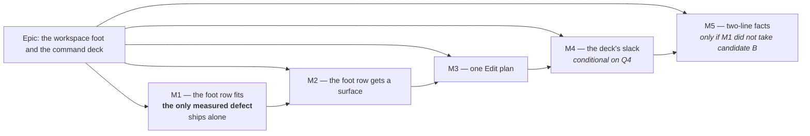

# Implementation Plan: The workspace foot and the command deck

- **Feature spec:** [`./spec.md`](./spec.md)
- **Measurement:** [`./m0-measurement.md`](./m0-measurement.md) — every number below traces to it
- **Status:** **SHIPPED, with three milestones differing from this plan.** See the reconciliation in [`spec.md`](./spec.md) and ADR-0115; this document records what was _planned_.
- **Owner:** unassigned

---

## Breakdown

Each milestone is **one revertible commit**. There is no `VITE_` flag: ADR-0088 D1 established that
a `VITE_` constant is inlined at build time and buys the operator no rollback, so the commit boundary
**is** the rollback contract.

### Epic

**The workspace foot and the command deck** — close the per-selection canvas loss ADR-0114 M1
created, give the foot of the workspace the same treatment as the top of it, remove one duplicated
command, and decide what the deck's measured slack is for. Roadmap theme: the plan workspace's
vertical budget (ADR-0090 → ADR-0114).

---

## Milestone 1 — The foot row fits with one activity selected

**Outcome:** at 1920 and 1646 in the default scheduling mode, selecting a single non-summary activity
costs the canvas **0 px**. At 1440 it costs less than today. This is the only measured defect in the
epic and it ships **alone, ahead of every arrangement decision below** — the ADR-0114 D1 pattern.

**Entry point:** no new control. Two existing controls on the object-action bar change:
`Clear visual start` (`data-toolbar-item="clear-visual-placement"`) becomes absent outside Visual
mode, and — subject to T2's measurement — `Zoom to selection`
(`data-toolbar-item="zoom-to-selection"`) becomes icon-only, or the plan's facts wrap. **Not dark:**
a planner sees the difference the first time they click a bar.

**Journey:** `apps/web/e2e-workspace-chrome/dock.spec.ts` — the existing "an armed tool and a
selection cost the canvas no height" test, whose ADR-0114 bound (`≤ 120`, `dock.spec.ts:143-148`)
tightens back to an **equality** at the widths this milestone claims and stays a bound at 1440. Plus
the existing object-action sweep, `e2e-workspace-fit/command-surface.spec.ts:375`.

> ### 🔻 Falsification condition — written before the work
>
> **If measurement at 1646, in the default scheduling mode, with one non-summary activity selected,
> shows the foot row above 41 px after T1 and T3, this milestone is withdrawn** — reverted, not
> tuned — and re-planned from the measurement. The next candidates, in cost order, are already known:
> the two-line facts if T2 chose the label instead, and then ADR-0114 D8's `Edit ▾` fold, which the
> product owner declined on 2026-08-26 and which would therefore go back to them rather than being
> taken here.
>
> This condition exists because **arithmetic is necessary and not sufficient on this surface**: a
> flex row breaks between _items_, not by total width, and ADR-0114 records freeing 164 px and buying
> **zero** height. Three milestones in this repository have already been withdrawn by a condition of
> this shape (ADR-0091 D4, ADR-0092 M5, ADR-0110 D3).

---

#### Feature 1.1 — `Clear visual start` is absent where it can never open

> **Description:** the object bar's `clear-visual-placement` item gains an `isVisible` reading
> `schedulingMode === 'VISUAL'`. Inside Visual mode nothing changes: the three transient refusals
> (pen/role, Late-start overlay, no selection) still shade it with their reason.
> **Complexity:** S
> **Dependencies:** none
> **Risks:** the product owner may expect the control to be discoverable in Early mode → §6 Q5 asks
> them before this is built. A reader loses a signpost to a capability → mitigated by the fact that
> the capability genuinely does not exist while the plan is in Early mode.
> **Testing requirements:** unit (both modes, all four refusals), and the two journeys above.

##### Task 1.1-T1 — `isVisible` on the mode, `clearVisualPlacementGate` untouched (≈ one PR)

- **Description:** add `isVisible: (ctx) => ctx.schedulingMode === 'VISUAL'` to the
  `clear-visual-placement` registration in `apps/web/src/features/plan-actions/selection-actions.tsx`
  (the item is at `:729-768`). Do **not** move the mode branch out of
  `clearVisualPlacementGate` (`features/plan-actions/conflict-remedy.ts:112-114`): that function was
  extracted precisely so two surfaces could not hold two copies of a four-condition ladder
  (ADR-0094 M4-T1), and the Gantt row menu reads it too.
- **Complexity:** S
- **Dependencies:** product-owner answer to spec §6 **Q5**
- **Risks:**
  - `schedulingMode` may not be on `SelectionActionContext` today → check before writing; if it is
    not, thread it from the same place `clearPlacement` is computed, never re-derived.
  - The `conflict-remedy` path: when `conflictKey === 'visualConflict'` this item **is** the remedy
    (ADR-0094 M4). A `visualConflict` cannot occur in Early mode (it is produced by the
    effective-Visual pass, ADR-0033), so the two rules cannot collide — **verify this rather than
    assume it**, by asserting in a unit case that `conflictKey === 'visualConflict'` with
    `schedulingMode === 'EARLY'` still renders a remedy, or that the state is unreachable. An
    unreachable-but-unasserted state is how ADR-0094's `barAction` twin defect arrived.
- **Testing:**
  - `selection-actions.clear-placement.test.tsx` — new cases: absent in `EARLY`; present and shaded
    with each of the three Visual-mode reasons; **the accessible description is unchanged** in
    Visual mode (this must not become a silent re-wording).
  - `conflict-remedy.gate.test.ts` — unchanged, and that is the assertion: the gate's four branches
    still return the same verdicts. If this suite needs editing, the change went into the wrong place.
- **Development steps:**
  1. Read `SelectionActionContext` / `SelectionBarContext` and confirm where `schedulingMode` lives.
  2. Add the predicate; add the unit cases; run them **red first** against the current code.
  3. Confirm the Gantt row menu (`features/gantt/components/GanttRowMenu.tsx`) mirrors the bar's
     roster and decide explicitly whether it follows — record the decision either way.
  4. Changeset (patch, `web`).

##### Task 1.1-T2 — Measure the two candidates for the remaining 107.8 px (**a measurement task, no product code**)

- **Description:** M0 §0's arithmetic: omitting the item recovers **154 px** of a **261.8 px**
  shortfall at 1646, leaving **107.8 px**. Two candidates cover it (spec §6 Q1). Measure both in a
  real Chromium at 1920 / 1646 / 1440 and take the one that reaches 41 px at 1646 **and costs least
  elsewhere**. Write the reading up before choosing.
- **Complexity:** M
- **Dependencies:** T1 landed (so the candidates are measured against the nine-item bar, not the ten)
- **Risks:**
  - **The instrument.** M0 records five ways its own probes lied, four of which produced plausible
    numbers about the wrong element. Reuse `m0-whatif.spec.ts`'s shape and copy its two hard-won
    fixes: cap the **real** facts row (`flex min-h-6 shrink-0 items-center gap-4 px-3 text-xs`), not
    an outer wrapper; and **reload between viewports**, because a selection survived `Escape` and
    made every "at rest" reading secretly a selected one.
  - A reading that reports success because something collapsed → assert the facts' **box**, never
    their text. ADR-0110 D4 records a container query reducing this element to 24 × 48 px with every
    gate green, _including_ the dock's 0 px equality, because the broken facts took no width.
- **Testing:** none — this task adds a harness under `apps/web/measure-toolbar/`, which is not a CI
  suite. Its output is a markdown section appended to `m0-measurement.md` or a sibling
  `m1-candidates.md`.
- **Development steps:**
  1. New harness `apps/web/measure-toolbar/m1-foot-candidates.spec.ts`.
  2. **Candidate B first** (`gap-x-4 gap-y-0` + a wrapping facts row): record the facts' box, the
     foot row's height, and the canvas height, at rest and with one activity selected, at all three
     widths. The hypothesis is that two 16 px lines with a zero row-gap sit under the 40 px collapse
     button that sets the row's floor, so the row stays 41 px.
  3. **Candidate A** (`showLabel: 'never'` on `zoom-to-selection`): same readings.
  4. Record the margin for each. M0's arithmetic predicts **8.2 px** for A at 1646 and roughly
     **122 px** for B — _B's figure is an estimate, because M0 measured wrapped heights and not the
     wrapped facts' width._ If the two disagree with the prediction, the measurement wins and the
     prediction is corrected in place.
  5. Write the section; state which candidate is chosen and why, including what it costs at 1920.

##### Task 1.1-T3 — Apply the chosen candidate

- **Description:** implement whichever of A or B T2 selected.
- **Complexity:** S (A) / M (B)
- **Dependencies:** T2
- **Risks:**
  - **If A:** `Zoom to selection` loses its visible label at **every** width, including 1920 where
    the row already fits. Its accessible name is unchanged (`aria-label` + `title`), so this is
    **not** the relabel ADR-0114 D7 declined on WCAG 2.4.6 grounds — say so at the code, because the
    next reader will find D7 and think the decision was reversed.
    Do **not** reach for `showLabel: { atLeast: … }`: `Toolbar.tsx:232` resolves the policy as
    `!== 'never'`, so an object form labels unconditionally, and `toolbar-band.tsx:40-42` records
    that this bar is deliberately outside any band. A conditional label here would read as
    conditional and not be one.
  - **If B:** removing `shrink-0` from the facts beside a `flex-1 basis-0%` dock squeezes them to
    min-content unless they are given an explicit basis — ADR-0114's defect with the polarity
    reversed. Give the basis explicitly and assert the box.
  - **If B:** the facts render in **two hosts** (ADR-0110 D1) — the foot row and the shell status
    bar. A wrap rule that is right in the foot row may be wrong in a full-width status bar. Check
    both, including below `md` where `hostsPlanSlots` is `false`.
- **Testing:**
  - **If A:** `selection-actions.test.tsx` — the item renders with no visible text and an unchanged
    accessible name; the sweep at `command-surface.spec.ts:375` still finds it reachable and ≥ 24 px.
  - **If B:** `plan-facts.tsx`'s suites (`plan-status-bar.test.tsx` is the before/after oracle for
    that component and should pass **unedited** for everything except the wrap itself); a new box
    assertion in the journey.
- **Development steps:** implement → run the T2 harness again against the shipped code (not the
  prototype) → record the confirmed numbers → changeset.

---

#### Feature 1.2 — The gates, verified against the defect they name

> **Description:** tighten the dock journey's bound to an equality where the milestone claims one,
> and prove the object bar is still fully reachable.
> **Complexity:** S
> **Dependencies:** 1.1-T3
> **Risks:** a gate that passes for the wrong reason. ADR-0110 D5 is the rule: **a gate is finished
> when it has been made to fail by the defect it was written for**, not when it passes.
> **Testing requirements:** see below — both assertions verified red first.

##### Task 1.2-T1 — The dock bound becomes an equality at 1920 and 1646

- **Description:** `dock.spec.ts:143-148` currently asserts `idle - withSelection <= 120`, with a
  docblock explaining that ADR-0092's equality became a bound because the bar could not wrap and the
  equality _"was being paid for by hiding controls"_. Restore the equality at the widths M1 claims;
  keep the bound at 1440 with the measured number in the message.
- **Complexity:** S
- **Dependencies:** 1.1-T3
- **Risks:**
  - The journey's current viewport must be established before editing — **read
    `playwright.workspace-chrome.config.ts`, do not assume**. If it runs at one width, the test needs
    an explicit `setViewportSize` per case rather than a bound that silently describes a width nobody
    chose.
  - A summary selection or a stale schedule legitimately adds controls (ADR-0114's own caveat), so
    the equality must be asserted on a **non-summary** activity with a **current** schedule, and the
    test must say so in its name.
- **Testing:** verified red by reverting 1.1-T1 locally and confirming the equality fails at 1646.
- **Development steps:** read the config → add explicit viewports → assert equality at 1920/1646 and
  a measured bound at 1440 → revert-and-fail → restore → green.

##### Task 1.2-T2 — Documentation corrections that land with M1

- **Description:** three corrections, none of which should wait for the ADR.
- **Complexity:** S
- **Dependencies:** none
- **Risks:** none
- **Testing:** `pnpm check:doc-links`, `pnpm check:adr-coverage`, `pnpm check:counts`
- **Development steps:**
  1. **Correct ADR-0114 D2's stated reason** — not by editing that ADR (they are immutable once
     accepted) but by recording the correction in `docs/DECISIONS.md` and in the code comment that
     repeats it (`activity-bottom-panel.tsx:176-179`, _"would have made the facts slide sideways"_).
     M0 §2 measured that neither region slides: the dock is `flex-1 basis-0%`, the facts `shrink-0`.
  2. **File the missing `docs/TECH_DEBT.md` #202.** ADR-0114's gate pass cites it for six
     non-blocking findings and the row does not exist — `rg -n '^## #20[0-9]' docs/TECH_DEBT.md`
     returns 200 and 201 only. Recover the six findings from that ADR and file them. Noticing this
     and stepping over it leaves the register exactly as wrong as not noticing (ADR-0071).
  3. **File a row for `PlanActionsMenu`**, which has no caller in `apps/web/src` while
     `plan-chrome-dialogs.tsx:66` describes it as a live surface. Do not delete it in M1 — it is
     M3's subject and deleting it here would make M3's `Edit plan` count ambiguous.

---

## Milestone 2 — The foot row gets a surface

**Outcome:** the foot of the workspace reads as part of the same command surface as the chrome band
— answering the product owner's first observation, and (see spec §5.4) most of what their fourth one
was actually asking for.

**Entry point:** no control. The `PlanActivitiesFootRow` region itself changes appearance in every
plan, in both panel states. **Not dark.**

**Journey:** an added assertion in `dock.spec.ts` that the row is 41 px at rest at all three widths,
plus a new shot in `scripts/shoot.mjs` if the workspace foot is not already framed by one — **check
the shot list rather than assume**; ADR-0101 records a four-scrollbar panel reaching a user because
the shot list covered the workspace and stopped at the route.

> ### 🔻 Falsification condition — written before the work
>
> **If no candidate treatment holds the foot row at 41 px at rest at 1920, 1646 and 1440, this
> milestone is withdrawn** rather than paid for in canvas height. Height is the currency six
> consecutive epics on this surface have been spending; buying a nicer bottom edge with it would
> reverse them.
>
> The precedent is exact: ADR-0114 D6 measured **three** candidates for the object bar's card and
> found the deck's own geometry cost a line at 1920 and border-without-padding cost one at 1646.
> Only background and radius were free. Expect the same shape here.

---

#### Feature 2.1 — The treatment, chosen by measurement

> **Description:** give `PlanActivitiesFootRow` the `chrome` vocabulary at whatever geometry costs
> nothing.
> **Complexity:** M
> **Dependencies:** M1 (so the row's height is being measured in its fixed state, not its wrapping one)
> **Risks:** below — the contrast gate and the two-host rule.
> **Testing requirements:** `token-contrast.test.ts`, `surface-seams.structural.test.ts`, unit
> snapshot of the row's classes, the height assertion in the journey.

##### Task 2.1-T1 — Measure three candidates

- **Description:** extend `m1-foot-candidates.spec.ts` (or a sibling) to read the foot row's height
  and the canvas height at rest under each of:
  **A** background + radius + a 3 px `--primary` **top** rule (the band's own device, mirrored,
  replacing the existing 1 px border — net **+2 px**);
  **B** background + radius only;
  **C** background only.
- **Complexity:** S
- **Dependencies:** M1
- **Risks:** measuring the wrong box — the row is `activity-bottom-panel.tsx:199-231` and carries
  `data-activities-bar`. Locate by that attribute, **never by the word "Activities"**, which the
  status bar's activity-count fact also matches and which has broken a test three times (the
  attribute's own docblock says so).
- **Testing:** n/a (harness)
- **Development steps:** prototype each candidate → record → choose the cheapest that reads as a
  member of the band → write it up.

##### Task 2.1-T2 — Apply the treatment

- **Description:** implement the chosen candidate. Declare it **once**: if it is a card treatment,
  it belongs beside `toolbarCardVariants` in `components/ui/toolbar/toolbar-styles.ts` as a third
  `chrome` value, not as a literal on the row — the same argument that CVA's own docblock makes
  about being copied to a second consumer.
- **Complexity:** M
- **Dependencies:** 2.1-T1
- **Risks:**
  - **The scope rebind is the part to get right.** If the row becomes `[data-surface="chrome"]`,
    every descendant repaints — the facts (`text-muted-foreground`), the object bar's
    `bg-foreground/5` card, the `Recalculate` outline button, the pen's tone tint. ADR-0055 §1's rule
    is that a family is complete or it is a trap; `chrome` is complete, which is why it is reused.
    **Verify, do not assume,** that `--foreground` and `--muted-foreground` are in `REBOUND_NAMES` —
    `apps/web/src/styles/token-architecture.test.ts` computes that set by closure.
  - **A JS token read would not follow the rebind.** ADR-0102 found that an `@theme inline` alias
    declared at `:root` is substituted on the element that declares it, so a surface rebind cannot
    reach a `getComputedStyle` read of the alias — which is how the canvas painter never used its own
    scope. Nothing in the foot row reads tokens in JS today; **confirm that** before landing
    (`rg -n 'getComputedStyle' apps/web/src/components/layout/status apps/web/src/components/layout/workspace`).
  - Below `md`, `hostsPlanSlots` is `false` and the row's contents differ. Check that state.
- **Testing:**
  - `token-contrast.test.ts` — add any new pair the treatment creates. It must be added **before**
    the CSS, not after (ADR-0083's rule).
  - `surface-seams.structural.test.ts` — a `chrome` family token may only be reached through
    `<Surface>`; if the row uses one directly the seam test will say so, and that is the answer, not
    an obstacle.
  - No colour literal in `className`/`style` (the ADR-0055 lint rule).
- **Development steps:** contrast pairs first → the class → run the seam and architecture tests →
  screenshot at all three widths → journey height assertion → changeset.

##### Task 2.1-T3 — Answer the "always visible, greyed out" request in the docs, not in code

- **Description:** record, in the ADR and in `docs/DECISIONS.md`, that the request is **declined**
  with its measured price (M0 §4: 36 px at 1646 and 76 px at 1440 paid permanently) and its rule
  collision (ADR-0082's _"a surface whose every item would be shaded renders no trigger"_), and that
  the row **is** already always visible — what appears is the object bar inside it.
- **Complexity:** S
- **Dependencies:** 2.1-T2
- **Risks:** a declined request that is not written down comes back as work owed. ADR-0092 D6 makes
  the distinction explicit: a **withdrawal** is a requirement its own measurement disqualified; a
  **deferral** is work still owed. This is a withdrawal.
- **Testing:** `pnpm check:doc-links`

---

## Milestone 3 — One `Edit plan`, and `Summary ▾` stops restating the screen

**Outcome:** exactly one control in the plan workspace edits the plan, and the `Summary ▾` popover
names only facts the workspace is not already showing.

**Entry point:** the surviving `Edit plan` control — the header pencil
(`plan-workspace-toolbar.tsx:1307-1318`, accessible name `Edit plan`) unless the product owner
answers spec §6 **Q3** the other way. **Not dark.**

**Journey:** `apps/web/e2e-workspace-chrome/` — a new assertion that the plan workspace contains
**exactly one** control whose accessible name matches `/^Edit plan/`, **verified red against the
two-copy state first**. This is the gate ADR-0093's structural test structurally cannot provide,
because neither copy is a registry item.

_(No falsification condition: this milestone's value is not a width or height claim. The one width
figure in play — ~32–40 px of identity-row headroom — is an argument in Q3, not a promise made here.)_

---

#### Feature 3.1 — One `Edit plan`

> **Description:** remove one of the two copies, delete the third (dead) one, and gate the count.
> **Complexity:** S
> **Dependencies:** product-owner answer to spec §6 **Q3**
> **Risks:** discoverability — if the pencil survives, a sighted planner must recognise an icon.
> **Testing requirements:** unit + the journey count assertion.

##### Task 3.1-T1 — Remove the duplicate

- **Description:** per Q3. Default (recommended): remove the `Edit plan…` button from
  `features/tsld/toolbar/plan-summary-panel.tsx:49-58` and drop `onEdit` from its props; keep the
  header pencil. `use-tsld-toolbar-context.tsx:193-196`'s `editPlan` memo stays — it still feeds the
  surviving control — and its comment, which currently reads _"Shared by the Summary popover's
  shortcut and the header edit-pencil"_, is corrected in the same commit so the file does not
  describe a wiring it no longer has.
- **Complexity:** S
- **Dependencies:** Q3
- **Risks:** `plan-summary-panel.test.tsx` asserts the shortcut; those cases are **rewritten to
  assert its absence**, with the reason in the test name. A test bent to fit new code and a test
  recording a decision look identical in a diff — say which this is.
- **Testing:** `plan-summary-panel.test.tsx`, `tsld-toolbar.test.tsx:161-165` (the popover body still
  renders), the journey count.
- **Development steps:** decide per Q3 → remove → rewrite the affected cases → journey red first.

##### Task 3.1-T2 — Delete `PlanActionsMenu`

- **Description:** `components/layout/workspace/plan-actions-menu.tsx` has **no caller** in
  `apps/web/src` (`rg -n 'PlanActionsMenu' apps/web/src` returns its own definition and one docblock
  reference). It contains a third `Edit plan…`. Delete the component **with its tests**, and correct
  `plan-chrome-dialogs.tsx:66`, which describes it as a live surface.
- **Complexity:** S
- **Dependencies:** 3.1-T1 (so the surviving count is unambiguous)
- **Risks:**
  - It may be reachable through a route this grep does not see. **Check `routes/` and any
    `lazy`/dynamic import before deleting**, and say what was checked.
  - Deleting a symbol whose only remaining caller is its own test is ADR-0092 D3's rule
    (`wbsBandBarAnchor`) — go together or not at all.
- **Testing:** the suite that mounts it is deleted with it; `pnpm typecheck` is the oracle.
- **Development steps:** prove no caller → delete component + test → correct the docblock → run
  `scripts/e2e-sweep.sh` (its list is derived, ADR-0112) because a deleted component can strand a
  locator.

##### Task 3.1-T3 — The count gate

- **Description:** the journey assertion described above.
- **Complexity:** S
- **Dependencies:** 3.1-T1, 3.1-T2
- **Risks:** **a gate that passes for the wrong reason.** An assertion of "exactly one" passes
  equally if the capability disappears entirely — the ADR-0093 D3 finding, where a general test would
  have been green with _both_ copies gone and a reader could not tell "the duplicate is gone" from
  "the capability is gone". So this needs **two** assertions: exactly one control matches, **and**
  pressing it opens the plan form.
- **Testing:** verified red twice — once against the two-copy state (fails on count), once against a
  locally removed pencil (fails on the positive case).
- **Development steps:** write both → prove both red → green.

#### Feature 3.2 — `Summary ▾` names only what the screen does not

> **Description:** the popover's `<dl>` keeps `Status` and `Mode`; `Data date` goes, because it is
> already immediately below in `ScheduleSummaryStrip` **and** permanently on screen in the foot row.
> **Complexity:** S
> **Dependencies:** none
> **Risks:** `ScheduleSummaryStrip` is shared — **do not touch it.** The change is confined to
> `PlanSummaryPanel`'s own `<dl>`.
> **Testing requirements:** `plan-summary-panel.test.tsx`.

##### Task 3.2-T1 — Drop the duplicated `Data date` row

- **Description:** remove the `<dt>Data date</dt>` pair from `plan-summary-panel.tsx:34-36`.
  `Status` and `Mode` stay — they are the only facts in that popover the workspace does not already
  show (`plan-facts.tsx:147-170` carries Activities / Data date / Finish / critical count;
  `ScheduleSummaryStrip.tsx:108-112` carries Data date / Project finish / Activities / Critical /
  Near-critical).
- **Complexity:** S
- **Dependencies:** none
- **Risks:** the `dataDate` prop becomes unused → remove it from the component's props and from the
  call site (`use-tsld-toolbar-context.tsx:200-206`) in the same commit, or a dead prop survives as
  a claim that the panel shows something it does not.
- **Testing:** `plan-summary-panel.test.tsx` — assert `Data date` appears **once** in the open
  popover, not zero times (the strip still shows it). Verified red against today's two.
- **Development steps:** remove → prune the prop → rewrite the case → changeset.

---

## Milestone 4 — The deck's slack

**Outcome:** one or two lens toggles a planner reaches for constantly move from `View ▾` onto the
command deck, using the mechanism ADR-0092 D5 already built. **Dropped entirely if the product owner
answers spec §6 Q4 with "leave the slack empty"**, which is a legitimate answer.

**Entry point:** the promoted toggle(s) on the command deck, as buttons with `aria-pressed` — e.g.
`Critical path`.

**Journey:** `apps/web/e2e-workspace-fit/command-surface.spec.ts` — the promoted control is present
on the deck, is a pointer target ≥ 24 px, and the deck's line count is unchanged at all three widths.

> ### 🔻 Falsification condition — written before the work
>
> **If promoting the chosen set adds a line to the deck at 1920, 1646 or 1440, or withdraws any
> existing command label, the promotion is reduced to the largest set that does neither — and if
> that set is empty, this milestone is withdrawn.**
>
> The arithmetic that makes this live: M0 §5 measured line-2 slack of **1,175.6 px at 1920** but only
> **169.5 px at 1440**, and the candidates cost 77.6–105.2 px each. So 1440 is the binding constraint
> and one promotion is close to its whole budget.

---

#### Feature 4.1 — Promote by record, never by restatement

> **Description:** add `promotion: { icon, order }` to the chosen `LENS_TOGGLES` record(s) in
> `features/tsld/toolbar/tsld-toolbar-items.tsx`. `promotedLensItems()` derives the registry item;
> `lensTogglesIn` already excludes anything promoted, so on-the-row-or-in-the-popover-never-both
> holds by construction rather than by anyone remembering to delete a row.
> **Complexity:** S
> **Dependencies:** product-owner answer to Q4
> **Risks:** two definitions of `checked`/`toggle`/`reason` drift invisibly — which is exactly what
> the derived mechanism prevents, and why nothing here should be hand-written.
> **Testing requirements:** the never-both assertion, mirroring `tsld-toolbar.test.tsx:167-182`.

##### Task 4.1-T1 — Measure first

- **Description:** `apps/web/measure-toolbar/m4-deck-promotion.spec.ts` — deck line count and per-row
  slack at 1920 / 1646 / 1440, before and after, with the candidate set.
- **Complexity:** S
- **Dependencies:** Q4
- **Risks:** M0 §5's own instrument notes — a menu probe that swept the whole document picked up the
  canvas's `role="option"` listbox, and a diagnostic located `View` by role and name and **folded the
  View card**, because each deck group caption is itself a disclosure button. Locate by
  `[data-toolbar-item]`, which is the standing rule after ADR-0091 M7.
- **Testing:** n/a (harness)
- **Development steps:** measure → record → proceed or reduce the set per the falsification condition.

##### Task 4.1-T2 — Add the promotion

- **Description:** the two-field addition, plus the icon (product-owner-chosen, per ADR-0091 D5's
  precedent that icons for promoted controls are their choice and are registered).
- **Complexity:** S
- **Dependencies:** 4.1-T1
- **Risks:** an item promoted without an icon renders a blank button —
  `docs/TECH_DEBT.md` #126 records four of those and `e2e-toolbar-fit` S5 catching the WCAG 2.5.8
  failure the same hour. An icon is not optional.
- **Testing:** never-both unit case; the deck journey; the target-size sweep at
  `command-surface.spec.ts:216`.
- **Development steps:** record → tests → measure the shipped code again → changeset.

##### Task 4.1-T3 — Record the correction to M0 §5's inference

- **Description:** M0 concluded that ADR-0091 forbids promoting a switch. ADR-0092 D5 did precisely
  that, at the product owner's request, and shipped. The distinction — ADR-0091's subject is a
  command surface with **no vocabulary** for a mode, and a derived pressed-state toggle **is** that
  vocabulary — goes into the ADR and into `m0-measurement.md` as an in-place correction, not a
  deletion.
- **Complexity:** S
- **Dependencies:** none
- **Risks:** none
- **Testing:** `pnpm check:doc-links`

---

## Milestone 5 — Two-line facts (conditional)

**Ships only if** M1-T2 chose candidate A (the icon-only label) **and** the product owner wants 1440
improved as well. If M1 took candidate B, this milestone has already happened and is deleted from
the plan rather than left as a stub.

**Outcome:** at 1440 the foot row goes from two lines to one with an activity selected.

**Entry point:** no control; the plan's facts render on two lines. **Not dark.**

**Journey:** the box assertion described in M1-T3's risks — the facts' **rectangle**, not their text.

> ### 🔻 Falsification condition — written before the work
>
> **If a two-line facts row with a zero row-gap measures above 41 px at rest at any of 1920, 1646 or
> 1440, this milestone is withdrawn.** M0 §3 measured today's `gap-4` version at **64 px**, costing
> 24 px at rest at every width; the entire case for M5 is the hypothesis that `gap-y-0` puts two
> 16 px lines under the 40 px collapse-button floor. If it does not, the request is answered "no,
> measured twice" and closed.

---

## Sequencing & slices

| Order | Milestone                  | Ships alone?                                                                                   | Blocked on                                              |
| ----- | -------------------------- | ---------------------------------------------------------------------------------------------- | ------------------------------------------------------- |
| 1     | **M1** — the foot row fits | **Yes — and it must.** It is the only measured defect and every other milestone is arrangement | Q1, Q5                                                  |
| 2     | **M2** — the surface       | Yes                                                                                            | M1 (so the row's height is measured in a settled state) |
| 3     | **M3** — one `Edit plan`   | Yes                                                                                            | Q3                                                      |
| 4     | **M4** — the deck's slack  | Yes                                                                                            | Q4                                                      |
| 5     | **M5** — two-line facts    | Yes                                                                                            | M1's outcome                                            |

**`main` stays releasable after each.** Every milestone is frontend-only, is one commit, and touches
no shared primitive's keyboard or focus contract — with one conditional exception: if M2-T2 adds a
variant to `toolbarCardVariants`, **component-reviewer** runs on it before it ships (CLAUDE.md
§19.13's second clause). No milestone changes a `*Field`, `Menu`, `Combobox`, `Deck`, `Toolbar` or
`Dialog` key handling or focus model, so **accessibility-reviewer**'s §19.13 pre-release trigger is
not fired by construction — _stated as a claim to check at the diff, not as a promise._

**Specialist gate pass.** Run at the end, over the combined diff, per the house pattern that has
found something a human read missed in eight consecutive epics:

| Agent                      | Why here                                                                                                                                                                    |
| -------------------------- | --------------------------------------------------------------------------------------------------------------------------------------------------------------------------- |
| **ux-reviewer**            | Q2's reading-order call; whether the surface treatment reads as one system; whether omitting `Clear visual start` strands a Visual-mode planner                             |
| **accessibility-reviewer** | the icon-only `Zoom to selection` (name preserved?); the omitted control (nothing announced?); the new surface's contrast in every state; WCAG 2.5.8 on any promoted toggle |
| **component-reviewer**     | `toolbarCardVariants`' third value; the `isVisible`-vs-`isEnabled` split; whether the promotion mechanism is used as ADR-0092 D5 intended                                   |
| **ui-architect**           | the scope reuse-vs-new-family call; whether the `Edit plan` gate belongs where it is put                                                                                    |
| **performance-reviewer**   | cheap here, but the facts' wrap (if taken) touches a row that re-renders on every recalculation                                                                             |

**database-architect is not engaged, and that is a reading rather than a judgement of size**
(CLAUDE.md §19.3): there is no model, column, index, constraint or data migration in this epic.

**security-reviewer and backend-performance-reviewer are not engaged**: no endpoint, no DTO, no
query, no gate re-derived.

---

## Definition of Done (per task)

Each task's PR satisfies the Feature Completion Criteria in [`docs/PROCESS.md`](../../PROCESS.md).
Two items in that list are the ones this epic will be tempted to skip:

- **`pnpm prepush` — the one command, not its parts.** `scripts/prepush.sh` derives ten checks;
  running `lint && typecheck && test` by hand is how `check:adr-coverage` was missed on 2026-08-22,
  in a change whose whole subject was filing an ADR.
- **`scripts/e2e-local.sh web:<suite>` for every journey touched**, and after any label or layout
  change, **the whole sweep** — `scripts/e2e-sweep.sh`, whose list is derived rather than
  remembered (ADR-0112). Three journeys broke across ADR-0091 M7 and each was found by CI rather
  than locally, because the fix was scoped to the suite CI happened to name.

---

## Risks & assumptions (rollup)

| Risk / assumption                                                                                                                                                                                                                                    | Likelihood | Impact  | Mitigation                                                                                                                                                                                                                    |
| ---------------------------------------------------------------------------------------------------------------------------------------------------------------------------------------------------------------------------------------------------- | ---------- | ------- | ----------------------------------------------------------------------------------------------------------------------------------------------------------------------------------------------------------------------------- |
| **M1's arithmetic holds and the row still wraps** — 270 px against a 261.8 px shortfall is an 8.2 px margin, and a flex row breaks between items, not by total width                                                                                 | med        | high    | The falsification condition. Candidate B's ~122 px margin is preferred for exactly this reason. ADR-0114 records freeing 164 px and buying zero height                                                                        |
| **The measured state was Early mode — inferred, not stated.** M0 §0 lists `clear-visual-placement` as _disabled_ while every pen-gated sibling is _enabled_, so the pen was held and the refusal must be the mode branch (or the Late-start overlay) | med        | med     | M1-T2's harness reads the control's linked reason text and records it. If it turns out to be the overlay rather than the mode, Feature 1.1's premise changes and the milestone is re-planned before T3                        |
| **The wrapped facts' width is an estimate.** M0 measured wrapped _heights_; §6 Q1's ~122 px margin for candidate B is arithmetic on the un-wrapped 481.4 px                                                                                          | high       | med     | T2 measures the box directly and the estimate is corrected in place                                                                                                                                                           |
| The surface treatment costs height                                                                                                                                                                                                                   | med        | med     | Three candidates, cheapest first; withdrawal condition                                                                                                                                                                        |
| A `chrome` rebind reaches a token that is not in `REBOUND_NAMES`                                                                                                                                                                                     | low        | med     | `token-architecture.test.ts` computes that set by closure and asserts it; contrast pairs land before the CSS                                                                                                                  |
| Removing the popover's `Edit plan…` leaves an icon-only route                                                                                                                                                                                        | med        | low–med | Q3 puts it to the product owner with the ADR-0112 headroom figure for the alternative                                                                                                                                         |
| A gate passes for the wrong reason                                                                                                                                                                                                                   | med        | high    | ADR-0110 D5 applied to every new assertion: verified red against the specific defect first. M3's count gate carries a **second, positive** assertion because "exactly one" is green when the capability is gone (ADR-0093 D3) |
| A change is invisible to jsdom                                                                                                                                                                                                                       | med        | high    | Below-`md` and layout-dependent behaviour goes to a journey with an explicit `setViewportSize`. ADR-0114's largest gate-pass defect was exactly this, and its docblock predicted it forty lines above the code that broke     |
| A probe measures the wrong element                                                                                                                                                                                                                   | high       | med     | M0 records five such failures in this epic's own instruments. Locate by `data-activities-bar` / `data-toolbar-item`, dump siblings beside every answer, reload between viewports, and assert boxes rather than text           |
| ADR-0115's number is taken before filing                                                                                                                                                                                                             | low        | low     | Re-check at filing; ADR-0071 and ADR-0079 both record this happening                                                                                                                                                          |
