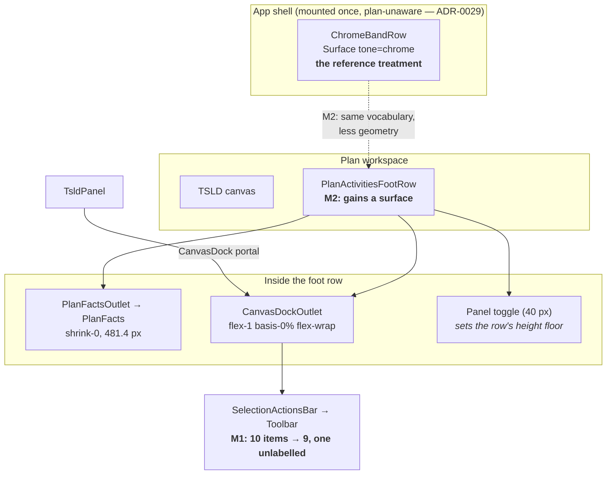
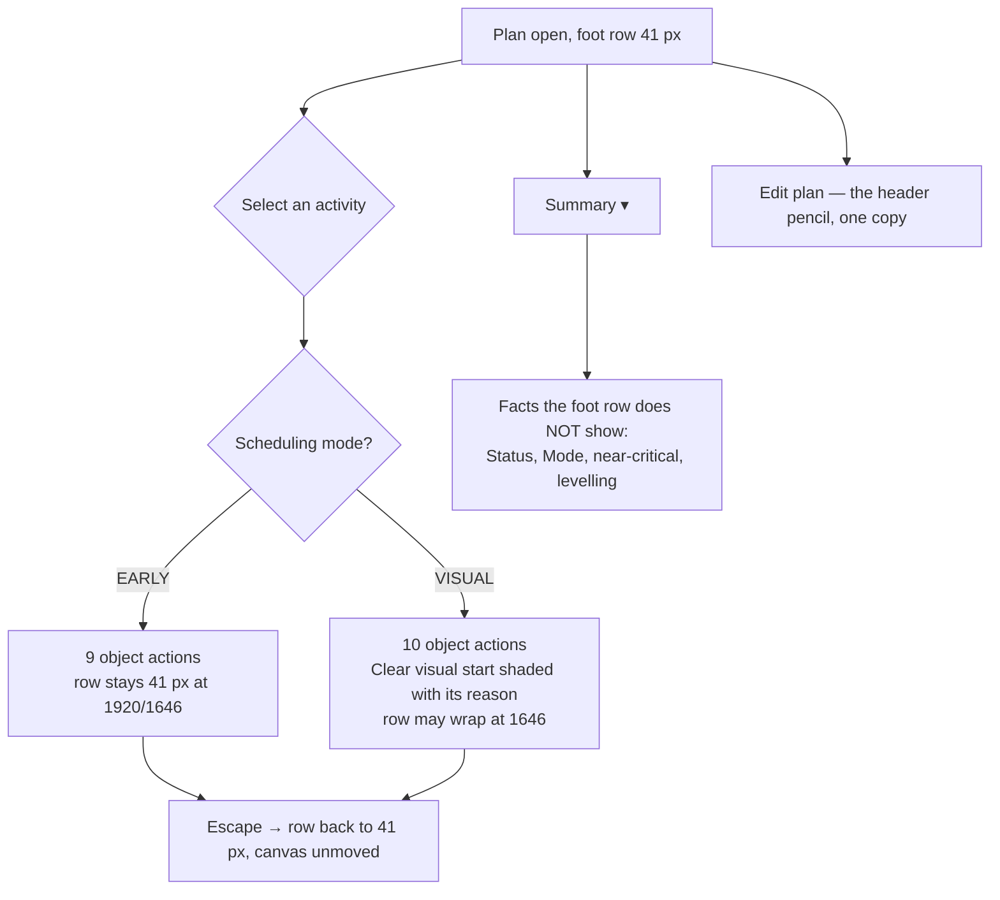

# Feature Spec: The workspace foot and the command deck

- **Status:** **SUPERSEDED IN PART BY WHAT SHIPPED — read the reconciliation at the foot of this
  file before relying on any decision here.** Filed as ADR-0115 on 2026-08-27.
- **Author:** feature-analyst
- **Date:** 2026-08-27
- **Measurement pass:** [`m0-measurement.md`](./m0-measurement.md) — the source of truth for every
  number in this document
- **Related ADRs:** ADR-0031, ADR-0033, ADR-0055, ADR-0064, ADR-0082, ADR-0088, ADR-0091, ADR-0092,
  ADR-0093, ADR-0094, ADR-0110, ADR-0112, ADR-0113, ADR-0114
- **Filed as:** [ADR-0115 — A bound governs what it encloses, and the wrap was measured from one
  state](../../adr/0115-a-bound-governs-what-it-encloses.md). The number was still free at filing;
  the title changed because the decision did.

---

## 0. How to read this document

Everything numeric below comes from [`m0-measurement.md`](./m0-measurement.md), which was taken
today in a real Chromium at 1920 / 1646 / 1440 against a real API with the pen enforced. **No figure
in this spec is re-derived from a different method**, and where I do arithmetic _on_ an M0 number I
say so and give the sum.

Claims that come from **reading code rather than from M0** are marked **[read]** with the file and
symbol. Claims that are neither measured nor read — hypotheses — are marked **[hypothesis]** and
carry the command that would settle them. That split exists because ADR-0076 records three distinct
ways a confident sentence in a document like this one has been wrong.

**One M0 inference is contradicted below** (§5.4, `View ▾` promotion). Its _numbers_ are accepted in
full; one _conclusion drawn from them_ is not, and the counter-evidence is an ADR that did the thing
the conclusion says is forbidden.

---

## 1. Business understanding

### Problem

The product owner sent screenshots of the plan workspace and five layout observations. M0 measured
the surface before anything was designed, and found a sixth thing nobody asked about which outranks
all five:

> **Selecting a single activity makes the foot row wrap, and the diagram pays for it.**
> The canvas loses **36 px at 1646** — the product owner's own screen — and **76 px at 1440**.
> (M0 §0.)

That is the only measured **defect** here. The other five are questions about arrangement, and three
of them turn out to have answers the product owner will not like. This spec answers all six, states
plainly where the answer is "no" and why, and puts three genuinely two-sided calls back to them
rather than deciding on their behalf.

The wrap is not a surprise arriving from nowhere. It is **ADR-0114 M1's own consequence, followed
one step further than that ADR followed it.** M1 changed the object-action bar from `shrink-0` to
`min-w-0` because a `shrink-0` item never asks its line to break, so four controls were clipped and
pointer-unreachable. That fix was right, and it traded a hidden-controls defect for a
shrinking-diagram one. ADR-0114 records losing ADR-0092's 0 px dock guarantee **in the abstract**;
it says the equality becomes "a bound, generous on purpose". **Nobody measured what the bound costs
on the product owner's screen** until M0 did.

Three of the five observations are, underneath, one thing: the foot of the workspace does not read
as part of the same product as the top of it. M0 §1 measured that and it is stronger than a colour
difference — **the foot row has no surface at all**: transparent background, one 1 px grey border,
no radius, against a `chrome`-scope navy card with a 3 px amber rule at the top of the screen.

### Users

| Role                             | What they need here                                                                                                                                                                                  |
| -------------------------------- | ---------------------------------------------------------------------------------------------------------------------------------------------------------------------------------------------------- |
| **Planner** (org role `PLANNER`) | The diagram is their working surface. Every pixel of chrome is a pixel of programme they cannot see. They select activities constantly, so a per-selection cost is paid hundreds of times a session. |
| **Org Admin**                    | As Planner, plus the plan-level commands (`Edit plan`) this spec touches.                                                                                                                            |
| **Contributor**                  | Selects activities to report progress. Sees the same foot row; several of its controls are shaded for them, so the omit-vs-shade rule below decides what they meet.                                  |
| **Viewer / External Guest**      | Read-only. The object bar is mostly shaded or absent for them; nothing in this spec adds a capability they gain or lose.                                                                             |

Nothing here is role-gated differently from today. Every gate this spec touches
(`clearVisualPlacementGate`, `canWrite`, `canEditSchedule`) is read, never re-derived.

### Primary use cases

1. A planner selects an activity on the canvas and acts on it, **without the diagram shrinking**.
2. A planner reads the foot of the workspace and recognises it as the same command surface as the
   top of it.
3. A planner reaches `Edit plan` from one place rather than two, and `Summary ▾` tells them things
   the screen is not already telling them.
4. A planner on a 24" monitor gets some use out of the 1,176 px of empty command deck M0 measured
   there — **without** the deck filling up with switches.

### User journeys

Happy path, and the one this epic exists for:

1. Planner opens a plan at 1646. Chrome above the canvas is as ADR-0112 left it; the foot row is
   41 px carrying the plan's facts and the panel toggle.
2. They click a bar. The object-action bar appears in the dock **on the same line**. The canvas does
   not move.
3. They press `Escape`. The bar goes. The canvas does not move.

Today, steps 2 and 3 each move the canvas by 36 px at 1646 and 76 px at 1440 (M0 §0).

### Expected outcomes

- Selecting an activity costs the canvas **0 px at 1920 and 1646**, and less than it does today at 1440. (1440 is **not** claimed closed — see §2 AC-1.3.)
- The foot row reads as a member of the same command surface as the chrome band.
- One `Edit plan` control in the plan workspace instead of two.
- The deck's slack is used for something ADR-0091 permits, or deliberately left empty.

### Success criteria

| #   | Criterion                                                                                                      | How it is measured                                                                                                                            |
| --- | -------------------------------------------------------------------------------------------------------------- | --------------------------------------------------------------------------------------------------------------------------------------------- |
| S1  | Foot row is **41 px** with one non-summary activity selected, at 1920 and 1646, in the default scheduling mode | `apps/web/measure-toolbar/m1-foot-candidates.spec.ts`, and asserted in `e2e-workspace-chrome/dock.spec.ts` as an **equality** at those widths |
| S2  | Foot row is **41 px at rest** at 1920 / 1646 / 1440 after the surface treatment                                | same harness, M2 run                                                                                                                          |
| S3  | Exactly **one** control in the plan workspace has an accessible name matching `/^Edit plan/`                   | journey assertion, verified red against today's two                                                                                           |
| S4  | The deck does not gain a line at any measured width after M4                                                   | `m4-deck-promotion.spec.ts`                                                                                                                   |
| S5  | No object action a pointer can see is unreachable                                                              | the existing sweep, `e2e-workspace-fit/command-surface.spec.ts:375`                                                                           |

### Open questions

The three that change design or scope are in **§6 — Questions for the product owner**. Everything
else has a stated default below and proceeds.

---

## 2. Functional requirements

### US-1 — Selecting an activity must not shrink the diagram

> As a **Planner**, I want to select an activity without the programme moving, so that I do not lose
> a row of my diagram every time I touch a bar.

**Acceptance criteria**

- **AC-1.1** — Given a plan in the default scheduling mode at **1646**, when I select one
  non-summary activity, then the foot row stays at **41 px** and the canvas height is **unchanged**.
- **AC-1.2** — Same at **1920**.
- **AC-1.3** — At **1440** the row is permitted to reach two lines. Measured arithmetic on M0's
  figures: after the changes in §4 the bar needs ~767 px against a 569.6 px container, so it will
  still wrap. **1440 is explicitly not claimed fixed by this milestone**, and saying otherwise
  would be the kind of claim ADR-0076 Class 3 is about.
- **AC-1.4** — Every control on the object bar remains reachable by pointer and by keyboard at every
  measured width (the ADR-0114 D1 property must not be traded back).
- **AC-1.5** — In **Visual** scheduling mode the bar keeps `Clear visual start`, and is permitted to
  wrap at 1646. Stated rather than hidden: the fix below is for the default mode.

### US-2 — A control that can never open in this plan is not on the bar

> As a **Planner** working in Early mode, I do not want a permanently dead 146 px control on every
> selection.

**Acceptance criteria**

- **AC-2.1** — Given `schedulingMode === 'EARLY'`, when I select an activity, then
  `clear-visual-placement` is **absent** from the object bar.
- **AC-2.2** — Given `schedulingMode === 'VISUAL'` and any of the three remaining refusals (no pen /
  role, Late-start overlay on, nothing selected), then the control is **present and shaded with its
  reason**, focusable, `aria-disabled` — unchanged from today (ADR-0082 §2).
- **AC-2.3** — `clearVisualPlacementGate` is **not modified**. The mode branch stays in it and stays
  the reason string for the Gantt row menu and any other consumer; the object bar's registry item
  gains an `isVisible` that reads the same input. Two independent copies of a four-condition ladder
  is what that function was extracted to prevent (ADR-0094 M4-T1).

### US-3 — The foot of the workspace looks like the top of it

> As a **Planner**, I want the bottom bar to read as part of the same command surface, so the screen
> has two ends rather than a designed top and an unstyled bottom.

**Acceptance criteria**

- **AC-3.1** — The foot row carries a surface treatment derived from the same vocabulary as the
  chrome band, declared once, never hand-copied.
- **AC-3.2** — The row is **41 px at rest** at 1920 / 1646 / 1440 after the treatment. If no
  candidate treatment holds that, see the falsification condition in the plan.
- **AC-3.3** — Every text/graphic pair the treatment creates is covered by
  `apps/web/src/styles/token-contrast.test.ts`, with no new colour literal in `className`/`style`
  (the ADR-0055 lint rule).
- **AC-3.4** — The object bar's own card (`toolbarCardVariants({ chrome: 'bare' })`) still reads
  correctly against the new ground.

### US-4 — One route to editing a plan

> As a **Planner**, I want one `Edit plan` control, so that I am not choosing between two identical
> ones.

**Acceptance criteria**

- **AC-4.1** — Exactly one control in the plan workspace has an accessible name beginning
  `Edit plan`.
- **AC-4.2** — Its permission gate is unchanged (`canWrite`), and it calls the same `editPlan`
  callback (`use-tsld-toolbar-context.tsx:193-196`).
- **AC-4.3** — `Summary ▾` names only facts the workspace is not already showing.

### US-5 — The deck's slack is used, or deliberately left

> As a **Planner on a 24" monitor**, I want the commands I use most to be on the surface rather than
> behind a press.

**Acceptance criteria**

- **AC-5.1** — Any promoted control is **derived** from its existing record, never restated
  (`LensToggle.promotion`, `tsld-toolbar-items.tsx:225-235`).
- **AC-5.2** — A promoted control appears on the deck **or** in `View ▾`, never both — held by
  `lensTogglesIn` and pinned by a test (the ADR-0092 D5 precedent).
- **AC-5.3** — Promotion does not add a line to the deck at 1920, 1646 or 1440, and does not
  withdraw any existing label.

### Workflows

**Selecting an activity (the changed path)**

1. Planner clicks a bar, or focuses the canvas listbox and arrows to one.
2. `TsldPanel` builds a `SelectionBarContext` and renders `SelectionActionsBar` into `CanvasDock`.
3. `CanvasDock` portals it into `CanvasDockOutlet`, inside `PlanActivitiesFootRow`.
4. `Toolbar` resolves each item's `isVisible`/`isEnabled`/`disabledReason` against the context.
   — **changed:** `clear-visual-placement.isVisible` now consults `schedulingMode`.
   — **possibly changed:** `zoom-to-selection.showLabel`.
5. The outlet's `flex-wrap` decides whether the row is one line or two.

### Edge cases

| Case                                            | Expected                                                                                                                                                                                                                                                                                                                                          |
| ----------------------------------------------- | ------------------------------------------------------------------------------------------------------------------------------------------------------------------------------------------------------------------------------------------------------------------------------------------------------------------------------------------------- |
| **Summary selected**                            | The bar gains `Dissolve` and `Duplicate band` and may wrap at 1646. ADR-0114 already records this: its own one-line claim is "at 1920, in the common state". Not regressed, not claimed fixed.                                                                                                                                                    |
| **Plural selection**                            | `BulkSelectionBar` replaces the singular bar (ADR-0080 / ADR-0092 M6). Untouched.                                                                                                                                                                                                                                                                 |
| **Conflict banner co-resident**                 | ADR-0114 D5's precedence stands: the conflict banner outranks the mode band. Untouched.                                                                                                                                                                                                                                                           |
| **Below `md`**                                  | `hostsPlanSlots` is `false`; the facts and the dock fall back to rendering where they did before ADR-0092. **Any change to `PlanActivitiesFootRow` must be checked in this state** — it is where ADR-0114's largest gate-pass defect lived, and jsdom cannot see it (`useMediaQuery` defaults wide; `display:none` means nothing without layout). |
| **Visual mode, activity with no `visualStart`** | Out of scope. `clearVisualPlacementGate` does not consult it today, and adding a fifth condition is a behaviour change this spec does not make.                                                                                                                                                                                                   |
| **Nothing selected**                            | The dock renders zero items and zero height (M0 §4). Unchanged — see §5.3.                                                                                                                                                                                                                                                                        |
| **Read-only viewer**                            | `editPlan` is `null`, so the popover button is already absent and the header pencil is already withheld. Removing one copy changes nothing for them.                                                                                                                                                                                              |

### Permissions

No permission changes. Every gate is read from the existing model:

| Control                   | Gate                                                                        | Source                                             |
| ------------------------- | --------------------------------------------------------------------------- | -------------------------------------------------- |
| `clear-visual-placement`  | `clearVisualPlacementGate` (mode → `canEditSchedule` → overlay → selection) | `features/plan-actions/conflict-remedy.ts:108-123` |
| `zoom-to-selection`       | none (`isVisible: ctx.canvas !== null`)                                     | `selection-actions.tsx:807`                        |
| `Edit plan` (both copies) | `canWrite`                                                                  | `use-tsld-toolbar-context.tsx:193-196`             |
| promoted lens toggles     | each record's own `enabled`/`reason`                                        | `tsld-toolbar-items.tsx` `LENS_TOGGLES`            |

### Validation rules

None — no user input is introduced.

### Error scenarios

None new. No network call, no DTO, no status code changes anywhere in this epic.

---

## 3. Technical analysis

| Area           | Impact     | Notes                                                                                                                                                                   |
| -------------- | ---------- | ----------------------------------------------------------------------------------------------------------------------------------------------------------------------- |
| Frontend       | **medium** | `selection-actions.tsx`, `activity-bottom-panel.tsx`, `plan-facts.tsx`, `plan-summary-panel.tsx`, `plan-workspace-toolbar.tsx`, `tsld-toolbar-items.tsx`, `globals.css` |
| Backend        | **none**   |                                                                                                                                                                         |
| Database       | **none**   | No migration runs; `database-architect` is not engaged because there is no schema to design, not because a change was judged too small (CLAUDE.md §19.3)                |
| API            | **none**   |                                                                                                                                                                         |
| Security       | **none**   | No gate is re-derived; each is read from its existing source                                                                                                            |
| Performance    | **low**    | One extra `isVisible` predicate per render of a ten-item bar. No new observer, no new timer, no per-frame work                                                          |
| Infrastructure | **none**   | No new Playwright config, no new CI step — every gate extends an existing suite                                                                                         |
| Observability  | **none**   |                                                                                                                                                                         |
| Testing        | **medium** | Unit changes in ~8 suites; two existing journeys extended; two new measurement harnesses                                                                                |

**The CPM engine is not imported and no migration runs**, so the ADR-0034 recalculation parity gate
is untouched by construction.

### Constraints that decided the design

**C1 — No new `VITE_` flag.** ADR-0088 D1 established that a `VITE_` constant is inlined at build
time, that `docker-publish.yml` passes none, and that `.dockerignore` strips `**/.env` from the
build context — so a flag has never been an operator rollback. The rollback contract is a **commit
boundary**: each milestone is one revertible commit.

**C2 — `showLabel`'s band form is inert on this surface. [read]** `Toolbar.tsx:232` resolves it as
`showLabel={(r.item.showLabel ?? 'auto') !== 'never'}`. An object such as `{ atLeast: 'comfortable' }`
is `!== 'never'`, so it labels unconditionally — the band form reads as conditional and is not.
Separately, `toolbar-band.tsx:40-42` says in as many words that _"the docked selection bar … is
deliberately not in a band"_, so it falls back to its own `clientWidth` — which, inside a
`flex-1 basis-0%` outlet, is leftover width and resolves `collapsed` at every viewport including 1920. **Both facts point the same way: on this bar the only available mechanism is
`showLabel: 'never'`, unconditionally.** A width-conditional label here would need a primitive
change plus a band provider, which is a shared-primitive keyboard/geometry change and would drag in
CLAUDE.md §19.13.

**C3 — `resolveLayoutMode` has no production caller.** `toolbar-band.tsx:16-17` records it
(`docs/TECH_DEBT.md` #193). Do not plan work that assumes a live layout ladder on this surface.

**C4 — The row's height floor is the 40 px collapse `Button`.** `PlanActivitiesFootRow` is
`flex min-h-9 … gap-2` (`activity-bottom-panel.tsx:206`); the toggle is a `size="icon"` `Button`.
This is why the row measures 41 px and why anything under 40 px of content is free.

**C5 — A flex row breaks between _items_, not by total width.** ADR-0114's most useful finding:
freeing 164 px bought **zero** height, because the slack landed inside a line that still could not
fit another control. Every arithmetic result in §4 is therefore **necessary and not sufficient**, and
each milestone's gate is a measured row height rather than a sum.

### Dependencies

- ADR-0114 must be landed and released (it is — `web-v0.108.2` is the version M0 measured).
- Nothing in this epic depends on anything unreleased.

---

## 4. Solution design

### Architecture overview

Nothing structural is added. Every change is a value, a predicate or a class inside components that
already exist.



### The §0 remedy — data flow of the one predicate that changes

```mermaid
sequenceDiagram
  participant P as Planner
  participant C as TsldCanvas
  participant T as TsldPanel
  participant G as clearVisualPlacementGate
  participant B as SelectionActionsBar (Toolbar)

  P->>C: click a bar
  C->>T: selection change
  T->>G: {schedulingMode, canEditSchedule, lateOverlayActive, hasSelection, scheduleRefusal}
  G-->>T: {enabled, reason}
  T->>B: SelectionBarContext {clearPlacement, schedulingMode, …}
  Note over B: isVisible: schedulingMode === 'VISUAL'<br/>(NEW — the same input, asked one step earlier)
  alt EARLY (the default)
    B-->>P: 9 items, one line at 1646
  else VISUAL
    B-->>P: 10 items; shaded + reason when the gate refuses
  end
```

### User flow



### Database changes

None.

### API changes

None.

### Component changes

| Component                                               | Change                                                                                        | Milestone |
| ------------------------------------------------------- | --------------------------------------------------------------------------------------------- | --------- |
| `features/plan-actions/selection-actions.tsx`           | `clear-visual-placement` gains `isVisible`; `zoom-to-selection` may gain `showLabel: 'never'` | M1        |
| `components/layout/workspace/activity-bottom-panel.tsx` | `PlanActivitiesFootRow` gains a surface treatment                                             | M2        |
| `components/layout/status/plan-facts.tsx`               | possibly a wrapping facts row (M1 candidate B / M5)                                           | M1 or M5  |
| `features/tsld/toolbar/plan-summary-panel.tsx`          | loses `Edit plan…` and the duplicated `Data date`                                             | M3        |
| `features/tsld/toolbar/tsld-toolbar-items.tsx`          | `promotion` added to one or two `LENS_TOGGLES` records                                        | M4        |
| `components/ui/toolbar/toolbar-styles.ts`               | possibly a third `chrome` variant for the foot row                                            | M2        |
| `styles/globals.css`                                    | possibly a `[data-surface]` rebind block                                                      | M2        |

**No shared primitive's keyboard or focus contract changes** in M1, M3 or M4. M2 may touch
`toolbarCardVariants`, which is a style and not a focus model — but if the M2 design ends up
adding a scope or a variant, `component-reviewer` runs on it (§19.13's second half).

---

## 5. The five observations, answered

### 5.1 — "Should the bottom toolbar be the same colour as the others to tie them in?"

**Yes, and it is a bigger gap than colour.** M0 §1: the foot row has **no surface** —
`rgba(0,0,0,0)` background, one 1 px grey top border, `0px` radius — against a `<Surface tone="chrome">`
navy card with a 10 px radius, a shadow and a 3 px amber bottom rule. They are not two shades of one
treatment; one is a card and the other is a hairline.

**Design.** Reuse the `chrome` vocabulary rather than invent a family. Three reasons:

1. ADR-0055 §1's rule is that a family is _complete (all rebound names) or it is a trap_ — the
   original defect was a three-token header stub whose secondary text fell through to the page grey.
   `chrome` is already complete and already in `token-contrast.test.ts`, so reuse costs nothing and a
   new family costs 31 declarations plus matrix rows.
2. ADR-0097 makes `REBOUND_NAMES` computed by closure and asserted, so a rebind that misses a token
   fails a gate rather than shipping a fall-through.
3. **[read]** `toolbarCardVariants`' base is `bg-foreground/5`, and `--foreground` is a rebound name,
   so the object bar's own card follows the scope with no component change. _This is read-derived;
   the check is the M2 screenshot plus `pnpm --filter @repo/web test token-contrast`._

**The geometry is the risk, and ADR-0114 D6 already measured this exact class of change.** Adding the
deck's own card geometry to the object bar cost the foot row a line at 1920, and border-without-
padding still cost one at 1646. So M2 measures **three candidates**, in this order, and takes the
first that keeps 41 px at rest:

| #   | candidate                                                                                       | expected cost                                              |
| --- | ----------------------------------------------------------------------------------------------- | ---------------------------------------------------------- |
| A   | background + radius + a 3 px `--primary` **top** rule (the band's device, mirrored), no padding | the rule replaces the existing 1 px border — net **+2 px** |
| B   | background + radius only                                                                        | 0                                                          |
| C   | background only                                                                                 | 0                                                          |

If none holds 41 px, M2 is withdrawn rather than paid for — see the plan's falsification condition.

### 5.2 — "Would the toolbar be better on the left and the activity summary on the right?"

**Measured, swapping them moves nothing** (M0 §2): the dock is `flex-1 basis-0%`, so its width is
independent of its content, and the facts are `shrink-0 basis:auto`, so their width is constant. At
either end, neither region would slide.

**And ADR-0114 D2's stated reason for the present order is false as implemented.** That decision says
putting the dock first _"would make the facts slide sideways every time a selection appeared — the
same juggle one axis over"_. On today's box model it would not. This is an ADR-0076 Class 3 claim in
a document three days old, and it is **corrected here rather than repeated** — the correction lands
as documentation with M1 whichever way the order goes.

So the order is a **free choice**, and it should be argued from reading order rather than from a
movement that does not occur. The real discriminator, which neither ADR-0114 nor M0 named:

> **The facts' width varies and the dock's does not.** **[read]** `FactList` renders the critical
> count only when `criticalCount > 0` (`plan-facts.tsx:165`); `ScheduleStateRegion` renders nothing
> in the `current` and `pending` states and a sentence-plus-button in the others (`:229-291`); and
> the pen's sentence paints in exactly two lock states (`LockView.messageVisible`, ADR-0114 gate
> pass). With **facts leading**, the object bar's leading edge therefore moves — by roughly 104 px
> when a plan's critical count drops to zero, and more when a recalculation goes stale. With **dock
> leading**, the object actions start at the row's fixed leading edge in every state, and the facts —
> which are read, not pointed at — do the moving instead.

That is a genuine argument for swapping and it is not decisive, because "always-present before
transient" is also a reasonable reading rule. **§6 Q2** puts it to the product owner with a
recommendation.

### 5.3 — "Could the activities be two lines, keeping the same height of the toolbar?"

**Not as the row is built today — and M0 §3 contradicts my prediction, not the product owner's.**
A wrapped facts row measures **64 px**, not 32, because the row is `gap-4`: 24 + 16 row-gap + 24.
That clears the 40 px button floor and grows the foot row by **24 px at every width at rest**, and
with a selection it is a loss at 1920, neutral at 1646 and a **40 px gain only at 1440**.

M0 states the condition exactly: _"Any design that wants them must first answer the 16 px row-gap."_

**[hypothesis]** `gap-x-4 gap-y-0` answers it. Two 16 px lines with a zero row gap is 32 px, which is
under C4's 40 px floor, so the row should stay 41 px. If that holds, two-line facts become **free at
rest at every width** and buy the dock roughly the width the facts give up — which M0 §3's 1440
column corroborates indirectly, since wrapping the facts there took the foot row from three lines to
two. _The check: `apps/web/measure-toolbar/m1-foot-candidates.spec.ts`, reading the facts' box and
the row's height at all three widths._

**This matters more than a nice-to-have, because it is a candidate remedy for §0.** See §5.6.

**Two design risks, both recorded because each has already shipped once:**

- Making the facts wrap means removing `shrink-0`, and a shrinkable region beside a `flex-1 basis-0%`
  dock will be squeezed to min-content unless it is given an explicit basis. That is ADR-0114's own
  defect with the polarity reversed.
- ADR-0110 D4 withdrew a container-query collapse on this exact element that reduced it to
  **24 × 48 px** with every fact present in the DOM and overflowing — and **every gate passed**,
  including the dock's 0 px equality, _because the broken facts were taking no width_. Any M5 gate
  must assert the facts' **box**, not their text.

### 5.4 — "Should the bottom toolbar always be visible, with buttons greyed out?"

**No — and part of the request is already satisfied, which is worth saying first.**

**The bottom row _is_ always visible.** **[read]** `PlanActivitiesFootRow` renders unconditionally in
both panel states and carries the plan's facts and the panel toggle
(`activity-bottom-panel.tsx:184-232`). What appears and disappears is the **object-action bar inside
it**. So the request as felt — "it should look like a permanent toolbar" — is answered by §5.1's
surface treatment, not by shading ten controls.

**As literally asked, it is refused on two grounds:**

1. **Measured, it makes §0's cost permanent.** M0 §4: the row would sit at 77 px at 1646 and 117 px
   at 1440 whether or not anything is selected, so the diagram would lose 36 px and 76 px **all the
   time** rather than only during a selection. That is the opposite of what the last five epics on
   this surface have been for.
2. **It collides with a rule this repository already settled.** ADR-0082 §3: _omit_ when the action
   does not apply to the object; _shade with a reason_ when it is shut by a state the reader can
   change or by their role. With nothing selected **there is no object**, so ten controls would be
   shaded against a subject that does not exist — and ADR-0082's own clause says _a surface whose
   every item would be shaded renders no trigger at all_.

**Recommendation: decline, and deliver §5.1 instead.** If after §5.1 ships the row still does not
read as permanent, that is a fresh observation on a changed surface and worth a fresh measurement —
not a reason to pre-pay 36–76 px now.

### 5.5 — "Can we get some commands out of the dropdowns, especially at the bigger scale?"

**The premise holds; the inventory does not support it; and one item behind a trigger is a defect.**

M0 §5 measured the slack — **1,175.6 px on the deck's second line at 1920**, 375.5 at 1646, 169.5 at
1440 — and then enumerated what is behind the eight `▾` triggers: **48 controls, of which 13 are
commands.** 24 are `View ▾` checkboxes, 3 are Filter checkboxes, 8 are tool-type radios, 1 is a date
input. Of the 13 commands, **9 are one export family** whose members ("Diagram — current view (PDF)")
are meaningless as standalone deck buttons, and 3 are the Analysis dialogs ADR-0090 M2-T5
deliberately grouped.

**So of 48 controls, the number worth promoting as commands is one — and that one is a duplicate.**

#### 5.5.1 — `Summary ▾` contains exactly one command, and it is the same command as the pencil two rows above it

M0 called this _"the one thing that looks like a defect rather than a preference"_. Reading the code
makes it sharper than M0 could see from the outside. **[read]**

- `plan-summary-panel.tsx:49-58` renders an `Edit plan…` button when `onEdit` is non-null.
- `plan-workspace-toolbar.tsx:1307-1318` renders an icon-only `Edit plan` pencil in the plan identity
  line, gated on `model.canWrite`.
- Both call the **same memoised callback**: `use-tsld-toolbar-context.tsx:193-196`,
  `const editPlan = useMemo(() => (canWrite ? () => setEditing(true) : null), …)`, under a comment
  that says so in as many words — _"Shared by the Summary popover's shortcut **and the header
  edit-pencil**."_

Same gate, same precondition, same effect, two controls. That is **verbatim ADR-0093's defect**,
which was also added knowingly, also with a docblock saying so, and whose finding was _"nothing was
wrong in either file; the wrongness existed only in the relationship."_

**ADR-0093's structural gate cannot see it.** `selection-duplication.structural.test.ts` derives its
two rosters from the **command-surface and dock registries**, and neither of these copies is a
registry item — one is a raw `<Button>` in a portal, the other a raw `<button>` inside a popover
body. The gate is correct and its reach is narrower than its subject.

**A third instance is dead code and should go with it. [read]** `plan-actions-menu.tsx:69-75` renders
a third `Edit plan…`, and `PlanActionsMenu` has **no caller anywhere in `apps/web/src`** — the only
two matches for the symbol are its own definition and a docblock in `plan-chrome-dialogs.tsx:66`
referring to it as a live surface. _Command that establishes this:_
`rg -n 'PlanActionsMenu' apps/web/src`.

#### 5.5.2 — `Summary ▾` also restates facts the foot row is already showing

**[read]** `PlanSummaryPanel` renders `Status`, `Data date`, optionally `Mode`, then
`ScheduleSummaryStrip`, which renders `Data date`, `Project finish`, `Activities`, `Critical`,
`Near-critical` and conditional extras (`ScheduleSummaryStrip.tsx:108-112`). The foot row's
`FactList` renders `Activities`, `Data date`, `Finish` and the critical count
(`plan-facts.tsx:147-170`).

So **`Data date` appears twice inside one popover** and four facts appear both in the popover and
permanently on screen a few pixels below it. This is ADR-0110 D1's finding — _"the workspace foot
carried two bands and both said Activities"_ — one surface along, and it is why the popover reads as
adding nothing.

**Design:** the popover's own `<dl>` keeps only what the foot row does not carry — `Status` and
`Mode` — and `ScheduleSummaryStrip` is left alone, because it is shared and it carries the
near-critical, constraint and levelling figures the foot row has no room for. Scope the change to
`PlanSummaryPanel`.

#### 5.5.3 — Which copy of `Edit plan` survives is genuinely two-sided

Both directions have a measured argument, so it goes to the product owner (§6 Q3):

| Keep                   | For                                                                                                                                                                                                                                   | Against                                                                                                                                            |
| ---------------------- | ------------------------------------------------------------------------------------------------------------------------------------------------------------------------------------------------------------------------------------- | -------------------------------------------------------------------------------------------------------------------------------------------------- |
| **The header pencil**  | ADR-0093's discriminator: the subject is the plan, and the pencil sits beside the plan's name. A popover called "Summary" is a read-out, and a command inside it is discoverable only by opening something whose name promises facts. | It is a 32 px icon-only control. Its accessible name is fine (`aria-label="Edit plan"`, `title`), but a sighted planner has to recognise a pencil. |
| **The popover button** | It is labelled. And removing the pencil frees ~32–40 px on the identity row, which **ADR-0112 measured at 1218 px of content against a 1222 px container at 1440** — four pixels from truncating any real plan name.                  | It leaves a command in a dropdown, which is the thing the product owner asked to reduce; and it is the copy furthest from its subject.             |

**Recommendation: keep the pencil.** The 32 px is real but ADR-0112 D4's wrapping header already
absorbs a shortfall by breaking the line, whereas discoverability of a pencil beside a name is a
solved convention. Recorded so the alternative is not lost.

### 5.6 — Where I differ from M0, and why

M0's numbers are accepted in full. **One inference is not**, and I flag it rather than route around
it (the ADR-0071 lesson).

M0 §5 says: _"ADR-0091's own thesis is that a mode is not a command; promoting a checkbox onto a
command deck is precisely what that decision argued against."_

**ADR-0092 D5 did exactly that, at the product owner's request, and it shipped.** `Legend` and
`Resource view` were promoted out of `View ▾` onto the command row as buttons with `aria-pressed`,
_derived_ from the same `LensToggle` records rather than restated, with `lensTogglesIn` excluding
anything promoted so a control is on the row **or** in the popover and never in both. The mechanism
is a two-field `promotion?: { icon, order }` on one record (`tsld-toolbar-items.tsx:225-235`), and
two tests already pin the never-both invariant (`tsld-toolbar.test.tsx:167-182`,
`tsld-toolbar-resource-view.test.tsx:110-119`).

ADR-0091's thesis is that the command surface had **no vocabulary** for a mode — it forced modes to
render as commands in a row. A pressed-state toggle _is_ that vocabulary, and it is what ADR-0092 D5
used. So the constraint is not "never promote a switch"; it is **"promote it as a toggle, derived,
and never in two places"** — which the existing mechanism enforces by construction.

**Consequence: there is something to put in the 1,176 px after all**, and it is the only answer to
§5.5 that neither invents a mechanism nor violates a decision. Which toggles is a product question
(§6 Q4), with M0's measured label widths as the price list: `Float paths` 93.8, `Critical path`
105.2, `Baseline` 77.6.

### 5.7 — One drift finding, recorded rather than stepped over

ADR-0114's gate-pass section ends _"Six non-blocking findings are `docs/TECH_DEBT.md` #202."_
**#202 does not exist in that file** — the highest row is #201. _Command:_
`rg -n '^## #20[0-9]' docs/TECH_DEBT.md` returns 200 and 201 only. Six findings from an epic that
closed three days ago have no home. Noticing this and stepping over it would leave the register
exactly as wrong as not noticing (ADR-0071). It is listed in the plan as a documentation task on M1.

---

## 6. Questions for the product owner

Each of these changes what gets built. Each has a recommendation; none is decided here.

### Q1 — The second 108 px: a label, or two-line facts?

Omitting `Clear visual start` outside Visual mode recovers **154 px** of the **261.8 px** shortfall
at 1646 (M0 §0, arithmetic on M0's figures). Something must cover the remaining **107.8 px**, or the
row still wraps and M1 buys nothing visible — which is ADR-0114's own "freeing 164 px bought zero
height" lesson.

| Option                                                            | Cost                                                                                                                                                                                                                                        | Margin at 1646                                                                                   |
| ----------------------------------------------------------------- | ------------------------------------------------------------------------------------------------------------------------------------------------------------------------------------------------------------------------------------------- | ------------------------------------------------------------------------------------------------ |
| **A** — `Zoom to selection` becomes icon-only                     | one visible label, at **every** width including 1920 where the row already fits. The accessible name is unchanged (`aria-label` + `title`), so WCAG 2.4.6 is not in play and this is **not** the relabel ADR-0114 D7 declined on substance. | 767.4 px against 775.6 — **8.2 px**                                                              |
| **B** — the facts wrap to two lines with a zero row-gap           | nothing, **if** the row-gap hypothesis (§5.3) holds. If it does not, +24 px at rest everywhere.                                                                                                                                             | ~122 px **[estimated from M0's measured facts width; the wrapped width itself is not measured]** |
| **C** — accept the wrap                                           | 36 px of canvas at 1646, 76 px at 1440, every time an activity is selected                                                                                                                                                                  | —                                                                                                |
| **D** — fold `Logic`/`Resources`/`Steps`/`Edit` into one `Edit ▾` | 226 px, the largest saving on the table — **you declined this on 2026-08-26** (ADR-0114 D8) as a different epic                                                                                                                             | comfortable                                                                                      |

**Recommendation: measure B first, fall back to A.** B costs nothing if the hypothesis holds and its
margin is fifteen times A's — and an 8.2 px margin on a flex row is inside the noise that made
ADR-0114's 15 px margin at 1920 a caveat rather than a claim. The plan therefore makes M1-T2 a
**measurement task** that chooses between them, with the fallback order written down before it runs.

### Q2 — Facts left and actions right, or the other way round?

Measured: **swapping moves nothing** (M0 §2). ADR-0114's stated reason for the current order is false
and is corrected either way. The real trade is in §5.2: facts-leading gives the object bar a leading
edge that shifts by ~104 px or more as a plan's state changes; dock-leading pins the actions and lets
the facts move instead.

**Recommendation: swap — dock leading, facts trailing beside the panel toggle.** A region a planner
repeatedly _points at_ should have a stable position; a region they _read_ tolerates movement. It
costs one commit and some locator churn in the dock journey, and it is reversible.

**If you prefer to leave it**, that is equally defensible and costs nothing — the correction to
ADR-0114 D2's reasoning lands regardless.

### Q3 — Which `Edit plan` survives?

The header pencil (icon-only, beside the plan name) or the `Summary ▾` button (labelled, inside a
read-out). Full argument in §5.5.3. Removing the pencil buys ~32–40 px on a header row ADR-0112
measured 4 px from truncating a plan name at 1440.

**Recommendation: keep the pencil, remove the popover button.**

### Q4 — Which lens toggles, if any, get promoted onto the deck?

§5.6 establishes that promoting a toggle is permitted and cheap. The measured price list is `Float
paths` 93.8 px, `Critical path` 105.2 px, `Baseline` 77.6 px, against **1,175.6 px** of slack at
1920 but only **169.5 px** at 1440. So at most **one or two**, or the deck gains a line on the
narrowest screen.

**Recommendation: two at most, chosen by what you actually reach for.** My default if you have no
preference: **`Critical path`** (the single most-used lens in a CPM tool) and nothing else — one
promotion, 105.2 px against 169.5 px of 1440 slack, comfortable at every width. If you would rather
the slack stayed empty, that is a legitimate answer and M4 is dropped.

### Q5 — Confirm: is it right that `Clear visual start` disappears in Early mode?

This spec's §5 argument is that in Early mode there is nothing to clear on any activity in the plan,
so ADR-0082 §3's _omit_ rows apply (the action does not apply / there is nothing to show), and
shading it means every planner in the **default** mode carries a permanently dead 146 px control on
every selection. In Visual mode it stays, shaded with its reason whenever the pen, the Late-start
overlay or the selection refuse it.

**Recommendation: yes, omit.** Flagged because it removes something visible, and because M0
deliberately left "whether withdrawing a shaded control is right under ADR-0082" to this spec.

---

## 7. Implementation approach & alternatives

**Chosen:** four independent, individually revertible milestones, sequenced so the one measured
defect ships first and alone, and every milestone whose value is a width or height claim carries a
falsification condition written **before** it is built.

**Alternatives considered and rejected:**

| Alternative                                                              | Verdict                                                                                                                                                                                                                                       |
| ------------------------------------------------------------------------ | --------------------------------------------------------------------------------------------------------------------------------------------------------------------------------------------------------------------------------------------- |
| Fix §0 by making the object bar scroll horizontally                      | Rejected — it re-creates ADR-0114's defect with a scrollbar in front of it. A control a pointer must scroll to find is barely better than one it cannot reach, and the row has no affordance saying more exists.                              |
| Fix §0 with a width-conditional label                                    | Rejected on **C2**: `Toolbar` has no live band input on this surface and the `{ atLeast }` form is inert here. It would need a primitive change and a band provider, i.e. §19.13 and a much larger blast radius, to buy a label at one width. |
| Fix §0 by folding the editor doors into `Edit ▾`                         | Largest saving (226 px) and **declined by the product owner** on 2026-08-26 (ADR-0114 D8). Not re-proposed; listed in Q1 for completeness because a declined option should be visible, not disappeared.                                       |
| Give the foot row a brand-new surface scope                              | Rejected — `chrome` is complete and already gated. A new family is 31 declarations and new matrix rows to express "the same as the band".                                                                                                     |
| Make `Summary ▾`'s facts the single source and delete the foot-row facts | Rejected — ADR-0110 D1 put the facts in the foot row _deliberately_, with a mandatory fallback below `md`. Reversing it would undo a decision three weeks old to fix a duplication in the other document.                                     |
| Promote the export family onto the deck                                  | Rejected on M0 §5: nine members of one family, whose names are meaningless standalone.                                                                                                                                                        |

### ADR outline — ADR-0115: A control is paid for in every state and earns in one

**Context.** ADR-0114 M1 made the object bar wrap and stated the loss of ADR-0092's 0 px guarantee in
the abstract. M0 priced it: 36 px at 1646, 76 px at 1440, every selection. Two items are 31 % of the
bar and one of them is shaded in the default scheduling mode.

**D1 — A control shut by a _plan-level_ condition is omitted; a control shut by a _transient_ one is
shaded with its reason.** Extends ADR-0082 §3 by resolving the collision between its "does not apply
to this object" row and its "a state the reader can change" row. The discriminator: can the reader
change it _from this surface, for this object_? `schedulingMode` is neither — it is a property of the
plan, set elsewhere, and while it is `EARLY` no activity in the plan has anything to clear.

**D2 — On a docked toolbar there is no band, so a label is unconditional or nothing.** Records C2 so
the next author does not reach for `{ atLeast }` and ship something that reads as conditional and is
not.

**D3 — ADR-0114 D2's reason is corrected.** The dock is `flex-1 basis-0%`; the facts are `shrink-0`.
Neither slides. The order is argued from which region is pointed at.

**D4 — The foot row takes the chrome vocabulary at whatever geometry costs nothing**, following
ADR-0114 D6's three-candidate method rather than choosing a treatment and paying for it.

**D5 — `Edit plan` has one home**, and ADR-0093's structural gate cannot see this class of
duplication because neither copy is a registry item. The gate for it is a journey assertion — exactly
one control named `/^Edit plan/` — verified red against the two-copy state (ADR-0110 D5).

**D6 — Promoting a lens toggle onto the deck is permitted**, because ADR-0091's thesis is about a
command surface having no vocabulary for a mode, and ADR-0092 D5 already established the derived,
never-both mechanism. M0's contrary inference is corrected.

**D7 — No `VITE_` flag** (ADR-0088 D1). Commit boundaries are the rollback.

**Consequences.** The CPM engine is not imported and no migration runs. `docs/TECH_DEBT.md` #124 and
#31 stay closed. ADR-0092's bound tightens back to an equality at 1920 and 1646 and stays a bound at
1440, with the reason on the page.

---

## 8. Links

- Implementation plan: [`./implementation-plan.md`](./implementation-plan.md)
- Measurement: [`./m0-measurement.md`](./m0-measurement.md)
- Docs to update on landing: `docs/adr/README.md` (ADR-0115 index row — gated by
  `check:adr-coverage` since ADR-0110 D6), `CLAUDE.md` §16, `docs/TECH_DEBT.md` (file the missing
  #202; open a row for anything deferred here), `docs/DESIGN_SYSTEM.md` if M2 adds a variant

---

# Reconciliation — what shipped, and where this document is now wrong

**Added 2026-08-27, after the epic landed.** This spec was written from the M0 measurement and was
right about the problem. It is **stale about three decisions**, because measurement contradicted it
during the build — which is the epic's own thesis landing on its own spec, and is recorded here
rather than by editing the sections above, so a reader can see what was proposed against what
survived.

`m0-measurement.md`'s "Corrections" and "The decisive measurement" sections, and ADR-0115, are
authoritative wherever they disagree with anything above.

## 1. The M1 shape was withdrawn on measurement

**This spec proposed** omitting `clear-visual-placement` and then choosing between an icon-only
`Zoom to selection` and two-line facts for the remaining ~108 px. The product owner separately
approved **moving** `Zoom to selection` and `Isolate` to the command deck.

**Measured, both are wrong.** Moving the two commands takes the deck from two lines to three at
1646 — **58 px of canvas to save 36**, a net loss at the width the epic exists to serve. And
two-line facts free 231.4 px and buy **nothing** at 1646: the bar is still two lines and the canvas
still 757, because a wrapping row breaks between _items_.

**What shipped**: omit `clear-visual-placement` outside Visual mode **and** make `Zoom to selection`
icon-only, both staying on the object bar. Measured necessary and neither sufficient.

## 2. Two-line facts are free, and they finished 1440

**This spec inherited M0's "never free"**, which was wrong: the cost was `gap-4` setting a 16 px row
gap, and at `row-gap: 0` two lines are 32 px, under the 40 px floor.

**And the bound is on the facts, not the row.** The first implementation bounded the container that
also holds `ScheduleStateRegion` and `PenStatusOutlet`; in a stale state that grew the foot row
41 → 53 px with no selection. Re-scoped, it hands 231 px to the dock and takes **1440 from 117 px to
41** — which this spec expected no milestone to achieve.

## 3. Two of the three promotable lens toggles do not exist

The deck-promotion milestone was specified around three toggles named in a question to the product
owner. `Float paths` is **already** a deck item and `Critical path` is not a lens toggle at all.
Only `Baseline overlay` was promotable, and it is what shipped. `docs/TECH_DEBT.md` #204(d).

## 4. What the spec got right and is worth keeping

- The problem statement, which came from M0 and holds.
- Declining always-visible-and-shaded (§D8 in the ADR), on ADR-0082 and on the measured cost.
- Sequencing the wrap first and alone.
- The falsification conditions, written before each milestone — **two of them fired**, which is the
  point of writing them down.
