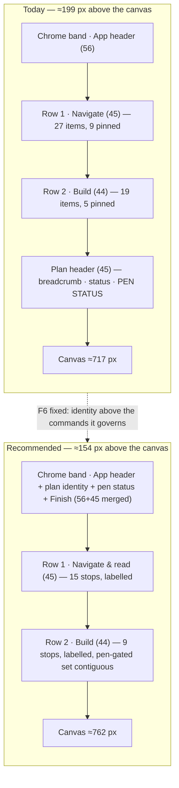
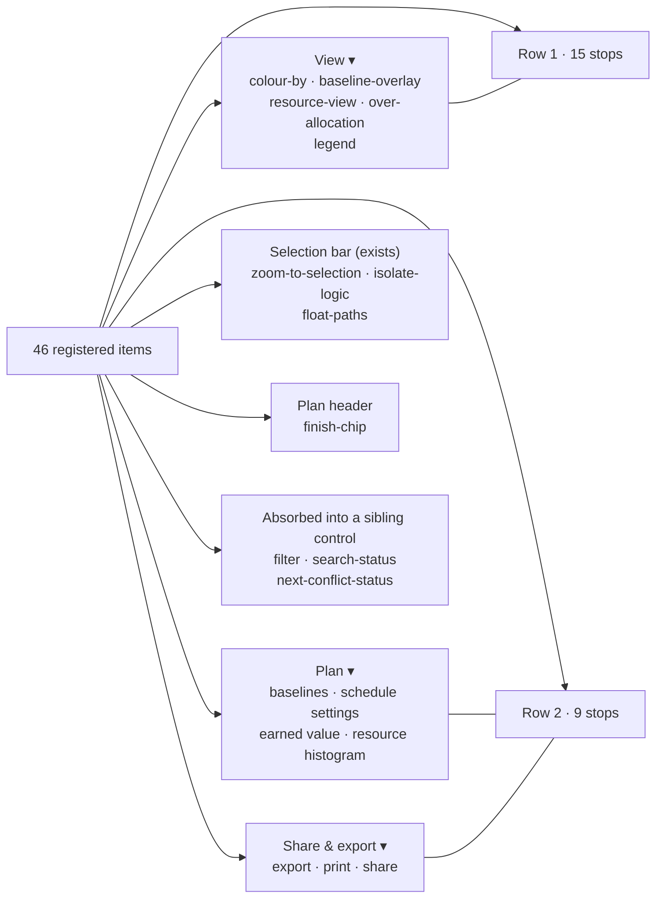
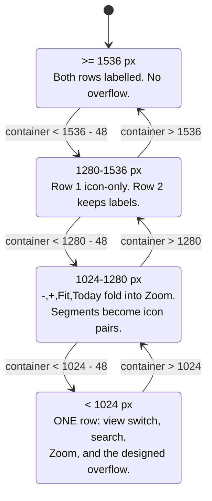

# The plan-workspace command surface — solution design (PROCESS.md stage 4)

- **Status:** Design for approval. **No application code is written by this document.**
- **Date:** 2026-08-11
- **Author:** ui-architect (Claude Code), for James Ewbank
- **Subject:** the two-row TSLD toolbar (ADR-0031) on a 24" 1920×1080 monitor at 100%
  browser scaling, and on a Microsoft Surface Pro (~1440×960 CSS px landscape, ~960×1440
  portrait)
- **Companion ADR:** [ADR-0090](../../adr/0090-the-plan-workspace-command-surface.md) (Proposed)
- **Stage 5 (implementation plan) is deliberately not in this file.** It follows approval of
  the recommendation below.

> ## ⚠ §2's numbers are withdrawn — read [`m0-measurement.md`](./m0-measurement.md) first
>
> This document ends with **M0**, two falsifiable predictions, precisely because it was written
> without a shell and every pixel figure in §2 is arithmetic over class names plus an assumed
> 6.6 px/character metric. **M0 has since been run** in Chromium against the real workspace at the
> shipped flag defaults (`apps/web/measure-toolbar/`). **Both predictions were falsified**, and
> so was §2.4's headline claim that a 2560 px monitor is needed before the labels appear — at 1920
> the labels are already on, and that is _why_ the row breaks.
>
> The measurement also found what neither prediction anticipated: at **1920 × 1080 @ 100%** no `⋯`
> renders at all, and `legend` and `shortcuts` sit **entirely outside** their `overflow-hidden`
> container — 0 px visible, pointer-unreachable. At **1440** the `⋯` itself has 1 px visible while
> holding the only route to 14 commands; at **960** it has none, on both rows.
>
> So: **§2.3's pinned-floor table, §2.4's label arithmetic and the 2560/2700 px figures must not be
> quoted**, §1.2's "every command is reachable" is false at four of the five widths measured, and
> §4's recommendation needs re-deriving against the measured numbers rather than these. The rest of
> the document — the item census, the group/tier/order/row facts, the eight structural findings, the
> flag analysis and §6's answers — is read from code and stands.
>
> That the predictions failed is the mechanism working. Leaving the failed numbers in place without
> this banner is the ADR-0058 failure this repository exists to gate against.

---

## 0. Evidence, and its limits

Every decision-bearing claim below names the file and line, or the arithmetic, that
established it (CLAUDE.md §19.10, ADR-0076).

**What I could not do.** This session had no shell. I could not run `vitest`, `playwright`,
`pnpm check:*`, or a browser. **Every pixel figure in §2 is computed from class names and
assumed text metrics, not measured**, and is labelled as such. That is not a footnote: the
whole point of ADR-0076 is that a plausible number nobody ran is a defect, so §2 ends with
**M0**, a measurement task carrying _falsifiable predictions_ — if M0 disagrees with §2, §2 is
wrong and the design changes.

**What is read from code and is not an estimate:** the item census, the group/tier/order/row
of every item, which items are `render` (pinned) vs `onActivate` (demotable), the demotion
sort, the label-promotion arithmetic, the flag register, and the DOM stacking order. Those are
citations, not calculations.

**Assumed text metric,** used wherever a label's width appears: 14 px (`text-sm`,
`toolbar-styles.ts:42`) at weight 500, averaged at **6.6 px per character**. M0 replaces this
with `measureText` against the real computed font — the same call `Toolbar.tsx:54-70` already
makes.

---

## 1. Problem

### 1.1 What was reported

The command surface "does not work well" on a 24" 1920×1080 monitor at 100% browser scaling.
The specific symptom in the product owner's screenshots: **fewer controls are visible at 100%
than at 90%**. Behaviour on a Surface Pro is unknown.

### 1.2 What that symptom actually is

It is not silent dropping. `Toolbar.tsx:385-395` renders a visible `⋯` (`ToolbarOverflow`,
`aria-label="More toolbar actions"`) whenever anything overflows, and every demoted command is
reachable inside it as a real `MenuItem` with its reason (`ToolbarOverflow.tsx:74-109`,
ADR-0082). Nothing is lost. The difference between the two screenshots is that 90% browser
zoom gives a **2133 CSS px** viewport against 1920 at 100%, and the row happens to sit
**within one control's width of its demotion boundary** at 1920 — see §2.3, which predicts
exactly which two controls move and is therefore falsifiable.

So the reported symptom is real and its cause is arithmetic, not a bug. But chasing only that
symptom would fix the wrong thing. Reading the surface produced a larger finding:

> **The two-row split does not deliver the outcome it was adopted for, and cannot at any
> monitor width the product owner owns.**

ADR-0031's amendment of 2026-07-15 adopted two rows on an explicit product-owner request:
_"On a normal desktop monitor the owner wants **every control visible with its label** and
**nothing working hidden in a `⋯`**"_ (`0031-tsld-toolbar-registry-and-taxonomy.md:252-259`).
Computed in §2.4, `'auto'` labels cannot promote on Row 1 below roughly a **2560 px** container
and on Row 2 below roughly **2600 px**. At 1920 — and at 2133 — both rows render as walls of
unlabelled glyphs with four arbitrarily-labelled words among them. The design has been
delivering the opposite of its acceptance criterion for four weeks, on the owner's own monitor,
and nothing measured it.

That is the problem to solve. The 1920-vs-2133 flicker is a symptom of it.

### 1.3 Users and what changes for them

| Role                                  | Today                                                                                                           | After                                                                        |
| ------------------------------------- | --------------------------------------------------------------------------------------------------------------- | ---------------------------------------------------------------------------- |
| Planner, 1920×1080 @100%              | 46 controls across two rows, ~26 of them unlabelled icons; 2 demote into `⋯`; the set changes with browser zoom | ~24 controls, **labelled**, no `⋯`, stable across zoom                       |
| Planner, Surface Pro landscape (1440) | ~15 of 16 Row-1 buttons in the `⋯` (§2.3)                                                                       | all controls present, icon-only, no `⋯`                                      |
| Planner, Surface Pro portrait (960)   | below the row's pinned floor — pinned controls truncate (§2.3)                                                  | a designed one-row collapse                                                  |
| Viewer / Contributor                  | the same 46 controls, most of Row 2 shaded                                                                      | unchanged in kind — ADR-0031 §4's "shade as a set" is preserved deliberately |
| AT user                               | 46 roving stops across two toolbars, 5 of them non-operable read-outs                                           | ~24 stops, 0 non-operable read-outs on Row 1                                 |

### 1.4 Success criteria

1. At **1920×1080 @100%**, both rows render every inline command **with its label** and **no
   `⋯`** — measured in a browser, not asserted.
2. At **1440 CSS px** (Surface Pro landscape), every command is on the bar (icon-only is
   acceptable); the `⋯` is empty.
3. At **960 CSS px** (Surface Pro portrait) and below, the surface is a _designed_ collapse,
   not a truncation cascade — the `⋯` is the answer, which is what ADR-0031's amendment
   already conceded is acceptable at mobile widths.
4. **No command is deleted.** Every one of the 46 is reachable, and the design says where.
5. The canvas gains vertical space, and the number is stated.
6. WCAG 2.2 AA holds, including 2.5.8, and the house `≥44 px` touch rule
   (`UX_STANDARDS.md:137`) is not made _worse_ on the touch device being added to the target
   list.

---

## 2. The numbers

### 2.1 The vertical budget

Derived from class names — **not measured**. Cited to file and line.

| Band                                    | Source                                                                                                    |       px |
| --------------------------------------- | --------------------------------------------------------------------------------------------------------- | -------: |
| App header row                          | `app-header.tsx:152` — `h-14`                                                                             |       56 |
| **Row 1 · Navigate**                    | `plan-workspace-toolbar.tsx:757` `py-1` (8) + `border-b` (1) + `toolbar-styles.ts:42` `min-h-9` (36)      |   **45** |
| **Row 2 · Build**                       | `plan-workspace-toolbar.tsx:772` `py-1` (8) + `min-h-9` (36)                                              |   **44** |
| Chrome-band bottom border               | `chrome-band.tsx:37` — `border-b`                                                                         |        1 |
| Plan header (breadcrumb / status / pen) | `plan-workspace-toolbar.tsx:715` `py-2` (16) + `button.tsx:28` `icon-sm` = `size-7` (28) + `border-b` (1) |      ≥45 |
| Canvas container top pad                | `plan-workspace-toolbar.tsx:860` — `pt-2`                                                                 |        8 |
| **Above the canvas**                    |                                                                                                           | **≈199** |
| Canvas container bottom pad             | `pb-2`                                                                                                    |        8 |
| Collapsed activities bar                | `activity-bottom-panel.tsx:130` — `h-9` + `border-t`                                                      |       37 |
| **Total chrome**                        |                                                                                                           | **≈244** |

The plan-header figure is a **floor**: 28 px is the `icon-sm` edit button; `CompactPenStatus`
may be taller. M0 measures it.

On a 1920×1080 display at 100% in Chrome on Windows the viewport is roughly **953 CSS px** tall
(1080 − ~40 taskbar − ~87 browser chrome; an estimate, not measured). So the canvas region gets
**≈717 px, about 75% of the viewport**, and the **command surface alone is 90 px — 9.4% of the
viewport and 37% of all chrome.**

### 2.2 The horizontal budget

The chrome band is **full-bleed above the Project Explorer rail**, not beside it:
`chrome-band.tsx:37-41` renders the `Surface` and _then_ `{children}`, and `app-shell.tsx:106`
wraps the rail-plus-`<main>` flex row in that `children`. So the rail never narrows the
toolbar, and every width below is a function of the viewport alone.

```
toolbar container width
  = viewport
  − 16   (row px-2,  plan-workspace-toolbar.tsx:757/772)
  − 73   (row-label gutter: w-16 64 + pr-2 8 + border-r 1, :87)
  − 8    (gap-2 between gutter and toolbar)
  = viewport − 97
```

### 2.3 Row 1's pinned floor — the load-bearing number

`Toolbar.tsx:153-156` restricts demotion to items with `typeof item.onActivate === 'function'`.
Every `render` item is **pinned inline and can never demote** — stated as a rule at
`Toolbar.tsx:117` (_"you don't stuff a popover into a menu"_) — and the overflow computation is
handed `Math.max(0, available − pinnedWidth)` (`Toolbar.tsx:181`).

Row 1's pinned set, at rest (`next-conflict-status` and `search-status` self-hide via
`isVisible`, `tsld-toolbar-items.tsx:2100` / `:2119`). **Widths estimated**; every popover
trigger always renders icon + text label + chevron (`ToolbarPopover.tsx:133-139`), so none of
them can shed its label the way a `ToolbarButton` can.

| Pinned item                                | Composition                                                                   |   est. px |
| ------------------------------------------ | ----------------------------------------------------------------------------- | --------: |
| `go-to-date`                               | `ToolbarPopover` "Go to date"                                                 |       124 |
| `zoom-preset`                              | `tsld-toolbar-items.tsx:594-596` icon + level + chevron                       |       100 |
| `view`                                     | `ToolbarPopover` "View"                                                       |        89 |
| `colour-by`                                | menu-button, shows the active mode                                            |       130 |
| `search`                                   | `ml-3` 12 + `w-[min(15rem,32vw)]` = **240** at any viewport ≥ 750 px (`:777`) |       252 |
| `filter`                                   | menu-button "Filter"                                                          |        96 |
| `isolate-logic`                            | menu-button "Isolate…"                                                        |       103 |
| `finish-chip`                              | `max-w-[10rem]` (`:1253`)                                                     |      ≤160 |
| `summary`                                  | `ToolbarPopover` "Summary"                                                    |       118 |
| item gaps (`gap-1` × 8)                    |                                                                               |        32 |
| group rules (4 × `ml-1` + border + `pl-2`) | `Toolbar.tsx:331`                                                             |        52 |
| **Row 1 pinned floor**                     |                                                                               | **≈1256** |

Row 1 therefore **cannot be narrower than about 1256 px before a single button is placed.**

**Consequences, computed:**

| Viewport                                  | Container | Slack after pinned | 16 demotables @ ~36 px | Outcome                                          |
| ----------------------------------------- | --------: | -----------------: | ---------------------: | ------------------------------------------------ |
| 2133 (1920 @ 90%)                         |      2036 |                780 |                    576 | all inline, **no `⋯`**, no labels                |
| **1920 @ 100%**                           |      1823 |                567 |                    576 | **doesn't fit → `⋯` appears (44 px) → 2 demote** |
| 1440 (Surface Pro landscape)              |      1343 |                 87 |                    576 | **~1 inline, ~15 in the `⋯`**                    |
| 960 (Surface Pro portrait)                |       863 |           **−393** |                      — | **below the floor** — see below                  |
| 768 (`md`, where the panes already split) |       671 |           **−585** |                      — | far below the floor                              |

**This reproduces the reported symptom exactly**, and predicts which two controls move. The
demotion queue (`toolbar-registry.ts:310-318`) is tier-desc then `order`-desc; the two highest
`order` values on Row 1 are `today` (13, `:1484`) and `zoom-to-selection` (13, `:1759`), tied
and broken by registry index descending — `today` is registered later (`:1781` vs `:1752`).

> **M0 prediction P1 — falsifiable.** At exactly 1920×1080 @100% with all shipped flag
> defaults, Row 1's `⋯` contains **"Go to today"** and **"Zoom to selection"**, and only those.
> At 2133 the `⋯` is absent. If M0 shows otherwise, §2 is wrong.

**Below the floor** (viewport < ≈1353 px), what happens is _not_ established. The container is
`overflow-hidden` (`Toolbar.tsx:322`); the group wrappers carry no `shrink-0`, so they shrink;
the popover labels carry `truncate` (`ToolbarPopover.tsx:138`) and the chips carry `max-w` +
`truncate`; the search `Input` hard-stops at `min-w-36` = 144 px (`:777`). **Reasoned from
specification, not observed:** the failure mode is a _truncation cascade_ ("Go to d…", "Summ…")
rather than a loss of commands, because `computeOverflow` receives 0 and demotes everything
while `widthOf` re-measures the shrunken pinned items and self-stabilises, keeping the `⋯`
reachable. **The brief hypothesised clipping with no `⋯` route; I believe that is wrong, and I
have not measured it either way.**

> **M0 prediction P2 — falsifiable.** At 960 CSS px, every Row-1 command is still reachable
> (inline or via `⋯`), and the visible defect is truncated labels on the pinned controls plus a
> search field that will not shrink below 144 px. If commands become unreachable, that is a
> live WCAG 2.1.1 defect and outranks this entire design.

### 2.4 Why the labels never appear — the number that explains the complaint

`Toolbar.tsx:191-211` promotes `'auto'` labels only when
`inlineTotal + Σ(labelWidth + 14) + overflowWidth + 32 ≤ available`. It is **all-or-nothing per
row** (`Toolbar.tsx:140-144`).

Row 1 has **12** `'auto'` items (the 16 demotables minus the four `showLabel: 'always'`
segment halves — `mode-early`/`mode-visual`/`view-tsld`/`view-gantt`, `:1827/:1845/:1874/:1886`).
Their labels sum to ≈969 px estimated, plus 12 × `LABEL_CHROME_PX` (14, `Toolbar.tsx:29`) = 168,
plus `LABEL_PROMOTION_MARGIN_PX` (32, `:36`) ⇒ **≈1169 px of slack required.**

| Viewport | Slack available | Required | Labels?         |
| -------- | --------------: | -------: | --------------- |
| 1920     |             567 |     1169 | no              |
| 2133     |             780 |     1169 | no              |
| 2560     |            1207 |     1169 | **just barely** |

Row 2's 13 `'auto'` items need ≈1360 px of slack against ≈680 available at 1920 — so **≈2700 px**.

> **Row 1 needs a 2560 px monitor to show its labels; Row 2 needs about 2700 px.** The product
> owner has 1920. This is the answer to "why does my monitor look like this", and it is a
> structural property of the pinned floor, not a tuning constant.

The visible result is the worst of both: **four labelled words** (`Early`, `Visual`, `Diagram`,
`Gantt`, all `showLabel: 'always'`) sitting among ~10 unlabelled glyphs, which reads as
arbitrary rather than as a response to width.

### 2.5 Eight structural findings

**F1 — `order` is a within-group sort key reused as a cross-group demotion priority.**
`toolbar-registry.ts:115` documents `order` as _"Sort order **within the group** (ascending)"_.
`computeOverflow` (`:310-318`) sorts the whole row's demotion queue by `b.item.order −
a.item.order`. Those are different questions and the same number answers both. Computed from
the shipped orders, Row 1 demotes in this sequence:

```
today(13) · zoom-to-selection(13) · fit(12) · zoom-in(11) · zoom-out(10) ·
over-allocation(6) · resource-view(5) · float-paths(4) · baseline-overlay(4) ·
next-conflict(2) · shortcuts(1) · legend(0)
```

**Zoom −, Zoom +, Fit and Go-to-today — the four most-used navigation commands on a
time-scaled diagram — demote before Keyboard shortcuts and Legend.** This is exactly backwards,
and it is a stronger explanation of the complaint than item count is. On Row 2 the same rule
sends `comments`(10) → `share`(9) → `print`(8) out first: **the deliverables lead the exit.**

**F2 — The pinned set is the widest part of the row and cannot yield.** §2.3. Nine controls
consume ~1256 px of a 1823 px bar. The overflow algorithm is structurally unable to help,
because the thing overflowing is not what it is allowed to move.

**F3 — A two-state switch can lose one state to the `⋯`.** `mode-early`(order 1) /
`mode-visual`(2) and `view-tsld`(10) / `view-gantt`(11) are each **two tier-1 demotable
buttons**, not one composite. Under enough pressure the queue takes the higher `order` first,
leaving `Early` and `Diagram` on the bar with `Visual` and `Gantt` in a menu — a two-state
switch showing one state. Verified by reading the sort; reachable at 1440, not at 1920. **Treat
as a defect to design out, not a sizing preference** (the brief is right about this).

**F4 — The label budget is spent before it is offered.** §2.4.

**F5 — The row-label gutter costs 73 px per row, permanently, to render two `aria-hidden`
words.** `plan-workspace-toolbar.tsx:87` — `w-16 shrink-0 … border-r pr-2`, and
`:756` marks the span `aria-hidden` because _"the toolbar's own `aria-label` already names the
row for AT"_. 146 px of a bar that is 567 px from fitting.

**F6 — The plan's identity and the pen status render _below_ the commands they govern.** The
band holds the app header + the portalled toolbar (`chrome-band.tsx:37-40`); the workspace's
`<header>` with the breadcrumb, status pill, edit pencil and `CompactPenStatus` renders in
`children`, i.e. **after** it (`plan-workspace-toolbar.tsx:715` vs `:749`). So a reader meets 46
commands before they meet the plan's name, and `CompactPenStatus` — the one fact that explains
why the entire Build row is shaded — sits _underneath_ the row it explains.

**F7 — The rows have no responsive story at all.** `plan-workspace-toolbar.tsx:241` switches to
a single pane below `md`; `Toolbar.tsx` contains no breakpoint, no media query and no layout
mode. The only response to width is per-item demotion, which §2.3 shows is the wrong instrument
below ~1353 px.

**F8 — Two `ml-auto` items share one flex line.** `Toolbar.tsx:333` (`alignEndGroup`) and
`:386` (the overflow wrapper). Per CSS flexbox, free space is distributed **equally** among all
auto margins on a line, so whenever Row 1 overflows there is a gap between `Keyboard shortcuts`
and the `⋯` instead of the `⋯` sitting at the trailing edge. _Reasoned from specification, not
observed._

### 2.6 One register correction found on the way

`docs/TECH_DEBT.md:2011-2012` was amended on 2026-08-11 to say `VITE_CANVAS_WORKSPACE` "remains
open with **five** harnesses left rather than seven."

**Measured — `grep -n VITE_CANVAS_WORKSPACE apps/web/playwright*.config.ts`: seven configs
still pin it `'false'`:** `playwright.config.ts:70` (base), `edit:72`, `sub-day:68`,
`programme:63`, `assignment-lag:73`, `activity-editor:74`, `notes:61`.

ADR-0089 converted the `sub-day` and `assignment-lag` harnesses off **`VITE_ACTIVITY_EDITOR_TABS`**,
not off `VITE_CANVAS_WORKSPACE` — both still pin the latter off. The count is unchanged at
seven, and `scripts/flag-retirement.json:320` still names all seven correctly, so the register
and its own debt row now disagree. This is an ADR-0076 Class 1 failure inside a row edited the
previous day, found only because CLAUDE.md §19.10 says to check the claim rather than cite it.
**It should be corrected in the same PR that acts on this design** (see §8).

---

## 3. Options

Four genuinely different shapes. Each is costed against §2's arithmetic.

### Option A — Repair in place: keep two rows, fix priority, densify, cut the gutter

Split `priority` from `order` (fixes F1, F3). Replace the 73 px gutter with a hairline (F5).
Fold Legend + Shortcuts + Snap-to-grid into `View ▾`. Retire the two conditional read-out chips.
Optionally densify the shared CVA to `min-h-8 px-1.5`.

- Row 1 pinned floor: 1256 → ~1160 px. Demotables 16 → 13.
- Label requirement: ~1169 → ~960 px of slack, against 663 available at 1920. **Still no labels.**
- Surface Pro portrait: still below the floor.
- **Verdict: necessary, and insufficient.** Every item in it is a prerequisite for anything
  else — in particular, nothing measured after this design lands means anything until the
  priority split is in, because otherwise M0 is measuring the wrong demotion order. It is
  Milestone 1 of the recommendation, not an alternative to it.

### Option B — One persistent row + a contextual, consolidated second row _(recommended)_

Three moves, each justified by something already in the code rather than by taste:

1. **Move a command to where its own predicate says it lives.** `zoom-to-selection`,
   `isolate-logic` and `float-paths` all carry `isEnabled: … selectedActivity != null`
   (`:1763`, `:2021`, `:2076`). They belong on the **existing** selection-actions bar
   (`selection-actions.tsx`, which already renders its own `<Toolbar>`), not on a persistent row
   where they are shaded most of the time.
2. **Consolidate by taxonomy, not by space.** Display lenses (`colour-by`, `baseline-overlay`,
   `resource-view`, `over-allocation`, `legend`) go into `View ▾`, which _is_ the display-toggle
   panel (`ViewTogglesPanel`, groups Structure / Markers / Insight overlays, `:116-118`). Plan
   actions go into a named `Plan ▾`. Deliverables go into a `Share & export ▾` split-button.
3. **Move facts out of the toolbar.** `finish-chip` to the plan header; the two conditional
   status chips into the controls they describe.

Row 2 keeps its identity as **the pen-gated authoring row** — ADR-0031 §4's "the cluster shades
as one visible set" is preserved deliberately — with `Plan ▾`, `Report progress…`, `Comments`
and `Share & export ▾` at its trailing edge.

- **Computed outcome at 1920:** Row 1 pinned ≈970 px, six demotables (216 px), slack 637 px
  against a 560 px label requirement ⇒ **labelled, no `⋯`**. Row 2 ≈794 px pinned, slack
  1029 px against 267 px ⇒ **labelled**. Toolbar stops: 46 → **24**. Nothing deleted.
- Full arithmetic and the per-item allocation are in §4.
- **Cost:** commands move behind named menu triggers. The 2026-07-15 amendment reversed exactly
  this — but it reversed _icons in an undifferentiated `⋯`_, and a named `Plan ▾` is a different
  object. The product already ships six of them (`View ▾`, `Colour by ▾`, `Filter ▾`,
  `Export ▾`, `Add ▾`, `Link ▾`), so this extends a shipped idiom rather than inventing one.

### Option C — A vertical command rail beside the canvas

Tool modes and lenses in a ~56 px vertical rail; the time-axis controls stay horizontal.

- **Pro:** it trades the axis the surface has spare. A TSLD is wide; vertical space is what the
  canvas is starved of, and a rail returns 44–90 px of height permanently. It is the option
  that best serves §1.4 criterion 5.
- **Con, and it is decisive.** The left edge is the Project Explorer rail (ADR-0029) and the
  right edge already holds the notes and float-paths docks — where
  `plan-workspace-toolbar.tsx:150-155` records that the edge holds **one dock at a time**,
  because _"two of them plus the Project Explorer rail on a 1280 px screen leaves the picture
  unreadable"_. A third permanent column takes width from a diagram whose scarce axis is
  horizontal, at every breakpoint, and makes the Surface Pro portrait case strictly worse.
  Separately, `Toolbar.tsx:320` is `aria-orientation="horizontal"` with one roving order; a
  vertical rail is a second orientation to build, test and keep in step.
- **Verdict: reject, and record the reasons** — it is the strongest answer to the height
  question and deserves better than silence.

### Option D — One row of grouped menu-buttons only

`Navigate ▾ Display ▾ Find ▾ Build ▾ Plan ▾ Share ▾ Help ▾` plus the read-outs. Fits every
width including portrait, in 45 px.

- **Rejected on three counts, each citing a shipped decision.** (i) The pen-gated cluster's
  _visible_ group state disappears into a menu, and ADR-0031 §4 makes that flip a first-class
  legible state; worse, ADR-0082 rules that **a menu whose every item would be shaded renders no
  trigger**, so a Viewer would see `Build ▾` vanish entirely — strictly worse than a shaded row.
  (ii) Add / Link / Marquee are **modes**, not commands; a mode you cannot see armed is verbatim
  the ADR-0064 defect. (iii) Every command costs two gestures, on the surface the product exists
  to be.

---

## 4. The recommendation — Option B, with Option A as its first milestone

### 4.1 Where all 46 commands go

Nothing is deleted. `→ View ▾`, `→ Plan ▾`, `→ Share & export ▾` and `→ selection bar` are
relocations to surfaces that already exist.

**Row 1 today (27 registered) →**

| #     | Item                                                   | Destination                                   | Why                                                       |
| ----- | ------------------------------------------------------ | --------------------------------------------- | --------------------------------------------------------- |
| 1     | `go-to-date`                                           | Row 1 (icon + chevron; date in the `title`)   | −66 px, keeps the affordance                              |
| 2     | `zoom-preset`                                          | Row 1 as `Zoom ▾`                             | see Q5                                                    |
| 3–5   | `zoom-out`, `zoom-in`, `fit`                           | Row 1 inline ≥1280; inside `Zoom ▾` below     | one cluster, one control                                  |
| 6     | `zoom-to-selection`                                    | **selection bar**                             | `isEnabled` requires a selection (`:1763`)                |
| 7     | `today`                                                | Row 1 inline ≥1280; inside `Zoom ▾` below     |                                                           |
| 8     | `view`                                                 | Row 1 as `View ▾`, absorbing 9, 14–16, 26     | it _is_ the display panel                                 |
| 9     | `colour-by`                                            | **`View ▾`** → Insight overlays (radio group) | −130 px                                                   |
| 10–11 | `mode-early`, `mode-visual`                            | Row 1, **one composite segment**              | fixes F3                                                  |
| 12–13 | `view-tsld`, `view-gantt`                              | Row 1, **one composite segment**              | fixes F3                                                  |
| 14–16 | `baseline-overlay`, `resource-view`, `over-allocation` | **`View ▾`** → Insight overlays               | display overlays                                          |
| 17    | `search`                                               | Row 1, absorbing 18 and 22                    |                                                           |
| 18    | `filter`                                               | **into the search control**                   | its match set already intersects the query (`:1996-1997`) |
| 19    | `isolate-logic`                                        | **selection bar**                             | `isEnabled` requires a selection (`:2021`)                |
| 20    | `next-conflict`                                        | Row 1, label carries "· 2 of 7"               |                                                           |
| 21    | `next-conflict-status`                                 | **into 20's label**                           | removes a conditional width source                        |
| 22    | `search-status`                                        | **into the search control's chrome**          | ditto                                                     |
| 23    | `float-paths`                                          | **selection bar**                             | `isEnabled` requires a selection (`:2076`)                |
| 24    | `finish-chip`                                          | **plan header**, beside the status pill       | see Q7                                                    |
| 25    | `summary`                                              | Row 1, right-aligned                          | it is a control, and the ADR-0031 hub                     |
| 26    | `legend`                                               | **`View ▾`** → new "Panels" section           | see Q2                                                    |
| 27    | `shortcuts`                                            | Row 1, **lowest** priority                    | see Q3                                                    |

**Row 2 today (19) →**

| #     | Item                                                          | Destination                                                                                                                                                                                                                                                                                                                                              |
| ----- | ------------------------------------------------------------- | -------------------------------------------------------------------------------------------------------------------------------------------------------------------------------------------------------------------------------------------------------------------------------------------------------------------------------------------------------- |
| 28–31 | `add-activity`, `link-tool`, `marquee-select`, `auto-arrange` | Row 2 pen cluster                                                                                                                                                                                                                                                                                                                                        |
| 32–34 | `add-note`, `snap-to-grid`, `clear-visual-placement`          | Row 2 pen cluster, low priority                                                                                                                                                                                                                                                                                                                          |
| 35–37 | `recalculate`, `undo`, `redo`                                 | Row 2 pen cluster                                                                                                                                                                                                                                                                                                                                        |
| 38–41 | `baselines`, `calendar`, `earned-value`, `resource-histogram` | **`Plan ▾`** (Row 2 trailing edge)                                                                                                                                                                                                                                                                                                                       |
| 42    | `update-progress`                                             | ~~Row 2 inline — a Contributor's primary action must not be buried~~ **Superseded by ADR-0093, not overturned.** The reason was right and is now better served elsewhere: the canvas dock puts that action ON the object, under exactly the same condition, so keeping a second copy here buried nothing and duplicated everything. The item is removed. |
| 43–45 | `export`, `print`, `share`                                    | **`Share & export ▾`** split-button (Export primary)                                                                                                                                                                                                                                                                                                     |
| 46    | `comments`                                                    | Row 2 inline — a toggle with `aria-pressed` loses its state cue inside a menu                                                                                                                                                                                                                                                                            |

**One hard rule, so this cannot rot:** _a `penGated` item may not leave the pen cluster._
ADR-0031 §4 makes the read-only↔editing flip legible **as one contiguous shaded set**; scatter
its members and that stops being true. `snap-to-grid` (`:2248`) and `clear-visual-placement`
(`:2277`) are pen-gated and therefore stay, even though "a canvas behaviour toggle" would
otherwise argue for `View ▾`. Verified by grepping `penGated: true` — the cluster is
`add-activity`, `link-tool`, `auto-arrange`, `add-note`, `snap-to-grid`,
`clear-visual-placement`, `recalculate`, `undo`, `redo`.

### 4.2 The arithmetic

Estimated by the same method as §2, so the two are comparable.

|                                              |                  Today | Recommended |     Δ |
| -------------------------------------------- | ---------------------: | ----------: | ----: |
| Row 1 pinned floor                           |                   1256 |    **≈970** |  −286 |
| Row 1 demotables                             |                     16 |       **6** |   −10 |
| Row 1 label requirement                      |                   1169 |     **560** |  −609 |
| Row 1 slack at 1920                          |                    567 |     **637** |   +70 |
| **Row 1 labelled at 1920?**                  | **no** (needs 2560 px) |     **yes** |       |
| Row 2 pinned                                 |                   ≈452 |        ≈684 |  +232 |
| Row 2 label requirement                      |                   1360 |     **267** | −1093 |
| **Row 2 labelled at 1920?**                  | **no** (needs 2700 px) |     **yes** |       |
| Toolbar stops                                |                     46 |      **24** |   −22 |
| Non-operable read-outs in a `role="toolbar"` |                      3 |       **0** |    −3 |

Vertical: the two rows stay at 90 px. **The height comes from elsewhere** — see Q4 and §4.3.

### 4.3 Where the vertical space actually is

Densifying the control returns **8 px** — 1.1% of the canvas (Q4). The two available bands are
much larger, and both are already-identified defects:

- **F6, the duplicated header line.** Folding the plan header (breadcrumb, status pill, edit
  pencil, `CompactPenStatus`, and now the Finish read-out) **into the chrome band above Row 1**
  removes a whole 45 px band _and_ fixes the reading order: identity and pen status above the
  commands they govern. **−45 px, +6% canvas.**
- **F5, the gutter** — horizontal, but it is the same edit.

Together with F6 the canvas goes from ≈717 px to ≈762 px on a 1920×1080 screen, without
touching a single control's height and without failing `UX_STANDARDS.md:137` harder on touch.

---

## 5. Diagrams

### 5.1 The stack today, and recommended



### 5.2 Command routing



### 5.3 The responsive ladder



The 48 px asymmetry on each edge is **hysteresis**, the same instrument
`LABEL_PROMOTION_MARGIN_PX` (`Toolbar.tsx:31-36`) already uses, and for the same reason: a mode
boundary with no dead-band flips the whole layout while a user drags a window edge.

---

## 6. The seven questions, answered

### Q1 — Export / Print / Share are deliverables, not "build". Own group? Own surface?

**Establish the real defect first.** All three are `group: 'object', row: 'do'`, orders 7/8/9,
beside Baselines(2), Schedule settings(3), Earned value(4), Resource histogram(5), Report
progress(6), Comments(10). Because the demotion queue is `order`-descending (F1), **Comments,
Share and Print are the first three Row-2 items to leave the bar.** Export is not — but only
because it happens to be a `render` menu (`tsld-toolbar-items.tsx:2476-2480`) and `render` items
never demote. So the deliverable set is **already split by an implementation accident**: Export
is permanently present, Print and Share lead the exit. That is sharper than "they are mis-grouped",
and it is the thing to fix.

**Own group: yes — but do not grow the taxonomy.** `TOOLBAR_GROUPS` is a 7-member `const` tuple
whose closure is the point (`toolbar-registry.ts:19-27`); ADR-0031 §2 makes adding a member an
ADR-level act. Two routes:

- _Re-use `history` as-is_ — **no.** Undo/redo were deliberately moved **out** of `history` into
  `tools` to keep the pen-gated set contiguous (`tsld-toolbar-items.tsx:2528-2529`), and
  `Toolbar.tsx:104` announces `aria-label="History"` to AT. Filing deliverables under "History"
  makes the group's accessible name a false statement.
- _Rename `history` → `output`_ — **yes.** One token in a closed union the compiler defends, one
  entry in `DEFAULT_GROUP_LABELS` (`Toolbar.tsx:95-105`) → `"Share & export"`. The taxonomy stays
  at seven members, which is what ADR-0031 §2 was protecting; the empty reserved slot gets a real
  occupant. Undo/redo stay in `tools`; ADR-0090 records that `history` is not coming back.

**Own surface: no.** A deliverables panel would be a fourth dock on a right edge that already
holds one at a time (`plan-workspace-toolbar.tsx:150-155`).

**Recommendation:** rename the group, and give it **one** stop — a `Share & export ▾`
split-button with Export as the primary and Print / Share / the interchange formats in its menu.
Three demotable items become one pinned one, at the trailing edge of Row 2 where a planner looks
for "give this to somebody".

### Q2 — Could the Legend fold into `View ▾`?

**Say what it costs first, because the premise overstates it.** `legend` is one tier-2 icon
button (`:2532-2542`) toggling a floating on-canvas panel. Its toolbar cost is **32 px + a 4 px
gap = 36 px, 2.0% of the 1823 px Row-1 container at 1920.** Folding it saves nothing that
matters, and "we moved it to save space" would be a false claim of exactly the ADR-0076 Class 3
kind.

**Move it anyway, for a better reason: it is a taxonomy correction.** The Legend is a _display
toggle for an on-canvas panel_, and `View ▾` is the display-toggle panel — `ViewTogglesPanel`
already groups Structure / Markers / Insight overlays (`:116-118`). ADR-0056 M7 moved "Month
bands" into `View ▾ → Structure` on precisely this reasoning, so this extends a decided
principle rather than inventing one. Add a **Panels** group to `View ▾` holding Legend (and, in
time, the other panel toggles).

**Net: −36 px, which is noise. The reason is correctness, and the ADR should say so.**

### Q3 — Could keyboard shortcuts leave the toolbar?

One icon button (`:2543-2555`), 36 px with its gap, and `?` is already bound at the workspace
root (`plan-workspace-toolbar.tsx:211-218` via `usePlanWorkspaceKeyScope`).

**Keep it.** The `?` binding is discoverable only if you already know it, and it is scoped to
the workspace root — so it does nothing at all for a user who has not yet focused inside the
workspace, which is exactly the new planner who needs it most. Deleting the only visible route
to the keyboard reference from a surface whose value to a power user _is_ keyboard operability
buys 36 px, which §2.4 shows is 3% of the shortfall.

**What is wrong with it is not that it is there — it is that it outranks Zoom.** Its `order: 1`
makes it the second-to-last Row-1 item to demote (F1), so `Fit to plan` disappears while
`Keyboard shortcuts` stays. Under the `priority` split it becomes the **lowest** priority on Row
1 and lives in the `⋯` from the _Condensed_ mode down, where the `⋯` is the designed answer.
**Cost: 0 px at desktop. Benefit: the ordering stops being absurd.**

### Q4 — Height / icon size / text size

One CVA owns every control: `min-h-9 px-2 text-sm` with `size-4` icons
(`toolbar-styles.ts:41-42`).

| Scale                | Icon-only button | Row height | 2.5.8 (24×24)        | `UX_STANDARDS.md:137` (≥44 touch) |
| -------------------- | ---------------- | ---------: | -------------------- | --------------------------------- |
| Today `min-h-9 px-2` | **32 × 36**      |         45 | passes               | **already fails**                 |
| `min-h-8 px-1.5`     | 28 × 32          |         41 | passes (4 px margin) | fails harder                      |
| `min-h-7 px-1`       | 24 × 28          |         37 | **at the limit**     | fails                             |

The **spacing exception** to 2.5.8 does not rescue a smaller target here: adjacent controls are
`gap-1` = 4 px apart (`Toolbar.tsx:330`), so 24 px undisplaced circles overlap and the target
itself must clear 24×24.

**Quantified return of the compact scale:** 4 px per row × 2 rows = **8 px vertical**, which is
**1.1% of a 717 px canvas**; and ~4 px × ~30 button-shaped controls ≈ 120 px horizontal, against
a 567 px shortfall.

**Recommendation: do not densify the shared CVA.** Pointing at it is the finding — it returns
1.1% of canvas height and moves the surface **further** from the house touch standard on the
exact device the brief adds to the target list. The height is in F6's duplicated header band
(45 px) and, if a row is ever removed, in the row (44 px); the width is in F2 and F5.

If a compact scale is wanted regardless, it must be a **`density` variant on
`toolbarControlVariants`** — the `CheckboxField density="compact"` precedent (ADR-0055,
`docs/DESIGN_SYSTEM.md`) — applied only under `@media (pointer: fine)`, never as a global
re-value. A global one silently degrades every touch user to satisfy a desktop complaint.
Icon size (`size-4` = 16 px) and `text-sm` stay: `text-sm` is already the design system's body
step, and `text-xs` in a primary command surface fails the readability bar the same document
sets.

### Q5 — Does the zoom preset dropdown earn its place given −/+ and free canvas zoom?

**Yes**, on two pieces of recorded history rather than first principles.

1. **A preset is not reachable by stepping.** ADR-0056 §1: a preset declares a **target visible
   range**, and `pxPerDayForPreset(level, width)` derives `pxPerDay` _at pick time from the
   canvas width_; `presetOf`/`isAtPreset` take the width as a **required, compiler-enforced**
   parameter. `−`/`+` call `ctx.stepZoom(0.5)` / `stepZoom(2)`
   (`tsld-toolbar-items.tsx:1712`, `:1725`) — a multiplicative step on the current scale. "Show
   me a quarter" has an answer that depends on the width; a step structurally cannot compute it.
   They are different commands, not two routes to one.
2. **Removing it re-opens a defect this ADR already closed.** ADR-0031's 2026-07-14 amendment §2
   records that the Frame group carried **five separate scale buttons** and the width-driven
   overflow silently demoted Year and Quarter into the `⋯`, so _"controls appeared to come and
   go"_ and the scale set read as if it changed with the planning mode. The dropdown exists
   because of that. Splitting it back out reproduces it — on a bar that is now much more
   crowded.

**What does not earn its place is the rest of the cluster occupying separate slots.** `−`, `+`,
`Fit`, `Go to today` and `Zoom to selection` are five tier-2 items at the **highest** demotion
priority on the row (F1), so they are the first things to vanish. They are one conceptual
cluster. Fold them into the `Zoom ▾` menu as a footer strip — inline at ≥1280 px, inside the menu
below — and move `Zoom to selection` to the selection bar. ADR-0031's two-row amendment already
deferred a compact zoom pad _"revisit if the compact geometry is worth a bespoke primitive"_;
§2.3 is the reason to revisit, and this shape avoids the composite-roving-focus problem that
deferral named, because the footer strip lives **inside a menu**, which owns its own focus model.

### Q6 — Would a third toolbar help, or should some actions become contextual canvas controls?

**A third row: no.** It costs 45 px permanently (≈6% of the canvas) and buys ~1800 px of
horizontal room, which §4.2 shows is not needed once F2 is addressed. It would take chrome above
a 953 px viewport from 199 px to 244 px — **26% of the screen** — and it makes the Surface Pro
portrait case strictly worse, since the collapse ladder then has three rows to fold rather than
two. Note that Option B's Row 2 already _is_ the conditional surface a third row would be: the
pen-gated row, which a Viewer does not need.

**A new floating surface over the canvas: no, and the reason is decided.** ADR-0064 §3 rejected
this in terms that apply verbatim: the canvas already carries the ADR-0054 cursor chip, the
ADR-0056 Today pill and the ADR-0031 floating selection bar, and _"a fourth overlay eventually
comes to rest on the bar the planner is trying to click. That is not hypothetical: it is how
this epic's own test harness failed once."_ That decision stands.

**Moving commands into the _existing_ selection bar: yes, and it is the strongest single cut in
this design.** `selection-actions.tsx` already renders its own `<Toolbar>`, so the precedent and
the primitive are both in place, and this adds **no** new surface. Three Row-1 commands declare,
in their own `isEnabled`, that they are meaningless without a selection:

| Item                | Predicate                                                | Line         |
| ------------------- | -------------------------------------------------------- | ------------ |
| `zoom-to-selection` | `hasDiagram && canvasActive && selectedActivity != null` | `:1762-1763` |
| `isolate-logic`     | `canvasActive && hasDiagram && selectedActivity != null` | `:2021`      |
| `float-paths`       | `activityCount > 0 && selectedActivity != null`          | `:2076`      |

They sit on a persistent row where they are shaded for most of a session. Moving them is not
"more chrome over the canvas" — it is putting three commands where their own predicates say they
live, and it removes 103 px of pinned width plus two demotables from Row 1. **This answer came
from reading `isEnabled`, not from taste**, which is why it is the one to take first.

### Q7 — Do Finish date and Summary belong where they are?

`finish-chip` is `presentational: true` (`:2351-2357`); `summary` is a tier-2 popover; both are
`group: 'object', row: 'look'`, right-aligned by `alignEndGroup="object"`
(`plan-workspace-toolbar.tsx:768`).

**`Summary ▾`: yes, keep it.** It is a control, and the 2026-07-15 consolidation made it the hub
that absorbed Plan details and Edit plan (ADR-0031, third amendment §2). Right-aligned is
correct.

**`finish-chip`: no — move it to the plan header.** A **read-out inside `role="toolbar"` is a
category error** that the primitive had to be extended to accommodate: `ToolbarItem.presentational`
exists so a non-operable node can be rendered inline and then excluded from the roving order
(`Toolbar.tsx:246-252`). It exists because there was nowhere else to put a fact. There is now:
the plan header line already carries the plan's name, status pill and pen status, it is 45 px of
chrome doing very little, and F6 says it should move into the band anyway. Moving Finish there
returns **≤160 px** to Row 1, puts the project finish beside the plan name where a reader looks
for identity, and — once F6 is fixed — puts the **fact above the commands that change it**,
which is the right reading order.

`next-conflict-status` and `search-status` are the same category error twice more, with an extra
cost: both are **conditional** (`isVisible`, `:2100` / `:2119`), so the row grows wider _exactly
while_ the planner is searching or cycling conflicts — under load. Fold each into the control it
describes (the search field carries "3 of 12" in its own chrome; `Next conflict` carries "· 2 of
7" in its label). That removes two conditional width sources and leaves **zero** non-operable
stops in either toolbar.

---

## 7. Responsive strategy, down to Surface Pro and below

### 7.1 Four modes, driven by the container the toolbar already measures

`Toolbar.tsx:223-229` attaches one `ResizeObserver` to the row container. The layout mode reads
**that same measurement**, not a viewport media query — two sources for one question is how they
drift, and a container measurement is correct even if a future dock ever narrows the band.

| Mode            | Container | Surface Pro?        | Row 1                                                                                                        | Row 2                |
| --------------- | --------- | ------------------- | ------------------------------------------------------------------------------------------------------------ | -------------------- |
| **Comfortable** | ≥ 1536    | —                   | all inline, labelled                                                                                         | all inline, labelled |
| **Compact**     | 1280–1536 | **landscape, 1343** | icon-only, all inline, `⋯` empty                                                                             | labelled             |
| **Condensed**   | 1024–1280 | —                   | −/+/Fit/Today fold into `Zoom ▾`; the two segments become icon pairs; `Summary ▾` and `Shortcuts` to the `⋯` | icon-only            |
| **Collapsed**   | < 1024    | **portrait, 863**   | ONE row: view switch, search, `Zoom ▾`, `⋯`                                                                  | merged into the `⋯`  |

Hysteresis of 48 px on each boundary, per §5.3.

**Surface Pro landscape (1440 → container 1343) lands in Compact:** Row 1 pinned ≈970 px + six
demotables 216 px = 1186 px ≤ 1343. **Every command inline, icon-only, no `⋯`** — which meets
§1.4 criterion 2. Today it puts ~15 of 16 in the `⋯` (§2.3).

**Surface Pro portrait (960 → container 863) lands in Collapsed:** pinned ≈430 px + `⋯` 44 px =
474 px ≤ 863. Comfortable. Today it is 393 px **below** Row 1's pinned floor.

**Below `md` (768 → container 671)** the workspace already switches to a single pane
(`plan-workspace-toolbar.tsx:241`, `MD_QUERY = 48rem`). Collapsed fits there too (474 ≤ 671),
and the toolbar finally participates in the responsive story the rest of the workspace has had
since ADR-0030 (F7).

### 7.2 Touch

A Surface Pro is a touch device, and `UX_STANDARDS.md:137` asks for ≥44 px touch targets. Today's
32×36 controls already miss it. This design does not fix that and **must not make it worse**
(Q4), so:

- The compact `density` variant, if built, is `@media (pointer: fine)` only.
- Under `@media (pointer: coarse)` the control keeps `min-h-9` and gains `px-3`, taking icon-only
  buttons to 40×36 — closer to the house rule, at a horizontal cost the Collapsed mode's much
  smaller item count can now afford. **This is the first time the toolbar could afford it**,
  which is a real benefit of the consolidation and should be stated as one.
- Record the residual gap (36 px < 44 px on the minor axis) as a debt row rather than claiming
  it closed.

---

## 8. Flags, rollout, and the last Class A flag

**No new `VITE_` flag.** ADR-0088 D1 establishes that a `VITE_` flag is inlined at build time,
that `apps/web/Dockerfile` declares one `VITE_` build arg and `docker-publish.yml` passes none,
so **no operator can switch one off on a deployed container**. A flag here would buy no rollback
and would cost a second command surface maintained forever. Worse: two of the four options
select between different JSX roots, which is the **Class A** definition, and
`scripts/flag-retirement.json:549` sets `classACap: 1` with _"raising it needs an ADR"_.

The mitigation is the ADR-0061 / ADR-0077 one: **land as small, individually revertible
commits**, each one a milestone boundary.

**This epic fires the last Class A flag's deferral trigger.** `VITE_CANVAS_WORKSPACE` carries
`deferredUntil.trigger = "epic-touch: plan workspace"` (`scripts/flag-retirement.json:317-321`),
debt `#122`. That is this epic. Per ADR-0089's pattern — do the work that collects the payoff
first, convert the harnesses, then retire — the retirement belongs **inside** this programme,
not as a flag chore after it. It is measured at **seven** harnesses, not the five `#122` now
claims (§2.6), and correcting that row is part of the same PR.

**Consequence for sequencing:** the seven flag-off harnesses drive the _legacy stacked
plan-detail page_, which has no toolbar rows at all — so they are unaffected by Milestones 1–3
and become a separate, well-understood conversion slice. Do not merge the two.

---

## 9. Does this need an ADR?

**Yes.** Five separate amendments to shipped, accepted decisions:

1. `TOOLBAR_GROUPS` is a closed, compiler-enforced union; renaming `history` → `output` changes
   it (ADR-0031 §2).
2. The registry contract gains a `priority` concept distinct from `order` (ADR-0031 §1/§3).
3. The `<Toolbar>` primitive gains a **layout mode**, which it has never had (ADR-0031 §3, F7).
4. The plan header moves into the chrome band, which is ADR-0055 §3 territory.
5. The two-row split's stated goal is restated in terms that are achievable, which amends
   ADR-0031's 2026-07-15 amendment.

**Number: ADR-0090.** Verified free — no `docs/adr/0090*` exists (the register runs 0001–0089
with 0089 the highest), and `grep -rn 'ADR-009[0-9]|adr-009[0-9]'` over the whole repository
returns **no matches**, so no number is claimed in `docs/specs/` either. That check is done
because ADR-0071 was cited by shipped code while absent from the register (ADR-0071, ADR-0078).

Draft: [`docs/adr/0090-the-plan-workspace-command-surface.md`](../../adr/0090-the-plan-workspace-command-surface.md),
status **Proposed**. `docs/adr/README.md` is updated in the same commit.

**Owed and deliberately not done here:** CLAUDE.md §16 carries the ADR register, and this
session is not authorised to edit CLAUDE.md. Its ADR-0090 entry must be added by whoever
accepts this design, or the register drifts the way ADR-0071 did.

---

## 10. Risks

| Risk                                                                                              | Likelihood                  | Impact                                  | Mitigation                                                                                                                                          |
| ------------------------------------------------------------------------------------------------- | --------------------------- | --------------------------------------- | --------------------------------------------------------------------------------------------------------------------------------------------------- |
| **§2's pixel figures are wrong** — no browser was run                                             | **certain to be imprecise** | high: the whole design is sized on them | **M0 first.** Predictions P1/P2 are falsifiable; if either fails, re-derive before Milestone 2.                                                     |
| Product owner reads consolidation as a reversal of their 2026-07-15 request                       | high                        | high                                    | Lead with §2.4: the request was _labels_, and labels have never once been delivered on their monitor. The consolidation is how it becomes possible. |
| A menu-button hides a command a planner uses hourly                                               | medium                      | medium                                  | Only `Plan ▾` and `Share & export ▾` hold commands, and both are named. `Report progress…` and `Comments` stay inline for exactly this reason.      |
| Layout-mode boundary oscillates on a window drag                                                  | medium                      | medium                                  | 48 px hysteresis, the `LABEL_PROMOTION_MARGIN_PX` precedent; assert it in a unit test at both edges.                                                |
| The `priority` split silently changes demotion everywhere, including the selection bar            | medium                      | medium                                  | Default `priority = order` so the change is opt-in per item; assert the selection bar's queue is unchanged.                                         |
| Moving three commands to the selection bar strands the no-selection case                          | medium                      | medium                                  | All three already refuse without a selection; the bar is where a selection exists. Verify no keyboard-only route is lost.                           |
| `finish-chip` moving out of the toolbar breaks tests keyed to `[data-toolbar-item="finish-chip"]` | high                        | low                                     | It is a rename of location, not of capability; grep the attribute before moving.                                                                    |
| Retiring `VITE_CANVAS_WORKSPACE` inside this epic swells it                                       | high                        | medium                                  | Keep it a separate terminal milestone; seven harnesses, measured (§2.6). The legacy page has no toolbar, so it does not interact.                   |

---

## 11. Checklist for the implementer

**M0 — measure, before anything is designed further.** Not optional; §2 is arithmetic.

- [ ] A Playwright spec in `apps/web/e2e-toolbar/` that, at viewport widths **2133 / 1920 / 1600
      / 1440 / 1280 / 1024 / 960 / 768**, records for each row: container width, per-item
      `getBoundingClientRect().width`, the `⋯` contents, and whether labels are shown.
- [ ] **Check P1:** at 1920×1080 the Row-1 `⋯` holds exactly _Go to today_ and _Zoom to
      selection_.
- [ ] **Check P2:** at 960 every command is still reachable; record whether the failure is
      truncation or clipping. **If any command becomes unreachable, stop — that is a live WCAG
      2.1.1 defect and it outranks this design.**
- [ ] Measure the real vertical stack (§2.1) including `CompactPenStatus`.
- [ ] Feed the real `measureText` widths back into §2 and **correct the table in this file**
      rather than leaving the estimates standing.

**M1 — repair in place (Option A; prerequisite for judging anything else).**

- [ ] Add `priority?: number` to `ToolbarItem`, defaulting to `order`; `computeOverflow` sorts on
      it. Document that `order` is position and `priority` is demotion, in both docblocks.
- [ ] Give Zoom −/+/Fit/Today high priority and Legend/Shortcuts the lowest. Regression test:
      _Fit to plan_ survives a demotion that takes _Keyboard shortcuts_, **verified red first**.
- [ ] Make each segment (Early|Visual, Diagram|Gantt) **one** demotion unit so F3 is unreachable.
      Test at a width that demotes tier 1.
- [ ] Replace the 73 px gutter (F5) with a hairline; the row name stays in the toolbar's
      `aria-label` (it is already `aria-hidden` for AT, `:756`).
- [ ] Fix F8: one `ml-auto` per flex line.

**M2 — consolidate (Option B, §4.1).** Every item below names its entry point (ADR-0081).

- [ ] Move `zoom-to-selection`, `isolate-logic`, `float-paths` to `selection-actions.tsx`.
      _Entry point: select a bar → the selection bar._
- [ ] Absorb `colour-by`, `baseline-overlay`, `resource-view`, `over-allocation`, `legend` into
      `View ▾`; add a **Panels** group. _Entry point: `View ▾`._
- [ ] Absorb `filter` and `search-status` into the search control; fold `next-conflict-status`
      into the `Next conflict` label. _Entry point: the search field / the button's own label._
- [ ] Rename `TOOLBAR_GROUPS` member `history` → `output`; add the `Share & export ▾`
      split-button (Export primary; Print, Share, interchange in the menu).
      _Entry point: Row 2 trailing edge._
- [ ] Add `Plan ▾` (baselines, schedule settings, earned value, resource histogram). Keep
      `Report progress…` and `Comments` inline. _Entry point: Row 2 trailing edge._
- [ ] **Enforce the rule:** assert in a test that every `penGated` item is in `tools`/`do`.
- [ ] Move `finish-chip` to the plan header. Confirm `presentational` has no remaining Row-1
      consumer, and say so in the primitive's docblock.

**M3 — the responsive ladder and the band merge.**

- [ ] Four layout modes off the existing `ResizeObserver`, 48 px hysteresis, unit-tested at both
      edges of each boundary.
- [ ] Fold the plan header into the chrome band (F6) — identity, status, pen and Finish **above**
      Row 1. Re-measure the vertical stack and record the real number.
- [ ] `@media (pointer: coarse)` keeps `min-h-9` and gains `px-3`; no global density change.

**M4 — the flag.**

- [ ] Convert the **seven** `VITE_CANVAS_WORKSPACE: 'false'` harnesses (§2.6); correct
      `docs/TECH_DEBT.md:2011-2012`, which says five.
- [ ] Retire the flag; ratchet `classACap` 1 → 0; record it in `scripts/flag-retirement.json`.

**Throughout.**

- [ ] Extend `apps/web/e2e-toolbar/toolbar.spec.ts` (its own CI step) at 1920, 1440 and 960 —
      **the only place a label, an accessible name or a collapsed row can be checked**, and the
      one that has caught the last five epics' defects.
- [ ] Run the pre-push gate _and_ `scripts/e2e-local.sh web:toolbar` before declaring done.
- [ ] Specialist gates on the combined diff: **ux, accessibility, component, performance**.
- [ ] Changeset; ADR-0090 status → Accepted; **CLAUDE.md §16 register entry** (§9).
