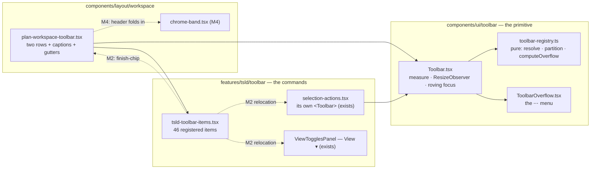
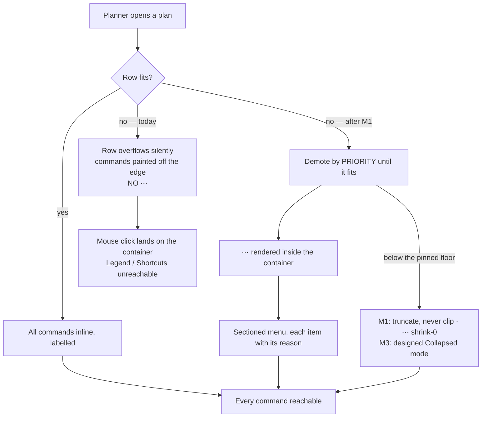

# Feature Spec: The plan-workspace command surface — repair, then consolidate

- **Status:** Draft — **awaiting product-owner approval**
- **Author(s):** feature-analyst (Claude Code), for James Ewbank
- **Date:** 2026-08-11
- **Tracking issue / epic:** _(none yet)_
- **Roadmap link:** plan workspace / TSLD surface (no `docs/ROADMAP.md` row; this arrives from a
  product-owner report, not the roadmap)
- **Related ADR(s):** **ADR-0090** (Proposed — amended by this spec, see §4.6), amending ADR-0031;
  builds on ADR-0028, ADR-0030, ADR-0055 §3, ADR-0056 §1, ADR-0059, ADR-0064 §3, ADR-0080,
  ADR-0081, ADR-0082, ADR-0088 D1–D3, ADR-0089

---

## 0. What this spec is built on, and which of its inputs are dead

Three documents precede this one. They do not have equal standing and the difference decides the
plan, so it is stated first.

| Input                                           | Standing                                                                                                 |
| ----------------------------------------------- | -------------------------------------------------------------------------------------------------------- |
| `docs/specs/workspace-layout/m0-measurement.md` | **Authoritative.** Measured in Chromium 1194 against the real workspace at shipped flag defaults.        |
| `docs/specs/workspace-layout/design.md`         | Stage-4 design. **§2 is withdrawn** — arithmetic over class names, falsified. §3–§7 survive on merit.    |
| `docs/adr/0090-…md`                             | **Proposed**, and wrong in three places M0 disproved (§4.6). Editable, and must be edited before Accept. |

**Every pixel figure in this spec is one of two kinds, and each is labelled.** Either it is
_measured_ — reproduced from `m0-measurement.md`'s raw output, which came from
`apps/web/measure-toolbar/{measure,reachability}.spec.ts` — or it is _derived from a measured
anchor_, in which case it says so and names the anchor. Nothing here repeats design.md §2's
6.6 px/character estimates. Every code claim names its file and line, checked in this session
against the working tree (CLAUDE.md §19.10, ADR-0076).

**A limitation of M0 that nothing has recorded, found while checking it.** `measure.spec.ts:137-146`
creates a plan and **never adds an activity**, so `hasDiagram` was false throughout. `finish-chip`
carries `isVisible: (ctx) => ctx.hasDiagram` (`tsld-toolbar-items.tsx:2360`) and was therefore
**absent from every reading**. So the measured Row-1 widths are a **lower bound**: on a populated
plan — the only kind a planner has — Row 1 carries one further pinned read-out and is wider still.
The defect below is at least as bad as measured, and probably worse. This is the first thing M2's
re-measurement must fix (§4.5, plan task M2-T0).

---

## 1. Business understanding

### Problem

The product owner reports that the TSLD command surface "does not work well" on a 24″ 1920×1080
monitor at 100% browser scaling, and that **fewer controls are visible at 100% than at 90%**.

Measurement turned that complaint into something sharper than a layout preference:

> **At 1920×1080 @100% — the reporter's exact configuration — two commands on Row 1 are rendered
> entirely outside their `overflow-hidden` container, with no `⋯` offering them. They are
> pointer-unreachable. A mouse or touch user cannot open the Legend or the Keyboard-shortcuts sheet
> at the commonest desktop resolution there is.**

Measured (`m0-measurement.md`, reachability pass):

| Item        | width  | overhang past the container's right edge | visible width | pointer reaches it               |
| ----------- | ------ | ---------------------------------------- | ------------- | -------------------------------- |
| `summary`   | 126 px | 9 px                                     | 116 px        | yes                              |
| `legend`    | 32 px  | 58 px                                    | **0 px**      | **no** (keyboard-reachable only) |
| `shortcuts` | 32 px  | 94 px                                    | **0 px**      | **no** (keyboard-reachable only) |

Row 1's `scrollWidth` is **1926** against a `clientWidth` of **1832** — 94 px over — and
`overflowPresent` is **false**. The `⋯` is not rendered at all, so the two controls are not "in the
overflow menu"; they are nowhere. They stay focusable because a browser scrolls an `overflow: hidden`
box to reveal a focused descendant, which is why nothing in the product's keyboard-driven test suites
ever noticed.

It is worse on the device the request added to the target list:

| Viewport                         | Measured                                                                                                                                                                       |
| -------------------------------- | ------------------------------------------------------------------------------------------------------------------------------------------------------------------------------ |
| **1440** (Surface Pro landscape) | the `⋯` button is 32 px wide with **1 px visible** — and it is the only route to **14** Row-1 commands                                                                         |
| **960** (Surface Pro portrait)   | `isolate-logic` 0 px visible, `summary` 0 px visible, **and the `⋯` itself 0 px visible**; Row 2's `⋯` also 0 px, holding Share and Comments; `print` reduced to a 6 px sliver |
| **768**                          | Row 1's `⋯` holds 16 items, Row 2's holds 8; `summary` clipped                                                                                                                 |

**The reported symptom is a shadow of this.** At 2133 CSS px (1920 @ 90%) the row measures
`scrollWidth === clientWidth === 2045` and nothing is clipped; at 1920 it is 94 px over and three
controls fall off the edge. The owner was not seeing controls "move into a menu" at 100% — they were
seeing controls **vanish**.

**And a second problem sits underneath it, which the repair does not solve.** Row 1's floor is
measured: at both 960 and 768 the row reports `scroll=1177` with 8 items inline and 16 in the `⋯` —
every demotable command is already gone, so **1177 px is the width of the pinned set plus the `⋯`**.
At Surface Pro portrait the container is **872 px**. The row is **305 px below its own floor**, and
no amount of correct overflow arithmetic changes that: the items that will not fit are the ones the
primitive is forbidden to move (`Toolbar.tsx:153-156` demotes only `onActivate` items; `render` items
are pinned by the rule at `:117`). Fixing the calculation makes the surface honest. It does not make
it fit.

### Users

All of these are members of one organisation and reach the surface through the authenticated shell
(ADR-0029). The External Guest never sees it — no route file under `apps/web/src/routes` matching
`*share*` imports `Toolbar` or the plan workspace (searched this session), so the ADR-0051 F-M4
guest view is out of scope entirely.

| Role                                     | What they meet today                                                                                                                                              |
| ---------------------------------------- | ----------------------------------------------------------------------------------------------------------------------------------------------------------------- |
| **Planner** (desktop 1920)               | 24 Row-1 controls + 19 Row-2 controls; three Row-1 controls pointer-unreachable                                                                                   |
| **Planner** (Surface Pro landscape 1440) | 10 Row-1 controls inline, 14 behind a `⋯` that is 1 px wide                                                                                                       |
| **Planner** (Surface Pro portrait 960)   | 8 inline, 16 behind a `⋯` that is 0 px wide, plus two pinned controls at 0 px                                                                                     |
| **Contributor**                          | the same rows; the pen-gated authoring cluster shades as a set (`plan-workspace-toolbar.tsx:767,782` — one `authoringEnabled` per row)                            |
| **Viewer**                               | the same rows, with more of Row 2 shaded; **the unreachable controls are Legend and Keyboard shortcuts, which are the two a Viewer most needs**                   |
| **Org Admin**                            | as Planner                                                                                                                                                        |
| **AT / keyboard user**                   | 43 roving stops across two toolbars, three of them non-operable read-outs; the clipped controls are reachable, so this user is the only one who is _not_ affected |

The last row is the sharp one: **this defect is invisible to keyboard and screen-reader testing and
visible only to a pointer.** That is the inverse of the usual accessibility failure, and it is why
the product's existing a11y gates (`e2e-toolbar/toolbar.spec.ts:121-123` runs axe on this exact
surface) pass while a mouse user cannot click two buttons.

### Primary use cases

1. A planner on a 1920×1080 monitor opens the Legend, or the Keyboard-shortcuts sheet, with a mouse.
2. A planner on a Surface Pro (landscape and portrait) reaches every plan command with a finger.
3. A planner finds a command by looking, not by opening a `⋯` and reading a list of 16.
4. A Viewer or Contributor reads the plan's finish date and summary without a command bar in the way.
5. Every command that exists today still exists, at a place someone can name.

### User journeys

**Happy path, today, broken.** Planner opens a plan at 1920×1080 → Row 1 renders 24 controls, 21 of
them labelled → the row is 94 px wider than its box → Legend and Keyboard shortcuts are painted
outside it and clipped to nothing → the planner clicks where the Legend used to be and hits the
container.

**Happy path, after M1.** The row measures itself honestly → it demotes commands until it fits →
the `⋯` renders, inside the container, and holds them with their reasons (`ToolbarOverflow.tsx:74-110`,
ADR-0082) → nothing is off the edge at any width.

**Happy path, after M2–M3.** Row 1 holds ~12 stops instead of 24 → they are labelled at 1920 with no
`⋯` → at 1440 they are still all inline → at 960 a designed one-row collapse answers, rather than a
floor collision.

See §4 for the flow diagrams.

### Expected outcomes

1. No command in the plan workspace is pointer-unreachable, at any width, ever again — with a gate
   that runs in a **real browser**, because the whole defect is invisible to jsdom, which has no layout.
2. The Surface Pro becomes a supported target with stated numbers, not an unknown.
3. Row 1 becomes small enough that its labels are affordable **honestly**, which is what ADR-0031's
   2026-07-15 amendment asked for and has never had.
4. The `⋯` becomes a designed answer at small widths instead of a failure symptom.
5. The register stops disagreeing with itself about `VITE_CANVAS_WORKSPACE` (§3, register correction).

### Success criteria

Every one is measured by the M1 gate (§4.4), at eight widths, in Chromium, against a **populated**
plan.

| #   | Criterion                                                                                                                                                                       | Milestone |
| --- | ------------------------------------------------------------------------------------------------------------------------------------------------------------------------------- | --------- |
| S1  | At every width in {2133, 1920, 1600, 1440, 1280, 1024, 960, 768}, **no `[data-toolbar-item]` box extends past its container's right edge**                                      | M1        |
| S2  | Whenever anything is demoted, the `⋯` renders and is **fully inside** the container (visible width ≥ its own width − 1 px)                                                      | M1        |
| S3  | The set of reachable command ids (inline ∪ `⋯` menu) at every width **equals** the set at the widest width — nothing lost                                                       | M1        |
| S4  | At **1920** and **1440**, both rows have `scrollWidth ≤ clientWidth + 1` — the honest-fit invariant                                                                             | M1        |
| S5  | At **1920**, both rows render every inline command **with its label** and no `⋯`                                                                                                | M2        |
| S6  | At **1440** (Surface Pro landscape), every Row-1 command is inline (icon-only acceptable) and the `⋯` is empty                                                                  | M2/M3     |
| S7  | At **960** (Surface Pro portrait) and **768**, the surface is a designed collapse: `scrollWidth ≤ clientWidth + 1` with the `⋯` as the stated answer                            | M3        |
| S8  | **No command is deleted.** All 46 registered items are reachable and this spec says where (§4.5)                                                                                | M2        |
| S9  | Zero non-operable read-outs remain inside a `role="toolbar"`                                                                                                                    | M2        |
| S10 | WCAG 2.2 AA holds throughout; the axe scan in `e2e-toolbar/toolbar.spec.ts:121` stays green and the house ≥ 44 px touch rule (`docs/UX_STANDARDS.md:137`) is **not made worse** | all       |
| S11 | The measured canvas height gain from the header merge is **stated as a measured number**, not derived                                                                           | M4        |

### Open questions

Critical ones are in §6 with the answer that changes the design. Everything else has a default,
stated where it belongs and adopted unless overruled.

---

## 2. Functional requirements

### User stories & acceptance criteria

> **US-1** — As a **planner on a 1920×1080 monitor**, I want every toolbar command to be clickable,
> so that I can open the Legend and the keyboard-shortcuts sheet with my mouse.
>
> **Acceptance criteria**
>
> - **Given** a populated plan at 1920×1080 @100% **when** the workspace renders **then** no
>   `[data-toolbar-item]` node's bounding box extends past its toolbar container's right edge.
> - **Given** the same **when** any command has been demoted **then** a `⋯` button is rendered,
>   entirely inside the container, and holds exactly the demoted commands.
> - **Given** the same **when** `document.elementFromPoint` is called at each inline control's centre
>   **then** it returns that control or a descendant of it.
> - **Given** the same **then** `scrollWidth ≤ clientWidth + 1` on both rows.

> **US-2** — As a **planner on a Surface Pro**, I want every plan command to be reachable in both
> orientations, so that the device is usable on site.
>
> **Acceptance criteria**
>
> - **Given** a populated plan at 1440×960 **then** the `⋯`, if rendered, is fully visible, and every
>   command is reachable inline or through it.
> - **Given** a populated plan at 960×1280 **then** the same holds, including for the two controls
>   measured at 0 px visible today (`isolate-logic`, `summary`) and for Row 2's `print`.
> - **Given** either orientation **when** a control is touched **then** its target is no smaller on
>   the minor axis than today's 36 px, and the major axis is ≥ 40 px under `@media (pointer: coarse)`
>   (M3). The residual gap to the house 44 px rule is **recorded as debt, not claimed closed**.

> **US-3** — As a **planner**, I want the commands I use hourly to be the last to leave the bar, so
> that width pressure does not take Zoom and Fit while keeping Legend.
>
> **Acceptance criteria**
>
> - **Given** a row under width pressure **when** demotion runs **then** it runs in a declared
>   `priority` order, not in `order` (which `toolbar-registry.ts:115` documents as _"Sort order
>   **within the group**"_ and `computeOverflow` at `:310-318` reuses as a cross-group demotion key).
> - **Given** a width that demotes some but not all of Row 1 **then** `Fit to plan` survives a
>   demotion that takes `Keyboard shortcuts`. **Verified red first** against the current sort.
> - **Given** any width **then** `Early`/`Visual` and `Diagram`/`Gantt` are each in the `⋯` together
>   or on the bar together — never split.

> **US-4** — As a **planner**, I want fewer, better-named controls, so that the row can label itself
> and I can find a command by reading rather than by opening a menu of sixteen.
>
> **Acceptance criteria**
>
> - **Given** 1920 after M2 **then** Row 1 shows ≤ 13 stops, all labelled, with no `⋯`.
> - **Given** any width **then** every one of the 46 registered commands is reachable, and §4.5 names
>   the surface each lives on.
> - **Given** a command whose own `isEnabled` requires a selection **then** it lives on the selection
>   bar (`selection-actions.tsx:395` already renders its own `<Toolbar>`), not on a persistent row.
> - **Given** the `⋯` is open **then** its items are grouped into `MenuSection`s with separators, as
>   the Add/Link/Export menus in the same file already are — not the flat list at
>   `ToolbarOverflow.tsx:74-110`.

> **US-5** — As a **Viewer or Contributor**, I want a read-out to look like a fact and a command to
> look like a command.
>
> **Acceptance criteria**
>
> - **Given** any width after M2 **then** `finish-chip`, `next-conflict-status` and `search-status`
>   are not inside a `role="toolbar"`; the Toolbar's `presentational` escape hatch
>   (`Toolbar.tsx:246-252`, `toolbar-registry.ts:162-168`) has no remaining consumer on either row,
>   and its docblock says so.
> - **Given** a Viewer **then** the pen-gated set still shades as one contiguous visible set
>   (ADR-0031 §4) — a `penGated` item may never leave the authoring cluster, asserted by a registry test.

> **US-6** — As a **planner**, I want the two rows' captions to describe their contents.
>
> **Acceptance criteria**
>
> - **Given** the workspace **then** the string "Navigate" is not simultaneously the visible Row-1
>   caption (`plan-workspace-toolbar.tsx:760`) and the `frame` group's `aria-label`
>   (`Toolbar.tsx:98`).
> - **Given** either row **then** no two `role="group"` regions on screen share an `aria-label` while
>   holding different memberships — today `object` appears on **both** rows as "Plan actions", holding
>   `finish-chip`+`summary` on Row 1 and nine unrelated actions on Row 2.

> **US-7** — As the **product owner**, I want the register to say what is true.
>
> **Acceptance criteria**
>
> - `docs/TECH_DEBT.md:2011-2012` says **seven** `VITE_CANVAS_WORKSPACE` flag-off harnesses, matching
>   `scripts/flag-retirement.json:320` and the seven configs that pin it.
> - `CLAUDE.md` §16 carries an **ADR-0090** entry.
> - `docs/adr/0090-…md` no longer asserts the three things M0 disproved (§4.6).

### Workflows

**W1 — the row measures itself (every render, and on every container resize).**

1. `Toolbar` resolves and partitions items (`resolveItems`, `partitionByTier`).
2. `measure()` reads the container's `clientWidth`, each item's box, and — **new** — the row's own
   chrome (the container gap and each group's rule/margin/padding), which nothing reads today.
3. `computeOverflow` is handed a budget that includes that chrome and demotes from the `priority`
   queue until the row genuinely fits.
4. Label promotion is costed against the same honest total.
5. `ResizeObserver` re-runs (2)–(4) on container resize (`Toolbar.tsx:223-229`).

**W2 — a command is demoted.** It leaves the bar, appears in the `⋯` as a `MenuItem` inside its
group's `MenuSection`, keeps its disabled reason (ADR-0082), and stays one roving stop away.

**W3 — the row is below its pinned floor.** Below the width at which even the un-demotable set fits,
the row's behaviour becomes **defined**: it truncates its labelled pinned controls rather than
clipping them, and the `⋯` is `shrink-0` so it is never the thing that disappears. M3 replaces this
fallback with a designed Collapsed mode.

**W4 — a planner relocates.** After M2, three selection-gated commands appear on the selection bar
when a bar is selected; five display lenses appear in `View ▾`; the deliverables appear behind
`Share & export ▾`; plan-management actions behind `Plan ▾`.

### Edge cases

| Case                                                                                                            | Expected                                                                                                                                                                                                        |
| --------------------------------------------------------------------------------------------------------------- | --------------------------------------------------------------------------------------------------------------------------------------------------------------------------------------------------------------- |
| Container narrower than the pinned set (measured: 872 < 1177 at 960)                                            | Truncate, never clip; `⋯` always fully visible (M1). M3 gives it a Collapsed mode instead.                                                                                                                      |
| Zero demotable items on a row                                                                                   | No `⋯` rendered (today's behaviour, `Toolbar.tsx:385`). Unchanged.                                                                                                                                              |
| Every item on a row disabled (a Viewer on Row 2)                                                                | The row still renders; ADR-0082's "a menu of nothing but refusals renders no trigger" applies to **menus**, not to a toolbar row.                                                                               |
| An item becomes visible mid-session (`finish-chip` after the first recalculation, `search-status` while typing) | The row re-measures and may demote. It must not oscillate: the label decision keeps its 32 px `LABEL_PROMOTION_MARGIN_PX` dead-band (`Toolbar.tsx:36`) and the layout mode gains its own 48 px hysteresis (M3). |
| A demoted item's cached width is stale                                                                          | Preserved behaviour — `widthCacheRef` (`Toolbar.tsx:130-137`) exists to stop the flip-flop and is not touched.                                                                                                  |
| Browser with no 2D context (`measureLabelWidth` returns `null`)                                                 | Labels stay off; the **fit** invariant must still hold, because it no longer depends on text measurement.                                                                                                       |
| The user drags a window edge across a mode boundary                                                             | 48 px hysteresis per boundary (M3), unit-tested at both edges.                                                                                                                                                  |
| A plan with no activities                                                                                       | `finish-chip` absent (`:2360`); several lens items shaded with reasons. The gate measures a **populated** plan so this is the narrower case, not the tested one.                                                |
| The Late-start overlay is on                                                                                    | `authoringEnabled` is false for a Planner holding the pen (`plan-workspace-toolbar.tsx:767,782`); the Build cluster shades as a set with the existing explanation at `:840-850`. Unchanged.                     |
| Gantt view active (`?view=gantt`, ADR-0059)                                                                     | Canvas-only commands shade with a reason (ADR-0059 M6). Relocating a canvas-only command to the selection bar must not lose that reason.                                                                        |

### Permissions

**No permission changes.** This is chrome; every command keeps the gate it has.

| Gate                                              | Where                                                                              | Effect                                                                                           |
| ------------------------------------------------- | ---------------------------------------------------------------------------------- | ------------------------------------------------------------------------------------------------ |
| Organisation scope (ADR-0012/0016)                | the route, not the toolbar                                                         | unchanged                                                                                        |
| Role (Viewer / Contributor / Planner / Org Admin) | fused with the pen into `model.canEditSchedule` (`plan-workspace-toolbar.tsx:767`) | unchanged — the toolbar cannot tell role from pen, by design (ADR-0060)                          |
| The pen (ADR-0028)                                | `authoringEnabled` → every `penGated` item disables as a set                       | unchanged, and **protected**: US-5's registry test forbids a `penGated` item leaving the cluster |
| External Guest (ADR-0051)                         | not applicable — no share route imports this surface                               | unchanged                                                                                        |

**This is a frontend-only change. No API call, no DTO, no permission, no migration.** The CPM engine
is not imported and `computeSchedule` is not reachable from any file this epic touches, so the
ADR-0034 recalculation parity gate is untouched **by construction** — in its honest form: there is
nothing here to hold parity for.

### Validation rules

No user input is added, so there is no Zod or `class-validator` surface. Two **invariants** replace
validation, and both are enforced by a test rather than by review:

- **Fit invariant.** For every rendered row: `scrollWidth ≤ clientWidth + 1`, and every
  `[data-toolbar-item]` box is inside the container box. Enforced by the M1 browser gate.
- **Reachability invariant.** `inline ∪ overflow == the full visible item set`, at every width.
  Enforced by the same gate, comparing against the **widest** measured width rather than a list typed
  into the test — the property `measure.spec.ts:20-22` already established and which must survive.

### Error scenarios

There are no server errors in scope. The failure modes are layout failures, so the table lists what
"wrong" looks like and what catches it.

| Scenario                                              | Detection                                    | User-facing result                                     | Caught by                        |
| ----------------------------------------------------- | -------------------------------------------- | ------------------------------------------------------ | -------------------------------- |
| A row overflows its container                         | `scrollWidth > clientWidth + 1`              | commands painted off the edge                          | M1 gate, S1/S4                   |
| The `⋯` is itself clipped                             | its box extends past the container           | the only route to N commands is 1 px wide              | M1 gate, S2                      |
| A command is neither inline nor in the `⋯`            | set difference against the widest width      | the command does not exist                             | M1 gate, S3                      |
| Demotion order takes a hot command first              | ordered assertion on the `⋯` contents        | Zoom gone, Legend present                              | M1 unit test, verified red first |
| A two-state segment splits across bar and menu        | assertion at a demoting width                | a switch showing one state                             | M1 unit test                     |
| A `penGated` item drifts out of the authoring cluster | registry test over `buildTsldToolbarItems()` | the read-only↔editing flip stops being one legible set | M2 registry test                 |
| A relocated command loses its keyboard route          | journey assertion per relocation             | keyboard-only user stranded                            | M2 journey                       |
| Layout mode oscillates on a window drag               | unit test at both edges of each boundary     | the bar flickers under the cursor                      | M3 unit test                     |

---

## 3. Technical analysis

| Area           | Impact      | Notes                                                                                                                                                                                                                                                                |
| -------------- | ----------- | -------------------------------------------------------------------------------------------------------------------------------------------------------------------------------------------------------------------------------------------------------------------- |
| Frontend       | **high**    | `components/ui/toolbar/{Toolbar.tsx,toolbar-registry.ts,ToolbarOverflow.tsx}`, `features/tsld/toolbar/{tsld-toolbar-items.tsx,selection-actions.tsx}`, `components/layout/workspace/plan-workspace-toolbar.tsx`, and (M4) `components/layout/chrome/chrome-band.tsx` |
| Backend        | **none**    | no module, service or endpoint is touched                                                                                                                                                                                                                            |
| Database       | **none**    | no model, column, index, constraint or migration — so the database-architect task does **not** open (CLAUDE.md §19.3 applies to schema changes; there are none, confirmed rather than assumed)                                                                       |
| API            | **none**    | no endpoint, DTO or OpenAPI change                                                                                                                                                                                                                                   |
| Security       | **none**    | no authz surface; the pen and RBAC gates are consumed, not modified. A relocation must not widen a gate — asserted by reusing the same gate object rather than assembling a second one (the ADR-0062 identity-test pattern)                                          |
| Performance    | **low–med** | `measure()` runs per resolve pass and per `ResizeObserver` tick. The change adds one `getComputedStyle` read for the container gap and N group-box reads. Must be measured, not assumed — M1-T2 records a before/after                                               |
| Infrastructure | **low**     | one new Playwright config + one new CI step (`.github/workflows/ci.yml`, beside the existing `test:e2e:toolbar` at `:227`)                                                                                                                                           |
| Observability  | **none**    | no logs, metrics or traces                                                                                                                                                                                                                                           |
| Testing        | **high**    | a **new browser gate** (the defect is invisible to jsdom); unit tests on `computeOverflow`'s new budget and the `priority` sort, each verified red first; a registry test for the pen-cluster rule; axe stays green                                                  |

### Dependencies

- **Nothing must land first.** M1 is self-contained in `Toolbar.tsx` + `toolbar-registry.ts`.
- **M2 depends on M1**, because a consolidation measured against a row that mis-measures itself is
  measured against nothing.
- **M3 depends on M2**, because the ladder's mode thresholds are functions of the consolidated item
  set, not of today's.
- **M4 (header merge) is independent of M1–M3** and touches ADR-0055 §3 territory; it is sequenced
  late so it can be reverted alone.
- **M6 (flag retirement) depends on nothing in this epic** except the decision to do it here; the
  seven flag-off harnesses drive the **legacy stacked plan-detail page**
  (`src/routes/plan-detail.tsx:120`), which has no toolbar rows, so they do not interact with M1–M4.
- **No new dependency, no new `VITE_` flag** (§4.7).

### Register correction found and verified in this session

`docs/TECH_DEBT.md:2011-2012` says `VITE_CANVAS_WORKSPACE` "remains open with **five** harnesses left
rather than seven."

**Verified by grep over `apps/web/playwright*.config.ts`: seven configs pin it `'false'`** —
`playwright.config.ts:70` (base), `playwright.edit.config.ts:72`, `playwright.sub-day.config.ts:68`,
`playwright.programme.config.ts:63`, `playwright.assignment-lag.config.ts:73`,
`playwright.activity-editor.config.ts:74`, `playwright.notes.config.ts:61`. Fourteen further configs
pin it `'true'`. `scripts/flag-retirement.json:320` names all seven correctly, so the debt register
contradicts the flag register. ADR-0089 converted `sub-day` and `assignment-lag` off
**`VITE_ACTIVITY_EDITOR_TABS`**, not off this flag — both still pin it. **The design and ADR-0090
were right and the debt row is wrong**; corrected in this epic's first PR rather than stepped over
(the ADR-0071 lesson).

### Two further register/tooling facts, found while checking

- **`measure-toolbar` is outside the repo's own gates.** It is absent from
  `apps/web/tsconfig.json`'s `include` list (which names 30 other `e2e-*` directories, `:13-48`) and
  has no `test:e2e:*` script in `apps/web/package.json`. So the harness that produced the numbers
  this epic rests on does not typecheck or lint with the repository — the exact failure
  `tsconfig.json:15-17` records having fixed for `scripts/`. Repaired in M1.
- **`e2e-toolbar` is not a safe home for the fit gate as configured.** `playwright.toolbar.config.ts:67`
  pins `VITE_CANVAS_AUTHORING: 'false'`, and `tsld-toolbar-items.tsx:2146,2165` branch on
  `CANVAS_AUTHORING_ENABLED` for the Row-2 `add-activity` split-button and `link-tool`. So that
  harness's **Row 2 is not the shipped composition**, and Row 2 is where `print` is clipped at 960.
  This decides where the gate lives (§4.4).

---

## 4. Solution design

### 4.1 Architecture overview

Nothing new is introduced. One primitive gains an honest budget and a layout mode; the TSLD registry
sheds items to surfaces that already exist.



### 4.2 Data flow — the measurement pass, today and repaired

The defect is entirely inside this sequence.

```mermaid
sequenceDiagram
  participant RO as ResizeObserver
  participant M as Toolbar.measure()
  participant DOM as Layout
  participant CO as computeOverflow (pure)

  Note over M,CO: TODAY — the miscount
  RO->>M: container resized
  M->>DOM: container.clientWidth  → 1832
  M->>DOM: each item box          → Σ ≈ 1769
  M->>CO: budget = 1832 − Σpinned, widths = Σdemotable
  Note right of CO: totalWidth ≤ availableWidth → early return<br/>toolbar-registry.ts:306 — "everything fits"
  CO-->>M: overflow = []
  M-->>DOM: no ⋯; labels promoted
  DOM-->>DOM: real scrollWidth = 1926 > clientWidth 1832
  Note over DOM: 94 px of gaps + group rules nobody measured<br/>→ summary/legend/shortcuts painted outside the box

  Note over M,CO: REPAIRED — the budget sees the row
  RO->>M: container resized
  M->>DOM: container.clientWidth, item boxes, GROUP boxes, computed column-gap
  M->>M: chrome = ΣgroupWidths + (groups−1)·gap − Σitemwidths
  M->>CO: budget, widths, chrome, gap
  CO-->>M: overflow = [ … ] in PRIORITY order
  M-->>DOM: ⋯ rendered inside the container; labels costed honestly
```

**The mechanism is a leading candidate, not a conclusion, and M1 establishes it by instrumentation
before anything is changed.** What is _cited_ rather than inferred: `pinnedWidth` sums pinned item
boxes (`Toolbar.tsx:172-174`), `widths` the demotable ones (`:175`), the budget is
`Math.max(0, available − pinnedWidth)` (`:181`), the early return is `totalWidth <= availableWidth`
(`toolbar-registry.ts:306`), and the row's chrome — the container's `gap-1` (`Toolbar.tsx:322`) and
each group's `gap-1` plus `ml-1 border-l pl-2` (`:331`) — is measured by nothing, because the item
refs sit on the controls (`:340`, `:360`).

_Derived from the measured anchor, not observed:_ 24 inline items across 6 rendered groups at 1920
implies ≈ 18 intra-group gaps (72 px) + 5 inter-group gaps (20 px) + 5 group rules at
`ml-1`+`border`+`pl-2` (65 px) ≈ **157 px**, against a measured overshoot of **94 px**; and
`LABEL_PROMOTION_MARGIN_PX` is 32 px (`Toolbar.tsx:36`), far short of covering it. Right order of
magnitude, and the sign is right, but the arithmetic does not land on 94 — which is exactly why
M1-T1 instruments rather than assumes.

**Two rival candidates, and one of them can already be excluded.** design.md F8 proposes the two
`ml-auto` boxes sharing a flex line (`Toolbar.tsx:333` `alignEndGroup` and `:386` the overflow
wrapper). **At 1920 the overflow wrapper is not rendered at all** (`overflowPresent: false`,
measured), so there is only one `ml-auto` on the line and F8 cannot be the 1920 mechanism. It may
still matter at 1440/960 where the `⋯` exists. The third candidate — that promotion and overflow are
decided in one pass from pre-label widths — is answerable by reading: `measure` depends on
`autoLabelsFit` (`Toolbar.tsx:212`), so it re-runs after promotion and reaches the same wrong
conclusion, because the chrome is still unseen. _That last sentence is reasoned from the code, not
observed; M1-T1 confirms it._

### 4.3 User flow



### 4.4 The gate — where it lives, and why it is not `e2e-toolbar`

**A new Playwright suite, `apps/web/e2e-toolbar-fit/`, driven by a new
`apps/web/playwright.toolbar-fit.config.ts`, wired as its own CI step (`test:e2e:toolbar-fit`)
beside the existing `test:e2e:toolbar` at `.github/workflows/ci.yml:227`.**

Three reasons, each checkable:

1. **jsdom cannot see this.** The unit suites render the real `Toolbar`, and every box is 0×0 there;
   `measureLabelWidth` returns `null` with no 2D context (`Toolbar.tsx:62`) and the promotion pass
   short-circuits. Nothing in `apps/web/src/**/*.test.tsx` can fail on a clipped control.
2. **`e2e-toolbar` drives a non-shipping Row 2.** `playwright.toolbar.config.ts:67` pins
   `VITE_CANVAS_AUTHORING: 'false'` — deliberately, because that journey asserts the ADR-0031 plain
   Add toggle (`:61-64`) — and `tsld-toolbar-items.tsx:2146,2165` branch on it. A fit gate that runs
   there would measure a Row 2 no planner has, on the row where `print` is clipped at 960.
3. **The fit gate's defining requirement is "no `VITE_` pins at all"**, which is the property
   `playwright.measure-toolbar.config.ts:16-18` already identified and wrote down: ADR-0088 D1
   established that a published image carries every flag at its default, so the surface worth gating
   is the default build. **No other config in the estate has that property**; every one of the other
   31 pins something.

**So `apps/web/measure-toolbar/` stays a harness and does not become the gate**, and its
docblocks say so in both directions (ADR-0081 §3): `measure.spec.ts` reports and asserts nothing;
`e2e-toolbar-fit/fit.spec.ts` asserts and reports nothing. The harness is repaired in the same PR by
adding it to `apps/web/tsconfig.json`'s `include` and giving it a `measure:toolbar` script, so it
typechecks against the code it measures.

**The gate's journey differs from the harness's in one decisive way: it populates the plan.**
`measure.spec.ts:137-146` measured an empty plan and therefore never saw `finish-chip` (`:2360`). The
gate follows `e2e-toolbar/toolbar.spec.ts:51-54` — take the pen, add two activities, recalculate —
before measuring, so it gates the row a planner actually has.

**Verified red first.** Before the fix lands, the gate must be run against the current code and shown
to fail at 1920, 1440, 960 and 768 with the measured symptoms. A gate that has only ever been green
proves nothing (ADR-0074 M5, ADR-0084 D5).

### 4.5 Where the 46 commands go — Option B, re-derived against measurement

design.md §4 recommends Option B (one persistent row plus a consolidated second row; 46 items → ~24
stops; nothing deleted). It was chosen against §2's arithmetic, which is withdrawn. **Re-derived
against the measured numbers, it survives — and the measurement makes the case for it stronger, not
weaker.**

**Why it survives, in three measured facts.**

1. **Row 1's pinned floor is 1177 px, measured.** At both 960 and 768 the row reports `scroll=1177`
   with 8 inline and 16 demoted: every demotable is gone, so 1177 is the un-demotable set plus the
   `⋯`. Surface Pro portrait gives it **872 px**. The row is **305 px below its own floor**, and the
   overflow mechanism is structurally unable to help, because `render` items never demote
   (`Toolbar.tsx:153-156`, rule at `:117`). **Only removing pinned items closes that gap.** Option B
   removes four of the nine pinned Row-1 controls (`colour-by`, `filter`, `isolate-logic`,
   `finish-chip` — all `render`, cited below), which is the only lever that exists.
2. **Labels cannot be bought with width at 1920, even generously.** Measured: the labelled row needs
   1926 px and the container is 1832. Removing the 73 px caption gutter and its 8 px gap
   (`plan-workspace-toolbar.tsx:87`, `:757`) raises the container to 1904 — still 22 px short of
   1926, and 54 px short of the 1958 the promotion pass demands (1926 + the 32 px margin at
   `Toolbar.tsx:36`). **There is no width edit that keeps today's item count labelled at 1920.**
   Fewer items is the only route to the thing ADR-0031's 2026-07-15 amendment asked for.
3. **The honest repair costs labels unless the count falls.** _Reasoned from the code, not observed:_
   once the budget includes the ~94 px it is missing, the promotion pass at 1920 will decline the
   labels and the row will render icon-only — which is correct, reachable, and **visibly a step
   backwards from the 21 labels the owner sees today**. M2 is what buys them back honestly. This is
   stated here rather than discovered at review, and M1-T3 measures it before merge (§6, Q-A).

**Where each command goes.** Unchanged from design.md §4.1 in substance; the destinations are
surfaces that already exist. Every relocation rule below is derived from something in the code.

| Rule                                                                              | Evidence                                                                                                                                                                                                                                                                      | Moves                                                                                                                        |
| --------------------------------------------------------------------------------- | ----------------------------------------------------------------------------------------------------------------------------------------------------------------------------------------------------------------------------------------------------------------------------- | ---------------------------------------------------------------------------------------------------------------------------- |
| A command whose own `isEnabled` requires a selection belongs on the selection bar | `zoom-to-selection` `:1755-1763`, `isolate-logic` `:2021`, `float-paths` `:2076`; `selection-actions.tsx:395` already renders a `<Toolbar>`                                                                                                                                   | 3 commands                                                                                                                   |
| A display lens belongs in `View ▾`                                                | `ViewTogglesPanel` groups Structure / Markers / Insight overlays; ADR-0056 M7 moved "Month bands" there on this reasoning                                                                                                                                                     | `colour-by`, `baseline-overlay`, `resource-view`, `over-allocation`, `legend`                                                |
| A fact is not a control                                                           | `finish-chip` `presentational: true` `:2359`; the escape hatch exists at `Toolbar.tsx:246-252` because there was nowhere else to put a read-out                                                                                                                               | `finish-chip` → plan header; `next-conflict-status` `:2099` and `search-status` `:2118` fold into the controls they describe |
| A deliverable is not a plan action                                                | `export`/`print`/`share` are `group:'object'` with orders 7/8/9 (`:1644,:1652,:1667`) beside Baselines(2)…Comments(10); measured at 960, Row 2's `⋯` holds exactly **Share… and Comments** and `print` is clipped — the deliverable set is already split by the demotion sort | `history` → `output`; one `Share & export ▾` split-button                                                                    |
| A `penGated` item may never leave the authoring cluster                           | ADR-0031 §4; enforced by a registry test rather than by review                                                                                                                                                                                                                | `snap-to-grid` `:2248` and `clear-visual-placement` `:2277` stay, despite reading like `View ▾` members                      |

Row 1 after M2 (≈ 12 stops): `go-to-date`, `Zoom ▾` (absorbing −/+/Fit/Today below 1280),
`View ▾`, one **Early|Visual** segment, one **Diagram|Gantt** segment, `search` (absorbing `filter`
and `search-status`), `Next conflict` (carrying its count in its label), `Summary ▾`,
`Keyboard shortcuts` at the lowest priority.

Row 2 after M2 (≈ 9 stops): the pen-gated authoring cluster unchanged and contiguous, then
`Report progress…`, `Comments`, `Plan ▾` (baselines · schedule settings · earned value · resource
histogram), `Share & export ▾`.

**One number is deliberately not asserted here.** The per-item widths that would let this be costed
exactly were written to `/tmp/toolbar-m0.json` by `measure.spec.ts:160` and are **not reproduced in
`m0-measurement.md`**, which carries only the row-level summary plus three item widths from the
reachability pass (`summary` 126, `legend` 32, `shortcuts` 32). So the post-M2 row width is
**unmeasured**, and M2-T0 re-runs the harness on a populated plan capturing per-item widths into this
directory before any item is moved. Sizing a consolidation by arithmetic is the exact mistake this
epic exists to correct; it is not repeated here.

### 4.6 Three things ADR-0090 asserts that M0 disproved

ADR-0090 is **Proposed**, so it can and must be corrected before acceptance (ADRs are immutable only
once Accepted — `docs/PROCESS.md` "Change management").

1. **Context, ¶2:** _"The reported symptom is not a bug. `Toolbar.tsx:385-395` renders a visible `⋯`
   whenever anything overflows and every demoted command is reachable inside it."_ **False at every
   width measured except 2133.** At 1920 nothing overflows in the calculation's opinion and three
   controls fall off the edge; at 1440 and 960 the `⋯` itself is clipped to 1 px and 0 px.
2. **Context, ¶3 and D1's premise:** the 2560 px / 2600 px label thresholds. **Inverted.** Measured at
   1920: Row 1 shows **21 labelled items of 24**, Row 2 ten of nineteen. The labels are not missing —
   **the labels are why it breaks.**
3. **D2:** _"until it lands, any measurement of the toolbar is measuring the wrong demotion order."_
   **Superseded by events** — the measurement has been taken, and the finding is that demotion does
   not fire at all where it must. `priority` is a real improvement and stays; it is **not** the
   repair, and the ADR must stop implying it is. Note also that F1's user-visible symptom (_"Fit
   disappears while Keyboard shortcuts stays"_) is **not observed at any measured width**: at 1920
   nothing demotes and at 1440 all twelve tier-2 demotables plus both tier-1 view buttons go together
   (the measured `⋯` list matches the sort at `toolbar-registry.ts:310-318` exactly). It is a latent
   consequence of the sort, like the F3 split-segment risk `m0-measurement.md` records — real, cheap
   to fix, and **not** the evidence for the epic.

**A fourth correction, in ADR-0090's favour:** its D8 register claim (seven harnesses, not five) is
**verified correct** (§3).

Also to be corrected: design.md §2.1's vertical-budget table. **M0 measured no heights at all** —
`measure.spec.ts:78-79` reads `clientWidth`/`scrollWidth` and item boxes, nothing vertical — so every
height figure in that table, and the ≈199 px / ≈244 px / ≈717 px canvas figures derived from it,
remain unverified arithmetic. M4 measures before claiming a canvas gain (S11).

### 4.7 Feature flag: none

**No new `VITE_` flag.** ADR-0088 D1 established that a `VITE_` flag is inlined at build time, that
`apps/web/Dockerfile` declares one `VITE_` build arg and `docker-publish.yml` passes none — so no
operator can switch one off on a deployed container, and a flag here would buy **no rollback at all**.
Worse, a flag selecting between two command surfaces is the **Class A** definition, and
`scripts/flag-retirement.json:549` sets `"classACap": 1` with _"raising it needs an ADR"_ — an ADR
this epic declines to write, since the whole programme's terminal milestone is taking that count to
zero.

The mitigation is the ADR-0061 / ADR-0077 / ADR-0089 one: **small, individually revertible commits**,
one per task, with each milestone a natural revert boundary. M1 in particular is one PR touching two
files plus tests, and reverting it restores today's behaviour exactly.

**This epic fires the estate's last Class A deferral trigger.** `VITE_CANVAS_WORKSPACE` carries
`deferredUntil.trigger = "epic-touch: plan workspace"` (`scripts/flag-retirement.json:317-321`,
debt `#122`). That is this epic, whether or not it acts — so **doing nothing is not neutral**: it
leaves a trigger that has fired sitting in the register unhonoured, which is the ADR-0071 shape one
level down. Following ADR-0089 (do the work that collects the payoff, convert the harnesses, then
retire), the retirement is the programme's **terminal milestone (M6)**, with an explicit off-ramp: if
it threatens M1–M4, the trigger is **re-recorded with a reason** rather than silently ignored.

### 4.8 Database changes

**None.** No model, column, index, constraint or data migration. Confirmed by scope, not assumed —
this epic touches six frontend files and no `apps/api` path. The CLAUDE.md §19.3 database-architect
task therefore does not open; if any milestone acquires a schema change, it opens immediately and
unconditionally.

### 4.9 API changes

**None.** No endpoint, request/response DTO, status code, error or OpenAPI change.

### 4.10 Component changes

| Component                                                             | Change                                                                                                                                                                                                                                                                   | Milestone |
| --------------------------------------------------------------------- | ------------------------------------------------------------------------------------------------------------------------------------------------------------------------------------------------------------------------------------------------------------------------ | --------- |
| `components/ui/toolbar/toolbar-registry.ts` — `computeOverflow`       | takes the row's chrome + inter-item gap; budget arithmetic accounts for both. Stays **pure** (widths in, ids out — the module's stated contract, `:285-294`)                                                                                                             | M1        |
| `components/ui/toolbar/toolbar-registry.ts` — `ToolbarItem`           | gains `priority?: number`, **defaulting to `order`** so no existing item changes behaviour by accident; both docblocks say which question each answers                                                                                                                   | M1        |
| `components/ui/toolbar/Toolbar.tsx` — `measure()`                     | reads group boxes + the computed `column-gap`; derives chrome once per pass and treats it as constant within the pass (so demotion stays monotonic and cannot oscillate)                                                                                                 | M1        |
| `components/ui/toolbar/Toolbar.tsx` — the overflow wrapper (`:386`)   | `shrink-0`, so the `⋯` can never be the clipped thing                                                                                                                                                                                                                    | M1        |
| `components/ui/toolbar/Toolbar.tsx` — group wrappers (`:331`)         | defined sub-floor behaviour: truncate rather than clip                                                                                                                                                                                                                   | M1        |
| `components/ui/toolbar/ToolbarOverflow.tsx`                           | items grouped into `MenuSection`s with separators, as Add/Link/Export already are; the flat list at `:74-110` goes                                                                                                                                                       | M2        |
| `features/tsld/toolbar/tsld-toolbar-items.tsx`                        | relocations per §4.5; two composite segments; `history` → `output`; `Plan ▾` and `Share & export ▾`                                                                                                                                                                      | M2        |
| `features/tsld/toolbar/selection-actions.tsx`                         | receives three selection-gated commands                                                                                                                                                                                                                                  | M2        |
| `components/layout/workspace/plan-workspace-toolbar.tsx`              | caption gutters removed (`:87`, `:757-762`, `:773-777`) — this deletes 73 px per row **and** the "Navigate" caption/`aria-label` collision in one edit; per-row `groupLabels` override so `object` is not "Plan actions" on both rows; hosts the relocated `finish-chip` | M2        |
| `components/ui/toolbar/Toolbar.tsx` — layout mode                     | four modes off the existing `ResizeObserver` (`:223-229`) with 48 px hysteresis                                                                                                                                                                                          | M3        |
| `components/ui/toolbar/toolbar-styles.ts`                             | `@media (pointer: coarse)` keeps `min-h-9` and gains `px-3`. **The shared CVA is not densified** (§6 Q4)                                                                                                                                                                 | M3        |
| `components/layout/chrome/chrome-band.tsx` + the workspace `<header>` | the plan header folds into the band, above the commands it governs                                                                                                                                                                                                       | M4        |

**New components: none.** Every destination — `View ▾`, the selection bar, the plan header, the `⋯` —
already exists. That is the point of Option B and it is what keeps the risk in the primitive rather
than in new surfaces.

### 4.11 Implementation approach & alternatives

**Chosen: repair first, as a milestone that ships alone; then consolidate; then the ladder; then the
height; then the flag.**

The ordering is not a preference. The overflow calculation under-counts the row it exists to measure,
and the consequence is commands a mouse user cannot reach at the commonest desktop resolution there
is. That is a defect in shipped software, its fix is two files, and it must not wait behind a
redesign. Equally, the repair is **not sufficient**: at 960 the pinned floor is 305 px over the
container (measured), and no correct arithmetic fixes that.

**Alternatives, with the reason each is not the answer.**

- **Densify the shared control CVA** (`min-h-9 px-2` → `min-h-8 px-1.5`). Rejected, and the measured
  numbers make the rejection sharper than design.md's did — see §6 Q4. The short version: it would
  buy ≈ 96 px against a measured 94 px overshoot, i.e. it would **appear to fix the defect while
  leaving the miscount intact**, so the next command registered brings it straight back; and it moves
  a 32×36 control to 28×32 on the touch device being added to the target list.
- **Repair in place only** (design.md Option A as a terminus). Adopted as part of M1, rejected as an
  end state: the measured floor is 1177 px against an 872 px container at portrait.
- **A vertical command rail** (Option C). Rejected on ADR-0029 (left edge) and
  `plan-workspace-toolbar.tsx:149-155` (the right edge holds **one dock at a time**, because _"two of
  them plus the Project Explorer rail on a 1280 px screen leaves the picture unreadable"_), plus
  `Toolbar.tsx:320` being `aria-orientation="horizontal"` with one roving order.
- **One row of grouped menu-buttons** (Option D). Rejected on ADR-0082 (a menu whose every item is
  shaded renders no trigger, so a Viewer would watch `Build ▾` vanish), on ADR-0064 (Add/Link/Marquee
  are **modes**; a mode you cannot see armed is verbatim that defect), and on two gestures per command
  on the surface the product exists to be.
- **A third toolbar row, or a fourth floating overlay.** Rejected — ADR-0064 §3 forbids the overlay in
  terms that apply verbatim, and a third row costs permanent height on a surface already asking for it.
- **Rewrite the toolbar primitive.** Rejected: 46 registered items, a roving-focus model, three
  consumers and a suite of unit tests depend on its contract. The repair is a budget correction inside
  one pure function plus one measurement pass.

**Does this need an ADR?** Yes, and it exists: **ADR-0090**, Proposed, amending ADR-0031 (the closed
`TOOLBAR_GROUPS` tuple, the `priority`/`order` split, a layout mode the primitive has never had) and
ADR-0055 §3 (the header merge). Its number is filed in `docs/adr/README.md:116`. It must be corrected
per §4.6 and given its **CLAUDE.md §16 register entry** before acceptance — the authoring session
could not edit that file, and an unentered ADR is exactly how ADR-0071 came to be cited by shipped
code while absent from the register.

---

## 5. Links

- **Implementation plan:** [`./implementation-plan.md`](./implementation-plan.md)
- **Measurement (authoritative):** [`./m0-measurement.md`](./m0-measurement.md)
- **Stage-4 design (§2 withdrawn):** [`./design.md`](./design.md)
- **ADR:** [`../../adr/0090-the-plan-workspace-command-surface.md`](../../adr/0090-the-plan-workspace-command-surface.md)
- **Docs to update by this change:** `docs/TECH_DEBT.md` (#122 count; new residual rows),
  `docs/DESIGN_SYSTEM.md` (the toolbar layout-mode ladder, M3), `docs/adr/0031-*` (the "add a command"
  recipe gains `priority` and the pen-cluster rule), `CLAUDE.md` §16 (ADR-0090 entry),
  `scripts/flag-retirement.json` (M6), `apps/web/tsconfig.json` + `apps/web/package.json` +
  `.github/workflows/ci.yml` (the gate and the harness).

---

## 6. The product owner's seven questions, answered against measurement

design.md §6 answered these against arithmetic that has since been withdrawn. Each answer below is
re-derived; where the answer is unchanged, the **reason** has changed and that is said.

### Q1 — Export / Print / Share are deliverables, not "build". Own group? Own surface?

**Own group: yes. Own surface: no. Unchanged — and now with a measured symptom rather than a
predicted one.**

design.md predicted from the sort that Comments, Share and Print would be the first Row-2 items to
leave the bar. **Measured at 960: Row 2's `⋯` holds exactly `Share…` and `Comments`, and `print` is
clipped to a 6 px sliver.** The deliverable set is split in the shipped product, today, on the device
in the brief — and `export` is exempt only because it happens to be a `render` menu
(`tsld-toolbar-items.tsx` export item, `tier: 2`, `order: 7`), and `render` items never demote.

Rename `TOOLBAR_GROUPS`' reserved `history` slot to `output` rather than growing the tuple: it is a
closed `const` tuple whose closure ADR-0031 §2 exists to defend (`toolbar-registry.ts:19-27`), and
`history` is **verifiably empty** — a repository-wide grep for `'history'` under `apps/web/src`
returns exactly one hit, the tuple declaration itself (`:25`). Re-using it as-is was rejected because
`Toolbar.tsx:104` announces `aria-label="History"` to AT, which would make an accessible name a false
statement. Undo/redo stay in `tools` (`:1391,:1400`), deliberately, to keep the pen-gated set
contiguous.

Own surface: no. `plan-workspace-toolbar.tsx:149-155` records that the right edge holds one dock at a
time.

### Q2 — Could the Legend fold into `View ▾`?

**Yes — and the reason has been upgraded from taxonomy to a live defect.**

design.md's answer was "it costs 36 px, which is noise; move it because it is a taxonomy correction."
Both halves still hold: measured, `legend` is **32 px** wide, ~1.7% of the 1832 px container, so
"moving it saves space" would be a false claim of exactly the ADR-0076 Class 3 kind. And `View ▾` is
the display-toggle panel, which ADR-0056 M7 already established as the home for this class of control
when it moved "Month bands" there.

What is new: **`legend` is one of the two controls measured at 0 px visible and pointer-unreachable at 1920.** The user-visible fact is not "the Legend is in the wrong group"; it is "there is no Legend
button on this monitor". M1 makes it reachable; M2 puts it where it belongs. Do not let M2 take credit
for M1's fix.

### Q3 — Could keyboard shortcuts leave the toolbar?

**Keep it — unchanged answer, same reasoning, and the same upgraded evidence as Q2.**

It is one 32 px button (measured) and `?` is already bound at the workspace root
(`plan-workspace-toolbar.tsx` key scope). But that binding is discoverable only to someone who already
knows it and only once focus is inside the workspace — which is precisely not the new planner it
serves. Deleting the only visible route to the keyboard reference from the surface whose value to a
power user _is_ keyboard operability buys 32 px of a 94 px shortfall.

What is wrong is its **priority**, not its presence: `order: 1` (`:2551`) makes it the second-to-last
Row-1 item in the demotion queue. Under the `priority` split it becomes the lowest priority on Row 1.
Note honestly that this is a **latent** wrong, not an observed one — at 1440 it demotes together with
Zoom, Fit and everything else tier-2 (measured `⋯` list), so no measured width shows "Fit gone,
Shortcuts present". It becomes observable the moment M1 makes demotion fire at intermediate widths,
which is the argument for shipping `priority` **with** the repair rather than after it.

### Q4 — Height / icon size / text size

**Re-derived, and the answer changes its reasoning entirely. Do not densify. Density is not the
lever, and here it would be actively harmful.**

design.md answered "density returns 8 px, 1.1% of the canvas" — a **vertical** argument, and one
resting on canvas heights M0 did not measure and which remain unverified (§4.6). The measured problem
is **horizontal**: Row 1 is 94 px over its container at 1920 with labels already on.

So the honest re-derivation is worse for density than the original answer was:

| Scale                                         | Icon-only button | WCAG 2.5.8 (24×24)   | `docs/UX_STANDARDS.md:137` (≥44 px) | Horizontal gain          |
| --------------------------------------------- | ---------------- | -------------------- | ----------------------------------- | ------------------------ |
| Today `min-h-9 px-2` (`toolbar-styles.ts:42`) | 32 × 36          | passes               | **already fails**                   | —                        |
| `min-h-8 px-1.5`                              | 28 × 32          | passes (4 px margin) | fails harder                        | ≈ 4 px × ~24 ≈ **96 px** |
| `min-h-7 px-1`                                | 24 × 28          | **at the limit**     | fails                               | ≈ 192 px                 |

**96 px against a measured 94 px overshoot is the trap, not the fix.** A density change would make
the 1920 symptom disappear while leaving the calculation wrong, so the defect returns the next time
anybody registers a command — and it would return silently, in production, on the owner's monitor,
with a green CI. It would also make the surface worse on the exact device the brief adds to the
target list: 28 × 32 is further from the house 44 px rule, and the 2.5.8 spacing exception cannot
rescue it because adjacent controls are `gap-1` = 4 px apart (`Toolbar.tsx:330`), so the target itself
must clear 24 × 24.

The split-button caret is worth a separate look and it is not a density question: it renders as
`toolbarControlVariants(...) + 'rounded-l-none px-1'` (`tsld-toolbar-items.tsx:1157`) around a
`size-3.5` chevron (`:1159`) — **24 × 36**, i.e. exactly on the 2.5.8 limit on its minor axis. It is
kept and re-examined in M3's `pointer: coarse` treatment, not shrunk.

**Icon size (`size-4` = 16 px) and `text-sm` stay.** `text-sm` is the design system's body step, and
`text-xs` in a primary command surface fails the readability bar the same document sets. If a compact
scale is ever wanted, it is a `density` variant on `toolbarControlVariants` under
`@media (pointer: fine)` only (the `CheckboxField density="compact"` precedent) — never a global
re-value, which silently degrades every touch user to satisfy a desktop complaint.

**The vertical space, if it is wanted, is in the duplicated header band**, not in the control — but
that claim now carries an honest caveat design.md did not: **M0 measured no heights**, so the 45 px
figure for the plan-header band is arithmetic over class names. M4 measures it and states the real
number (S11).

### Q5 — Does the zoom preset dropdown earn its place given −/+ and free canvas zoom?

**Yes. Unchanged, and untouched by the measurement — the reasoning was never a pixel claim.**

Two pieces of recorded history. **A preset is not reachable by stepping**: ADR-0056 §1 makes
`pxPerDayForPreset(level, width)` derive `pxPerDay` at pick time from the canvas width, with the width
a required compiler-enforced parameter, while `−`/`+` call `ctx.stepZoom(0.5)`/`stepZoom(2)`
(`tsld-toolbar-items.tsx:1712,:1725`) — a multiplicative step on the current scale. "Show me a
quarter" has a width-dependent answer a step cannot compute. And **removing it re-opens a defect
ADR-0031 already closed**: its 2026-07-14 amendment records that the Frame group carried five separate
scale buttons and width-driven overflow silently demoted Year and Quarter, so _"controls appeared to
come and go"_.

What does **not** earn separate slots is the rest of the cluster. Measured at 1440, `Zoom out`,
`Zoom in`, `Fit to plan`, `Zoom to selection` and `Go to today` are **all five in the `⋯`** — the most
used navigation commands on a time-scaled diagram, gone behind a button that is 1 px wide. Fold them
into `Zoom ▾` as a footer strip (inline ≥ 1280, inside the menu below) and move `Zoom to selection` to
the selection bar. ADR-0031's two-row amendment deferred a compact zoom pad _"revisit if the compact
geometry is worth a bespoke primitive"_; the measurement is the reason to revisit, and a footer strip
**inside a menu** avoids the composite-roving-focus problem that deferral named, because a menu owns
its own focus model.

### Q6 — Would a third toolbar help, or should some actions become contextual canvas controls?

**A third row: no. A new floating surface: no. The _existing_ selection bar: yes, and it is the
strongest single cut in the design.**

A third row costs permanent height on a surface the brief is asking to give height back, and makes the
portrait case strictly worse — the collapse ladder would have three rows to fold. A new overlay is
refused by ADR-0064 §3 in terms that apply verbatim: the canvas already carries the ADR-0054 cursor
chip, the ADR-0056 Today pill and the ADR-0031 floating selection bar, and _"a fourth overlay
eventually comes to rest on the bar the planner is trying to click."_

The selection bar is different because **it already exists and already renders a `<Toolbar>`**
(`selection-actions.tsx:395`, `label={`Actions for ${context.targetName}`}`), so this adds no surface
at all. Three Row-1 commands declare in their own `isEnabled` that they are meaningless without a
selection — `zoom-to-selection` (`:1762-1763`), `isolate-logic` (`:2021`), `float-paths` (`:2076`) —
and two of them are `render` items, therefore **pinned**, therefore part of the 1177 px floor that the
overflow mechanism cannot touch. Moving them is not a preference; it is the only instrument that
reduces a floor measured 305 px above the portrait container.

### Q7 — Do Finish date and Summary belong where they are?

**`Summary ▾`: keep. `finish-chip`: move. Unchanged, with two measured additions.**

`Summary` is a control and the ADR-0031 consolidation hub that absorbed Plan details and Edit plan;
right-aligned is correct. **Measured, it is 126 px and is clipped by 9 px at 1920** — it is one of the
three casualties, not an innocent bystander.

`finish-chip` is `presentational: true` (`:2359`): a read-out inside `role="toolbar"`, which is a
category error the primitive had to be extended to accommodate (`Toolbar.tsx:246-252`,
`toolbar-registry.ts:162-168`) because there was nowhere else to put a fact. There is now — the plan
header already carries the plan name, status pill and pen status. And the measured addition is
uncomfortable: **the chip is `isVisible: hasDiagram` (`:2360`), so it was absent from every M0
reading**, which means the real row on a populated plan is wider than anything measured. Moving it out
is worth more than the measurement can currently show.

`next-conflict-status` (`:2093-2099`) and `search-status` (`:2112-2118`) are the same category error
twice more, with an extra cost: both are conditional, so **the row grows wider exactly while the
planner is searching or cycling conflicts** — i.e. under load, on a row already 94 px over. Fold each
into the control it describes. That leaves **zero** non-operable stops in either toolbar (S9) and lets
the `presentational` escape hatch's docblock record that it has no consumer left on this surface.

---

## 7. The ux-reviewer's blocking findings, verified and dispositioned

Each was re-checked against the working tree in this session before being relied on (CLAUDE.md §19.10
— the reviewer's report is a document, not evidence).

| Finding                                                                                                                                                   | Verified                                                                                                                                                                                                                                                                                                                                                                                                   | Disposition                                                                                          |
| --------------------------------------------------------------------------------------------------------------------------------------------------------- | ---------------------------------------------------------------------------------------------------------------------------------------------------------------------------------------------------------------------------------------------------------------------------------------------------------------------------------------------------------------------------------------------------------- | ---------------------------------------------------------------------------------------------------- |
| The Navigate/Build split is the ADR-0028 pen boundary presented as an information architecture; neither caption describes more than a fraction of its row | **Confirmed.** Row 1 holds five taxonomy groups (`frame`,`lens`,`find`,`object`,`help`) of which one is navigation. Row 2 holds nine never-pen-gated actions — `baselines`(:2389), `calendar`(:2405), `earned-value`(:2417), `resource-histogram`(:2430), `update-progress`(:1511), `export`(:1640), `print`(:1649), `share`(:1663), `comments`(:1523) — whose only shared property is not needing the pen | M2: the visible captions and their 73 px gutters are removed; each `role="group"` keeps its own name |
| "Navigate" is both the Row-1 caption and the `frame` group's `aria-label`                                                                                 | **Confirmed** — `plan-workspace-toolbar.tsx:760` and `Toolbar.tsx:98`                                                                                                                                                                                                                                                                                                                                      | M2, resolved by the same edit                                                                        |
| The `object` group appears on **both** rows as "Plan actions" with wildly different membership                                                            | **Confirmed** — `DEFAULT_GROUP_LABELS.object = 'Plan actions'` (`Toolbar.tsx:102`); Row 1 `object` = `finish-chip`+`summary`, Row 2 `object` = nine items                                                                                                                                                                                                                                                  | M2: per-row `groupLabels` override — the prop already exists (`Toolbar.tsx:85`, applied at `:313`)   |
| The `⋯` is a flat list while Add/Link/Export in the same file use `MenuSection` + separators                                                              | **Confirmed** — `ToolbarOverflow.tsx:74-110` maps items straight into `MenuItem`s                                                                                                                                                                                                                                                                                                                          | M2                                                                                                   |
| Status read-outs are visually indistinguishable from commands — one CSS tone variant                                                                      | **Confirmed** — `toolbar-styles.ts:45-48`, `tone: 'info'` vs `'control'`                                                                                                                                                                                                                                                                                                                                   | M2 removes all three from the toolbars (S9)                                                          |
| The toolbar has no structural responsive behaviour, only per-item overflow                                                                                | **Confirmed** — `Toolbar.tsx` contains no breakpoint or media query; the workspace splits panes at `md` (`plan-workspace-toolbar.tsx:75`)                                                                                                                                                                                                                                                                  | M3                                                                                                   |
| Chrome is ~17.9% of a 1080p viewport                                                                                                                      | **Not verified — M0 measured no heights.** Directionally credible, arithmetically unchecked                                                                                                                                                                                                                                                                                                                | M4 measures it (S11); the figure is not quoted until then                                            |
| _(suggested)_ the `history` taxonomy group is permanently empty                                                                                           | **Confirmed** — one repository hit, the tuple declaration (`toolbar-registry.ts:25`)                                                                                                                                                                                                                                                                                                                       | M2: renamed to `output` and given an occupant (Q1)                                                   |
| _(suggested)_ ~15 `placeholderItem()` "Coming soon" branches unreachable under default flags                                                              | **Partly confirmed** — 29 occurrences of `placeholderItem` in `tsld-toolbar-items.tsx`; the count of _unreachable_ branches was not enumerated                                                                                                                                                                                                                                                             | Out of scope; recorded as a debt row in M5, not fixed here                                           |
| _(suggested)_ split-button carets use `px-1` chevron regions                                                                                              | **Confirmed** — `tsld-toolbar-items.tsx:1157` `'rounded-l-none px-1'` around a `size-3.5` chevron ⇒ 24 × 36 target                                                                                                                                                                                                                                                                                         | M3's `pointer: coarse` treatment (Q4)                                                                |

**One correction to the reviewer, in their favour and against the design.** The reviewer's read
returned _blocked_ on information architecture. M0 then found something that outranks all of it: the
surface is not merely badly organised, it is **losing commands to pointer users in production**. The
IA findings are right and they are M2's subject; they are not the reason M1 exists.
