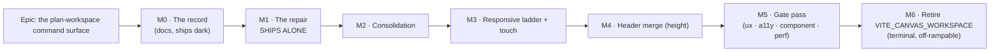

# Implementation Plan: The plan-workspace command surface — repair, then consolidate

- **Feature spec:** [`./feature-spec.md`](./feature-spec.md)
- **Measurement (authoritative):** [`./m0-measurement.md`](./m0-measurement.md)
- **Pre-approval review:** [`./pre-approval-review.md`](./pre-approval-review.md) — five specialists;
  every blocking finding is folded into the tasks below, which therefore differ from their first draft
- **ADR:** [ADR-0090](../../adr/0090-the-plan-workspace-command-surface.md) (Accepted; corrected in
  place by M0)
- **Status:** **Approved 2026-08-11** — in progress
- **Owner:** James Ewbank

## Product-owner decisions (2026-08-11)

Four questions were put to the product owner with the review findings; all four took the recommended
option. They are recorded here because each one changes what gets built, and a plan that does not say
who decided is a plan somebody re-litigates.

1. **M1 ships alone, even though it probably withdraws the 21 labels currently visible at 1920.**
   A correct icon-only row beats an unclickable labelled one, and the 2.5.8 failure is live. M1-T9's
   changeset must say plainly that the label loss is **temporary and already scheduled for reversal
   at M2** — not merely that the labels changed, which reads as a second complaint landing on the
   first.
2. **M2 proceeds as designed** — 46 items → ~24 stops, nothing deleted, 12 commands behind **named**
   triggers. The 2026-07-15 amendment reversed _icons in an undifferentiated `⋯`_; these are named
   menus, and the product already ships six of them.
3. **`VITE_CANVAS_WORKSPACE` retires as terminal M6, with a written off-ramp.** If it threatens
   M1–M4 it is deferred and the trigger is **re-recorded with a reason** in `flag-retirement.json`
   and `docs/TECH_DEBT.md` #122 — deferring is a decision, ignoring is a defect.
4. **ADR-0090 is corrected in place, not superseded.** It was never Accepted, so nothing downstream
   depended on the withdrawn text. Done: its Context now carries a correction block naming all three
   falsified claims, and it is Accepted.

## Breakdown



### Epic

**The plan-workspace command surface** — make every TSLD command reachable at every supported width,
then reduce the surface to something a row can label, on the desktop and the Surface Pro. Roadmap
theme: the plan workspace / TSLD surface (ADR-0030 → ADR-0031 lineage). **Frontend only: no API, no
DTO, no permission, no migration, and the CPM engine is not imported — the ADR-0034 recalculation
parity gate is untouched by construction.**

**The one thing to hold on to while reading this plan.** M1 is a defect fix for shipped software and
it ships on its own. M2–M4 are a redesign that is worth doing and is not the fix. Do not let the
redesign's schedule delay the repair, and do not let the repair's landing be reported as the
redesign's success.

---

## Milestone 0 — The record (docs only)

**Outcome:** the register stops disagreeing with itself, and the ADR stops asserting three things the
measurement disproved.
**Ships dark:** no code changes, no user-facing capability. It exists because an ADR that is wrong
in three places, and a debt row that contradicts the flag register, are what the next reader will
trust. `docs/PROCESS.md` "verify the claim; do not trust the document" applies to the documents this
epic is about to be built on.
**Journey:** none (nothing is reachable). The gates it must satisfy are `pnpm check:doc-links`,
`pnpm check:flags`, `pnpm check:counts` and `pnpm check:claims`.

---

#### Feature: Correct the inputs

> **Description:** correct `docs/TECH_DEBT.md` #122, amend ADR-0090 against `m0-measurement.md`, add
> the CLAUDE.md §16 register entry, and mark `design.md` §2 superseded in the file itself.
> **Complexity:** S
> **Dependencies:** none
> **Risks:** editing an ADR → it is **Proposed**, not Accepted, so this is permitted (`docs/PROCESS.md`
> "Change management"); the edit is recorded in the ADR's own text rather than silently applied.
> **Testing requirements:** `pnpm check:doc-links`, `pnpm check:flags`, `pnpm check:counts`,
> `pnpm check:claims`. No unit tests — there is no code.

##### Task M0-T1 — Correct `docs/TECH_DEBT.md` #122 to seven harnesses (≈ one PR, with T2–T4)

- **Description:** `:2011-2012` says "five harnesses left rather than seven". Seven configs pin
  `VITE_CANVAS_WORKSPACE: 'false'`.
- **Complexity:** S
- **Dependencies:** none
- **Risks:** none.
- **Testing:** `pnpm check:flags` (the row is what the gate points at; deleting it fails the check).
- **Development steps:**
  1. Re-run the verification rather than copying this plan's number:
     `grep -n "VITE_CANVAS_WORKSPACE: 'false'" apps/web/playwright*.config.ts`. Expected seven —
     `playwright.config.ts:70`, `edit:72`, `sub-day:68`, `programme:63`, `assignment-lag:73`,
     `activity-editor:74`, `notes:61`.
  2. Cross-check `scripts/flag-retirement.json:320`, which already names all seven.
  3. Correct the row, and say **why** it was wrong: ADR-0089 converted `sub-day` and `assignment-lag`
     off `VITE_ACTIVITY_EDITOR_TABS`, not off this flag.

##### Task M0-T2 — Amend ADR-0090 against the measurement

- **Description:** three assertions are falsified (feature-spec §4.6) and one register claim is
  confirmed.
- **Complexity:** S
- **Dependencies:** M0-T1 (they share a PR)
- **Risks:** an ADR rewritten to look as if it had been right all along loses the record. **The
  corrections are stated as corrections**, in the ADR, with `m0-measurement.md` named.
- **Testing:** `pnpm check:doc-links`.
- **Development steps:**
  1. Context ¶2: replace _"The reported symptom is not a bug… every demoted command is reachable"_
     with the measured finding — no `⋯` at 1920, three controls outside the container, the `⋯` itself
     1 px at 1440 and 0 px at 960.
  2. Context ¶3 / D1's premise: withdraw the 2560 px / 2600 px label thresholds. Measured at 1920:
     21 of 24 labelled on Row 1, 10 of 19 on Row 2. **The labels are why it breaks.**
  3. D2: remove _"until it lands, any measurement of the toolbar is measuring the wrong demotion
     order"_. Record that F1's symptom is **latent, not observed** — at 1440 all twelve tier-2
     demotables plus both tier-1 view buttons demote together, exactly as
     `toolbar-registry.ts:310-318` sorts. `priority` stays, demoted from "the load-bearing fix" to
     "ships with the fix because the fix makes demotion fire".
  4. "Risk, stated plainly": replace the P1/P2 prediction block with the outcome — both falsified,
     and the design's own §2.3 note (_"the brief hypothesised clipping with no `⋯` route; I believe
     that is wrong"_) was wrong in the brief's favour.
  5. Add a decision **D9 — the fit invariant is a browser gate**, naming `e2e-toolbar-fit` and why
     jsdom cannot hold it.
  6. Keep D8's register claim; mark it verified.

##### Task M0-T3 — Add the CLAUDE.md §16 register entry for ADR-0090

- **Description:** the authoring session could not edit `CLAUDE.md`; an unentered ADR is how ADR-0071
  came to be cited by shipped code while absent from the register.
- **Complexity:** S
- **Dependencies:** M0-T2 (the entry describes the corrected ADR)
- **Risks:** the §16 entries are long-form and load-bearing; a thin entry is worse than none, because
  it looks done. Write it to the length of its neighbours, and say what the measurement found.
- **Testing:** `pnpm check:counts` (the banner's ADR count is a computed gate, ADR-0076).
- **Development steps:**
  1. Insert an ADR-0090 bullet in §16 after ADR-0089, status **Proposed**.
  2. State the finding in the first sentence — commands pointer-unreachable at 1920 with no `⋯` —
     because that is what a future reader needs, not the taxonomy.
  3. Record that both of design.md's falsifiable predictions failed, and that §2's numbers are
     withdrawn: the prediction mechanism working is the point.
  4. Run `pnpm check:counts`; the ADR count in the stage banner moves.

##### Task M0-T4 — Mark `design.md` §2 superseded, in the file

- **Description:** a reader who opens `design.md` must not meet withdrawn arithmetic without warning.
- **Complexity:** S
- **Dependencies:** none
- **Risks:** deleting §2 destroys the record of how the estimate went wrong, which is the instructive
  part (the ADR-0075 docblock precedent — the wrong version is preserved, not replaced).
- **Testing:** `pnpm check:doc-links`.
- **Development steps:**
  1. Add a banner at the head of §2: withdrawn, superseded by `m0-measurement.md`, kept for the record.
  2. Add the same to §2.1's vertical table with the extra fact that **M0 measured no heights at all**
     (`measure.spec.ts:78-79` reads `clientWidth`/`scrollWidth` and item boxes only).
  3. Add a pointer from §4/§6 to `feature-spec.md` §4.5/§6, where each is re-derived.

---

## Milestone 1 — The repair (ships alone)

**Outcome:** no toolbar command is pointer-unreachable at any width, on either row, on the surface
every planner gets. The `⋯` is rendered whenever anything is demoted and is never itself the clipped
thing. Demotion runs in a declared priority order, and a two-state segment cannot split.
**Entry point:** the plan workspace's two command rows — `role="toolbar"` named **"View and
navigate"** and **"Build and manage"**, and specifically the **Legend** and **Keyboard shortcuts**
buttons on Row 1, which a mouse user cannot click today at 1920×1080.
**Journey:** **`apps/web/e2e-toolbar-fit/fit.spec.ts`**, new, run by `pnpm --filter @repo/web
test:e2e:toolbar-fit`, wired as its own CI step. It lands **with this milestone**, not at the end
(ADR-0081 §2), and it is **verified red first** against the pre-fix build.

> **This milestone is releasable on its own and should be released on its own.** It is a defect fix
> in shipped software; nothing in M2–M6 is a prerequisite for it, and nothing in it presumes the
> redesign is approved.

---

#### Feature 1.1: Establish the mechanism

> **Description:** find out _why_ the row overflows before changing anything. Three candidates are on
> the table and the plan must not fix the first one that sounds right.
> **Complexity:** S
> **Dependencies:** none
> **Risks:** fixing a candidate that is not the cause → the symptom persists at some widths and the
> gate goes red after the "fix" → mitigated by making this task's output a **recorded measurement**,
> not an opinion.
> **Testing requirements:** the instrumentation itself is the test artefact; its output is pasted into
> `m0-measurement.md` as an addendum.

##### Task M1-T1 — Instrument the row and attribute the 94 px

- **Description:** in a real browser, at each of eight widths, decompose the row's `scrollWidth` into
  (a) the sum of `[data-toolbar-item]` widths, (b) the sum of `role="group"` widths, (c) the computed
  `column-gap` on the container and on each group, (d) each group's `margin-left` +
  `border-left-width` + `padding-left`. Report `scrollWidth − Σitems` against `Σgaps + Σgroup rules`.
- **Complexity:** S
- **Dependencies:** none
- **Risks:** measuring an empty plan again → the harness **must** populate the plan first
  (`finish-chip` is `isVisible: hasDiagram`, `tsld-toolbar-items.tsx:2360`, and was absent from every
  M0 reading).
- **Testing:** none (this is measurement). It runs from `apps/web/measure-toolbar/`, which stays
  a harness.
- **Development steps:**
  1. Add `apps/web/measure-toolbar/attribution.spec.ts`; reuse `measure.spec.ts`'s onboarding, then
     take the pen, add two activities and recalculate (as `e2e-toolbar/toolbar.spec.ts:51-54` does).
  2. Emit the decomposition per row per width to `MEASURE_OUT`.
  3. **Discriminate the three candidates explicitly:**
     - _unmeasured chrome_ — does `scrollWidth − Σitems` equal `Σgaps + Σgroup rules` to within 2 px?
     - _two `ml-auto` boxes on one line_ (`Toolbar.tsx:333` and `:386`) — count the `ml-auto` boxes
       per row per width. At 1920 the overflow wrapper is not rendered (`overflowPresent: false`,
       measured), so this candidate is already excluded there; check 1440 and 960.
     - _promotion/overflow ordering_ — log `autoLabelsFit`, `overflowedIds.size` and `scrollWidth`
       across consecutive commits at a fixed width, to see whether the second pass reaches a
       different conclusion from the first.
  4. Write the attribution into `m0-measurement.md` as an addendum, naming the command that produced it.
  5. Add `measure-toolbar` to `apps/web/tsconfig.json`'s `include` and add a
     `"measure:toolbar"` script to `apps/web/package.json` — the harness currently typechecks and
     lints with nothing (verified: absent from `tsconfig.json:13-48`, no script in `package.json`).
     Its config docblock already declares it a harness (`playwright.measure-toolbar.config.ts:4-5`);
     extend it to name `e2e-toolbar-fit` as the gate (ADR-0081 §3).

---

#### Feature 1.2: An honest budget

> **Description:** `computeOverflow` decides whether a row fits from item widths alone and sees none
> of the row's chrome. Make the budget include what the browser will actually lay out.
> **Complexity:** M
> **Dependencies:** M1-T1
> **Risks:** (a) a measurement feedback loop — group widths change when items demote, which is the
> oscillation `widthCacheRef` (`Toolbar.tsx:130-137`) already exists to damp; mitigated by deriving
> the chrome **once per pass** and holding it constant within that pass, so demotion stays monotonic.
> (b) reading class names instead of boxes — mitigated by reading computed styles and DOM boxes only.
> (c) a per-frame cost regression — mitigated by M1-T4's measurement.
> **Testing requirements:** unit tests on the pure `computeOverflow` with the measured numbers, each
> **verified red first**; the browser gate at eight widths.

##### Task M1-T2 — Teach `computeOverflow` about the row's chrome

- **Description:** extend the pure function's signature with the chrome the row carries, and correct
  both the "everything fits" early return (`toolbar-registry.ts:306`) and the demotion loop
  (`:320-327`), which today subtracts an item's width but not the gap that goes with it.
- **Complexity:** M
- **Dependencies:** M1-T1
- **Risks:** `computeOverflow` is consumed by `Toolbar` **and** by the existing unit suite and the
  selection bar's `<Toolbar>` — a behaviour change reaches three consumers. Mitigated by keeping the
  new parameters **optional with a zero default**, so every existing call site and test is
  byte-identical until `Toolbar` passes real values.
- **Testing:**
  - unit: `totalWidth + chrome > availableWidth` demotes where `totalWidth ≤ availableWidth` does not
    — seeded with the **measured** 1920 numbers (container 1832, scroll 1926). Verified red first.
  - unit: demoting N items reclaims `Σwidths + N × gap`, not `Σwidths`.
  - unit: the zero-default path reproduces today's results exactly, over the existing cases.
- **Development steps:**
  1. Add `chromeWidth = 0` and `gapWidth = 0` parameters; document in the docblock that the function
     answers "does this row fit **as laid out**", not "do these boxes sum to less than this number".
  2. Fix the early return to `totalWidth + chromeWidth <= availableWidth`.
  3. Fix the loop to subtract `widthOf(id) + gapWidth` per demotion.
  4. Update `toolbar-registry.ts:115`'s `order` docblock to say it is **position within the group**
     and is **not** the demotion key (that lands in M1-T3).

##### Task M1-T3 — **Derive** the chrome — do not measure it

> **Rewritten after the pre-approval review.** This task previously said to put a ref on each
> `role="group"` wrapper and read `getBoundingClientRect()`. **`performance-reviewer` and
> `component-reviewer` independently concluded that measuring it creates a feedback loop**, and both
> identified the same trigger. See `pre-approval-review.md` for the full argument; the short form:
>
> The group wrappers are rendered from `groups` (`Toolbar.tsx:300-311`), derived from `inlineBar`
> (`:232`), which is `bar.filter((r) => !overflowedIds.has(r.item.id))` — **filtered by the very
> state `computeOverflow` is about to set.** So a measured chrome is not an independent input to the
> decision; it is downstream of the previous decision. When a group's last inline member demotes the
> wrapper stops rendering, its `ml-1 border-l pl-2` rule (~13 px, `:331`) leaves the DOM, the next
> pass sees more budget and can promote the item back — recreating the rule.
>
> **The group this happens to is `help`, whose only members are `legend` and `shortcuts`** — the
> exact two items M0 measured as unreachable at 1920, and the two M1-T7 gives the lowest Row-1
> priority. The loop would sit precisely at the width this milestone exists to fix.
>
> `measure()`'s deps are `[bar, demotable, autoLabelsFit]` (`:212`), **not** `overflowedIds`, so
> `setOverflowedIds` alone does not force a second pass — but a chrome change that flips
> `autoLabelsFit` does, and `:38-50` documents that toggle forcing one. The result would then be a
> React re-render loop **with no user interaction at all**, each pass forcing a synchronous layout
> read inside a `useLayoutEffect`, above a canvas already 4–6× over its ADR-0065 budget.
>
> The previous mitigation — "derive once per pass and hold it constant within the pass", plus
> `widthCacheRef` — addressed a **different, already-solved problem**: `widthCacheRef` (`:130-137`)
> damps a _demoted item's_ width collapsing to 0 because its node unmounted, and intra-pass
> constancy says nothing about pass N+1 differing from pass N.

- **Description:** derive the row's chrome as a **pure function of the registry's static group
  membership** — which `computeOverflow` already receives as `bar` — using named constants, in the
  manner of the existing `LABEL_CHROME_PX` (`Toolbar.tsx:23-29`). No new DOM reads. Cost the
  label-promotion projection (`:210`) against the same honest total.
- **Complexity:** M
- **Dependencies:** M1-T2
- **Risks:** a derived constant silently rots when a class changes. Covered twice: a structural
  string assertion (the container's class list contains `gap-1`; the group wrapper's contains
  `ml-1 border-l pl-2`), and the M1 browser gate itself, which is running anyway and fails the moment
  the constants desync from reality.
  Separately, **this fix is expected to remove the 21 labels the product owner currently sees at
  1920** (_reasoned from the code, not observed_) — correct behaviour and a visible regression at the
  same time. Mitigated by measuring at all eight widths **before merge** and by M2 buying them back.
  **If the measurement shows something else, believe the measurement.**
- **Testing:**
  - the browser gate (M1-T8), which is the only thing that can see the layout at all.
  - **oscillation A — steady state.** At 1920×1080 on a populated plan, capture the inline id-set and
    each item's labelled state for 20 consecutive `requestAnimationFrame` ticks **with no input**.
    Assert all 20 identical. This is the direct test for a loop with no user interaction.
  - **oscillation B — the boundary.** Sweep 1900→1960 in 1 px steps, bracketing the width at which
    `help` first empties. Assert the inline set and the labelled set are each **monotonic** — nothing
    that disappears reappears within a monotonic sweep.
  - unit: chrome derived from a `bar` with N groups equals `N × GROUP_RULE_PX + (items − 1) × GAP_PX`,
    and drops one rule when a demotion empties a group of **all** its bar members.
- **Development steps:**
  1. Add named constants `GROUP_GAP_PX = 4` (Tailwind `gap-1`) and `GROUP_RULE_PX = 13`
     (`ml-1` + `border-l` + `pl-2`), each with a docblock naming the class it encodes.
  2. Derive chrome from `bar`'s static group membership, attributing the rule+gap saving to whichever
     demotion empties a group of all its bar members — **never** from `overflowedIds` or the DOM.
  3. Pass `chromeWidth`/`gapWidth` into `computeOverflow` and into the promotion projection at `:210`.
  4. Add the structural class assertions from the risk row.
  5. Run the harness at all eight widths and record before/after in the PR body.

##### Task M1-T4 — Confirm the measurement pass has not become expensive

> **Amended after the pre-approval review**, twice. M1-T3 no longer adds any DOM reads at all — the
> chrome is derived, not measured — so the cost question is now "did the derivation change the number
> of passes?" rather than "did it make each pass heavier". And `performance-reviewer` noted the
> original testing step exercised only the **resize** trigger, while
> `use-tsld-toolbar-context.tsx:388-391` documents that `measure()` also refires on legitimate context
> changes — selection, zoom preset, search, isolate mode — which is the path most likely to compete
> with canvas paint during actual use.

- **Description:** `measure()` runs per resolve pass and per `ResizeObserver` tick. Establish that the
  honest budget has not increased how often it runs.
- **Complexity:** S
- **Dependencies:** M1-T3
- **Risks:** a layout-thrash regression on a surface that also paints a canvas at 2,000 activities.
  This is a **claim to measure, not to assert** — ADR-0075's risk table asserted "no request-path
  cost" and was wrong.
- **Testing:**
  - **C — interaction-driven cost.** On a populated plan at 1920, script five seconds of ordinary
    interaction — ten selections in sequence, three zoom-preset changes, a search typed then cleared —
    with `performance.mark`/`performance.measure` bracketing `measure()`'s body, read back via
    `page.evaluate`. Report invocation count and total time inside `measure()`, before and after.
  - **D — call-count budget**, the house convention (ADR-0026/0065; `docs/TECH_DEBT.md` #75 records
    that CI timings are noise): a jsdom test spying on `getBoundingClientRect`/`getComputedStyle`,
    asserting the per-pass call **shape** rather than a millisecond figure. Post-M1-T3 that shape must
    be **unchanged from today's**, since nothing was added.
  - the 50-resize-pass timing, kept as the coarse before/after.
- **Development steps:**
  1. Extend the harness with the interaction pass and the timing pass.
  2. Record all three numbers in the PR.

---

#### Feature 1.3: The `⋯` can never be the thing that disappears

> **Description:** the escape hatch must be the last thing to lose width, and the sub-floor case must
> have defined behaviour rather than clipping.
> **Complexity:** S
> **Dependencies:** M1-T3
> **Risks:** the sub-floor remedy is where design.md's P2 prediction was already wrong once —
> **verify in the browser which of truncation or scrolling actually happens, do not reason about it.**
> **Testing requirements:** the browser gate at 960 and 768.

##### Task M1-T5 — Pin the `⋯` and define the sub-floor behaviour

- **Description:** `shrink-0` on the overflow wrapper (`Toolbar.tsx:386`); and a defined answer for
  widths below the pinned floor, measured at **1177 px** for Row 1 against an **872 px** container at 960.
- **Complexity:** M
- **Dependencies:** M1-T3
- **Risks:** two remedies, and the right one is an empirical question:
  - **(a) `min-w-0` on the group wrappers** so the row truncates rather than clips (the popover labels
    already carry `truncate`). Smallest change; keeps the no-scroll layout; produces "Go to d…".
  - **(b) `overflow-x-auto` on the container** so the row scrolls. Nothing is unreachable; costs a
    scrollbar that may eat vertical space at 960, and a scrollable region with no visible affordance
    is its own discoverability problem.
    **Recommended default: (a)**, because it preserves the layout and M3 removes the need entirely.
    **Try both in the browser and let the measurement choose.** Whichever ships, the residual is
    recorded as a debt row and closed by M3, not claimed closed here.
- **Testing:**

  > **Amended after the pre-approval review — `test-engineer` and `accessibility-reviewer`
  > independently found the same hole, and it is this milestone's own defect in miniature.**
  > `data-toolbar-item` is present on a control **regardless of its rendered width**. So a control
  > shrunk by remedy (a) to zero visible width satisfies **S1** (a 0-width box has 0 overhang) and
  > **S3** (it is still in the DOM, so still "reachable" by set membership) while being **exactly as
  > unclickable as the original defect**. Remedy (a) is the one recommended above, and an icon button
  > at 960 has no label left to truncate — there is nothing to absorb the shrink but the button.
  >
  > Consequently the milestone's outcome statement ("no toolbar command is pointer-unreachable at any
  > width, on either row") **overclaimed against its own gate** at 960/768. Either the gate proves it
  > or the statement is narrowed; the gate is cheaper.
  - S1/S2/S3 at 960 and 768, **plus a positive pointer-reachability assertion**: `elementFromPoint`
    at each pinned Row-1 control's own centre returns that control or a descendant — the instrument
    `measure-toolbar/reachability.spec.ts` already implements and which is what caught the
    original defect. Equivalently, a rendered-width floor of **≥ 24 px** (WCAG 2.5.8's minimum).
  - S4 (honest fit) is asserted only at 1920 and 1440 in this milestone, with M3 extending it
    downward.

- **Development steps:**
  1. Add `shrink-0` to the overflow wrapper; assert its box is fully inside the container at every
     width in the gate.
  2. Implement (a); run the harness at 960 and 768; screenshot the outcome into the PR.
  3. If (a) still clips **or drives any control below the 24 px floor**, implement (b) and re-run.
  4. Record the residual in `docs/TECH_DEBT.md` with the measured floor and container widths.
  5. State in M1-T9's changeset that Surface Pro **portrait** is defined-but-not-fully-resolved until
     M3, rather than implying M1 covers the device the brief added.

---

#### Feature 1.4: `priority` is not `order`, and a segment is one unit

> **Description:** `toolbar-registry.ts:115` documents `order` as _"Sort order **within the group**"_
> and `computeOverflow` (`:310-318`) reuses it as the cross-group demotion key. Split them, and make
> each two-state segment demote as a pair.
> **Complexity:** M
> **Dependencies:** M1-T3 — and it must ship **with** it, not after: the repair makes demotion fire at
> widths where it has never fired, so the wrong order becomes user-visible for the first time.
> **Risks:** a silent change to demotion everywhere, including the selection bar → mitigated by
> `priority` defaulting to `order`, so the change is opt-in per item, plus an assertion that the
> selection bar's queue is unchanged.
> **Testing requirements:** unit tests verified red first.

##### Task M1-T6 — Add `priority`, default `order`

- **Description:** `ToolbarItem.priority?: number`; `computeOverflow` sorts on
  `priority ?? order`; `resolveItems` keeps sorting on `order`.
- **Complexity:** S
- **Dependencies:** M1-T2
- **Risks:** two numbers that look alike → both docblocks state the question each answers, and the
  ADR-0031 "add a command" recipe gains the distinction (M2-T9).
- **Testing:** unit — with no `priority` set anywhere, every existing demotion case is unchanged
  (run the existing suite untouched, which is the before/after oracle, per ADR-0078's
  barrel-preserving argument).
- **Development steps:**
  1. Add the field and the sort.
  2. Assert the selection bar's demotion queue is byte-identical.

##### Task M1-T7 — Set Row 1's priorities, and make each segment one demotion unit

- **Description:** Zoom −/+/Fit/Go-to-today take the **highest** priority on Row 1; `legend` and
  `shortcuts` the **lowest**. `mode-early`/`mode-visual` (`:1822`/`:1840`) and
  `view-tsld`/`view-gantt` (`:1869`/`:1882`) each demote as a pair or not at all.
- **Complexity:** M
- **Dependencies:** M1-T6
- **Risks:** the segment-pair rule is new machinery in the pure function. Keep it a **declared pair
  key** on the item (`demotionGroup?: string`) rather than special-casing ids in the primitive.
- **Testing:**
  - unit, **verified red first**: at a width that demotes some of Row 1, `Fit to plan` is inline while
    `Keyboard shortcuts` is in the `⋯`.
  - unit: at any width, `Early` and `Visual` are on the same side; likewise `Diagram` and `Gantt`.
    (`m0-measurement.md` records this split as **latent, not observed** — the test is what keeps it
    latent.)
- **Development steps:**
  1. Add `demotionGroup` to `ToolbarItem`; group members demote together in the queue.
  2. Set `priority` on the Row-1 items named above; leave every other item unset.
  3. Write both tests against the current code first and confirm they fail.

---

#### Feature 1.5: The gate

> **Description:** the invariant that this defect can never return, held by something that runs a real
> browser.
> **Complexity:** M
> **Dependencies:** M1-T3, M1-T5
> **Risks:** a gate placed in the wrong harness measures a surface no planner has (see below);
> a gate that has only ever been green proves nothing.
> **Testing requirements:** it _is_ the test. Verified red first.

##### Task M1-T8 — `apps/web/e2e-toolbar-fit/` + `playwright.toolbar-fit.config.ts` + a CI step

- **Description:** a new suite asserting S1–S4 at eight widths on a **populated** plan.
- **Complexity:** M
- **Dependencies:** M1-T3, M1-T5
- **Risks:**
  - **It cannot live in `e2e-toolbar`.** `playwright.toolbar.config.ts:67` pins
    `VITE_CANVAS_AUTHORING: 'false'` — deliberately, because that journey asserts the ADR-0031 plain
    Add toggle — and `tsld-toolbar-items.tsx:2146,2165` branch on `CANVAS_AUTHORING_ENABLED` for Row
    2's `add-activity` and `link-tool`. Row 2 there is not the shipped composition, and Row 2 is where
    `print` is clipped at 960.
  - **It must pin no `VITE_` flags at all**, which is the property
    `playwright.measure-toolbar.config.ts:16-18` already identified and wrote down (ADR-0088 D1: a
    published image carries every flag at its default). ~~No other config in the estate has it.~~
    **Corrected by the pre-approval review and verified by running it:**
    `playwright.calendar-shifts.config.ts` and `playwright.staff.config.ts` also pin zero `VITE_`
    vars — for unrelated reasons (a retired flag; a server-only gate). The conclusion is unchanged
    (neither is a candidate host for a toolbar gate), but an unverified uniqueness claim asserted in
    a plan is exactly what ADR-0076 exists to stop. **The same correction must be made in
    feature-spec §4.4 and in ADR-0090.**
  - **It must populate the plan**, or it repeats M0's blind spot and never sees `finish-chip`.
  - CI cost: one more `webServer` boot, in line with the other 20+ suites.
- **Testing:** run it against `main` before the fix and record the failures; then against the fix.
- **Development steps:**
  1. New `apps/web/playwright.toolbar-fit.config.ts` — copy `measure-toolbar`'s no-pin property and
     **repeat the reason in the docblock**, plus `PLAN_EDIT_LOCK_ENFORCED: 'true'` on the API so the
     pen is real.
  2. New `apps/web/e2e-toolbar-fit/fit.spec.ts`: onboard → client → project → plan → take the pen →
     two activities → recalculate → for each width in {2133, 1920, 1600, 1440, 1280, 1024, 960, 768},
     for each row, assert:
     - **S1** every `[data-toolbar-item]` box's right edge ≤ container right + 1
     - **S2** if `overflowPresent`, the `⋯` box is fully inside the container
     - **S3** `inline ∪ overflowMenuItems` equals the set captured at the widest width — compared
       against **what this build shows when it has room**, never a list typed into the file (the
       property `measure.spec.ts:20-22` established)
     - **S4** at 1920 and 1440 only: `scrollWidth ≤ clientWidth + 1`
     - **S5 (added by the pre-approval review) — pointer reachability.** For every pinned Row-1
       control at 960 and 768: `elementFromPoint` at its own centre returns it or a descendant, or
       equivalently its rendered width is ≥ 24 px. **S1 and S3 alone would pass a control shrunk to
       zero visible width** — the original defect's exact shape. Reuse
       `reachability.spec.ts`'s implementation rather than writing a second one.
     - **S6 (added) — stability.** Settle, snapshot, settle again, snapshot: the inline id-set and
       labelled-set must be identical. S1–S4 are single snapshots and would pass on a
       settled-but-wrong state, missing a slow oscillation entirely (`component-reviewer`). This is
       the assertion form of M1-T3's oscillation tests A and B.
     - Cover the **selection bar's** `<Toolbar>` (`selection-actions.tsx:395`) too, as a third mounted
       instance of the same `measure()`/`computeOverflow` path.
  3. Add `test:e2e:toolbar-fit` to `apps/web/package.json`; add `e2e-toolbar-fit` to
     `apps/web/tsconfig.json`'s `include`. **Also add `measure-toolbar` to that `include` list and
     give it a script** — it is currently in neither, so the harness typechecks and lints with
     nothing (`component-reviewer`).
  4. Add the CI step in `.github/workflows/ci.yml` beside `test:e2e:toolbar` (`:227`).
  5. **Widen the axe scan, as a second and independent gate.** `e2e-toolbar/toolbar.spec.ts:122`
     scans `withTags(['wcag2a', 'wcag2aa'])`. **Verified by running axe-core 4.12.1:**

     ```
     id: target-size | enabled: false | tags: ["cat.sensory-and-visual-cues","wcag22aa","wcag258"]
     selected by withTags([wcag2a,wcag2aa])?  false
     selected by withTags([wcag22aa])?        true
     ```

     So the one rule that names this defect is excluded **twice over** — by tag, and by axe shipping
     new-in-2.2 rules opt-in. "The axe scan stays green" is true and proves nothing about 2.5.8. Add
     `wcag22a`/`wcag22aa` to the tag list and `rules: { 'target-size': { enabled: true } }`, and
     record any pre-existing noise it surfaces rather than silencing it.

  6. **Verified red first**: run against pre-fix `main` and paste the failures into the PR — expected
     at 1920 (S1, S4), 1440 (S2, S4), 960 (S1, S2), 768 (S1). Two of the eight widths (1600, 1280)
     were **never in M0's output**, so report actual rather than predicted results for those.
  7. Carry `measure.spec.ts:150-153`'s settle strategy deliberately — a hardcoded
     `waitForTimeout(400)` is a CI-flake source on a slower runner. Prefer a poll-until-stable read,
     which S6 needs anyway.
  8. Update `apps/web/measure-toolbar/*.spec.ts` docblocks: "reports; asserts nothing; the gate is
     `e2e-toolbar-fit`" (ADR-0081 §3).

##### Task M1-T9 — Changeset, docs, and an honest release note

- **Description:** the user-visible change is "commands you could not click are clickable"; the
  user-visible cost is probably "Row 1 is icon-only at 1920 until M2".
- **Complexity:** S
- **Dependencies:** M1-T8
- **Risks:** a release note that mentions only the fix reads as a regression when the labels go.
- **Testing:** the pre-push gate — `pnpm lint && pnpm typecheck && pnpm test`, plus
  `scripts/e2e-local.sh web:toolbar-fit` **and** `web:toolbar` (the existing journey touches the same
  primitive). Run, not written (CLAUDE.md §19.8).
- **Development steps:**
  1. `pnpm changeset` — minor on `@repo/web`.
  2. Note the label change explicitly, with the measured numbers.
  3. Update `docs/TECH_DEBT.md` with the sub-floor residual from M1-T5.

---

## Milestone 2 — Consolidation (Option B, re-derived)

**Outcome:** Row 1 falls from 24 stops to ≈ 12 and Row 2 from 19 to ≈ 9, with **nothing deleted**;
both rows label themselves at 1920 with no `⋯`; zero non-operable read-outs remain inside a
`role="toolbar"`; the `⋯` becomes a sectioned menu.
**Entry point:** per feature — the **selection bar** that appears when a bar is selected; the
**`View ▾`** popover on Row 1; the **`Plan ▾`** and **`Share & export ▾`** triggers at Row 2's
trailing edge; the **plan header** for the project finish read-out.
**Journey:** `e2e-toolbar-fit/fit.spec.ts` extends with S5 (labelled, no `⋯` at 1920) and a
relocation walk that presses each moved command at its new entry point.

> ### Added by the pre-approval review — which existing suites this milestone invalidates, and how
>
> M1's oracle argument (optional zero-default parameters, so every existing suite runs untouched) is
> correct and verified. **M2's is not, and only one of five relocation features admitted it.** Feature
> 2.3 promises a grep-and-rename for `finish-chip` in `e2e-toolbar/toolbar.spec.ts:61` and calls it
> "a rename of location, not of capability". Two suites need something stronger:
>
> - `tsld-toolbar-lenses.test.tsx:107-138` queries `Colour · Criticality` and `Baseline overlay` as
>   **top-level toolbar buttons**;
> - `tsld-toolbar-resource-view.test.tsx:29-49` does the same for `Resource view`.
>
> Feature 2.2 turns `colour-by` into a **radio group** inside `View ▾` and moves the rest into that
> popover — **a different interaction model, not a relocated button**. These need rewrites, not
> renames.
>
> **Every relocation feature (2.1, 2.2, 2.4, 2.5) must name its affected suites and say, per suite,
> whether the change is a rename or a rewrite — before M2 starts.** Otherwise "the existing suites are
> the before/after oracle" quietly stops being true for the milestone that most needs one, which is
> the ADR-0084 D5 failure (coverage moves with a **named** destination, never quietly).

---

#### Feature 2.0: Size it against measurement, not arithmetic

##### Task M2-T0 — Re-measure per-item widths on a populated plan

- **Description:** M0's per-item widths went to `/tmp/toolbar-m0.json` and are **not** in
  `m0-measurement.md`, which carries only row-level totals plus three item widths. Nothing in this
  repository currently records how wide `go-to-date` or `search` is.
- **Complexity:** S
- **Dependencies:** M1 complete (a row that mis-measures itself is not worth measuring)
- **Risks:** sizing a consolidation by arithmetic is the exact mistake this epic exists to correct.
- **Testing:** none; it is measurement.
- **Development steps:**
  1. Extend the harness to emit per-item widths, labelled state, and group membership.
  2. Commit the output into `docs/specs/workspace-layout/` as `m2-item-widths.md`.
  3. Recompute the post-M2 row width from it; if Option B does not clear the container at 1920 with
     labels, **say so and re-derive** rather than proceeding.

#### Feature 2.1: Selection-gated commands move to the selection bar

> **Complexity:** M · **Dependencies:** M2-T0 · **Entry point:** select a bar on the canvas → the
> floating selection bar (`selection-actions.tsx:395`, `aria-label` "Actions for …").
> **Risks:** a keyboard-only route lost → assert each command is reachable from the canvas listbox
> selection without a pointer. A Gantt-active reason lost → the ADR-0059 M6 rule (canvas-only commands
> shade with a reason) must survive the move.
> **Testing:** journey presses each of the three at the new entry point, with and without a selection.

##### Task M2-T1 — Move `zoom-to-selection`, `isolate-logic`, `float-paths`

- **Development steps:** move the three registrations (`:1755-1763`, `:2008-2032`, `:2064-2086`) into
  `selectionActionItems`; keep their `isEnabled`/`disabledReason` verbatim; delete their Row-1 entries;
  confirm `isolate-logic`'s `render` control still receives the same context.
- **Note:** two of the three are `render` items and therefore part of the measured **1177 px pinned
  floor** — this is the single largest reduction available to Row 1.

> #### Correction, recorded in place (2026-08-11) — the destination context cannot evaluate them
>
> **"Keep their `isEnabled`/`disabledReason` verbatim" presumes the selection bar's context can run
> those predicates. It cannot**, and the step as written is not implementable.
> `selectionActionItems` is `ToolbarItem<SelectionActionContext>` — a deliberately narrow
> object-actions context (`selection-actions.tsx:29-83`: six facts about the selected activity plus
> eight `on*` callbacks). It carries **none** of the canvas/lens state these three predicates read.
>
> Established by extracting each registration by brace-matching and collecting its `ctx.` references
> — **not** by a fixed-width window, whose first attempt reported `isolate-logic` as using
> `plannedStart` and nothing else, because it had bled into the neighbouring items:
>
> | command             | fields required                                                                                                                                      |
> | ------------------- | ---------------------------------------------------------------------------------------------------------------------------------------------------- |
> | `zoom-to-selection` | `canvasActive`, `hasDiagram`, `selectedActivity`, `zoomToSelection`                                                                                  |
> | `isolate-logic`     | `canvasActive`, `hasDiagram`, `selectedActivity`, `isolateActive` — **plus** `IsolateControl`'s own `isolateMode`, `setIsolateMode`, `toggleIsolate` |
> | `float-paths`       | `activityCount`, `floatPathsOpen`, `selectedActivity`, `toggleFloatPaths`                                                                            |
>
> Eleven distinct fields against a destination that holds fourteen — so the naive move roughly
> **doubles** `SelectionActionContext` and imports canvas-viewport and lens concepts into a context
> whose docblock says it is the commands that act on the selected activity.
>
> **Recommended shape (decide before writing code):** introduce a separate
> `SelectionCanvasContext` holding exactly those fields, and type the bar's items as
> `ToolbarItem<SelectionActionContext & SelectionCanvasContext>`. The intersection costs the host
> nothing — it already owns both halves — and it keeps the two concerns distinguishable **in the
> type**, which is the ADR-0062 lesson stated as a rule: a fused gate object cannot say which half
> is missing, and the fusion is invisible at every call site afterwards.
>
> **Rejected:** a second `<Toolbar>` inside the selection bar over the TSLD context. It duplicates
> the bar's chrome and, more seriously, splits the single roving tabindex the floating bar depends
> on — two toolbars means two tab stops where a planner expects one.
>
> `isolate-logic` also needs a second look that the step does not mention: it is registered from a
> **shared `isolateShape` spread into both the flag-on and flag-off branches**
> (`tsld-toolbar-items.tsx:1597`, `:2012`, `:2030`), so moving it moves the placeholder too — which is
> the same flag-off destination question `m2-suite-impact.md` raises for Feature 2.2.

#### Feature 2.2: Display lenses move into `View ▾`

> **Complexity:** M · **Dependencies:** M2-T0 · **Entry point:** `View ▾` on Row 1 → new **Panels**
> section for Legend; **Insight overlays** for the rest.
> **Risks:** `View ▾` becoming the new `⋯` → the rule is stated in ADR-0090's Consequences: a future
> control goes in it **only if it is a display toggle**.
> **Testing:** journey opens `View ▾`, toggles a lens, and asserts the canvas responds.

##### Task M2-T2 — Absorb `colour-by`, `baseline-overlay`, `resource-view`, `over-allocation`, `legend`

- **Development steps:** move into `ViewTogglesPanel`; `colour-by` becomes a radio group under Insight
  overlays; add a **Panels** section for `legend`; delete the five Row-1 registrations. `colour-by` is
  a `render` item — a second pinned-floor reduction.

#### Feature 2.3: Read-outs leave `role="toolbar"`

> **Complexity:** M · **Dependencies:** M2-T0 · **Entry point:** the plan header (Finish), the search
> field's own chrome (result count), the `Next conflict` button's label (position).
> **Risks:** tests keyed to `[data-toolbar-item="finish-chip"]` → grep before moving;
> `e2e-toolbar/toolbar.spec.ts:61` asserts `lookRow.getByText('Finish')` and **will** need updating,
> which is a rename of location and not of capability.
> **Testing:** assert the Finish figure is present in the header for a computed plan and absent
> before first recalculation; assert zero `presentational` items remain on either row.

##### Task M2-T3 — Move `finish-chip`; fold `search-status` and `next-conflict-status`

- **Development steps:** move the chip into the workspace `<header>` beside the status pill; fold the
  two conditional read-outs into the controls they describe; then record in
  `toolbar-registry.ts:162-168` and `Toolbar.tsx:246-252` that `presentational` has no remaining
  consumer on this surface. **Do not delete the escape hatch** — the selection bar and future
  consumers may want it; record the state, do not remove the capability.

#### Feature 2.4: Deliverables get a group and one stop

> **Complexity:** M · **Dependencies:** M2-T0 · **Entry point:** `Share & export ▾` at Row 2's
> trailing edge (Export primary; Print, Share and the interchange formats in its menu).
> **Risks:** renaming a member of a closed compiler-enforced tuple touches every consumer →
> the compiler is the enforcement; `DEFAULT_GROUP_LABELS` (`Toolbar.tsx:95-105`) gains
> `output: 'Share & export'`.
> **Testing:** journey exports and prints from the new trigger; a registry test asserts `history` no
> longer exists as a group id.

##### Task M2-T4 — Rename `history` → `output`; add the split-button

- **Development steps:** rename in `TOOLBAR_GROUPS` (`toolbar-registry.ts:25`) — verified empty, one
  repository hit, the declaration itself; update `DEFAULT_GROUP_LABELS`; add the split-button
  following the ADR-0064 Add/Link pattern (**one** roving stop, `restoreFocusRef` on the **primary**,
  never the caret — `toolbar-styles.ts:31-35` records that lesson); record in ADR-0090 that `history`
  is not coming back and undo/redo stay in `tools`.

#### Feature 2.5: Plan-management actions get a named trigger

> **Complexity:** S · **Dependencies:** M2-T4 · **Entry point:** `Plan ▾` at Row 2's trailing edge.
> **Risks:** burying a Contributor's primary action → `Report progress…` and `Comments` stay inline,
> deliberately (a toggle with `aria-pressed` loses its state cue inside a menu).
> **Testing:** journey opens each of the four from `Plan ▾`.

##### Task M2-T5 — Add `Plan ▾` (baselines · schedule settings · earned value · resource histogram)

> **Rewritten after the pre-approval review.** This task shipped as a heading with **no development
> steps**, unlike every sibling in M2 — and `ux-reviewer` found that the missing steps are exactly
> the contested ones.

- **Blocking decision 1 — the trigger's name collides with its own container.** `Toolbar.tsx:96-97`
  records that `lens` was named "Display" rather than "View" **specifically** so a group named "View"
  would not contain a "View ▾" trigger. `DEFAULT_GROUP_LABELS.object` is **"Plan actions"**
  (`:102`), and every candidate member of `Plan ▾` is `group: 'object'` — so `Plan ▾` lands inside a
  region literally named "Plan actions". M2-T6 step 2 overrides only **Row 1's** `object` label;
  Row 2 is where this sits. **This is the fix for one ux finding recreating that finding one level
  down.** Override Row 2's label too, and extend M2-T6's test from group-vs-group to
  **trigger-name-vs-containing-group-name**.
- **Blocking decision 2 — `Plan ▾` and `Summary ▾` do not differentiate.** `Summary ▾` is already
  described as the hub that absorbed Plan details and Edit plan (`tsld-toolbar-items.tsx:2443-2445`).
  Two triggers, one literally "Plan", on a surface about one plan, is the leftovers problem relocated
  rather than resolved. **Either fold `Plan ▾`'s contents into `Summary ▾`, or rename one so the two
  names say what each opens.** Decide before building, not at the M5 gate.
- **ADR-0082 check.** None of the four candidate members is `penGated` and none gates on role, so an
  all-shaded `Plan ▾` is probably unreachable — **but "probably" is the class of claim this epic
  exists to distrust.** Add the explicit test (see M2-T7).

#### Feature 2.6: The information architecture repairs

> **Complexity:** M · **Dependencies:** M2-T1…T5 · **Entry point:** the two rows themselves and the
> `⋯` menu.
> **Risks:** removing the visible captions loses a sighted cue a ux review once asked for
> (`plan-workspace-toolbar.tsx:751-756` records why they were added) → the replacement is that each
> `role="group"` keeps its own visible hairline and its own accessible name, and the rows are now
> short enough to read. **Say this in the PR, do not quietly reverse a recorded decision.**
> **Testing:** a test asserting no two on-screen `role="group"` regions share an `aria-label`.

##### Task M2-T6 — Remove the caption gutters; fix the name collisions; section the `⋯`

- **Development steps:**
  1. Delete `ROW_LABEL_GUTTER_CLASSNAME` / `ROW_LABEL_CLASSNAME` and both gutter blocks
     (`plan-workspace-toolbar.tsx:80-87`, `:757-762`, `:773-777`). **One edit fixes three things**:
     73 px per row, the "Navigate" caption/`aria-label` collision (`:760` vs `Toolbar.tsx:98`), and
     the ux finding that neither caption describes its row.
  2. Pass a per-row `groupLabels` override so **neither row's** `object` group is also "Plan actions"
     — the prop already exists (`Toolbar.tsx:85`, applied at `:313`). **Row 2 matters as much as
     Row 1**, because that is where `Plan ▾` and `Share & export ▾` sit (see M2-T5).
  3. **Extract `MenuSection` and a real separator into `components/ui/menu.tsx` first, then** section
     `ToolbarOverflow`'s items (`ToolbarOverflow.tsx:74-110`).

     > **Blocking, from the pre-approval review, and verified independently.** This step previously
     > said to section the `⋯` "matching Add/Link/Export in the same feature". **`MenuSection` is not
     > a shared primitive**: it is a private, non-exported function at
     > `tsld-toolbar-items.tsx:270` — a bare `<p>` with **no ARIA role** — and `menu.tsx` exports only
     > `useMenuTrigger`, `Menu` and `MenuItem`. The separators are hand-written inline per call site
     > (`:388`). As written this task points a **`components/ui/` primitive** at a **`features/tsld/`**
     > component: the implementer would either import across that boundary (a dependency-direction
     > violation) or grow a private copy inside the primitive — one-off styling by another name.
     >
     > Extract it once, give it a real role, and have both the Add/Link/Export menus and
     > `ToolbarOverflow` consume it.

  4. **Thread `groupLabels` down to `ToolbarOverflow`.** It never receives them today —
     `Toolbar.tsx:313` computes `labels` and `:387-393` does not pass them — so the section headings
     step 3 adds have no names to use.

##### Task M2-T7 — Assert the pen cluster cannot scatter, **and that no trigger opens nothing**

- **Description:** a registry test over `buildTsldToolbarItems()` asserting every `penGated: true`
  item is in `tools`/`do`. Nine today: `add-activity`, `link-tool`, `auto-arrange`, `add-note`,
  `snap-to-grid`, `clear-visual-placement`, `recalculate`, `undo`, `redo`.
- **Added by the pre-approval review — found independently by `ux-reviewer` and
  `accessibility-reviewer`.** One test per new menu trigger applying ADR-0082's rule: **a menu whose
  every item would be shaded renders no trigger.** The plan cites that rule to reject Option D and
  does not apply it to its own new controls.

  **`Share & export ▾` is not hypothetical.** `export` and `print` are
  `isEnabled: (ctx) => ctx.hasDiagram` (`tsld-toolbar-items.tsx:2492-2494`); `share` is
  `isEnabled: (ctx) => ctx.canShare`, and `plan:share` is Planner/Org-Admin only (ADR-0051). So for
  **any Viewer or Contributor on a freshly created plan** — the state of every new plan, not an edge
  case — all three shade simultaneously. Decide and test what the caret does: render no trigger, or
  render with a reason. Do the same for `View ▾` and `Plan ▾`.

- **Complexity:** S · **Dependencies:** M2-T4, M2-T5 · **Testing:** it is the test.

##### Task M2-T8 — Extend the fit gate with S5 and the relocation walk

- **Description:** at 1920, both rows labelled with no `⋯`; and a walk pressing each relocated command
  at its new entry point, with a keyboard-only pass.
- **Complexity:** M · **Dependencies:** M2-T1…T6

##### Task M2-T9 — Docs

- **Description:** ADR-0031's "add a command" recipe gains `priority`, `demotionGroup` and the
  pen-cluster rule; `docs/DESIGN_SYSTEM.md` gains the toolbar's group/label vocabulary; ADR-0090's
  §4.5 routing table is confirmed against what actually shipped.
- **Complexity:** S

---

## Milestone 3 — The responsive ladder, and touch

**Outcome:** Surface Pro is a supported target with numbers: landscape (1440) every Row-1 command
inline with an empty `⋯`; portrait (960) a designed one-row collapse rather than a 305 px floor
collision. `scrollWidth ≤ clientWidth + 1` extends to 960 and 768.
**Entry point:** the two rows at a narrow window — and, on a Surface Pro, simply rotating the device.
**Journey:** the fit gate's S6/S7 assertions at 1440, 1024, 960 and 768, plus a hysteresis test.

---

#### Feature 3.1: Four layout modes off the width the toolbar already measures

> **Description:** Comfortable (≥ 1536) · Compact (1280–1536) · Condensed (1024–1280) · Collapsed
> (< 1024), driven by the existing `ResizeObserver` (`Toolbar.tsx:223-229`), **not** a viewport media
> query — two sources for one question is how they drift, and the container measurement stays correct
> if a future dock ever narrows the band.
> **Complexity:** L
> **Dependencies:** M2 complete
> **Risks:** oscillation at a boundary while a user drags a window edge → 48 px hysteresis per
> boundary, the `LABEL_PROMOTION_MARGIN_PX` instrument and reason (`Toolbar.tsx:31-36`), unit-tested
> at both edges of each of the three boundaries. New machinery in a primitive stable since ADR-0031 →
> the mode is derived state with no new effect, and the existing suites are the before/after oracle.
> **Testing requirements:** unit at all six boundary edges; the gate at 1440/1280/1024/960/768.

##### Task M3-T1 — Add the layout mode and its hysteresis

##### Task M3-T2 — Condensed: fold −/+/Fit/Today into `Zoom ▾`; segments become icon pairs

##### Task M3-T3 — Collapsed: one row

- **Risks:** _derived from the measured anchors, not observed_ — at 960 the container is 872 px and
  `search` alone is `w-[min(15rem,32vw)] min-w-36` (`tsld-toolbar-items.tsx:680`,`:777`), i.e. **240 px**
  at any viewport ≥ 750 px with a 144 px floor. Collapsed will not fit unless the search field
  collapses to an icon-triggered field or is allowed to reach its `min-w-36`. **Measure before
  choosing**; M2-T0's per-item widths are the input.

#### Feature 3.2: Touch

> **Description:** under `@media (pointer: coarse)` the control keeps `min-h-9` and gains `px-3`,
> taking icon-only buttons from 32 × 36 to 40 × 36 — **toward** the house ≥ 44 px rule
> (`docs/UX_STANDARDS.md:137`), which today's 32 × 36 already fails. The consolidated item count is the
> first time this has been affordable, and that is a real benefit of M2 rather than a claim.
> **Complexity:** M
> **Dependencies:** M3-T1
> **Risks:** **the shared CVA is not densified** (feature-spec §6 Q4): a global re-value would degrade
> every touch user to satisfy a desktop complaint, and would buy ≈ 96 px against a measured 94 px
> overshoot — appearing to fix the defect while leaving the miscount intact. If a compact scale is ever
> wanted it is a `density` variant under `@media (pointer: fine)` only.
> **Testing:** a computed assertion on the coarse-pointer control geometry; the residual 36 px minor
> axis is recorded as debt, **not claimed closed**.

##### Task M3-T4 — Coarse-pointer padding, the split-button caret, and the debt row

- ~~**Note:** the split caret is `toolbarControlVariants(...) + 'rounded-l-none px-1'` around a
  `size-3.5` chevron ⇒ **24 × 36**, exactly on the WCAG 2.5.8 limit. It is re-examined here, not
  shrunk.~~

  > **Blocking for M3, from the pre-approval review — the "24 × 36" figure is disputed, and it was
  > the whole reason this task leaves the control alone.**
  >
  > `IsolateControl`'s caret (`tsld-toolbar-items.tsx:1145-1160`) merges `'rounded-l-none px-1'` over
  > `toolbarControlVariants`. **tailwind-merge resolves same-axis conflicts by replacement**, so
  > `px-1` removes `px-2` entirely rather than adding to it, and the base carries **no `border`
  > utility at all**. That gives `size-3.5` (14 px) + 4 + 4 = **≈22 px** — _under_ the 24 px minimum,
  > not on it. Note this is a **different** implementation from the Add/Link carets, which use the
  > shared `toolbarSplitCaretVariants` (`toolbar-styles.ts:37-39`); that file's own docblock already
  > records the duplication as `docs/TECH_DEBT.md` #76.
  >
  > `accessibility-reviewer` flags that this is **arithmetic against arithmetic, not a measurement**,
  > and could itself be wrong. That is precisely the point: the original claim was stated **without**
  > the "derived, not observed" hedge this document applies to every other pixel figure, and a
  > milestone decision rests on it.
  >
  > **Capture this control's real rendered box in M2-T0 before M3 decides.** If it is failing today,
  > that is a pre-existing, independent 2.5.8 defect to fix in this pass or carry as its own debt
  > row — not to leave unaddressed behind a wrong "already compliant" number. The same applies to any
  > other control using the ad hoc `rounded-l-none px-1` pattern rather than the shared variant.

---

## Milestone 4 — The plan header folds into the chrome band

**Outcome:** the plan's identity, status, pen status and project finish render **above** the commands
they govern, and the canvas gains a measured amount of height.
**Entry point:** the top of the plan workspace — the breadcrumb, status pill and pen status now sit in
the chrome band above Row 1.
**Journey:** `e2e-toolbar-fit` asserts the reading order (identity before commands in the DOM) and
`e2e-toolbar/toolbar.spec.ts` keeps its axe scan green.

> **Sequenced last among the design milestones and revertible alone**, because it is ADR-0055 §3
> territory (`chrome-band.tsx:37-41`) and touches the shell rather than the toolbar.

#### Feature 4.1: One header, above the commands

> **Complexity:** L · **Dependencies:** M3 complete
> **Risks:** the toolbar reaches the band through a portal and the shell is deliberately plan-unaware
> (ADR-0029/ADR-0055 S2) → the header must not make the shell plan-aware; it portals the same way.
> Focus order and the `<h1 class="sr-only">` (`plan-workspace-toolbar.tsx:716`) must survive.
>
> **Added by the pre-approval review — this exact file has already shipped this exact bug twice.**
> `plan-workspace-toolbar.tsx:164-169` and `:330-338` both carry comments explaining that a
> `rootRef`-scoped `querySelector` **silently found nothing and stranded focus**, because
> `ChromePortal` moves the toolbar's DOM node into the chrome band while keeping it in the React
> tree; both were fixed by searching from `document` instead. Folding the plan header into that same
> portal-backed band is the same architectural shape, and the header carries focus-bearing controls
> (the Edit-plan button at `:722-733`, `CompactPenStatus`). **Any new focus-return code this milestone
> introduces must be `document`-scoped like its two neighbours** — as a task requirement, not
> something the M5 gate pass discovers as a third instance.
>
> **Testing:** axe; a DOM-order assertion; the height measurement below; and a keyboard pass proving
> focus returns to a real element after every control the merge relocates.

##### Task M4-T1 — Measure the vertical stack **first**

- **Description:** **M0 measured no heights at all** (`measure.spec.ts:78-79` reads widths only), so
  every figure in `design.md` §2.1 — the 45 px header band, ≈199 px above the canvas, ≈717 px of
  canvas — is unverified arithmetic over class names.
- **Complexity:** S
- **Risks:** claiming a canvas gain from arithmetic is ADR-0076 Class 3, and this design already did it
  once. **Measure, then claim.**
- **Development steps:** extend the harness to report each band's real `getBoundingClientRect().height`
  including `CompactPenStatus`, at 1920×1080 and 1440×960; write it into
  `docs/specs/workspace-layout/m4-vertical-stack.md`.

##### Task M4-T2 — Fold the header into the band; state the measured gain

---

## Milestone 5 — The gate pass

**Outcome:** the specialist reviews run over the **combined M1–M4 diff**, and their blocking findings
are folded with regression tests verified red first.
**Ships dark:** nothing new is reachable; this milestone only removes defects.
**Journey:** the existing suites, plus whatever the reviews demand.

> This is not ceremony. Every recent epic's combined-diff review found defects that had passed a human
> read — ADR-0064 §7 (five), ADR-0067 M4 (ten), ADR-0073 C4 (six), ADR-0086 M6 (eight) — and the
> recurring shape is _one correct pattern applied to a control and not its neighbour_, which is exactly
> what a 46-item registry edited across four milestones produces.

##### Task M5-T1 — `ux-reviewer` over the combined diff

- Its earlier read returned **blocked** on information architecture; this pass judges whether M2
  answered it, and whether removing the visible row captions (a change a previous ux review asked for)
  is defensible as shipped.

##### Task M5-T2 — `accessibility-reviewer`

- Specific asks: name the criterion the original defect violated (M0 declined to, deliberately —
  2.5.8 Target Size is the obvious candidate at an effective 0 × 0 pointer target, and 2.1.1 is
  arguable since the keyboard route survived); confirm the `⋯` sectioning, the relocated commands'
  names, and the coarse-pointer geometry.

##### Task M5-T3 — `component-reviewer`

- Specific asks: the `priority`/`order`/`demotionGroup` API, the layout mode's placement in the
  primitive, and whether `presentational` should now be deprecated or retained.

##### Task M5-T4 — `performance-reviewer`

- Specific ask: the per-pass `getComputedStyle` and group-box reads on a surface that also paints the
  canvas (`docs/TECH_DEBT.md` #75 records the painter at 16.7–23.1 ms p95 at 2,000 activities).

##### Task M5-T5 — Fold every blocking finding, each with a regression test verified red first

##### Task M5-T6 — ADR-0090 → **Accepted**; update its CLAUDE.md §16 entry with what the epic found

---

## Milestone 6 — Retire `VITE_CANVAS_WORKSPACE` (terminal)

**Outcome:** the estate's last Class A flag is gone, `classACap` ratchets 1 → 0, and the legacy
stacked plan-detail page is deleted.
**Ships dark** from a planner's point of view — the flag is already default-on and, per ADR-0088 D1,
unswitchable on any deployed container. What ships is the removal of a second product.
**Journey:** the seven converted harnesses, each still green against the shipping surface.

> **Why here.** `scripts/flag-retirement.json:317-321` sets
> `deferredUntil.trigger = "epic-touch: plan workspace"`. **This epic is that trigger, whether or not
> it acts** — so doing nothing is not neutral: it leaves a fired trigger sitting unhonoured, which is
> the ADR-0071 shape one level down. ADR-0089's pattern is followed: do the work that collects the
> payoff, convert the harnesses, then retire.
>
> **Off-ramp, stated up front.** This is the largest conversion cost in the estate. If it threatens
> M1–M4, it is deferred — and the trigger is **re-recorded with a reason** in
> `scripts/flag-retirement.json` and `docs/TECH_DEBT.md` #122, not silently left to rot. Deferring is
> a decision; ignoring is a defect.

##### Task M6-T1 — Convert the seven flag-off harnesses

- **Description:** `playwright.config.ts:70` (base), `edit:72`, `sub-day:68`, `programme:63`,
  `assignment-lag:73`, `activity-editor:74`, `notes:61`.
- **Complexity:** L
- **Risks:** **the ADR-0084 batch-1 lesson.** That batch retired three flags and CI caught two,
  because a whole `playwright*.config.ts` can BE a flag-off harness and the plan had named only the
  unit parity suites — six editing specs sat clicking controls the now-unconditional pen shades, until
  they timed out. **Convert every harness to the shipping surface and see it green before the flag is
  touched.** ADR-0089 did exactly this and it worked.
- **Testing:** each converted suite run locally via `scripts/e2e-local.sh web:<suite>`, not delegated
  to CI.
- **Decompose into seven subtasks before execution** — added by the pre-approval review. This task is
  Complexity **L**, is described as the largest conversion cost in the estate, and is a **file list
  with no per-suite steps**, unlike every other Feature in this plan. That is the shape ADR-0084
  batch 1 failed in.

  **Two of the seven are not the same kind of conversion as the rest, and the plan did not notice.**
  `playwright.programme.config.ts:59-63` and `playwright.notes.config.ts:58-61` pin
  `VITE_CANVAS_WORKSPACE: 'false'` **together with `VITE_TSLD_EDITING: 'false'` and
  `VITE_PLAN_EDIT_LOCK: 'false'`, specifically to stay pen-free** — their docblocks say so ("canvas +
  pen off, so the journey is pen-free"; "notes are not pen-gated anyway"). That is a deliberate
  simplification, not an incidental rollback pin. For the base and edit suites, conversion changes
  selectors; **for these two it is not established that the journey works pen-free against the
  surviving workspace at all.** Establish that first, per suite, before the flag is touched.

##### Task M6-T2 — Delete `LegacyPlanLayout` and retire the flag

- **Description:** remove the flag from `apps/web/src/config/env.ts:143` and `vite-env.d.ts:17`, delete
  the legacy page (`src/routes/plan-detail.tsx:120`), move `VITE_CANVAS_WORKSPACE` into
  `flag-retirement.json`'s `retired` list with a batch, ratchet `classACap` 1 → 0, and close
  `docs/TECH_DEBT.md` #122.
- **Risks:** `CANVAS_AUTHORING_ENABLED` is derived from `CANVAS_WORKSPACE_ENABLED`
  (`env.ts:168-169`) — a retired parent drops its conjunct (ADR-0084 D4), and `flag-retirement.json`
  has the precedent recorded at `:208`.
- **Testing:** `pnpm check:flags`; every e2e suite.

---

## Sequencing & slices

| Slice  | Ships                         | `main` releasable? | Independently valuable?                              |
| ------ | ----------------------------- | ------------------ | ---------------------------------------------------- |
| **M0** | docs only                     | yes                | yes — the register stops lying                       |
| **M1** | the repair + the gate         | yes                | **yes, and it is the point.** Ship it alone.         |
| **M2** | the consolidation             | yes                | yes — labels at 1920, nothing deleted                |
| **M3** | the responsive ladder + touch | yes                | yes — Surface Pro becomes supported                  |
| **M4** | the header merge              | yes                | yes — canvas height, and identity above the commands |
| **M5** | the gate pass                 | yes                | yes — defects out                                    |
| **M6** | the flag                      | yes                | yes — one product instead of two                     |

**No feature flag.** ADR-0088 D1: a `VITE_` flag is inlined at build time, `apps/web/Dockerfile`
declares one `VITE_` build arg and `docker-publish.yml` passes none, so no operator can switch one off
on a deployed container — it would buy no rollback. A flag selecting between two command surfaces is
the **Class A** definition and `scripts/flag-retirement.json:549` caps that at 1, a cap this
programme's terminal milestone takes to 0. The rollback contract is instead **small, individually
revertible commits**: one per task, with each milestone a clean revert boundary, and M1 in particular
touching two source files plus tests.

**Every schema change goes through the database-architect agent (CLAUDE.md §19.3).** There are none in
this epic — confirmed by scope, not self-assessed: no task touches `apps/api`, `prisma/` or any
migration. If any milestone acquires one, the agent runs before the migration is written, without
exception and without judging whether it is big enough.

## Definition of Done (per task)

Each task's PR satisfies the Feature Completion Criteria in [`docs/PROCESS.md`](../../PROCESS.md).
Three of them bite harder than usual here and are called out:

- **"Tests" means the pre-push gate was run.** `pnpm lint && pnpm typecheck && pnpm test`, **plus**
  `scripts/e2e-local.sh web:toolbar-fit` and `web:toolbar` for any task touching the toolbar
  primitive, and `web:<suite>` for each harness M6 converts. A local database is available. CI is the
  second opinion, never the first.
- **A regression test is verified red first.** Every fix in M1 and M5 must be shown failing against
  the pre-fix code, in the PR body.
- **Accessibility is a merge requirement.** The axe scan in `e2e-toolbar/toolbar.spec.ts:121-123`
  stays green, and no task may make the ≥ 44 px touch gap worse.

## Risks & assumptions (rollup)

| Risk / assumption                                                                                               | Likelihood  | Impact | Mitigation                                                                                                                                                                                        |
| --------------------------------------------------------------------------------------------------------------- | ----------- | ------ | ------------------------------------------------------------------------------------------------------------------------------------------------------------------------------------------------- |
| **The honest budget removes the 21 labels the owner sees at 1920** _(reasoned from the code, not observed)_     | high        | med    | Measure before merge (M1-T3); say it in the changeset; M2 buys them back honestly. If the measurement disagrees, believe the measurement.                                                         |
| The leading mechanism (unmeasured chrome) is not the whole cause                                                | med         | high   | M1-T1 instruments and discriminates three candidates before anything is changed. The gate is written against the **symptom**, so it holds either way.                                             |
| M0 measured an **empty** plan, so every width is a lower bound (`finish-chip` `isVisible: hasDiagram`, `:2360`) | **certain** | med    | Every subsequent measurement and the gate itself populate the plan (M1-T1, M1-T8, M2-T0).                                                                                                         |
| Sub-floor behaviour (960/768) is unresolved between truncate and scroll                                         | med         | med    | M1-T5 tries both **in the browser** — design.md already reasoned about this once and was wrong. M3 removes the need.                                                                              |
| Consolidation reads as a reversal of the owner's 2026-07-15 "every control visible with its label" request      | high        | high   | Lead with the measurement: the row needs 1926 px and has 1832; removing the 73 px gutter still leaves it 54 px short of what the promotion pass demands. Fewer items is the only route to labels. |
| A named menu (`Plan ▾`, `Share & export ▾`) buries a command someone uses hourly                                | med         | med    | Only two menus hold commands and both are named; `Report progress…` and `Comments` stay inline deliberately; the product already ships six named menu-buttons.                                    |
| Moving three commands to the selection bar strands the no-selection case                                        | med         | med    | All three already refuse without a selection (`:1763`, `:2021`, `:2076`); M2-T8 walks each with a keyboard-only pass.                                                                             |
| `priority` silently changes demotion elsewhere, including the selection bar                                     | med         | med    | Defaults to `order`; the selection bar's queue is asserted unchanged; the existing suite is the before/after oracle.                                                                              |
| The layout mode oscillates while a window is dragged                                                            | med         | med    | 48 px hysteresis per boundary, unit-tested at both edges of all three.                                                                                                                            |
| `measure()` becomes expensive on a canvas-heavy surface                                                         | low–med     | med    | M1-T4 measures 50 passes before and after and reports both. It is a claim to measure, not to assert (ADR-0075's risk-table failure).                                                              |
| M6 strands a pinned harness, as ADR-0084 batch 1 did                                                            | med         | high   | Convert all seven and see them green **before** the flag is touched; run each locally.                                                                                                            |
| M6 swells the epic                                                                                              | high        | med    | Terminal, separable, with a written off-ramp that **re-records the trigger** rather than ignoring it.                                                                                             |
| `docs/TECH_DEBT.md:2011-2012` says five harnesses; **seven verified**                                           | **certain** | low    | M0-T1, with the verification command re-run rather than this plan's number copied.                                                                                                                |
| ADR-0090 asserts three things M0 disproved                                                                      | **certain** | med    | M0-T2 corrects them **as corrections**, naming the measurement.                                                                                                                                   |
| CLAUDE.md §16 has no ADR-0090 entry                                                                             | **certain** | med    | M0-T3. An unentered ADR is how ADR-0071 came to be cited by shipped code while absent from the register.                                                                                          |
| Chrome-as-a-share-of-viewport (~17.9%) is quoted anywhere before it is measured                                 | med         | low    | M4-T1 measures the vertical stack first; **M0 measured no heights at all**.                                                                                                                       |
