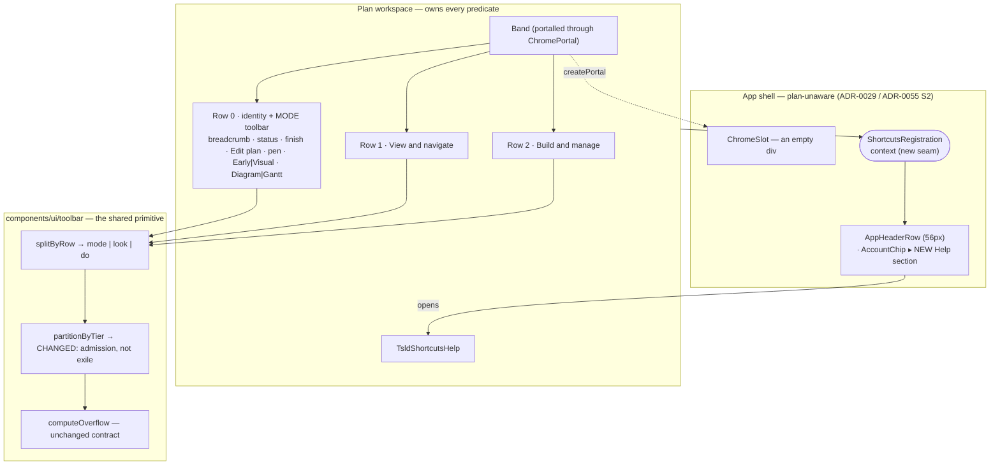
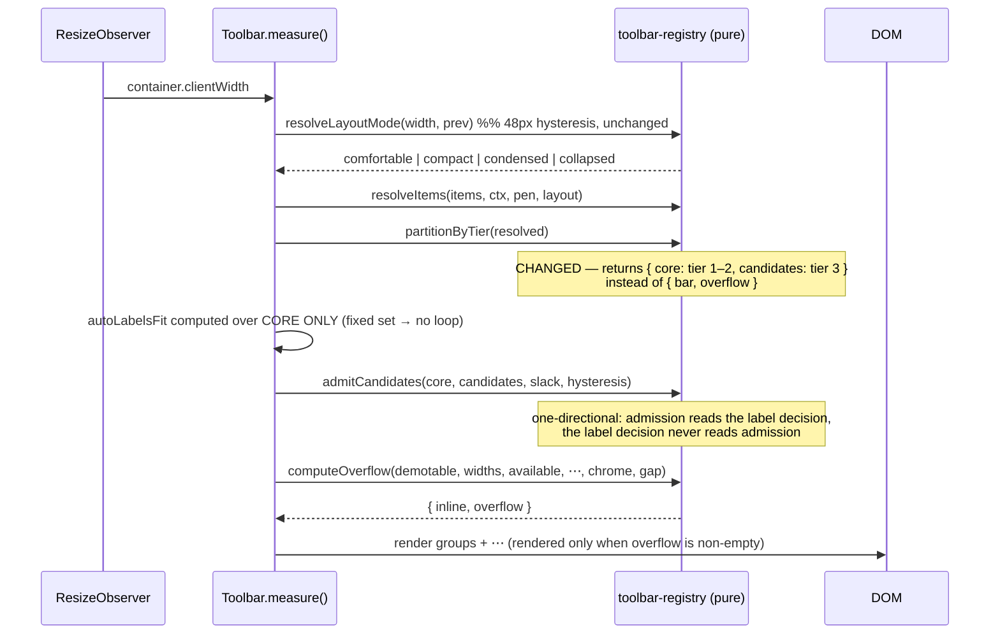
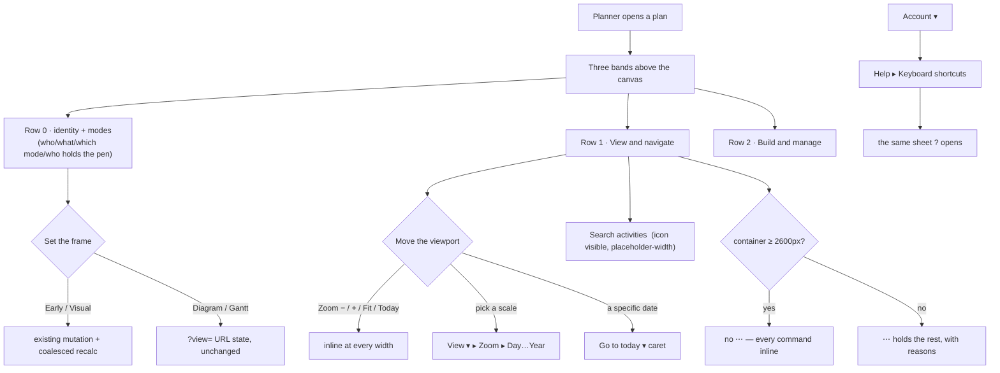

# Feature Spec: Workspace modes — the mode cluster, three bands, and a `⋯` that empties

- **Status:** Draft — **awaiting product-owner approval**
- **Author(s):** Claude Code (feature-analyst), for James Ewbank
- **Date:** 2026-08-12
- **Tracking issue / epic:** _(to be raised)_
- **Roadmap link:** the plan workspace / TSLD command surface (ADR-0030 → ADR-0031 → ADR-0090 lineage)
- **Related ADR(s):** amends **ADR-0031** (registry, 7-group taxonomy, the reserved view-mode slot,
  the two-row amendment) and **ADR-0090** (a row is a budget; the four tier-3 demotions; the fold;
  the header merge). Builds on ADR-0029/ADR-0055 S2 (the shell stays plan-unaware), ADR-0056 §1
  (range-anchored presets), ADR-0064 §3 (no fourth overlay), ADR-0082 (shade with a reason),
  ADR-0081 (a milestone names its entry point), ADR-0088 (flag classification).
  **A new ADR is required — see §4.8.**
- **Predecessor spec:** [`docs/specs/workspace-layout/`](../workspace-layout/) — its measurements are
  cited throughout and are **not** re-derived.

---

## 0. What this document is standing on, and what it is not

ADR-0090's own first consequence is that it was wrong three times because it was drafted without a
shell. This spec is drafted the same way. So every figure below is one of exactly three kinds, and
each is labelled in place:

| Kind                 | Meaning                                                                   |
| -------------------- | ------------------------------------------------------------------------- |
| **[MEASURED]**       | A figure from a browser run, with the document and section that holds it. |
| **[READ]**           | A fact read out of source, with file and line.                            |
| **[TO BE MEASURED]** | Arithmetic over measured inputs. **Not evidence.** M0 settles it.         |

Nothing marked `[TO BE MEASURED]` may be quoted downstream as if it were measured — that is the
ADR-0076 Class 3 failure this epic's predecessor recorded committing twice inside one milestone.

**Two claims inherited from the brief were checked rather than accepted** (PROCESS.md, "the brief is
not evidence"), and both changed the design:

1. The brief says the search field's leading icon "must actually render… if it is not visible it is
   misplaced, not missing". **Confirmed as present in source and identified as most likely painted
   under the input's own opaque background** — see §3.2. That changes the fix from "add an icon" to
   "position it the way the house primitive already does", which is a two-line change with a
   regression test rather than a new control.
2. The brief says making `tier: 3` mean "first to demote" lets the `⋯` be genuinely empty. **The
   naive form of that change would silently withdraw the labels ADR-0090 M2 bought**, because
   `autoLabelsFit` sums the whole `bar` and tier-3 items are outside it by construction
   (`toolbar-registry.ts:452-460`, `Toolbar.tsx:310-334`) — which is the reason M2 chose tier 3 over
   a low `priority` in the first place. §4.6 designs around it; the ADR has to say so.

**One live drift finding, made while reading the inputs.** ADR-0090's Follow-ups say
_"`docs/DESIGN_SYSTEM.md` gains the toolbar layout-mode ladder"_ and _"ADR-0031's 'add a command'
recipe gains `priority` and the D5 rule"_. **Neither has landed** — grepping `DESIGN_SYSTEM.md` for
`comfortable|condensed|collapsed|toolbar` returns no layout-band section, and `ADR-0031:62`'s
`ToolbarItem` shape still has no `priority`. That is the **M5-a shape** ADR-0090 itself named as a new
kind of drift for this register: a document describing work correctly and the work not happening,
with nothing recording it. This epic absorbs both (M7-T3).

---

## 1. Business understanding

### Problem

ADR-0090 M1–M5 shipped and released as `web-v0.85.0`. It fixed a live WCAG 2.2 §2.5.8 failure, took
44 toolbar stops to 28, and bought both rows their labels at 1920 for the first time
**[MEASURED — `m2-item-widths.md`, "The decision landed"]**. The product owner then used the result on
the 24" 1920×1080 monitor the epic was opened on, and reported six things. They are not a second
complaint about the same defect; they are what becomes visible once the row fits.

1. **The mode setters read as commands.** `Early | Visual` and `Diagram | Gantt` sit inside Row 1
   between `View ▾` and the Find cluster **[READ — `tsld-toolbar-items.tsx:2057-2132`, group `lens`]**,
   in the same visual idiom as Zoom out, Fit and Go to today. In the product owner's words they
   _"set the tone for how the rest of the plan is going to be edited and viewed"_. A row of commands
   is a list of things you do next; a mode is the frame everything after it happens in. The position
   asserts the wrong one.
2. **Four bands sit above the canvas.** App header 56 · plan identity 45 · Row 1 45 · Row 2 44 =
   **249 px** **[MEASURED — `m4-vertical-stack.md` §2/§3]** against a **541 px** canvas at 1080. The
   canvas is the product. ADR-0090 M4 recovered 8 px and its own document says so rather than
   claiming a success.
3. **Two controls answer for one subject and neither names it.** Below `comfortable`, Zoom out, Zoom
   in, Fit and Go to today fold into `Zoom ▾` **[READ — `viewportCommandsAreFolded`,
   `tsld-toolbar-items.tsx:718-720`]**, a trigger whose icon is `CalendarRange` and whose label is the
   current preset (`docs/TECH_DEBT.md` #130). So the four most-used viewport commands live behind a
   button that says "Week" and draws a calendar.
4. **`Go to date` and `Go to today` are two controls for one act.** Today _is_ a date.
5. **The search field is the widest thing on Row 1 at 240 px** **[MEASURED — `m2-item-widths.md`,
   Row 1 table]**, sized to a placeholder longer than any query most planners type, and its leading
   Search icon does not appear.
6. **The `⋯` never empties, at any width.** The product owner spanned the window across two monitors
   and the overflow was still there. **Cause established by reading the code**: `partitionByTier`
   sends every `tier: 3` item to the overflow **unconditionally, with no width test at all**
   **[READ — `toolbar-registry.ts:452-460`]**. Four items carry that tier
   (`next-conflict`, `float-paths`, `shortcuts`, `clear-visual-placement`) because ADR-0090 M2 put
   them there to buy the other commands their labels at 1920. So on a 3840 px span the row has ~2300
   px of slack and still hides four commands behind a menu.

Underneath five of the six is one sentence: **the command surface has no vocabulary for anything that
is not a command.** A mode, a fact, a subject heading and a preference all get rendered as a button
in a row, because a button in a row is the only thing the registry knows how to make.

### Users

| Role               | What changes                                                                                                                                   |
| ------------------ | ---------------------------------------------------------------------------------------------------------------------------------------------- |
| **Planner**        | The primary user. Gains canvas height, a mode cluster that reads as one, one viewport subject, and — at wide widths — an empty `⋯`.            |
| **Contributor**    | Same surface. The scheduling-mode segment stays **shaded with its reason** (`ctx.setSchedulingMode === null` → `scheduleRefusal`) — unchanged. |
| **Viewer**         | Row 2 is shaded as a set (ADR-0031 §4) and stays so. The view switch (`Diagram                                                                 | Gantt`) is offered to every role — reading is not an edit — and moving it changes nothing about that **[READ — `tsld-toolbar-items.tsx:2104-2106`]**. |
| **Org Admin**      | No difference from Planner on this surface.                                                                                                    |
| **External Guest** | **Out of scope entirely.** The guest view is a separate session-less surface (ADR-0051 F-M4) and renders none of these controls.               |

No permission changes. No role gains or loses a capability anywhere in this epic.

### Primary use cases

1. Set the scheduling mode and the view type, and see at a glance which are active, without hunting
   in a row of commands.
2. See more of the diagram on a 1920×1080 monitor.
3. Reach every viewport command — step, fit, today, and pick a scale — from one place that says what
   it is about.
4. Search the plan, from a field that looks like a search field.
5. On a very wide window, reach every command directly, with an empty `⋯`.
6. Find the keyboard shortcuts sheet where help lives, not in the command bar.

### User journeys

**Happy path.** A planner opens a plan on a 1920×1080 monitor. The chrome above the canvas is three
bands, not four. The top of the workspace band carries the plan's identity — breadcrumb, status,
project finish, Edit plan, the pen control — and, beside the pen, the two mode segments. Below it,
one row of view/navigate commands and one row of build/manage commands, both labelled. They set
`Visual` mode, switch to `Gantt` and back, open `View ▾` to pick a `Month` scale, press `Fit to plan`
inline, and type three letters into a search field that is the width of its own placeholder and shows
a magnifier.

**Alternate — a narrow window.** At 1024 the identity content compresses and the mode segments go
icon-only. Nothing is lost; the `⋯` holds whatever does not fit, and every command is still reachable
(`e2e-toolbar-fit` S3).

**Alternate — a very wide window.** Spanned across two monitors, all four former tier-3 commands sit
inline with their labels and the `⋯` does not render.

**Alternate — a Viewer.** Row 2 is shaded as a set with its reason. The scheduling-mode segment is
shaded with `scheduleRefusal`; the view switch is live. Nothing is hidden, so two people looking at
the same plan see the same bar (ADR-0090 M2-as-built §4).

### Expected outcomes

- The plan's mode is stated once, in one place, above the commands it governs.
- More canvas on the monitor the complaint came from.
- One subject per control; `docs/TECH_DEBT.md` #130 closed by removing the control that carried the
  wrong icon, not by choosing a better one.
- The `⋯` becomes what its name says: the overflow, which is empty when nothing overflows.
- `docs/TECH_DEBT.md` #126 closed (the four segment icons exist), #130 closed, #61's `tier`/`showLabel`
  split finally documented, and ADR-0090's two unlanded follow-ups landed.

### Success criteria

Each is a number a test can take, and each names the instrument.

| #   | Criterion                                                                                                                                                                   | Instrument                                           |
| --- | --------------------------------------------------------------------------------------------------------------------------------------------------------------------------- | ---------------------------------------------------- |
| S1  | **Three bands above the canvas at ≥ 1536 px.** `aboveCanvas` falls by the full height of the identity row — 249 → **≈204 px** `[TO BE MEASURED]` — and the canvas gains it. | `measure-toolbar/vertical-stack.spec.ts`             |
| S2  | **Every row lays out inside its container at all eight widths**, now for **three** rows rather than two.                                                                    | `e2e-toolbar-fit` S4, `PINNED_FLOOR_WIDTH` stays 768 |
| S3  | **No regression in labelled counts at 1920**: Row 1 ≥ 13 labelled of ≥ 14 inline, Row 2 ≥ 12 of ≥ 14 **[MEASURED baseline — `m3-narrow-widths.md` §3]**.                    | `measure-toolbar/item-widths.spec.ts`                |
| S4  | **At a container ≥ 2600 px, neither command row renders a `⋯`.**                                                                                                            | a new `e2e-toolbar-fit` assertion (S8)               |
| S5  | **Every command remains reachable at every width** — inline or in the `⋯`.                                                                                                  | `e2e-toolbar-fit` S3, unchanged                      |
| S6  | **Every clickable control is a ≥ 24 px pointer target** on all three rows.                                                                                                  | `e2e-toolbar-fit` S5/S7, unchanged                   |
| S7  | **The mode cluster is one contiguous cluster adjacent to the pen control at every band**, and each segment announces exactly one pressed state.                             | unit + journey                                       |
| S8  | **The search field's leading icon is visible** (non-zero painted box, not covered).                                                                                         | a browser assertion, verified red first              |

### Open questions

**CRITICAL — only the product owner can answer. Everything else has a stated default and proceeds.**

> **CQ-1 — the four segment icons (and a fifth glyph).** `docs/TECH_DEBT.md` #126 is a **blocking
> prerequisite** for compacting the mode cluster: `mode-early`, `mode-visual`, `view-tsld` and
> `view-gantt` carry **no `icon` field at all** **[READ — `tsld-toolbar-items.tsx:2057-2132`]**, and
> ADR-0090 M3 built the icon-only treatment anyway, rendered four blank 16 px buttons and had the fit
> gate fail it as a §2.5.8 violation within the hour. Choosing a glyph for **Early** versus **Visual**
> scheduling is a statement about what those modes _are_ — a domain-design decision, not a layout one.
> **Three candidate sets, all verified to exist in the installed `lucide-react@1.28.0`**
> **[READ — `node_modules/.pnpm/lucide-react@1.28.0_react@19.2.8/…/lucide-react.d.ts`, lines 342, 1031, 4151, 9650, 10261, 13745, 14109, 22273, 22559]**:
>
> |                                   | Early                                                       | Visual                         | Diagram     | Gantt        |
> | --------------------------------- | ----------------------------------------------------------- | ------------------------------ | ----------- | ------------ |
> | **A — mechanism** _(recommended)_ | `ArrowLeftToLine` (pushed to the earliest possible instant) | `Hand` (hand-placed)           | `Waypoints` | `ChartGantt` |
> | **B — agency**                    | `Zap` (computed)                                            | `MousePointer2` (you place it) | `Network`   | `ChartGantt` |
> | **C — alignment**                 | `AlignHorizontalJustifyStart`                               | `Move`                         | `GitBranch` | `ChartGantt` |
>
> **Default if no answer is given:** set **A**, adopted provisionally, with the milestone's changeset
> saying it is provisional. The cost of guessing is a glyph nobody recognises; the cost of waiting is
> that M1 cannot compact the cluster below `compact` and the identity row must grow its own `⋯` at
> narrow widths, which puts a mode you cannot see armed behind a menu — verbatim the ADR-0064 defect.
> **The same pass must also pick the viewport glyph for #130** if D3 (§4.4) is ever reversed; as
> specified, D3 deletes that control, so #130 closes with no glyph chosen.
>
> **CQ-2 — is the identity content allowed to compress below `comfortable`?** Decision 2 says the
> identity line folds into a command row. The measurement may show it does not fit at 1440 or 1024.
> The two honest answers are (a) it compresses — the breadcrumb collapses to the plan name, the status
> pill becomes a dot, the finish read-out hides (it already self-hides before first recalculation
> **[READ — `plan-workspace-toolbar.tsx:813-819`]**); or (b) it keeps its own row below `comfortable`,
> so the "three bands" outcome holds at ≥ 1536 and four bands remain on a Surface Pro.
> **Default: (a) compress, with (b) as the automatic fallback if M0's numbers refuse it** — stated in
> advance so the decision is taken by the measurement rather than by whoever is holding the branch.
>
> **CQ-3 — does the Project-finish read-out come back to the command row?** ADR-0090 M2-T3 moved it
> off Row 1 because it cost 150 px of pinned width **[MEASURED — `m2-item-widths.md`, Row 1 table]**
> and because a fact inside `role="toolbar"` is a category error (D1). Decision 2 makes the question
> moot in the good direction: if the identity content merges into Row 1, the finish read-out lands
> **beside `Summary ▾`** as part of the identity cluster — where the product owner wants it — **without**
> becoming a toolbar item again. **Default: yes, by merging, never by re-registering it.** If M0 says
> the merge cannot carry it, it stays in the identity content and the answer is no.

**Non-critical — defaults stated, work proceeds.**

| Q                                                                       | Default taken                                                                                                                                                                                                                                                                                                                                         |
| ----------------------------------------------------------------------- | ----------------------------------------------------------------------------------------------------------------------------------------------------------------------------------------------------------------------------------------------------------------------------------------------------------------------------------------------------- |
| Shape of the mode cluster (2×2 grid / two stacks / two inline segments) | **Two inline segments, left to right: scheduling mode, then view type.** A 2×2 grid implies one axis and these are two unrelated binary choices. Vertical stacks re-spend the height the epic exists to recover.                                                                                                                                      |
| Where the shortcuts sheet is opened from once it leaves the toolbar     | The **account menu** (`account-chip.tsx`), under a new **Help** section, populated through a registration seam so the shell stays plan-unaware (§4.5).                                                                                                                                                                                                |
| The `…` convention                                                      | **Kept and written down**, with the rule stated as: an ellipsis marks a command that needs more input before it acts; **a control with a visible disclosure caret already says that and does not take one**. Under that rule the current set is already consistent (§3.4) — the finding is that the rule is unwritten, not that the labels are wrong. |
| Shortened search placeholder                                            | `Search activities` — and the `aria-label` stays `Search or filter activities`, so the accessible name does not shrink.                                                                                                                                                                                                                               |
| Feature flag                                                            | **None.** See §4.9.                                                                                                                                                                                                                                                                                                                                   |
| `VITE_CANVAS_WORKSPACE`                                                 | **Not this epic's business.** Its deferral trigger was re-recorded as `flag-cleanup pass` on 2026-08-12 **[READ — `scripts/flag-retirement.json:317-321`]**, so epic-touch no longer fires it.                                                                                                                                                        |

---

## 2. Functional requirements

### User stories & acceptance criteria

> **US-1** — As a **Planner**, I want the scheduling mode and the view type to sit with the plan's
> identity and the pen, so that I read them as the frame everything else happens in rather than as two
> more commands.
>
> **Acceptance criteria**
>
> - **Given** a plan open at any width, **when** the workspace renders, **then** the `Early | Visual`
>   and `Diagram | Gantt` segments render on the plan identity line, adjacent to the pen control, and
>   **not** in either command row.
> - **Given** a Contributor with no write right, **when** the segments render, **then** the scheduling
>   pair is shaded with its existing reason, `aria-describedby`-linked to the control and never folded
>   into the accessible name (ADR-0082), and the view pair is live.
> - **Given** either pair, **when** a screen-reader user arrows across it, **then** exactly one member
>   reports the pressed state, and the pair is one demotion unit — one half can never be inline while
>   the other is in a menu (ADR-0090 D3; `defineToolbar` already refuses a tier-mismatched pair
>   **[READ — `toolbar-registry.ts:371-388`]**).
> - **Given** a width at which the cluster cannot render labels, **when** it compacts, **then** each
>   member paints a real icon of ≥ 24 px, never a blank box (the #126 regression, gated).

> **US-2** — As a **Planner** on a 1920×1080 monitor, I want fewer bands above the canvas, so that I
> see more of the diagram.
>
> **Acceptance criteria**
>
> - **Given** a container ≥ 1536 px, **when** the workspace renders, **then** exactly **three** bands
>   sit above the canvas: the app header row, the merged identity+command row, and the remaining
>   command row.
> - **Given** the same viewport, **when** `measure:toolbar` runs, **then** `aboveCanvas` is lower than
>   the 249 px recorded in `m4-vertical-stack.md` §3 by the full height of the row that was removed,
>   and the reduction is **recorded as measured**, never as arithmetic.
> - **Given** any of the eight gated widths, **when** the fit gate runs, **then** every row still lays
>   out inside its container and every control is a ≥ 24 px clickable target.
> - **Given** a plan that has never been calculated, **when** the merged row renders, **then** the
>   project-finish read-out shows nothing rather than an em dash (behaviour preserved from
>   `ProjectFinishChip`).

> **US-3** — As a **Planner**, I want one control that owns the viewport, so that I stop hunting for
> `Fit to plan` behind a button labelled "Week".
>
> **Acceptance criteria**
>
> - **Given** any width, **when** Row 1 renders, **then** `Zoom out`, `Zoom in`, `Fit to plan` and
>   `Go to today` are ordinary inline commands subject only to width — the `viewportCommandsAreFolded`
>   predicate no longer exists.
> - **Given** `View ▾` is open, **when** the panel renders, **then** it carries a **Zoom** section
>   holding the five range-anchored presets as a radio group, each stating its target visible range
>   exactly as the menu does today.
> - **Given** a plan with no computed diagram, **when** the Zoom section renders, **then** the presets
>   are shaded with the existing `ZOOM_DISABLED_REASON`, not hidden.
> - **Given** the Gantt view, **when** a preset is picked, **then** it applies exactly as it does today
>   — ADR-0056's behaviour is relocated, not withdrawn (§4.4).
> - **Given** a width at which the four viewport commands do not fit, **when** the row demotes them,
>   **then** they are reachable in the `⋯` with their reasons (S5).

> **US-4** — As a **Planner**, I want one control for "go somewhere in time", so that Today and a date
> are not two buttons.
>
> **Acceptance criteria**
>
> - **Given** Row 1, **when** it renders, **then** `Go to today` is a split button whose primary jumps
>   to today and whose caret opens the existing Go-to-date surface.
> - **Given** the split button, **when** a keyboard user presses `ArrowDown` or `ArrowUp` on the
>   primary, **then** the date surface opens and takes focus (the APG contract `ToolbarSplitButton`
>   already guarantees **[READ — `ToolbarSplitButton.tsx:82-88`]**).
> - **Given** the caret, **when** it renders at any gated width, **then** it is a ≥ 24 px pointer
>   target (`e2e-toolbar-fit` S7 — the sweep that found 23 × 36 on the two existing carets).
> - **Given** the date surface closes, **when** focus restores, **then** it lands on the **primary**,
>   never the `tabIndex={-1}` caret.

> **US-5** — As a **Planner**, I want the search field to look like a search field and take only the
> width it needs.
>
> **Acceptance criteria**
>
> - **Given** the field renders, **when** it is painted, **then** the leading magnifier is visible —
>   asserted against the painted box, not against the presence of the element.
> - **Given** the `comfortable` band, **when** the field renders, **then** its width is its shortened
>   placeholder plus its chrome, and it is no longer the widest control on the row.
> - **Given** a screen reader, **when** the field takes focus, **then** its accessible name is still
>   `Search or filter activities` — shortening the placeholder must not shorten the name.
> - **Given** the flag-off stub and the live control, **when** both render, **then** they are the same
>   width and carry the same icon treatment (one shared function, as `searchFieldWidth` already is
>   **[READ — `tsld-toolbar-items.tsx:752-754`]**).

> **US-6** — As a **Planner**, I want the keyboard-shortcuts sheet where help lives.
>
> **Acceptance criteria**
>
> - **Given** a plan workspace is open, **when** the account menu is opened, **then** a **Help**
>   section offers **Keyboard shortcuts**, and selecting it opens the same sheet the `?` key opens.
> - **Given** no plan workspace is open, **when** the account menu is opened, **then** the item is
>   **omitted** — the action does not apply (ADR-0082's discriminator), and a menu item that opens
>   nothing is the dead end this repository keeps recording.
> - **Given** the sheet closes, **when** focus restores, **then** it returns to the account-menu
>   trigger, through `Menu`'s own `restoreFocusRef`.
> - **Given** the toolbar, **when** it renders, **then** `shortcuts` is gone from the registry and
>   `?` still opens the sheet.
> - **This buys zero width and the changeset must say so.** `shortcuts` is `tier: 3`, so it is outside
>   `bar` and pays nothing today **[READ — `toolbar-registry.ts:452-460`, `Toolbar.tsx:277-294`]`.
Claiming a width saving here would be the exact false claim `design.md` §Q2 warned about for the
>   Legend.

> **US-7** — As a **Planner** on a very wide window, I want the `⋯` to be empty when there is room.
>
> **Acceptance criteria**
>
> - **Given** a container ≥ 2600 px, **when** either row renders, **then** no `⋯` renders and every
>   command is inline.
> - **Given** a 1920 px viewport, **when** either row renders, **then** the labelled counts do not
>   regress below the S3 baseline — i.e. admitting tier-3 items must never cost the row its labels.
> - **Given** a container width dragged across the admission boundary, **when** it crosses, **then**
>   the row does not oscillate (`e2e-toolbar-fit` S6, extended to the boundary widths).
> - **Given** any width, **when** an item is admitted or demoted, **then** the decision is a pure
>   function of the container width and the registry — never of the previous decision's output.

### Workflows

**Setting the scheduling mode.** Planner presses `Visual` on the identity line → `ctx.setSchedulingMode('VISUAL')` → the existing plan mutation and coalesced recalculation run exactly as today → the segment's `isActive` flips. **No behavioural change whatsoever; only the DOM position moves.**

**Picking a scale.** Planner opens `View ▾` → the **Zoom** section → picks `Month` → `ctx.setZoomPreset('month')` → `pxPerDayForPreset(level, width)` derives `pxPerDay` at pick time from the canvas width, unchanged (ADR-0056 §1).

**Going to a date.** Planner presses the `Go to today` primary → the viewport jumps. Or presses its caret → the date surface opens → picks a date → `ctx.goToDate(iso)`.

**Reaching a demoted command.** Unchanged: the `⋯`, with `menuitemcheckbox` for toggles and `menuitemradio` for a `demotionGroup` pair (ADR-0090 M5-d).

### Edge cases

| Case                                      | Expected behaviour                                                                                                                                  |
| ----------------------------------------- | --------------------------------------------------------------------------------------------------------------------------------------------------- |
| **No computed diagram**                   | Every canvas-dependent control shades with its existing reason. Nothing is hidden — the stable-shape rule (ADR-0031).                               |
| **Gantt view active**                     | Canvas-only commands shade with `CANVAS_ONLY_REASON`; `float-paths` stays view-agnostic (pinned by `float-paths-view-agnostic.structural.test.ts`). |
| **Pen not held**                          | Row 2 shades as a set; the scheduling-mode pair shades with `scheduleRefusal`; the view pair stays live.                                            |
| **Container 768 px**                      | Three rows must each still lay out inside their container (`PINNED_FLOOR_WIDTH` = 768). This is the sharpest budget risk in the epic (§3.5).        |
| **Container 0 px** (hidden pane, jsdom)   | `Toolbar` holds its previous state and charges no chrome **[READ — `Toolbar.tsx:262-263, 292-294`]**. Unchanged; ~25 unit suites depend on it.      |
| **Window dragged across a band boundary** | 48 px hysteresis, both for the existing layout bands and for the new tier-3 admission boundary.                                                     |
| **A plan the reader cannot write**        | Identical set of controls, differently shaded. Never a different set — two people on one plan must see one bar (ADR-0090 M2-as-built §4).           |
| **The account menu with no plan open**    | The Help section's shortcuts item is absent.                                                                                                        |
| **`prefers-reduced-motion`**              | No new motion is introduced.                                                                                                                        |

### Permissions

**No change.** Nothing in this epic touches an API, a DTO, a guard or a permission. Mapping to
ADR-0012, for completeness:

| Control                          | Gate today                   | Gate after                                                              |
| -------------------------------- | ---------------------------- | ----------------------------------------------------------------------- |
| `Early                           | Visual`                      | `ctx.setSchedulingMode !== null` (writer), shaded with reason otherwise | identical |
| `Diagram                         | Gantt`                       | none — every role                                                       | identical |
| Zoom presets / viewport commands | `hasDiagram && canvasActive` | identical                                                               |
| Search                           | `hasDiagram`                 | identical                                                               |
| Keyboard shortcuts               | none                         | identical                                                               |
| Row 2 authoring set              | `penGated` (ADR-0028)        | identical                                                               |

The toolbar **reflects** deny-by-default gating and never adds authorisation (ADR-0031 §6). That
sentence stays true after this epic, and a structural test should keep it that way (§4.7).

### Validation rules

None. There is no form, no field and no persisted value in this epic. The two client-side invariants
worth stating as rules, both compiler- or test-enforced:

- **A `demotionGroup`'s members share a tier** — already thrown by `defineToolbar`.
- **A registry item is on exactly one row** — `splitByRow` widens from two rows to three, and the
  partition must stay total: every item lands on exactly one row, asserted structurally (the
  ADR-0089 partition-test pattern, which catches a member claimed twice or by nobody — something a
  per-row suite structurally cannot).

### Error scenarios

Frontend-only; there is no request to fail. The table is the equivalent — what can go wrong on the
surface and what the reader gets.

| Scenario                                                         | Detection                                 | User-facing result                                                                                                                 |
| ---------------------------------------------------------------- | ----------------------------------------- | ---------------------------------------------------------------------------------------------------------------------------------- |
| A command cannot act (no diagram / not the canvas view / no pen) | the item's `isEnabled` + `disabledReason` | shaded control, reason `aria-describedby`-linked (ADR-0082); never hidden, never a `title`-only reason (the ADR-0090 M5-d finding) |
| The row is too narrow for a command                              | `computeOverflow`                         | the command demotes into the `⋯` with its reason; it is never clipped, never omitted                                               |
| The identity content is too wide for the merged row              | measured band                             | it compresses per CQ-2(a), or keeps its own row per CQ-2(b) — never truncated to unreadability, never scrolled out of a hidden box |
| A segment renders with no icon in a compact band                 | `e2e-toolbar-fit` S5/S7                   | **CI fails.** This is #126's exact failure and the gate caught it inside an hour last time                                         |
| The shortcuts sheet is unreachable with a plan open              | journey step                              | CI fails (the ADR-0081 entry-point rule)                                                                                           |

---

## 3. Technical analysis

| Area           | Impact         | Notes                                                                                                                                                                                                                                                                                                 |
| -------------- | -------------- | ----------------------------------------------------------------------------------------------------------------------------------------------------------------------------------------------------------------------------------------------------------------------------------------------------- |
| Frontend       | **high**       | `components/ui/toolbar/*` (a shared primitive), `features/tsld/toolbar/*`, `components/layout/workspace/plan-workspace-toolbar.tsx`, `components/layout/account-chip.tsx`, `components/layout/chrome/*` (one registration seam).                                                                      |
| Backend        | **none**       | No module, service or endpoint is touched.                                                                                                                                                                                                                                                            |
| Database       | **none**       | No model, column, index, constraint or migration. **The database-architect agent is therefore not engaged — because there is no schema change, not because one was judged too small** (CLAUDE.md §19.3).                                                                                              |
| API            | **none**       | No route, DTO, status code or OpenAPI change.                                                                                                                                                                                                                                                         |
| Security       | **none**       | No auth, no scope, no input, no secret. The toolbar reflects gating; it never grants.                                                                                                                                                                                                                 |
| Performance    | **low–medium** | One new `<Toolbar>` instance (one more `ResizeObserver`); a second pass inside `measure()` for tier-3 admission; a shell-level registration for the shortcuts sheet. ADR-0031's merge gate — a toolbar re-render must not re-render `TsldCanvas` or re-run `describeActivity` — applies to all three. |
| Infrastructure | **none**       | No service, env var, container or CI service. Two new CI steps at most (journey + measurement are already wired).                                                                                                                                                                                     |
| Observability  | **none**       | No log, metric, trace or health change.                                                                                                                                                                                                                                                               |
| Testing        | **high**       | Unit (registry partition, layout, label policy, admission), the fit gate widened to three rows plus S8, a flag-on-equivalent journey, the measurement harnesses repaired and extended.                                                                                                                |

**The CPM engine is not imported and no migration runs**, so the ADR-0034 recalculation parity gate is
untouched **by construction** — in its honest form: there is nothing here to hold parity for. This is
checkable rather than asserted: no file in the change set imports from `apps/api/src/modules/schedule/engine`.

### 3.1 The width budget — where the slack comes from and where it goes

All inputs `[MEASURED — `m2-item-widths.md`, `m3-narrow-widths.md`]`; every derived figure is
`[TO BE MEASURED]` and is M0's first job.

| Movement                                                                                                   | Row 1 effect at 1920                                                                                                |
| ---------------------------------------------------------------------------------------------------------- | ------------------------------------------------------------------------------------------------------------------- |
| **Today's baseline**                                                                                       | 1543 px laid out against an 1832 px container → **289 px slack** `[MEASURED]`                                       |
| M1 · mode cluster leaves (`mode-early` 96 + `mode-visual` 102 + `view-tsld` 76 + `view-gantt` 55 + 4 gaps) | **≈ −345 px** `[TO BE MEASURED]`                                                                                    |
| M3 · `zoom-preset` leaves (102 px, a pinned `render` item)                                                 | **≈ −106 px** `[TO BE MEASURED]`                                                                                    |
| M4 · `go-to-date` (132) folds into `today` (32 icon-only / ~120 labelled) as one split button              | **≈ −110 px** `[TO BE MEASURED]`, and it removes an `'auto'` item from the label sum, which helps twice             |
| M4 · search field 240 → its placeholder floor                                                              | **≈ −80 px** `[TO BE MEASURED]`                                                                                     |
| M2 · identity content arrives                                                                              | **+450…500 px** `[TO BE MEASURED]` — the brief's estimate, and the single number the epic most needs from a browser |
| M6 · tier-3 items admitted, labelled (`shortcuts` 171 + `next-conflict` 126 + `float-paths` 119)           | **+416 px** `[MEASURED — `m2-item-widths.md`, "After M2-T3"]** — spent only where it fits                           |

Two things follow, and both are decisions rather than observations, so they are stated now:

1. **M2 and M6 compete for the same slack.** The identity merge (the product owner's decision 2) has
   priority; tier-3 admission takes whatever is left, at whatever width it is left at. M6 must not be
   allowed to push the identity content back onto its own row.
2. **The sharpest risk is not 1920, it is 768.** §3.5.

### 3.2 The search icon — read, and identified

The brief is right that the icon exists. **Both** copies render it
**[READ — `tsld-toolbar-items.tsx:992-995` (flag-off stub) and `:1064-1067` (live control)]**:

```
<Search aria-hidden="true" className="text-muted-foreground pointer-events-none -mr-6 size-4" />
<Input … className={cn('h-8 pl-8 text-sm', …)} />
```

The icon is a **non-positioned flex item** followed by the `<Input>`, pulled under it by `-mr-6`. The
`Input` primitive carries `bg-field` — an **opaque background**
**[READ — `components/ui/input.tsx:17`]**. Per CSS Flexbox §8.2 flex items paint as inline-blocks in
tree order, so the later sibling's background paints over the earlier sibling. The house search
primitive solves the identical problem the other way — `relative` container, `absolute` icon
**[READ — `components/ui/search-field.tsx:52-56`]** — which puts the icon in the positioned-descendant
paint phase, above the input's background.

**So the leading hypothesis is: present, correctly sized, and painted underneath the field.** It is
labelled a hypothesis because nothing here has been run. **M0-T2 establishes it in a browser before
anything is changed**, and the fix is then the two-line adoption of the house pattern, with a
regression test verified red first.

**Why no gate saw it.** `e2e-toolbar-fit` exempts the whole `search` item from S7 under 2.5.8's
_Inline_ exception **[READ — `fit.spec.ts:85-94`]**, and S1/S5 measure `[data-toolbar-item]`, which is
the `<Input>` itself. A decorative `aria-hidden` glyph is invisible to axe. Nothing in the repository
could have reported this, which is the argument for the assertion S8 adds.

### 3.3 The `⋯` that never empties — read, and why the obvious fix regresses

`partitionByTier` is four lines and has no width parameter **[READ — `toolbar-registry.ts:452-460`]**:
tier 3 goes to `overflow`, always. That much the brief has right.

What the brief does not have is why M2 chose it. `autoLabelsFit` sums **the whole `bar`**, not the
inline set **[READ — `Toolbar.tsx:310-334`]** — deliberately, because a half-labelled row reads as
broken, and because costing only the inline set is a feedback loop (label → wider → overflow →
narrower → label). Tier 3 is outside `bar`, so a tier-3 item pays **nothing**; a merely
low-`priority` item still pays its label. That is the whole reason the four moved
**[READ — `tsld-toolbar-items.tsx:116-134`]**, and `showLabel: 'never'` was measured and rejected as
insufficient (308 px against a 360 px gap).

So "tier 3 = first to demote" done naively re-admits 416 px of label cost into Row 1's projection at
every width, `autoLabelsFit` goes false, and **the row loses all thirteen of its labels to gain three
icon-only buttons**. That is a strictly worse product than today, and it would ship looking like a
tidy-up. §4.6 designs the version that does not do that.

### 3.4 The `…` audit — enumerated, and the convention is already consistent

Enumerated from the registry **[READ — `tsld-toolbar-items.tsx`, all `label:` fields]**. Exactly two
labels carry an ellipsis: `Report progress…` (`:1858`) and `Schedule settings…` (`:2544`).

The brief's example — _"`Go to date` opens a popover, needs input, and does not carry one"_ — is
**correct about the behaviour and wrong about the inconsistency**, and the reason is one line of the
primitive: `go-to-date` is a `ToolbarPopover`, and `ToolbarPopover` **always renders a
`ChevronDown`** **[READ — `ToolbarPopover.tsx:185`]**. So the control already says "there is more
here" in the channel a caret exists for. Adding an ellipsis beside a caret says it twice.

That gives the rule, which is the deliverable — the labels are not what needs changing:

> **An ellipsis marks a plain command that needs more input before it acts. A control that renders a
> disclosure caret (`ToolbarPopover`, a menu-button, a split-button caret) already says so, and does
> not take one.**

Checked against every current label under that rule, the set is consistent: the two ellipsis-carrying
items are plain buttons that open input-taking dialogs; every caret-bearing trigger correctly has
none; `Keyboard shortcuts` correctly has none (it opens a sheet that takes no input); `Add activity`
correctly has none (it arms a canvas tool — ADR-0064). **So this epic writes the rule down and gates
it, and changes no label.** One incidental: the search **placeholder** ends in `…`, which is a
placeholder convention and not this one — worth a sentence in the doc so the next reader does not
"fix" it.

### 3.5 The narrow-width risk, stated plainly

Decision 3 deletes `viewportCommandsAreFolded`. That predicate is what keeps Row 1 inside its
container at 1024, 960 and 768: at those bands the four viewport commands are **not on the row at
all** `[READ — `tsld-toolbar-items.tsx:1979, 1993, 2007, 2023`]`, and Row 1 lays out at exactly its
container **[MEASURED — `m3-narrow-widths.md` §3: 936/936, 872/872, 680/680]**. There is **no slack**
at 768. Restoring four commands there costs ~144 px against a saving of ~52 px (the compact
`zoom-preset` trigger) `[TO BE MEASURED]`.

Three answers exist and the choice must be made from numbers, not from this paragraph:

- **(i)** They demote into the `⋯` at those bands, like any other over-budget command. Reachable, and
  ADR-0090 M3-b's objection ("only `Zoom ▾` names the subject") no longer applies, because M5-b
  established the trigger did not say "Zoom" **and** decision 3 removes the trigger entirely.
- **(ii)** They fold into `View ▾` alongside the presets at narrow bands — a fold whose host is the
  control that now owns the subject.
- **(iii)** The identity content keeps its own row below `comfortable` (CQ-2 fallback), which buys
  back nothing horizontally and is orthogonal.

**Default: (i)**, with (ii) as the answer if M3's measurement shows the `⋯` at 768 holding more than
half the row. This is written down now so that a milestone under time pressure does not quietly pick
whichever is easiest.

### Dependencies

- **CQ-1 (the four icons)** blocks compacting the mode cluster below `compact`, and therefore blocks
  M1's narrow-band behaviour. Nothing else in the epic depends on it.
- **M0's measurement** blocks M2's design (which row, and whether it compresses) and M6's admission
  thresholds. It does not block M1, M4 or M5.
- **M1 and M3 free the width M2 spends and M6 spends again.** Sequence is load-bearing.
- **`e2e-toolbar-fit` must be widened to three rows before M1 merges**, or the new row ships ungated —
  which is how the original §2.5.8 failure reached production.
- **No external dependency, no third party, nothing must land first outside this epic.**

---

## 4. Solution design

### 4.1 Architecture overview

The shape of the answer: **the mode cluster does not leave the registry — it gets a third row.** Every
guarantee the toolbar primitive provides (roving tabindex, `role="group"` labelling, pen gating as a
set, ADR-0082 reasons, `demotionGroup` pairing, width-driven demotion, the fit gate's sweeps) is
machinery this cluster needs and would otherwise be rebuilt by hand on the identity line. `splitByRow`
widens from `{look, do}` to `{mode, look, do}`; the identity line renders a third `<Toolbar>`.



Two boundaries are deliberately not crossed:

- **The shell stays plan-unaware.** It gains a _registration seam_ — "something can offer a shortcuts
  sheet" — exactly as `ChromeSlot` gains "something can render into this div". Neither knows what a
  plan is. This is ADR-0055 S3's argument, reused rather than re-argued.
- **No fourth surface over the canvas** (ADR-0064 §3, unchanged). Everything here lands in the band
  that already exists.

### 4.2 Data flow — how a width becomes a layout



**The convergence argument, stated because it is the part most likely to be got wrong.** `autoLabelsFit`
is computed over a set that does not change with the outcome (tiers 1–2 of `bar`). Admission is then a
one-way read of the leftover slack. Nothing downstream feeds back up. That is the same structural move
`deriveChromeWidth` makes — derive from static registry data rather than from the previous decision's
DOM — and it is why this is a design change rather than a threshold tweak.

### 4.3 User flow



### 4.4 Component changes

| Component                                                | Change                                                                                                                                                                                                                                                                                                                                                                                                                                                                                     |
| -------------------------------------------------------- | ------------------------------------------------------------------------------------------------------------------------------------------------------------------------------------------------------------------------------------------------------------------------------------------------------------------------------------------------------------------------------------------------------------------------------------------------------------------------------------------ |
| `components/ui/toolbar/toolbar-registry.ts`              | `ToolbarRow` gains `'mode'`; `splitByRow` returns three arrays. `partitionByTier` → `partitionByTier(resolved)` returning `{ core, candidates }`, plus a new pure `admitCandidates()`. `ToolbarItem.icon` becomes **required for any item whose row can render it label-less** — enforced by `defineToolbar`, which is the structural close of #126.                                                                                                                                       |
| `components/ui/toolbar/Toolbar.tsx`                      | `autoLabelsFit` computed over `core`; one admission pass; the `⋯` wrapper renders only when `overflowItems.length > 0` (already true — no change needed there).                                                                                                                                                                                                                                                                                                                            |
| `features/tsld/toolbar/tsld-toolbar-items.tsx`           | Four segment items move to `row: 'mode'` and gain icons. `zoom-preset` leaves the registry; its presets become a `View ▾` section. `viewportCommandsAreFolded` and `VIEWPORT_FOLD_COMMANDS` **deleted**; the four items lose their `isVisible` width predicates. `go-to-date` merges into `today` as a `ToolbarSplitButton`. `shortcuts` **deleted** from the registry. `SearchFieldControl`/`LiveSearchControl` adopt the `relative`/`absolute` icon pattern and a shortened placeholder. |
| `features/tsld/toolbar/ViewTogglesPanel`                 | Gains a **Zoom** section — a radio group over `ZOOM_LEVELS`, each row stating its range exactly as the menu does today, shaded (not hidden) with `ZOOM_DISABLED_REASON`. Precedent: `View ▾` already carries the `colour-by` radio group (ADR-0090 M2-as-built §2).                                                                                                                                                                                                                        |
| `components/layout/workspace/plan-workspace-toolbar.tsx` | The identity `<div>` and Row 1 merge into one flex row (or stay two below `comfortable`, per CQ-2). The mode `<Toolbar>` renders at the identity cluster's trailing edge, adjacent to `CompactPenStatus`.                                                                                                                                                                                                                                                                                  |
| `components/layout/chrome/`                              | A `ShortcutsRegistration` context — provider in the shell, `useRegisterShortcutsSheet()` called by the workspace, read by `AccountChip`. Modelled on `ChromeSlot`: the shell offers a seam, the workspace fills it.                                                                                                                                                                                                                                                                        |
| `components/layout/account-chip.tsx`                     | A **Help** section holding `Keyboard shortcuts`, rendered only when a sheet is registered.                                                                                                                                                                                                                                                                                                                                                                                                 |
| `apps/web/e2e-toolbar-fit/fit.spec.ts`                   | `ROWS` gains the mode row. New **S8**: at a container ≥ 2600 px neither command row renders a `⋯`. S6's oscillation sweep gains the admission boundary widths.                                                                                                                                                                                                                                                                                                                             |
| `apps/web/measure-toolbar/vertical-stack.spec.ts`        | Repair the plan-header locator (§4.7) and add an identity-content width probe.                                                                                                                                                                                                                                                                                                                                                                                                             |

**No new design-system primitive is introduced**, and that is deliberate: every part of this is an
existing primitive used in an existing way. The one arguable exception is a `ToolbarSplitButton` whose
caret opens a **popover** rather than a menu — noted as a design detail in the plan (M4-T1), with the
default being to reuse the component unchanged and let the caret's `onOpenMenu` open the date popover,
since the component takes a callback and asserts nothing about what it opens.

### 4.5 The shortcuts registration seam, in full

The sheet is `TsldShortcutsHelp`, titled **"Diagram keyboard shortcuts"**, rendered inside `TsldPanel`
with content that varies by feature flag and by whether editing is on
**[READ — `TsldShortcutsHelp.tsx:100-119`, `TsldPanel.tsx:2806-2808`]**. It is not a global sheet and
must not become one by accident.

So: the workspace **registers** an opener; the shell **offers** the item when one is registered and
omits it when none is. Concretely — provider in `ChromeBand` (already the owner of the other seam),
`useRegisterShortcutsSheet(open)` called from the workspace on mount and cleared on unmount,
`AccountChip` reading a nullable `{ label, open }`.

Two things this must not do, both stated because both are how a seam like this goes wrong:

- **It must not re-render the shell on every workspace render.** Register once, with a stable
  callback; the registered value is one nullable object. ADR-0031's merge gate (a toolbar re-render
  must not re-render `TsldCanvas`) is the standing constraint, and this sits above it.
- **It must not render an item that opens nothing.** An always-present menu item that no-ops off a
  plan is the dead end ADR-0082's discriminator exists to prevent, and the register already carries
  three instances of it.

**Rejected alternative:** a global, app-wide shortcuts sheet with a diagram section that appears when a
plan is open. It is arguably the better long-term product and it is a different, larger piece of work
(an app-wide shortcut inventory that does not exist). Recorded here rather than smuggled in.

### 4.6 `tier: 3` becomes an admission rule — the primitive change

**Today:** `tier: 3` means _exiled_. It never enters `bar`, so it costs nothing, is never measured,
and is never inline at any width.

**Proposed:** `tier: 3` means _admitted last, demoted first_.

```
core        = tiers 1–2                        // fixed; the label decision reads only this
candidates  = tier 3                           // sorted by priority desc, then order
autoLabelsFit(core)                            // unchanged arithmetic, narrower input
slack       = available − laidOutWidth(core, withLabels) − chrome − hysteresis
admit each candidate, in order, at its LABELLED width, while it fits in slack
```

Four properties, each of which is the answer to a way this could go wrong:

1. **No feedback loop.** The label decision's input set never changes. Admission reads it; it never
   reads admission. (Contrast the rejected "sum only the inline set", which is bidirectional.)
2. **No label regression.** `core`'s projection is exactly today's minus the tier-3 items — which
   already contribute nothing. So `autoLabelsFit` at 1920 is unchanged, bit for bit.
3. **Admission is at the labelled width**, so an admitted item looks like its neighbours. A row of
   thirteen labelled commands with three icon-only ones reads as a rendering fault.
4. **48 px hysteresis on the admission boundary**, the same instrument and the same reason as
   `TOOLBAR_LAYOUT_HYSTERESIS_PX` and `LABEL_PROMOTION_MARGIN_PX`: a boundary with no dead-band
   re-lays the row out on every pixel of hand tremor.

**What it predicts, falsifiably** (the ADR-0090 practice of ending with predictions):

- **P1** — at 1920 today (before M1–M4's savings), Row 1 admits **none** of its three candidates:
  1543 + 416 = 1959 against 1832. **P2** — at 2304 it admits **all three**: 1959 against 2216. Both
  `[TO BE MEASURED]` from `[MEASURED]` inputs, and both are checked at M6 before the code is written.
  If P1 is false the epic has a larger slack than it thinks; if P2 is false the whole milestone's
  premise is wrong and it should be withdrawn rather than tuned.

**This is a change to a shared primitive used by three consumers** (both command rows and the floating
selection bar). The selection bar shrink-wraps to content and is width-unconstrained
**[READ — `Toolbar.tsx:96-99`, `isWidthConstrained`]**, so on it every candidate is admitted always —
which is the correct behaviour for a bar with no width problem, and is the same reasoning that made
`isWidthConstrained` necessary in M1. It must be asserted, not assumed: `e2e-library`'s timeout is what
caught the mirror-image mistake last time.

### 4.7 Instruments that must be repaired before they are trusted

- **`measure-toolbar/vertical-stack.spec.ts:56-57`** locates the plan header as
  `document.querySelector('h1')?.closest('header')`. ADR-0090 M4-T2 changed that element from a
  `<header>` to a `<div>` and left the `sr-only <h1>` behind inside `<main>`
  **[READ — `plan-workspace-toolbar.tsx:769, 789-793, 809`]**. So the lookup most likely resolves to
  `null` and the "plan header" band is **silently dropped from the report** — `read()` returns `null`
  and the row is filtered out **[READ — `vertical-stack.spec.ts:40-41, 83-90`]**. A harness that
  reports a shorter list rather than failing is the exact failure mode M4's own §5 records twice.
  **Hypothesis, not a finding: M0-T1 runs it and confirms before changing anything.**
- **`e2e-toolbar-fit`** covers two rows by name. A third row shipping ungated is how the original
  defect reached production; widening `ROWS` is a prerequisite of M1, not a follow-up.
- **A structural test that the toolbar adds no authorisation** — every `isEnabled`/`disabledReason`
  reads `ctx`, never a session or a permission — so ADR-0031 §6's promise survives a third row.

### 4.8 Does this need an ADR? Yes — and here is its outline

Four of the six changes are architecturally significant, and two of those amend accepted decisions.

**Draft ADR-0091 — "Modes are not commands: a third toolbar row, an admission rule for tier 3, and one
subject per control."** _(Number to be re-checked at authoring time: ADR-0079 was filed as 0079 rather
than the 0078 its own plan named, because the number was taken in between. Record a collision; do not
route around it — ADR-0071.)_

| Decision                                                                                                                                               | Amends                                                                                                                                                                                                                                                                                                                                                                                                                                             | Why it is ADR-level                                                                                                                                                                            |
| ------------------------------------------------------------------------------------------------------------------------------------------------------ | -------------------------------------------------------------------------------------------------------------------------------------------------------------------------------------------------------------------------------------------------------------------------------------------------------------------------------------------------------------------------------------------------------------------------------------------------- | ---------------------------------------------------------------------------------------------------------------------------------------------------------------------------------------------- |
| **D1 — A mode is not a command, and gets its own row.** The two segments leave the command rows for a third `<Toolbar>` on the identity line.          | **ADR-0031 §2** (the view-mode switch is a reserved slot **in group 2**) and **§the two-row amendment**; **ADR-0090 D1**.                                                                                                                                                                                                                                                                                                                          | It changes what the taxonomy's rows mean and adds one. The closed `TOOLBAR_GROUPS` tuple is _not_ grown — that is the property ADR-0031 §2 exists to defend and this ADR declines to touch it. |
| **D2 — `tier: 3` means admitted last, not exiled.** With the convergence argument and the label-set invariant.                                         | **ADR-0090 M2-as-built §5**, which chose exile _for a measured reason that this design preserves_.                                                                                                                                                                                                                                                                                                                                                 | A shared primitive with three consumers, and a change that can silently withdraw a shipped outcome.                                                                                            |
| **D3 — One subject per control: the viewport.** Presets move into `View ▾`; `viewportCommandsAreFolded` is deleted.                                    | **ADR-0090 M3-b** (the fold) and its Consequences (_"`View ▾` … must not become the new `⋯`; a future lens goes in it only if it is a display toggle"_). **ADR-0056 §1 is relocated, not withdrawn** — `pxPerDayForPreset`, `presetOf`/`isAtPreset` and the required-width parameter are untouched; only the surface that calls them moves. The ADR must say that in those words, because "the presets moved" reads as "the preset model changed". | It knowingly overrides a stated consequence of an ADR accepted the previous day, and it relocates the surface of another.                                                                      |
| **D4 — Three bands: the identity line merges into a command row.** With CQ-2's fallback written into the decision rather than left to the implementer. | **ADR-0090 D7 / M4**. Explicitly **not** `docs/TECH_DEBT.md` #129 — the app-header merge stays out, because ADR-0029 and ADR-0055 S2 both forbid a plan-aware shell.                                                                                                                                                                                                                                                                               | It is the height decision M4 could not take, and it must record what it is _not_ doing so the next reader does not take #129 as approved.                                                      |
| **D5 — A glyph vocabulary for modes and views** (CQ-1), and `defineToolbar` refusing a label-less item with no icon.                                   | closes `docs/TECH_DEBT.md` **#126**; **#130** closes by deletion.                                                                                                                                                                                                                                                                                                                                                                                  | ADR-0090 M3-c deferred it _as a design decision about the domain_ and reverted the primitive widening with it. Taking it is the reversal of a recorded deferral.                               |

**Not ADR-level, recorded in `docs/DECISIONS.md`:** the `…` convention (§3.4), the search field's
placeholder and icon, and the shortcuts relocation — which is IA, uses an existing seam pattern, and
changes no capability. _(If the reviewer disagrees about the shortcuts seam, fold it in as D6; it is a
new context in the shell and that is arguable.)_

### 4.9 Flags, and why there is none

**No feature flag.** ADR-0088 D1's finding is decisive and needs no re-litigation: a `VITE_` constant
is inlined at build time, `apps/web/Dockerfile` declares one `VITE_` build arg and `docker-publish.yml`
passes none, so no operator can switch one off on a deployed container. A flag here buys no rollback.

Worse, a flag selecting between two command surfaces is **Class A**, and `flag-retirement.json`
**[READ — `:549`]** sets `classACap: 1` with _"raising it needs an ADR"_ — an ADR this epic would have
to write to _add_ the debt ADR-0090 D8 spent a decision arguing down.

**The mitigation is the same one ADR-0061, ADR-0077 and ADR-0090 used: small, individually revertible
commits, one milestone per pull request.** Each milestone below is a clean revert.

### 4.10 Alternatives considered

| Alternative                                                                               | Why not                                                                                                                                                                                                                      |
| ----------------------------------------------------------------------------------------- | ---------------------------------------------------------------------------------------------------------------------------------------------------------------------------------------------------------------------------- |
| **Render the mode cluster by hand on the identity line** (plain buttons, no `<Toolbar>`). | Rebuilds roving tabindex, `role="group"`, ADR-0082 reason wiring, `demotionGroup` pairing and the fit gate's reach, by hand, for two pairs. Every one of those is a defect this register has already recorded shipping once. |
| **Grow `TOOLBAR_GROUPS` with a `mode` group.**                                            | The closure of that tuple is the property ADR-0031 §2 exists to defend, and ADR-0090 D4 declined to grow it for a better-motivated case. A **row** is the axis that changed, not the taxonomy.                               |
| **A 2×2 grid for the four segments.**                                                     | A grid implies one axis. Scheduling mode and view type are unrelated binary choices; the grid would assert a relationship that does not exist.                                                                               |
| **Make `autoLabelsFit` read only the inline set** (the simple version of the `⋯` fix).    | The bidirectional feedback loop `measureLabelWidth`'s docblock exists to prevent, named in three places in the codebase.                                                                                                     |
| **`showLabel: 'never'` on the four tier-3 items instead of an admission rule.**           | Measured and rejected at M2: saves 308 px against a 360 px gap, and pins three of seven promotable buttons permanently icon-only.                                                                                            |
| **Merge the plan identity into the 56 px app header row** (`docs/TECH_DEBT.md` #129).     | Forbidden by ADR-0029 and ADR-0055 S2, and measured impossible anyway: at 1920 that row reports **one child using 1888 of 1920 px** — no gap to slot into **[MEASURED — `m4-vertical-stack.md` §3]**.                        |
| **A third command row, or a floating surface over the canvas.**                           | Rejected by ADR-0090 (costs 45 px permanently) and ADR-0064 §3 (no fourth overlay). Both stand.                                                                                                                              |
| **Keep the fold and just fix the zoom icon** (#130 as a glyph choice).                    | Leaves two controls answering for one subject. Deleting the control is the cheaper and more honest close.                                                                                                                    |
| **Delete the tier-3 commands rather than admit them.**                                    | Nothing has been deleted in this lineage and nothing should be here: `Next conflict` and `Float paths` are logic-tracing commands, not conveniences (`m2-item-widths.md`, "the decision landed").                            |

---

## 5. Links

- Implementation plan: [`./implementation-plan.md`](./implementation-plan.md)
- Predecessor: [`docs/specs/workspace-layout/`](../workspace-layout/) — `design.md`,
  `m0-measurement.md`, `m2-item-widths.md`, `m3-narrow-widths.md`, `m4-vertical-stack.md`,
  `m6-harness-conversion.md`
- [ADR-0090](../../adr/0090-the-plan-workspace-command-surface.md),
  [ADR-0031](../../adr/0031-tsld-toolbar-registry-and-taxonomy.md),
  [ADR-0056](../../adr/0056-tsld-time-axis-legibility-and-preset-framing.md),
  [ADR-0082](../../adr/0082-disabled-menu-items-stay-reachable.md),
  [ADR-0088](../../adr/0088-flag-classification.md)
- Debt absorbed or explicitly declined: `docs/TECH_DEBT.md` #61, #124, #126, #127, #129, #130, #131
- Docs this change must update: `docs/DESIGN_SYSTEM.md` (the layout-mode ladder **and** the `…` rule),
  `docs/adr/0031-*` (the "add a command" recipe — `priority`, `demotionGroup`, D5, and now `row`),
  `docs/TECH_DEBT.md`, `CLAUDE.md` §16
