# Implementation Plan: Workspace modes — the mode cluster, three bands, and a `⋯` that empties

- **Feature spec:** [`./feature-spec.md`](./feature-spec.md)
- **Predecessor measurements (authoritative, not re-derived):**
  [`../workspace-layout/m2-item-widths.md`](../workspace-layout/m2-item-widths.md),
  [`../workspace-layout/m3-narrow-widths.md`](../workspace-layout/m3-narrow-widths.md),
  [`../workspace-layout/m4-vertical-stack.md`](../workspace-layout/m4-vertical-stack.md)
- **ADR:** to be written at M0 — draft outline in feature-spec §4.8. Provisionally **ADR-0091**;
  re-check the number at authoring time and **record a collision rather than routing around it**
  (ADR-0071's lesson, applied by ADR-0079).
- **Status:** **Draft — awaiting product-owner approval. No application code is written until it is
  approved.**
- **Owner:** James Ewbank

---

## Product-owner decisions already taken (2026-08-12)

Recorded here because each changes what gets built, and a plan that does not say who decided is a plan
somebody re-litigates.

1. **The mode cluster moves beside Start/Stop editing.** `mode-early`/`mode-visual` and
   `view-tsld`/`view-gantt` leave Row 1 for the plan identity line, next to the pen control. Reason,
   in the owner's words: they _"set the tone for how the rest of the plan is going to be edited and
   viewed"_. **Settled — not to be re-opened.** The _shape_ is a design question (default: two inline
   segments; a literal 2×2 grid is rejected in the spec, §4.10).
2. **Three bands above the canvas**, by folding the identity line into the command band — **not** the
   app-header merge, which is `docs/TECH_DEBT.md` #129 and forbidden by ADR-0029 / ADR-0055 S2.
   **Which row the identity content lands on is a measurement, not a guess** — M0-T3.
3. **Zoom presets move into `View ▾`, taking the viewport fold with them**; Zoom out/in/Fit/Today stay
   inline at every width. Deletes `viewportCommandsAreFolded` and closes #130 by deleting the control
   that carried the wrong icon. **ADR-0056 is relocated, not withdrawn.**
4. _(Shipped separately — the Start-to-Finish fix, PR #295. Out of this epic.)_

Also raised by the product owner and specced below: Go-to-date folds into Go-to-today (M4); keyboard
shortcuts leaves the toolbar (M5); the search field shrinks and its icon renders (M4); the `…`
convention is audited and **kept** (M4); the `⋯` empties at wide widths (M6); the Finish date returns
beside Summary (M2, by the merge rather than by re-registering a toolbar item).

---

## Breakdown

```mermaid
flowchart LR
  E["Epic: workspace modes"] --> M0["M0 · Measure + the ADR<br/>(ships dark)"]
  M0 --> M1["M1 · The mode cluster<br/>moves beside the pen"]
  M1 --> M2["M2 · Three bands<br/>(identity merges into a row)"]
  M2 --> M3["M3 · One subject: the viewport"]
  M3 --> M4["M4 · Row-1 economy<br/>(split button · search · the … rule)"]
  M4 --> M5["M5 · Shortcuts leave the toolbar"]
  M5 --> M6["M6 · tier 3 = admitted last<br/>(the primitive change)"]
  M6 --> M7["M7 · Gate pass · journey · the record"]
```

### Epic

**Workspace modes** — give the plan workspace a vocabulary for the things that are not commands: a
mode, a fact, a subject, a preference. Roadmap theme: the plan workspace / TSLD command surface
(ADR-0030 → ADR-0031 → ADR-0090 lineage).

**Frontend only.** No API, no DTO, no permission, no migration, **no schema change of any kind** — so
the database-architect agent is not engaged, because there is nothing for it to design, not because a
change was judged too small (CLAUDE.md §19.3). **The CPM engine is not imported**, so the ADR-0034
recalculation parity gate is untouched by construction.

**The one thing to hold on to while reading this plan.** M1–M5 each free or spend a known amount of
width. **M6 spends whatever is left.** If M6's premise turns out to be false at the widths that matter
(feature-spec §4.6, P1/P2), it is **withdrawn, not tuned** — and the epic is still worth its other six
milestones.

---

## Milestone 0 — Measure, repair the instruments, and write the ADR

**Outcome:** every `[TO BE MEASURED]` figure in the spec becomes `[MEASURED]`, the two harnesses that
will be used to judge this epic are known to be reporting what they claim, and the decisions are
recorded before anything is built.

**Ships dark:** no code change reaches a planner. It exists because ADR-0090's first consequence is
that it was wrong three times for having been drafted without a shell, and because two of this epic's
instruments are suspected of silently under-reporting (feature-spec §4.7). The user-facing capability
begins at M1.

**Journey:** none — nothing is reachable. The gates it must satisfy are `pnpm check:doc-links`,
`pnpm check:claims`, `pnpm check:counts` and `pnpm lint && pnpm typecheck && pnpm test`.

---

#### Feature: The instruments

> **Description:** repair `vertical-stack.spec.ts`, extend `item-widths.spec.ts`, and establish the
> search icon's real painted state.
> **Complexity:** M
> **Dependencies:** none
> **Risks:** a harness that reports a number rather than an answer → every probe here is located by
> **role and structure, never by class name**, and any band that cannot be located **fails loudly
> rather than being filtered out**, which is the exact defect M0-T1 fixes.
> **Testing requirements:** the harnesses assert nothing (ADR-0081 §3) — they are run, and their
> output is written into `m0-modes-measurement.md`. Their own correctness is proved by locating a
> band whose height is already known from `m4-vertical-stack.md`.

##### Task M0-T1 — Repair the vertical-stack harness before trusting it (≈ one PR with T2–T4)

- **Description:** `vertical-stack.spec.ts:56-57` finds the plan header as
  `document.querySelector('h1')?.closest('header')`. ADR-0090 M4-T2 turned that element into a `
`
  and left the `sr-only <h1>` inside `<main>`. The lookup is expected to return `null`, and `read()`
  returns `null` for a missing element, which `.filter()` then drops — so the report silently omits a
  band rather than failing.
- **Complexity:** S
- **Dependencies:** none
- **Risks:** this is a **hypothesis read from source, not a finding**. If the run shows the band is
  being reported correctly, say so in `m0-modes-measurement.md` and change nothing — a correction to
  the plan, recorded, is the outcome either way.
- **Testing:** run `pnpm --filter @repo/web measure:toolbar` and compare the reported bands against
  `m4-vertical-stack.md` §2's table. The known-good anchor is the **45 px identity row**.
- **Development steps:**
  1. Run the harness as-is. Record which bands appear and which do not.
  2. Locate the identity row structurally — the element containing the `Breadcrumbs` nav and
     `CompactPenStatus`, or the command band's first child — never by class.
  3. Make a band that cannot be located **throw**, not return `null`.
  4. Re-run; confirm the identity row reads 45 px and `aboveCanvas` reads 249.

##### Task M0-T2 — Establish what the search icon actually does

- **Description:** the spec's leading hypothesis is that the icon is present, correctly sized, and
  painted **under** the input's opaque `bg-field` (feature-spec §3.2). Establish it before writing a fix.
- **Complexity:** S
- **Dependencies:** none
- **Risks:** fixing the wrong thing. Mitigated by measuring first: `elementFromPoint` at the icon's own
  centre, plus its `getBoundingClientRect()`, distinguishes _absent_, _zero-box_, and _covered_ — three
  different defects with three different fixes.
- **Testing:** the probe is a measurement, not an assertion. The assertion lands at M4 with the fix, and
  must be **verified red first**.
- **Development steps:**
  1. Probe both call sites (the live control and the flag-off stub) in Chromium.
  2. Record the icon's box, its computed `z-index`/`position`, and what `elementFromPoint` returns at
     its centre.
  3. Write the finding into `m0-modes-measurement.md` in the terms the evidence supports.

##### Task M0-T3 — Measure the width budget the epic is about to spend

- **Description:** the six figures the spec marks `[TO BE MEASURED]` (§3.1), plus the identity content's
  real width per band — the single number decision 2 turns on.
- **Complexity:** M
- **Dependencies:** M0-T1
- **Risks:** measuring a hypothetical. Mitigated by measuring the **removal**, not by arithmetic: pin
  the four segment items and `zoom-preset` out of the registry on a **throwaway branch**, run
  `item-widths.spec.ts`, record, and discard the branch. Precedent: ADR-0090 M3-d used
  `git revert --no-commit` to attribute a flake, for the same reason.
- **Testing:** harness only.
- **Development steps:**
  1. Extend `item-widths.spec.ts` to report the **identity cluster's** total width per viewport,
     located structurally, alongside the two rows.
  2. On a throwaway branch, remove the four segment items and `zoom-preset` from the registry. Record
     Row 1's laid-out width and slack at all eight gated widths.
  3. Record, at 1920 and 2304, what Row 1 and Row 2 would cost if the three/one tier-3 candidates were
     admitted **labelled** — the numbers that decide M6's P1/P2.
  4. Record the `Go to today` split button's projected width against `today` + `go-to-date` today.
  5. Record the search field's width with the placeholder `Search activities`.
  6. Discard the branch. Write `m0-modes-measurement.md`, with each figure naming the run that produced it.

##### Task M0-T4 — Write the ADR, and settle CQ-2 from the numbers

- **Description:** the five decisions in feature-spec §4.8, plus the CQ-2 answer (does the identity
  content compress, or keep its own row below `comfortable`?) taken **from M0-T3's table**.
- **Complexity:** M
- **Dependencies:** M0-T3
- **Risks:** an ADR that reads as if it had been right all along. Every figure carries the run that
  produced it; anything still unmeasured is labelled as such, in the ADR.
- **Testing:** `pnpm check:doc-links`, `pnpm check:claims` (the `lucide-react` icon-existence citations
  in feature-spec CQ-1 must be **registered in `scripts/dependency-claims.json`** with
  package@version + path + anchor, or the gate fails — ADR-0076).
- **Development steps:**
  1. Write the ADR against `docs/adr/_template.md`; re-check the free number and record any collision.
  2. State D3's ADR-0056 relocation **in those words**: `pxPerDayForPreset`, `presetOf`/`isAtPreset` and
     the required-width parameter are untouched; only the surface that calls them moves.
  3. State D4's scope negatively too: **#129 is not approved by this ADR.**
  4. Register the dependency claims; run `pnpm check:claims`.
  5. Add the ADR's register entry to `CLAUDE.md` §16 in the **same** commit (ADR-0071's failure was an
     ADR cited by shipped code and absent from the register).

---

## Milestone 1 — The mode cluster moves beside the pen

**Outcome:** the scheduling mode and the view type read as the frame the plan is worked in, not as two
more commands in a row of commands.

**Entry point:** the **`Early` / `Visual`** and **`Diagram` / `Gantt`** segments, on the plan identity
line, immediately left of the pen control (`Start editing` / `Stop editing`), on the plan workspace.

**Journey:** `apps/web/e2e-toolbar-fit/` gains the mode row to `ROWS` (so it is gated from the first
commit), **plus** a step in the epic's journey suite that opens a plan, presses `Visual`, asserts the
segment's pressed state and asserts the two command rows no longer contain either pair. This lands
**with this milestone, not at enablement** (ADR-0081 §2).

---

#### Feature: A third toolbar row

> **Description:** `ToolbarRow` gains `'mode'`; `splitByRow` returns three arrays; the workspace renders
> a third `<Toolbar>` inside the identity line.
> **Complexity:** M
> **Dependencies:** M0 (for the width numbers; not strictly blocking)
> **Risks:** (a) a third `ResizeObserver` and a third render tree → ADR-0031's merge gate, asserted by
> the existing render-count guards; (b) the partition stops being total and an item lands on two rows
> or none → a partition test, which is the instrument a per-row suite structurally cannot replace
> (the ADR-0089 pattern); (c) the new row ships ungated → `ROWS` widens in the **same** PR.
> **Testing requirements:** unit (`splitByRow` totality; the pair's `demotionGroup`/tier invariant),
> `e2e-toolbar-fit` across three rows at eight widths, a journey step, an axe scan over the new row.

##### Task M1-T1 — `ToolbarRow` gains `'mode'`

- **Description:** widen the union and `splitByRow`; every existing item keeps its row.
- **Complexity:** S
- **Dependencies:** none
- **Risks:** the default. `row` absent ⇒ `look` today; that must not change, or 30-odd items move at
  once. Keep the default exactly as it is and set `row: 'mode'` explicitly on four items.
- **Testing:** a **partition test** — import the registry, assert every item appears in exactly one of
  the three returned arrays and that the three lengths sum to the registry's. Verified red by
  temporarily giving one item a row the splitter does not handle.
- **Development steps:**
  1. Widen `ToolbarRow`; make `splitByRow` return `{ mode, look, do }`.
  2. Update the two existing call sites.
  3. Add the partition test; verify it red first.

##### Task M1-T2 — Render the mode toolbar on the identity line

- **Description:** a third `<Toolbar>` at the identity cluster's trailing edge, adjacent to
  `CompactPenStatus`; the four segment items move to `row: 'mode'`.
- **Complexity:** M
- **Dependencies:** M1-T1
- **Risks:** (a) the row's `aria-label` collides with a group label — `Toolbar` labels every group,
  including a single-item one, and ADR-0090 M5-a and the `output`/`Deliver` rename are both records of
  that going wrong. Name the row for what it holds (**"Plan mode"**), and override the group label so a
  screen-reader user does not hear "Display, Display". (b) The cluster is `flex-1` on a row that is not
  width-constrained → `isWidthConstrained` reads `flexGrow`; get it wrong and the row charges chrome it
  is not carrying, or fails to. Assert which branch it takes.
- **Testing:** unit (both pairs render; exactly one pressed per pair; the Contributor reason is
  `aria-describedby`-linked and not in the name); `e2e-toolbar-fit` with `ROWS` widened; axe.
- **Development steps:**
  1. Move the four items to `row: 'mode'`. Change nothing else about them.
  2. Render the third `<Toolbar>` in the identity line, before `CompactPenStatus`, with
     `label="Plan mode"` and an explicit `groupLabels` override.
  3. Widen `e2e-toolbar-fit`'s `ROWS` and run it at all eight widths. Expect S4 failures at narrow
     widths if the cluster cannot compact — that is M1-T3's subject, and it must be seen rather than
     designed around.
  4. Assert the segments are **absent** from both command rows (a regression test for the move itself —
     the ADR-0090 M2 "wired into one host and not its neighbour" shape).

##### Task M1-T3 — Four icons, and `defineToolbar` refusing a blank segment

- **Description:** give the four items icons (CQ-1), and make it structurally impossible to ship the
  #126 defect again.
- **Complexity:** S — **blocked on CQ-1**
- **Dependencies:** M1-T2; **product-owner answer to CQ-1** (default: set A, adopted provisionally)
- **Risks:** guessing a glyph that misdescribes a domain concept → the milestone's changeset says the
  choice is provisional and names the alternatives. **If CQ-1 is unanswered and set A is not
  acceptable**, the fallback is that the mode row grows its own `⋯` below `compact`, which puts a mode
  you cannot see armed behind a menu — verbatim the ADR-0064 defect, and therefore a poor fallback that
  should be short-lived. Say so in the changeset.
- **Testing:** `e2e-toolbar-fit` S5/S7 at 1024/960/768 — the gate that caught the blank 16 px buttons
  inside an hour last time; a `defineToolbar` unit case, verified red.
- **Development steps:**
  1. Add the four icons from the chosen set.
  2. Restore the band-aware label policy ADR-0090 M3-c reverted (one type widening plus a three-line
     `labelPolicy`) — **and no more**, so no untested branch ships (ADR-0088).
  3. Make `defineToolbar` throw for an item that can render label-less and carries no `icon`.
  4. Run the fit gate at every width. Close `docs/TECH_DEBT.md` #126.

---

## Milestone 2 — Three bands above the canvas

**Outcome:** the chrome above the canvas is three bands rather than four at ≥ 1536 px, and the canvas
gains the difference. The Project-finish read-out lands beside `Summary ▾` — as part of the identity
cluster, never as a toolbar item again.

**Entry point:** the plan workspace itself — the breadcrumb, status pill, project finish, **Edit plan**
and pen control now render on the **same band row** as `View ▾` and the zoom cluster. `Edit plan` is
the named control that has moved.

**Journey:** a step asserting that `Edit plan`, the plan status pill and `View ▾` are all inside one
row element, and that the workspace renders three bands above the canvas at 1920 — measured in the
browser, not inferred from markup.

---

#### Feature: The identity/command merge

> **Description:** the identity content and one command row become one row, per M0-T3's numbers and
> the CQ-2 answer taken at M0-T4.
> **Complexity:** L
> **Dependencies:** M0 (blocking — the row and the compression rule are decided by the measurement),
> M1 (which frees the width)
> **Risks:** (a) **the merge does not fit at 1440 or below** → CQ-2's fallback (b) is written into the
> ADR _in advance_, so the decision is the measurement's and not the implementer's; (b) a `<header>`
> becoming a second `banner` landmark, or the `sr-only <h1>` moving out of `main` — both already
> reasoned through at ADR-0090 M4-T2 and both must stay as they are; (c) focus restoration — this file
> has shipped a `rootRef`-scoped `querySelector` twice, each time finding nothing because the content
> is portalled; any new restore must be `document`-scoped or ref-based.
> **Testing requirements:** `measure:toolbar` before/after with the numbers written into
> `m2-three-bands.md`; `e2e-toolbar-fit` at eight widths for three rows; the landmark/heading structure
> asserted; axe.

##### Task M2-T1 — Merge, measure, and write the number down

- **Description:** fold the identity content into the command row M0-T3 identified, with the CQ-2
  compression rule.
- **Complexity:** L
- **Dependencies:** M0-T3, M0-T4, M1
- **Risks:** claiming a canvas gain from arithmetic. **ADR-0090 M4 did exactly this and was wrong by
  35%.** The milestone's outcome is met by a re-run of `vertical-stack.spec.ts`, and the document says
  the measured number even if it is disappointing — M4's own §3 is the precedent, and it is the right
  one.
- **Testing:** `measure:toolbar`, the fit gate, landmark structure, axe.
- **Development steps:**
  1. Merge the rows; apply the compression rule for the bands where it is needed.
  2. Re-run `vertical-stack.spec.ts` at 1920×1080 and 1440×960. Record `aboveCanvas` and `canvasHeight`.
  3. Write `m2-three-bands.md` with before/after. **If the gain is small, say so plainly** rather than
     quoting it as a success.
  4. Re-run the fit gate at all eight widths for all three rows.
  5. Confirm the Project-finish read-out renders beside `Summary ▾` and still self-hides before first
     recalculation (CQ-3). If it does not fit, it stays in the identity cluster and the plan says so.

##### Task M2-T2 — Reading order, landmarks and focus

- **Description:** the merged row must keep exactly one `banner`, keep the `sr-only <h1>` inside `main`,
  and restore focus correctly from `Edit plan`'s dialog.
- **Complexity:** S
- **Dependencies:** M2-T1
- **Risks:** a second landmark, or a focus drop to `<body>` — both recorded in this file's own comments
  as things that have gone wrong here before.
- **Testing:** `public-screens.landmarks`-style assertions for the workspace; a focus-return test on
  `Edit plan`; axe over the merged row.
- **Development steps:**
  1. Assert one `banner`, one `main`, one `h1`.
  2. Assert focus returns to `Edit plan` when its dialog closes (via `restoreFocusRef`, never a query).
  3. Assert the DOM order is identity → commands, so the fact still precedes the commands that change it.

---

## Milestone 3 — One subject: the viewport

**Outcome:** the four viewport commands are ordinary inline commands at every width, the scale presets
live in `View ▾` under their own heading, and no control claims a subject it does not own.

**Entry point:** **`View ▾` → Zoom → Day / Week / Month / Quarter / Year**, on the plan workspace.
`Zoom out`, `Zoom in`, `Fit to plan` and `Go to today` are inline on Row 1.

**Journey:** a step that opens `View ▾`, picks `Month`, asserts the scale changed, and asserts
`Fit to plan` is directly pressable at 1440 — the width at which it was previously behind a button
labelled "Week".

---

#### Feature: Presets into `View ▾`, and the fold deleted

> **Description:** move `ZOOM_LEVELS` into `ViewTogglesPanel` as a radio section; delete
> `zoom-preset`, `viewportCommandsAreFolded` and `VIEWPORT_FOLD_COMMANDS`; remove the four items'
> width predicates.
> **Complexity:** M
> **Dependencies:** M0-T3 (the narrow-width budget), M2 (which spends the freed width)
> **Risks:** **the narrow-width budget** — feature-spec §3.5. At 768 Row 1 lays out at exactly its
> container today **because the four commands are not on it**. This is the sharpest risk in the epic.
> Answer chosen in advance: (i) they demote into the `⋯` at those bands; fallback (ii) they fold into
> `View ▾` beside the presets. **Decided by M3-T2's measurement, not by whoever is holding the branch.**
> Second risk: `View ▾` becoming the new `⋯` — ADR-0090's Consequences warn about it explicitly, and
> this milestone knowingly overrides that warning, which is why the ADR must carry D3.
> **Testing requirements:** unit (the presets' shaded state, the range labels, radio semantics); the
> fit gate at eight widths; a journey step; a structural test that the preset model is untouched.

##### Task M3-T1 — The Zoom section in `View ▾`

- **Description:** a radio group over `ZOOM_LEVELS`, each row stating its target visible range exactly
  as `ZoomPresetControl`'s menu does today, shaded with `ZOOM_DISABLED_REASON` when there is no diagram.
- **Complexity:** M
- **Dependencies:** none
- **Risks:** losing the range labels or the shaded reason in the move — "the reasons are the part of
  these controls most worth preserving through a relocation" is written into `LensToggle`'s own
  docblock, about the previous relocation. Copy the strings; do not retype them.
- **Testing:** unit — the five rows, their ranges, `menuitemradio`-equivalent semantics, the shaded
  reason `aria-describedby`-linked; a structural test that `pxPerDayForPreset` / `presetOf` /
  `isAtPreset` and their required-width parameter are unchanged (ADR-0056 relocated, not withdrawn).
- **Development steps:**
  1. Add a `Zoom` section to `VIEW_TOGGLE_GROUP_ORDER`'s rendering, reusing the `colour-by` radio
     precedent.
  2. Move `ZOOM_LEVELS` / `ZOOM_LABELS` / `ZOOM_RANGE_LABELS` rendering across verbatim.
  3. Keep `ctx.setZoomPreset` and `ctx.zoomPreset` exactly as they are.

##### Task M3-T2 — Delete the fold; measure the narrow widths; choose (i) or (ii)

- **Description:** remove `viewportCommandsAreFolded`, `VIEWPORT_FOLD_COMMANDS` and the four
  `isVisible` predicates; delete the `zoom-preset` registry item and `ZoomPresetControl`.
- **Complexity:** M
- **Dependencies:** M3-T1
- **Risks:** the 768 budget. Measure **before** choosing.
- **Testing:** `item-widths.spec.ts` at 1280/1024/960/768; the fit gate at eight widths; a test that the
  `⋯` at 768 still offers every demoted command with its reason.
- **Development steps:**
  1. Delete the fold and the predicates. Delete the trigger. Close `docs/TECH_DEBT.md` **#130** —
     recording that it closed by **deletion**, so no glyph was chosen and none is owed.
  2. Run `item-widths.spec.ts` at the four narrow widths. Record.
  3. If Row 1 exceeds its container at any gated width, adopt (ii) — fold the four into `View ▾`
     below `comfortable` — and record the number that forced it.
  4. Re-run the fit gate.

---

## Milestone 4 — Row-1 economy: one time control, a search field, and a written rule

**Outcome:** `Go to today` and `Go to date` are one control; the search field is the width of its own
placeholder and shows its magnifier; the `…` convention is written down and gated.

**Entry point:** the **`Go to today`** split button on Row 1 (its caret opens the date surface), and
the **search field** beside it.

**Journey:** a step that presses the split button's primary, then its caret, picks a date, and asserts
the viewport moved; plus an assertion that the search icon is painted (not merely present).

---

#### Feature: One control for "go somewhere in time"

> **Complexity:** M · **Dependencies:** none · **Risks:** see below
> **Testing requirements:** unit (both halves; `ArrowDown`/`ArrowUp` open the surface; focus restores to
> the primary), fit gate S7 (the caret is a ≥ 24 px target — the sweep that found 23 × 36 last time),
> journey.

##### Task M4-T1 — `Go to today` as a split button

- **Description:** merge `go-to-date` into `today` using `ToolbarSplitButton`.
- **Complexity:** M
- **Dependencies:** none
- **Risks:** (a) `ToolbarSplitButton`'s caret is documented for a **menu**; here it opens a **popover**.
  It takes a callback and asserts nothing about what opens, so reuse is correct — but `aria-haspopup`
  is hard-coded to `"menu"` on the caret and must become `"dialog"` for this consumer, or a screen
  reader is told the wrong thing. (b) The component always renders its label, so at `collapsed` it is
  144 px; needs the compact treatment the popovers already have. (c) The control becomes a `render`
  item, so it joins the **pinned** floor — a width fact that must be re-measured, not assumed.
- **Testing:** unit for both halves and for focus restoration to the primary; fit gate S7; a
  measurement of the pinned floor before/after.
- **Development steps:**
  1. Widen `ToolbarSplitButton` with an `haspopup` prop defaulting to `'menu'` (so no existing consumer
     changes) and a `compact` treatment matching `ToolbarPopover`'s.
  2. Merge the two registry items; keep both reasons (`canvasViewportReason`) intact and distinct.
  3. Re-measure the pinned floor at 1920 and 768; record.

#### Feature: The search field

##### Task M4-T2 — Make the icon visible and shorten the field

- **Description:** apply M0-T2's finding; shorten the placeholder to `Search activities`; keep the
  accessible name at `Search or filter activities`.
- **Complexity:** S
- **Dependencies:** M0-T2
- **Risks:** shortening the visible text on a **placeholder-only** field. The field has no visible
  `<Label>` — a pre-existing WCAG 3.3.2 concern the house `SearchField` primitive explicitly avoids —
  so the shortened placeholder must remain a **name** (`Search activities`), never a hint. Recorded as
  a finding in the milestone's doc; **not** fixed here, because adding a visible label to a toolbar row
  with one line of vertical space is a different piece of work.
- **Testing:** a browser assertion that the icon's centre hit-tests to the icon (**verified red first**
  against the current build — spec SC-8); a width assertion; a parity assertion that the live control and the
  flag-off stub render identically.
- **Development steps:**
  1. Adopt the `relative` container + `absolute` icon pattern from `components/ui/search-field.tsx`,
     in **both** call sites, from **one** shared piece of markup so they cannot drift.
  2. Shorten the placeholder; leave `aria-label` alone.
  3. Re-derive `searchFieldWidth` from the new placeholder; re-measure.

#### Feature: The `…` rule

##### Task M4-T3 — Write the convention down and gate it

- **Description:** the audit is done (feature-spec §3.4) and the finding is that the convention is
  **already consistent and unwritten**. So: write it into `docs/DESIGN_SYSTEM.md`, add a structural
  test, and **change no label**.
- **Complexity:** S
- **Dependencies:** none
- **Risks:** the audit is wrong. Mitigated by the test: it enumerates the registry rather than a list
  typed into the file, so a label that breaks the rule fails rather than being argued about.
- **Testing:** a structural test over the registry — an item whose label ends in `…` must be a plain
  `onActivate` button; an item that renders a disclosure caret must not carry one.
- **Development steps:**
  1. Add the rule to `docs/DESIGN_SYSTEM.md` beside the toolbar guidance, with the reasoning (a caret
     already says "there is more here").
  2. Add the structural test; verify red by temporarily adding `…` to a caret-bearing trigger.
  3. Note in the doc that the search **placeholder**'s `…` is a different convention, so nobody
     "fixes" it.

---

## Milestone 5 — Keyboard shortcuts leave the toolbar

**Outcome:** the shortcuts sheet is opened from where help lives, and the command surface stops
carrying a reference link.

**Entry point:** **Account ▾ → Help → Keyboard shortcuts**, in the app header row.

**Journey:** a step that opens the account menu with a plan open, selects `Keyboard shortcuts`, asserts
the sheet opens, closes it, and asserts focus returns to the account trigger; **plus** a step asserting
the item is **absent** on a screen with no plan open.

---

#### Feature: The registration seam

> **Description:** a `ShortcutsRegistration` context provided by the shell and filled by the workspace,
> read by `AccountChip`.
> **Complexity:** M
> **Dependencies:** none
> **Risks:** (a) making the shell plan-aware → the shell offers a seam and never learns what a plan is,
> exactly as `ChromeSlot` does; (b) re-rendering the shell on every workspace render → register once
> with a stable callback, and assert the render count (ADR-0031's merge gate); (c) a menu item that
> opens nothing → the item is **omitted** when nothing is registered, which is ADR-0082's discriminator
> and not a scoping compromise.
> **Testing requirements:** unit (registered/unregistered; focus restoration), journey both ways, axe.

##### Task M5-T1 — The seam and the Help section

- **Description:** context + hook + the `AccountChip` section.
- **Complexity:** M
- **Dependencies:** none
- **Risks:** as above.
- **Testing:** unit + journey.
- **Development steps:**
  1. Add the context and provider beside `ChromeSlot` (the same file's argument, reused).
  2. Add `useRegisterShortcutsSheet`; call it from the workspace; clear on unmount.
  3. Add a **Help** section to `AccountChip`, above the theme group, rendered only when registered.
  4. Assert the shell's render count does not grow with workspace renders.

##### Task M5-T2 — Remove `shortcuts` from the registry, and say what it did not buy

- **Description:** delete the item; keep the `?` binding.
- **Complexity:** S
- **Dependencies:** M5-T1
- **Risks:** **claiming a width saving.** `shortcuts` is `tier: 3` and therefore outside `bar`, so it
  costs **zero px** today. The changeset must say the move is about where help lives, not about width —
  `design.md` §Q2 warned about this exact false claim for the Legend, and it would be an ADR-0076
  Class 3 failure inside the epic that cites it.
- **Testing:** a test that `?` still opens the sheet; a test that the registry no longer contains
  `shortcuts`; re-run `item-widths.spec.ts` and record **no change** to Row 1's width.
- **Development steps:**
  1. Delete the item. Keep `ctx.openShortcuts` (the account menu now calls it).
  2. Re-measure Row 1; record the unchanged number.
  3. Check that ADR-0090 M5-c's teaching (the two selection-bar commands documented in the sheet) is
     still reachable — the sheet is now one menu deeper, and that teaching was the argument for not
     buying discoverability back with pinned width.

---

## Milestone 6 — `tier: 3` means admitted last, not exiled

**Outcome:** on a window wide enough to hold them, `Next conflict`, `Float paths` and
`Clear visual placement` sit inline with their labels and the `⋯` does not render at all.

**Entry point:** at a container ≥ 2600 px, **`Next conflict`** and **`Float paths`** are directly
pressable on Row 1 and **`Clear visual placement`** on Row 2, with no `⋯` on either row.

**Journey:** a step at 2600 px asserting no `⋯` renders on either row and that all three commands are
pressable; and a step at 1920 asserting the labelled counts have not regressed.

---

#### Feature: The admission rule

> **Description:** `partitionByTier` → `{ core, candidates }`; `autoLabelsFit` computed over `core`;
> a pure `admitCandidates()` with 48 px hysteresis.
> **Complexity:** L
> **Dependencies:** M1–M4 (which free the slack), M0-T3 (which sized it)
> **Risks:** (a) **withdrawing the labels ADR-0090 M2 bought** — the whole reason tier 3 exists.
> Prevented structurally: the label decision's input set no longer contains candidates at all, so
> `autoLabelsFit` at 1920 is unchanged bit for bit, and there is a test asserting exactly that.
> (b) Oscillation → the design is one-directional (feature-spec §4.2) plus hysteresis, and S6 sweeps the
> admission boundary. (c) **A shared primitive with three consumers** — the floating selection bar is
> width-unconstrained, so it admits everything always; that is correct and must be **asserted**, since
> the mirror-image mistake in M1 was caught only by an `e2e-library` timeout
> (`docs/TECH_DEBT.md` #124 is partially absorbed here for that reason).
> **Testing requirements:** unit over the pure functions; a label-parity test at 1920; fit gate S6/S8;
> a selection-bar assertion; the journey.

##### Task M6-T1 — Check P1 and P2 before writing the code

- **Description:** the milestone ends in two falsifiable predictions (feature-spec §4.6). Check them
  against M0-T3's table and the post-M4 build.
- **Complexity:** S
- **Dependencies:** M4
- **Risks:** building a milestone whose premise is false. **If P2 fails — if no realistic width admits
  a candidate — the milestone is withdrawn rather than tuned**, and the finding is recorded. That is
  the ADR-0090 M6 rule: deferring is a decision, ignoring is a defect.
- **Testing:** `item-widths.spec.ts` at 1920, 2304 and 2600.
- **Development steps:**
  1. Re-measure Row 1 and Row 2 after M4.
  2. Compute the admission point for each candidate at its labelled width.
  3. Record. Proceed, adjust, or withdraw — in writing.

##### Task M6-T2 — The pure functions

- **Description:** `partitionByTier` returns `{ core, candidates }`; add `admitCandidates()`.
- **Complexity:** M
- **Dependencies:** M6-T1
- **Risks:** a silent behaviour change for the two existing consumers → the pure functions are unit
  tested without a DOM (their existing suites are the before/after oracle, ADR-0078's argument), and
  the default with zero slack must reproduce today's behaviour exactly.
- **Testing:** unit — determinism, ordering by priority then order, `demotionGroup` members admitted
  together or not at all, hysteresis, and a zero-slack case that is byte-identical to today.
- **Development steps:**
  1. Change the partition's return shape; update both call sites.
  2. Write `admitCandidates()` pure, with the hysteresis parameter explicit.
  3. Assert a `demotionGroup` pair is never half-admitted.

##### Task M6-T3 — Wire it into `Toolbar.measure()`, with the label invariant pinned

- **Description:** compute `autoLabelsFit` over `core`; admit; then run `computeOverflow` unchanged.
- **Complexity:** M
- **Dependencies:** M6-T2
- **Risks:** the label regression. Pinned by a test that asserts `autoLabelsFit`'s input set contains
  no candidate — a **structural** assertion, not a pixel one, because a pixel assertion goes stale the
  next time an item changes width.
- **Testing:** unit; fit gate S6 at the admission boundaries and the new **S8** at ≥ 2600; the
  selection-bar assertion; `item-widths.spec.ts` at 1920 proving spec SC-3's counts hold.
- **Development steps:**
  1. Split the measurement pass as designed.
  2. Add S8 to `e2e-toolbar-fit`; add the boundary widths to S6.
  3. Add the selection-bar assertion (partially absorbing `docs/TECH_DEBT.md` #124 — the rest of that
     row, viewport-edge coverage, is **explicitly declined** here and stays open).
  4. Record the measured admission widths in `m6-admission.md`.

---

## Milestone 7 — The gate pass, the journey, and the record

**Outcome:** five specialist reviews over the combined diff, every blocking finding folded with a
regression test **verified red first**, the journey suite complete, and the documents that describe
this surface finally describing it.

**Entry point:** none new — this milestone adds no capability. **It is not dark**: every fix it lands
is on a control a planner already presses, and the milestone header names them as they are found.

**Journey:** the full epic journey, run locally with `scripts/e2e-local.sh web:<suite>` before push.
CI is the second opinion, never the first.

---

#### Feature: The gate pass

> **Description:** `ux-reviewer`, `accessibility-reviewer`, `component-reviewer`,
> `performance-reviewer` and `test-engineer` over the combined M1–M6 diff.
> **Complexity:** L
> **Dependencies:** M1–M6
> **Risks:** treating the pass as a formality. **Every enablement gate in this repository's last
> nineteen retrospectives found defects a human read had missed**, and four of ADR-0090's own five
> reviewers blocked. Budget for findings; do not schedule this as a rubber stamp.
> **Testing requirements:** every folded finding carries a regression test verified red against the
> pre-fix code.

##### Task M7-T1 — Run the five reviews and fold the blocking findings

- **Complexity:** L · **Dependencies:** M6
- **Risks:** a fix applied to one control and not its neighbour — the shape this register has recorded
  in ADR-0064 §7, ADR-0067 M4, ADR-0073 C4, ADR-0086 M6 and ADR-0090 M5-d. When a finding names one
  control, check its siblings before closing it.
- **Testing:** per finding.
- **Development steps:** run; triage blocking vs. suggested; fold with tests; record the non-blocking
  findings as a numbered `docs/TECH_DEBT.md` row rather than losing them.

##### Task M7-T2 — The journey suite

- **Complexity:** M · **Dependencies:** M7-T1
- **Risks:** a locator that matches nothing and skips silently — which has happened twice in this area
  (`e2e-toolbar-fit`'s first selection-bar test, and `e2e-public`'s `signOut()` helper, which shipped
  matching nothing because nothing had ever called it). **Every new assertion is verified to fail
  against the pre-change build.**
- **Testing:** the suite itself, run locally before push.
- **Development steps:** assemble the per-milestone steps into one suite; add a CI step; run it locally
  and record the first-run failures, because they are the milestone's most useful output.

##### Task M7-T3 — The record

- **Description:** land ADR-0090's two unlanded follow-ups, plus this epic's own.
- **Complexity:** M
- **Dependencies:** M7-T1
- **Risks:** none, except repeating the omission. **This is the ADR-0090 M5-a shape**: a document
  specifying work correctly and the work not happening, with nothing recording it.
- **Testing:** `pnpm check:doc-links`, `check:claims`, `check:counts`, `check:flags`.
- **Development steps:**
  1. `docs/DESIGN_SYSTEM.md` gains **the toolbar layout-mode ladder** (ADR-0090's follow-up, verified
     absent today) **and** the `…` rule.
  2. `docs/adr/0031-*`'s "add a command" recipe gains `priority`, `demotionGroup`, the D5 pen-cluster
     rule **and** `row` — ADR-0090's other unlanded follow-up.
  3. `docs/TECH_DEBT.md`: close **#126** (icons) and **#130** (closed by deletion); **partially** close
     **#124** (the selection-bar admission assertion lands; viewport-edge coverage stays open, with the
     reason); **explicitly decline #127, #129 and #131** with reasons — see below.
  4. `CLAUDE.md` §16 register entry for the new ADR, with the "as built" corrections this epic produced.
  5. A changeset per user-visible milestone.

---

## Debt: absorbed, partially absorbed, or explicitly declined

| Row                                                                  | Disposition                                                                                                                                                                                                                                                                                                                                                                                                                                        |
| -------------------------------------------------------------------- | -------------------------------------------------------------------------------------------------------------------------------------------------------------------------------------------------------------------------------------------------------------------------------------------------------------------------------------------------------------------------------------------------------------------------------------------------- |
| **#61** — `tier` vs `showLabel`                                      | **Absorbed** (M7-T3): the split is real in code and undocumented in ADR-0031's recipe. This epic adds `row` to the same recipe.                                                                                                                                                                                                                                                                                                                    |
| **#124** — no fit coverage for the selection bar                     | **Partially absorbed** (M6-T3): the admission behaviour on a width-unconstrained bar is asserted, because M6 changes the primitive it shares. The rest — that the floating bar stays inside the viewport at 960/768 with its widest item set — is **declined**: it needs a canvas gesture this suite has no other reason to perform, and a guessed locator is how the first attempt shipped a silently-skipping test. Stays open with that reason. |
| **#126** — the segments have no icons                                | **Absorbed** (M1-T3), **blocked on CQ-1**, and closed structurally by `defineToolbar`.                                                                                                                                                                                                                                                                                                                                                             |
| **#127** — touch targets are 40 × 36 against a house rule of 44 × 44 | **Declined.** Raising the minor axis adds 16 px to the vertical stack for every user, on the monitor whose vertical stack is the complaint. It can only be done under `pointer-coarse` alone, which makes canvas height depend on input device. That is a decision with its own measurement and it is not this epic's. Stays open.                                                                                                                 |
| **#129** — the 56 px app header row                                  | **Declined, and the ADR must say so explicitly** so nobody reads decision 2 as approving it. Forbidden by ADR-0029 and ADR-0055 S2, and measured impossible: one child uses 1888 of 1920 px. Stays open.                                                                                                                                                                                                                                           |
| **#130** — the zoom trigger's icon says "date range"                 | **Absorbed and closed by deletion** (M3-T2). No glyph is chosen, because the control is removed.                                                                                                                                                                                                                                                                                                                                                   |
| **#131** — an icon-only control names itself only on hover           | **Declined, and this epic makes it slightly worse before M1-T3 makes it better**: the mode cluster goes icon-only in narrow bands. The answer is a tooltip primitive with long-press, focus and dismissal behaviour (WCAG 1.4.13) — a design-system component, and inventing one inside a layout epic is how a primitive ships without those. Stays open, and the milestone that compacts the cluster must say it is adding one more case to it.   |
| **#128** — the flaky multi-select post-delete focus assertion        | **Untouched.** Known intermittent (~1 run in 4), pre-existing, attributed by running the pre-change tree. A red run on that assertion alone is re-run before being investigated as new.                                                                                                                                                                                                                                                            |
| **#122 / `VITE_CANVAS_WORKSPACE`**                                   | **Out of scope.** Its deferral trigger was re-recorded as `flag-cleanup pass` on 2026-08-12, so epic-touch no longer fires it. Nothing here changes that.                                                                                                                                                                                                                                                                                          |

---

## Sequencing & slices

| Order | Milestone             | Ships alone?              | Why here                                                                                                                                        |
| ----- | --------------------- | ------------------------- | ----------------------------------------------------------------------------------------------------------------------------------------------- |
| 1     | **M0** measure + ADR  | dark                      | Every downstream decision depends on numbers that do not exist yet, and two instruments are suspected of under-reporting.                       |
| 2     | **M1** mode cluster   | **yes**                   | The product owner's first decision, and it frees ~345 px `[TO BE MEASURED]` that M2 needs. Independently valuable even if nothing else lands.   |
| 3     | **M2** three bands    | **yes**                   | The second decision. Spends M1's width. Needs M0's answer to CQ-2.                                                                              |
| 4     | **M3** the viewport   | **yes**                   | The third decision. Frees ~106 px and carries the epic's sharpest narrow-width risk, so it lands before anything else competes for that budget. |
| 5     | **M4** economy        | **yes**                   | Three small independent wins; each of its three tasks is separately revertible.                                                                 |
| 6     | **M5** shortcuts      | **yes**                   | IA only. Deliberately last of the "moves", because it buys no width and must not be scheduled as if it did.                                     |
| 7     | **M6** admission      | **yes**, or **withdrawn** | Spends whatever is left. The only milestone with a written withdrawal condition.                                                                |
| 8     | **M7** gates + record | **yes**                   | Reviews the combined diff, which is only possible once there is one.                                                                            |

**No feature flag** (feature-spec §4.9). The rollback contract is the commit boundary: one milestone
per pull request, each a clean revert. `main` stays releasable at every step — M1, M3, M4 and M6 are
each additive-then-subtractive within one PR, and none leaves a command unreachable at any gated width.

**The approved programme runs to completion in one working session** (CLAUDE.md §19.11): finish a
slice, commit, push, and start the next in the same turn. The only two reasons to stop are that every
milestone is done, or that CQ-1 needs an answer only the product owner can give — and **CQ-1 blocks one
task (M1-T3), not the programme.** Everything else continues while it is outstanding.

## Definition of Done (per task)

Each task's PR must satisfy the Feature Completion Criteria in
[`docs/PROCESS.md`](../../PROCESS.md) — code, tests, docs, security, performance, accessibility,
Docker build, CI, changelog, version impact. For this epic specifically:

- **The pre-push gate is run, not written**: `pnpm lint && pnpm typecheck && pnpm test`, **plus**
  `scripts/e2e-local.sh web:toolbar-fit` on every milestone that touches the toolbar (which is all of
  M1–M6), **plus** the epic's own journey suite from M1 onward. No `apps/api` change, so the API e2e
  half does not apply.
- **Every new assertion is verified red first.** ADR-0090 M5-e is the precedent: a regression test
  passed green against the broken component because `title` also contributes to the accessible
  description — the assertion was on the wrong mechanism, one file away from a docblock recording that
  exact caveat.
- **Every decision-bearing claim names its evidence** (ADR-0076): the command, the file and line, or
  the test. A figure quoted from another document carries that document's section.

## Risks & assumptions (rollup)

| Risk / assumption                                                 | Likelihood | Impact   | Mitigation                                                                                                                                                                                          |
| ----------------------------------------------------------------- | ---------- | -------- | --------------------------------------------------------------------------------------------------------------------------------------------------------------------------------------------------- |
| **The identity content does not fit on a command row below 1536** | **high**   | med      | CQ-2's fallback (b) is decided at M0-T4, in the ADR, before the branch exists. "Three bands" then holds at ≥ 1536 and the spec says so.                                                             |
| **Deleting the viewport fold breaks Row 1 at 768**                | **high**   | high     | M3-T2 measures before choosing between (i) `⋯` demotion and (ii) a `View ▾` fold. `PINNED_FLOOR_WIDTH` stays 768 and the gate stays green, or the milestone does not merge.                         |
| **CQ-1 unanswered**                                               | med        | med      | Default set A, provisionally, with the changeset saying so. The fallback (a `⋯` on the mode row) is documented as poor and short-lived.                                                             |
| **M6's premise is false — no realistic width admits a candidate** | med        | low      | M6-T1 checks P1/P2 first and the milestone is **withdrawn** rather than tuned. The other six milestones stand.                                                                                      |
| **The admission change silently withdraws the labels at 1920**    | low        | **high** | Structural, not arithmetic: the label decision's input set no longer contains candidates. Pinned by a test that asserts the set, plus an `item-widths` re-measurement against spec SC-3's baseline. |
| **A third `<Toolbar>` re-renders the canvas**                     | low        | med      | ADR-0031's merge gate, with the existing render-count guards extended to the new row.                                                                                                               |
| **The shell becomes plan-aware via the shortcuts seam**           | low        | high     | The shell offers a seam and never learns what a plan is — `ChromeSlot`'s own argument. Asserted by a test that the shell renders identically with and without a registration.                       |
| **A figure from this plan is quoted as measured**                 | **high**   | med      | Every figure is labelled `[MEASURED]`, `[READ]` or `[TO BE MEASURED]`, and M0 converts the third kind. This is ADR-0076 Class 1 and it has bitten this exact lineage.                               |
| **The search-icon hypothesis is wrong**                           | low        | low      | M0-T2 measures before M4-T2 fixes. If it is wrong, the finding is recorded and the fix changes.                                                                                                     |
| **A gate pass scheduled as a formality**                          | med        | high     | M7 is budgeted as **L**, and the plan states that every comparable pass in this repository's history found defects a human read had missed.                                                         |
