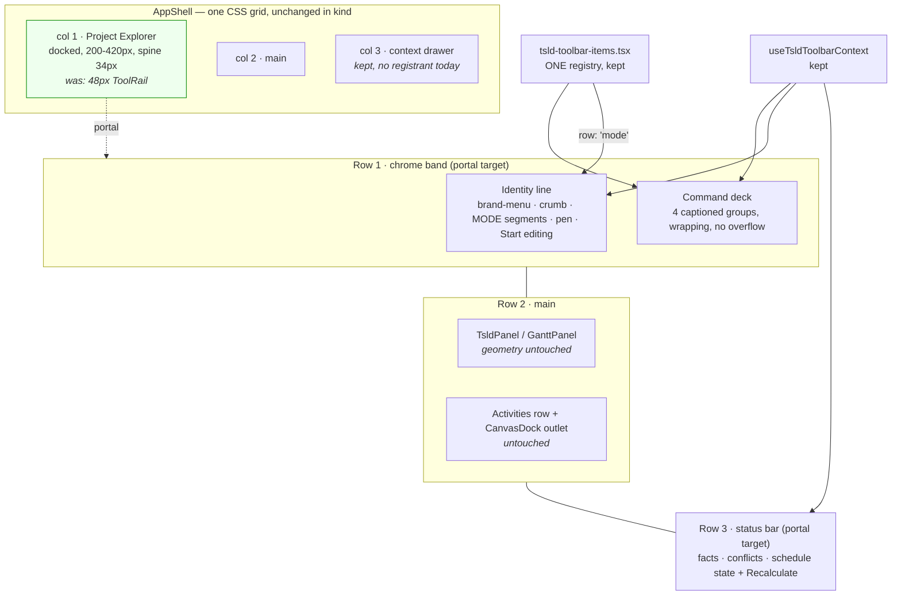
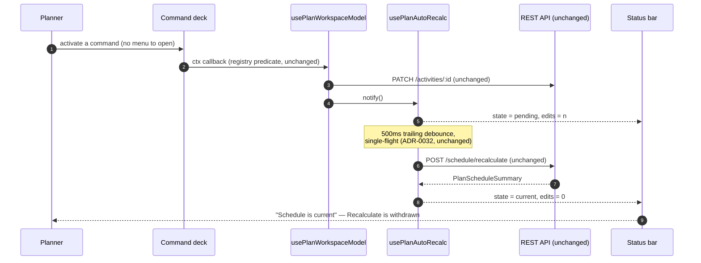
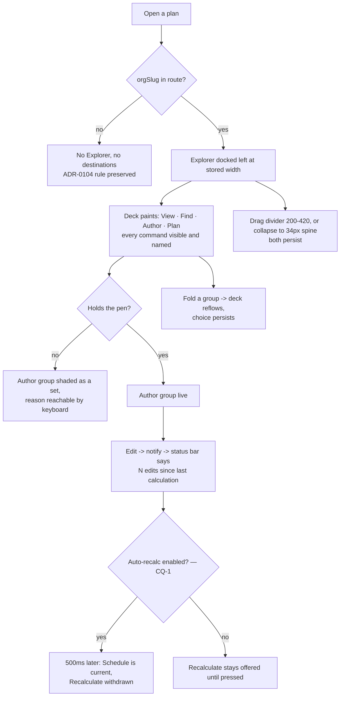

# Feature Spec: Plan workspace redesign — "Drafting Table"

- **Status:** Draft — awaiting approval
- **Author(s):** feature-analyst
- **Date:** 2026-08-24
- **Tracking issue / epic:** _(to be raised)_
- **Roadmap link:** _(new epic — added to `docs/ROADMAP.md` at M6)_
- **Related ADR(s):** **none, deliberately.** The product owner suspended the register for this
  epic (`BRIEF.md`, `README.md`). Existing ADRs are cited below **only as descriptions of code
  that exists**, never as constraints on the design. The replacement standards are written at M6
  from what shipped.

---

## 0. How to read this document, and what in it was measured

The brief's own measurement discipline applies to this spec. Every file path and line count below
was read out of the tree on 2026-08-24, not estimated. Two things to know about the numbers:

- **Line counts are non-blank lines**, produced by counting lines matching `.` per file. Where I
  have a file's true total (because I read it whole) I say so.
- **Where I am guessing, the sentence says so.** There are four such places and they are marked
  **[ESTIMATE]**. Everything else is a read.

Two claims in the brief were checked against the code and one of them is wrong in a way that
matters; see §1.4.

---

## 1. Business understanding

### Problem

Four consecutive restyles (ADR-0097 Landing, ADR-0099 Graphite, ADR-0101, ADR-0102) each improved
one property of the plan workspace and none of them changed the reader's verdict. The register
records why, four times in the same words: every one of those epics asked **"does the row fit?"**,
and an instrument that can only answer that question can only ever select a row.

The result on the product owner's 1646 px screen today:

- **33+ commands rationed by a width ladder into one strip with a `⋯` menu.** The ladder
  (`toolbar-ladder.ts`, 307 lines) decides labels, demotion and tier-3 admission from a budget;
  four epics tuned it and the last one (ADR-0091 M7) had to invent a "shrink-to-fit rows must never
  demote" rule after a row collapsed to 37 px holding nothing but the `⋯`.
- **Commands whose only route is a menu.** `comments`, `analysis`, `calendar`, `export` all carry
  `priority: -100` explicitly so that they demote first — i.e. four of the plan's own actions are
  designed to be reachable only through the overflow at ordinary widths.
- **A 48 px icon rail doing two unrelated jobs** — plan modes (a plan concern) beside organisation
  destinations and the account chip (an application concern).
- **No visible surfaces.** The chrome is navy; everything below it is white on white with no card
  edges, so the amber that identifies the product appears in one band and nowhere else.

The old Flask application solved the first of these by **wrapping** a toolbar of five labelled
group cards over fifteen buttons. It never needed an overflow menu because a wrapping row cannot
overflow. That is the observation the approved design is built on.

### Users

Every role that opens a plan. The surface is not role-gated; what changes per role is which
commands are shaded.

| Role                                               | What changes for them                                                                                                                                                                                                                                                                               |
| -------------------------------------------------- | --------------------------------------------------------------------------------------------------------------------------------------------------------------------------------------------------------------------------------------------------------------------------------------------------- |
| **Org Admin / Planner**                            | Holds the pen (ADR-0028). Sees the whole deck live; the authoring group is enabled; the staleness prompt in the status bar is theirs to act on.                                                                                                                                                     |
| **Contributor**                                    | May report progress but not author. The authoring group shades **as a set** with a reason — unchanged behaviour, more visible because the group is captioned and never in a menu.                                                                                                                   |
| **Viewer**                                         | Read-only. Same deck, authoring group shaded, Explorer and diagram fully usable.                                                                                                                                                                                                                    |
| **External Guest** (per-plan share link, ADR-0051) | **Out of scope and must not regress.** `/share` renders `GuestPlanView`, a sibling of `_authed` with its own chrome. It mounts `TsldPanel`, so it is downstream of the **diagram** changes in M4 and of the canvas token values in M1. It does not render the deck, the Explorer or the status bar. |

### Primary use cases

1. A planner opens a plan and can see, named, every command the product offers — without opening
   anything.
2. A planner reads the plan's state (activity count, data date, finish, criticality, conflicts,
   whether the schedule is current) from one line, and acts on staleness where it is reported.
3. A planner navigates the client → project → plan hierarchy from a permanent column they can
   resize or fold away, and returns the width to the diagram when they want it.
4. A planner reads the diagram: weekends are a quiet tint rather than a hatch, lanes are separated
   by hairlines rather than bands, criticality is separated by lightness as well as hue, and a link
   has a real arrowhead that is heavier when it drives.

### User journeys

Happy path, and the one this epic exists to fix:

1. Sign in → land on the organisation overview → pick a plan in the docked Project Explorer.
2. The workspace paints: identity line (brand ▸ crumb ▸ modes ▸ pen), command deck (four labelled
   groups, wrapping), Explorer | stage, status bar.
3. Press **Start editing** → the pen is taken → the Author group lights.
4. Draw an activity, link two, drag a bar. The status bar says whether the schedule is current.
5. Fold the **Plan** group; drag the Explorer divider to 200 px; the diagram grows. Both persist.

See §4 for the flow diagram.

### Expected outcomes

- Every registered command is **visible and named at 1646 px** with no menu.
- The width above the diagram is spent on things a planner reads, and the amount of it is
  **measured at 1646** before and after (§4.7).
- The product looks like one designed thing rather than a navy strip over an undesigned page.

### Success criteria

| #    | Criterion                                                            | How it is measured                                                                                                                                                     |
| ---- | -------------------------------------------------------------------- | ---------------------------------------------------------------------------------------------------------------------------------------------------------------------- |
| SC-1 | No overflow menu exists anywhere in the plan workspace               | `ToolbarOverflow.tsx` is deleted; the deck gate asserts zero `[data-toolbar-item="__overflow__"]` and zero `role="menu"` reachable from the deck at every target width |
| SC-2 | Every registered, visible command is a real clickable target at 1646 | Deck gate: `elementFromPoint` at each control's centre resolves to that control, box ≥ 24 × 24                                                                         |
| SC-3 | The deck's height at 1646 is ≤ the measured budget                   | M1-T1 measures it before the deck is built; the gate pins it (§4.7, and see CQ-3)                                                                                      |
| SC-4 | The Explorer's width and collapsed state survive a reload            | Journey asserts against `localStorage` round-trip                                                                                                                      |
| SC-5 | Staleness is legible                                                 | Journey: make an edit, assert the status bar names the state; recalculate, assert it says current                                                                      |
| SC-6 | The diagram's colours come from tokens, not literals                 | `token-contrast.test.ts` covers the new plot pairs; the colour-literal lint rule is unchanged                                                                          |
| SC-7 | `apps/api`, Prisma and the engine are untouched                      | `scripts/frontend-only.json` armed for the whole epic (M1-T2), disarmed at M6                                                                                          |

### Open questions

Four, in §6. Everything else has a stated default and proceeds.

### 1.4 Two brief claims checked against the code

Per the repository's own rule that a claim inherited from the brief is checked like any other:

- **"The current app registers ~46 commands"** (`README.md`). Measured: `buildTsldToolbarItems()`
  returns **34 top-level entries carrying an explicit `id`**, plus `...undoRedoToolbarItems()` (2)
  and `...promotedLensItems()` (derived from `LENS_TOGGLES`, which declares 5 records of which the
  promoted subset ships). Several entries are flag-conditional. 46 was the **pre-ADR-0090** figure;
  M2 consolidated 46 → 28 stops and Graphite M5 merged the two rows. **The live number is close to
  the mockup's 33 already**, which makes the deck's fit far less risky than the brief implies. The
  exact resolved count at runtime is what M1-T1 measures.
- **"Its organisation destinations (Clients, Calendars, Resources, People, Library, Recently
  deleted, Org settings) move into a menu behind the brand mark."** Measured against
  `apps/web/src/app/router.tsx`: there are **six** organisation destinations and there is **no
  `Library` route and no `Organisation settings` route**. See CQ-2.

---

## 2. Functional requirements

### User stories & acceptance criteria

> **US-1** — As a planner, I want every command visible and named, so that I never hunt in a menu
> for something the product can already do.
>
> **Acceptance criteria**
>
> - **Given** a plan open at 1646 px **when** the workspace paints **then** every registered,
>   visible command renders inline in one of four captioned groups, and no `⋯` control exists.
> - **Given** any target width from 768 to 2133 **then** no command is clipped, painted at zero
>   visible width, or positioned outside its container; the deck wraps to as many rows as it needs.
> - **Given** a command whose icon is universal (`zoom out`, `zoom in`, `fit`, `undo`, `redo`,
>   `print`) **then** it renders icon-only; every other command renders icon over label.
> - **Given** the pen is not held **then** the Author group's items are `aria-disabled` **as a set**
>   with a reason reachable by keyboard — unchanged from today.

> **US-2** — As a planner, I want to fold a group of commands I am not using, so that the deck stops
> costing me diagram height.
>
> - **Given** a group caption **when** activated **then** the group collapses to its caption, the
>   caption's `aria-expanded` reflects it, and the deck reflows.
> - **Given** a group is collapsed **when** the plan is reloaded **then** it is still collapsed.
> - **Given** a group is collapsed **then** its commands are **not** in the tab order and **not** in
>   the accessibility tree. This is a user-driven disclosure, not a width decision; it is the only
>   thing in this design that hides a command, and the reader did it.

> **US-3** — As a planner, I want the Project Explorer permanently on the left, resizable and
> foldable, so that I can move between plans without opening anything and can reclaim the width.
>
> - **Given** the workspace **then** the Explorer is a docked left column, default **276 px**.
> - **Given** the divider **when** dragged **then** the column resizes between **200** and **420 px**
>   and the stage takes the remainder; the width persists.
> - **Given** the collapse control **when** activated **then** the column becomes a **34 px** spine
>   carrying the word "Explorer"; activating the spine restores the previous width. The state
>   persists.
> - **Given** a route with no organisation (`/onboarding`, `/account`, `/me/activity`) **then**
>   neither the Explorer nor its spine renders — the ADR-0104 rule, preserved.
> - **Given** a viewport below `lg` **then** the Explorer is the existing modal `Sheet`, unchanged.

> **US-4** — As a planner, I want the plan's state on one line, and to be told when the schedule is
> not current, so that I never wonder whether the dates I am reading are real.
>
> - **Given** a plan **then** the status bar reads: Activities · Data date · Finish · Critical ·
>   (conflicts, when any) — and, at the trailing edge, the schedule's state.
> - **Given** the schedule is current **then** the trailing edge reads "Schedule is current" and
>   **no Recalculate control exists anywhere in the workspace**.
> - **Given** the schedule is not current **then** the trailing edge names why ("N edits since last
>   calculation" / "the last calculation failed" / "recalculation is paused") and offers
>   **Recalculate**, gated on `canRecalc` exactly as the toolbar item is today.
> - **Given** a recalculation is in flight **then** the bar says so, with the paired word + spinner
>   (unchanged, `PlanStatusBar` already does this).

> **US-5** — As a planner, I want the modes beside the pen, so the top line reads as one sentence:
> which plan, which view, which scheduling mode, who holds the pen.
>
> - **Given** the identity line **then** `Diagram | Gantt` and `Early | Visual` render as two
>   segmented controls under a **MODE** caption, beside the pen status and **Start editing**.
> - **Given** any width from 768 to 2133 **then** no mode is behind anything. A mode in a menu is
>   the ADR-0064 dead end and the regression that withdrew the ADR-0097 D1b header merge.
> - **Given** `VITE_SCHEDULING_MODES` is off **then** `Early | Visual` is absent (unchanged).

> **US-6** — As a planner, I want the organisation's destinations behind the brand mark, so the
> leading edge of the screen is not a rail of two unrelated jobs.
>
> - **Given** the brand mark **when** activated **then** a menu lists **Overview** and the
>   organisation destinations the reader's role permits.
> - **Given** no organisation in the route **then** the menu offers only what applies (see CQ-2).
> - **Given** the menu is open **then** Escape closes it and returns focus to the mark (the existing
>   `Menu` primitive; no new focus code).

> **US-7** — As a planner, I want the diagram to read as a drawing rather than a texture.
>
> - **Given** a non-working column **then** it is a **flat tint**; no diagonal hatch is drawn.
> - **Given** lanes **then** they are separated by a **hairline rule**, and no alternating month band
>   is painted under the scene by default.
> - **Given** a critical and a non-critical bar **then** they differ in **lightness as well as hue**
>   (in addition to the existing shape cue).
> - **Given** a dependency **then** it terminates in a filled arrowhead; a **driving** link is drawn
>   with a heavier stroke.
> - **The geometry does not change.** Hit-testing, lane packing, link routing, the a11y listbox and
>   the export/print composition are untouched.

> **US-8** — As a planner, I want the workspace to look like the mockup.
>
> - **Given** the workspace **then** the identity line, deck and status bar are navy cards with an
>   amber base rule on a gradient backdrop; the Explorer and the stage are light cards; the type is
>   IBM Plex Sans with IBM Plex Mono for figures.

### Workflows

**Deck reflow.** The deck is `flex-wrap`. It is not measured, has no budget, and takes no decision:
every visible item renders. Height is therefore an **output** of the item set and the width, which
is the property that ends four epics of measuring a row against its own leftover width.

**Group collapse.** Per-plan? No — per user, per group, in `localStorage`, four booleans. A planner
who folds `Plan` means it on the next plan too.

**Staleness.** See §3 "Dependencies" and CQ-1; the mechanism is client-side and adds no request.

### Edge cases

| Case                                  | Behaviour                                                                                                                                                          |
| ------------------------------------- | ------------------------------------------------------------------------------------------------------------------------------------------------------------------ |
| Deck with every group collapsed       | Four captions, one row. Legal; the reader did it.                                                                                                                  |
| Very narrow viewport (768)            | The deck wraps to more rows. It does **not** demote, fold or menu anything. If this costs unacceptable height, the remedy is collapsing a group — see CQ-3.        |
| Below `md` (single-pane toggle)       | Unchanged: the existing Diagram/Activities pane toggle, the Explorer as a `Sheet`, `hostsDock={false}`.                                                            |
| No organisation in the route          | No Explorer, no spine, no destinations in the brand menu (ADR-0104's rule, kept).                                                                                  |
| Plan has never been calculated        | Finish reads "Not calculated" (unchanged); the schedule state reads as not current with that as the reason, and Recalculate is offered to anyone who may run it.   |
| Recalculation fails                   | The status bar says the last calculation failed and keeps Recalculate offered. Today this is announced and then invisible.                                         |
| Guest share view                      | Renders `TsldPanel` only. Takes M1's canvas values and M4's diagram changes; renders no deck, Explorer or status bar. Its own suite (`e2e-share`) must stay green. |
| Reduced motion                        | The deck has no animation. The group-collapse chevron rotation is a transition, already covered by the global `prefers-reduced-motion` rule.                       |
| Explorer stored width outside 200–420 | Clamped on read — `use-resizable-panel-prefs.ts` already does this.                                                                                                |

### Permissions

Nothing in this epic changes who may do what. Stated explicitly because a redesign is exactly where
a capability goes missing by relocation (ADR-0090 M2-T7's finding):

| Capability                                                    | Gate today                                                              | Gate after                                                                                      |
| ------------------------------------------------------------- | ----------------------------------------------------------------------- | ----------------------------------------------------------------------------------------------- |
| Authoring commands (Add, Link, Arrange, Undo, Redo, Add note) | `penGated` + `authoringEnabled = canEditSchedule && !lateOverlayActive` | **Identical.** The deck passes the same `authoringEnabled` to the same `resolveItems`.          |
| Recalculate                                                   | `ctx.canRecalc && !ctx.recalcPending`, reason from `scheduleRefusal`    | **Identical**, evaluated in the status bar instead of the deck.                                 |
| Share                                                         | `plan:share` via `ctx.canShare` inside the Export menu                  | Unchanged.                                                                                      |
| Object actions (11)                                           | The selection-actions registry + `buildSelectionBarContext`             | **Untouched.** `selection-duplication.structural.test.ts` keeps the deck from re-acquiring one. |
| Organisation destinations                                     | `useDestinations` reads `useOrgRole`; audit log needs `canReadAuditLog` | Unchanged — the **same array**, rendered in a menu instead of a rail.                           |
| Notes                                                         | Not pen-gated (ADR-0046)                                                | Unchanged.                                                                                      |

### Validation rules

None. No form, no field, no write this epic introduces. The only persisted values are client
preferences (`localStorage`): Explorer width (int, clamped 200–420), Explorer collapsed (bool),
four group-collapsed booleans. All are read defensively and reset to defaults on corrupt storage —
the existing `use-resizable-panel-prefs.ts` contract.

### Error scenarios

No new API calls, so no new status codes. The error surfaces this touches:

| Scenario                       | Detection                                  | User-facing result                                                                      | Status    |
| ------------------------------ | ------------------------------------------ | --------------------------------------------------------------------------------------- | --------- |
| Recalculation rejected         | existing `useRecalculateCommand` `onError` | The status bar keeps the prompt and names the failure; the existing announcer speaks it | unchanged |
| Pen held by a peer             | existing `assertHoldsPen` → 423            | Author group shaded as a set with the existing reason                                   | 423       |
| Optimistic conflict on an edit | existing                                   | unchanged                                                                               | 409       |
| Export/print failure           | existing `ctx.exportError` banner          | unchanged; the banner keeps its place above the body                                    | n/a       |

---

## 3. Technical analysis

| Area           | Impact     | Notes                                                                                                                                                                                                                                                                                                                                                        |
| -------------- | ---------- | ------------------------------------------------------------------------------------------------------------------------------------------------------------------------------------------------------------------------------------------------------------------------------------------------------------------------------------------------------------ |
| Frontend       | **high**   | The whole plan-workspace chrome, the toolbar primitive, the shell's leading column, the token layer and four painter layers. Blast radius in §3.1.                                                                                                                                                                                                           |
| Backend        | **none**   | Hard constraint. Enforced by `scripts/frontend-only.json`, armed at M1-T2.                                                                                                                                                                                                                                                                                   |
| Database       | **none**   | No migration.                                                                                                                                                                                                                                                                                                                                                |
| API            | **none**   | No endpoint, DTO or contract change. If a task appears to need one it is a **blocking question**, not a task (brief).                                                                                                                                                                                                                                        |
| Security       | **none**   | No new principal, route, or trust boundary. One thing to get right: the fonts are **self-hosted**, because the deployed CSP is `font-src 'self'; style-src 'self'` (`docker-compose.yml:148`) and a Google Fonts `<link>` fails **closed and silently** on the deployed origin only. `e2e-csp` is the gate.                                                  |
| Performance    | **medium** | The painter's per-frame cost **falls** (the hatch tile and the month-band pass go). The deck removes a `ResizeObserver`-driven layout pass, a `getComputedStyle` call and a canvas `measureText` cache per row. Bundle: −(ladder + overflow + band) +(deck) + **two self-hosted woff2 files**, which is the only additive cost and must be measured (M1-T7). |
| Infrastructure | **none**   | No CI service change. CI **step** changes: one gate deleted, one added (§3.3).                                                                                                                                                                                                                                                                               |
| Observability  | **none**   |                                                                                                                                                                                                                                                                                                                                                              |
| Testing        | **high**   | 45 Playwright spec files reference a locator this epic moves; one gate (803 lines) is deleted; one snapshot (776 lines) is re-baselined. §3.2, §3.3.                                                                                                                                                                                                         |

### 3.1 Blast radius — measured

All counts are **non-blank lines** unless a total is given.

**The workspace host**

| File                                                                       |    Lines | What happens                                                                                                                                           |
| -------------------------------------------------------------------------- | -------: | ------------------------------------------------------------------------------------------------------------------------------------------------------ |
| `apps/web/src/components/layout/workspace/plan-workspace.tsx`              |       35 | Unchanged (a `CanvasSurfaceProvider` wrapper). **Note: the file named "plan workspace" is not the workspace.**                                         |
| `apps/web/src/components/layout/workspace/plan-workspace-toolbar.tsx`      | **1492** | The real host. Heavy edit: identity line, deck mount, Explorer column, status bar props, and the removal of `ToolbarBandProvider` / the `rail` portal. |
| `apps/web/src/components/layout/workspace/use-plan-workspace-model.ts`     | **2092** | One addition (the staleness counter, §4.5). Otherwise untouched.                                                                                       |
| `apps/web/src/components/layout/status/plan-status-bar.tsx`                |       99 | Extended: conflicts read-out + the staleness region + Recalculate.                                                                                     |
| `apps/web/src/components/layout/workspace/canvas-dock.tsx`                 |      114 | **Untouched** (kept by the brief).                                                                                                                     |
| `apps/web/src/components/layout/workspace/activity-bottom-panel.tsx`       |      183 | Untouched; still hosts the dock outlet.                                                                                                                |
| `apps/web/src/components/layout/workspace/plan-workspace-toolbar.test.tsx` |      450 | Rewritten.                                                                                                                                             |

**The toolbar primitive** (`apps/web/src/components/ui/toolbar/`, 17 files, 4575 lines)

| File                                   |     Lines | What happens                                                                                                                                                                                                                                                                                                  |
| -------------------------------------- | --------: | ------------------------------------------------------------------------------------------------------------------------------------------------------------------------------------------------------------------------------------------------------------------------------------------------------------- |
| `Toolbar.tsx`                          |       747 | **Gains `layout="deck"`, loses the ladder.** Removing `computeLadder`, `deriveChromeWidth`, `measureLabelWidth`, `isWidthConstrained`, `CHROME_RESIDUAL_PX`, `OVERFLOW_WRAPPER_PX`, `menuOpenRef`, the width cache and both `ResizeObserver`s is **[ESTIMATE]** roughly 350 of those 747 lines.               |
| `toolbar-ladder.ts`                    |       307 | **DELETE**                                                                                                                                                                                                                                                                                                    |
| `toolbar-ladder.test.ts`               |       382 | **DELETE**                                                                                                                                                                                                                                                                                                    |
| `ToolbarOverflow.tsx`                  |       199 | **DELETE**                                                                                                                                                                                                                                                                                                    |
| `ToolbarOverflow.test.tsx`             |       371 | **DELETE**                                                                                                                                                                                                                                                                                                    |
| `toolbar-band.tsx`                     |        80 | **DELETE** (a wrapping deck has no band width to publish)                                                                                                                                                                                                                                                     |
| `toolbar-registry.ts`                  |       546 | Loses `ToolbarLayoutMode`, `TOOLBAR_LAYOUT_BANDS`, `resolveLayoutMode`, `bandIsAtLeast`, `TOOLBAR_LAYOUT_HYSTERESIS_PX`, `partitionByTier`, `priorityOf`, `ToolbarTier`, `demotionGroup`, the `{ atLeast }` label form. Keeps `TOOLBAR_GROUPS`, `defineToolbar`, `splitByRow`, `resolveItems`, `ToolbarItem`. |
| `toolbar-registry.test.ts`             |       319 | Pruned to the surviving contract.                                                                                                                                                                                                                                                                             |
| `Toolbar.test.tsx`                     |       622 | Pruned; grouping/roving/gating assertions survive, overflow/demotion/label-fit assertions go.                                                                                                                                                                                                                 |
| `ToolbarButton.tsx`                    |       144 | Gains a stacked variant. `aria-disabled`, the `aria-describedby` reason wiring and the `srDescription` node are untouched.                                                                                                                                                                                    |
| `toolbar-styles.ts`                    |        97 | The CVA gains the stacked geometry (46 px min-width, icon over 9.5 px label).                                                                                                                                                                                                                                 |
| `ToolbarSplitButton.tsx` / `.test.tsx` | 208 / 176 | Kept (Add and Link are split buttons). Restyled to stacked.                                                                                                                                                                                                                                                   |
| `ToolbarPopover.tsx` / `.test.tsx`     | 129 / 108 | Kept (`View ▾`, `Summary`, `Analysis`, `Filter`, `Share & export`).                                                                                                                                                                                                                                           |
| `use-popover-panel.tsx`                |       125 | Kept.                                                                                                                                                                                                                                                                                                         |
| `index.ts`                             |        15 | Exports pruned.                                                                                                                                                                                                                                                                                               |

**The registry** — `apps/web/src/features/tsld/toolbar/tsld-toolbar-items.tsx` is **2899 total
lines (2836 non-blank)** and is **kept, not rewritten**. What changes in it: `tier`, `priority`,
`demotionGroup` and `showLabel: { atLeast }` become dead fields and are removed; `showLabel:
'never'` is set on the six universal icons; a `deckGroup` derivation (7 taxonomy groups → the
mockup's 4 captions) is added once. The enumerated command ids, read out of the file:

```
zoom-out  zoom-in  fit  view  today                        → View
mode-early  mode-visual  view-tsld  view-gantt             → (identity line, not the deck)
search  filter  next-conflict  next-conflict-status  float-paths  → Find
add-activity  link-tool  marquee-select  auto-arrange  add-note  undo  redo  → Author
recalculate                                                → (status bar, not the deck)
summary  analysis  calendar  comments  export              → Plan
legend  minimap  resource-view  baseline-overlay  over-allocation  → View (promoted lens toggles)
```

The `tsld/toolbar` directory is **65 files, 11 784 lines**, of which the great majority are tests
that assert a command's presence and gating — those keep passing, because the registry and its
predicates do not change.

**The shell and rail** (`apps/web/src/components/layout/`, 80 files, 15 338 lines)

| File                                                        |    Lines | What happens                                                                                                                                                                                                                                                      |
| ----------------------------------------------------------- | -------: | ----------------------------------------------------------------------------------------------------------------------------------------------------------------------------------------------------------------------------------------------------------------- |
| `navigator/app-shell.tsx`                                   |      576 | Column 1 changes from the icon rail to the docked Explorer; `subject`/`DrawerSubject` collapses to one thing; the trailing `drawer` column is retained for the `drawer` chrome slot but has no production registrant today (`docs/TECH_DEBT.md` #156) — see §4.4. |
| `navigator/tool-rail.tsx`                                   |      177 | **DELETE**                                                                                                                                                                                                                                                        |
| `navigator/tool-rail.test.tsx`                              |      132 | **DELETE**                                                                                                                                                                                                                                                        |
| `navigator/navigator-rail.tsx`                              |      144 | Kept — it is the tree, and it becomes the docked Explorer's body unchanged.                                                                                                                                                                                       |
| `navigator/org-destinations.tsx`                            |      150 | Kept, second renderer added: the brand-mark menu. Its own docblock already says the destinations are "one array rendered two ways".                                                                                                                               |
| `drawer/context-drawer.tsx` + `use-context-drawer-prefs.ts` | 121 + 31 | Re-pointed to the leading edge; min 224 → **200**, default 300 → **276**.                                                                                                                                                                                         |
| `chrome/chrome-slot.tsx`                                    |      127 | `ChromeSlotName` loses `'rail'`.                                                                                                                                                                                                                                  |
| `chrome/chrome-band.tsx`                                    |       96 | Kept as the deck's host row.                                                                                                                                                                                                                                      |
| `app-header.tsx`                                            |      106 | Below-`lg` bar; keeps the hamburger, loses nothing.                                                                                                                                                                                                               |
| `brand-mark.tsx`                                            |      112 | Gains the menu trigger variant.                                                                                                                                                                                                                                   |
| `account-chip.tsx`                                          |      180 | Moves from the rail to the identity line.                                                                                                                                                                                                                         |

**The token layer** — `apps/web/src/styles/globals.css` is **1348 lines**, with 7 blocks:
`:root` (line 132) and six `[data-surface]` scopes: `chrome` (914), `panel` (954), `brand` (994),
`auth` (1034), `print` (1107), `canvas` (1141), plus `@theme inline` (1189) and `@layer base`
(1302). Each scope rebinds the **same 31 names**. See §4.2.

**The painter** — `apps/web/src/features/tsld/render/` is **83 files, 18 812 lines**.

| File                                                                                                                                                           |     Lines | What happens                                                                                                                                                                                                      |
| -------------------------------------------------------------------------------------------------------------------------------------------------------------- | --------: | ----------------------------------------------------------------------------------------------------------------------------------------------------------------------------------------------------------------- |
| `palette.ts`                                                                                                                                                   |       405 | Values only. `resolveTsldPalette` makes ~30 token reads; `PRINT_TOKEN_SOURCES` mirrors them for paper. **No signature change.**                                                                                   |
| `paint.ts`                                                                                                                                                     |      2094 | Three layers change: the non-working hatch tile (`buildHatchTile`, ~line 396–430) is removed; the alternating month-band pass (layer −0.5, ~line 804) is removed or defaulted off; a lane-hairline pass is added. |
| `view-toggles.ts`                                                                                                                                              |        86 | `monthBands` default `true` → `false`, or the key retires (CQ deferred: it is a `View ▸ Structure` switch and costs nothing to keep).                                                                             |
| `link-routing.ts`                                                                                                                                              |       609 | Arrowhead geometry already exists (ADR-0065 §M2); the change is stroke weight for driving links and the head's fill token.                                                                                        |
| `paint.golden.test.ts` + `__snapshots__/*.snap`                                                                                                                | 297 + 776 | **Re-baselined, audited line by line** — never `-u`.                                                                                                                                                              |
| `paint.*-budget.test.ts` (9 files)                                                                                                                             |     ~1600 | Re-baselined **downward** where a layer is deleted.                                                                                                                                                               |
| `print-palette.structural.test.ts`                                                                                                                             |       280 | Kept; it is the gate that catches a canvas re-value leaking into the printed deliverable.                                                                                                                         |
| Everything else — `geometry.ts` (614), `hit-test.ts` (248), `a11y.ts` (275), `minimap.ts` (276), `time-scale.ts` (335), `wbs-band.ts` (167), `lenses.ts` (480) |           | **Untouched.**                                                                                                                                                                                                    |

### 3.2 Which Playwright journeys break, and why

**44 test directories across 46 configs.** Measured by locator:

| Locator class                                                                    | Spec files | Occurrences | Why it breaks                                                                                                                                                                                                       |
| -------------------------------------------------------------------------------- | ---------: | ----------: | ------------------------------------------------------------------------------------------------------------------------------------------------------------------------------------------------------------------- |
| Overflow (`__overflow__`, "More", `overflow`)                                    |     **20** |          83 | The `⋯` is deleted. Most of these are _reach through the menu to click X_; the fix is to click X directly, which shortens them.                                                                                     |
| `Plan commands` / `Plan mode` toolbar names                                      |     **17** |          33 | Survives **if** the deck keeps `role="toolbar"` and the two accessible names — which is the design (§4.3). Otherwise all 17 break.                                                                                  |
| `Recalculate`                                                                    |     **13** |          25 | Moves to the status bar **and becomes conditional**. Every one of these needs re-pointing, and some need the plan put into a stale state first. This is the largest single rewrite in the epic and is tied to CQ-1. |
| Any of the above plus `Project Explorer` / `Start editing` / `data-toolbar-item` |     **45** |         174 | The union: 45 of the repository's spec files touch something this epic moves.                                                                                                                                       |

Named, with the verdict:

- **`e2e-toolbar-fit/fit.spec.ts` (803 lines) — DELETE with its config, script and CI step.** 28 of
  its lines reference the `⋯`; assertions S2, S3, S4, S9, S10, S11 are all _about the ladder_. Three
  survive and are re-homed into the new deck gate: **S1** (nothing painted at zero visible width),
  **S5/S7** (every control a ≥ 24 px clickable target, via `elementFromPoint`), **S6** (the layout
  settles rather than oscillating — cheap to keep and the deck should trivially pass it).
- **`measure-toolbar/` (12 files, 2185 lines) — 8 deleted, 3 kept, 1 retargeted.** Delete
  `measure.spec.ts`, `graphite-strip.spec.ts`, `menu-band.spec.ts`, `item-widths.spec.ts`,
  `attribution.spec.ts`, `reachability.spec.ts`, `header-fit.spec.ts`, `loaded-plan.spec.ts` — every
  one measures a mechanism that is going. Keep `search-icon.spec.ts`, `combobox-coarse.spec.ts`,
  `output.ts`. **Retarget `vertical-stack.spec.ts` (339 lines)**: it measures the bands above the
  canvas, which is still exactly the right question and is how M1-T1 and M3's acceptance are
  measured. Note its recorded defect — a band it could not locate was `.filter()`ed out rather than
  throwing, and it under-reported for the whole of ADR-0090 M5. It now throws; keep that.
- **`e2e-designed-chrome/designed-chrome.spec.ts` — rewrite.** It asserts the band contains a
  `<header>` and the `Plan commands` toolbar and that the tab order is brand → nav → account →
  toolbar → rail → workspace. Every term in that order changes.
- **`e2e-shell/org-less-screens.spec.ts` — rewrite.** It is ADR-0104's gate: the rail withholds
  organisation controls on the three org-less routes. The rule survives; the subject (the rail) does
  not.
- **`e2e-designed-ui/designed-ui.spec.ts` — keep, expect it to fire.** It is the axe sweep. See §5.
- **`e2e-workspace-chrome/` (5 specs) — rewrite.** It is the dock/placement/conflict-review suite and
  is the closest thing the repository has to a workspace journey. It is the right host for the
  epic's own journey rather than a 46th config.
- **`e2e-gantt`, `e2e-multi-select`, `e2e-authoring-flow`, `e2e-programme`, `e2e-float-paths`,
  `e2e-search-nav`, `e2e-undo`, `e2e-edit`, `e2e-wbs`, `e2e-loe`, `e2e-copy-paste`,
  `e2e-resource-view`, `e2e-share`, `e2e-activity-editor`, `e2e-gantt-editing`, `e2e/` (base) —
  re-point locators.** These are not conceptual breaks; they click a control that has moved. The
  standing rule from ADR-0091's retrospective applies: **locate a toolbar control by
  `[data-toolbar-item]`, never by its copy** — and the deck keeps that attribute, so most of this
  work is deleting menu-opening steps.
- **`e2e-csp` — keep and treat as load-bearing.** It parses the real policy out of `docker-compose.yml`
  and serves it over the production build. If the typeface arrives by `<link>` rather than as a
  self-hosted woff2, this is the only thing in the repository that will notice.

### 3.3 CI steps

- **Removed:** `test:e2e:toolbar-fit` (+ its config + its `apps/web/package.json` script).
- **Added:** one journey step for the epic. **Default: extend `e2e-workspace-chrome` rather than
  add a 46th config** — it already boots a plan with the pen enforced, it is the suite whose subject
  is this surface, and the repository has 46 Playwright configs, which is itself a cost.
- **Unchanged:** every other step, `pnpm prepush`'s ten checks, `check:counts` (whose numbers move,
  see M6).

### Dependencies

- **Nothing must land first.** Every prerequisite is in the tree.
- **IBM Plex Sans + IBM Plex Mono** must be vendored as woff2 into `apps/web/src/assets/fonts/`
  (SIL OFL 1.1 — compatible; the repository already self-hosts Space Grotesk the same way).
- **`scripts/frontend-only.json`** must be armed before the first code task, not after.

---

## 4. Solution design

### 4.1 Architecture overview



Deleted outright: `ToolRail`, `ToolbarOverflow`, `toolbar-ladder`, `toolbar-band`, the `'rail'`
chrome slot, the `DrawerSubject` union's second member.

### 4.2 The token strategy — a **mapping**, and why the surface scopes stay

The brief asks for a decision, not deference. Here it is, with the evidence.

**The mockup's block cannot replace the vocabulary, because the mockup does not have a flat
palette.** `.ws` declares 8 colours, 3 radii and 2 font stacks — and then the stylesheet writes
`rgba(255,255,255,.14)`, `rgba(255,255,255,.055)`, `#A8B6D2`, `#8695B4`, `#C6D0E4`, `#E4EAF5`,
`#7E8CA6`, `#F1EFE8`, `#8FB99B` and about thirty more literals inline. Those _are_ a vocabulary —
"secondary ink on navy", "hairline on navy", "quiet fill on navy", "muted ink on paper" — spelled
as constants at each site. The live app already has names for every one of them. So the work is
**transcription into the existing names**, not replacement of the naming scheme.

**A flat block would break the painter and blind the gate.** `resolveTsldPalette` makes ~30
`getComputedStyle` reads by token name against the canvas scope element, and `PRINT_TOKEN_SOURCES`
mirrors every one for paper. A flat `--c-*` block would mean hand-writing ~30 literals into the
painter — which is precisely the state ADR-0102 was written to fix, and which
`token-contrast.test.ts` **structurally cannot see**, because it computes ratios between _tokens_.

**Do the surface scopes earn their keep for this design?** Evaluated on the mockup, not on
ADR-0055:

| Scope           | Verdict                                                         | Reason                                                                                                                                                                                                                                                                                                                                                                      |
| --------------- | --------------------------------------------------------------- | --------------------------------------------------------------------------------------------------------------------------------------------------------------------------------------------------------------------------------------------------------------------------------------------------------------------------------------------------------------------------- |
| `chrome`        | **Earns it, strongly.**                                         | This design has _more_ navy chrome than today's, not less: the identity line, the deck and the status bar are three separate navy cards. Every one of them contains secondary text, hairlines, quiet fills and a focus ring that must be validated against navy — which is the exact defect ADR-0055 was written about, and it recurs here at three times the surface area. |
| `canvas`        | **Earns it.**                                                   | The stage is `#FAF9F5` paper. Its inks and its criticality ladder are validated **against that ground and against each other**, which the page family structurally cannot do. It also carries the painter's 30 reads.                                                                                                                                                       |
| `print`         | **Earns it.**                                                   | Paper is light by declaration; the diagram fields follow the canvas so the deliverable cannot drift from the screen. Untouched by this epic beyond re-valuation.                                                                                                                                                                                                            |
| `panel`         | **Does not earn it any more — retire it into the page family.** | The mockup's Explorer is a white card with dark ink on a light page, i.e. the page family plus a fill. That is a **reset**, which `RESET_TONES` (`card`, `popover`) already is. Retiring `panel` removes 31 declarations and one whole column of the contrast matrix.                                                                                                       |
| `brand`, `auth` | **Keep untouched.**                                             | The public screens are out of scope. Do not re-value them for the sake of tidiness — the register records exactly that going wrong (ADR-0097 tried to retire `auth` and the measurement reversed it).                                                                                                                                                                       |

Net: **7 scopes → 6.**

**The concrete map.** M1's deliverable is this table, completed and applied:

| Mockup                                                 | Where it lands                                                                                           | Note                                                                                                                                                                                                                                                                                                        |
| ------------------------------------------------------ | -------------------------------------------------------------------------------------------------------- | ----------------------------------------------------------------------------------------------------------------------------------------------------------------------------------------------------------------------------------------------------------------------------------------------------------- |
| `--c-navy #14213D`                                     | `--chrome` (already navy)                                                                                | Re-value to the exact hex, converted to OKLCH like its neighbours                                                                                                                                                                                                                                           |
| `--c-amber #FCA311`                                    | `--chrome-primary` (already amber)                                                                       | The base rule under each navy card is `--chrome-primary`, not a literal                                                                                                                                                                                                                                     |
| `--c-amber-hi #FFC55A`                                 | `--chrome-primary-hover`                                                                                 |                                                                                                                                                                                                                                                                                                             |
| `--c-paper #FAF9F5`                                    | `--plot-background`                                                                                      | The stage's ground                                                                                                                                                                                                                                                                                          |
| `--c-crit #9E1B26` / `--c-crit-edge #6E0F17`           | `--plot-destructive` / a new `--plot-destructive-edge`                                                   |                                                                                                                                                                                                                                                                                                             |
| `--c-norm #4B7FC4` / `--c-norm-edge #31598F`           | `--plot-primary` / a new `--plot-primary-edge`                                                           |                                                                                                                                                                                                                                                                                                             |
| `rgba(255,255,255,.055 / .08 / .11 / .14 / .17 / .18)` | `--chrome-secondary`, `--chrome-accent`, `--chrome-border`, `--chrome-input`, `--chrome-secondary-hover` | **Must be tokens, not `bg-white/8`.** `alpha-composite.test.ts` is a census that bans alpha modifiers precisely because they composite against whatever is behind them and are invisible to the contrast matrix. This is a constraint on the implementation, stated now rather than discovered at the gate. |
| `#E4EAF5` / `#A8B6D2` / `#8695B4` / `#C6D0E4`          | `--chrome-foreground` / `--chrome-muted-foreground` (and one new dimmer ink for captions)                |                                                                                                                                                                                                                                                                                                             |
| `#F1EFE8` (ruler, explorer header, minimap ground)     | `--plot-muted`                                                                                           |                                                                                                                                                                                                                                                                                                             |
| `#7E8CA6` (link stroke)                                | `--plot-muted-foreground`                                                                                |                                                                                                                                                                                                                                                                                                             |
| `#C1121F` (today)                                      | `--plot-destructive-text` or a dedicated marker token                                                    | Today's marker already reads `--destructive` inside the canvas scope                                                                                                                                                                                                                                        |
| `#8FB99B` (schedule-is-current)                        | `--chrome-success-text`                                                                                  |                                                                                                                                                                                                                                                                                                             |
| `--r-md 10px / --r-sm 7px / --r-xs 5px`                | `--radius` and its two derived steps                                                                     | `--radius` is declared once at `:root` today, which the register already calls out                                                                                                                                                                                                                          |
| `linear-gradient(135deg,#F2F5F9,#D3DCE9)`              | **new: `--page-backdrop`**                                                                               | The one genuinely new _kind_ of value in this epic — a gradient is a background **image**, not a colour, and no existing token can hold one. Declared once, applied to the workspace region.                                                                                                                |
| `'IBM Plex Sans'` / `'IBM Plex Mono'`                  | `--font-sans` / **new `--font-mono`**                                                                    | Self-hosted woff2. Replaces Space Grotesk.                                                                                                                                                                                                                                                                  |

**Typography is a real, checkable cost, not a swap.** `token-architecture.test.ts` asserts (a) an
`@font-face` exists, (b) `--font-sans` contains `'Space Grotesk'`, (c) every `@font-face` `src` is
same-origin, and (d) `font-variant-numeric: tabular-nums` is set on table cells — with a docblock
recording that Space Grotesk's `1` is 404 units against its `0`'s 638 and that the rule is
therefore load-bearing **for that face**. Assertion (b) is rewritten to name IBM Plex Sans;
assertion (d) is **re-derived for Plex, by measuring the face**, not assumed to still apply. The
mockup uses IBM Plex Mono with `font-variant-numeric: tabular-nums` for exactly the columns that
matter, which is a good sign but is not a measurement.

**The ratchets will fire, and the right answer is mostly not to raise them.** `token-architecture.test.ts`
holds `SCREEN_WEIGHT_CEILING = 164` and `ARBITRARY_SIZING_CEILING = 18`. The mockup introduces
9.5 px labels, an 8.5 px mode caption, a 9 px group caption, a 34 px spine, a 46 px minimum button
and a 40 px ruler. Most of those are **scale steps this product does not yet have** — so the
answer is to add `--type-nano` (9.5 px) and the two sizing steps to the theme block and let the
ratchets stay where they are. Where a value genuinely is a one-off, raise the ceiling **once, at
the measured floor, at M5**, which is what that file's own docblock instructs.

### 4.3 The deck

**One primitive, a `layout` prop — not a second component.** `Toolbar` keeps `role="toolbar"`,
the roving `tabindex`, the group partition, `resolveItems`, the pen-gating set flip, the
`data-toolbar-item` attribute and both accessible names (`Plan commands`, `Plan mode`). It gains
`layout: 'bar' | 'deck'`. This is deliberate and the reason is in the register three times: two
renderers of one registry drift, and the drift is invisible because each looks right alone
(ADR-0062's extraction, ADR-0065's `routeOrthogonal`). It also matters concretely here — the
**third** `<Toolbar>` in the app is the canvas dock's floating selection bar
(`features/plan-actions/selection-actions.tsx`, 840 lines), which the brief keeps unchanged. It
uses `layout="bar"` and is unaffected.

**Four captions from seven groups, derived once.** `TOOLBAR_GROUPS` stays
`frame · lens · find · tools · object · output · help`. A single `DECK_GROUPS` map collapses them:

```
View   ← frame + lens
Find   ← find
Author ← tools
Plan   ← object + output
       ← help is empty (shortcuts left the registry at ADR-0091 M7-S5)
```

Declared once, so a new command lands in a caption by its taxonomy group rather than by a decision
somebody has to remember.

**What the deck does not do.** No measurement, no `ResizeObserver` on the row, no
`getComputedStyle`, no `measureText`, no band, no hysteresis, no demotion, no admission, no
priority. Height is an output. That is the whole design.

**Keyboard.** One roving order across all four groups in canonical order, exactly as today —
Arrow/Home/End, `input`/`textarea`/`select` exempted (the "Go to date" field depends on it). A
collapsed group's items leave the order because they leave the DOM. Group captions are ordinary
buttons in the document order **before** their group's items, so Tab reaches a caption and Arrow
walks the commands: this is the one place the APG toolbar pattern and a disclosure meet, and the
choice is stated rather than left to fall out.

**Stacked buttons.** `ToolbarButton` gains an `orientation`; the CVA gains `min-w-[46px]`, icon
over label, 9.5 px label, `line-height: 1`. `showLabel: 'never'` on `zoom-out`, `zoom-in`, `fit`,
`undo`, `redo`, `print`. Everything else is labelled at every width — there is no label ladder.

### 4.4 The frame

- **Column 1 becomes the Explorer.** `ToolRail` is deleted. `NavigatorRail` (the tree, 144 lines)
  is the body, unchanged. `ContextDrawer`'s splitter and `useContextDrawerPrefs` are re-pointed to
  the leading edge, min **200**, max 420, default **276**. Collapsed renders the 34 px spine.
- **Column 3 (the trailing context drawer) is kept and left empty.** It has had **no production
  registrant** since ADR-0101 (`docs/TECH_DEBT.md` #156). Deleting it is tempting and is not this
  epic's decision; leaving it costs zero width (an `auto` grid column with no child).
- **The brand mark takes the destinations.** `org-destinations.tsx`'s array is rendered a third way,
  inside the existing `Menu` primitive. No new focus code — `Menu` already owns open/close/Escape/
  restore.
- **The account chip moves to the identity line's trailing edge.**
- **Modes stay registry items** (`row: 'mode'`), rendered by a `layout="bar"` `Toolbar` labelled
  `Plan mode` in the identity line. This is what keeps 17 spec files' locators alive, and more
  importantly it keeps arm/disarm, Escape precedence, announcement and pen gating in the registry
  rather than hand-rolled — the reason ADR-0091 gave for not hand-rolling them into the rail, which
  is still the reason.
- **ADR-0104's rule is preserved by construction:** the Explorer column, the spine and the brand
  menu's organisation section all derive from one `orgSlug !== undefined`, computed once in the
  shell.

### 4.5 Staleness — client-side, no API change

There is no `computedAt` on `PlanScheduleSummary` (checked: `packages/types/src/index.ts:775`; the
only staleness field is `scheduleStale?`, which is **cross-plan only** and absent for an ordinary
plan). So the state is derived in the client, in the one place that already knows:

`usePlanAutoRecalc` (`features/schedule/api/use-plan-auto-recalc.ts`) is where every structural
edit arrives (`notify()`) and where every recalculation settles. It gains a counter: **+1 per
`notify()`, reset to 0 on a successful run, and a `lastRunFailed` flag.** The workspace derives
one discriminated union and hands it to the status bar:

```
{ kind: 'current' }
{ kind: 'pending',  edits: number }   // edits owed: debouncing, held, or queued
{ kind: 'paused',   reason: string }  // auto-recalc disabled: no pen, no data date, Late overlay
{ kind: 'failed',   message: string }
```

No new request, no new endpoint, no schema. The **product** question this exposes is CQ-1.

### 4.6 Data flow



### 4.7 User flow, and the measurement that gates it



**The gating measurement.** The mockup's own readout claims the deck is _"four groups on two rows
at 1646 px"_. That is the mockup's claim about the mockup's labels, and the real labels differ
(`Share & export`, `Settings…`, `Next conflict`, `Over-allocation`). **M1-T1 measures the real
thing before the deck is built**, at 1646, with the resolved item set, stacked, at the mockup's
geometry — and states a falsification condition up front: **if the deck exceeds 3 rows / 150 px at
1646 with no group collapsed, the design's group-collapse remedy is load-bearing rather than a
convenience, and CQ-3 must be answered before M2 starts.** Six consecutive epics in this register
had their width expectation contradicted by their own measurement; the seventh states its condition
first.

### Database changes

**None.**

### API changes

**None.** This is a hard constraint, gated rather than asserted: `scripts/frontend-only.json` is
armed with `guarded: ["apps/api/"]` at M1-T2 and disarmed at M6. The register records that gate
going stale and going _wrong about a different epic_, so removing it is an explicit M6 task rather
than a sentence.

### Component changes

**New**

| Component               | Location                                             | Notes                                                     |
| ----------------------- | ---------------------------------------------------- | --------------------------------------------------------- |
| `Toolbar layout="deck"` | `components/ui/toolbar/Toolbar.tsx`                  | Wrapping captioned groups; a prop, not a second component |
| `DeckGroup`             | `components/ui/toolbar/DeckGroup.tsx`                | Caption button + `aria-expanded` + wrapping row           |
| `DECK_GROUPS`           | `components/ui/toolbar/toolbar-registry.ts`          | 7 taxonomy groups → 4 captions, declared once             |
| `useDeckGroupPrefs`     | `components/ui/toolbar/use-deck-group-prefs.ts`      | Four persisted booleans                                   |
| `PlanIdentityLine`      | `components/layout/workspace/plan-identity-line.tsx` | Brand menu · crumb · MODE · pen · Start editing · account |
| `BrandMenu`             | `components/layout/brand-menu.tsx`                   | Renders `useDestinations` + Overview through `Menu`       |
| `ExplorerColumn`        | `components/layout/navigator/explorer-column.tsx`    | Docked column + divider + 34 px spine                     |
| `ScheduleStateRegion`   | `components/layout/status/schedule-state.tsx`        | The four-state union + Recalculate                        |

**Changed:** `plan-workspace-toolbar.tsx`, `plan-status-bar.tsx`, `app-shell.tsx`,
`chrome-slot.tsx`, `brand-mark.tsx`, `org-destinations.tsx`, `context-drawer.tsx`,
`use-context-drawer-prefs.ts`, `ToolbarButton.tsx`, `toolbar-styles.ts`, `toolbar-registry.ts`,
`tsld-toolbar-items.tsx`, `palette.ts`, `paint.ts`, `link-routing.ts`, `globals.css`.

**Deleted:** `tool-rail.tsx`, `tool-rail.test.tsx`, `ToolbarOverflow.tsx`,
`ToolbarOverflow.test.tsx`, `toolbar-ladder.ts`, `toolbar-ladder.test.ts`, `toolbar-band.tsx`,
`e2e-toolbar-fit/` + config + script, 8 of 12 `measure-toolbar/` specs.

**Loading / empty / error states.** All pre-existing and unchanged: the canvas skeleton while
activities load, the empty-plan notice in the dock, the export-failure banner, `pending: true` on
the status bar's facts. One new empty state — a deck with every group collapsed — which is legal
and needs no copy.

### Implementation approach & alternatives

**Chosen: replace the renderer, keep the registry, sequence by surface.**

The registry is the good part and the brief says so. Everything this epic deletes is a _layout
mechanism_ that exists to fit a fixed-height row — and the design removes the fixed-height row, so
the mechanism has nothing left to do. That is why the deletion is large and low-risk: 1000+ lines
go and not one command's identity, gating, ordering or callback changes.

Milestones are sequenced by **screen region**, not by mechanism, and the reason is a constraint the
brief creates: **with no `VITE_` flag and a host that auto-pulls every release (ADR-0047), each
milestone is visible to the product owner the day it merges.** A mechanism-first sequence (tokens →
primitive → host → journeys) would ship two or three releases of a half-redesigned workspace. A
region-first sequence ships a coherent screen every time.

**Alternatives considered**

1. **A flat `--c-*` block replacing the vocabulary.** Rejected: §4.2. It breaks the painter's 30
   token reads, blinds `token-contrast.test.ts`, and the mockup does not actually have a flat
   palette — it has the same vocabulary spelled as ~40 literals.
2. **A second `CommandDeck` component beside `Toolbar`.** Rejected: two renderers of one registry
   drift invisibly, and the third consumer (the selection bar) would be stranded on whichever one
   stopped being maintained. A `layout` prop is one file.
3. **Keeping the ladder "in case".** Rejected: a mechanism kept for a state nothing can reach is
   the ADR-0088 finding, and the ladder's cost is not the `if` — it is a second layout that every
   future change to the deck has to be correct against.
4. **A `VITE_` flag.** Forbidden by the brief, and the brief's reason is right and already
   established in the register: `apps/web/Dockerfile` declares one `VITE_` build arg,
   `docker-publish.yml` passes none, and `.dockerignore` strips `**/.env` — so a flag is a rollback
   contract that does not exist on a deployed container.
5. **Doing the diagram (M4) first, because it is the most visible.** Rejected: the diagram's colours
   are resolved from the canvas scope, so M1's values have to exist first or M4 would hand-write
   literals into the painter and then take them out again.

---

## 5. Accessibility: what the design costs, stated

The brief makes WCAG a soft constraint here. Three costs, named rather than discovered:

1. **The 9.5 px command label.** No success criterion sets a minimum font size, so this is not a
   violation — but it is below anything in the current type ramp and it is the label on every
   command in the product. Accepted; mitigated by the icon above it and by every control keeping its
   `aria-label`, `title` and reason wiring unchanged.
2. **Group collapse removes commands from the tab order.** Accepted: it is a user-initiated
   disclosure with `aria-expanded`, which is the standard pattern, and the state is visible.
3. **Contrast on the navy washes.** `rgba(255,255,255,.08)` under `#E4EAF5` under navy is a
   three-layer composite. This is the one place the design could be quietly wrong, and it is
   exactly what `token-contrast.test.ts` computes — which is why the washes must be **tokens**
   (§4.2) rather than alpha utilities. Not a cost; a constraint.

Keyboard operability is **not** relaxed anywhere: the product owner drives by keyboard, the roving
model is unchanged, and the epic's journey asserts the full deck traversal.

---

## 6. Critical questions

Four. Everything else has a default stated in this document and proceeds without an answer.

> **CQ-1 — Does auto-recalculation stay on?**
>
> The mockup's status bar is built around a stale state ("3 edits since last calculation"), and
> **the product barely has one.** `usePlanAutoRecalc` fires a recalculation 500 ms after every
> structural edit; so today the honest reading of the status bar would be "Schedule is current"
> essentially always, with the prompt flickering for half a second per edit, plus the genuine cases
> (no pen, no data date, Late overlay, a failed run).
>
> - **(A) Keep auto-recalc.** Nothing about scheduling behaviour changes. The prompt is real but
>   rare. The mockup's headline status-bar feature is mostly invisible.
> - **(B) Turn auto-recalc off.** The planner recalculates deliberately; the edit count means
>   something; the prompt does the work the mockup shows. This is a **behaviour change**, it will
>   need its own journey work, and it changes what ~13 spec files have to do to get computed dates.
>
> **Default if unanswered: (A).** It is the only one of the two that is a styling decision.
>
> **This changes the design**: under (A), US-4's prompt is a rarely-seen state and the deck should
> arguably keep nothing at all where Recalculate was; under (B), it is the status bar's primary job.

> **CQ-2 — The brand menu names two destinations that do not exist.**
>
> Measured against `router.tsx`: there are six organisation destinations (Clients, Calendars,
> Resources, People/members, Audit log, Recently deleted) plus the Overview route. The brief and the
> mockup both list **Library** and **Organisation settings**, and neither is a route.
>
> **Default: ship Overview + the six real destinations; omit Library and Organisation settings.**
> Creating either is a new route, i.e. new surface, and out of scope. If "Library" means the
> Calendars + Resources library screens, say so and I will group them under a **Library** heading
> with those two beneath it — that costs nothing and is honest.

> **CQ-3 — What is the answer at 768 px, given no overflow menu is permitted at any milestone?**
>
> A wrapping deck cannot overflow horizontally; it grows vertically. At 768 the deck will take
> several rows and the diagram pays for them. The brief forbids a menu, so the remedy is the
> group-collapse control.
>
> - **(A) Accept it.** The planner collapses `Plan` and `Find`; the choice persists. No automatic
>   behaviour at any width.
> - **(B) Auto-collapse the two least-used groups below a threshold**, remembered thereafter.
>
> **Default: (A).** (B) is a width ladder wearing a different hat, and it is the mechanism this epic
> exists to delete. But (A) means 768 is a genuinely worse experience than today, and the existing
> gate targets 768 — so this should be a decision rather than a discovery. **M1-T1's measurement is
> what makes it answerable**; if the deck is 2 rows at 1646 and 4 at 768, (A) is comfortable.

> **CQ-4 — Does the new palette and typeface apply to the whole application, or only the plan
> workspace?**
>
> The token values live in `globals.css` at `:root` and in the surface scopes. Re-valuing them
> changes **every authenticated screen** — the organisation overview, the calendar and resource
> libraries, the audit log, the activity editor — not just the workspace, even though the brief
> scopes those routes out of the _redesign_.
>
> - **(A) Accept.** The whole product takes the new palette, radii and typeface at M1. Out-of-scope
>   routes are re-coloured but not re-laid-out; they follow later "in the same language".
> - **(B) Confine the values to the workspace** via a new scope.
>
> **Default: (A).** (B) means shipping two palettes and two typefaces in one application, which is
> the split-identity failure ADR-0077 M7 records finding and correcting. But (A) means the product
> owner will see every screen change on the day M1 lands, and that should not be a surprise.

---

## 7. Links

- Implementation plan: [`./implementation-plan.md`](./implementation-plan.md)
- Approved design: [`./approved-mockup.html`](./approved-mockup.html)
- Governing brief and the eight decisions: [`./README.md`](./README.md)
- Docs updated by this change (at **M6**, per the brief's "standards written afterwards"):
  `docs/DESIGN_SYSTEM.md`, `docs/UX_STANDARDS.md`, `docs/COMPONENT_LIBRARY.md`,
  `docs/FRONTEND_ARCHITECTURE.md`, `docs/TESTING.md`, `docs/ROADMAP.md`, `docs/TECH_DEBT.md`,
  `CLAUDE.md` (§12, §16 and the stage banner's computed counts).
