# Implementation Plan: Plan workspace redesign — "Drafting Table"

- **Feature spec:** [`./feature-spec.md`](./feature-spec.md)
- **Approved design:** [`./approved-mockup.html`](./approved-mockup.html)
- **Status:** Draft — **awaiting approval before implementation**
- **Owner:** _(to be assigned)_

---

## Breakdown

```mermaid
flowchart LR
  E[Epic: Drafting Table] --> M1[M1 · The look]
  E --> M2[M2 · The deck]
  E --> M3[M3 · The frame]
  E --> M4[M4 · The diagram]
  E --> M5[M5 · The journeys]
  E --> M6[M6 · The standards]
  M1 --> M2 --> M3 --> M4 --> M5 --> M6
```

### Epic

**Drafting Table — the plan workspace, redesigned in place.** Replace the width-ladder command
surface, the two-job icon rail and the undesigned page with the approved mockup's chrome, palette
and diagram treatment. `apps/web` only; no feature flag; the rollback is reverting the commits.
Roadmap theme: added at M6 (this epic files no ADR — the standards are rewritten from what shipped).

### Why the sequence is what it is

Two constraints shape it and they pull in the same direction.

1. **No flag + ADR-0047 auto-pull means every milestone is live the day it merges.** So each
   milestone has to leave a _coherent_ screen, not a half-redesigned one. That rules out the
   obvious mechanism-first order (tokens → primitive → host → tests).
2. **The product owner has sat through four restyles.** A milestone list that spends three
   milestones on infrastructure will be judged as the fifth. So the first milestone is the one with
   the largest visible delta per unit of risk — and that is the token values, because the mockup's
   design _is_ mostly a palette applied to surfaces that already exist.

The order is therefore by **screen region**, with the measurement and the API guard folded into M1
as its first two tasks rather than taking a milestone of their own.

---

## Milestone M1 — The look (shippable slice)

**Outcome:** the plan workspace, and the rest of the authenticated application, paints in the
Drafting Table palette and typeface: navy identity line and command band with the amber base rule,
a gradient backdrop, a white Explorer card, a paper stage, IBM Plex. **No control moves.** The deck
is still one strip, the rail is still a rail, Recalculate is still a command.

**Entry point:** none is needed — this milestone changes the appearance of surfaces the planner
already reaches. It is user-facing and it is not dark.

**Journey:** `apps/web/e2e-workspace-chrome/` gains `palette.spec.ts` — opens a plan at 1646, asserts
the identity line, deck and status bar resolve the chrome scope's navy, the stage resolves the plot
ground, and the computed `font-family` is IBM Plex Sans on a `font-src 'self'` origin. Plus the
existing `e2e-csp` step, which is the only thing that can catch a font arriving by `<link>`.

---

#### Feature M1-A: Ground truth and the guard

> **Description:** Measure before building; arm the constraint that makes the epic revertible.
> **Complexity:** S
> **Dependencies:** none
> **Risks:** the epic's central width assumption is untested → this feature exists to test it first.
> **Testing requirements:** the measurement harness itself; a green `check:frontend-only`.

##### Task M1-T1 — Measure the deck before it exists

- **Description:** Answer, at the product owner's 1646 px and at 1920 / 1440 / 1280 / 1024 / 768:
  **how many rows and how many pixels does a stacked, wrapping deck of the live command set take?**
  Also record today's `aboveCanvas` height as the before figure.
- **Complexity:** S
- **Dependencies:** none
- **Risks:** measuring a mock rather than the product → the harness renders the **real registry**
  (resolved item set, real labels, real flag state) into the mockup's geometry, in Chromium,
  against a real plan. Six consecutive epics in this register had their width expectation
  contradicted by their own measurement; this one states its falsification condition first.
- **Testing:** the harness is the test. It writes a measurement note beside this plan.
- **Development steps:**
  1. Retarget `apps/web/measure-toolbar/vertical-stack.spec.ts` to report `aboveCanvas` before the
     epic. Keep its "a band that cannot be located throws" behaviour — it under-reported silently
     for the whole of ADR-0090 M5 before that was fixed.
  2. Add `measure-toolbar/deck-fit.spec.ts`: render `buildTsldToolbarItems()`'s resolved set with
     the mockup's stacked geometry (46 px min-width, icon + 9.5 px label, 4 px gaps, four captioned
     groups, `flex-wrap`) at each width; report rows, total height, and the widest single group.
  3. Write `docs/specs/workspace-redesign/m1-measurement.md` with the numbers and the verdict.
  4. **Falsification condition, recorded before running it:** if the deck exceeds **3 rows or
     150 px at 1646 with no group collapsed**, group collapse is load-bearing rather than a
     convenience and **CQ-3 must be answered before M2 starts**.

##### Task M1-T2 — Arm the frontend-only gate

- **Description:** Set `scripts/frontend-only.json` `active: true` for this epic, naming it and the
  spec, with `guarded: ["apps/api/"]`.
- **Complexity:** S
- **Dependencies:** none
- **Risks:** the declaration going stale and blocking an unrelated epic — the exact failure that
  file's own `reason` field records. Mitigation: **M6-T6 disarms it and is a numbered task**, not a
  sentence in a docblock.
- **Testing:** `node scripts/check-frontend-only.mjs` red against a probe change to `apps/api/`,
  green otherwise.
- **Development steps:**
  1. Edit the declaration; write the reason as a sentence a reader can act on.
  2. Verify red first with a throwaway `apps/api` edit, then discard it.

---

#### Feature M1-B: The palette

> **Description:** Transcribe the mockup's values into the existing 31-name vocabulary, per scope;
> retire the `panel` scope into the page family; add the one new kind of value (`--page-backdrop`).
> **Complexity:** L
> **Dependencies:** M1-T1 (not blocking, but its numbers inform the chrome's density)
> **Risks:**
>
> - Alpha washes shipped as `bg-white/8` → invisible to the contrast matrix. **Mitigation: they
>   are tokens; `alpha-composite.test.ts` is the census that fails otherwise.**
> - A canvas re-value leaking into the printed deliverable → `print-palette.structural.test.ts`.
> - A pair going below 4.5:1 in a three-layer composite → `token-contrast.test.ts` computes it.
>   **Testing requirements:** the contrast matrix over 6 scopes; the alpha census; the seam test; the
>   print structural gate; the reset-fills census.

##### Task M1-T3 — Write the value map

- **Description:** Complete §4.2's table into a checked-in mapping document, then apply it to
  `globals.css` — `:root`, `chrome`, `canvas`, `print`. Every mockup literal gets a token name or a
  written reason for being a one-off.
- **Complexity:** M
- **Dependencies:** none
- **Risks:** a literal with no home gets hand-written at a call site → the colour-literal lint rule
  already rejects colour literals in `className`/`style`; do not weaken it.
- **Testing:** `token-contrast.test.ts` (extend `TEXT_PAIRS` / `NON_TEXT_PAIRS` where the design
  introduces a pair — notably the deck's ink on the navy washes); `alpha-composite.test.ts`.
- **Development steps:**
  1. Write `docs/specs/workspace-redesign/token-map.md`: mockup value → token → scope → measured
     ratio against its ground.
  2. Convert the hexes to OKLCH to match their neighbours (the file's existing convention).
  3. Apply to `:root` and `[data-surface='chrome']` and `[data-surface='canvas']`.
  4. Add `--page-backdrop` (the 135° gradient) at `:root`. State in a comment why it is not a
     colour token: it is a background **image**, and nothing in the existing vocabulary can hold one.
  5. Run the contrast matrix; fix values, never the gate.

##### Task M1-T4 — Retire the `panel` scope

- **Description:** The Explorer becomes a light card on a light page, which is the page family plus
  a fill — i.e. a **reset**, which `RESET_TONES` already models. Delete the `[data-surface='panel']`
  block and re-point its two consumers.
- **Complexity:** S
- **Dependencies:** M1-T3
- **Risks:** a consumer relying on `panel` silently falling through to the page and looking _nearly_
  right → the seam test enumerates who may name a family; `token-architecture.test.ts` asserts each
  scope rebinds exactly the closure, so a half-deleted scope fails loudly.
- **Testing:** `token-contrast.test.ts` `SCOPES` drops `'panel'`; `surface-seams.structural.test.ts`;
  `token-architecture.test.ts`'s per-scope closure assertions.
- **Development steps:**
  1. Find every `<Surface tone="panel">`; convert to `tone="card"` or plain page markup.
  2. Delete the block and the tone from `SurfaceTone`.
  3. Drop `'panel'` from the matrix's `SCOPES`.

##### Task M1-T5 — The typeface

- **Description:** Replace Space Grotesk with IBM Plex Sans, and add IBM Plex Mono as `--font-mono`
  for figures (ruler, durations, status values) — both self-hosted.
- **Complexity:** M
- **Dependencies:** none
- **Risks:**
  - **A Google Fonts `<link>` fails closed and silently** on the deployed origin only
    (`style-src 'self'; font-src 'self'`). Mitigation: vendor woff2; `e2e-csp` is the gate and it
    serves the real policy over the production build.
  - The `tabular-nums` rule's rationale is face-specific and would be inherited without checking →
    **re-measure Plex's digit advances** rather than assuming the rule still earns its place.
- **Testing:** `token-architecture.test.ts`'s four typeface assertions, rewritten; `e2e-csp`.
- **Development steps:**
  1. Vendor `ibm-plex-sans-latin[-ext].woff2` and `ibm-plex-mono-latin.woff2` into
     `apps/web/src/assets/fonts/` (SIL OFL 1.1; record the licence beside them).
  2. Declare the `@font-face` blocks with the existing `font-display` convention.
  3. Set `--font-sans`, add `--font-mono`, map both through `@theme inline`.
  4. Rewrite the assertion naming Space Grotesk; **re-derive** the tabular-figures rationale from
     measured Plex advances and record the number in the docblock, or delete the claim.
  5. Delete the Space Grotesk files.

##### Task M1-T6 — Apply the surfaces

- **Description:** Give the identity line, the deck's host row and the status bar their navy card
  treatment (border, amber base rule, radius, shadow); give the workspace region the gradient
  backdrop; give the Explorer and the stage their light card treatment.
- **Complexity:** M
- **Dependencies:** M1-T3, M1-T4
- **Risks:** the mockup's geometry (10/7/5 px radii, 9 px paddings, 34/40/46 px sizes) blowing the
  sizing ratchet → **add the missing scale steps to the theme block**; raise the ceiling only for a
  genuine one-off, and only once, at M5, at the measured floor (that file's own instruction).
- **Testing:** `token-architecture.test.ts` (sizing/weight ratchets); the M1 journey; visual
  screenshots via `scripts/shoot.mjs`.
- **Development steps:**
  1. Add the radius steps and the type/size steps the mockup needs (`--type-nano` at 9.5 px, the
     caption step at 8.5–9 px).
  2. Apply to `chrome-band.tsx`, the status slot, the workspace root, `context-drawer.tsx`.
  3. Add the workspace and the editor to `scripts/shoot.mjs`'s shot list if absent, and take
     before/after shots at 1646.

##### Task M1-T7 — Measure the bundle

- **Description:** Two woff2 files are the only additive weight in the epic. Measure it.
- **Complexity:** S
- **Dependencies:** M1-T5
- **Risks:** none; this is the honest accounting the register's performance gates ask for.
- **Testing:** build output diff, recorded in `m1-measurement.md`.

---

## Milestone M2 — The deck (shippable slice)

**Outcome:** every registered command is visible and named at 1646, in four captioned groups that
wrap and fold. **The `⋯` no longer exists.**

**Entry point:** the plan workspace's command band — `role="toolbar"`, accessible name **"Plan
commands"** (unchanged, deliberately: it is what keeps 17 spec files' locators alive).

**Journey:** `e2e-workspace-chrome/deck.spec.ts` — the replacement for `e2e-toolbar-fit`. At 1920 /
1646 / 1440 / 1280 / 1024 / 768: **zero** `[data-toolbar-item="__overflow__"]`, zero `role="menu"`
reachable from the deck; every registered visible command present, ≥ 24 × 24, and resolved by
`elementFromPoint` at its own centre; nothing painted outside its container; the layout settles
(snapshot, settle, snapshot). Plus: fold a group, reload, assert it is still folded.

---

#### Feature M2-A: The primitive

> **Description:** `Toolbar` gains `layout="deck"` and loses the ladder.
> **Complexity:** L
> **Dependencies:** M1 (the deck's chrome tokens must exist or it lands unstyled)
> **Risks:**
>
> - The **selection bar is the third `<Toolbar>`** (`features/plan-actions/selection-actions.tsx`)
>   and the brief keeps it unchanged → it stays `layout="bar"`; a structural test pins that the
>   selection registry is never rendered as a deck.
> - Deleting `partitionByTier`/`priorityOf` changes which items are inline **for the selection bar
>   too** — in its favour (it never demoted), but it must be asserted, not assumed.
>   **Testing requirements:** `Toolbar.test.tsx` pruned and extended; `toolbar-registry.test.ts`
>   pruned; `selection-actions*.test.tsx` must pass **unchanged** — that is the acceptance condition.

##### Task M2-T1 — Delete the ladder

- **Description:** Remove `toolbar-ladder.ts` (307), `toolbar-ladder.test.ts` (382),
  `ToolbarOverflow.tsx` (199), `ToolbarOverflow.test.tsx` (371), `toolbar-band.tsx` (80); strip
  `computeLadder`, `deriveChromeWidth`, `measureLabelWidth`, `isWidthConstrained`,
  `CHROME_RESIDUAL_PX`, `OVERFLOW_WRAPPER_PX`, `menuOpenRef`, the width cache and both
  `ResizeObserver`s from `Toolbar.tsx`; remove `ToolbarLayoutMode`, `TOOLBAR_LAYOUT_BANDS`,
  `resolveLayoutMode`, `bandIsAtLeast`, `TOOLBAR_LAYOUT_HYSTERESIS_PX`, `partitionByTier`,
  `priorityOf`, `ToolbarTier`, `demotionGroup` and the `{ atLeast }` label form from the registry.
- **Complexity:** L
- **Dependencies:** none within M2
- **Risks:** `ToolbarLayoutMode` reaches consumers (`api.layout` in ~10 `render` items, e.g.
  `triggersAreCompact`, `searchFieldWidth`) → those become width-independent; each one is a small
  decision (a popover trigger is compact or it is not) and each is recorded in the PR.
- **Testing:** every `tsld/toolbar` suite that asserts a command's presence must pass unchanged;
  `Toolbar.test.tsx` loses its overflow/demotion/label-fit blocks.
- **Development steps:**
  1. Delete the five files and the CI-visible exports.
  2. Strip `Toolbar.tsx` down to: resolve → group → render inline → roving focus.
  3. Replace `api.layout` consumers with a fixed choice; note each in the PR body.
  4. Run the whole `tsld/toolbar` suite; anything that fails is either a real behaviour change or a
     test asserting the mechanism — say which, per failure.

##### Task M2-T2 — `layout="deck"` and `DeckGroup`

- **Description:** Add the wrapping, captioned, collapsible group renderer, one roving order across
  all groups, `DECK_GROUPS` (7 → 4) declared once.
- **Complexity:** M
- **Dependencies:** M2-T1
- **Risks:** the caption is a disclosure inside a `role="toolbar"` — an unusual pairing → the
  caption is a plain `<button aria-expanded>` in document order before its items; the Arrow order
  walks commands only. Written down rather than left to fall out.
- **Testing:** `Toolbar.test.tsx` gains deck cases: four captions, all items rendered, collapse
  removes items from the accessible tree, roving crosses groups, pen gating still flips as a set.
- **Development steps:**
  1. `DECK_GROUPS` in `toolbar-registry.ts` with the mapping and its reason.
  2. `DeckGroup.tsx`; `useDeckGroupPrefs` (four booleans, `localStorage`, defensive read).
  3. `layout` prop on `Toolbar`; `'bar'` is the default so the selection bar is untouched.
  4. Structural test: the selection registry is never rendered with `layout="deck"`.

##### Task M2-T3 — Stacked buttons

- **Description:** `ToolbarButton` gains an orientation; `toolbar-styles.ts` gains the stacked CVA
  (46 px min-width, icon over 9.5 px label, `line-height: 1`); `showLabel: 'never'` on the six
  universal icons.
- **Complexity:** M
- **Dependencies:** M2-T2, M1-T6 (the type step)
- **Risks:** the split-button caret's 24 px target floor (`TOOLBAR_CARET_TARGET`) was measured at
  23 × 36 once and fixed → re-verify it in the stacked geometry; the deck gate's target sweep is
  what catches it.
- **Testing:** `ToolbarButton` unit cases for both orientations; the deck gate's ≥ 24 px sweep,
  which must cover **clickable controls**, not only `[data-toolbar-item]` — a caret is deliberately
  `tabIndex={-1}` and the earlier sweep missed it for exactly that reason.
- **Development steps:**
  1. CVA variant; keep `aria-disabled`, the `aria-describedby` reason node and `srDescription`
     wiring **byte-identical** — they are the pen-gated reason path for every command.
  2. Restyle `ToolbarSplitButton` and `ToolbarPopover` triggers to match.
  3. Set `showLabel: 'never'` on `zoom-out`, `zoom-in`, `fit`, `undo`, `redo`, `print`.
  4. Delete the now-dead `tier` / `priority` / `demotionGroup` / `{ atLeast }` fields across the
     registry.

##### Task M2-T4 — Mount the deck, delete the fit gate

- **Description:** `plan-workspace-toolbar.tsx` renders one `Toolbar layout="deck"` in the chrome
  band. Delete `e2e-toolbar-fit/` (803 lines), `playwright.toolbar-fit.config.ts`, the
  `test:e2e:toolbar-fit` script and its CI step; delete the eight superseded `measure-toolbar` specs.
- **Complexity:** M
- **Dependencies:** M2-T2, M2-T3
- **Risks:** deleting a gate and its replacement not landing in the same commit → **the deck gate
  lands first**, verified red against the pre-deck code where it can be.
- **Testing:** the M2 journey; `plan-workspace-toolbar.test.tsx` rewritten.
- **Development steps:**
  1. Land `e2e-workspace-chrome/deck.spec.ts` (S1, S5/S7, S6 re-homed from the fit gate, plus the
     no-menu and no-loss assertions).
  2. Mount the deck; remove `ToolbarBandProvider` and `splitByRow`'s `strip` plumbing where dead.
  3. Delete the fit gate, its config, its script, its CI step, and the eight `measure-toolbar` specs
     named in the spec §3.2.
  4. Sweep every Playwright suite that opened the `⋯` (20 files) and delete the menu-opening step.

---

## Milestone M3 — The frame (shippable slice)

**Outcome:** the mockup's chrome, complete. The icon rail is gone; the Project Explorer is docked,
resizable and foldable; the modes sit on the identity line beside the pen; the organisation's
destinations live behind the brand mark; the status bar carries the plan's state and Recalculate has
left the deck.

**Entry point:** three, and each is a named control — the **brand mark** (menu), the Explorer's
**Collapse** button and its **34 px spine**, and the status bar's **Recalculate** when the plan is
not current.

**Journey:** `e2e-workspace-chrome/frame.spec.ts` — the brand menu opens and lists only what the
role permits; the Explorer resizes and the width survives a reload; the spine restores it; both
mode segments are visible and operable at 1646 **and 768**; on `/account` (org-less) neither the
Explorer nor the destinations render (the ADR-0104 rule, re-homed); an edit makes the status bar say
so and a recalculation clears it.

---

#### Feature M3-A: The leading edge

> **Description:** Delete `ToolRail`; dock the Explorer in grid column 1.
> **Complexity:** L
> **Dependencies:** M1 (the light card treatment)
> **Risks:**
>
> - **The org-less rule is the one thing most likely to be dropped in the move** — it currently
>   lives in `ToolRail`'s `explorerAvailable` and the shell's derived fact, and `ToolRail` is being
>   deleted. Mitigation: the derived fact stays in the shell and is the single source; the journey
>   drives all three org-less routes.
> - Focus dropping to `<body>` when the Explorer's contents unmount under the reader (the WCAG 2.4.3
>   class this repository has shipped four times) → the collapse control's focus target becomes the
>   spine, which always exists once collapsed. Asserted, not assumed.
>   **Testing requirements:** `app-shell.test.tsx` rewritten; `org-less-screens.spec.ts` rewritten;
>   the M3 journey.

##### Task M3-T1 — Dock the Explorer

- **Description:** Column 1 becomes `ExplorerColumn` (divider + `NavigatorRail` body + spine).
  Re-point `useContextDrawerPrefs` to the leading edge: min 224 → **200**, default 300 → **276**.
- **Complexity:** M
- **Dependencies:** none within M3
- **Risks:** a stored width outside the new bounds → `clampSize` already clamps on read.
- **Testing:** unit cases for clamp/persist; the M3 journey's reload assertions.
- **Development steps:**
  1. `explorer-column.tsx`; reuse `PanelResizer` and the existing prefs hook.
  2. Grid column 1 in `app-shell.tsx`; keep the below-`lg` `Sheet` path untouched.
  3. Collapse → spine; spine → previous width; focus moves to the surviving control both ways.

##### Task M3-T2 — Delete the rail; rehouse its four jobs

- **Description:** `ToolRail` (177) and `tool-rail.test.tsx` (132) go. Brand → identity line (with
  the menu); org switcher → identity line; destinations → the brand menu; account chip → identity
  line's trailing edge. `ChromeSlotName` loses `'rail'`; `DrawerSubject` collapses.
- **Complexity:** L
- **Dependencies:** M3-T1
- **Risks:** the destinations rendered a **third** way and drifting from the other two → they are
  the same `useDestinations` array; that file's own docblock already states the rule ("one array
  rendered two ways") and it becomes three.
- **Testing:** `org-destinations.test.tsx` extended to the menu renderer; `e2e-shell` rewritten.
- **Development steps:**
  1. `brand-menu.tsx` over the existing `Menu` primitive — no new focus code.
  2. Move the switcher and the account chip; delete the rail.
  3. Remove the `'rail'` slot from `chrome-slot.tsx` and its consumer.

##### Task M3-T3 — The identity line

- **Description:** One component: brand menu · breadcrumb (project ▸ plan) · status pill · MODE
  caption + two segmented `Toolbar layout="bar"` clusters · pen status · **Start editing** · account.
- **Complexity:** M
- **Dependencies:** M3-T2
- **Risks:** the identity line's real content measured **849 px** at ADR-0091 M0 against a ~450–500
  estimate, and every arrangement that made it fit put a mode behind a menu — the regression that
  withdrew two previous merges. Mitigation: **measure it at 1646 and 1280 before the milestone is
  called done**, and if a mode cannot be inline at 1280, the breadcrumb loses its project crumb
  before any mode does.
- **Testing:** the M3 journey asserts both mode segments visible and operable at 1646 **and 768**.
- **Development steps:**
  1. `plan-identity-line.tsx`; keep the `sr-only <h1>` where it is (it names `<main>`).
  2. Render `rows.mode` with `layout="bar"`, `label="Plan mode"`, `groupLabels` unchanged.
  3. Measure; record in `m3-measurement.md`.

---

#### Feature M3-B: The status bar

> **Description:** The plan's facts, its conflicts, and its schedule state — with Recalculate
> attached to the condition it answers.
> **Complexity:** M
> **Dependencies:** CQ-1's answer (the default proceeds without it)
> **Risks:** a Recalculate that is almost never offered (CQ-1 (A)) reads as a feature that does not
> work → the "current" copy must be affirmative, which the mockup's already is.
> **Testing requirements:** unit cases for all four states **and** the role gate; the M3 journey.

##### Task M3-T4 — The staleness signal

- **Description:** Add the edit counter and the failure flag to `usePlanAutoRecalc`; derive the
  four-state union in the workspace.
- **Complexity:** S
- **Dependencies:** none
- **Risks:** the counter drifting from reality across a `key={planId}` remount → it resets with the
  hook, which is correct: a different plan's edit count is not this plan's.
- **Testing:** `use-plan-auto-recalc.test.ts` extended — notify increments, success resets, failure
  flags, a held burst counts once per edit not once per burst.
- **Development steps:**
  1. Counter + flag in the hook; expose them on `PlanAutoRecalc`.
  2. Derive the union in `plan-workspace-toolbar.tsx`; `paused` reads the same `enabled` predicate
     the hook already computes, so the reason cannot disagree with the behaviour.

##### Task M3-T5 — Recalculate leaves the deck

- **Description:** `ScheduleStateRegion` in `PlanStatusBar`; delete the `recalculate` registry item.
- **Complexity:** M
- **Dependencies:** M3-T4
- **Risks:** **13 spec files press Recalculate** (25 occurrences) and it becomes conditional →
  M5-T2 owns the sweep, but the helper lands here: one `recalculate(page)` helper in the shared
  Playwright support that puts the plan into a stale state if needed and presses the control.
- **Testing:** `plan-status-bar.test.tsx` for all four states plus `canRecalc: false`; the journey.
- **Development steps:**
  1. `schedule-state.tsx`; the gate is the item's existing predicate moved verbatim
     (`canRecalc && !recalcPending`, reason from `scheduleRefusal`) — not rewritten.
  2. Delete the `recalculate` item from the registry.
  3. Add the shared journey helper.
  4. Add the conflicts read-out (`ctx.conflictCount`) beside the facts.

---

## Milestone M4 — The diagram (shippable slice)

**Outcome:** the stage reads as a drawing: flat non-working tint, hairline lane rules, criticality
separated by lightness as well as hue, filled arrowheads with a heavier stroke on driving links.

**Entry point:** none required — it is the diagram every planner already looks at. Not dark.

**Journey:** the existing canvas journeys cover behaviour; this milestone's proof is the golden log
and the budget gates, plus a screenshot at 1646 and a decoded **exported PNG** (the register records
twelve screens photographed and never once what the product produces).

---

#### Feature M4-A: The scene

> **Description:** Four painter layers change; the geometry does not.
> **Complexity:** M
> **Dependencies:** M1 (the plot values must exist)
> **Risks:**
>
> - The golden snapshot re-baselined with `-u` and a real regression riding along → **audited line
>   by line against a written list first**, the ADR-0106 precedent.
> - The export/print deliverable drifting from the screen → `print-palette.structural.test.ts` is
>   the gate, and it is exactly the one that exists for this.
>   **Testing requirements:** golden log; the nine `paint.*-budget` counting gates re-baselined
>   **downward**; `print-palette.structural.test.ts`; `e2e-export`.

##### Task M4-T1 — Remove the hatch and the band

- **Description:** Delete `buildHatchTile` and the non-working hatch pass; default the alternating
  month band off (keep the `View ▸ Structure ▸ Month bands` switch — it costs nothing and the
  README records striping as a legitimate tracking aid at scale that "returns as a toggle if
  wanted").
- **Complexity:** S
- **Dependencies:** M1-T3
- **Risks:** a budget gate asserting `<=` passes silently when a layer is deleted → re-baseline the
  affected counts **downward** explicitly, and say so in the PR.
- **Testing:** `paint.grid-budget.test.ts`, `paint.golden.test.ts`.

##### Task M4-T2 — Lane hairlines

- **Description:** Add a per-lane 1 px rule at the plot's `--plot-border` weight.
- **Complexity:** S
- **Dependencies:** M4-T1
- **Risks:** a per-lane pass is O(lanes) per frame and the painter is already 4–6× over ADR-0026
  §16's budget (`docs/TECH_DEBT.md` #75) → it draws over the **culled** lane set only, and the
  budget gate counts the calls.
- **Testing:** a counting-stub gate in the existing style (assert the shape of the per-frame cost,
  not a millisecond count).

##### Task M4-T3 — Criticality by lightness; arrowheads

- **Description:** Derive the critical / on-schedule / near-critical fills so they separate on
  **lightness** as well as hue, each with its label ink inverted to match; give links a filled head
  and a heavier stroke when driving.
- **Complexity:** M
- **Dependencies:** M1-T3
- **Risks:** the label pairing inverting silently when a fill's lightness crosses the threshold —
  the failure ADR-0102 records finding in the _frozen print literals_. Mitigation: the fill and its
  ink are **one edit**, and both pairs are in the contrast matrix.
- **Testing:** `token-contrast.test.ts` gains the criticality pairs and a **separation** assertion
  between the three fills; `palette.test.ts`; the golden log.

##### Task M4-T4 — Photograph the deliverable

- **Description:** Add the exported PNG and the printed programme to the screenshot shot list and
  look at them.
- **Complexity:** S
- **Dependencies:** M4-T1..T3
- **Testing:** `e2e-export` decodes the real download.

---

## Milestone M5 — The journeys (shippable slice)

**Outcome:** nothing new on screen; the four milestones above become defensible. Every suite that
located a moved control is repaired or deleted; the dead gates are gone rather than green by
accident.

**Entry point:** none — this milestone ships no capability. **It is not dark either**: it is test
and gate work, declared as such.

**Journey:** the whole Playwright estate, run.

---

#### Feature M5-A: The sweep

> **Description:** 45 spec files reference a locator this epic moved. Repair them by category, not
> one CI failure at a time.
> **Complexity:** L
> **Dependencies:** M2, M3, M4
> **Risks:** **fixing only the suite CI names.** The register records three journeys breaking across
> one epic and each being found by CI rather than by the author, because the fix was applied per
> failure. Mitigation: **run all 44 suites locally** (`scripts/e2e-local.sh`), by category, before
> opening the PR.
> **Testing requirements:** every suite green locally before CI sees it.

##### Task M5-T1 — Overflow-reaching suites (20 files, 83 occurrences)

- **Complexity:** M · **Steps:** delete the menu-opening step; click the control directly; locate by
  `[data-toolbar-item]`, never by copy (the standing rule after three journeys broke on a label
  change).

##### Task M5-T2 — Recalculate (13 files, 25 occurrences)

- **Complexity:** M · **Dependencies:** M3-T5's helper · **Steps:** replace each press with the
  shared helper; where a test needed computed dates rather than the button, make that explicit.

##### Task M5-T3 — Shell and chrome suites

- **Complexity:** M · **Steps:** rewrite `e2e-shell/org-less-screens.spec.ts` against the Explorer
  column and the brand menu; rewrite `e2e-designed-chrome/designed-chrome.spec.ts` (its three claims
  — one surface, tab order, axe — all survive; every term in them changes).

##### Task M5-T4 — Unit suites

- **Complexity:** M · **Steps:** rewrite `plan-workspace-toolbar.test.tsx` (450),
  `app-shell.test.tsx` (346), `navigator-rail.test.tsx`, `drawer-entry-point.test.tsx`; delete
  `tool-rail.test.tsx`; prune `Toolbar.test.tsx` (622) and `toolbar-registry.test.ts` (319).
  Leave `selection-duplication.structural.test.ts` **untouched** — it is the gate that stops the
  deck re-acquiring an object action, and it must keep passing without amendment.

##### Task M5-T5 — Raise the ratchets, once, at the measured floor

- **Complexity:** S · **Steps:** re-measure `SCREEN_WEIGHT_CEILING` and `ARBITRARY_SIZING_CEILING`
  after the epic and set them at the floor, with the reason. Anything that could have been a scale
  step goes back to M1-T6 as a scale step rather than being absorbed by a raised ceiling.

##### Task M5-T6 — The axe pass

- **Complexity:** S · **Steps:** run `e2e-designed-ui`; fold what it finds; record what is
  **accepted** with its cost (spec §5) rather than silently suppressed. Note that `target-size` is
  tagged `wcag22aa` and the scan requests `wcag2a`/`wcag2aa` — so the deck gate's own
  `elementFromPoint` sweep, not axe, is what covers 2.5.8.

---

## Milestone M6 — The standards (shippable slice)

**Outcome:** the brief's explicit obligation discharged — the standards are rewritten **from what
shipped**, and the temporary machinery of the epic is removed.

**Entry point:** none; documentation and gates.

---

##### Task M6-T1 — Rewrite the design standards

- **Complexity:** L · **Steps:** rewrite `docs/DESIGN_SYSTEM.md` (surfaces, the six scopes, the type
  ramp, the deck's authoring rules), `docs/UX_STANDARDS.md` (command surfaces: **no overflow menu**,
  wrapping groups, modes are not commands, object actions on the object), and
  `docs/COMPONENT_LIBRARY.md`. Derived from the code, then **verified against the code**.

##### Task M6-T2 — File the ADRs, after the fact

- **Complexity:** M · **Steps:** the brief suspends the register _for the design_, not forever. File
  the decisions this epic actually took — the deck (no width ladder), the token map and the six
  scopes, the docked Explorer, staleness as a client-derived state — as ADRs written from the
  shipped code. Supersede, never delete, what they replace: ADR-0031's tier/overflow taxonomy,
  ADR-0090/0091's ladder, ADR-0099's rail/drawer model, ADR-0092's band arithmetic.

##### Task M6-T3 — `check:adr-coverage` and the roadmap

- **Complexity:** S · **Steps:** cite the new ADRs in `docs/ROADMAP.md` or exempt them with a written
  reason in `scripts/adr-coverage.json`. The gate fails otherwise, and it fails **locally only under
  `pnpm prepush`** — running the parts by hand is how this was missed once already.

##### Task M6-T4 — `check:counts` and the banner

- **Complexity:** S · **Steps:** re-derive the six figures in `CLAUDE.md`'s stage banner. Web source
  files, Playwright suites and ADR count all move. `pnpm check:counts` fails until they do — which is
  the gate working.

##### Task M6-T5 — Tech debt

- **Complexity:** S · **Steps:** close what this epic closed (#31's descendants, #75's month-band
  and hatch contributions, #126's blank-button risk, #133's label/layout sweep rule); open what it
  leaves (CQ-3's 768 answer if (A) was taken; the trailing context drawer with no registrant, #156,
  now more clearly dead).

##### Task M6-T6 — Disarm the frontend-only gate

- **Complexity:** S · **Steps:** set `scripts/frontend-only.json` back to `active: false` with the
  reason. **This is a numbered task because the last time it was "the epic's own gate pass removes
  it", nobody did, and it blocked an unrelated epic three weeks later** with a message about a
  parity argument that was not its own.

---

## Sequencing & slices

| Order | Milestone          | Visible on merge?                                              | Releasable?                        |
| ----: | ------------------ | -------------------------------------------------------------- | ---------------------------------- |
|     1 | **M1 · The look**  | **Yes — the largest visible change in the epic**               | Yes: values only; no control moves |
|     2 | M2 · The deck      | Yes — the `⋯` is gone and every command is named               | Yes                                |
|     3 | M3 · The frame     | Yes — the rail goes, the Explorer docks, the status bar speaks | Yes                                |
|     4 | M4 · The diagram   | Yes — the stage matches the chrome                             | Yes                                |
|     5 | M5 · The journeys  | No                                                             | Yes                                |
|     6 | M6 · The standards | No                                                             | Yes                                |

**No feature flag** (brief decision 8). The rollback is `git revert` of a milestone's commits, which
is why each milestone is one coherent region rather than a mechanism spanning several.

**M2 does not need M3's width.** The deck wraps, so with the rail still present it simply takes more
rows until M3 gives it the width back. M1-T1's measurement says how many; if the answer is
uncomfortable, M3-T1 and M3-T2 can be pulled forward ahead of M2-T4 at the cost of one extra
release of moved-but-unstyled chrome.

**What must not move within a milestone:** the registry's item identities and predicates (M2), the
`Plan commands` / `Plan mode` accessible names (M2/M3), the object-action registry and the canvas
dock (all), the painter's geometry (M4), `apps/api` (all).

## Definition of Done (per task)

Each task's PR satisfies the Feature Completion Criteria in [`docs/PROCESS.md`](../../PROCESS.md) —
code, tests, docs, security, performance, accessibility, Docker build, CI green, changeset, version
impact. Two additions specific to this epic:

- **`pnpm prepush` in full**, plus `scripts/e2e-local.sh web:<suite>` for every suite the task
  touches — and for M5, **all of them**.
- **Any width claim is measured at 1646** and recorded in a measurement note beside this plan. Six
  consecutive epics in this register had a width expectation contradicted by their own measurement;
  a claim with no number attached is not a claim.

## Risks & assumptions (rollup)

| Risk / assumption                                                           | Likelihood                 | Impact | Mitigation                                                                                                                                     |
| --------------------------------------------------------------------------- | -------------------------- | ------ | ---------------------------------------------------------------------------------------------------------------------------------------------- |
| The deck is taller at 1646 than the mockup's two rows, and eats the diagram | med                        | high   | **M1-T1 measures it before M2 starts**, with the falsification condition written first; group collapse is the remedy and CQ-3 is the decision  |
| The staleness prompt is nearly always invisible because auto-recalc is on   | **high under the default** | med    | CQ-1. Under (A) the milestone still delivers the facts line and the conflicts read-out; the prompt is honest and rare                          |
| Re-valuing tokens changes every screen, not just the workspace              | **certain**                | med    | CQ-4; the default accepts it, and the out-of-scope routes are re-coloured rather than re-laid-out                                              |
| A journey is repaired one CI failure at a time and two more are found later | med                        | med    | M5-T1..T4 sweep **by category**; all 44 suites run locally before the PR                                                                       |
| The golden snapshot is re-baselined with `-u` and hides a real regression   | med                        | high   | M4-T1's audit-line-by-line rule, the ADR-0106 precedent                                                                                        |
| The navy washes ship as alpha utilities and go unchecked                    | med                        | med    | They are tokens; `alpha-composite.test.ts` is a census that fails on the utility form                                                          |
| A Google Fonts `<link>` ships and fails closed on the deployed origin only  | low                        | high   | Self-hosted woff2; `e2e-csp` serves the real policy over the production build                                                                  |
| The org-less rule (ADR-0104) is lost when `ToolRail` is deleted             | med                        | med    | One derived fact in the shell; the M3 journey drives all three org-less routes                                                                 |
| `docs/TECH_DEBT.md` #75 (the painter is 4–6× over its budget) is worsened   | low                        | med    | M4 **removes** two layers and adds one culled pass; the counting-stub budgets are re-baselined downward and would fail upward                  |
| The frontend-only declaration is left armed and blocks a later epic         | med                        | med    | M6-T6 is a numbered task, with the precedent named                                                                                             |
| Guest share view regresses from the canvas token change                     | low                        | med    | `e2e-share` is in M5's sweep; `GuestPlanView` mounts `TsldPanel` and must be inside `CanvasSurfaceProvider` — the ADR-0102 finding, re-checked |

---

**Awaiting approval before implementation.** No application code has been written.
