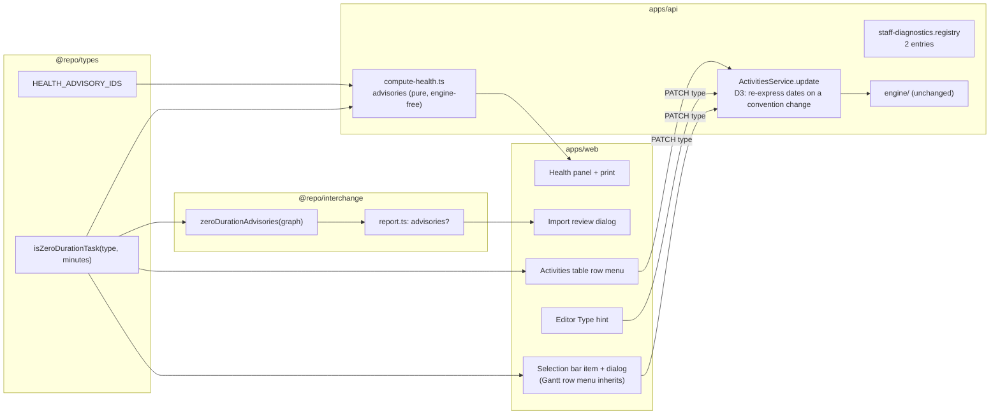
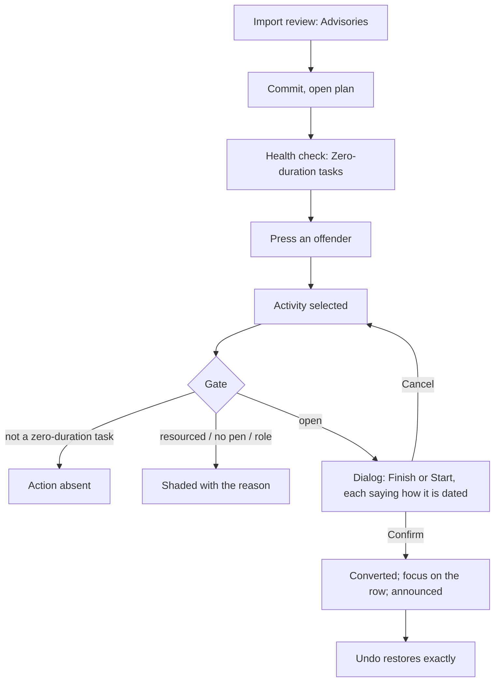

# Feature Spec: A zero-duration task keeps its date, is reported, and converts without moving

- **Status:** Draft
- **Author(s):** feature-analyst (for the product owner)
- **Date:** 2026-09-26
- **Tracking issue / epic:** `docs/TECH_DEBT.md` #384
- **Roadmap link:** new entry under the finish-milestone line in `docs/ROADMAP.md` (beside ADR-0155's,
  `ROADMAP.md:398`), added in M1. A planner can act on this, so it is listed, not exempted.
- **Related ADR(s):** ADR-0035 §22 (amended), ADR-0155 (decision 5 confirmed, one sentence
  corrected), ADR-0116 (health report contract), ADR-0050 / ADR-0156 (import report), ADR-0082,
  ADR-0093, ADR-0028, ADR-0048, ADR-0153, ADR-0140, ADR-0081, ADR-0088. Proposed: **ADR-0162**
  (numbering assumption in §4, "ADR").

## 0. Evidence: what the brief claimed and what was checked

This spec was written with read and search tools only. Every claim below was established by
**reading**; none was established by running code. Where a claim can only be settled by running,
the verdict says so and the M0 task that runs it is named.

| #   | Claim                                                                                                                               | Verdict                                            | Established by                                                                                                                                                                                                                                                                                                                                                                                                                                                                                                                                                                                |
| --- | ----------------------------------------------------------------------------------------------------------------------------------- | -------------------------------------------------- | --------------------------------------------------------------------------------------------------------------------------------------------------------------------------------------------------------------------------------------------------------------------------------------------------------------------------------------------------------------------------------------------------------------------------------------------------------------------------------------------------------------------------------------------------------------------------------------------- |
| E1  | ADR-0155 moved only `FINISH_MILESTONE` to the "day it closes" reading, and left a zero-duration `TASK` on the start-of-day reading. | True                                               | `docs/adr/0155-…md:44` (decision 5). The engine applies the new index to one type only: `compute.ts:860-873` (`reportIndex` branches on `activity.type === 'FINISH_MILESTONE'`); `instants.ts:74-76` (`finishMilestoneDisplayIndex` = `max(ownOffset − 1, 0)`).                                                                                                                                                                                                                                                                                                                               |
| E2  | After a task ending Friday, a finish milestone reads Friday and a zero-duration task at the same instant reads Monday.              | True, and pinned                                   | `compute.zero-task.spec.ts:61-68` (project finish `2026-01-09` against `2026-01-12`); `compute.finish-milestone.spec.ts:149-152`.                                                                                                                                                                                                                                                                                                                                                                                                                                                             |
| E3  | **Decision 1a:** applying the finish-milestone rule to a zero-duration task would misdate one reached only by start-type logic.     | **Holds** (read, not run)                          | An `FS` bound is the predecessor's exclusive finish; an `SS` bound is the predecessor's start (`compute.ts:1013-1016`); both are rolled forward to the next working minute (`compute.ts:256`). After a Friday-ending task and before a Monday-starting task they are **the same instant**. The rule prints the day of the minute **before** the instant (`instants.ts:74-76`), so the SS-reached task would read Friday. Exception: at the data date the floor (`Math.max(…, 0)`) keeps it on the data date. M0-T2 pins it with a case.                                                       |
| E4  | **Decision 1b:** choosing the rule per task from its incoming link types would make a date depend on logic type.                    | **Holds**, and is worse than stated                | True by construction. Three further facts: which edge drives is itself an engine **output**, computed after the forward pass (`compute.ts:360-389`), so the rule would read one output to label another and could change on any recalculation; an FS and an SS edge can bind at the same instant (E3), so a tie rule is needed; an open-start task has no incoming link at all. ADR-0155 rejected the same rule for finish milestones for the same reasons (`0155-…md:81-83`).                                                                                                                |
| E5  | ADR-0035 §22 "carried a 'date-neutral' note".                                                                                       | **False**                                          | §22 is two lines and says nothing about dates (`docs/adr/0035-…md:173-174`). The phrase is in a **test docblock**, `compute.zero-task.spec.ts:17-19`, and in `apps/api/CHANGELOG.md:3644`. ADR-0155 (`:102-103`) and `docs/TECH_DEBT.md:11719` both attribute it to §22. So §22 is silent rather than wrong, and the stale text is the docblock.                                                                                                                                                                                                                                              |
| E6  | That docblock is now false.                                                                                                         | True                                               | `compute.zero-task.spec.ts:15-19` says a zero-duration task "carries the project finish exactly as a milestone at the same instant would". The same file's case at `:61-68` asserts the two give different project finish dates.                                                                                                                                                                                                                                                                                                                                                              |
| E7  | The DCMA metric set is closed at 14 and the report is total over it.                                                                | True                                               | `packages/types/src/index.ts:2658-2675` (`HEALTH_METRIC_IDS`), `:2805-2810` ("always exactly 14 metric rows"); ADR-0116 D3; totality suite `compute-health.totality.spec.ts`.                                                                                                                                                                                                                                                                                                                                                                                                                 |
| E8  | The health report already treats a zero-duration task as "not work", without saying so.                                             | True                                               | Metric 8 and metric 10 filter `durationMinutes > 0` out of their populations (`compute-health.ts:419`, `:466`). Metric 1 excuses a `FINISH_MILESTONE` with no successor and never a `TASK` (`:308-309`), so a zero-duration task used as a closing event is reported as missing logic.                                                                                                                                                                                                                                                                                                        |
| E9  | The health check can compute the new finding with no new query.                                                                     | True                                               | The loader already reads `type`, `durationMinutes` and assignment presence per activity (`schedule.service.ts:936-993`, `hasAssignment` at `:992`).                                                                                                                                                                                                                                                                                                                                                                                                                                           |
| E10 | The web client does not validate the health report's shape.                                                                         | True                                               | `use-schedule-health.ts:17-21` casts through `apiFetch<ScheduleHealthReport>`. An older bundle ignores a key it does not know.                                                                                                                                                                                                                                                                                                                                                                                                                                                                |
| E11 | The web client parses the import report with a strict schema.                                                                       | True (`#387`)                                      | `packages/interchange/src/report.ts:114-133` (`.strict()`); parsed at `apps/web/src/features/interchange/api/use-interchange.ts:110`, `:134`.                                                                                                                                                                                                                                                                                                                                                                                                                                                 |
| E12 | A new finding **kind** would be misfiled rather than rejected.                                                                      | True                                               | `bucketFindings` sends every kind that is not `approximation` or `repair` to `drops` (`import-xer.ts:77-91`). A fourth kind would appear to the planner as something that was **not imported**.                                                                                                                                                                                                                                                                                                                                                                                               |
| E13 | A P6 `TT_Task` with zero duration imports as a `TASK` with duration 0, silently.                                                    | True                                               | `xer-adapter.ts:58` (`TT_Task → TASK`), `:526-540` (hours → minutes; 0 h gives 0; no finding unless rounded or clamped).                                                                                                                                                                                                                                                                                                                                                                                                                                                                      |
| E14 | An MSPDI task with duration 0 and no `Milestone` flag imports as a `TASK` with duration 0, silently.                                | True                                               | `mspdi-adapter.ts:422-464`: only `Milestone = 1` makes a milestone (`:430-446`); otherwise `TASK`, with a finding only for rounding or clamping (`:455-463`).                                                                                                                                                                                                                                                                                                                                                                                                                                 |
| E15 | How common are zero-duration tasks in the seed catalogue?                                                                           | **Rare** (read, not run)                           | Two, both unresourced: fixture `A7550` (`packages/engine-conformance/fixtures/csv/activities.csv:83`; no assignment row names it) and `capability-network-shape` `N6` (`apps/seed-cli/src/capabilities/network.ts:38-42`). The scale tier never makes one (`packages/seed/src/scale/generator.ts:407`, `:417`); the pairwise tier zeroes only milestones and LOE (`pairwise/cases.ts:71`); the NetPoint plan's zero-duration rows are all milestones (`netpoint-power-plant.ts:82-95`). Importing the torture XER adds `A7550` again (`p6_torture_test_v1.xer:115`). M0-T1 counts by running. |
| E16 | The catalogue's types plan describes a zero-duration task it does not contain.                                                      | True — drift found incidentally                    | `apps/seed-cli/src/capabilities/types-wbs.ts:21` says "Z is a zero-duration TASK"; the activity list (`:42-96`) has no `Z`.                                                                                                                                                                                                                                                                                                                                                                                                                                                                   |
| E17 | Re-dating a stored date one calendar day earlier keeps a zero-duration activity's instant when it becomes a finish milestone.       | **Holds for all five date fields** (read, not run) | A zero-duration non-milestone reads each date as the start of its day, rolled forward (`constraints.ts:123-126`, `:246`, `:275`; `compute.ts:345`). A finish milestone reads date D as the start of D+1, rolled forward (`instants.ts:64-67`, used at `constraints.ts:119-121`, `:244-245`, `:272-273`, `compute.ts:343-344`). So storing D−1 gives the identical instant on any calendar. ADR-0155 used the same D−1 rewrite for placements and verified it over 1,440 cases (CLAUDE.md §16, ADR-0155 entry). M0-T2 re-runs it for all five fields and both directions.                      |
| E18 | **A path that converts without keeping position already exists.**                                                                   | **True — a latent defect** (read, not run)         | The activity editor's Type field offers the milestone types (`ActivityWorkFields.tsx:72-78`). A `PATCH` that changes `type` touches no date field; it only forces the duration to 0 (`activities.service.ts:552-555`). So changing a placed or constrained zero-duration `TASK` (or a `START_MILESTONE`) to `FINISH_MILESTONE` in the editor moves it to the end of its stored day, which is up to one working day later, and pushes its successors. M0-T3 reproduces it through the API.                                                                                                     |
| E19 | The API refuses resource assignments on a milestone.                                                                                | **False**                                          | `resource-assignment.service.ts` refuses a `GROUP` resource only (`:34`, `:405`); nothing checks the activity type. So "only an unresourced task may convert" is a product rule, not a constraint the API already holds.                                                                                                                                                                                                                                                                                                                                                                      |
| E20 | Converting changes behaviour beyond the date label for an activity that carries cost or resources.                                  | True                                               | Levelling never moves a milestone (`level.ts:129`). Earned value earns a milestone all-or-nothing and plans its value at its start (`earned-value.ts:350-354`, `:393-396`), where a task earns by its percent-complete type. The project-finish tie-break is by milestone type (`compute.ts:878-885`).                                                                                                                                                                                                                                                                                        |
| E21 | The selection bar is where object actions live, and the Gantt row menu inherits its roster.                                         | True                                               | `selection-actions.tsx:486-856`; `GanttRowMenu.tsx:20`, `:99` filter `selectionActionItems`. The activities table's row menu is a **separate, hand-kept** roster (`ActivitiesTable.tsx:1015`, `actionsFor`).                                                                                                                                                                                                                                                                                                                                                                                  |
| E22 | Adding a control to the selection bar has a measured width cost.                                                                    | True                                               | `clear-visual-placement` is 146 px and costs the diagram 0 / 36 / 76 px at 1920 / 1646 / 1440 when shown, which is why it is shown only when it applies (`selection-actions.tsx:793-809`).                                                                                                                                                                                                                                                                                                                                                                                                    |
| E23 | On the canvas a finish milestone is drawn at the **end** of its reported day.                                                       | True                                               | `apps/web/src/lib/milestone-day.ts:4-29` (ADR-0155 decision 8).                                                                                                                                                                                                                                                                                                                                                                                                                                                                                                                               |
| E24 | Type and dates are saved by different editor scopes.                                                                                | True                                               | `activity-scope-schemas.ts:36-44` (`type` in `general`), `:55-71` (constraint, external and expected-finish dates in `scheduling`).                                                                                                                                                                                                                                                                                                                                                                                                                                                           |
| E25 | A staff diagnostic is one registry entry, with a fixed all-numeric row.                                                             | True                                               | `apps/api/src/modules/staff/staff-diagnostics.registry.ts:3-21`, `:93-104`.                                                                                                                                                                                                                                                                                                                                                                                                                                                                                                                   |

**What E3–E5 and E18 change about the decision.** The product owner's decision stands, and the
engine confirms both reasons for it. But the decision is **incomplete in two places** and **wrong
about one fact**, and the spec says so rather than building around it:

1. **Wrong fact (E5).** ADR-0035 §22 never said "date-neutral". The false sentence is a test docblock,
   and two newer documents copied the attribution. The correction is therefore: fix the docblock, give
   §22 the date rule it never had (an amendment, not a correction), and record the misattribution.
2. **Incomplete (E18).** A conversion path already exists and **moves the bar**: the editor's Type
   field. A new "convert" action that keeps position, beside an old path that does not, would give the
   product two answers to one question. So the position-keeping rule belongs on the **server**, where
   every path meets it (D3).
3. **Incomplete (E23).** "Keep the bar exactly where it is" can be met for the schedule, not for the
   pixel. The instant, every successor, every float and every other activity's dates are unchanged
   (FC-2). But a finish milestone is drawn at the end of its reported day, so across a non-working gap
   its glyph moves back to where its predecessor's bar ends (Monday 00:00 → end of Friday). That move
   is exactly what ADR-0155 exists to produce. On a 24-hour calendar, or with no gap before it, the
   pixel is unchanged. The spec defines "keeps its position" as **keeps its instant** and states the
   glyph move.

## 1. Business understanding

### Problem

A zero-duration `TASK` and a `FINISH_MILESTONE` can sit at the same instant and print different dates
(E2). The product owner decided not to change the task's rule (decision 1). What is left is a
**data-quality** problem: a zero-duration task is almost always a milestone that was entered, or
imported, as a task. Nothing tells the planner. The health check silently drops such tasks from two
metrics and flags one of them under another (E8). An import creates them without a word (E13, E14).
And the one way to turn one into a milestone, the editor's Type field, moves it by up to a working
day and pushes everything after it (E18).

Why now: ADR-0155 made the two types print different dates on 2026-09-23. Before that, the mistake
was invisible because both read the same.

### Users

- **Planner** (and **Org Admin** acting as one): sees the finding, converts the task. The conversion
  is a structural write, so it needs the pen (ADR-0028).
- **Contributor and Viewer**: see the finding in the health check (`schedule:read`). The conversion is
  shaded for them, with the reason.
- **External Guest**: nothing. The share view has no health check and no selection bar (ADR-0116,
  "guest-share exposure — excluded by construction").
- **Operator** (staff console): a count of zero-duration tasks across the installation (M0-T4).

### Primary use cases

1. A planner opens the health check and learns which activities are zero-duration tasks.
2. A planner imports a P6 or MS Project file and is told which activities arrived as zero-duration
   tasks.
3. A planner turns an unresourced zero-duration task into a finish (or start) milestone. Nothing in
   the schedule moves.
4. A planner changes a zero-duration activity's type in the editor. Nothing in the schedule moves
   (the latent defect, fixed).

### User journeys

- **From the health check:** `Analysis ▾ ▸ Health check…` (`tsld-toolbar-items.tsx:1489-1491`,
  `:1581`) → "Beyond the DCMA assessment" → Zero-duration
  tasks (3) → press an offender → the activity is selected → the selection bar offers **Make
  milestone…** → dialog: Finish milestone ("dated by the day the work before it ends") / Start
  milestone ("keeps its date, Mon 12 Jan") → Confirm → announced with the date it now reads; Undo
  available.
- **From import:** Import → dry-run review → "Advisories: 12 activities have no duration" → commit →
  open the plan → the health check lists the same 12.
- **Alternate:** a resourced zero-duration task: **Make milestone…** is shaded, and its reason names
  the assignments.
- **Alternate:** no pen: shaded with the pen reason, like Edit and Delete.

### Expected outcomes

- No zero-duration task reaches a handed-over programme without the planner having been told.
- Turning one into a milestone is one action, never moves the schedule, and undoes exactly.
- The editor's Type field stops moving activities.

### Success criteria (falsification conditions, committed before M0 measures anything)

- **FC-1, engine parity.** No non-test file under `apps/api/src/modules/schedule/engine/` changes in
  this epic. No existing `expect` line in any `engine/*.spec.ts` changes. New engine cases go in a new
  file. Checked by `git diff --stat` on the epic's merge base and by review of the two spec files whose
  docblocks change.
- **FC-2, a conversion keeps the instant.** For a zero-duration activity with any combination of the
  five date fields set (placement, primary and secondary constraint date, external early start,
  external late finish), converting `TASK → FINISH_MILESTONE`, `START_MILESTONE → FINISH_MILESTONE`
  and back leaves identical: every other activity's persisted early/late dates, offsets and floats;
  the converted activity's early/late **offsets** and total float; every edge's driving flag. Only the
  converted activity's reported **dates** and the plan's reported finish may change. Proven through
  the real engine by an API e2e on three calendars: Monday–Friday full days, an 8-hour intraday shift,
  and 24-hour. **Verified red** by disabling the re-dating.
- **FC-3, undo is exact.** Convert, then Undo, restores all five stored date fields and the type
  byte-for-byte. Proven by the journey reading the row back through the API.
- **FC-4, the DCMA contract does not move.** `HEALTH_METRIC_IDS` is unchanged, `metrics.length === 14`,
  `summary` counts are unchanged by the new section, and the existing totality suite passes unedited.
- **FC-5, the import report is additive.** A report for a file with no zero-duration task is
  byte-identical to today's (the new key is absent, not empty). The reader ships at least one release
  before the producer (#387).
- **FC-6, the selection bar does not grow for anybody else.** `e2e-workspace-chrome/dock.spec.ts`'s
  existing equality passes unedited. With a zero-duration task selected, the foot row at 1646 and 1920
  stays on one line; if it does not, the label is shortened before release (M0-T5 measures the
  candidates).
- **FC-7, no new health query.** `getHealthCheck` issues the same number of queries before and after
  (a spy count in the service unit suite).
- **FC-8, the journeys drive the product.** Each user-facing milestone lands with a Playwright step
  that presses its entry point against a real API with the pen enforced (ADR-0081).

### Open questions

**Critical (the answer changes the design):**

- **CQ-1: where the position-keeping rule lives.** On the **server**, applied to every `PATCH` that
  changes a zero-duration activity's type across the finish-milestone date convention (D3)? Or only in
  the new client action? _Default: server._ The server rule fixes the editor's latent defect (E18) and
  every future path, and makes Undo exact for free. Its cost is a change to the `PATCH` contract: a
  request that sends only `type` can now rewrite up to five stored dates. The client-only option
  leaves the editor moving bars.

**Assumed defaults (not blocking):**

- **The health finding is a separate section, not a 15th metric** (D1). Not counted in `summary`.
- **The planner chooses Finish or Start** in the dialog, preselected by a stated rule, with each
  option showing the date it will read (D5).
- **A resourced task is shaded, with the reason** (ADR-0082: shut by a state the reader can change).
- **Single activity only.** The plural selection bar does not offer it. Reopen if M0-T1 or the staff
  diagnostic finds an import with more than 20 zero-duration tasks.
- **`TASK` only.** A zero-duration `RESOURCE_DEPENDENT` is not in scope: its date is computed on its
  driving resource's calendar, so a conversion cannot keep its instant in general. M0-T1 counts them;
  a non-zero count becomes a register row.
- **No `VITE_` flag** (ADR-0088 D1). The rollback is the commit boundary.
- **A staff diagnostic is warranted, as two entries** (M0-T4). It is the only way to learn the
  deployed count (ADR-0140). It sizes the bulk question above and nothing else depends on it.
- **The types capability plan gains the `Z` its description promises** (E16), resourced, as the
  catalogue's first resourced zero-duration task and the shading witness.

## 2. Functional requirements

### User stories & acceptance criteria

> **US-1** — As a planner, I want the health check to list zero-duration tasks, so that I find
> milestones entered as tasks before I hand the programme over.
>
> - **Given** a plan with zero-duration `TASK`s **when** I open the health check **then** a section
>   headed "Beyond the DCMA assessment" shows "Zero-duration tasks" with the count, the number of
>   activities it is out of, and the offender list, each offender noted "no resources" or "N resource
>   assignments".
> - **Given** none **then** the row is present and reads "None".
> - **Given** a plan never calculated **then** the row is still assessed (it reads stored durations,
>   not computed dates).
> - **Given** the DCMA rows **then** they, their order and the summary are exactly as today (FC-4).
> - **When** I activate an offender **then** the activity is selected and revealed, by the existing
>   jump seam.
> - **When** I print the report **then** the section prints after the fourteen rows with its full
>   offender list.

> **US-2** — As a planner, I want an import to tell me which activities arrived with no duration.
>
> - **Given** an XER `TT_Task` with zero hours, or an MSPDI task with zero duration and no milestone
>   flag, **when** the dry-run report shows **then** an "Advisories" group names each one by code:
>   "imported as a task with no duration; a zero-length event is usually a milestone".
> - **Given** a file with none **then** the report has no `advisories` key (FC-5).
> - An advisory never changes what is imported, and is never filed as an approximation, repair or drop
>   (E12).

> **US-3** — As a planner holding the pen, I want to turn an unresourced zero-duration task into a
> milestone without moving anything.
>
> - **Given** a zero-duration `TASK` with no live assignment is selected **then** the selection bar and
>   the Gantt row menu offer **Make milestone…**, and so does the activities table's row menu.
> - **When** I press it **then** a dialog offers Finish milestone and Start milestone, each saying how
>   it will be dated, with one preselected (D5).
> - **When** I confirm **then** the type changes, its stored dates are re-expressed (D3), nothing else
>   in the schedule moves (FC-2), the change is one Undo step (FC-3), and a polite announcement says
>   what it now is, the date it now reads (taken from the recalculated row), and that nothing moved.
> - **Given** the task carries the plan's finish and I choose Finish **then** the dialog says the
>   plan's reported finish may read an earlier day, because nothing moved but the date is now read
>   the way a finish milestone's is.
> - **Given** the task has live assignments **then** the action is shaded with "It has N resource
>   assignments. A milestone does no work; remove them in Resources first."
> - **Given** I do not hold the pen, or my role cannot edit **then** the action is shaded with the
>   existing pen or role reason.
> - **Given** a selection that is not a zero-duration `TASK` **then** the action is absent (ADR-0082's
>   omit clause: it does not apply).
> - **After** conversion the control disappears (the activity is now a milestone) **and** focus lands
>   on the selected activity's row in the canvas listbox (or the Gantt row), never on `<body>`.

> **US-4** — As a planner, I want changing a zero-duration activity's type in the editor never to move
> it.
>
> - **Given** a zero-duration activity **when** I change its type between `FINISH_MILESTONE` and any
>   other type and save **then** its stored dates that the save did not send are re-expressed so its
>   instant is unchanged, and a hint under the Type field says so before I save.
> - **Given** a save that sends a date together with the new type **then** that date is read in the
>   new type's convention (the planner typed it for the new type).
> - **Given** a non-zero-duration task changed to a milestone **then** behaviour is today's: dates are
>   kept as typed (out of scope; see Edge cases).

### Workflows

**Conversion (US-3):**

1. Host derives the conversion gate once: applies (`type === 'TASK' && durationMinutes === 0`),
   assignment count (one `useAssignments` query, enabled only for such a selection), pen and role
   (`scheduleRefusal(PEN_ACTION)`).
2. **Make milestone…** opens the dialog. Preselection per D5. Start shows the activity's current
   reported date, which does not change. Finish says in words how it will be dated and does **not**
   preview a date: the finish reading is "the day of the last working minute before the instant"
   (`instants.ts:74-76`) on the activity's calendar, and computing that in the browser would be a
   second copy of the engine's working-time rule, which is how two answers drift (the ADR-0065
   argument). The real date is announced from the recalculated row in step 3.
3. Confirm: `beginLayoutEdit` (ADR-0153) → `PATCH {version, type}` → record one Undo entry whose
   inverse is `PATCH {version, type: 'TASK'}` → the coalesced recalculation (ADR-0032) → overlap
   check → announcement.
4. Focus moves to the activity's listbox option (canvas) or row (Gantt) before the dialog closes, so
   the native dialog's focus restore has a live target (ADR-0149 D8).

**Server rule (US-3, US-4):** see D3.

### Edge cases

| Case                                                                   | Behaviour                                                                                                                                                                                                           |
| ---------------------------------------------------------------------- | ------------------------------------------------------------------------------------------------------------------------------------------------------------------------------------------------------------------- |
| Zero-duration task at the data date, converted to Finish               | Reads the data date (the floor, `instants.ts:74-76`). Stored placement becomes the day before the data date, which is legal and keeps the instant.                                                                  |
| Re-dated placement lands on a non-working day                          | Accepted and stated, as in ADR-0155 (`0155-…md:111-114`): the end of Sunday rolls forward to Monday's first minute, the same instant. Only the placement field looks odd.                                           |
| Complete or started zero-duration task                                 | Converts. Actuals are type-independent in the engine (`progress.ts:78-110`) and are displayed verbatim.                                                                                                             |
| `START_MILESTONE ↔ FINISH_MILESTONE` in the editor                     | Same server rule (D3). This is a second instance of the latent defect, fixed by the same code.                                                                                                                      |
| Non-zero-duration task changed to a milestone                          | Out of scope. Its instant is ambiguous (start or finish?) and the bar collapses anyway. Today's behaviour kept and documented.                                                                                      |
| Converted task has a cross-plan successor                              | The downstream plan's derived bound reads the upstream's reported finish date at day granularity (`#385`), so it may move a day earlier on the next programme recalculation. Stated in the ADR; not mitigated here. |
| Converted task is in an active baseline                                | Revision compare shows its finish one or more working days earlier, beside "type changed". The label moved, not the work. Stated in the ADR.                                                                        |
| Converted task has activity expense                                    | Earned value now earns it all-or-nothing at its start (E20). Stated in the ADR; not shaded (expense is not work).                                                                                                   |
| Two planners                                                           | The pen serialises. A stale `version` gives 409 and Undo aborts and refetches (ADR-0048).                                                                                                                           |
| The editor's scheduling tab holds unsaved dates while the type changes | Risk R2 in the plan: the save sends the typed dates, which are then read in the new convention. The Type hint says so; M2 pins the non-dirty re-seed with a test.                                                   |

### Permissions

| Action                  | Permission / gate                                                   | Roles                                   |
| ----------------------- | ------------------------------------------------------------------- | --------------------------------------- |
| See the health finding  | `schedule:read` (unchanged route)                                   | Org Admin, Planner, Contributor, Viewer |
| See the import advisory | `interchange:import` (unchanged)                                    | Org Admin, Planner                      |
| Convert / change type   | activity update permission + org scope + **pen** (`assertHoldsPen`) | Org Admin, Planner (holding the pen)    |
| Staff diagnostic        | staff console (`StaffPrincipal`, ADR-0086/0140)                     | Operator only                           |

No new permission. Cross-org access stays a uniform 404.

### Validation rules

- The server rule applies only when the **stored** duration is 0 and the type change crosses the
  finish-milestone convention (D3).
- A date sent in the same request is read in the new type's convention; it is never re-dated.
- The client never sends re-dated dates itself. One place computes them.

### Error scenarios

| Scenario                                  | Detection              | User-facing result                                     | Status |
| ----------------------------------------- | ---------------------- | ------------------------------------------------------ | ------ |
| Pen not held                              | `assertHoldsPen`       | Action shaded beforehand; if raced, the lock message   | 423    |
| Stale version                             | optimistic lock        | "This activity was changed elsewhere…"; Undo refetches | 409    |
| Assignment added between open and confirm | none server-side (E19) | Converts; the assignment survives on the milestone     | 200    |
| Activity deleted meanwhile                | org-scoped read        | "Activity not found"                                   | 404    |

The third row is a deliberate choice: the "unresourced" rule is a product rule (E19), and making it a
server refusal would also change the editor's existing behaviour for every milestone. Recorded as a
follow-up question in the ADR, not built.

## 3. Technical analysis

| Area           | Impact | Notes                                                                                                                                                                                                                                                            |
| -------------- | ------ | ---------------------------------------------------------------------------------------------------------------------------------------------------------------------------------------------------------------------------------------------------------------- |
| Frontend       | med    | Health panel + print: one section. Import dialog: one group. Selection bar, Gantt row menu, activities table: one item and one dialog. Editor: one hint.                                                                                                         |
| Backend        | low    | `ActivitiesService.update`: the D3 rule. `compute-health.ts`: one pure evaluator. Interchange: one pure producer. Staff: two registry entries.                                                                                                                   |
| Database       | none   | No model, column, index, constraint or data migration. `database-architect` is not engaged because there is nothing to design (CLAUDE.md §19.3 governs schema changes; this has none). If any milestone finds it needs one, the work stops and the agent is run. |
| API            | med    | `PATCH …/activities/:id` semantics (D3), documented in OpenAPI and `docs/API.md`. `GET …/schedule/health-check` gains `advisories`. The import report gains optional `advisories`.                                                                               |
| Security       | low    | No new route, permission or principal. Existing pen, org scope and version checks apply. The staff diagnostic follows ADR-0140's gates (no caller input, aliased counts only).                                                                                   |
| Performance    | low    | Health: O(n) over rows already loaded (FC-7). Import: O(n) over the graph. Selection bar: one assignment query, only for a zero-duration task. Staff SQL measured on the 102,000-activity estate before shipping (ADR-0140).                                     |
| Infrastructure | none   | No new service, variable or CI step. Journeys extend existing Playwright configs.                                                                                                                                                                                |
| Observability  | none   | —                                                                                                                                                                                                                                                                |
| Testing        | med    | Engine characterisation (new file), API e2e (FC-2 on three calendars), unit and structural (health totality, import additivity, gate identity), Playwright (three suites extended).                                                                              |

### Dependencies

- **`#387`**: the import advisory's reader must be released before its producer (ADR-0156's
  convention). This epic does not decide `#387`; it is the second user of the convention.
- **ADR-0153** `beginLayoutEdit` census: the conversion's Undo record must go through it; the glyph's
  drawn span changes (E23), so it is not layout-exempt.
- **ADR-0093** `selection-duplication.structural.test.ts`: the action must exist only on object
  surfaces.
- **ADR-0116** G1/G2/G4 gates: extended to the advisory vocabulary.
- **`#385`** (parallel spec, `docs/specs/cross-plan-day-boundary/`): the cross-plan consequence above.

## 4. Solution design

### Architecture overview



### Data flow

```mermaid
sequenceDiagram
  participant P as Planner
  participant W as Web (selection bar)
  participant A as ActivitiesService
  participant DB as Postgres
  participant E as Engine (unchanged)
  P->>W: Make milestone… → Finish → Confirm
  W->>W: beginLayoutEdit (snapshot spans)
  W->>A: PATCH {version, type: FINISH_MILESTONE}
  A->>A: assertHoldsPen, org scope
  A->>A: stored duration 0 and convention changes → re-express unsent dates (D−1)
  A->>DB: update (version-checked)
  A-->>W: activity with re-expressed dates
  W->>W: record Undo (inverse PATCH {type: TASK})
  W->>A: recalculate (coalesced)
  A->>E: computeSchedule (same instants)
  E-->>A: same offsets and floats; new reported date for the milestone
  W->>P: "Now a finish milestone; reads Fri 9 Jan. Nothing moved." (date from the recalculated row)
```

### User flow



### Database changes

None (see §3).

### API changes

1. **`PATCH /api/v1/organizations/:slug/activities/:id`** — semantics only, no new field. When the
   stored `durationMinutes` is 0 and the request changes `type` so that
   `convention(old) ≠ convention(new)`, where `convention(FINISH_MILESTONE) = END_OF_DAY` and every
   other type is `START_OF_DAY` (E17), each of `visualStart`, `constraintDate`,
   `secondaryConstraintDate`, `externalEarlyStart`, `externalLateFinish` that is stored and **not
   present in the request** is moved one calendar day: earlier when entering `END_OF_DAY`, later when
   leaving it. `expectedFinish` is untouched (inert at zero duration, `compute.ts:263`). The response
   carries the new values. OpenAPI `type` description and `docs/API.md` state the rule and the
   "a date you send is read in the new type's convention" clause. api-reviewer reviews it.
2. **`GET …/plans/:id/schedule/health-check`** — adds `advisories: HealthAdvisoryResult[]`, always
   present, total over `HEALTH_ADVISORY_IDS = ['ZERO_DURATION_TASKS']`, not counted in `summary`.
   Shape: `{ id, name, measured: HealthMeasured, offenderCount, offendersTruncated, offenders:
HealthOffender[], detail: { resourced: number } }`. The OpenAPI enum derives from the tuple.
3. **Import report** — `advisories?: { code: 'ZERO_DURATION_TASK'; entity: 'activity'; sourceRef:
string | null; detail: string }[]`, strict, absent when empty.

### Component changes

- `ScheduleHealthPanel` / `HealthPrintDocument`: a section after the fourteen rows, reusing the
  offender list and jump seam. No verdict word; the count is the fact.
- Import review dialog: an "Advisories" group beside approximations/repairs/drops.
- `selection-actions.tsx`: item `make-milestone` (`group: 'object'`, `penGated`, `isVisible` =
  applies, `disabledReason` from one host-derived gate, `lostReason` for ADR-0135). The Gantt row menu
  inherits it; `ActivitiesTable.actionsFor` takes the **same gate object** (identity-pinned, the
  ADR-0082 pattern).
- `MakeMilestoneDialog`: `Dialog` + `RadioCardGroup` (ADR-0152). Error, pending and success states.
- `ActivityWorkFields`: a hint under Type when the stored duration is 0 and the selected type crosses
  the convention.
- Staff console: no change (the registry drives it).

### Implementation approach & alternatives

**D1 — the health finding is an advisory section, not a metric.**

| Option                                                             | Verdict    | Reason                                                                                                                                                                                      |
| ------------------------------------------------------------------ | ---------- | ------------------------------------------------------------------------------------------------------------------------------------------------------------------------------------------- |
| A 15th `HealthMetricId`                                            | Rejected   | Breaks the closed union, the 1–14 ordinals, the totality suite and the summary (E7). It would also claim the finding is DCMA's.                                                             |
| An `INFORMATIONAL` row inside `metrics`                            | Rejected   | Same union; same ordinal problem.                                                                                                                                                           |
| A note in metric 1's or 8's `detail`                               | Rejected   | Hides it under a metric it is not about.                                                                                                                                                    |
| **A separate `advisories` array, total over its own closed tuple** | **Chosen** | The DCMA contract is untouched (FC-4). ADR-0116's "a report never omits a check" is kept: the row is always present. An older web bundle ignores the key (E10), so it ships in one release. |

**D2 — the import finding is a new optional array, not a new finding kind.** A fourth kind would be
filed as a drop by today's code (E12), and misclassifying it as an approximation would be false:
nothing was coerced. So `advisories` is its own optional array, and because the report is parsed
strictly (E11), its reader ships first (ADR-0156's order). The producer is one pure function over the
final import graph, called by both orchestrators (`import-xer.ts`, `import-mspdi.ts`), with a census
test, rather than a rule written into two adapters.

**D3 — the server keeps position on every type change (CQ-1).** One function in
`ActivitiesService.update`. Alternatives: a client helper used by the new action (rejected: leaves
E18 live and gives two answers); a dedicated `POST …/convert` route (rejected: the editor path would
still move bars unless rerouted, and a new route needs an audit-census entry for no gain). The D−1 /
D+1 rewrite is calendar-free and is ADR-0155's proven rewrite (E17). The guarantee is stated for
activities whose scheduling calendar the type change does not alter, which is every `TASK` and
milestone; a zero-duration `RESOURCE_DEPENDENT` with a driving resource schedules on its driver's
calendar, so changing its type reschedules it anyway, and the ADR says so.

**D4 — the conversion is a plain `PATCH {version, type}`.** Pen, org scope, optimistic lock and the
audit census are unchanged: the route is `PLAN_CONTENT`, permanently unaudited under ADR-0073's
content-edit exclusion, and a type edit is a content edit. Undo is one entry whose inverse is
`PATCH {type: 'TASK'}`; D3 re-dates on the way back, so Undo is exact (FC-3). It goes through
`beginLayoutEdit`, because the glyph's drawn span moves (E23) and may meet a bar.

**D5 — Finish or Start is the planner's choice, preselected.** Preselect Finish when the task has a
predecessor, Start otherwise: the rule the MSPDI importer already uses (`mspdi-adapter.ts:433`), so
the product has one such rule. This is not the rule decision 1 rejected: that was a standing **date**
rule recomputed on every recalculation; this is a one-time default the planner sees and confirms. Each
option says how it will be dated. Start keeps the reported date unchanged (same convention), so it
shows it. Finish may change it, says so, and the announcement gives the actual date afterwards (the
client does not re-implement the engine's working-time rule to preview it).

**D6 — resourced is shaded, not omitted** (ADR-0082: shut by a state the reader can change). The
reason: its assignments model work a milestone does not do (E20), and the API would otherwise accept
them (E19).

**D7 — ADR-0035 §22 is amended, not corrected.** ADR-0035 is a living document whose clauses carry
dated amendments in place (the "§7 amendment" at `0035-…md:103`). §22 gains one blockquote pointing
at ADR-0162: a zero-duration `TASK` is dated by the day its instant opens, and why. The false
"date-neutral" sentence is fixed where it is (`compute.zero-task.spec.ts:17-19`, comment only), and
ADR-0162's "Corrections recorded" names the misattribution in ADR-0155 and #384 rather than editing
an accepted ADR.

### ADR (proposed ADR-0162, outline)

Number assumption: 0160 is the last filed ADR. The parallel `#385` spec
(`docs/specs/cross-plan-day-boundary/`, not yet on disk when this was written) is assumed to take 0161. If it does not, this becomes 0161. **Check `docs/adr/` before filing.**

- **Title:** _A zero-duration task keeps its date, is reported, and converts without moving._
- **Status:** Proposed; accepts per milestone.
- **Amends:** ADR-0035 §22 (adds the date rule). Notes against ADR-0155 (decision 5 confirmed; its
  `:102-103` attribution corrected) and ADR-0116 (a second, non-DCMA section).
- **Context:** E1–E6, E18.
- **Decisions:** (1) the task's date rule is unchanged, with E3/E4 as the evidence; (2) D1–D2, the
  findings; (3) D3–D6, the conversion and the server rule; (4) D7.
- **Consequences:** the glyph move across a gap (E23); project finish, revision compare, earned value
  and cross-plan (`#385`) consequences of converting; the `PATCH` contract change; the D−1 placement
  on a non-working day.
- **Corrections recorded:** E5; E16; E18 (a latent defect found by reading).
- **CPM engine:** not modified (FC-1). No migration.
- **Registers:** CLAUDE.md §16 entry, `docs/adr/README.md` row, `docs/ROADMAP.md` entry.

## 5. Links

- Implementation plan: [./implementation-plan.md](./implementation-plan.md)
- Related docs updated by this change: ADR-0035 §22 (amendment blockquote), `docs/API.md`,
  `docs/TECH_DEBT.md` #384 (rewritten, then closed and ledgered) and new rows from M0, `docs/TEST_PLAYBOOK.md`
  (the `Z` activity), `docs/ROADMAP.md`, CLAUDE.md §16, `compute.zero-task.spec.ts` docblock.
