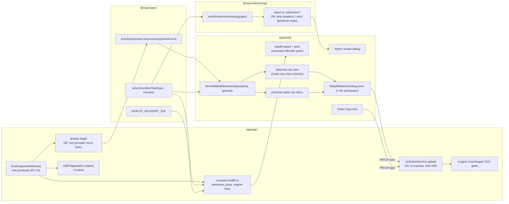
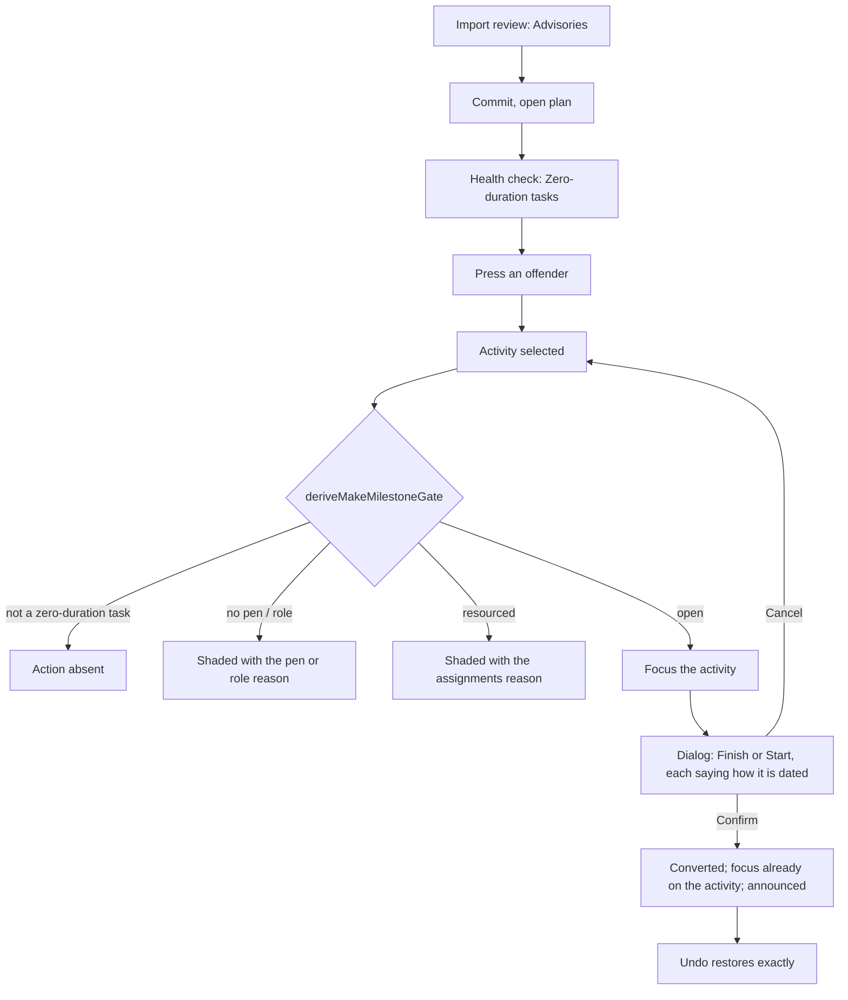

# Feature Spec: A zero-duration task keeps its date, is reported, and converts without moving the schedule

- **Status:** Approved — agreement round complete 2026-09-26 (see agreement-round.md); product owner delegated the open questions
- **Author(s):** feature-analyst (for the product owner)
- **Date:** 2026-09-26 (drafted); folded 2026-09-26 after the agreement round
- **Tracking issue / epic:** `docs/TECH_DEBT.md` #384 (and #387, fixed inside this epic, D9)
- **Roadmap link:** new entry under the finish-milestone line in `docs/ROADMAP.md` (beside ADR-0155's,
  `ROADMAP.md:398`), added in M1. A planner can act on this, so it is listed, not exempted.
- **Related ADR(s):** ADR-0035 §22 (amended), ADR-0155 (decision 5 confirmed, one sentence
  corrected), ADR-0116 (health report contract), ADR-0050 / ADR-0156 (import report), ADR-0082,
  ADR-0093, ADR-0028, ADR-0048, ADR-0153, ADR-0140, ADR-0081, ADR-0088, ADR-0105 (this spec is the
  spec for the shared gate D10 adds), ADR-0149 D8 (focus before a modal opens). Proposed:
  **ADR-0162** (numbering assumption in §4, "ADR").

## 0. Evidence: what the brief claimed and what was checked

This spec was written with read and search tools only. Every claim below was established by
**reading**; none was established by running code. Where a claim can only be settled by running,
the verdict says so and the M0 task that runs it is named. Rows E26–E34 were added during the
agreement-round fold, each by reading the file named.

| #   | Claim                                                                                                                               | Verdict                                            | Established by                                                                                                                                                                                                                                                                                                                                                                                                                                                                                                                                                                                                                                                                                                                                                                                                                                                                                                                           |
| --- | ----------------------------------------------------------------------------------------------------------------------------------- | -------------------------------------------------- | ---------------------------------------------------------------------------------------------------------------------------------------------------------------------------------------------------------------------------------------------------------------------------------------------------------------------------------------------------------------------------------------------------------------------------------------------------------------------------------------------------------------------------------------------------------------------------------------------------------------------------------------------------------------------------------------------------------------------------------------------------------------------------------------------------------------------------------------------------------------------------------------------------------------------------------------- |
| E1  | ADR-0155 moved only `FINISH_MILESTONE` to the "day it closes" reading, and left a zero-duration `TASK` on the start-of-day reading. | True                                               | `docs/adr/0155-…md:44` (decision 5). The engine applies the new index to one type only: `compute.ts:860-873` (`reportIndex` branches on `activity.type === 'FINISH_MILESTONE'`); `instants.ts:74-76` (`finishMilestoneDisplayIndex` = `max(ownOffset − 1, 0)`).                                                                                                                                                                                                                                                                                                                                                                                                                                                                                                                                                                                                                                                                          |
| E2  | After a task ending Friday, a finish milestone reads Friday and a zero-duration task at the same instant reads Monday.              | True, and pinned                                   | `compute.zero-task.spec.ts:61-68` (project finish `2026-01-09` against `2026-01-12`); `compute.finish-milestone.spec.ts:149-152`.                                                                                                                                                                                                                                                                                                                                                                                                                                                                                                                                                                                                                                                                                                                                                                                                        |
| E3  | **Decision 1a:** applying the finish-milestone rule to a zero-duration task would misdate one reached only by start-type logic.     | **Holds** (read, not run)                          | An `FS` bound is the predecessor's exclusive finish; an `SS` bound is the predecessor's start (`compute.ts:1013-1016`); both are rolled forward to the next working minute (`compute.ts:256`). After a Friday-ending task and before a Monday-starting task they are **the same instant**. The rule prints the day of the minute **before** the instant (`instants.ts:74-76`), so the SS-reached task would read Friday. Exception: at the data date the floor (`Math.max(…, 0)`) keeps it on the data date. M0-T2 pins it with a case.                                                                                                                                                                                                                                                                                                                                                                                                  |
| E4  | **Decision 1b:** choosing the rule per task from its incoming link types would make a date depend on logic type.                    | **Holds**, and is worse than stated                | True by construction. Three further facts: which edge drives is itself an engine **output**, computed after the forward pass (`compute.ts:360-389`), so the rule would read one output to label another and could change on any recalculation; an FS and an SS edge can bind at the same instant (E3), so a tie rule is needed; an open-start task has no incoming link at all. ADR-0155 rejected the same rule for finish milestones for the same reasons (`0155-…md:81-83`).                                                                                                                                                                                                                                                                                                                                                                                                                                                           |
| E5  | ADR-0035 §22 "carried a 'date-neutral' note".                                                                                       | **False**                                          | §22 is two lines and says nothing about dates (`docs/adr/0035-…md:173-174`). The phrase is in a **test docblock**, `compute.zero-task.spec.ts:17-19`, and in `apps/api/CHANGELOG.md:3644`. ADR-0155 (`:102-103`) and `docs/TECH_DEBT.md:11719` both attribute it to §22. So §22 is silent rather than wrong, and the stale text is the docblock.                                                                                                                                                                                                                                                                                                                                                                                                                                                                                                                                                                                         |
| E6  | That docblock is now false.                                                                                                         | True                                               | `compute.zero-task.spec.ts:15-19` says a zero-duration task "carries the project finish exactly as a milestone at the same instant would". The same file's case at `:61-68` asserts the two give different project finish dates.                                                                                                                                                                                                                                                                                                                                                                                                                                                                                                                                                                                                                                                                                                         |
| E7  | The DCMA metric set is closed at 14 and the report is total over it.                                                                | True                                               | `packages/types/src/index.ts:2658-2675` (`HEALTH_METRIC_IDS`), `:2805-2810` ("always exactly 14 metric rows"); ADR-0116 D3; totality suite `compute-health.totality.spec.ts`.                                                                                                                                                                                                                                                                                                                                                                                                                                                                                                                                                                                                                                                                                                                                                            |
| E8  | The health report already treats a zero-duration task as "not work", without saying so.                                             | True                                               | Metric 8 and metric 10 filter `durationMinutes > 0` out of their populations (`compute-health.ts:419`, `:466`). Metric 1 excuses a `FINISH_MILESTONE` with no successor and never a `TASK` (`:308-309`), so a zero-duration task used as a closing event is reported as missing logic.                                                                                                                                                                                                                                                                                                                                                                                                                                                                                                                                                                                                                                                   |
| E9  | The health check can compute the new finding with no new query.                                                                     | True                                               | The loader already reads `type`, `durationMinutes` and assignment presence per activity (`schedule.service.ts:936-993`, `hasAssignment` at `:992`). Presence comes from `loadHealthAssignedActivityIds` (`schedule.repository.ts:544-559`), which already fetches **one row per live assignment** and collapses them to a `Set`; returning a per-activity count instead is the same query (M3-T1).                                                                                                                                                                                                                                                                                                                                                                                                                                                                                                                                       |
| E10 | The web client does not validate the health report's shape.                                                                         | True                                               | `use-schedule-health.ts:17-21` casts through `apiFetch<ScheduleHealthReport>`. An older bundle ignores a key it does not know. The converse is E32.                                                                                                                                                                                                                                                                                                                                                                                                                                                                                                                                                                                                                                                                                                                                                                                      |
| E11 | The web client parses the import report with a strict schema.                                                                       | True (`#387`)                                      | `packages/interchange/src/report.ts:114-133` (`.strict()`, and every nested object is `.strict()` too: `:29-41`, `:50-71`, `:91-110`); parsed at `apps/web/src/features/interchange/api/use-interchange.ts:109-111` (the commit envelope, itself `.strict()`), `:134` (dry-run) and `apps/web/src/features/interchange/api/use-export-plan.ts:90` (the export header).                                                                                                                                                                                                                                                                                                                                                                                                                                                                                                                                                                   |
| E12 | A new finding **kind** would be misfiled rather than rejected.                                                                      | True                                               | `bucketFindings` sends every kind that is not `approximation` or `repair` to `drops` (`import-xer.ts:77-91`). A fourth kind would appear to the planner as something that was **not imported**.                                                                                                                                                                                                                                                                                                                                                                                                                                                                                                                                                                                                                                                                                                                                          |
| E13 | A P6 `TT_Task` with zero duration imports as a `TASK` with duration 0, silently.                                                    | True                                               | `xer-adapter.ts:58` (`TT_Task → TASK`), `:526-540` (hours → minutes; 0 h gives 0; no finding unless rounded or clamped).                                                                                                                                                                                                                                                                                                                                                                                                                                                                                                                                                                                                                                                                                                                                                                                                                 |
| E14 | An MSPDI task with duration 0 and no `Milestone` flag imports as a `TASK` with duration 0, silently.                                | True                                               | `mspdi-adapter.ts:422-464`: only `Milestone = 1` makes a milestone (`:430-446`); otherwise `TASK`, with a finding only for rounding or clamping (`:455-463`).                                                                                                                                                                                                                                                                                                                                                                                                                                                                                                                                                                                                                                                                                                                                                                            |
| E15 | How common are zero-duration tasks in the seed catalogue?                                                                           | **Rare** (read, not run)                           | Two, both unresourced: fixture `A7550` (`packages/engine-conformance/fixtures/csv/activities.csv:83`; no assignment row names it) and `capability-network-shape` `N6` (`apps/seed-cli/src/capabilities/network.ts:38-42`). The scale tier never makes one (`packages/seed/src/scale/generator.ts:407`, `:417`); the pairwise tier zeroes only milestones and LOE (`pairwise/cases.ts:71`); the NetPoint plan's zero-duration rows are all milestones (`netpoint-power-plant.ts:82-95`). Importing the torture XER adds `A7550` again (`p6_torture_test_v1.xer:115`). M0-T1 counts by running.                                                                                                                                                                                                                                                                                                                                            |
| E16 | The catalogue's types plan describes a zero-duration task it does not contain.                                                      | True — drift found incidentally                    | `apps/seed-cli/src/capabilities/types-wbs.ts:21` says "Z is a zero-duration TASK"; the activity list (`:42-96`) has no `Z`.                                                                                                                                                                                                                                                                                                                                                                                                                                                                                                                                                                                                                                                                                                                                                                                                              |
| E17 | Re-dating a stored date one calendar day earlier keeps a zero-duration activity's instant when it becomes a finish milestone.       | **Holds for all five date fields** (read, not run) | A zero-duration non-milestone reads each date as the start of its day, rolled forward (`constraints.ts:123-126`, `:246`, `:275`; `compute.ts:345`). A finish milestone reads date D as the start of D+1, rolled forward (`instants.ts:64-67`, used at `constraints.ts:119-121`, `:244-245`, `:272-273`, `compute.ts:343-344`). So storing D−1 gives the identical instant on any calendar. ADR-0155 used the same D−1 rewrite for placements and verified it over 1,440 cases (CLAUDE.md §16, ADR-0155 entry). M0-T2 re-runs it for all five fields and both directions. The shift is in **calendar** days, never working days (E34).                                                                                                                                                                                                                                                                                                    |
| E18 | **A path that converts without keeping position already exists.**                                                                   | **True — a latent defect** (read, not run)         | The activity editor's Type field offers the milestone types (`ActivityWorkFields.tsx:72-78`). A `PATCH` that changes `type` touches no date field; it only forces the duration to 0 (`activities.service.ts:552-555`). So changing a placed or constrained zero-duration `TASK` (or a `START_MILESTONE`) to `FINISH_MILESTONE` in the editor moves it to the end of its stored day, which is up to one working day later, and pushes its successors. M0-T3 reproduces it through the API.                                                                                                                                                                                                                                                                                                                                                                                                                                                |
| E19 | The API refuses resource assignments on a milestone.                                                                                | **False**                                          | `resource-assignment.service.ts` refuses a `GROUP` resource only (`:34`, `:405`); nothing checks the activity type. So "only an unresourced task may convert" is a product rule, not a constraint the API already holds.                                                                                                                                                                                                                                                                                                                                                                                                                                                                                                                                                                                                                                                                                                                 |
| E20 | Converting changes behaviour beyond the date label for an activity that carries cost or resources.                                  | True                                               | Levelling never moves a milestone (`level.ts:129`). Earned value earns a milestone all-or-nothing and plans its value at its start (`earned-value.ts:350-354`, `:393-396`), where a task earns by its percent-complete type. The project-finish tie-break is by milestone type (`compute.ts:878-885`).                                                                                                                                                                                                                                                                                                                                                                                                                                                                                                                                                                                                                                   |
| E21 | The selection bar is where object actions live, and the Gantt row menu inherits its roster.                                         | True                                               | `selection-actions.tsx:486-856`; `GanttRowMenu.tsx:20`, `:99` filter `selectionActionItems`. The activities table's row menu is a **separate, hand-kept** roster (`ActivitiesTable.tsx:1015`, `actionsFor` at `:388`).                                                                                                                                                                                                                                                                                                                                                                                                                                                                                                                                                                                                                                                                                                                   |
| E22 | Adding a control to the selection bar has a measured width cost.                                                                    | True                                               | `clear-visual-placement` is 146 px and costs the diagram 0 / 36 / 76 px at 1920 / 1646 / 1440 when shown, which is why it is shown only when it applies (`selection-actions.tsx:793-809`).                                                                                                                                                                                                                                                                                                                                                                                                                                                                                                                                                                                                                                                                                                                                               |
| E23 | On the canvas a finish milestone is drawn at the **end** of its reported day.                                                       | True                                               | `apps/web/src/lib/milestone-day.ts:4-29` (ADR-0155 decision 8).                                                                                                                                                                                                                                                                                                                                                                                                                                                                                                                                                                                                                                                                                                                                                                                                                                                                          |
| E24 | Type and dates are saved by different editor scopes.                                                                                | True                                               | `activity-scope-schemas.ts:36-44` (`type` in `general`), `:55-71` (constraint, external and expected-finish dates in `scheduling`).                                                                                                                                                                                                                                                                                                                                                                                                                                                                                                                                                                                                                                                                                                                                                                                                      |
| E25 | A staff diagnostic is one registry entry, with a fixed all-numeric row.                                                             | True                                               | `apps/api/src/modules/staff/staff-diagnostics.registry.ts:3-21`, `:93-104`; the closed id vocabulary is `DIAGNOSTIC_IDS` at `:24`.                                                                                                                                                                                                                                                                                                                                                                                                                                                                                                                                                                                                                                                                                                                                                                                                       |
| E26 | The N26 external-date ordering check runs on the **pre-rewrite** pair.                                                              | True (S1)                                          | `update()` resolves the effective pair from the request and the stored row (`activities.service.ts:498-509`) and checks it at `:510`, before any rewrite could run. The DB CHECK `ck_activities_external_finish_after_start` (`migrations/20260718000000_external_inter_project_dates/migration.sql:63-65`) is the backstop. **Correction to S1's example:** the inverted pair it describes would not persist; the write would hit that CHECK, raising SQLSTATE 23514, which `activities.service.ts` does not map (the only 23514 mapping in `apps/api/src` is `resources.service.ts:47`), so the caller would see a 500, not a 422 (read, not run). The defect and the fix are unchanged.                                                                                                                                                                                                                                               |
| E27 | The selection bar and the activities table derive the pen/role refusal twice, and the two disagree about the role sentence.         | True (C1)                                          | The bar calls `ctx.scheduleRefusal(PEN_ACTION)` (`selection-actions.tsx:668`), built from `scheduleRefusal()` (`plan-lock/lib/plan-gating.ts:67-79`), whose role sentence is "Your role cannot change this activity.". The table reads `editorGating.general` (`ActivitiesTable.tsx:461-463`), built once in `use-plan-workspace-model.ts:477-499` by `deriveActivityEditorGating` (`activities/lib/activity-editor-gating.ts:91-133`), whose role sentence is "Your role cannot edit activity details." (`:69`). The pen sentence is the same in both (`penReason('change this activity', holder)`).                                                                                                                                                                                                                                                                                                                                    |
| E28 | Adding or removing an assignment does not refresh the activities query.                                                             | True                                               | The create and delete assignment mutations invalidate the assignment list and the resource histogram only (`apps/web/src/features/resources/api/use-resources.ts:388-404`, `:492-506`); only a duration-type recompute invalidates `activityKeys.all` (`:469-471`). A count served on the activity rows (D8) therefore needs its own invalidation.                                                                                                                                                                                                                                                                                                                                                                                                                                                                                                                                                                                       |
| E29 | What a stored date means on a `LEVEL_OF_EFFORT` or `WBS_SUMMARY`.                                                                   | Read, not run                                      | Both carry an always-zero input duration (`compute.ts:789-795`). The LOE derivation pass overwrites an LOE's early/late dates from its span (`compute.ts:504-549`) and the rollup pass overwrites a summary's from its branch (`:551-…`), so their constraint and external dates are inert in Pass 1. Their `visualStart` is read by Pass 2 at the start of its day, like any non-`FINISH_MILESTONE` (`compute.ts:341-345`; a placed summary honours it, `:781-784`). `HAMMOCK` has no engine branch at all (`grep HAMMOCK engine/` finds nothing), so it reads dates as a task. `update()` guards no type change into or out of any of these (`activities.service.ts:552-555` is the only type rule).                                                                                                                                                                                                                                   |
| E30 | `#387`'s recorded instance was a **nested** key.                                                                                    | True                                               | `docs/TECH_DEBT.md` #387 names `placements`/`lanes`, which live inside `mapped` (`report.ts:63-69`), not at the top level. So a reader tolerant at the top level only would not have avoided the one recorded instance.                                                                                                                                                                                                                                                                                                                                                                                                                                                                                                                                                                                                                                                                                                                  |
| E31 | The health-check journey counts list items across the whole panel.                                                                  | True                                               | `apps/web/e2e-health-check/health-check.spec.ts:45-46` (`panel.getByRole('listitem')` `toHaveCount(14)`).                                                                                                                                                                                                                                                                                                                                                                                                                                                                                                                                                                                                                                                                                                                                                                                                                                |
| E32 | A new web bundle can meet an API that does not yet send `advisories`.                                                               | True                                               | The web and api images are published and recreated independently (CLAUDE.md §11; ADR-0047), the same window ADR-0148 records for its stale bundle. With `advisories` a **required** field of `ScheduleHealthReport`, code that maps it without a guard throws on the older response.                                                                                                                                                                                                                                                                                                                                                                                                                                                                                                                                                                                                                                                     |
| E33 | The printed report carries at most the capped offender list.                                                                        | True — the draft said otherwise                    | `HealthPrintDocument.tsx:129-133` prints "Showing the first N of M — open the plan for the full list"; the payload is capped (`offenderCap`). The draft's US-1 "full offender list" on paper was wrong and is corrected below.                                                                                                                                                                                                                                                                                                                                                                                                                                                                                                                                                                                                                                                                                                           |
| E34 | The D3 shift must be one **calendar** day, and a working-day shift is a plausible wrong implementation that most tests cannot see.  | True (T1, sharpened; reasoned from E17, not run)   | E17's identity is `finishMilestoneDateInstant(cal, D−1) === rollForwardToWorking(cal, abs(D))`, where D−1 is the previous calendar day. A working-day shift stores the previous **working** day P instead; every day between P and D is non-working by definition, so the end of P rolls forward to the same instant whenever D is a working day. **So no instant comparison, and no round trip from a working day, distinguishes the two** (a Monday goes to Friday and back to Monday). They differ in two observable places only: the **intermediate stored value** (Monday → Friday, not Sunday), and a **round trip from a date stored on a non-working day** (a Sunday placement goes to Friday and comes back as Monday). The working-day version also needs a calendar, which the calendar-free rule does not. T1's premise (it fails beside a non-working day) holds for the second place; the discriminating tests are FC-3's. |

**What E3–E5 and E18 change about the decision.** The product owner's decision stands, and the
engine confirms both reasons for it. But the decision is **incomplete in two places** and **wrong
about one fact**, and the spec says so rather than building around it:

1. **Wrong fact (E5).** ADR-0035 §22 never said "date-neutral". The false sentence is a test docblock,
   and two newer documents copied the attribution. The correction is therefore: fix the docblock, give
   §22 the date rule it never had (an amendment, not a correction), and record the misattribution.
2. **Incomplete (E18).** A conversion path already exists and **moves the bar**: the editor's Type
   field. A new "convert" action that keeps position, beside an old path that does not, would give the
   product two answers to one question. So the position-keeping rule belongs on the **server**, where
   every path meets it (D3).
3. **Incomplete (E23).** "Keep the bar exactly where it is" can be met for the schedule, not for the
   pixel. The instant, every successor, every float and every other activity's dates are unchanged
   (FC-2). But a finish milestone is drawn at the end of its reported day, so across a non-working gap
   its glyph moves back to where its predecessor's bar ends (Monday 00:00 → end of Friday). That move
   is exactly what ADR-0155 exists to produce. On a 24-hour calendar, or with no gap before it, the
   pixel is unchanged. The spec defines "keeps its position" as **keeps its instant** and states the
   glyph move. **No sentence in this epic says "nothing moved" or "stays where it is" unqualified**
   (U1): every such sentence names what is unchanged (the schedule instant, successors, float, every
   other date), and the dialog says once that a finish milestone is drawn at the end of its day and so
   can appear earlier across a weekend.

## 1. Business understanding

### Problem

A zero-duration `TASK` and a `FINISH_MILESTONE` can sit at the same instant and print different dates
(E2). The product owner decided not to change the task's rule (decision 1). What is left is a
**data-quality** problem: a zero-duration task is almost always a milestone that was entered, or
imported, as a task. Nothing tells the planner. The health check silently drops such tasks from two
metrics and flags one of them under another (E8). An import creates them without a word (E13, E14).
And the one way to turn one into a milestone, the editor's Type field, moves it by up to a working
day and pushes everything after it (E18).

Why now: ADR-0155 made the two types print different dates on 2026-09-23. Before that, the mistake
was invisible because both read the same.

### Users

- **Planner** (and **Org Admin** acting as one): sees the finding, converts the task. The conversion
  is a structural write, so it needs the pen (ADR-0028).
- **Contributor and Viewer**: see the finding in the health check (`schedule:read`). The conversion is
  shaded for them, with the reason.
- **External Guest**: nothing. The share view has no health check and no selection bar (ADR-0116,
  "guest-share exposure — excluded by construction"), and the guest activity DTO is a separate,
  field-stripped class (`share/dto/guest-activity.dto.ts:28`), so the new activity field (D8) does
  not reach it.
- **Operator** (staff console): a count of zero-duration tasks across the installation (M0-T4).

### Primary use cases

1. A planner opens the health check and learns which activities are zero-duration tasks.
2. A planner imports a P6 or MS Project file and is told which activities arrived as zero-duration
   tasks.
3. A planner turns an unresourced zero-duration task into a finish (or start) milestone. Its instant,
   its successors, every float and every other activity's dates are unchanged.
4. A planner changes a zero-duration activity's type in the editor. Its instant and every other date
   in the schedule are unchanged (the latent defect, fixed).

### User journeys

- **From the health check:** `Analysis ▾ ▸ Health check…` (`tsld-toolbar-items.tsx:1489-1491`,
  `:1581`) → section "Beyond the DCMA assessment" → Zero-duration tasks (3; 1 has resource
  assignments) → press an offender → the activity is selected → the selection bar offers **Make
  milestone…** → dialog: **Finish milestone** ("Dated by the day the work before it ends. A finish
  milestone is drawn at the end of its day, so after a weekend it appears on the Friday rather than
  the Monday. Its successors, float and every other date are unchanged.") / **Start milestone**
  ("Keeps its date, Mon 12 Jan.") → Confirm → focus is back on the activity → announced: "Pour slab
  is now a finish milestone, dated Fri 9 Jan. Its successors and float are unchanged." Undo available.
- **From import:** Import → dry-run review → "Advisories: 12 activities have no duration" → commit →
  open the plan → the health check lists the same 12.
- **Alternate:** a resourced zero-duration task: **Make milestone…** is shaded, and its reason names
  the assignments.
- **Alternate:** no pen, or a role that cannot edit: shaded with that reason, like Edit and Delete.
  When the task is also resourced, the pen/role reason is the one shown (D6).

### Expected outcomes

- No zero-duration task reaches a handed-over programme without the planner having been told.
- Turning one into a milestone is one action, never moves the schedule, and undoes exactly.
- The editor's Type field stops moving activities.
- The import report stops rejecting a report that carries a field the browser does not know (D9).

### Success criteria (falsification conditions, committed before M0 measures anything)

- **FC-1, engine parity, enforced by a gate.** No non-test file under
  `apps/api/src/modules/schedule/engine/` changes in this epic. No existing `engine/*.spec.ts` changes
  anything but its comments. New engine cases go in a new file. Checked by `pnpm check:engine-parity`
  (D10), which runs in `pnpm prepush` and in CI and is verified red by changing an `expect` value in
  the same commit as a docblock edit.
- **FC-2, a conversion keeps the instant.** For a zero-duration activity with any combination of the
  five date fields set (placement, primary and secondary constraint date, external early start,
  external late finish), converting `TASK → FINISH_MILESTONE`, `START_MILESTONE → FINISH_MILESTONE`
  and back leaves identical: every other activity's persisted early/late dates, offsets and floats;
  the converted activity's early/late **offsets** and total float; every edge's driving flag. Only the
  converted activity's reported **dates** and the plan's reported finish may change. Proven through
  the real engine by an API e2e on three calendars (Monday–Friday full days, an 8-hour intraday
  shift, and 24-hour), plus a Mon–Fri calendar with a dated non-working Monday exception. Three
  shapes suffice because the working-time port branches on whether a minute is non-working, never on
  why (weekend, shift gap or exception all reach the same `rollForwardToWorking` branch); the
  exception case is there to show that rather than assert it. **Verified red** by disabling the
  re-dating. The guarantee is stated for `TASK`, `START_MILESTONE` and `HAMMOCK` only (D3's table).
- **FC-3, undo is exact, including beside a weekend.** Convert, then Undo, restores all five stored
  date fields and the type byte-for-byte. Because a working-day shift keeps every instant and
  round-trips every working day (E34), two cases carry the discrimination: (a) with a field stored on
  a **Monday**, the value stored **after conversion** is the Sunday, not the Friday; (b) a placement
  stored on a **Sunday** (legal, see Edge cases) round-trips to the Sunday, not the Monday. Both reuse
  M0-T3's Friday/Monday fixture. Proven by the journey reading the row back through the API (case a),
  the API e2e (case b), and the M2-T1 unit cases, each verified red against a working-day shift.
- **FC-4, the DCMA contract does not move.** `HEALTH_METRIC_IDS` is unchanged, `metrics.length === 14`,
  `summary` counts are unchanged by the new section, and the existing totality suite passes unedited.
  The one permitted edit elsewhere is compile-forced: a test that builds a whole `ScheduleHealthReport`
  literal (for example `schedule-health-vocabulary.structural.test.ts:105-130`) gains `advisories: []`,
  with no assertion changed.
- **FC-5, the import report is additive and tolerant.** (a) A report for a file with no zero-duration
  task is byte-identical to today's (the `advisories` key is absent, not empty). (b) Every web parse
  site (E11) accepts a report carrying an unknown key at the top level, inside `mapped`, inside a
  finding and inside a resource collision, and returns it with the unknown keys stripped and every
  known field intact. (c) Known keys stay strictly validated: `canonical.spec.ts:158-162` (an unknown
  finding kind is rejected) passes unedited. (b) is **verified red**: the new test fails against
  today's `.strict()` schema.
- **FC-6, the selection bar does not grow for anybody else.** `e2e-workspace-chrome/dock.spec.ts`'s
  existing equality passes unedited. With a zero-duration task selected, the foot row at 1646 and 1920
  stays on one line; if it does not, the label is shortened before release (M0-T5 measures the
  candidates).
- **FC-7, no new health query.** `getHealthCheck` issues the same number of queries before and after
  (a spy count in the service unit suite). The assignment loader returns a count per activity from
  the query it already runs (E9, M3-T1), so this holds by a named change rather than by luck.
- **FC-8, the journeys drive the product.** Each user-facing milestone lands with a Playwright step
  that presses its entry point against a real API with the pen enforced (ADR-0081).
- **FC-9, the resourced fact costs one bounded query per read** (D8; measured in M4-T1 before the
  field ships, this condition committed here first). On the 102,000-activity diluted estate
  (`docs/specs/staff-diagnostics-panel/m0-measurements.md`'s harness) and on `scale-2000`, for a
  100-row activity page:
  - (a) the added grouped query plans as an index or bitmap scan on
    `idx_resource_assignments_activity_id_fk`, never a `Seq Scan on resource_assignments`;
  - (b) that query's p95 is ≤ 2 ms (`EXPLAIN ANALYZE`, n ≥ 20);
  - (c) the list route's end-to-end p95 rises by ≤ 5 ms;
  - (d) each activity read issues exactly one more query than before, never one per row (a spy in the
    service unit suite).

  If (a), (b) or (c) fails, the remedy ladder is, in order: (1) compute the count only for rows that
  are zero-duration non-milestones, skipping the query entirely when a page holds none (the
  `loadDrivingCalendarMapForRows` pattern, `driving-calendars.ts:74-94`), with the field typed
  `number | null` where `null` has exactly one documented meaning, "not counted for this row type";
  (2) if that still fails, stop and put the numbers to the product owner. The bars do not move.

- **FC-10, one meaning of "a live resource assignment".** The activity field (D8), the health
  advisory's count (M3) and the staff diagnostic (M0-T4) report the same number for the same activity
  on a fixture holding one live assignment, one soft-deleted assignment and one assignment to a
  soft-deleted resource. "Live" means `resource_assignments.deleted_at IS NULL` **and**
  `resources.deleted_at IS NULL`, on a live activity: the predicate `loadHealthAssignedActivityIds`
  already uses (`schedule.repository.ts:549-555`).

### Open questions

**Critical:** none open.

- **CQ-1 (answered 2026-09-26, delegated): where the position-keeping rule lives.** On the
  **server**, applied to every `PATCH` that changes a zero-duration activity's type across the
  finish-milestone date convention (D3). It fixes the editor's latent defect (E18) and every future
  path, and makes Undo exact for free. Its cost is a change to the `PATCH` contract: a request that
  sends only `type` can now rewrite up to five stored dates.

**Assumed defaults (not blocking; ratified by the agreement round):**

- **The health finding is a separate section, not a 15th metric** (D1). Not counted in `summary`.
- **The planner chooses Finish or Start** in the dialog, preselected by a stated rule, with each
  option saying how it will be dated (D5).
- **A resourced task is shaded, with the reason** (ADR-0082: shut by a state the reader can change).
- **Single activity only.** The plural selection bar does not offer it. Reopen if M0-T1 or the staff
  diagnostic finds an import with more than 20 zero-duration tasks.
- **The conversion action offers `TASK` only.** A zero-duration `RESOURCE_DEPENDENT` is not offered:
  its date is computed on its driving resource's calendar, so a conversion cannot keep its instant in
  general. The **server rule** (D3) still applies to it, because re-expressing its stored dates is the
  best available and skipping it would re-open E18 for it. M0-T1 counts them; a non-zero count becomes
  a register row.
- **No `VITE_` flag** (ADR-0088 D1). The rollback is the commit boundary.
- **A staff diagnostic is warranted, as two entries** (M0-T4). It is the only way to learn the
  deployed count (ADR-0140). It sizes the bulk question above and nothing else depends on it.
- **The types capability plan gains the `Z` its description promises** (E16), resourced, as the
  catalogue's first resourced zero-duration task and the shading witness.
- **`#387` is fixed inside this epic** (D9), so the import advisory needs no enforced release ordering
  after this epic's first reader ships.

## 2. Functional requirements

### User stories & acceptance criteria

> **US-1** — As a planner, I want the health check to list zero-duration tasks, so that I find
> milestones entered as tasks before I hand the programme over.
>
> - **Given** a plan with zero-duration `TASK`s **when** I open the health check **then** a separate
>   section, with its own heading "Beyond the DCMA assessment" and never an item in the metrics list,
>   shows "Zero-duration tasks" with the count, the number of activities it is out of, how many of
>   them have resource assignments ("3 zero-duration tasks; 1 has resource assignments"), and the
>   offender list. Each offender is noted "no resource assignment" (metric 10's phrase,
>   `compute-health.ts:472`), "1 resource assignment" or "N resource assignments".
> - **Given** none **then** the row is present and reads "None".
> - **Given** a plan never calculated **then** the row is still assessed (it reads stored durations,
>   not computed dates).
> - **Given** the DCMA rows **then** they, their order and the summary are exactly as today (FC-4).
> - **Then** the section ends with one sentence: "Found from stored durations, whether or not the plan
>   has been calculated, and not part of the DCMA assessment above."
> - **When** the panel announces the settled report **then** the announcement ends "Beyond the DCMA
>   assessment: 3 zero-duration tasks." ("no zero-duration tasks" at zero, "1 zero-duration task" at
>   one), pinned in `healthAnnouncement()` before the section is built.
> - **When** I activate an offender **then** the activity is selected and revealed, by the existing
>   jump seam.
> - **When** I print the report **then** the section prints after the fourteen rows, with its footer
>   sentence and the offender list the report carries, stating the cap when it is truncated exactly
>   as the metrics do (E33).
> - **Given** an API that does not yet send `advisories` (E32) **then** the section is not rendered
>   and the panel does not fail.

> **US-2** — As a planner, I want an import to tell me which activities arrived with no duration.
>
> - **Given** an XER `TT_Task` with zero hours, or an MSPDI task with zero duration and no milestone
>   flag, **when** the dry-run report shows **then** an "Advisories" group names each one by code:
>   "imported as a task with no duration; a zero-length event is usually a milestone — convert it
>   after import".
> - **Given** a file with none **then** the report has no `advisories` key (FC-5).
> - An advisory never changes what is imported, and is never filed as an approximation, repair or drop
>   (E12).

> **US-3** — As a planner holding the pen, I want to turn an unresourced zero-duration task into a
> milestone without moving the schedule.
>
> - **Given** a zero-duration `TASK` with no live assignment is selected **then** the selection bar and
>   the Gantt row menu offer **Make milestone…**, and so does the activities table's row menu. The
>   accessible name keeps the verb ("Make milestone…") whatever visible label M0-T5 picks.
> - **When** I press it **then** focus moves to the activity (D4's successor table) and a dialog
>   offers Finish milestone and Start milestone, each saying how it will be dated, with one
>   preselected (D5). The Finish option says a finish milestone is drawn at the end of its day, so after
>   a weekend it can appear on the Friday rather than the Monday.
> - **When** I confirm **then** the type changes, its stored dates are re-expressed (D3), its instant,
>   its successors, every float and every other date are unchanged (FC-2), the change is one Undo step
>   (FC-3), focus is on the activity, and a polite announcement then says what it now is and the date
>   it now reads, taken from the recalculated row: "Pour slab is now a finish milestone, dated Fri 9
>   Jan. Its successors and float are unchanged."
> - **Given** the task carries the plan's finish and I choose Finish **then** the dialog says the
>   plan's reported finish may read an earlier day: the finish instant is unchanged, but the date is
>   now read the way a finish milestone's is.
> - **Given** the task has live assignments **then** the action is shaded with "It has N resource
>   assignments. A milestone does no work; remove them in Resources first."
> - **Given** I do not hold the pen, or my role cannot edit **then** the action is shaded with the
>   pen or role reason from the editor's definition gate (D6). If the task is also resourced, the pen
>   or role reason is the one shown.
> - **Given** a selection that is not a zero-duration `TASK` **then** the action is absent (ADR-0082's
>   omit clause: it does not apply).
> - **When** the save fails **then** the dialog stays open with the error as a `NoticeStrip`
>   (`role="alert"`) in its body, as `ArrangeDialog` does.
> - **After** conversion the control disappears (the activity is now a milestone). Focus is already on
>   the activity, because it was moved there before the dialog opened; the dialog's native `close()`
>   returns there on confirm and on cancel. On error the dialog stays open and `close()` is not called:
>   focus stays inside the dialog until the planner cancels or retries, and the same restore applies
>   then. It is never on `<body>`.

> **US-4** — As a planner, I want changing a zero-duration activity's type in the editor never to move
> it.
>
> - **Given** a zero-duration activity **when** I change its type between `FINISH_MILESTONE` and any
>   other type and save **then** its stored dates that the save did not send are re-expressed so its
>   instant is unchanged, and a hint under the Type field says so before I save.
> - **Given** a save that sends a date together with the new type **then** that date is read in the
>   new type's convention (the planner typed it for the new type).
> - **Given** a non-zero-duration task changed to a milestone **then** behaviour is today's: dates are
>   kept as typed (out of scope; see Edge cases).

### Workflows

**Conversion (US-3):**

1. Each surface calls **one pure derivation**, `deriveMakeMilestoneGate(activity, definitionGate)`
   (D6, D8), synchronously, from facts it already holds: the activity row (`type`, `durationMinutes`,
   `resourceAssignmentCount`) and the workspace's `activityEditorGating.general` object, passed by
   identity. No hook runs, so it works inside `ActivitiesTable.actionsFor`'s row loop and inside the
   Gantt row menu's click-time context build.
2. **Make milestone…** first moves focus to the activity's successor for that surface (D4), then opens
   the dialog. Preselection per D5. Start shows the activity's current reported date, which does not
   change. Finish says in words how it will be dated and does **not** preview a date: the finish
   reading is "the day of the last working minute before the instant" (`instants.ts:74-76`) on the
   activity's calendar, and computing that in the browser would be a second copy of the engine's
   working-time rule, which is how two answers drift (the ADR-0065 argument). The real date is
   announced from the recalculated row in step 4.
3. Confirm: `beginLayoutEdit` (ADR-0153) → `PATCH {version, type}` → on success the dialog closes
   and the browser's native restore returns focus to the successor → record one Undo entry whose
   inverse is `PATCH {version, type: 'TASK'}` → the coalesced recalculation (ADR-0032) → overlap
   check. On failure the dialog stays open with the error in its body.
4. **Focus, then announce** (`use-focus-handoff.ts:54-61`): the announcement is made only after the
   recalculated row arrives, which is at least one network round trip after the dialog closed and
   focus was restored. No focus call is made at confirm time.

**Server rule (US-3, US-4):** see D3.

### Edge cases

| Case                                                                                                         | Behaviour                                                                                                                                                                                                                                                                                          |
| ------------------------------------------------------------------------------------------------------------ | -------------------------------------------------------------------------------------------------------------------------------------------------------------------------------------------------------------------------------------------------------------------------------------------------- |
| Zero-duration task at the data date, converted to Finish                                                     | Reads the data date (the floor, `instants.ts:74-76`). Stored placement becomes the day before the data date, which is legal and keeps the instant.                                                                                                                                                 |
| Re-dated placement lands on a non-working day                                                                | Accepted and stated, as in ADR-0155 (`0155-…md:111-114`): the end of Sunday rolls forward to Monday's first minute, the same instant. Only the placement field looks odd.                                                                                                                          |
| Stored date is a Monday, or a placement stored on a Sunday                                                   | D−1 of a Monday is the **Sunday**, never the Friday, and a Sunday round-trips to the Sunday (E34). The instant is the same either way, so only the stored value shows the difference; the unit suite and FC-3 pin both.                                                                            |
| Complete or started zero-duration task                                                                       | Converts. Actuals are type-independent in the engine (`progress.ts:78-110`) and are displayed verbatim.                                                                                                                                                                                            |
| `START_MILESTONE ↔ FINISH_MILESTONE` in the editor                                                           | Same server rule (D3). This is a second instance of the latent defect, fixed by the same code.                                                                                                                                                                                                     |
| `LEVEL_OF_EFFORT`, `WBS_SUMMARY`, `RESOURCE_DEPENDENT` or `HAMMOCK` at zero duration crossing the convention | The rule applies (D3's table). For LOE and summary only `visualStart` is read by the engine, and the shift keeps its instant; their position is derived from span or branch, which no type change keeps. For `RESOURCE_DEPENDENT` the calendar itself changes. FC-2 is not claimed for these four. |
| Same request changes the duration: `PATCH {type: 'TASK', durationDays: 5}` on a `FINISH_MILESTONE`           | The rule keys on the **stored** duration (0), so the unsent dates move one day later and the new five-day task starts at the milestone's instant. A check on the post-patch duration would skip it; the unit case is verified red against that.                                                    |
| A stored field is null                                                                                       | That field is untouched; a null is never re-expressed. One unit row per field.                                                                                                                                                                                                                     |
| A field is sent as an explicit `null`                                                                        | It is "sent": it clears the field and is not re-expressed (the service treats `null` as sent, `activities.service.ts:477-528`).                                                                                                                                                                    |
| The re-expressed external pair would violate N26                                                             | Refused 422 `EXTERNAL_FINISH_BEFORE_START`, because the check runs on the values that will be persisted (S1). A request valid only after re-expression is accepted.                                                                                                                                |
| Non-zero-duration task changed to a milestone                                                                | Out of scope. Its instant is ambiguous (start or finish?) and the bar collapses anyway. Today's behaviour kept and documented.                                                                                                                                                                     |
| Converted task has a cross-plan successor                                                                    | The downstream plan's derived bound reads the upstream's reported finish date at day granularity (`#385`), so it may move a day earlier on the next programme recalculation. Stated in the ADR; not mitigated here.                                                                                |
| Converted task is in an active baseline                                                                      | Revision compare shows its finish one or more working days earlier, beside "type changed". The label moved, not the work. Stated in the ADR.                                                                                                                                                       |
| Converted task has activity expense                                                                          | Earned value now earns it all-or-nothing at its start (E20). Stated in the ADR; not shaded (expense is not work).                                                                                                                                                                                  |
| Two planners                                                                                                 | The pen serialises. A stale `version` gives 409 and Undo aborts and refetches (ADR-0048).                                                                                                                                                                                                          |
| Another planner assigns or removes a resource                                                                | This reader's `resourceAssignmentCount` is stale until the activities query refetches; the gate may be shaded or open for a moment on a stale fact. The server does not refuse (E19); see the error table.                                                                                         |
| The editor's scheduling tab holds unsaved dates while the type changes                                       | Risk R2 in the plan: the save sends the typed dates, which are then read in the new convention. The Type hint says so; M2 pins the non-dirty re-seed with a test.                                                                                                                                  |

### Permissions

| Action                        | Permission / gate                                                                                                   | Roles                                                            |
| ----------------------------- | ------------------------------------------------------------------------------------------------------------------- | ---------------------------------------------------------------- |
| See the health finding        | `schedule:read` (unchanged route)                                                                                   | Org Admin, Planner, Contributor, Viewer                          |
| See the import advisory       | `interchange:import` (unchanged)                                                                                    | Org Admin, Planner                                               |
| Convert / change type         | activity update permission + org scope + **pen** (`assertHoldsPen`)                                                 | Org Admin, Planner (holding the pen)                             |
| See `resourceAssignmentCount` | `activity:read` (unchanged route; assignment existence is already member-readable, and metric 10 is role-invariant) | Org Admin, Planner, Contributor, Viewer; never an External Guest |
| Staff diagnostic              | staff console (`StaffPrincipal`, ADR-0086/0140)                                                                     | Operator only                                                    |

No new permission. Cross-org access stays a uniform 404.

### Validation rules

- The server rule applies only when the **stored** duration is 0 and the type change crosses the
  finish-milestone convention (D3), for every `ActivityType` on the other side.
- A date sent in the same request is read in the new type's convention; it is never re-dated.
- N26 is checked on the values that will be persisted: sent values, re-expressed stored values, and
  untouched stored values, in that order of precedence (S1).
- The constraint-date pairs have no value-ordering check at the API (only a key-presence pairing,
  `activities.service.ts:447-461`), so N26 is specific to the external pair.
- The client never sends re-dated dates itself. One place computes them.

### Error scenarios

| Scenario                                  | Detection               | User-facing result                                     | Status |
| ----------------------------------------- | ----------------------- | ------------------------------------------------------ | ------ |
| Pen not held                              | `assertHoldsPen`        | Action shaded beforehand; if raced, the lock message   | 423    |
| Stale version                             | optimistic lock         | "This activity was changed elsewhere…"; Undo refetches | 409    |
| Re-expressed external pair inverted       | N26 on persisted values | The dialog's alert, or the editor's field error        | 422    |
| Assignment added between open and confirm | none server-side (E19)  | Converts; the assignment survives on the milestone     | 200    |
| Activity deleted meanwhile                | org-scoped read         | "Activity not found"                                   | 404    |

The fourth row is a deliberate choice: the "unresourced" rule is a product rule (E19), and making it
a server refusal would also change the editor's existing behaviour for every milestone. Recorded as a
follow-up question in the ADR, not built.

## 3. Technical analysis

| Area           | Impact | Notes                                                                                                                                                                                                                                                                                                                     |
| -------------- | ------ | ------------------------------------------------------------------------------------------------------------------------------------------------------------------------------------------------------------------------------------------------------------------------------------------------------------------------- |
| Frontend       | med    | Health panel + print: two extracted offender components (C2) and one section. Import dialog: one group; three parse sites tolerate unknown keys (D9). Selection bar, Gantt row menu, activities table: one item, one pure gate, one dialog. Editor: one hint. Assignment mutations invalidate the activities query (E28). |
| Backend        | low    | `ActivitiesService.update`: the D3 rule, before the N26 check. Activity reads: one grouped count query (D8). `compute-health.ts`: one pure evaluator. Health loader: a count map from the same query. Interchange: one pure producer. Staff: two registry entries.                                                        |
| Database       | none   | No model, column, index, constraint or data migration. `database-architect` is not engaged because there is nothing to design (CLAUDE.md §19.3 governs schema changes; this has none). D8 reads an existing index. If any milestone finds it needs one, the work stops and the agent is run.                              |
| API            | med    | `PATCH …/activities/:id` semantics (D3), documented in OpenAPI and `docs/API.md`. Every activity response gains `resourceAssignmentCount` (D8). `GET …/schedule/health-check` gains `advisories`. The import report gains optional `advisories`, and its readers tolerate unknown keys (D9).                              |
| Security       | low    | No new route, permission or principal. Existing pen, org scope and version checks apply. N26 is enforced on persisted values. The guest DTO is separate and does not gain the field. The staff diagnostic follows ADR-0140's gates (no caller input, aliased counts only).                                                |
| Performance    | low    | Health: O(n) over rows already loaded (FC-7). Activity reads: one grouped query per call, bounded by FC-9. Import: O(n) over the graph. Staff SQL measured on the 102,000-activity estate before shipping (ADR-0140).                                                                                                     |
| Infrastructure | low    | One new CI step in the `quality` job (`check:engine-parity`, D10), which already has full history and `origin/main` (`ci.yml:25-32`, `:145`). Journeys extend existing Playwright configs.                                                                                                                                |
| Observability  | none   | —                                                                                                                                                                                                                                                                                                                         |
| Testing        | med    | Engine characterisation (new file), API e2e (FC-2 on three calendars plus an exception day), unit and structural (health totality, import tolerance, gate identity, label pin), the engine-parity gate's own test, Playwright (three suites extended).                                                                    |

### Dependencies

- **`#387`**: fixed by this epic (D9). The tolerant reader ships in M3; M5's producer ships at least
  one release later, which is required **once**, for the stale tabs from before M3 (D9).
- **ADR-0153** `beginLayoutEdit` census: the conversion's Undo record must go through it; the glyph's
  drawn span changes (E23), so it is not layout-exempt.
- **ADR-0093** `selection-duplication.structural.test.ts`: the action must exist only on object
  surfaces.
- **ADR-0116** G1/G2/G4 gates: G1 and G2 live in
  `apps/web/src/features/schedule-health/schedule-health-vocabulary.structural.test.ts:34-68` and gain
  an explicit edit for `HEALTH_ADVISORY_IDS`; G4 needs none (it already scans
  `plan-health-check.dto.ts`, `plan-health-check.g4.structural.spec.ts:63`).
- **ADR-0105**: `check:engine-parity` is a new shared gate, which is a full-spec trigger. This spec is
  its spec (D10).
- **`#385`** (parallel spec, `docs/specs/cross-plan-day-boundary/`): the cross-plan consequence above.

## 4. Solution design

### Architecture overview



### Data flow

```mermaid
sequenceDiagram
  participant P as Planner
  participant W as Web (selection bar)
  participant A as ActivitiesService
  participant DB as Postgres
  participant E as Engine (unchanged)
  P->>W: Make milestone…
  W->>W: focus the successor (listbox / Gantt row), then open the dialog
  P->>W: Finish → Confirm
  W->>W: beginLayoutEdit (snapshot spans)
  W->>A: PATCH {version, type: FINISH_MILESTONE}
  A->>A: assertHoldsPen, org scope
  A->>A: stored duration 0 and convention changes → re-express unsent dates (calendar day D−1)
  A->>A: N26 on the values to be persisted
  A->>DB: update (version-checked)
  A-->>W: activity with re-expressed dates
  W->>W: dialog closes; native restore returns focus to the successor
  W->>W: record Undo (inverse PATCH {type: TASK})
  W->>A: recalculate (coalesced)
  A->>E: computeSchedule (same instants)
  E-->>A: same offsets and floats; new reported date for the milestone
  W->>P: "Pour slab is now a finish milestone, dated Fri 9 Jan. Its successors and float are unchanged."
```

### User flow



### Database changes

None (see §3).

### API changes

1. **`PATCH /api/v1/organizations/:slug/activities/:id`** — semantics only, no new field. When the
   stored `durationMinutes` is 0 and the request changes `type` so that
   `convention(old) ≠ convention(new)`, where `convention(FINISH_MILESTONE) = END_OF_DAY` and every
   other `ActivityType` is `START_OF_DAY` (E17, E29), each of `visualStart`, `constraintDate`,
   `secondaryConstraintDate`, `externalEarlyStart`, `externalLateFinish` that is stored (non-null) and
   **not present in the request** is moved one **calendar** day: earlier when entering `END_OF_DAY`,
   later when leaving it. `expectedFinish` is untouched (inert at zero duration, `compute.ts:263`).
   The N26 ordering check runs on the resulting values. The response carries the new values. OpenAPI
   `type` description and `docs/API.md` state the rule and the "a date you send is read in the new
   type's convention" clause. api-reviewer reviews it.
2. **Every activity response** (`GET …/plans/:planId/activities`, `GET/PATCH …/activities/:id`, and
   every other path through the shared decoration step, `activities.service.ts:123-144`) gains
   `resourceAssignmentCount: number`: the activity's live assignments (FC-10's predicate). One grouped
   query per call over the call's row ids, never one per row (D8, FC-9). Not cost-shaped (the G4
   pattern `/cost|budget|rate|expense/i` does not match it). The guest DTO does not gain it.
3. **`GET …/plans/:id/schedule/health-check`** — adds `advisories: HealthAdvisoryResult[]`, always
   present, total over `HEALTH_ADVISORY_IDS = ['ZERO_DURATION_TASKS']`, not counted in `summary`.
   Shape: `{ id, name, measured: HealthMeasured, offenderCount, offendersTruncated, offenders:
HealthOffender[], detail: { resourced: number } }`. The wire DTO lands in
   `apps/api/src/modules/schedule/dto/plan-health-check.dto.ts`, which G4 scans, and implements the
   `@repo/types` interface. The OpenAPI enum derives from the tuple.
4. **Import report** — `advisories?: { code: 'ZERO_DURATION_TASK'; entity: 'activity'; sourceRef:
string | null; detail: string }[]`, absent when empty. Readers strip unknown keys at every object
   level and validate known keys strictly (D9).

### Component changes

- `ScheduleHealthPanel` / `HealthPrintDocument`: `HealthOffenderDisclosure` (screen) and
  `HealthOffenderPrintSection` (paper) are extracted from `HealthMetricRow`
  (`ScheduleHealthPanel.tsx:286-437`) and `HealthPrintDocument.tsx:121-144` first, with the fourteen
  metrics consuming them unchanged. Then a `<section>` with its own heading after the metrics list
  consumes the same two. No verdict word; the count is the fact. Every list these touch carries
  explicit `role="list"` / `role="listitem"` (A3), including the metrics list, which also gains the
  accessible name "DCMA metrics".
- Import review dialog: an "Advisories" group beside approximations/repairs/drops;
  `InterchangeReportTable`'s lists and `ResourceCollisionResolver`'s bare `<ul>`
  (`ResourceCollisionResolver.tsx:30`, in the same dialog) gain explicit roles (A3).
- `selection-actions.tsx`: item `make-milestone` (`group: 'object'`, `penGated`, `isVisible` =
  applies, `isEnabled` and `disabledReason` from `deriveMakeMilestoneGate`, `lostReason` for ADR-0135).
  Its label is an exported constant `MAKE_MILESTONE_LABEL`, which the table imports. The Gantt row
  menu inherits the item; `ActivitiesTable.actionsFor` calls the same derivation with the same
  `editorGating.general` object.
- `MakeMilestoneDialog`: `Dialog` + `RadioCardGroup` (ADR-0152), mounted once in the workspace so all
  three surfaces open the same one. Default, pending and error states; error is a `NoticeStrip`
  (`role="alert"`) in the body.
- `ActivityWorkFields`: a hint under Type when the stored duration is 0 and the selected type crosses
  the convention.
- `formatCanvasDate` (`tsld/render/geometry.ts:414-419`) gains an optional weekday form ("Fri 9 Jan")
  used by the dialog and the announcement. Not a third date format.
- Staff console: no change (the registry drives it).

### Implementation approach & alternatives

**D1 — the health finding is an advisory section, not a metric.**

| Option                                                             | Verdict    | Reason                                                                                                                                                                                                      |
| ------------------------------------------------------------------ | ---------- | ----------------------------------------------------------------------------------------------------------------------------------------------------------------------------------------------------------- |
| A 15th `HealthMetricId`                                            | Rejected   | Breaks the closed union, the 1–14 ordinals, the totality suite and the summary (E7). It would also claim the finding is DCMA's.                                                                             |
| An `INFORMATIONAL` row inside `metrics`                            | Rejected   | Same union; same ordinal problem.                                                                                                                                                                           |
| A note in metric 1's or 8's `detail`                               | Rejected   | Hides it under a metric it is not about.                                                                                                                                                                    |
| **A separate `advisories` array, total over its own closed tuple** | **Chosen** | The DCMA contract is untouched (FC-4). ADR-0116's "a report never omits a check" is kept: the row is always present. An older web bundle ignores the key (E10); a newer bundle tolerates its absence (E32). |

**D2 — the import finding is a new optional array, not a new finding kind.** A fourth kind would be
filed as a drop by today's code (E12), and misclassifying it as an approximation would be false:
nothing was coerced. So `advisories` is its own optional array. The producer is one pure function over
the final import graph, called by both orchestrators (`import-xer.ts`, `import-mspdi.ts`), with a
census test, rather than a rule written into two adapters. With D9 in place the array needs no
enforced ordering after this epic.

**D3 — the server keeps position on every type change (CQ-1).** One pure function,
`reexpressZeroDurationDates(existing, dto)`, called in `ActivitiesService.update` **before** the N26
check, so the check validates the values that will be persisted (S1). Alternatives: a client helper
used by the new action (rejected: leaves E18 live and gives two answers); a dedicated
`POST …/convert` route (rejected: the editor path would still move bars unless rerouted, and a new
route needs an audit-census entry for no gain). The rewrite is one **calendar** day (E34), is
calendar-free, and is ADR-0155's proven rewrite (E17).

**Which types it covers (P1).** The convention is a property of `FINISH_MILESTONE` alone, so the rule
applies to every `ActivityType` on the other side. Each was checked against what its stored dates
mean (E29):

| Other side           | Rule applies | What its stored dates mean                                                                                             | FC-2 schedule guarantee                                  |
| -------------------- | ------------ | ---------------------------------------------------------------------------------------------------------------------- | -------------------------------------------------------- |
| `TASK`               | yes          | All five read at the start of their day.                                                                               | yes                                                      |
| `START_MILESTONE`    | yes          | Same as `TASK`.                                                                                                        | yes                                                      |
| `HAMMOCK`            | yes          | No engine branch; read as a task. API-accepted, not offered by the editor.                                             | yes (read, not run)                                      |
| `LEVEL_OF_EFFORT`    | yes          | Only `visualStart` is read (start of day, Pass 2); constraint and external dates are overwritten by the span pass.     | no: its position is its span, which no type change keeps |
| `WBS_SUMMARY`        | yes          | Only `visualStart` is read (a placed summary honours it); constraint and external dates are overwritten by the rollup. | no: its position is its branch                           |
| `RESOURCE_DEPENDENT` | yes          | All five read at the start of their day, on the **driving resource's** calendar.                                       | no: the calendar itself changes with the type            |

No type is excluded. Excluding LOE or summary would re-open E18 for the one field the engine reads on
them (`visualStart`), and the shift is correct for that field. The table's last column is the honest
part: for three types the conversion itself moves the activity, because the type change changes how
its position is derived, and D3 cannot and does not claim otherwise. That `update()` allows a
structural type change at all (a summary with children to a milestone, an activity with dependencies
to a summary) is a pre-existing gap against ADR-0038, not this epic's; M0 files it as a register row.

**D4 — the conversion is a plain `PATCH {version, type}`.** Pen, org scope, optimistic lock and the
audit census are unchanged: the route is `PLAN_CONTENT`, permanently unaudited under ADR-0073's
content-edit exclusion, and a type edit is a content edit. It does not cross ADR-0073's blast-radius
test the way `activity.reparented` did: FC-2 bounds its effect to the converted activity's reported
date and the plan's finish label, and it moves no other activity's work. Undo is one entry whose
inverse is `PATCH {type: 'TASK'}`; D3 re-dates on the way back, so Undo is exact (FC-3). It goes
through `beginLayoutEdit`, because the glyph's drawn span moves (E23) and may meet a bar.

**Focus successor per entry point (A1, the ADR-0149 D8 pattern).** A `.focus()` on anything outside
an open modal is a no-op, and `close()` restores focus to whatever held it at `showModal()`. So each
entry point focuses its successor synchronously in its activate handler, **before** the dialog state
is set, and nothing focuses at confirm time.

| Entry point           | Successor focused before the dialog opens                                                                                                                                                           |
| --------------------- | --------------------------------------------------------------------------------------------------------------------------------------------------------------------------------------------------- |
| Canvas selection bar  | The canvas's parallel listbox (`listboxRef`), whose `aria-activedescendant` is the selected activity. `TsldPanel` wraps the callback exactly as `openAutoArrange` does (`TsldPanel.tsx:2329-2335`). |
| Gantt selection bar   | The activity's Gantt row, the grid's roving stop (`focusGanttGrid`, `plan-workspace-toolbar.tsx:1198-1202`).                                                                                        |
| Gantt row menu        | That activity's Gantt row (`[role="row"]`).                                                                                                                                                         |
| Activities table menu | The row's action trigger, which `Menu` already restores to; it survives the conversion because the row does.                                                                                        |

The make-milestone button itself is never the restore target: it unmounts when the type changes.

**D5 — Finish or Start is the planner's choice, preselected.** Preselect Finish when the task has a
predecessor, Start otherwise: the rule the MSPDI importer already uses (`mspdi-adapter.ts:433`), so
the product has one such rule. It is one pure predicate, `defaultMilestoneType(activityId,
dependencies)`, called only by the one dialog over the workspace's dependency list
(`use-plan-workspace-model.ts:424`), so the three surfaces share it by construction. This is not the
rule decision 1 rejected: that was a standing **date** rule recomputed on every recalculation; this
is a one-time default the planner sees and confirms. Each option says how it will be dated. Start
keeps the reported date unchanged (same convention), so it shows it. Finish may change it, says so,
says the glyph is drawn at the end of its day, and the announcement gives the actual date afterwards
(the client does not re-implement the engine's working-time rule to preview it).

**D6 — one derivation, one pen/role mechanism, pen/role first.** `deriveMakeMilestoneGate(activity,
definitionGate)` is pure and is called by all three surfaces:

1. not a zero-duration `TASK` → `{ applies: false }` (omitted);
2. `definitionGate.writable === false` → shaded with `definitionGate.reason` (pen or role);
3. `activity.resourceAssignmentCount > 0` → shaded with the assignments reason (ADR-0082: shut by a
   state the reader can change; its assignments model work a milestone does not do, E20, and the API
   would otherwise accept them, E19);
4. otherwise open.

The pen/role half is **`activityEditorGating.general`** (`use-plan-workspace-model.ts:477-499`), the
object the table and the editor already receive by identity. It is chosen over `scheduleRefusal`
because it is the one mechanism already derived once and identity-pinned (E27), and an object can be
asserted `===`. `buildSelectionBarContext` gains it as an input and passes it through untouched; an
identity test asserts the bar context's gate, the Gantt context's gate and the table's gate are `===`
to the model's `activityEditorGating.general`. **Of those three, the table's is the comparison that
means something.** The canvas bar and the Gantt row menu share one registry item by construction: the
Gantt row menu renders `selectionActionItems` directly (`GanttRowMenu.tsx:89-101`), so the item, its
label and its gate reach both from one place. The activities table is the one independent,
hand-kept roster (`ActivitiesTable.tsx:388`), and it is the one that can drift; the two bar-side
assertions are cheap confirmation, the table assertion is the guard. Pen/role wins over resourced for the reason
`GanttRowMenu`'s structure items give (`GanttRowMenu.tsx:184-194`): a reader without the pen should be
told that, not a fact they cannot act on yet. **Accepted residue:** the bar's other items keep
`scheduleRefusal`, so a role-shut reader reads "Your role cannot change this activity." on Edit and
"Your role cannot edit activity details." on Make milestone. M4 files a register row to move the bar's
other items onto `general`; doing it here would change five shipped items' copy inside an unrelated
epic.

**D7 — ADR-0035 §22 is amended, not corrected.** ADR-0035 is a living document whose clauses carry
dated amendments in place (the "§7 amendment" at `0035-…md:103`). §22 gains one blockquote pointing
at ADR-0162: a zero-duration `TASK` is dated by the day its instant opens, and why. The false
"date-neutral" sentence is fixed where it is (`compute.zero-task.spec.ts:17-19`, comment only), and
ADR-0162's "Corrections recorded" names the misattribution in ADR-0155 and #384 rather than editing
an accepted ADR.

**D8 — the resourced fact is served on the activity rows (C1).** The gate must run synchronously in
two places that cannot call a hook: `ActivitiesTable.actionsFor`, inside `DataTable`'s row loop, and
the Gantt row menu, which resolves its context once at click time (`GanttRowMenu.tsx:31-40`,
`:124-131`). A per-activity `useAssignments` query cannot serve either. So every activity response
carries `resourceAssignmentCount: number`.

- **A count, not a boolean**: the shaded reason and the health offender note both need N.
- **One query per call**: `resourceAssignment.groupBy({ by: ['activityId'], where: { activityId: {
in: rowIds }, ...liveAssignmentWhere(orgId) }, _count: true })` inside the shared decoration step
  every activity response already passes through (`activities.service.ts:123-144`), beside the
  driving-calendar lookup it already makes. A page is at most 100 rows (`pagination-query.dto.ts:23`),
  and the positions batch is at most 2,000 ids, well under Postgres's bind-parameter limit.
- **One predicate** (`liveAssignmentWhere`, exported from `apps/api/src/modules/activities/`) is
  spread by this query and by the health loader, and the staff diagnostic's raw SQL states the same
  two `deleted_at IS NULL` conditions; FC-10 proves the three agree on data.
- **Precedent**: `drivingResourceCalendarId` is already derived on read for exactly this reason, "a
  table, a Gantt grid or a lag field would need one request per row" (`packages/types/src/index.ts:501-513`).
- **Freshness**: the assignment create and delete mutations gain an invalidation of
  `activityKeys.listByPlan(orgSlug, planId)` (E28), with a test, and never `activityKeys.all`, which
  is organisation-wide and would refetch every plan's activities in the cache. The hooks already take
  an optional `planId` for the histogram invalidation (`use-resources.ts:395-400`); the activities
  invalidation uses the same condition, and M4-T1 checks every caller passes it. **The client cost is
  stated, not hidden behind FC-9**, which bounds only the server: the activities list is read with
  `apiFetchAllPages` at 100 rows a page, so one assign or unassign re-pages the whole plan, about 20
  sequential requests at 2,000 activities, each carrying D8's one extra query. Accepted because
  assign and unassign are deliberate, infrequent edits and the list already re-pages after every
  other activity write; recorded as R11.
- **Cost**: bounded by FC-9, with its remedy ladder written before the run.

**D9 — the import report's readers tolerate unknown keys (#387, C3).** The report schema is built once
from one field list, in two modes: `interchangeReportSchema` (exported for readers) **strips** unknown
keys at every object level (top, `mapped`, each finding, each collision), and
`interchangeReportStrictSchema` keeps today's `.strict()` behaviour and is what the package's own
producer tests assert against, so a producer that emits an undeclared key still fails where the
producer lives. Known keys, including the finding-kind enum, stay strictly validated. The commit
envelope (`use-interchange.ts:109-111`) strips too.

- **Every level, not the top level only.** `#387`'s one recorded instance was a nested `mapped` count
  (E30). A top-level-only fix would not have avoided it.
- **Release ordering: needed once, for correctness, then never.** The tolerant reader is itself a
  reader change, so a browser tab loaded from the release **before** M3 still carries the strict
  schema and would reject a report with `advisories`. M5's producer therefore ships at least one
  release after M3, which the milestone order already gives (M4 releases between them). After M3's
  release no later report field needs an ordering. The ordering is also **wanted** for display: a
  tolerant reader from before the advisory group exists would strip `advisories` silently, so the
  import succeeds and the planner is told nothing.
- No PR-description check replaces it: the residual hazard is one release of stale tabs, once.

**D10 — the parity condition is a gate, and the gate expires with its epic (T2).** `pnpm
check:engine-parity` (`scripts/check-engine-parity.mjs [baseRef]`, base `origin/main` like
`check:frontend-only`) reads a declaration, `scripts/engine-parity.json` (`{ active, epic, debtRow }`).
While active it fails when:

1. any file under `apps/api/src/modules/schedule/engine/` that is not a `*.spec.ts` differs from the
   merge base;
2. any `engine/*.spec.ts` that exists at the merge base has different comment-stripped content at
   `HEAD` (new spec files are exempt);
3. the declared `debtRow` is no longer an open detailed row in `docs/TECH_DEBT.md`: the declaration
   has outlived its epic.

**Limb 3's row lookup is shared code, not a new copy (devops O1).** `scripts/lib/doc-register.mjs`
exports no numbered-row lookup today; the working one (`rowNumber`, `NOT_ITEMS`, and
`sections(md, 2)` **and** `sections(md, 3)`) is private to `check-debt-status.mjs:36-67`. The obvious
reimplementation, `sections(md, 2)` alone, would miss #384 itself, which is a `###` row
(`docs/TECH_DEBT.md:11712`), and report the declaration stale on M0's first commit; that same
single-level read is the defect `check-debt-status.mjs:57-63` records shipping once already. So the
parse moves into `doc-register.mjs` as two exports: `detailedRows(md)` (both heading levels,
`NOT_ITEMS` excluded, a row number on each, in document order) and `openDetailedRow(md, number)` (that
row when its `**Status:**` field reads `open`, else `null`). `check-debt-status.mjs` calls
`detailedRows` in place of its private copy and the new gate calls `openDetailedRow`. The debt gate
has no suite of its own (`scripts/lib/doc-register.test.mjs` is the only fixture suite behind it,
`doc-register.test.mjs:3-8`), so the oracle is that suite passing unedited plus
`check-debt-status --report` printing identical output on the real register before and after. `check-reconcile-due.mjs:111` also reads both heading levels, but it
is **not** the same lookup and does not move: it reads **dated** headings (`YYYY-MM-DD …`) in
`docs/DECISIONS.md`, with no row numbers and no `NOT_ITEMS`, so the only thing it shares is the
two-level `sections` call.

**Limb 3 is unconditional on the diff; limbs 1–2 are not.** Limbs 1–2 inspect `BASE...HEAD`, so on
`main` itself (and on any branch with no engine change) they find nothing and pass. Limb 3 reads the
working tree's `docs/TECH_DEBT.md` and fails **every** push, on every branch, while the declaration is
`active` and #384 is not an open detailed row, whatever the push changes. That is deliberate (a stale
declaration must stop somebody) and it is why M6 deactivates it in the same commit that closes #384.

Limb 3 is the answer to `check:frontend-only`'s recorded failure, a declaration that goes stale and
then blocks a different epic (`docs/TECH_DEBT.md` #194, `check-frontend-only.mjs:41-48`): here the
stale state is a failure with its own message naming the row. While inactive it prints "skipped" and
exits 0. The comment stripper is a port of `stripComments`
(`apps/api/src/common/contracts/cost-key-scan.ts:31-33`) into `scripts/lib/strip-comments.mjs`,
because a root `.mjs` gate cannot import a TypeScript module. Its blind spot is inherited and has
**two forms**, both named in its docblock: a `//` and a `/* … */` inside a string or template literal
are both stripped as if they were comments, so an edit after `//`, or inside `/* */`, in a string is
invisible to limb 2. It runs in `pnpm prepush` (derived from
`package.json`) and in CI's `quality` job after the frontend-only step, which is what satisfies
`check:ci-roster` (`scripts/ci-roster.json` stays `exempt: {}`). ADR-0105 lists a shared gate as a
full-spec trigger; this spec is that spec.

### ADR (proposed ADR-0162, outline)

Number assumption: 0160 is the last filed ADR. The parallel `#385` spec
(`docs/specs/cross-plan-day-boundary/`) is assumed to take 0161. If it does not, this becomes 0161.
**Check `docs/adr/` before filing.**

- **Title:** _A zero-duration task keeps its date, is reported, and converts without moving the
  schedule._
- **Status:** Proposed; accepts per milestone.
- **Amends:** ADR-0035 §22 (adds the date rule). Notes against ADR-0155 (decision 5 confirmed; its
  `:102-103` attribution corrected) and ADR-0116 (a second, non-DCMA section).
- **Context:** E1–E6, E18.
- **Decisions:** (1) the task's date rule is unchanged, with E3/E4 as the evidence; (2) D1–D2, the
  findings; (3) D3–D6, the conversion and the server rule, with D3's type table; (4) D7; (5) D8, the
  resourced fact on the rows; (6) D9, the tolerant import report (closing `#387`); (7) D10, the
  self-expiring engine-parity gate.
- **Why the conversion is not audited:** D4's blast-radius paragraph.
- **Consequences:** the glyph move across a gap (E23); project finish, revision compare, earned value
  and cross-plan (`#385`) consequences of converting; the `PATCH` contract change; the D−1 placement
  on a non-working day; the three types for which FC-2 is not claimed; the bar's two role sentences
  (D6's residue).
- **Corrections recorded:** E5; E16; E18 (a latent defect found by reading); E26 (S1's example would
  hit the DB CHECK, not persist); E33 (the draft's "full offender list" on paper).
- **CPM engine:** not modified (FC-1, gated by D10). No migration.
- **Registers:** CLAUDE.md §16 entry, `docs/adr/README.md` row, `docs/ROADMAP.md` entry.

## 5. Links

- Implementation plan: [./implementation-plan.md](./implementation-plan.md)
- Agreement round: [./agreement-round.md](./agreement-round.md)
- Related docs updated by this change: ADR-0035 §22 (amendment blockquote), `docs/API.md`,
  `docs/TECH_DEBT.md` #384 (rewritten, then closed and ledgered), #387 (closed and ledgered) and new
  rows from M0 and M4, `docs/TEST_PLAYBOOK.md` (the `Z` activity), `docs/ROADMAP.md`, CLAUDE.md §16,
  `compute.zero-task.spec.ts` docblock.
