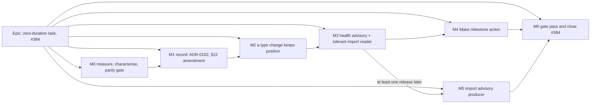

# Implementation Plan: A zero-duration task keeps its date, is reported, and converts without moving the schedule

- **Feature spec:** [./feature-spec.md](./feature-spec.md)
- **Agreement round:** [./agreement-round.md](./agreement-round.md)
- **Status:** Approved — agreement round complete 2026-09-26 (see agreement-round.md); product owner delegated the open questions
- **Owner:** product owner (approval); build by Claude Code sessions

## Breakdown

### Epic

**Zero-duration task (#384)** — keep the task's date rule (decision 1), tell the planner about
zero-duration tasks (decision 2a/2b), give them a conversion that never moves the schedule
(decision 2c), and correct the record (decision 3). Fixes `#387` on the way (spec D9). Roadmap theme:
finish-milestone dating (ADR-0155's line in `docs/ROADMAP.md`).

**Standing rules for every milestone.**

- **Parity (FC-1), gated.** From M0-T7 onward, `pnpm check:engine-parity` enforces it in prepush and
  CI: no non-test file under `apps/api/src/modules/schedule/engine/` changes, and no existing
  `engine/*.spec.ts` changes anything but its comments. The ADR-0034 golden suite passes unedited.
- **No schema change.** If any task finds it needs a model, column, index, constraint or data
  migration, the task **stops** and `database-architect` is run (CLAUDE.md §19.3). Deciding it is too
  small is the judgement the agent exists to make.
- **No `VITE_` flag** (ADR-0088 D1). Rollback is the commit boundary.
- **Pre-push gate is run** (`pnpm prepush`, plus `scripts/e2e-local.sh api` for `apps/api` changes and
  `scripts/e2e-local.sh web:<suite>` for each journey touched), and **every journey** after a label or
  layout change (CLAUDE.md §19.8, ADR-0091's finding).
- **Every new gate is verified red** against the defect it names before it is trusted (ADR-0110 D5).
- **No unqualified "nothing moved"** in any copy, docblock or ADR sentence (U1): name what is
  unchanged (the instant, successors, float, every other date).
- **Every user-visible milestone carries a changeset** (CLAUDE.md §10), named in its last step.

---

### Milestone M0: measure, characterise, and gate parity (shippable slice)

**Outcome:** the numbers and the engine facts the rest of the plan relies on are measured, not read,
and FC-1 is enforced by a gate before any later milestone can break it.
**Entry point:** `Ships dark: tests, a harness, a root gate and two staff-diagnostic registry entries.
The staff entries are reachable from the existing Diagnostics panel on /staff (its existing "Run"
control), which is an operator surface; no planner surface changes.`
**Journey:** none new. The staff console's existing journey covers the panel; the two entries add
rows to it (M0-T4 asserts they render).

#### Feature: M0 evidence

> **Description:** settle every "read, not run" verdict in the spec's evidence table.
> **Complexity:** M
> **Dependencies:** none
> **Risks:** a finding contradicts the design → the plan is amended in the same commit as the
> finding, and the product owner is told before M2 starts.
> **Testing requirements:** each characterisation case is written to fail against a stated wrong
> implementation first.

##### M0-T1 — Population harness (≈ one PR)

- **Description:** count zero-duration `TASK`s (and, separately, zero-duration `RESOURCE_DEPENDENT`,
  `LEVEL_OF_EFFORT`, `WBS_SUMMARY` and `HAMMOCK` rows) in every `SeedSpec` the catalogue builds, and in
  what `importSchedule` produces for every XER and MSPDI fixture in `packages/interchange` and
  `packages/engine-conformance/fixtures`. For each zero-duration `TASK`: has an assignment, is placed,
  has a constraint or external date, has a predecessor, carries the project finish, and whether any of
  its stored dates is a Monday (FC-3's shape).
- **Complexity:** S
- **Dependencies:** none
- **Risks:** the harness reads persisted rows and so reuses the code under question → it builds from
  `SeedSpec`s and from the pure `importSchedule` output only (the ADR-0066 rule).
- **Testing:** the harness's own control: it must find `A7550` and `N6` (spec E15), or it throws.
- **Development steps:**
  1. Write `scripts/measure-zero-duration.mts` (pure; no database).
  2. Record `docs/specs/zero-duration-task/m0-measurement.md`: the table, and a verdict on the
     spec's defaults (the action offers `TASK` only; single-activity only). A non-zero
     `RESOURCE_DEPENDENT` count becomes a `docs/TECH_DEBT.md` row.

##### M0-T2 — Engine characterisation (new file)

- **Description:** a new `compute.zero-task-date.spec.ts` that pins, without changing the engine:
  (a) an FS-reached and an SS-reached zero-duration task at the same instant have identical
  offsets, floats and dates (spec E3); (b) applying `finishMilestoneDisplayIndex` to the SS-reached
  task's offset gives Friday, i.e. the rejected rule misdates it, and at the data date the floor
  holds (E3); (c) for each of the five date fields and on four calendars (Mon–Fri full days, an
  8-hour intraday shift, 24-hour, and Mon–Fri with a dated non-working Monday exception), a
  zero-duration `TASK` at date D and a `FINISH_MILESTONE` at D−1 (the previous **calendar** day)
  produce the same instants, offsets and successor dates (E17), and likewise `START_MILESTONE` at D;
  (d) with D a Monday on the Mon–Fri calendar, a `FINISH_MILESTONE` at the previous **working** day
  (Friday) gives the **same** instant as the `TASK` at D — pinned deliberately, so the suite records
  why an instant comparison cannot tell a calendar-day shift from a working-day shift (spec E34), and
  the discrimination is left to FC-3's stored-value cases.
- **Complexity:** S
- **Dependencies:** none
- **Risks:** a case passes for the wrong reason (both sides unset) → every case asserts the field
  reached the engine (a control where D and D−1 differ must give different instants). Why four
  calendars suffice is written in the file's docblock: the working-time port branches on whether a
  minute is non-working, never on why, so weekend, shift gap and exception reach the same branch; the
  exception case shows that rather than asserting it.
- **Testing:** verified red by swapping D−1 for D in (c).
- **Development steps:**
  1. Write the file. Do not edit `compute.zero-task.spec.ts` or `compute.finish-milestone.spec.ts`
     here (M1 edits only a docblock). The new file is exempt from `check:engine-parity` limb 2 because
     it does not exist at the merge base.
  2. Record the results in `m0-measurement.md`.

##### M0-T3 — The latent editor defect, reproduced through the API

- **Description:** an API e2e (`apps/api/test/zero-duration-type-change.e2e-spec.ts`) that places a
  zero-duration `TASK` after a Friday-ending task, sets an SNET on it, gives it a successor,
  recalculates, then `PATCH`es `{version, type: 'FINISH_MILESTONE'}` and recalculates again. Today it
  should show the milestone's instant and its successor moving one working day later (spec E18). Also
  the `START_MILESTONE → FINISH_MILESTONE` variant. This Friday/Monday fixture is reused by FC-3's
  undo case (M4-T3). A second, separate characterisation case records a pre-existing gap found while
  answering P1 (spec E29): a `PATCH {type: 'TASK'}` on a `WBS_SUMMARY` that has a child is accepted
  today.
- **Complexity:** S
- **Dependencies:** none
- **Risks:** it passes today (the defect is not there) → then E18 is withdrawn in the spec and M2
  becomes a documentation change only. Either outcome is recorded.
- **Testing:** this case is written as M2's acceptance test with the expectation **inverted**
  (`it.fails` or a clearly named characterisation), so M2 flips one line. The summary case is a
  plain characterisation and is **not** flipped by this epic.
- **Development steps:**
  1. Write the case on a Mon–Fri calendar (a new plan takes the organisation's default, which is
     Mon–Fri: ADR-0155 "Corrections recorded").
  2. Run `scripts/e2e-local.sh api`. Record the reading.
  3. File a `docs/TECH_DEBT.md` row, status `open`: `update()` guards no structural type change into
     or out of `WBS_SUMMARY` (a summary with children, or an activity with dependencies), against
     ADR-0038's invariants. It is not this epic's to fix.

##### M0-T4 — Two staff diagnostics

- **Description:** registry entries `zero-duration-tasks` (unit `activity`; denominator: live `TASK`
  activities in live plans; numerator: those with `duration_minutes = 0`) and
  `zero-duration-tasks-resourced` (denominator: the zero-duration tasks; numerator: those with a live
  resource assignment). `nature: 'prospective'`. Both ids are added to `DIAGNOSTIC_IDS`
  (`staff-diagnostics.registry.ts:24`). "Live assignment" is spec FC-10's predicate:
  `ra.deleted_at IS NULL AND r.deleted_at IS NULL`, joined through a live activity in a live plan.
- **Complexity:** S
- **Dependencies:** none
- **Risks:** ADR-0140's "no query whose cost is unknown ships" → measured on the 102,000-activity
  diluted estate (`docs/specs/staff-diagnostics-panel/m0-measurements.md`'s harness) before merge;
  the resourced one uses a join with `count(DISTINCT …)`, never `EXISTS` (gate S-4).
- **Testing:** the registry's existing gates (S-1…S-5) pass unedited; the repository spec asserts
  the two counts on a fixture plan that includes a soft-deleted assignment and an assignment to a
  soft-deleted resource (neither counted). FC-10's three-way agreement is completed in M4-T1.
- **Development steps:**
  1. Add both entries and ids with docblocks stating what a count means and what it does not.
  2. Measure; record in the entries' docblocks.
  3. Changeset (minor: api).
  4. After release, the product owner presses Run on the deployed host; the figures go into
     `m0-measurement.md`. **Nothing else waits for this reading**; it sizes only the bulk-conversion
     default.

##### M0-T5 — Selection-bar width

- **Description:** measure the foot row at 1920, 1646 and 1440 with a zero-duration task selected,
  for the candidate labels `Make milestone…`, `Make milestone`, `Milestone…`, using the existing
  `measure-toolbar` harness.
- **Complexity:** S
- **Dependencies:** none
- **Risks:** every candidate wraps at 1646 → the item takes the shortest label that fits, and if none
  does, the product owner is shown the number (FC-6). A shortened visible label keeps the verb in the
  accessible name ("Make milestone…"), which contains the visible text (WCAG 2.5.3, the
  `zoom-to-selection` lesson).
- **Testing:** the harness's recorded output.
- **Development steps:**
  1. Add a scenario beside `apps/web/measure-toolbar/m-f-foot-row.spec.ts` (the harness that
     measured `clear-visual-placement`, `selection-actions.tsx:793`) that selects a zero-duration
     task with the item registered.
  2. Record in `m0-measurement.md`; pick the label, and record where a shorter bar label is decided
     if the table menu keeps the long one.

##### M0-T6 — Close the catalogue drift

- **Description:** add the `Z` activity that `capability-types-and-wbs` describes but does not contain
  (spec E16): a zero-duration `TASK`, FS after `T2`, assigned `TW_CREW`. It is the catalogue's first
  resourced zero-duration task and M4's shading witness.
- **Complexity:** S
- **Dependencies:** none
- **Risks:** a test counts that plan's activities → run the seed, playbook and API e2e suites; fix a
  count only if it is a count of this plan.
- **Testing:** `pnpm check:playbook`; `docs/TEST_PLAYBOOK.md` gains the row.
- **Development steps:**
  1. Edit `apps/seed-cli/src/capabilities/types-wbs.ts`.
  2. Update the playbook row (what it proves; what wrong looks like).

#### Feature: the engine-parity gate (spec D10)

> **Description:** turn FC-1 from a sentence in a PR description into a root gate that expires with
> its epic. A new shared gate is an ADR-0105 full-spec trigger; the spec's D10 is its spec.
> **Complexity:** S
> **Dependencies:** none; lands before M1 so M1's docblock edit is the gate's first real, green run.
> **Risks:** see the task.
> **Testing requirements:** the gate's own `.test.mjs` over fixtures, every limb verified red.

##### M0-T7 — `check:engine-parity`

- **Description:** `scripts/check-engine-parity.mjs [baseRef]` (default `origin/main`), its
  declaration `scripts/engine-parity.json`
  (`{ "active": true, "epic": "zero-duration-task", "debtRow": 384 }`), a comment stripper
  `scripts/lib/strip-comments.mjs` (a port of `stripComments`,
  `apps/api/src/common/contracts/cost-key-scan.ts:31-33`, because a root `.mjs` gate cannot import a
  TypeScript module), and the root script `"check:engine-parity"` in `package.json`. The three limbs
  are spec D10's: a non-test engine file differs from the merge base; an engine spec that exists at the
  merge base differs in comment-stripped content; the declared debt row is no longer an open detailed
  row in `docs/TECH_DEBT.md` (read with `scripts/lib/doc-register.mjs`). Inactive: prints "skipped"
  and exits 0. A base ref that cannot be diffed fails loudly, as `check:frontend-only` does
  (`check-frontend-only.mjs:104-110`).
- **Complexity:** S
- **Dependencies:** none
- **Risks:**
  - **The declaration goes stale** (`docs/TECH_DEBT.md` #194's failure in `check:frontend-only`) →
    limb 3 makes the stale state a failure with its own message, and M6 deactivates it in the commit
    that closes #384.
  - **The stripper's blind spot**: `//` inside a string literal is read as a comment, so an edit after
    `//` in a string is invisible. Stated in the stripper's docblock rather than fixed; the two copies
    (TS and `.mjs`) keep the same two regexes so they fail the same way.
  - **A gate that cannot fail** → a pinned positive case: an active declaration over a fixture diff
    with no engine change must report "checked N files", never "skipped".
- **Testing:** `scripts/check-engine-parity.test.mjs` over fixture diffs. Verified red, each against a
  named mutation: (1) an `expect` value changed in the same commit as a docblock edit (the reviewer's
  case) — must fail, naming the file; (2) a docblock-only edit — must pass; (3) a one-character change
  to a non-test engine file — must fail; (4) the declared row absent from a fixture register — must
  fail with the stale-declaration message; (5) a new engine spec file — must pass.
- **Development steps:**
  1. Stripper, script, declaration, test.
  2. Add a CI step to the `quality` job directly after "Check the frontend-only boundary"
     (`ci.yml:147-148`), which already has `fetch-depth: 0` and fetches `main` (`ci.yml:25-32`,
     `:145`). `scripts/ci-roster.json` stays `exempt: {}`: the CI step is what satisfies
     `check:ci-roster`. Confirm `check:ci-roster` refuses the commit with the `package.json` script and
     no CI step, then passes with the step.
  3. `pnpm prepush` derives the gate from `package.json`; confirm it appears there.

---

### Milestone M1: record the decision

**Outcome:** the repository says what the product owner decided, and stops saying something false.
**Entry point:** `Ships dark: documents only.`
**Journey:** none.

#### Feature: ADR-0162 and the §22 amendment

> **Description:** file the ADR, amend §22, correct the docblock, rewrite #384.
> **Complexity:** S
> **Dependencies:** M0 (its readings are cited)
> **Risks:** the ADR number is taken → check `docs/adr/` and the `#385` spec at filing time.
> **Testing requirements:** `pnpm check:adr-coverage`, `check:spec-status`, `check:doc-links`,
> `check:counts`, `check:debt-status`, `check:engine-parity`.

##### M1-T1 — File ADR-0162

- **Description:** the outline in spec §4 "ADR", with M0's figures, including D3's type table, D8–D10
  and the corrections list.
- **Complexity:** S
- **Dependencies:** M0
- **Risks:** stating the glyph move (spec E23) as "the bar does not move" → the ADR defines position
  as the instant and says the glyph moves across a gap.
- **Testing:** register gates above.
- **Development steps:**
  1. Write `docs/adr/0162-….md` (Status: Proposed; decisions accept per milestone).
  2. Add the CLAUDE.md §16 entry, the `docs/adr/README.md` row and a `docs/ROADMAP.md` entry.

##### M1-T2 — Amend ADR-0035 §22 and fix the docblock

- **Description:** a "§22 amendment" blockquote under `0035-…md:173-174` (the §7 amendment precedent
  at `:103`): a zero-duration `TASK` is dated by the day its instant opens, and ADR-0162 says why.
  In `compute.zero-task.spec.ts:13-22`, replace the "date-neutral" sentence with the true one.
  **Comments only** in that file (FC-1).
- **Complexity:** S
- **Dependencies:** M1-T1
- **Risks:** none beyond FC-1.
- **Testing:** `pnpm check:engine-parity` passes on this commit (limb 2 sees a comment-only change) —
  the gate's first real green run.
- **Development steps:**
  1. Edit both.
  2. Rewrite `docs/TECH_DEBT.md` #384's body to the decision and the milestone list; keep it `open`
     (the gate's limb 3 reads it).

---

### Milestone M2: a type change keeps position

**Outcome:** changing a zero-duration activity's type in the editor no longer moves its instant or
its successors (spec US-4, D3).
**Entry point:** the activity editor's **Type** field (Work section), then **Save** on the General
tab.
**Journey:** `apps/web/e2e-workspace-chrome/zero-duration.spec.ts`, first step: open the editor on a
placed, constrained zero-duration task, change Type to Finish milestone, save, and read the row and
its successor back through the API (instant unchanged, dates re-expressed).

#### Feature: the server rule

> **Description:** D3 in `ActivitiesService.update`, before the N26 check.
> **Complexity:** M
> **Dependencies:** M0-T3
> **Risks:** see tasks.
> **Testing requirements:** unit, API e2e (FC-2 on three calendars plus an exception day), journey
> step.

##### M2-T1 — Re-express unsent dates on a convention change, then check N26

- **Description:** one pure function, `reexpressZeroDurationDates(existing, dto)`, beside the service.
  It applies only when `dto.type` is sent and differs from `existing.type`, the **stored**
  `durationMinutes` is 0, and `convention(existing.type) ≠ convention(dto.type)`, for every
  `ActivityType` (spec D3's table). It returns, for each stored (non-null), unsent field of
  `visualStart`, `constraintDate`, `secondaryConstraintDate`, `externalEarlyStart`,
  `externalLateFinish`, the value one **calendar** day earlier (into `FINISH_MILESTONE`) or later (out
  of it). A sent field, including an explicit `null`, is untouched. `expectedFinish` is untouched.
  **Placement in `update()`:** it runs directly after the key-presence pair checks
  (`activities.service.ts:447-461`), and its results are merged into `patch`; the N26 effective pair
  (`:498-510`) is then resolved from the sent value, else the re-expressed value, else the stored
  value, so the check validates what will be persisted (S1).
- **Complexity:** M
- **Dependencies:** M0-T2, M0-T3
- **Risks:**
  - **R1: the rule silently rewrites dates a client did not send.** That is the point, and it is a
    contract change → the OpenAPI `type` description and `docs/API.md` state it; api-reviewer reviews
    it before merge.
  - **R3: the convention table drifts from the engine.** The engine's four `FINISH_MILESTONE`
    branches (`constraints.ts:119`, `:244`, `:272`; `compute.ts:343`) are the definition. A structural
    test lists them and fails if a fifth appears in `engine/` that the function does not cover.
  - **R8: N26 validated on the wrong pair** (S1). Fixed by the placement above. Note for review: the
    constraint-date pairs have **no** value-ordering check at the API (only key presence,
    `:447-461`), so N26 is specific to the external pair and nothing else needs the same treatment.
  - **R9: a type that is not `TASK` or `START_MILESTONE`.** The rule applies to all of them; FC-2 is
    claimed for `TASK`, `START_MILESTONE` and `HAMMOCK` only. The other three are characterised, not
    guaranteed (spec D3).
- **Testing (unit, each case its own row):**
  - Every field × direction × sent/unsent.
  - **Null stored field is a no-op**, one row for each of the five fields.
  - **Explicit `null` sent** clears and is not re-expressed.
  - Stored duration non-zero ⇒ no-op; same-convention change (`TASK ↔ START_MILESTONE`) ⇒ no-op; type
    not sent, or sent equal to the stored type ⇒ no-op.
  - **Monday − 1 = Sunday**, never Friday, and a stored **Sunday** round-trips to Sunday, not Monday
    (spec E34, FC-3). Both verified red against a working-day shift, which passes every
    instant-based and every working-day round-trip case.
  - **Same-request duration change**: `PATCH {type: 'TASK', durationDays: 5}` on a stored
    `FINISH_MILESTONE` re-expresses (keys on the stored duration). Verified red against a check on the
    post-patch duration.
  - **Type coverage**: zero-duration `RESOURCE_DEPENDENT → FINISH_MILESTONE` (the accepted exception:
    the rule applies, and the case's name says FC-2 is not claimed), `LEVEL_OF_EFFORT → FINISH_MILESTONE`,
    `WBS_SUMMARY → FINISH_MILESTONE`, `HAMMOCK → FINISH_MILESTONE`, and each reverse. All are reachable
    through the API; LOE, summary and resource-dependent are also offered by the editor
    (`activity-schemas.ts:145-149`).
- **Testing (API e2e):**
  - M0-T3's case flipped, plus FC-2 on three calendars and the exception day, **verified red** by
    disabling the function. Every other activity's persisted rows compared before and after.
  - **N26, both directions, exactly one of the pair sent**, verified red against today's ordering:
    (a) a `TASK` with duration 0 and early = late = 2026-01-10, `PATCH {type: FINISH_MILESTONE,
externalEarlyStart: '2026-01-10'}` → 422 `EXTERNAL_FINISH_BEFORE_START` (today: the DB CHECK, a
    500, spec E26); (b) a `TASK` with duration 0, early 2026-01-10 and late 2026-01-12,
    `PATCH {type: FINISH_MILESTONE, externalLateFinish: '2026-01-09'}` → 200 with early 2026-01-09
    and late 2026-01-09 (today: over-rejected with 422).
  - One `RESOURCE_DEPENDENT` characterisation through the real engine: re-expressed, and the instant
    is reported rather than asserted equal.
  - **FC-3 (b)**: a placement stored on a Sunday converts and converts back to the Sunday.
- **Development steps:**
  1. Write the function and its unit suite.
  2. Wire it into `update` at the stated point; re-point the N26 resolution.
  3. Flip M0-T3; add the three-calendar matrix, the exception day and the two N26 cases.
  4. OpenAPI description; `docs/API.md`.

##### M2-T2 — The editor hint and the re-seed

- **Description:** under the Type field, when the stored duration is 0 and the selected type crosses
  the convention: "Its dates will be re-expressed so it keeps the same point in the schedule; its
  successors and float are unchanged. A finish milestone reads its dates as the end of the day and is
  drawn there." After a General save that changed the type, non-dirty scopes re-seed from the
  response.
- **Complexity:** S
- **Dependencies:** M2-T1
- **Risks:** **R2: a dirty Scheduling tab holds dates typed under the old type.** Saving them sends
  them, and D3 reads them in the new convention (by design: a date you send means what the new type
  says). The hint states it; the unsaved-work guard (ADR-0108) already names the dirty scope. Recorded,
  not engineered around.
- **Testing:** component test for the hint's presence and absence; a test that a non-dirty Scheduling
  form shows the re-expressed date after the General save; the journey step.
- **Development steps:**
  1. `ActivityWorkFields` hint (host passes the stored duration and type; ADR-0089 D2b).
  2. Re-seed test; fix if it fails.
  3. Journey step. Changeset (minor: api, for the `PATCH` contract change; patch: web).

---

### Milestone M3: the health advisory, and a tolerant import reader

**Outcome:** the health check lists zero-duration tasks (US-1). The import report's readers tolerate an
unknown field (closing `#387`) and can show an advisory, though nothing produces one yet.
**Entry point:** `Analysis ▾ ▸ Health check…` on the command deck, then the docked panel's section
**Beyond the DCMA assessment**, row **Zero-duration tasks**. The import reader:
`Ships dark: no producer until M5`.
**Journey:** extend `apps/web/e2e-health-check/health-check.spec.ts`: open the dock on a plan with a
zero-duration task, expand the row, activate the offender, assert it is selected. The existing
fourteen-row count is scoped to the metrics list (M3-T2).

#### Feature: health advisory

> **Description:** spec D1.
> **Complexity:** M
> **Dependencies:** M1
> **Risks:** see tasks.
> **Testing requirements:** extraction parity, totality, gates G1/G2/G4, service query count, panel
> and print, axe, journey.

##### M3-T0 — Extract the offender disclosure and the offender print section (C2)

- **Description:** before any advisory code, extract `HealthOffenderDisclosure` from `HealthMetricRow`
  (`ScheduleHealthPanel.tsx:286-437`: the toggle button with `aria-expanded`/`aria-controls`, the
  truncation line and the offender `<ul>`) and `HealthOffenderPrintSection` from
  `HealthPrintDocument.tsx:121-144` (heading, cap sentence, offender `<ul>`). Neither takes a verdict:
  the disclosure takes the row's name, a trailing slot (the metric's verdict badge, or the advisory's
  count), an optional `aria-describedby` id, the offenders, their count, the truncation flag, the cap
  and the activation callback. The fourteen metrics consume both **unchanged in behaviour**. Both carry
  explicit `role="list"` / `role="listitem"` (A3).
- **Complexity:** S
- **Dependencies:** M1
- **Risks:** the extraction changes a metric's behaviour → the existing `ScheduleHealthPanel` and
  `HealthPrintDocument` suites are the before/after oracle and pass **unedited**.
- **Testing:** the existing suites unedited; one new case each asserting the explicit list roles.
- **Development steps:**
  1. Extract; re-point `HealthMetricRow` and the print loop.
  2. Run both suites unchanged.

##### M3-T1 — Types, the count loader and the pure evaluator

- **Description:** `HEALTH_ADVISORY_IDS`, `HealthAdvisoryResult` and `ScheduleHealthReport.advisories`
  in `@repo/types`; `isZeroDurationTask(type, durationMinutes)` there too, as the one predicate.
  `loadHealthAssignedActivityIds` (`schedule.repository.ts:544-559`) becomes
  `loadHealthAssignmentCounts`, returning `Map<activityId, number>` from **the same query** (it
  already fetches one row per live assignment; the count is taken in memory), and its `where` spreads
  the shared `liveAssignmentWhere(organizationId)` (spec D8, FC-10). The service maps each activity to
  `hasAssignment: count > 0` (metric 10, unchanged) and `assignmentCount: count` (the advisory), at the
  one construction site (`schedule.service.ts:992`), with a unit case pinning the two agree. In
  `compute-health.ts`, an evaluator over the non-summary activities; offender note "no resource
  assignment" (metric 10's phrase, `compute-health.ts:472`), "1 resource assignment" or "N resource
  assignments"; `detail.resourced` counts the offenders with a non-zero count; the existing offender
  cap. The wire DTO lands in `apps/api/src/modules/schedule/dto/plan-health-check.dto.ts` (G4 scans
  it) and implements the `@repo/types` interface, with the OpenAPI enum derived from the tuple.
- **Complexity:** S
- **Dependencies:** M1
- **Risks:**
  - The advisory leaks into `summary` or `metrics` → FC-4 assertions: `metrics.length === 14`, ids
    unchanged, summary unchanged on a fixture with and without zero-duration tasks.
  - The fixture helper (`health/health-fixtures.ts:38`) gains `assignmentCount`, defaulted from
    `hasAssignment` when not given, so the totality suite (`compute-health.totality.spec.ts:38`) and
    the definition suite pass **unedited**.
  - A `ScheduleHealthReport` literal in a web test (for example
    `schedule-health-vocabulary.structural.test.ts:105-130`) gains `advisories: []` because the
    compiler requires it; no assertion changes (FC-4).
- **Testing:**
  - An advisory totality suite (always present, in tuple order, shape by case).
  - **G1/G2** in `apps/web/src/features/schedule-health/schedule-health-vocabulary.structural.test.ts:34-68`
    get an explicit edit: `HEALTH_ADVISORY_IDS` disjoint from the conflict keys **and** from
    `HEALTH_METRIC_IDS`, with its own non-empty positive half. **G4** needs no edit; confirm it scans
    the new DTO and fails on a planted cost-shaped key in it.
  - The engine-free import ban still passes.
  - A service spy asserts FC-7 (same query count).
  - `healthAnnouncement()` (`model/health-rows.ts:201-204`) gets its exact sentence pinned **before**
    M3-T2: "… informational. Beyond the DCMA assessment: 3 zero-duration tasks." at 3, "1
    zero-duration task" at 1, "no zero-duration tasks" at 0, and nothing appended when `advisories` is
    absent (spec E32).
- **Development steps:**
  1. Types; loader; evaluator; DTO.
  2. Tests above, each gate verified red once.

##### M3-T2 — Panel and print

- **Description:** a `<section>` with its own heading, "Beyond the DCMA assessment", after the metrics
  list in `ScheduleHealthPanel` and after the fourteen rows in `HealthPrintDocument`, never an item in
  the metrics `<ul>`. It consumes M3-T0's two components and the jump seam (`healthRevealId`). The row
  shows the count, the denominator and the resourced figure ("3 zero-duration tasks; 1 has resource
  assignments"), and "None" at zero. The section ends, on screen and on paper, with: "Found from
  stored durations, whether or not the plan has been calculated, and not part of the DCMA assessment
  above." The metrics `<ul>` (`ScheduleHealthPanel.tsx:253`) gains `role="list"` and the accessible
  name "DCMA metrics"; the print document's other lists (`HealthPrintDocument.tsx:86`, `:109`) gain
  explicit roles too (A3). Paper prints the offender list the report carries and states the cap when
  truncated, exactly as the metrics do (spec E33).
- **Complexity:** M
- **Dependencies:** M3-T0, M3-T1
- **Risks:**
  - The live announcement drops the new section (ADR-0116 M5's finding) → M3-T1 pinned it; this task
    wires it.
  - **Version skew** (spec E32): a new bundle against an API without `advisories` → the panel reads
    `advisories` defensively (absent ⇒ the section is not rendered); a component case covers it.
  - `e2e-health-check`'s `panel.getByRole('listitem')` count of 14
    (`health-check.spec.ts:45-46`) would read 15 once the section's row exists → scope it to
    `getByRole('list', { name: 'DCMA metrics' })`, and add a separate assertion that the advisory
    section is present.
- **Testing:** component tests (with, without and absent `advisories`; explicit roles); axe on a
  mixed report with the row expanded; the journey step.
- **Development steps:**
  1. Panel; print.
  2. Journey step in `e2e-health-check`, with the scoped count.
  3. Changeset (minor: api, for the `advisories` field on a public response; minor: web, for the
     section).

#### Feature: a tolerant import report reader (closes `#387`)

##### M3-T3 — The report's readers strip unknown keys (spec D9)

- **Description:** in `packages/interchange/src/report.ts`, build the report schema once from one
  field list in two modes: `interchangeReportSchema` (exported for readers) strips unknown keys at
  every object level — top level (`:114-133`), `mapped` (`:50-71`), each finding (`:29-41`) and each
  resource collision (`:91-110`) — and `interchangeReportStrictSchema` keeps today's `.strict()`
  behaviour. The package's producer suites (`import-xer.spec.ts:70`, `:616`;
  `import-mspdi.spec.ts:93`) switch to the strict schema, so an undeclared key a producer emits still
  fails where the producer lives. The commit envelope (`apps/web/src/features/interchange/api/use-interchange.ts:109-111`)
  strips too. The export header parse (`use-export-plan.ts:90`) inherits it.
- **Complexity:** S
- **Dependencies:** none
- **Risks:**
  - A known key's validation weakens → `canonical.spec.ts:158-162` (an unknown finding kind is
    rejected) passes unedited, and a new case asserts a mistyped known key (`mapped.activities: -1`)
    is still rejected by the tolerant schema.
  - The two modes drift → both are built by one function over one field list; a case asserts they
    accept the same set of reports without extra keys.
- **Testing:** `packages/interchange/src/report.spec.ts` (both modes) and
  `apps/web/src/features/interchange/api/report-tolerance.test.ts`, which drives all three parse
  sites with a report carrying an extra key at the top level, inside `mapped`, inside a finding and
  inside a collision. It asserts acceptance, that the extra keys are stripped, and that every known
  field survives. **Verified red**: run first against today's `.strict()` schema, where every site
  rejects.
- **Development steps:**
  1. Schema; envelope; tests, red first.
  2. Docs: close `docs/TECH_DEBT.md` #387 and ledger it, with the resolution "the readers strip
     unknown keys at every level of the report and validate known keys strictly (ADR-0162 D9); the
     producer's own tests keep a strict schema; after the release that ships this reader, a new
     report field needs no release ordering". Correct `docs/specs/layout-interchange/feature-spec.md`'s
     statement that the report schemas are `.strict()` only if it is phrased as present fact.
  3. Changeset (minor: web; minor: `@repo/interchange` if versioned).

##### M3-T4 — `advisories` on the schema and the dialog group

- **Description:** `advisories?` on the report schema (both modes; absent when empty) and an
  "Advisories" group in the import review dialog. `InterchangeReportTable`'s lists
  (`InterchangeReportTable.tsx:87`) gain explicit roles (A3). Nothing produces the key yet.
- **Complexity:** S
- **Dependencies:** M3-T3
- **Risks:** a producer merged in the same release breaks a browser tab from **before** M3, which
  still carries the strict schema → the producer is M5, at least one release later, which the
  milestone order gives (M4 releases in between). This is needed once: after M3's release no later
  field needs it (spec D9).
- **Testing:** schema accepts a report with and without the key; dialog renders the group from a
  fixture; a report without the key renders byte-identically (FC-5 (a)).
- **Development steps:**
  1. Schema; dialog; tests.
  2. Changeset (minor: web).

---

### Milestone M4: Make milestone

**Outcome:** a planner turns an unresourced zero-duration task into a milestone in one action, without
moving its instant, its successors or any other date, and can undo it (US-3).
**Entry point:** the selection bar (canvas dock and Gantt), item **Make milestone…** (label per
M0-T5); the Gantt row menu and the activities table's row menu offer the same item.
**Journey:** `apps/web/e2e-workspace-chrome/zero-duration.spec.ts`: select the seeded task, press
**Make milestone…**, choose Finish, confirm; assert via the API the type, the re-expressed dates and
the successor unchanged; assert focus is on the canvas listbox with the activity as its active
descendant; using a task whose stored placement is a **Monday**, assert the placement read back after
conversion is the **Sunday** (FC-3 (a); a working-day shift would store the Friday and keep the
instant); press Ctrl+Z and assert the row is byte-identical to before. A second case selects the resourced `Z` and asserts the item is
shaded with its reason. A Gantt case in `e2e-gantt-editing/object-actions-reach.spec.ts` reaches the
item from the Gantt, converts, and asserts focus is on the activity's Gantt row.

#### Feature: the resourced fact

> **Description:** spec D8.
> **Complexity:** M
> **Dependencies:** M3-T1 (`liveAssignmentWhere`)
> **Risks:** see the task.
> **Testing requirements:** FC-9 measurement, unit, API e2e, FC-10 agreement.

##### M4-T1 — `resourceAssignmentCount` on every activity response

- **Description:** `ActivitySummary.resourceAssignmentCount: number` in `@repo/types`, the
  `ActivityResponseDto` field and its OpenAPI description, and one grouped query per call in the
  shared decoration step (`activities.service.ts:123-144`), beside the driving-calendar lookup it
  already makes: `resourceAssignment.groupBy({ by: ['activityId'], where: { activityId: { in: rowIds
}, ...liveAssignmentWhere(organizationId) }, _count: true })`. The web's assignment create and delete
  mutations (`use-resources.ts:388-404`, `:492-506`) add an invalidation of the plan's activities
  query (spec E28).
- **Complexity:** M
- **Dependencies:** M3-T1
- **Risks:**
  - **The query's cost** → FC-9 is measured first, with the conditions as committed in the spec, on
    the 102,000-activity diluted estate and on `scale-2000`, recorded in `m0-measurement.md`
    (section "M4-T1"). If (a), (b) or (c) fails, apply the spec's remedy ladder in order; never move a
    bar.
  - **A per-row query slips in** → FC-9 (d): a service spy asserts exactly one more query per
    activity read, on a 100-row page and on a one-row `get`.
  - **The guest view gains the field** → a case asserts `GuestActivityDto` has no such key.
  - **Every web test fixture that builds an `ActivitySummary` literal** gains the field because the
    compiler requires it; no assertion changes. Use the existing fixture helpers where they exist.
- **Testing:**
  - Unit: the decoration returns 0 for an activity with no assignment, N for N live ones, and ignores a
    soft-deleted assignment and an assignment to a soft-deleted resource.
  - API e2e: the list and `get` routes carry the field; a `PATCH` response carries it.
  - **FC-10 agreement** (API e2e): on one fixture, the activity field, the health advisory's offender
    count and the `zero-duration-tasks-resourced` diagnostic agree, with one live assignment, one
    soft-deleted assignment and one assignment to a soft-deleted resource present. Verified red by
    dropping the `resource.deletedAt` condition from one of the three.
  - Web: the create and delete assignment mutations invalidate the activities query (a query-client
    spy).
- **Development steps:**
  1. Measure (FC-9), record, decide.
  2. Types; DTO; query; invalidation; tests.
  3. Changeset (minor: api, a new response field).
  4. **Re-confirmation:** api-reviewer (the activity DTO changes) and backend-performance-reviewer
     (the query and its measurement) review this task before merge.

#### Feature: the action

> **Description:** spec D4–D6.
> **Complexity:** M
> **Dependencies:** M2 (the server rule), M3 (the health route to the object), M4-T1
> **Risks:** see tasks.
> **Testing requirements:** gate unit tests, identity pin, label pin, structural gates, dialog a11y,
> journey.

##### M4-T2 — One derivation, three surfaces

- **Description:** a pure `deriveMakeMilestoneGate(activity, definitionGate)` (spec D6) in
  `apps/web/src/features/plan-actions/`. `buildSelectionBarContext` gains a `definitionGate: ScopeGate`
  input, passed through untouched; both hosts (`TsldPanel.tsx:1744` and
  `plan-workspace-toolbar.tsx:1228-1285`) pass `model.activityEditorGating.general`. The
  selection-bar item `make-milestone` reads the derivation for `isVisible`, `isEnabled` and
  `disabledReason`, carries `penGated` and a `lostReason` (ADR-0135); the Gantt row menu inherits it.
  `ActivitiesTable.actionsFor` calls the same derivation with its `editorGating.general`. The label is
  `MAKE_MILESTONE_LABEL`, exported beside the item and imported by the table. When the gate is open,
  activating the item calls one workspace callback, `onMakeMilestone(activity)`; the successor focus
  is added by each host (M4-T3).
- **Complexity:** M
- **Dependencies:** M2, M3-T1 (the predicate), M4-T1
- **Risks:**
  - The table's hand-kept roster is forgotten (the "one control and not its neighbour" shape) → the
    identity test below, and the label pin.
  - `selection-duplication.structural.test.ts` → the item is on object surfaces only; the gate passes
    unedited.
  - **Two role sentences on one bar** (spec D6's residue): Edit says "Your role cannot change this
    activity.", Make milestone says "Your role cannot edit activity details." → file a
    `docs/TECH_DEBT.md` row, status `open`, to move the bar's other pen-gated items onto
    `activityEditorGating.general`; not done here, because it changes five shipped items' copy.
- **Testing:**
  - Gate unit tests: every branch, including omit for a non-zero task, a milestone and a summary;
    **pen/role wins over resourced** when both apply (the `GanttRowMenu.tsx:184-194` precedence).
  - **Identity**: the canvas bar context's gate, the Gantt context's gate and the table's gate are each
    `===` the model's `activityEditorGating.general`.
  - **Label pin** (structural): the registry item and the table action both use
    `MAKE_MILESTONE_LABEL`, and the table file contains no string literal equal to it. Verified red
    against a table that spells the label inline.
  - `lostReason` present (ADR-0135).
- **Development steps:**
  1. Derivation; context input; item; table entry.
  2. Tests.
  3. File the role-sentence register row.

##### M4-T3 — The dialog, the write, undo and focus

- **Description:** `MakeMilestoneDialog` (`Dialog` + `RadioCardGroup`), mounted once in the workspace
  and opened by `onMakeMilestone`. Preselection by `defaultMilestoneType(activityId, dependencies)`
  over the workspace's dependency list (spec D5). Option copy: Finish — "Dated by the day the work
  before it ends. A finish milestone is drawn at the end of its day, so after a weekend it appears on
  the Friday rather than the Monday. Its successors, float and every other date are unchanged." Start
  — "Keeps its date, {weekday date}." The project-finish sentence when applicable. Dates use
  `formatCanvasDate`'s new weekday form (`tsld/render/geometry.ts:414-419`), not a third format.
  **Focus before open** (spec D4's successor table): the canvas host focuses `listboxRef` first, as
  `openAutoArrange` does (`TsldPanel.tsx:2329-2335`); the Gantt host focuses the activity's row
  (`focusGanttGrid`, `plan-workspace-toolbar.tsx:1198-1202`, or that row directly from the row menu);
  the table relies on `Menu`'s restore to the row's trigger. **No focus call at confirm time.**
  Confirm: `beginLayoutEdit` → `PATCH {version, type}` → on success the dialog closes and the native
  restore returns focus to the successor → one Undo entry (inverse `PATCH {version, type: 'TASK'}`) →
  recalculation → **then** the announcement, read from the recalculated row: "{name} is now a finish
  milestone, dated {weekday date}. Its successors and float are unchanged." On failure the dialog
  stays open with a `NoticeStrip` (`role="alert"`) in its body, as `ArrangeDialog` does.
- **Complexity:** M
- **Dependencies:** M4-T2
- **Risks:**
  - **Focus falls to `<body>`** because the trigger unmounts (A1) → the successor is focused before
    `showModal()`, so the native restore never targets the trigger; asserted **in the journey**,
    since jsdom has no top layer (ADR-0149 D8).
  - **Announce before focus** (A2) → the announcement is emitted only after the recalculated row
    arrives, which is after the dialog closed and focus was restored (`use-focus-handoff.ts:54-61`'s
    order). A unit case asserts the announcer is not called before the dialog's close.
  - The ADR-0153 census refuses an `editHistory.record` outside `beginLayoutEdit` → it goes through
    it (the glyph's drawn span changes, spec E23).
  - Undo meets a stale version → ADR-0048's abort-and-refetch; covered by an existing test pattern.
  - **WCAG 2.5.8 is not covered by axe** for the dialog's controls (`target-size` is off in this
    repository's axe configuration, ADR-0090 M5), and the claim that `e2e-workspace-fit` already sweeps
    the selection-bar item is **wrong**: its sweep roots are the command deck, the plan header, the
    Project Explorer and the Gantt grid (`command-surface.spec.ts:754-755`, `:881-892`), not the dock.
    So the journey asserts the item's pointer target is at least 24 × 24 and pointer-reachable
    (`elementFromPoint`), and the dialog's radio cards and buttons likewise.
- **Testing:** dialog unit and axe (states: default, pending, error); the announcer-order case; the
  preselection predicate (with and without a predecessor); ADR-0153 census passes; the journey above,
  including the focus-target assertions for canvas and Gantt; accessibility-reviewer before merge (the
  dialog and the focus successor, CLAUDE.md §19.13).
- **Development steps:**
  1. `formatCanvasDate` weekday form and its test; dialog; host wiring; announcement copy.
  2. Journey; `scripts/e2e-local.sh web:workspace-chrome` and `web:gantt-editing`, then every journey.
  3. Changeset (minor: web).

---

### Milestone M5: the import advisory

**Outcome:** an import names each activity that arrived as a zero-duration task (US-2).
**Entry point:** the import dry-run review dialog (Import → choose a file), group **Advisories**.
**Journey:** extend `apps/web/e2e-interchange/interchange.spec.ts`: import a fixture XER containing a
zero-hour `TT_Task`, assert the Advisories group names its code, commit, open the plan's health check
and see the same activity listed.

#### Feature: the producer

> **Description:** spec D2.
> **Complexity:** S
> **Dependencies:** M3-T3 and M3-T4 **released** at least one release earlier (spec D9: needed once,
> for browser tabs from before M3; the milestone order gives it, with M4 released in between)
> **Risks:** the ordering is violated → the cost is one release of stale tabs from before M3 failing a
> dry-run, once; no later epic carries the hazard.
> **Testing requirements:** unit per format, census, additivity, journey.

##### M5-T1 — One producer, both orchestrators

- **Description:** `zeroDurationAdvisories(graph)` in `@repo/interchange`, using `isZeroDurationTask`,
  over the final (post-repair) import graph; called by `import-xer.ts` and `import-mspdi.ts`. Detail:
  "imported as a task with no duration; a zero-length event is usually a milestone — convert it after
  import". Never a finding kind (spec E12).
- **Complexity:** S
- **Dependencies:** M3-T3 and M3-T4 released
- **Risks:** one orchestrator forgets the call → a census test asserts both call it.
- **Testing:** XER and MSPDI unit cases (zero-hour `TT_Task`; zero-duration non-milestone MSPDI task;
  a milestone produces none; LOE/WBS produce none), each asserting against the **strict** schema;
  FC-5 (a) additivity on every existing fixture; the torture XER produces exactly `A7550`.
- **Development steps:**
  1. Producer; calls; tests.
  2. `docs/specs/…` mapping-contract table (ADR-0050) gains the advisory row.
  3. Journey; changeset (minor: api).

---

### Milestone M6: the gate pass, and closing #384

**Outcome:** the combined diff is reviewed and #384 is closed.
**Entry point:** `Ships dark: review and records.`
**Journey:** all journeys touched by M2–M5 re-run on the final tree.

##### M6-T1 — Specialist reviews over the combined diff

- **Description:** run **ux-reviewer**, **accessibility-reviewer**, **component-reviewer**,
  **api-reviewer**, **security-reviewer**, **test-engineer**, and **backend-performance-reviewer**
  (the activity-read count query, the health loader and the staff SQL). `database-architect` is
  **not** run, because the epic has no schema change; the PR says so in those words. Fold every
  blocking finding with a regression test verified red first; file the rest as a register row.
- **Complexity:** M
- **Dependencies:** M2–M5
- **Risks:** a finding reopens a milestone → reopen it; do not fold it into the last commit silently.
- **Development steps:**
  1. Reviews; folds; register rows.
  2. ADR-0162 → Accepted; spec and plan headers → `Accepted — shipped (ADR-0162)`.
  3. `docs/TECH_DEBT.md` #384 closed and ledgered, and **in the same commit**
     `scripts/engine-parity.json` set `active: false` (otherwise `check:engine-parity` limb 3 fails,
     which is its purpose). Confirm #387 was closed and ledgered in M3-T3. CLAUDE.md §16 entry updated.

## Sequencing & slices

| Order | Slice | Releasable alone?                                                       | Rollback                                                            |
| ----- | ----- | ----------------------------------------------------------------------- | ------------------------------------------------------------------- |
| 1     | M0    | yes (tests, harness, a root gate, two staff entries, one seed activity) | revert commit                                                       |
| 2     | M1    | yes (docs)                                                              | revert commit                                                       |
| 3     | M2    | yes; fixes a latent defect on its own                                   | revert commit (the rule is stateless; no stored data depends on it) |
| 4     | M3    | yes; import reader is dark; closes #387                                 | revert commit                                                       |
| 5     | M4    | yes; needs M2                                                           | revert commit                                                       |
| 6     | M5    | **only after M3 is released** (once, spec D9)                           | revert commit                                                       |
| 7     | M6    | —                                                                       | —                                                                   |

No feature flag. Every slice keeps `main` releasable.

## Definition of Done (per task)

Each task's PR must satisfy the Feature Completion Criteria in [`docs/PROCESS.md`](../../PROCESS.md)
(code, tests, docs, security, performance, accessibility, Docker build, CI, changelog, version
impact), plus the epic's standing rules above. CI is read per CLAUDE.md §19.9 before merge.

## Risks & assumptions (rollup)

| Risk / assumption                                                                           | Likelihood                     | Impact  | Mitigation                                                                                                                      |
| ------------------------------------------------------------------------------------------- | ------------------------------ | ------- | ------------------------------------------------------------------------------------------------------------------------------- |
| R1: the `PATCH` rule rewrites dates a caller did not send                                   | certain (by design)            | med     | Documented in OpenAPI and `docs/API.md`; api-reviewer before M2 merges; CQ-1 answered (server).                                 |
| R2: a dirty Scheduling tab sends old-convention dates with a type change                    | low                            | low     | Hint under Type; ADR-0108 guard; recorded.                                                                                      |
| R3: the convention table drifts from the engine                                             | low                            | high    | Structural test over the engine's `FINISH_MILESTONE` branches (M2-T1).                                                          |
| R4: the glyph moves across a non-working gap and reads as "it moved"                        | med                            | low     | The dialog says a finish milestone is drawn at the end of its day; copy names what is unchanged (U1); ADR states the move.      |
| R5: import advisory producer ships before its reader is deployed                            | low                            | low     | The reader tolerates unknown keys (D9); the one remaining window (tabs from before M3) is covered by the milestone order, once. |
| R6: the selection bar wraps at 1646 for a zero-duration selection                           | med                            | low     | M0-T5 picks the label; FC-6.                                                                                                    |
| R7: converting changes EV, revision compare, project finish label or a cross-plan successor | certain in those cases         | low–med | Stated in the ADR; the project-finish case is stated in the dialog; cross-plan is `#385`.                                       |
| R8: N26 validated on the pre-rewrite pair                                                   | certain without the fix        | med     | Re-express before the check (M2-T1); both directions tested, red first.                                                         |
| R9: a converted LOE, summary or resource-dependent activity moves                           | certain in those cases         | low     | D3's table states FC-2 is not claimed for them; characterised in M2-T1.                                                         |
| R10: the activity-read count query costs more than FC-9 allows                              | low                            | med     | Measured before shipping (M4-T1); remedy ladder written in advance.                                                             |
| R11: `resourceAssignmentCount` is stale after an assignment edit                            | med without the fix            | low     | Assignment mutations invalidate the activities query (M4-T1); a peer's edit is covered by refetch and the error table.          |
| R12: the engine-parity declaration outlives the epic                                        | med (recorded twice elsewhere) | med     | Limb 3 fails when #384 is no longer open; M6 deactivates it in the closing commit.                                              |
| A1: zero-duration tasks are rare                                                            | —                              | —       | M0-T1 and M0-T4 measure; bulk conversion reopens at more than 20 in one import.                                                 |
| A2: the action does not offer `RESOURCE_DEPENDENT`                                          | —                              | —       | M0-T1 counts; a non-zero count becomes a register row. The server rule still covers it (D3).                                    |
| A3: ADR number 0162                                                                         | —                              | —       | Assumes `#385`'s spec takes 0161; check `docs/adr/` at filing.                                                                  |
