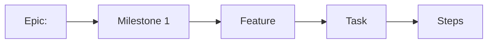

<!--
Implementation Plan template — Stage 5 of docs/PROCESS.md.
Produced AFTER the Feature Spec is approved. Copy to
docs/specs/<feature-slug>/implementation-plan.md, beside the approved spec —
not to docs/plans/, which is historical. Sequence work as thin vertical slices
that keep `main` releasable.
-->

# Implementation Plan: <Feature name>

- **Feature spec:** <link to the approved spec>
- **Status:** Draft | Approved | In progress | Done
- **Owner:** <name>

## Breakdown

### Epic

**<Epic name>** — <one-line initiative; roadmap theme it maps to>.

### Milestone: <name> (shippable slice)

**Outcome:** <what a user can do when this milestone ships>.
**Entry point:** <the control a planner presses to reach it — screen + accessible name>
— **or** `Ships dark: <why nothing is reachable yet, and which milestone surfaces it>`.
One of the two, never neither (ADR-0081 §1).
**Journey:** <the flag-on Playwright step that opens that surface and presses that
control — required on the first user-facing milestone, not deferred to enablement
(ADR-0081 §2)>.

---

#### Feature: <name>

> **Description:** <what this feature delivers>
> **Complexity:** S | M | L | XL
> **Dependencies:** <features/tasks/services that must land first>
> **Risks:** <risk → mitigation>
> **Testing requirements:** <unit / API / e2e / a11y; what proves it works>

##### Task 1 — <title> (≈ one PR)

- **Description:** <what changes>
- **Complexity:** S | M | L
- **Dependencies:** <task ids>
- **Risks:** <risk → mitigation>
- **Testing:** <tests to add/update>
- **Development steps:**
  1. <step>
  2. <step>
  3. <update docs / ADR / changeset>

##### Task 2 — <title>

- **Description:** …
- **Complexity:** …
- **Dependencies:** Task 1
- **Risks:** …
- **Testing:** …
- **Development steps:**
  1. …

_(repeat tasks; repeat features/milestones as needed)_

## Sequencing & slices

<Order of delivery. Each slice keeps `main` releasable and is independently
valuable/testable. Note any feature flags.>

## Definition of Done (per task)

Each task's PR must satisfy the Feature Completion Criteria in
[`docs/PROCESS.md`](../PROCESS.md) (code, tests, docs, security, performance,
accessibility, Docker build, CI, changelog, version impact).

## Risks & assumptions (rollup)

| Risk / assumption | Likelihood   | Impact       | Mitigation |
| ----------------- | ------------ | ------------ | ---------- |
| <…>               | low/med/high | low/med/high | <…>        |
