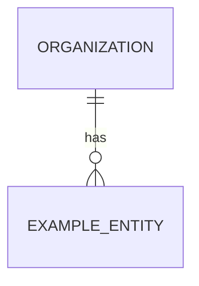

<!--
PROJECT BRIEF TEMPLATE — product-level context for an application built on this
base repository.

How to use:
  1. Copy this file to `docs/PROJECT_BRIEF.md` in your new app and fill it in.
  2. Replace CLAUDE.md §1 with a 2–3 line summary that links to it, and add it
     to the docs/README.md index.
  3. Hand the filled-in brief to the delivery process (docs/PROCESS.md): the
     feature-analyst agent turns it into per-feature specs + plans for approval
     BEFORE any code (see CLAUDE.md §21).

Framing: this brief is PRODUCT context, not a standards document. This repo
already owns the engineering standards (stack, security, performance, a11y,
observability) in CLAUDE.md, the ADRs, and docs/. Do NOT restate them here —
state only app-specific targets/deltas and DEFER to the standard for the
baseline. Anything that deviates from the base stack/architecture needs an ADR.
-->

# Project Brief: <App name>

- **Status:** Draft | In review | Approved
- **Owner(s):** <name(s)>
- **Date:** <YYYY-MM-DD>
- **Version:** 0.1
- **Related:** [`CLAUDE.md`](../CLAUDE.md) · [`docs/PROCESS.md`](PROCESS.md) ·
  [`docs/ROADMAP.md`](ROADMAP.md) · [`docs/adr/`](adr/)

> This is product-level context. Individual features go through
> [`docs/PROCESS.md`](PROCESS.md) (understand → design → plan → approve → build),
> produced by the **feature-analyst** agent. Keep this brief current as a living,
> versioned document.

---

## 1. Vision

<!-- One or two sentences: what this app is and why it exists. -->

## 2. Goals

<!-- The primary outcomes, most important first. -->

- Goal 1
- Goal 2
- Goal 3

## 3. Non-Goals

<!-- Explicitly out of scope, to prevent scope creep. Different from §19
     (Future Possibilities): non-goals are things you will NOT do. -->

## 4. Target Users

<!-- Primary/secondary users, personas, technical ability, expected usage
     patterns and frequency, devices/context of use. -->

## 5. Tenancy & Roles

<!-- THE most architecture-shaping decision on this base. The template assumes
     MULTI-TENANT: users belong to organisations; resources are
     organisation-scoped; access is deny-by-default RBAC + resource scoping
     (ADR-0012). If your app is single-owner (no organisations), say so — the
     RBAC model then simplifies to owner-based access and that change is
     recorded in an ADR (see CLAUDE.md §1). -->

- **Tenancy model:** multi-tenant (organisations) | single-owner | other
- **Roles & permissions:** <role → what it can do>
- **Sharing/invitation model (if any):**

## 6. Problem Statement

<!-- The problem in detail, and the current pain points / status quo. -->

## 7. Success Criteria

<!-- How success is measured — outcomes, not features. Include product metrics
     you'll want to capture (ties into docs/OBSERVABILITY.md). -->

## 8. Core Features (MoSCoW)

<!-- Scope and PRIORITY only. Detailed behaviour lives in §10 and, later, in
     per-feature specs (docs/templates/feature-spec.md). Don't fully specify
     behaviour here. -->

**Must have**

**Should have**

**Could have**

**Won't have (for now)**

## 9. Core Domain Entities

<!-- The key nouns and their relationships — a rough data-model sketch (a bullet
     list or a small Mermaid ERD). Drives the database-architect agent and which
     copies of the reference-feature template you make. Snake_case DB columns,
     UUID v7, timestamptz, soft delete + audit + optimistic locking come from
     the base (docs/DATABASE.md) — you don't need to restate those here. -->

## 10. User Journeys

<!-- Typical end-to-end workflows (happy path + key alternates). -->

## 11. Functional Requirements

<!-- Detailed behaviour, grouped by feature/area. These become the basis for
     per-feature specs. Use "As a <role>, I want <x> so that <y>" + acceptance
     criteria where useful. -->

## 12. Non-Functional Requirements (app-specific deltas)

<!-- DEFER to the standards; list only what is specific to THIS app. Baselines:
     - Accessibility: WCAG 2.2 AA (CLAUDE.md §13)
     - Performance: CLAUDE.md §15 + docs/PERFORMANCE.md
     - Security: docs/SECURITY_STANDARDS.md
     - Observability: docs/OBSERVABILITY.md
     Capture here only app-specific needs, e.g. offline behaviour, unusual
     availability/reliability targets, data-scale expectations. -->

## 13. Security, Privacy & Compliance (app-specific)

<!-- Baseline is docs/SECURITY_STANDARDS.md (deny-by-default authz, validated
     input, secrets via env, RBAC + scoping). Capture here:
     - Data sensitivity / PII classification
     - Compliance/regulatory (e.g. GDPR, data residency, retention periods)
     - Encryption beyond the baseline, audit-logging specifics
     - Privacy considerations / data-subject rights -->

## 14. Performance & Scale (app-specific targets)

<!-- Baseline is docs/PERFORMANCE.md. Capture here:
     - Expected users / concurrency
     - Expected data volume and growth
     - Response-time targets beyond the defaults
     - Background processing / caching needs (ADR-0009/0010) -->

## 15. Technical Requirements

<!-- The stack is ALREADY decided (CLAUDE.md §3 + ADRs) — do not re-declare it.
     Capture here only:
     - Integrations & external services (APIs, payment, email, storage, etc.)
     - Data sources / migrations from an existing system
     - i18n/L10n: locales, currency, timezones — or state "single-locale"
       (the base avoids hard-coding these, CLAUDE.md §17)
     - Any DEVIATION from the base stack/architecture — which requires an ADR. -->

## 16. Deployment

<!-- The base ships Docker + GitHub Actions + GHCR images; the hosting platform
     is deliberately undecided (docs/TECH_DEBT.md #5). Capture here the chosen
     target and constraints: hosting environment, supported browsers/devices,
     upgrade/backup/recovery strategy, environments (dev/staging/prod). -->

## 17. Risks

<!-- Technical / project / operational risks, each with a mitigation. -->

| Risk | Type | Likelihood/Impact | Mitigation |
| ---- | ---- | ----------------- | ---------- |

## 18. Constraints

<!-- Budget, time, licensing, infrastructure, compatibility. -->

## 19. Future Possibilities

<!-- Deliberately-postponed ideas. NOT backlog items: when one is picked up it
     becomes a docs/BACKLOG.md item, then a feature-spec. -->

## 20. Open Questions

<!-- Anything still needing clarification. Flag the CRITICAL ones (that block
     design) vs. the rest (state a default and proceed). -->

## 21. Assumptions

<!-- Assumptions made during planning, so they can be challenged later. -->

## 22. Glossary

<!-- Domain terminology, defined once. -->

## 23. Related Documentation

- Operating manual: [`CLAUDE.md`](../CLAUDE.md)
- Delivery process: [`docs/PROCESS.md`](PROCESS.md) ·
  templates: [`feature-spec.md`](feature-spec.md),
  [`implementation-plan.md`](implementation-plan.md)
- Architecture: [`docs/ARCHITECTURE.md`](ARCHITECTURE.md),
  [`docs/BACKEND_ARCHITECTURE.md`](BACKEND_ARCHITECTURE.md),
  [`docs/FRONTEND_ARCHITECTURE.md`](FRONTEND_ARCHITECTURE.md)
- Standards: [`docs/DATABASE.md`](DATABASE.md),
  [`docs/SECURITY_STANDARDS.md`](SECURITY_STANDARDS.md),
  [`docs/PERFORMANCE.md`](PERFORMANCE.md),
  [`docs/DESIGN_SYSTEM.md`](DESIGN_SYSTEM.md), [`docs/API.md`](API.md)
- Decisions: [`docs/adr/`](adr/) · [`docs/DECISIONS.md`](DECISIONS.md)
- Direction: [`docs/ROADMAP.md`](ROADMAP.md), [`docs/BACKLOG.md`](BACKLOG.md)
